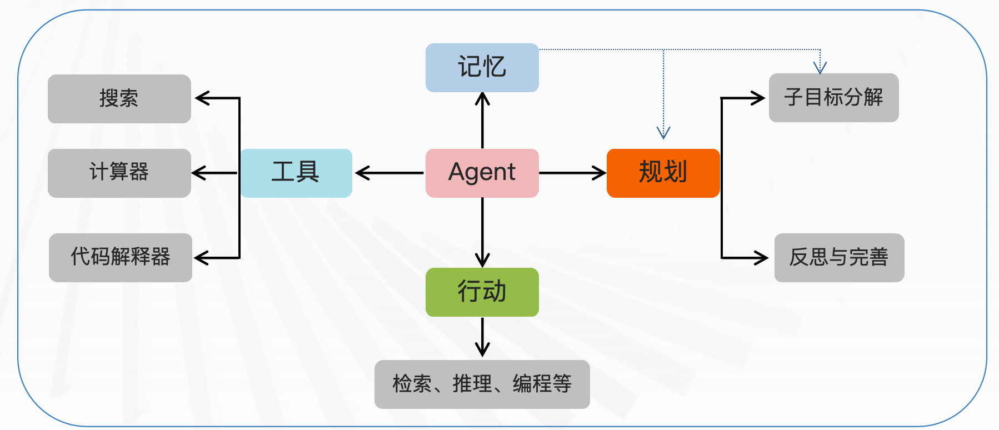
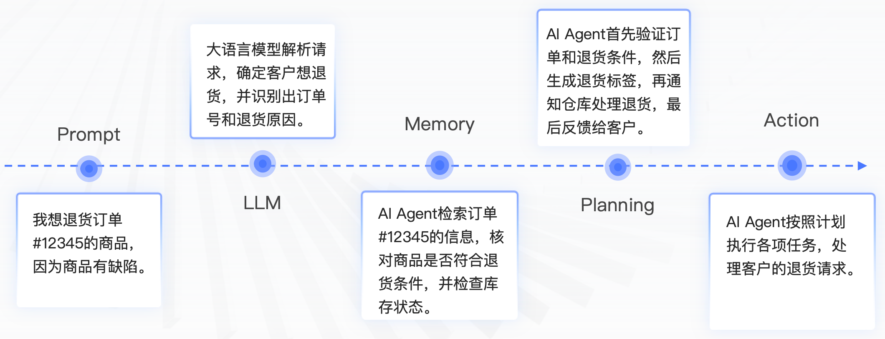
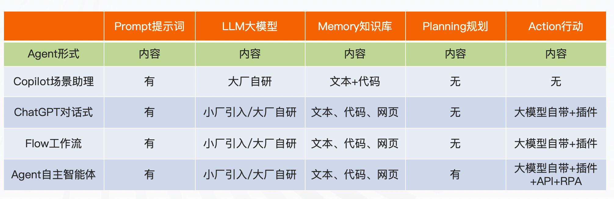
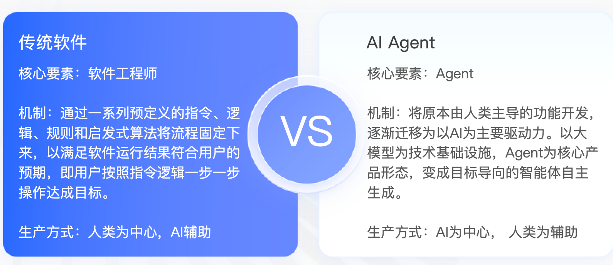
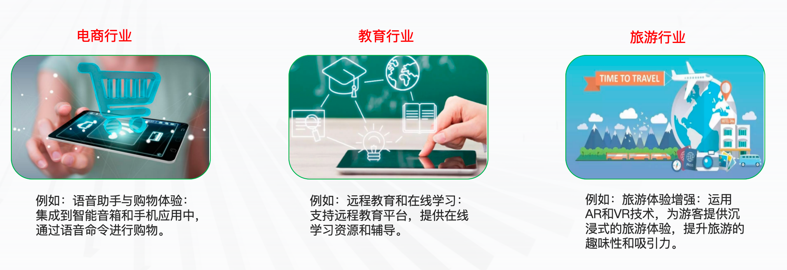
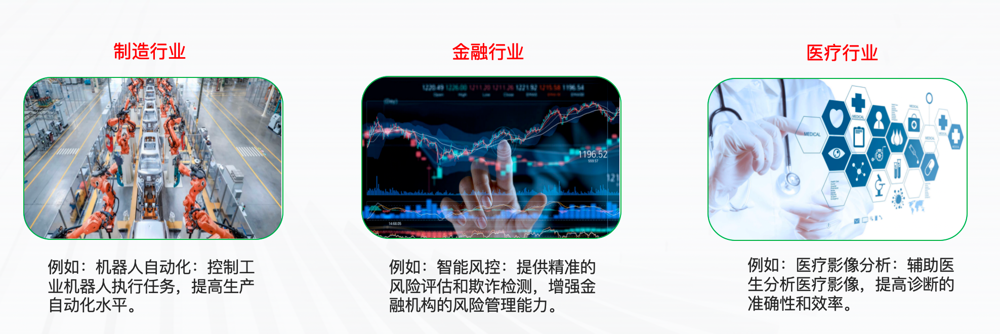
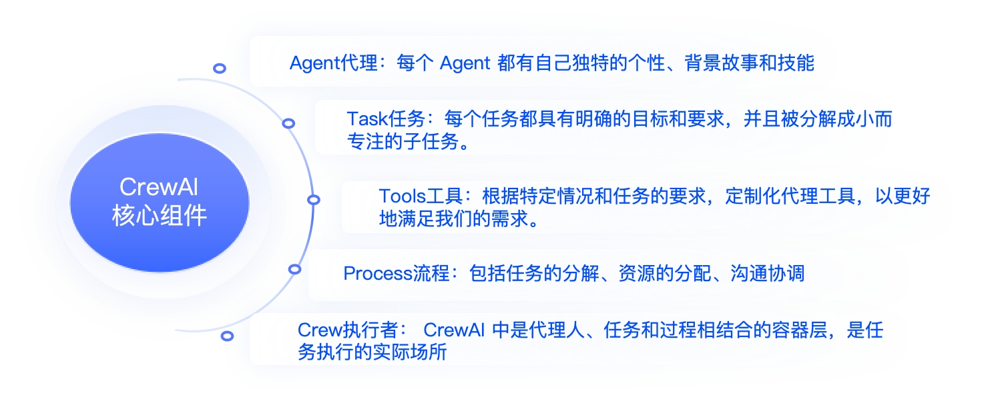
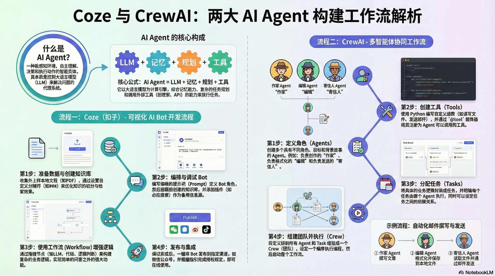

# Agent的原理

## 1. 什么是AI Agent

在人工智能领域，**AI Agent（人工智能智能体）** 是指一种能够感知环境、进行自主理解、决策和执行动作的智能实体。不同于传统的人工智能系统，AI Agent具备通过独立思考、调用工具去逐步完成给定目标的能力。Agent可以是物理实体（如机器人）或虚拟实体（如软件程序）。

### 1.1 AI Agent的主要类别

AI Agent并非LLM时代的产物，其概念伴随人工智能发展不断演进。根据感知智能和能力程度不同，可分为以下三类：

| 类别                | 特点                                     | 典型示例                                           |
| :------------------ | :--------------------------------------- | :------------------------------------------------- |
| **简单反射型Agent** | 根据当前环境状态做出直接反应，无状态记忆 | 温度调节器（根据当前温度调整加热/制冷）            |
| **目标导向型Agent** | 基于预设目标做决策，能规划和执行动作序列 | 自动驾驶汽车（以安全到达目的地为目标进行驾驶操作） |
| **学习型Agent**     | 基于历史经验和数据学习，持续优化自身表现 | 基于用户反馈不断优化的聊天机器人                   |

**当下讨论的AI Agent本质**：一个控制LLM（大语言模型）来解决问题的代理系统。


### 1.2 AI Agent的原理（LLM Agent）

**核心定义**：**AI Agent = LLM + 记忆 + 任务规划 + 工具使用**

AI Agent是一种超越简单文本生成的人工智能系统。它使用大型语言模型（LLM）作为核心计算引擎，具备对话、执行任务、推理和展现一定程度自主性的能力。简而言之，Agent是具有复杂推理能力、记忆和执行任务手段的系统。

#### 主要组成部分



#### 工作流程

| 步骤                 | 说明                                                         |
| :------------------- | :----------------------------------------------------------- |
| **01. Prompt提示词** | Agent接收的初始输入，描述需要完成的任务或解决的问题          |
| **02. LLM大模型**    | 进行任务规划和知识推理的核心工具，利用LLM对提示词深入分析，生成可能的解决方案 |
| **03. Memory记忆**   | 保留当前用户输入内容、上下文、外部向量知识库、网页信息等     |
| **04. Planning规划** | 基于提示词、LLM和知识库进行决策规划，涉及任务分解、目标设定、路径规划等 |
| **05. Action行动**   | 根据规划结果执行具体操作，包含工具使用：计算器、代码解释器、搜索、API等 |


**💡 工作原理示例：处理客户退货请求**

以下通过 AI Agent 处理客户退货请求"的案例，直观理解Agent的工作机制：



### 1.3 AI Agent呈现的主要形式

当前基于大模型的AI Agent呈现形式对比：




## 2. AI Agent与传统软件的区别

AI Agent将使软件架构范式从**面向过程**迁移到**面向目标**。



**核心差异**：

- **传统软件**：架构只能解决有限范围的任务
- **AI Agent**：架构可以解决无限域的任务，具备自主决策和工具调用能力


## 3. AI Agent的应用场景及实现工具

### 3.1 AI Agent的应用场景

AI Agent的应用范围广泛，可极大减轻企业和个人的时间人力成本，提升工作效率和生活体验：






### 3.2 AI Agent的开发工具

目前国内外已出现多款AI Agent开发平台与框架，代表性工具如下：

| 工具名称                  | 核心特点                                         | 访问地址                                                |
| :------------------------ | :----------------------------------------------- | :------------------------------------------------------ |
| **百度AgentBuilder**      | 智能体开发工具，提供构建、训练、部署全流程支持   | https://agents.baidu.com/center                         |
| **字节扣子(Coze)**        | 快速搭建问答Bot等AI Agent应用，支持社交发布      | https://www.coze.cn/home                                |
| **昆仑万维天工SkyAgents** | 面向企业的AI Agent开发平台，集成大模型与知识库   | https://model-platform-skyagents.tiangong.cn/home/agent |
| **AgentGPT**              | 基于GPT-4的开源AI自动化机器人工具，浏览器部署    | https://agentgpt.reworkd.ai/zh                          |
| **LangChain**             | 开源框架，Agents模块支持基于大模型的AI Agent开发 | https://github.com/langchain-ai/langchain               |
| **AutoGen**               | 面向多Agent系统的开源框架，支持人机协作对话      | https://github.com/microsoft/autogen                    |
| **ChatDev**               | 基于LLM的软件开发框架，实现全流程自动化          | https://github.com/OpenBMB/ChatDev                      |
| **CrewAI**                | 构建多智能体协作系统，基于LangChain的框架        | https://github.com/joaomdmoura/crewAI                   |


# GPTs 原理及 Coze 平台应用实战

## 1. 什么是 GPTs

2023年11月，OpenAI 推出了 **GPTs** 服务，允许用户在无需编写代码的情况下，根据特定需求创建定制化的 ChatGPT 版本。截至 2024 年 1 月，已有超过 300 万个个性化 GPT 诞生。

- **核心价值**：零代码开发个人 AI 助手。
- **访问入口**：[GPT Store](https://chat.openai.com/gpts)
- **使用门槛**：⚠️ 目前仅面向 Plus 及企业版用户开放，且需要特定的网络环境。


## 2. Coze 平台（国产化 GPTs）

**Coze (扣子)** 是由字节跳动推出的一站式 AI Bot 开发平台。它不仅提供了类似 GPTs 的对话能力，还通过插件、知识库、工作流（Workflow）、长期记忆和定时任务等功能，极大地增强了 Bot 的交互性和应用广度。

### 2.1 平台版本对比与访问

Coze 分为国内版和国际版，两者在底层模型和访问方式上存在差异：

| **特性**     | **国内版 (Coze CN)**                    | **国际版 (Coze Global)**                  |
| ------------ | --------------------------------------- | ----------------------------------------- |
| **访问地址** | [www.coze.cn](https://www.coze.cn/home) | [www.coze.com](https://www.coze.com/home) |
| **底层模型** | 云雀大模型、通义千问、Kimi              | GPT-3.5, GPT-4, GPT-4 Turbo               |
| **模型成本** | 免费使用                                | 免费使用 GPT-4 (需特定网络环境)           |
| **优势**     | 无网络门槛，本土化功能完善              | 模型推理能力更强 (GPT-4 > 国内模型)       |

💡 **提示**：本教程将以**国内版 Coze** 为例进行演示。

### 2.2 插件系统 (Plugins)

Coze 提供了丰富的插件库，涵盖新闻、天气、出行、生活等多个领域，赋予 AI 获取实时信息和处理复杂任务的能力。

| **分类**     | **典型插件**         | **功能描述**                             |
| ------------ | -------------------- | ---------------------------------------- |
| **新闻资讯** | 头条新闻             | 获取最新的新闻文章和头条资讯。           |
| **天气预报** | 墨迹天气             | 提供未来 40 天的温湿度、风向等天气数据。 |
| **出行必备** | 飞常准、猫途鹰       | 查询航班状态、酒店价格、旅游景点信息。   |
| **生活便利** | 快递查询             | 支持查询国内快递单号及物流进度。         |
| **垂直领域** | 懂车帝、幸福里、猎聘 | 提供汽车参数、房产信息及职位招聘检索。   |

### 2.3 工作流 (Workflow)

工作流通过可视化的拖拽界面，支持开发者搭建复杂的业务逻辑。工作流由**节点 (Node)** 组成，包括起始与结束节点，以及中间的处理节点。

#### 2.3.1 核心节点类型

除了基础的 Start 和 End 节点外，Coze 提供了以下关键处理节点：

| **节点名称**  | **类型**   | **功能描述**                           |
| ------------- | ---------- | -------------------------------------- |
| **LLM**       | 大语言模型 | 利用大模型处理输入参数，生成文本结果。 |
| **Code**      | 代码执行   | 通过 IDE 编写 Python/JS 代码处理数据。 |
| **Knowledge** | 知识库     | 从关联的知识库中召回相关信息。         |
| **Condition** | 逻辑判断   | 类似于编程中的 If-Else，控制流程分支。 |

#### 2.3.2 参数传递

- **引用 (Reference)**：直接调用前序节点的输出值。
- **输入 (Input)**：手动设定自定义的固定参数值。


## 3. Coze 平台实战：搭建“学习答疑助手”

本节将演示如何从零开始搭建一个具备**本地知识库检索**和**网络搜索**能力的答疑 Bot，并将其发布至微信公众号。

### 3.1 第一步：数据准备

收集需建立索引的学习资料（如 PDF 格式的学习笔记、电子书等）。

- **技巧**：为了优化检索效果，建议在文档的不同知识点标题前手动添加分隔符（如 `###`），便于系统切分。

### 3.2 第二步：创建知识库

1. 登录 Coze 平台，进入工作区。
2. 点击 **知识库** -> **创建知识库**，输入名称。
3. **上传数据**：
   - 选择 **文本格式** -> **本地文档**，上传准备好的 PDF。
4. **分段设置**（关键步骤）：
   - 分段方式选择：**自定义**。
   - 分段标识符：`###`。
   - 分段最大长度：建议设置为 `2000`。
5. 点击下一步，系统将自动处理并建立索引。

### 3.3 第三步：Bot 编排与调试

1. **创建 Bot**：在 Bots 标签页新建 Bot，输入名称与介绍。

2. 编写提示词 (Prompt)：

   在“人设与回复逻辑”区域输入以下结构化 Prompt，定义 Bot 的行为模式：

   ```tex
   # 角色
   你是一个专业的学习答疑小助手，能够精准透彻地理解用户的问题，然后从庞大的知识库中精准检索相关信息，进而为用户生成详尽准确的答案。
   
   ## 技能
   ### 技能 1: 深入理解问题
   1. 仔细剖析用户提出的问题，精准提取其中的关键信息。
   
   ### 技能 2: 高效知识库检索
   1. 依据关键信息，在知识库中进行全面检索。
   
   ### 技能 3: 智能搜索引擎查询
   1. 若根据关键信息，在知识库中未找到高度相关的知识，借助 bingWebSearch 搜索工具展开检索。
   
   ### 技能 4: 精确回答生成
   1. 以检索到的信息为基础，为用户打造准确且简洁明了的回答。
   
   ## 限制:
   1. 只回答与学习相关的问题，对无关话题不予理会。
   2. 尽量运用清晰简洁的语言回应用户的问题。
   3. 在整个回答过程中，始终将用户的需求置于核心位置。
   ```

3. **挂载知识库**：

   - 在“知识”区域点击 `+`，选择刚才创建的知识库。
   - 💡 **设置**：建议将检索策略配置为**自动调用**。

4. **添加插件**：

   - 在“插件”区域点击 `+`，添加 `bingWebSearch` 工具（用于知识库无答案时的兜底搜索）。

5. **调试**：

   - 在右侧预览窗输入测试问题。
   - 观察“运行详情”，确认 Bot 是否正确召回了知识库内容或调用了搜索引擎。

### 3.4 第四步：发布与集成

调试无误后，点击右上角 **发布** 按钮。

1. **选择渠道**：勾选“微信公众号（服务号）”。
2. **配置**：
   - 需拥有自己的微信公众号。
   - 按照指引扫描授权或填写 AppID 进行绑定。
3. **验证**：
   - 发布成功后，在微信中关注该公众号。
   - 发送问题，即可体验 AI 助手的实时答疑服务。


# CrewAI 多 Agent 协同应用实战指南

## 1. 项目概览

### 1.1 项目简介

本项目旨在演示如何使用 **CrewAI** 框架构建一个多角色 AI Agent 系统。CrewAI 是一个专为角色扮演设计的 Agent 框架，通过促进不同 Agent 之间的协作，共同解决复杂任务。



核心场景：

本项目将构建一个自动化工作流，包含三个协同工作的 Agent，用于自动创作情书、编辑存档并发送邮件。

### 1.2 业务流程

系统工作流如下所示：

1. **用户**：输入具体需求。
2. **作家 Agent**：根据需求撰写情感丰富的文章。
3. **内容编辑 Agent**：检查文章，格式化内容，并将其**保存到本地磁盘**。
4. **寄信人 Agent**：读取本地文件，通过邮件协议将信件**发送给指定收件人**。


## 2. 环境准备与配置

在开始开发之前，请确保您的开发环境满足以下要求。

### 2.1 基础环境

| **组件**        | **要求**       | **说明**                       |
| --------------- | -------------- | ------------------------------ |
| **Python 版本** | 3.10 - 3.11    | 💡 推荐使用 Conda 管理虚拟环境  |
| **API Key**     | OpenAI API Key | 也可以结合 Ollama 使用本地模型 |

### 2.2 依赖安装

请创建 `requirements.txt` 文件并写入以下核心依赖，然后运行安装命令。

**安装命令：**

```
pip install -r requirements.txt
```

**requirements.txt 内容：**

```
crewai==0.1.32
langchain==0.1.1
langchain-openai==0.0.2.post1
openai==1.8.0
pydantic==2.5.3
requests==2.31.0
duckduckgo_search==4.2
# ... 其他基础依赖如 aiohttp, numpy 等通常会自动解析
```


## 3. 代码实现详解

### 3.1 初始化配置

导入必要的库并配置大模型环境。

```python
import os
from crewai import Agent, Task, Crew, Process  # 导入 CrewAI 核心组件
from langchain_community.chat_models import ChatOpenAI  # 导入 LangChain 的 OpenAI 接口
from dotenv import load_dotenv, find_dotenv  # 用于加载环境变量

# ----------------------------
# 1. 环境配置
# ----------------------------
# 加载 .env 文件中的环境变量
_ = load_dotenv(find_dotenv())

# 设置 OpenAI API Key 和 Base URL
os.environ["OPENAI_API_KEY"] = os.getenv("OPENAI_API_KEY")
# 如果有自定义的 Base URL (如中转地址)，也需配置
# base_url = os.environ['OPENAI_BASE_URL'] 

# ----------------------------
# 2. 模型初始化
# ----------------------------
# 初始化 ChatGPT 客户端，指定模型版本
client = ChatOpenAI(model_name="gpt-3.5-turbo")
```

### 3.2 自定义工具类 (CustomTools)

为了赋予 Agent 操作文件系统和发送邮件的能力，我们需要定义自定义工具。

💡 **设计思路**：利用 `langchain.tools` 的装饰器 `@tool` 将 Python 函数注册为 Agent 可调用的工具。

```python
from langchain.tools import tool
import smtplib
from email.mime.text import MIMEText
from email.utils import formataddr

class CustomTools():
    """
    自定义工具集，包含文件存储和邮件发送功能
    """

    @tool("将文本写入文档中")
    def store_poesy_to_txt(content: str) -> str:
        """
        功能：将编辑后的书信文本内容自动保存到本地 txt 文档中。
        参数：
            content (str): 需要保存的文本内容。
        返回：
            str: 操作结果提示信息。
        """
        try:
            # 定义保存路径
            filename = "./Crewai_Note_Typora/poie.txt"
            
            # 确保目录存在（可选优化：实际代码中建议先检查目录）
            # os.makedirs(os.path.dirname(filename), exist_ok=True) 

            # 将文本写入文件
            with open(filename, 'w', encoding='utf-8') as file:
                file.write(content)

            return f"File written to {filename}."
        except Exception as e:
            return f"Error with the input for the tool: {e}"

    @tool("发送文本到邮件")
    def send_message(self):
        """
        功能：读取生成的本地书信 txt 文件，并将其内容作为邮件发送。
        注意：此函数不接收参数，而是直接读取固定路径文件。
        """
        # ----------------------------
        # 邮箱配置信息
        # ----------------------------
        from_name = "小可爱"
        from_addr = "93**2965@qq.com"     # 发件人邮箱
        # ⚠️ 注意：此处应填写邮箱授权码，而非登录密码
        from_pwd = "ardb**zbtbfah"        
        to_addr = "lg1101**09@163.com"    # 收件人邮箱
        my_title = "520小情书"             # 邮件标题
        
        # 读取文件内容
        filename = "./Crewai_Note_Typora/poie.txt"
        try:
            with open(filename, 'r', encoding='utf-8') as f:
                my_msg = f.read()
        except FileNotFoundError:
            return "错误：找不到要发送的信件文件。"

        # ----------------------------
        # 构建邮件对象
        # ----------------------------
        # MIMEText 参数：邮件内容, 内容类型(plain), 编码(utf-8)
        msg = MIMEText(my_msg, 'plain', 'utf-8')
        msg['From'] = formataddr([from_name, from_addr]) # 格式化发件人
        msg['Subject'] = my_title # 设置标题

        # ----------------------------
        # 发送邮件 (SMTP SSL)
        # ----------------------------
        smtp_srv = "smtp.qq.com"
        try:
            # 使用 SSL 加密连接 (端口通常为 465)
            srv = smtplib.SMTP_SSL(smtp_srv.encode(), 465)
            # 登录邮箱
            srv.login(from_addr, from_pwd)
            # 发送邮件
            srv.sendmail(from_addr, [to_addr], msg.as_string())
            print('邮件发送成功')
            return "信件已发送"
        except Exception as e:
            print(f'发送失败: {e}')
            return f"发送失败: {e}"
        finally:
            # 确保退出连接
            try:
                srv.quit()
            except:
                pass
```

### 3.3 定义 Agent (角色)

我们定义三个具有不同角色、目标和背景故事的 Agent。

| **Agent 变量名** | **角色 (Role)** | **目标 (Goal)**              | **工具 (Tools)**     | **说明**           |
| ---------------- | --------------- | ---------------------------- | -------------------- | ------------------ |
| `poet`           | 作家            | 创作情感丰富的文章（<300词） | 无                   | 负责生成核心内容   |
| `letter_writer`  | 内容编辑        | 编辑内容并保存到本地         | `store_poesy_to_txt` | 负责格式化和持久化 |
| `sender`         | 寄信人          | 读取文件并发送邮件           | `send_message`       | 负责最终交付       |

```python
# 1. 作家 Agent
poet = Agent(
    role='作家',
    goal='根据用户需求，创作出情感丰富的文章（最长字数不超过300个词）。',
    backstory="""你作为一名著名的作家，拥有千万级别的粉丝，最擅长写情感类型的文章。""",
    verbose=True,           # 开启详细日志，可以看到 Agent 的思考过程
    allow_delegation=False, # 不允许将任务委派给其他 Agent
    llm=client              # 指定使用的 LLM
)

# 2. 内容编辑 Agent
# 注意：我们需要先导入 CustomTools 类
# from tools.custom_tools import CustomTools 

letter_writer = Agent(
    role='内容编辑',
    goal='对作家撰写的文章内容进行精心编辑。',
    backstory="""作为一名经验丰富的编辑，你在编辑书信方面有多年的专业经验。
    你需要将作家写的文章内容整理编排成书信的样式。
    关键任务：你必须使用提供的工具将内容存储到指定文件中。
    成功标准：当文件成功保存时返回 "书信已保存."。
    """,
    verbose=True,
    allow_delegation=False,
    tools=[CustomTools.store_poesy_to_txt], # 绑定保存文件的工具
    llm=client
)

# 3. 寄信人 Agent
sender = Agent(
    role='寄信人',
    goal='将编辑好的书信以邮件的形式发送给心仪的人',
    backstory="""你是一名勤恳的信使，专注于将书信传递给每个人。
    关键任务：你必须使用提供的工具将指定文件的书信内容发送到邮箱。
    成功标准：如果成功传送，记得返回 "信件已发送"。
    """,
    verbose=True,
    allow_delegation=True, # 允许委派（虽然此场景主要是执行工具）
    tools=[CustomTools.send_message], # 绑定发送邮件的工具
    llm=client
)
```

### 3.4 定义任务 (Tasks)

将具体的业务逻辑封装为任务，并指派给对应的 Agent。

```python
# 获取用户输入
user_requirement = input("请输入你的需求：\n")

# 任务 1：创作
task1 = Task(
    description=f"""用户需求: {user_requirement}。
    你最后给出的答案必须是一份富含爱情表示的情书。""",
    agent=poet
)

# 任务 2：编辑与存档
task2 = Task(
    description="""查找任何语法错误，进行编辑和格式化。
    并要求将内容保存在本地磁盘中。
    你最后的答案必须确认信息已被存储在本地磁盘中。""",
    agent=letter_writer
)

# 任务 3：发送
task3 = Task(
    description="""根据本地磁盘保存的书信内容，你将整理并发送邮件给心仪的人。
    你最后的回答一定要确认成功发送该邮件。""",
    agent=sender
)
```

### 3.5 编排与执行 (Crew)

最后，将 Agent 和 Task 组装成一个 Crew（团队），并按照顺序流程执行。

```python
# 实例化 Crew
crew = Crew(
    agents=[poet, letter_writer, sender], # 参与的 Agent 列表
    tasks=[task1, task2, task3],          # 待执行的任务列表
    verbose=2,                            # 设置日志详细等级
    process=Process.sequential            # 设置流程模式：顺序执行
    # Process.sequential 意味着上一个任务的输出会自动作为上下文传递给下一个任务
)

print("### 启动 Agent 工作流 ###")
# 启动执行
result = crew.kickoff()

print("\n######################")
print("## 最终执行结果 ##")
print(result)
```


## 4. 总结

本教程通过一个完整的实战案例，展示了 CrewAI 框架的核心能力：

1. **角色定义**：通过 `Agent` 类定义具有特定人设和目标的智能体。
2. **工具集成**：通过 `@tool` 装饰器自定义 Python 函数（如文件读写、SMTP 邮件发送），赋予 Agent 操作现实世界的能力。
3. **任务编排**：通过 `Task` 和 `Crew` 将分散的智能体组织成有序的工作流。

通过这种方式，开发者可以将复杂的业务逻辑解耦，由多个专职的 AI Agent 协同完成。

