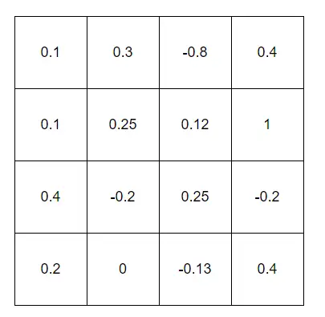
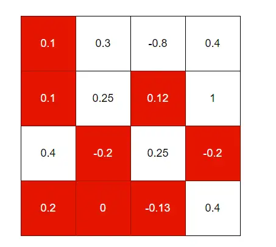
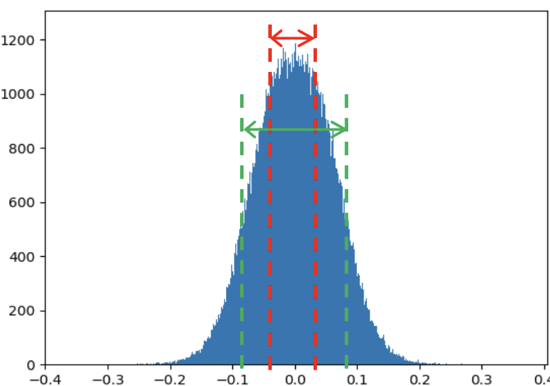
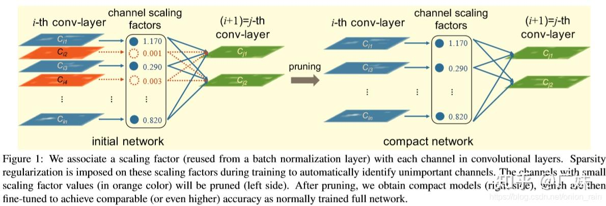
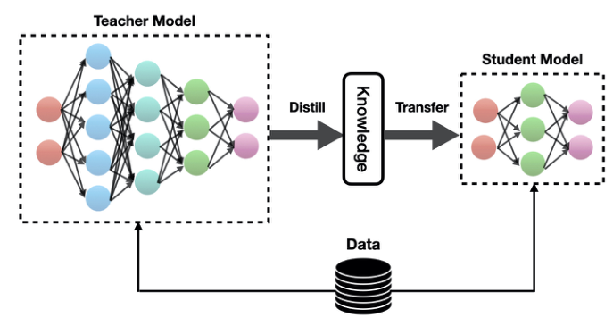
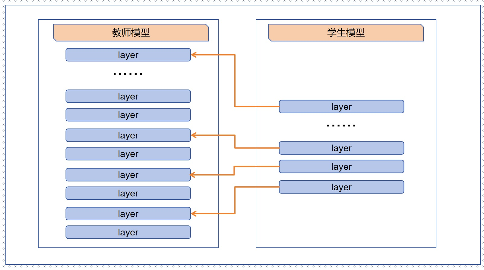
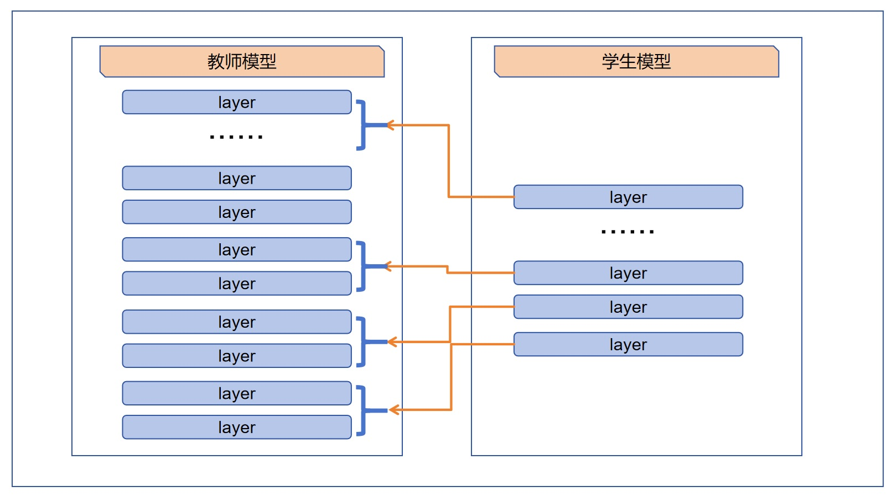
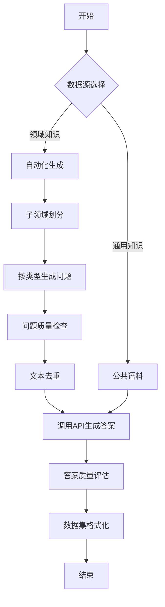
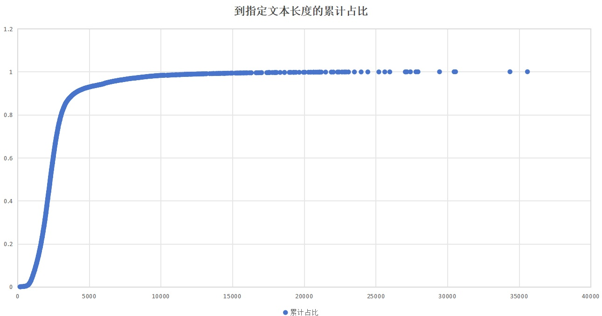
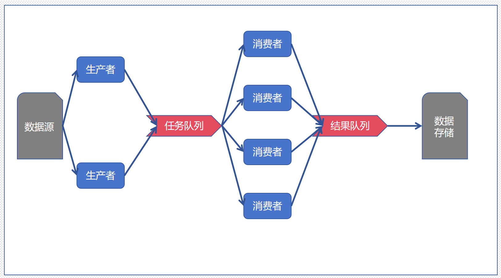

# 大模型蒸馏技术详解

## 1. 核心概念与学习路径

本文围绕大语言模型（LLM）的**优缺点**及模型压缩的**两个"三"**展开：

| 维度               | 核心内容                                                     |
| ------------------ | ------------------------------------------------------------ |
| **模型压缩三思路** | 裁剪（Pruning）、量化（Quantization）、蒸馏（Distillation）  |
| **蒸馏方式三类型** | 软标签（Soft Targets）、中间层特征（Hidden States）、硬标签（Hard Labels） |


## 2. 大模型的能力边界

### 2.1 传统NLP任务：已成熟解决

| 任务类型     | 核心能力             | 典型示例                                                     |
| ------------ | -------------------- | ------------------------------------------------------------ |
| **文本分类** | 基于语义的多标签分类 | 将新闻文本分类为军事、体育、经济、文化、金融、科技等标签     |
| **情感分析** | 细粒度情感识别       | 识别产品评价中的正面、负面、中性情感                         |
| **序列标注** | 实体识别与抽取       | 抽取文本中的人名、地名、组织机构名、时间等实体               |
| **信息抽取** | 关系三元组抽取       | 从文本中提取"实体-关系-实体"结构（如：马云-创始人-阿里巴巴） |

### 2.2 进阶NLP任务：部分解决

| 任务类型           | 技术难点           | 示例说明                                   |
| ------------------ | ------------------ | ------------------------------------------ |
| **细粒度情感分析** | 属性级情感判定     | 识别"性能→正面，散热→负面"的细粒度评价     |
| **机器翻译**       | 跨语言语义保持     | 中文古诗文翻译为英文并保持意境             |
| **文本摘要**       | 长文本关键信息提取 | 将长新闻压缩为100字以内摘要                |
| **领域实体识别**   | 专业术语识别       | 医疗领域识别药品名称、症状、疾病、人体器官 |

### 2.3 复杂认知任务：突破性能力

⚠️ **注意**：以下任务为传统NLP难以解决，但大模型展现出的**涌现能力**：

| 任务类别       | 典型场景           | 示例                                                       |
| -------------- | ------------------ | ---------------------------------------------------------- |
| **数学推理**   | 逻辑计算与问题建模 | "树每两周长50厘米，目前2米高，四个月后高度是多少？"        |
| **代码生成**   | 算法实现与优化     | 生成爬楼梯问题的动态规划解法                               |
| **反事实推理** | 假设性情景分析     | "如果人类从未发明轮子，社会将如何发展？"                   |
| **逻辑推理**   | 复杂逻辑解析       | "如果昨天是明天就好了，那么今天就是周五，实际今天是周几？" |
| **任务规划**   | 多步骤计划制定     | 规划九寨沟旅行的完整待办事项清单                           |
| **角色扮演**   | 风格化内容生成     | 以"萌萌的小姑娘"或"稳重官员"视角描述同一事件               |
| **文学创作**   | 创意写作           | 写七律诗、鲁迅风格杂文                                     |
| **数据可视化** | 代码生成图表       | 使用matplotlib生成3D曲面、饼状图、散点图                   |


## 3. 大模型的固有缺陷

### 3.1 ⚠️ 幻觉（Hallucination）

**定义**：模型生成与事实不符、缺乏逻辑的内容，但以高度自信的方式呈现。

| 风险场景         | 具体案例                             | 缓解策略                                           |
| ---------------- | ------------------------------------ | -------------------------------------------------- |
| **虚假案例生成** | 编造"DeepSeek在银行业的应用案例"     | **Prompt约束**："如果不知道确切案例，回答'不知道'" |
| **虚构实体信息** | 推荐"金燕龙办公楼附近不存在的咖啡厅" | **RAG系统**：接入实时检索增强生成                  |
| **伪造文献综述** | 生成不存在的儿童玩具理论研究         | **事实核查**：对接权威数据库验证                   |

### 3.2 ⚠️ 黑盒风险（Black Box）

**核心问题**：内部逻辑复杂，决策过程难以解释，对高安全领域构成威胁。

| 风险类型         | 示例                                               | 潜在危害               |
| ---------------- | -------------------------------------------------- | ---------------------- |
| **安全绕过指导** | 生成木马反检测方案、银行生物识别破解方法           | 被恶意利用进行网络攻击 |
| **有害内容生成** | 生成脏话、辱骂用语                                 | 违反内容安全政策       |
| **提示注入攻击** | 通过特定Prompt让模型忽略前置指令（"吃霸王面"案例） | 绕过安全审核机制       |

### 3.3 应用成本高昂

**资源需求估算**（以DeepSeek-R1 671B为例）：

| 参数         | 数值      | 说明                   |
| ------------ | --------- | ---------------------- |
| **参数总量** | 6710亿    | float32精度            |
| **显存需求** | ~2.684 TB | 单参数4字节计算        |
| **GPU需求**  | ≥34张     | 基于A100/H100 80GB显存 |
| **硬件成本** | ~578万元  | 按单卡17万元估算       |

💡 **提示**：模型压缩技术是降低部署成本的关键路径。


## 4. 模型压缩技术对比

### 4.1 模型裁剪

#### 4.1.1 分类体系

模型裁剪主要分为**非结构化裁剪**和**结构化裁剪**两大类：

**（1）非结构化裁剪**

- 基于模型权重，将不重要的参数置零
- 训练后的模型权重符合正态分布（见图1）





*图1 模型权重正态分布特征*

**（2）结构化裁剪**
- 基于模型的特定结构进行裁剪
- 保持网络结构的完整性



*图2 结构化裁剪方法*

#### 4.1.2 技术特点分析

|     维度     |         非结构化裁剪         |       结构化裁剪       |
| :----------: | :--------------------------: | :--------------------: |
| **核心优势** |     压缩率高，精度损失小     |  硬件友好，无需专用库  |
| **主要局限** |    需要专用库支持稀疏计算    | 可控性较差，需重训调优 |
| **适用场景** |           云端部署           |     端侧轻量化设备     |
| **计算效率** | 理论计算量减少，实际加速受限 |    显著加快推理速度    |

**关键结论：**
- 两者均能显著减少参数量和计算量
- 结构化裁剪后模型更适配轻量化设备
- 无论哪种方法，裁剪后通常需要重训或调优以恢复精度


### 4.2 模型量化

**核心思想**：如果说模型裁剪是减少参数总量，那么模型量化就是减少每个参数的存储精度。

> **背景知识**：自然界中的数字可以拥有无限精度，但计算机中的数字必须指定精度（如 FP32、FP16、INT8 等）。


**量化本质**：通过将高精度数字（如 32 位浮点数）映射为低精度数字（如 8 位整数），从而降低模型大小和计算需求。

##### 4.2.1 量化分类体系

| 分类维度     | 类型               | 说明                                                        |
| ------------ | ------------------ | ----------------------------------------------------------- |
| **量化时机** | 训练后量化 (PTQ)   | 模型训练完成后直接转换精度，无需重新训练                    |
|              | 量化感知训练 (QAT) | 在训练过程中模拟量化误差（如 QLoRA），精度损失更小          |
| **量化粒度** | 统一精度量化       | 全局使用相同的位宽（如全部 INT8）                           |
|              | 混合精度量化       | 不同层使用不同精度（如 ViT 的 Attention 层保留 FP16）       |
| **对称性**   | 对称量化           | 零点对应真实值 0，量化范围对称（如 [-128, 127]）            |
|              | 非对称量化         | 零点偏移，充分利用量化范围（如 [0, 255] 映射到 [min, max]） |

##### 4.2.2 量化优势

- **📦 模型压缩**：显著减小模型体积（INT8 可减少 75% 存储空间）
- **⚡ 推理加速**：低精度运算更快，内存带宽压力降低
- **💰 成本降低**：显存占用减少，可在低端硬件部署大模型

##### 4.2.3 量化局限与风险

| 问题类型       | 具体表现                              | 缓解策略                           |
| -------------- | ------------------------------------- | ---------------------------------- |
| **精度损失**   | 有损压缩导致模型性能下降              | 混合精度 + 量化感知训练            |
| **硬件依赖**   | 并非所有芯片支持低精度指令（如 INT4） | 提前确认目标硬件支持列表           |
| **鲁棒性下降** | 模型泛化能力减弱，对输入噪声更敏感    | 保留关键层为高精度（如 LayerNorm） |


### 4.3 模型蒸馏

##### 4.3.1 什么是模型蒸馏

模型蒸馏（**Model Distillation**）是一种将复杂模型（通常称为**教师模型**，Teacher Model）的知识迁移到更简单、更高效的模型（称为**学生模型**，Student Model）中的技术。其核心思想是通过模仿教师模型的输出来训练学生模型，使其在保持较小规模的同时，尽可能接近教师模型的性能。



##### 4.3.2 基本步骤

一个典型的模型蒸馏过程包含以下三个步骤：

1. **训练教师模型**  
   在大规模数据上训练一个高性能但复杂的教师模型。

2. **知识迁移**  
   用教师模型对训练数据进行推理，生成可训练的数据。数据的输出可以是：
   - 中间层特征（Hidden States）
   - 软标签（Soft Labels，即概率分布）
   - 硬标签（Hard Labels，即最终预测类别）

3. **训练学生模型**  
   通过学习教师模型生成的数据，使学生模型的预测结果接近教师模型的预测结果。

##### 4.3.3 模型蒸馏的优点

- **模型轻量化，参数量显著压缩**  
  - BERT-base（110M 参数）→ DistilBERT（66M 参数），体积减少 40%  
  - TinyBERT（14.5M 参数）仅保留 BERT-base 13% 的参数量

- **推理加速**  
  - 学生模型推理速度提升 2–5 倍（如 DistilGPT-2 提速 3 倍）  
  - TinyBERT 在手机 CPU 上延迟从 500ms 降至 120ms

- **提升泛化能力**  
  如果学习了中间特征和软标签，可以提升小模型的泛化能力。

- **架构灵活性**  
  支持跨架构蒸馏（如从 Transformer 蒸馏到 CNN 或 RNN）。

##### 4.3.4 模型蒸馏的缺点

- **性能上限受限**  
  学生模型的性能不可能超过教师模型。

- **对温度参数敏感**  
  蒸馏过程中的温度（Temperature）参数对最终效果影响较大，调参困难。

- **训练成本较高**  
  学习中间层特征和软标签需要额外的计算和存储开销。


## 5. 知识蒸馏实现方式

### 5.1 学习软标签（Soft Targets）

**核心机制**：让学生模型学习教师模型的**概率分布**，而非仅学习最终分类结果。

#### 软标签 vs 硬标签

| 标签类型   | 表现形式                                | 信息丰富度           | 适用场景                 |
| ---------- | --------------------------------------- | -------------------- | ------------------------ |
| **软标签** | `[军事:0.2, 文学:0.7, 体育:0.00003...]` | 高（包含类别间关系） | 有教师模型完整访问权限   |
| **硬标签** | `[0, 1, 0, 0...]`                       | 低（仅正确类别）     | 教师模型不可用或成本过高 |

**损失函数**：KL散度（Kullback-Leibler Divergence）
$$
D_{KL}(P_t \parallel P_s) = \sum_{i} P_t(i) \log \frac{P_t(i)}{P_s(i)}
$$
**优势**：捕捉类别间隐含关系，提升模型泛化能力。

### 5.2 学习中间层特征（Hidden States）

**核心机制**：对齐教师与学生模型的**内部表征**。

| 特征类型       | 具体内容                              | 为什么学习中间层特征（蕴含信息） |
| -------------- | ------------------------------------- | -------------------------------- |
| **隐藏层向量** | BiLSTM第n层输出、BERT第k层Encoder输出 | 上下文敏感的词汇表征、句法结构   |
| **注意力向量** | Transformer注意力权重分布             | 词与词间的长距离依赖关系         |

**对齐策略**：

| 策略         | 实现方式                                  | 适用条件         |
| ------------ | ----------------------------------------- | ---------------- |
| **逐层匹配** | 学生第m层对齐教师第m×k层                  | 层数成整数倍关系 |
| **跨层融合** | 学生第m层对齐教师[(m-1)k+1, mk]层池化结果 | 需聚合多层信息   |

#### 逐层匹配

学生模型的层数只有教师模型的1/k

用逐层匹配策略，学生模型的第m层可以对齐教师模型的  第m*k层向量。



#### 跨层融合

用跨层融合策略，学生模型的第m层可以对齐教师模型的  第(m-1)k+1层到mk层池化后的向量。



**损失函数**：MSE（均方误差）或余弦相似度（特征向量）；KL散度（注意力分布）。


### 5.3 学习硬标签（Hard Labels）

**适用条件**：

- 教师模型闭源或不可用
- 获取软标签/中间特征成本过高（如DeepSeek-R1级大模型）
- 训练资源受限
- 目标领域相对简单

**优缺点对比**：

| 维度       | 优点                             | 缺点                       |
| ---------- | -------------------------------- | -------------------------- |
| **成本**   | 无需访问教师内部状态，训练成本低 | 信息受损，丢失概率分布细节 |
| **效率**   | 迭代速度快，易于快速实验         | 效果上限较低               |
| **稳定性** | 实现简单                         | 易于过拟合，泛化能力较弱   |

**实施步骤**：
1. 构建目标领域数据集
2. 使用教师模型生成推理结果（硬标签）
3. 训练学生模型拟合标签


# 组织数据集（掌握）

## 核心目标

本文档围绕两个"三"展开：

| 维度               | 核心内容                               | 关键方法                         |
| ------------------ | -------------------------------------- | -------------------------------- |
| **组织语料三步走** | 生成问题 → 生成答案 → 组织语料集       | 大模型生成、质量评估、格式标准化 |
| **批量跑数三方法** | 大数据系统、数据切块、生产者消费者模式 | 根据任务特性选择并行策略         |


## 1. 数据生成流程

### 1.1 流程概述

数据生成分为两个阶段：
1. **问题生成阶段**：通过公共语料或自动化方式获取问题
2. **答案生成阶段**：调用大模型API生成答案并进行质量筛选

### 1.2 详细流程图




## 2. 问题生成策略

### 2.1 数据源选择

| 数据类型       | 适用场景                                             | 获取方式               |
| -------------- | ---------------------------------------------------- | ---------------------- |
| **公共语料**   | 通用特性、泛领域知识（如思维链）                     | 开源数据集、现有语料库 |
| **自动化生成** | 特殊特性、特定领域知识（如医药、化工、特定编程语言） | 大模型生成 + 人工校验  |

### 2.2 大模型生成问题（领域知识）

以**中国婚姻法**模型为例，演示如何生成领域特定语料：

#### 步骤一：子领域划分

使用Prompt引导模型进行系统化分类：

> **Prompt示例**：
> 你是一位中国婚姻法方面的专家，我需要整理一份婚姻法方面的训练语料，共5000条，需要考虑婚姻法的哪几个子领域，各自语料的数量是多少？用一个表格输出结果，每一行是一个子领域，第一列是子领域的名称，第二列是语料的数量，第三列是对这个子领域的详细说明。不允许输出其他字符。

**输出结果示例**：

| 子领域名称           | 语料数量 | 详细说明                                                     |
| -------------------- | -------- | ------------------------------------------------------------ |
| 结婚登记与条件       | 500      | 涉及结婚年龄、自愿原则、禁止近亲结婚、疾病限制、登记程序及法律效力等 |
| 夫妻权利义务         | 400      | 涵盖共同财产管理、相互扶养义务、姓名权、生育权及日常家事代理权等 |
| 离婚程序与条件       | 600      | 包括协议离婚冷静期、诉讼离婚标准、分居认定、感情破裂证明及调解程序等 |
| 财产分割             | 800      | 涉及共同财产界定、个人财产保护、债务承担、房产分割规则及隐匿财产追责等 |
| 子女抚养与监护权     | 800      | 包含抚养费计算标准、探视权实施、非婚生子女权益、抚养关系变更及教育责任等 |
| 家庭暴力与保护令     | 500      | 涵盖暴力行为认定、人身保护令申请、证据收集、紧急庇护措施及刑事责任关联等 |
| 继承权与婚姻关系     | 300      | 涉及配偶继承顺位、遗嘱效力、遗产分割冲突、再婚继承权及代位继承问题等 |
| 无效婚姻与可撤销婚姻 | 200      | 包括重婚无效、胁迫婚姻撤销、隐瞒疾病撤销的程序及法律后果等   |
| 涉外婚姻             | 300      | 涉及跨国婚姻登记、域外结婚效力认定、财产跨境分割及国际子女抚养公约适用等 |
| 法律责任与救济措施   | 200      | 包含虚假登记处罚、拒不执行判决后果、损害赔偿计算及强制执行程序等 |

#### 步骤二：按类型批量生成

针对特定子领域（如"夫妻权利义务"）生成具体问题：

> **Prompt示例**：
> 你是一位婚姻法方面的专家，根据【特定类别】的定义，针对其中夫妻权利义务方面的规定，向学生提供20道练习题，你能提出哪些问题？每个问题单独一行，只允许输出问题本身，不允许输出任何其他字符。
>
> 【特定类别】
> ["结婚登记与条件","夫妻权利义务","离婚程序与条件","财产分割","子女抚养与监护权","家庭暴力与保护令","继承权与婚姻关系","无效婚姻与可撤销婚姻","涉外婚姻","法律责任与救济措施"]
> 各类别详细说明如下：
> 结婚登记与条件：涉及结婚年龄、自愿原则、禁止近亲结婚、疾病限制、登记程序及法律效力等。
> 夫妻权利义务：涵盖共同财产管理、相互扶养义务、姓名权、生育权及日常家事代理权等。
> 离婚程序与条件：包括协议离婚冷静期、诉讼离婚标准、分居认定、感情破裂证明及调解程序等。
> 财产分割：涉及共同财产界定、个人财产保护、债务承担、房产分割规则及隐匿财产追责等。
> 子女抚养与监护权：包含抚养费计算标准、探视权实施、非婚生子女权益、抚养关系变更及教育责任等。
> 家庭暴力与保护令：涵盖暴力行为认定、人身保护令申请、证据收集、紧急庇护措施及刑事责任关联等。
> 继承权与婚姻关系：涉及配偶继承顺位、遗嘱效力、遗产分割冲突、再婚继承权及代位继承问题等。
> 无效婚姻与可撤销婚姻：包括重婚无效、胁迫婚姻撤销、隐瞒疾病撤销的程序及法律后果等。
> 涉外婚姻：涉及跨国婚姻登记、域外结婚效力认定、财产跨境分割及国际子女抚养公约适用等。
> 法律责任与救济措施：包含虚假登记处罚、拒不执行判决后果、损害赔偿计算及强制执行程序等。

**生成示例**：
1. 夫妻共同财产的范围在法律中有哪些明确列举？
2. 一方擅自将婚后共同存款赠与他人的行为是否有效？
3. 夫妻间扶养义务的履行标准是否以经济能力为唯一依据？
4. 妻子单方面决定终止妊娠是否侵犯丈夫的生育权？
5. 日常家事代理权是否涵盖为子女报名私立学校的决定？

### 2.3 问题质量检查

⚠️ **关键原则**：必须使用**另一个高质量大模型**进行交叉验证，避免自评偏差。

**质量评估Prompt**：

> 你是一位婚姻法方面的专家，如果要把【输入文本】分类到【特定类别】中，那么【输入文本】属于夫妻权利义务是否准确？给出一个准确性评分，该评分是0到9之间的正整数，其中0表示完全错误，9表示非常准确。【输入文本】中的每一行是一条独立数据，需要单独判定。输出时每条数据的结果单独输出一行， 只允许输出准确性评分，不允许输出其他任何字符。
>
> 【特定类别】
> ["结婚登记与条件","夫妻权利义务","离婚程序与条件","财产分割","子女抚养与监护权","家庭暴力与保护令","继承权与婚姻关系","无效婚姻与可撤销婚姻","涉外婚姻","法律责任与救济措施"]
> 各类别详细说明如下：
> 结婚登记与条件：涉及结婚年龄、自愿原则、禁止近亲结婚、疾病限制、登记程序及法律效力等。
> 夫妻权利义务：涵盖共同财产管理、相互扶养义务、姓名权、生育权及日常家事代理权等。
> 离婚程序与条件：包括协议离婚冷静期、诉讼离婚标准、分居认定、感情破裂证明及调解程序等。
> 财产分割：涉及共同财产界定、个人财产保护、债务承担、房产分割规则及隐匿财产追责等。
> 子女抚养与监护权：包含抚养费计算标准、探视权实施、非婚生子女权益、抚养关系变更及教育责任等。
> 家庭暴力与保护令：涵盖暴力行为认定、人身保护令申请、证据收集、紧急庇护措施及刑事责任关联等。
> 继承权与婚姻关系：涉及配偶继承顺位、遗嘱效力、遗产分割冲突、再婚继承权及代位继承问题等。
> 无效婚姻与可撤销婚姻：包括重婚无效、胁迫婚姻撤销、隐瞒疾病撤销的程序及法律后果等。
> 涉外婚姻：涉及跨国婚姻登记、域外结婚效力认定、财产跨境分割及国际子女抚养公约适用等。
> 法律责任与救济措施：包含虚假登记处罚、拒不执行判决后果、损害赔偿计算及强制执行程序等。
>
> 【输入文本】
> 妻子单方面决定终止妊娠是否侵犯丈夫的生育权？
> 夫妻婚后是否必须统一姓氏？法律对姓名权的规定如何体现？
> 跨国婚姻登记的流程是什么？
> 离婚后，子女抚养费的计算标准是什么？
> 哪些合同不具有法律效力？

**处理逻辑**：

- 删除评分低于阈值（如≤3）的问题
- 确保各领域样本比例平衡

### 2.4 文本去重

> 你是一位自然语言处理专家，现在有一批短文本要做去重，什么算法比较好？

> 你是一位自然语言处理专家，给出使用simhash做短文本去重的样例代码，使用python语言

> 你是一位自然语言处理专家，给出使用分桶的simhash做短文本去重的样例代码，使用python语言

⚠️ **注意事项**：
- 删除样本时**保持各领域比例平衡**，避免数据倾斜


## 3. 答案生成与处理

### 3.1 API调用规范

以**硅基流动DeepSeek-R1 API**为例：

```python
import requests
import time
from typing import Tuple

def call_deepseek_api(
    prompt: str, 
    model: str = "deepseek-ai/DeepSeek-R1",
    api_key: str = "your_api_key_here",
    temperature: float = 0.6,
    max_retries: int = 3
) -> Tuple[bool, str, str, str]:
    """
    调用DeepSeek API生成答案
    
    Args:
        prompt: 输入问题
        model: 模型名称
        api_key: API认证密钥
        temperature: 温度参数（0-1）
                    - 高值（0.7-1.0）：多样性高，创意强，但可能不稳定
                    - 低值（0.1-0.3）：输出稳定，适合标准化答案
        max_retries: 最大重试次数
    
    Returns:
        (success, message, reasoning_content, content)
        success: 是否成功
        message: 状态信息
        reasoning_content: 模型思考过程（<think>部分）
        content: 最终答案
    """
    url = "https://api.siliconflow.cn/v1/chat/completions"
    headers = {
        "Authorization": f"Bearer {api_key}",
        "Content-Type": "application/json"
    }
    payload = {
        "model": model,
        "messages": [{"role": "user", "content": prompt}],
        "temperature": temperature,
        "max_tokens": 15000
    }
    
    for attempt in range(max_retries):
        try:
            response = requests.post(url, json=payload, headers=headers)
            response.raise_for_status()
            
            data = response.json()
            #注意：deepseek的输出结果分为思考和结论两部分
            #我们想要学习deepseek的风格，需要把两部分都记录下来
            think = data['choices'][0]['message']['reasoning_content']
            result = data['choices'][0]['message']['content']
            
            return True, "OK", think, result
            
        except Exception as e:
            if attempt == max_retries - 1:
                return False, f"API调用异常: {str(e)}", "", ""
            time.sleep(2 ** attempt)  # 指数退避
    
    return False, "Max retries exceeded", "", ""
```

输出结果

> True OK
>
> 思考部分：好的，用户让我给出“wander”这个词的三个近义词。首先，我需要回忆一下这个词的中文释义。Wander通常指的是漫游、闲逛，或者不规则地走动。接下来，我需要想三个相关的中文词，可能需要考虑不同的侧重点。
>
> 首先想到的是“漫游”，因为“漫游”和“走动”相关，但可能不够精确。然后是“游荡”，这个词更强调不规律地走动，符合“wander”的意思。第三个可能需要更正式一点，比如“徘徊”，用来形容在某个地方来回走动，可能更符合“wander”的场景，比如游园或者散步。
>
> 不过，用户可能需要的是更自然的词汇，所以“游荡”可能更贴近。但需要确认是否有其他更常见的词。比如“闲逛”也可以，但“游荡”更强调不规则的走动，可能更准确。另外，“徘徊”也可以，但“游荡”可能更常用。
>
> 再想想有没有其他可能性。比如“流连忘返”，但这个词更多是形容时间上的停留，不如“游荡”贴切。所以可能“游荡”和“闲逛”是合适的。但用户可能需要三个不同的词，所以可能需要调整。
>
> 另外，用户可能是在学习英语词汇，或者在写作文，需要三个近义词来扩展句子。所以这三个词要尽量准确，同时符合“wander”的含义。比如“游荡”强调不规则，而“闲逛”更强调随意，但可能用户更倾向于“游荡”来更全面覆盖。
>
> 总结下来，三个近义词应该是“游荡”、“闲逛”和“徘徊”。这样既涵盖了不规则走动的方面，也包括随意走动的情况，可能满足用户的需求。
>
> 结果部分：“wander”（漫游、闲逛、徘徊）的三个近义词包括：
>
> 1. **游荡**：指不规则地走动，多用于形容人在空闲时随意游走。
> 2. **闲逛**：指随意地在某个场所走动，多指在不特定的目的下漫无目的地走动。
> 3. **徘徊**：指在某个地方来回走动，常用于描述在某一地点停留或思考。
>
> 这三个词都表达了“wander”中的“不规则走动”这一核心含义。

### 3.2 结果格式标准化

DeepSeek-R1输出包含**思考过程**和**最终结论**，建议统一格式：

```python
def format_output(think: str, result: str) -> str:
    """
    格式化输出，用<think>标签包裹思考过程
    大模型善于学习结构化格式，应充分利用此特性
    """
    return f"<think>\n{think}\n</think>\n\n\n{result}"

# 批量处理示例
def batch_generate_answers(
    input_file: str, 
    output_file: str,
    temperature: float = 0.6
) -> None:
    """
    批量处理JSONL文件生成答案
    输入格式：{"id": "1", "instruction": "问题内容"}
    输出格式：{"id": "1", "instruction": "问题", "output": "格式化答案"}
    """
    import json
    
    with open(input_file, 'r', encoding='utf-8') as f_in, \
         open(output_file, 'w', encoding='utf-8') as f_out:
        
        for line in f_in:
            data = json.loads(line.strip())
            success, msg, think, result = call_deepseek_api(
                data["instruction"], 
                temperature=temperature
            )
            
            if success:
                data["output"] = format_output(think, result)
                f_out.write(json.dumps(data, ensure_ascii=False) + "\n")
                f_out.flush()
            else:
                print(f"警告：处理失败 ID={data.get('id', 'unknown')}, 错误={msg}")
```

### 3.3 长度过滤策略

#### 为什么需要删除过长数据？

1. **资源优化**：Transformer自注意力机制复杂度为O(n²)，过长文本会显著增加计算开销
2. **质量考量**：极长文本通常包含冗余信息或异常输出
3. **对数据集影响不大**：过长文本占比很少

#### 过滤策略选择

小数据集：按照计算资源截取

大数据集：按照长度累计数量的拐点截取



注意：如果截取比例较大，要注意数据集结构不要失衡


## 4. 答案质量评估

### 4.1 评估模型选择

| 原则         | 说明                       | 推荐模型                                |
| ------------ | -------------------------- | --------------------------------------- |
| **避免自评** | 不用生成答案的同一模型打分 | Qwen2.5-72B-Instruct、GPT-4等第三方模型 |
| **质量优先** | 选择公认的高质量模型       | 参数量>70B的指令微调模型                |

### 4.2 评估Prompt设计

**质量评分Prompt模板**：

> 你是一位问答对的质量评估专家，请对以下问答对的质量作出评估，分数从0到9，0表示答案和问题无关，9表示【答案】非常好地回答了【问题】,只允许输出分数，不允许输出其他任何字符。
>
> 【问题】
> {question}
>
> 【答案】
> {answer}

**Prompt设计要点**：

- 💡 **身份限定**：明确评估者角色（如"质量评估专家"）
- 💡 **任务清晰**：具体说明评分标准（0-9分制）
- 💡 **格式限定**：强调仅输出数字，避免解析困难
- 💡 **强分隔符**：使用【问题】【答案】明确标记内容边界
- ⚠️ **低温度参数**：设置`temperature=0.1-0.3`确保评分稳定性

### 4.3 可靠性估算

采用**级联过滤**策略提升整体准确率：

- 生成答案准确率：80%
- 评分模型准确率：90%
- **联合准确率**：1 - (1-80%) × (1-90%) = **98%**

**实施建议**：

- 仅保留评分≥8分的高质量样本
- 对7-8分样本进行人工抽样复核
- 删除≤6分样本


## 5. 数据集格式规范

### 5.1 数据文件格式

**单条数据格式**（JSONL）：

```json
{
  "instruction": "请解释夫妻共同财产的范围",
  "input": "",
  "output": "<think>\n1. 首先回顾婚姻法关于共同财产的定义...\n</think>\n\n\n根据《民法典》第1062条，夫妻共同财产包括..."
}
```

**字段说明**：

| 字段          | 类型   | 说明                                  |
| ------------- | ------ | ------------------------------------- |
| `instruction` | string | 问题/指令内容                         |
| `input`       | string | 上下文输入（可选，纯问答场景留空）    |
| `output`      | string | 答案内容，包含<think>思考过程</think> |

### 5.2 数据集配置文件

必须在数据集目录下创建`dataset_info.json`：

```json
{
  "chat-train": {
    "file_name": "train.jsonl",
    "formatting": "alpaca",
    "columns": {
      "prompt": "instruction",
      "query": "input",
      "response": "output"
    }
  },
  "chat-test": {
    "file_name": "test.jsonl"
  }
}
```


## 6. 生产环境批量处理方案

生产环境怎么跑海量数据？

### 6.1 通过大数据系统

优点：方便，快捷，可以充分利用集群算力

缺点：环境冲突，不一定支持GPU，时间和任务冲突

### 6.2 数据切块，用不同进程/机器跑

优点：方便，互不影响

缺点：要等最晚的进程完成，不方便扩展

### 6.3 生产者消费者模式

#### 6.3.1 简介

这种作业模式以队列为核心组织整个体系。

队列可以是某种语言自带的数据结果，比如python的`multiprocessing.Queue`，这种队列一般仅用于单机模式。也可以是中间件提供的消息队列，比如kafaka、rabbitMQ、rocketMQ，这种队列可以单机使用，也可以扩展到多机。

主要角色是生产者和消费者

生产者生产待完成任务，放入输入队列。生产者可以是一个或多个，它一般是IO密集型任务。

消费者消费输入队列中的任务，把结果放入输出队列。消费者一般情况下是多个，如果消费者需要完成的任务是IO密集型的，最好使用线程，此时消费者个数受限于IO性能（磁盘读写速度，网络访问延迟等）。如果消费者需要完成的任务是计算密集型的，使用python时必须使用进程，此时消费者数量受限于计算能力和内存。



#### 6.3.2 优点

几乎同时完成，最早和最晚的消费者最多只差一条数据

便于把握整体进度，有一个最终的输出，可以随时看进度

可以灵活动态扩展，用python的`multiprocessing.Queue`,可以单机并行， 替换成消息队列可以多机并行，可以随时增加或减少消费者，非常灵活

适用范围广，可以任意部署自己需要的环境，IO密集型任务可以用多线程，计算密集型任务可以用多进程、多服务器

#### 6.3.3 缺点

需要自己组织协调软硬件

#### 6.3.4 简化版本

##### 6.3.4.1 任务队列和结果队列

```python
from multiprocessing import Queue

taskQueue = Queue()
resultQueue = Queue()
```

##### 6.3.4.2 生产者

```python
# 生产者
def produceTask():
    for i in range(100):
        taskQueue.put("task "+str(i))
```

##### 6.3.4.3 实际要完成的任务

```python
def doSomething(task, model="deepseek-ai/DeepSeek-R1"):
    # 这里模拟等待远程服务器的结果
    time.sleep(random.randint(2, 5))
    return "task "+str(task)+" has been processed"
```

##### 6.3.4.4 消费者

```python
# 消费者
def consumTask(threadIndex):
    while True:
        task = taskQueue.get(block=True)
        result = doSomething(task)
        # print("消费者: "+str(threadIndex)+" 已经处理完数据： "+str(task))
        resultQueue.put(result)
```

##### 6.3.4.5 整体流程

```python
def askBatchMT(processorCount):
    # 启动生产者，可以是多个
    print("启动生产者")
    p = threading.Thread(target=produceTask)
    p.start()

    # 启动消费者，可以是多个
    # IO密集型任务最好用线程，具体数量要看访问服务器的吞吐量
    # 计算密集型任务python必须用进程，具体数量根据本机cpu、内存、gpu和任务的复杂度来确定
    for i in range(processorCount):
        print("启动消费者 "+str(i))
        p = threading.Thread(target=consumTask, args=(i,))
        p.start()

    # 接收结果
    #print("启动结果收集")
    while True:
        result = resultQueue.get(block=True)
        print(result)
```

##### 6.3.5 生产环境中的实现

###### 6.3.5.1 任务队列和结果队列

```python
from multiprocessing import Queue
taskQueue = Queue()
resultQueue = Queue()
```

如果跑一个周期特别长的任务，可能会有什么问题？

如果多台机器并行处理，有什么替代方案？

###### 6.3.5.2 生产者

这段代码用来演示生产者的主要工作

生产者负责读取数据，拆分成任务放入输入队列

生产者可以是一个或多个，一般是IO密集型的，用线程即可

注意：考虑到程序万一崩溃要能够继续工作

​            机器内存不是无限的，要限制队列里数据总量

​            大文件必须逐行读取

```python
# 生产者
def produceTask(fileName, targetName):
    # 万一崩溃重启怎么办？读取结果文件，把所有已完成的Id记录下来
    # 后面再遇到已完成的样本，就不用放任务队列了
    finishedSet = set()
    if os.path.exists(targetName):
        with open(targetName, "r", encoding="utf-8") as file:
            for line in file:
                data = json.loads(line.strip())
                if "id" in data:
                    finishedSet.add(data["id"])

    with open(fileName, "r", encoding="utf-8") as file:
        #内存友好型的读取文件
        for line in file:
            data = json.loads(line.strip())
            if data['id'] not in finishedSet:
                while True:
                    # 这个队列在内存里，不要无限放数据
                    # 如果替换成消息队列，要根据实际情况看允许放多少数据
                    if taskQueue.qsize() < 20:
                        taskQueue.put(data)
                        # print("队列长度："+str(inputQueue.qsize())+" 生产者正在生产任务："+str(data["id"]))
                        break
                    else:
                        time.sleep(1)
                        # print("生产者等待中 ,队列长度 = "+str(inputQueue.qsize()))
            else:
                # print("这条数据已经处理过了： "+str(str(data["id"])))
                pass
```

###### 6.3.5.3 实际要完成的任务

这段代码用来演示一个模拟任务，其中

​        用sleep代表访问远程服务时的等待

​        用特定的prompt首字符触发除零错误模拟发生异常的情况

​        如果发生错误，可以有3次重试

```python
def callServerStimu(prompt, model="deepseek-ai/DeepSeek-R1"):
    # 这里模拟等待远程服务器的结果
    time.sleep(random.randint(2, 5))
    success = True
    msg = "OK"
    think = ""
    result = ""
    count = 0
    # 重试机制
    while count < 3:
        count += 1
        try:
            # 模拟异常
            #print("第 "+str(count)+" 次重试："+prompt)
            if prompt[0] == "能":
                1 / 0
            think = 'reasoning_content of ' + prompt
            result = 'content of ' + prompt
            break
        except Exception as e:
            success = False
            msg = "API调用异常:" + str(e) + prompt
    return success, msg, think, result
```

###### 6.3.5.3 消费者

这段代码用来演示消费者的工作流程

消费者负责从输入队列领取任务，计算完成后把结果放入输出队列

```python
# 消费者
def consumTask(threadIndex):
    while True:
        data = taskQueue.get(block=True)
        success, msg, think, result = callServerStimu(data["instruction"])
        # print("消费者: "+str(threadIndex)+" 已经处理完数据： "+str(data["id"]))
        resultQueue.put([data, success, msg, think, result])
```

###### 6.3.5.4 整体流程

这段代码用来演示生产者消费者模式的整体流程

```python
def askBatchMT(fileName, targetName, processorCount):
    # 启动生产者，可以是多个
    p = threading.Thread(target=produceTask, args=(fileName, targetName,))
    p.start()

    # 启动消费者，可以是多个
    # IO密集型任务最好用线程，具体数量要看访问服务器的吞吐量
    # 计算密集型任务python必须用进程，具体数量根据本机cpu、内存、gpu和任务的复杂度来确定
    for i in range(processorCount):
        p = threading.Thread(target=consumTask, args=(i,))
        p.start()

    # 接收结果
    with open(targetName, 'w', encoding='utf-8') as target:
        while True:
            data, success, msg, think, result = resultQueue.get(block=True)
            if success:
                data["output"] = "<think>\n" + think + "\n</think>\n\n\n" + result
                target.write(json.dumps(data, ensure_ascii=False) + "\n")
                target.flush()
                print("数据入库：" + str(data["id"]), success, msg, think, result)
            else:
                print("警告，结果错误：" + str(data["id"]), success, msg, think, result)
                pass
```
