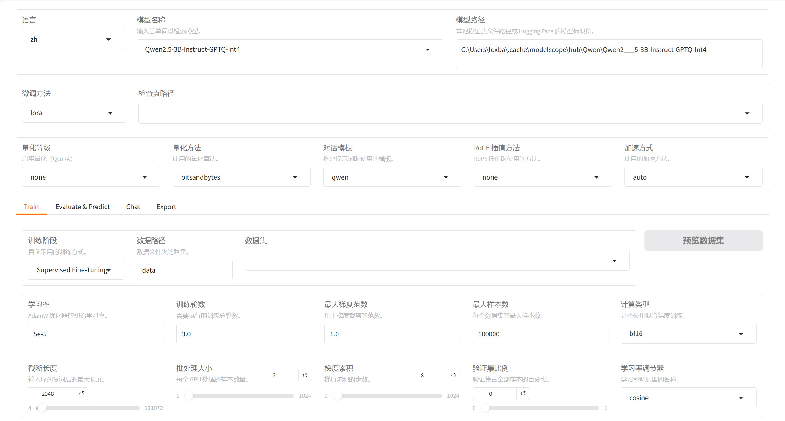
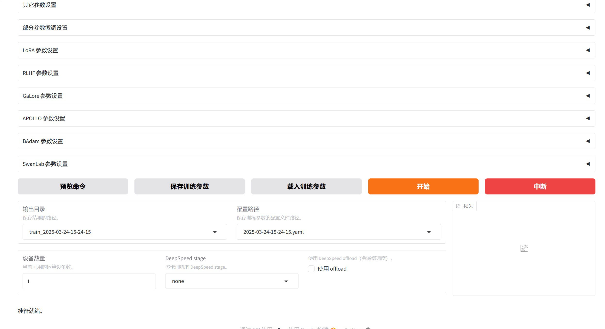

## 1. 核心概念与学习路径

### 1.1 训练三要素
成功的模型训练需要掌握三个核心维度：

| 维度         | 说明           | 关键决策点                              |
| ------------ | -------------- | --------------------------------------- |
| **训练方式** | 选择微调策略   | 全参数微调 vs LoRA vs 冻结微调          |
| **基座模型** | 选择预训练模型 | 模型规模、量化等级、语言支持            |
| **工具链**   | 选择训练框架   | LLaMA-Factory、 transformers、DeepSpeed |


## 2. LoRA微调技术原理

### 2.1 什么是LoRA微调？
**LoRA（Low-Rank Adaptation，低秩适配）** 是一种参数高效的微调方法。通过引入低秩矩阵分解，仅训练少量参数即可实现大模型的适配，避免全参数微调的高成本和灾难性遗忘问题。

### 2.2 全参数微调的三大缺陷

| 缺陷               | 具体表现                           | 影响                         |
| ------------------ | ---------------------------------- | ---------------------------- |
| **💰 训练成本高昂** | 需更新千亿级参数，消耗大量计算资源 | 需要大规模数据集和GPU集群    |
| **⏱️ 训练周期长**   | 参数量过大导致迭代缓慢             | 无法适应业务快速迭代需求     |
| **🧠 灾难性遗忘**   | 调整所有参数破坏原有知识表征       | 新任务表现好，旧任务性能骤降 |

### 2.3 LoRA的数学原理

**核心思想**：不直接训练原始权重矩阵 $W_{M \times N}$，而是通过低秩分解引入增量矩阵 $\Delta W$。

**公式表示**：
$$
W_{final} = W_{original} + \alpha \cdot \Delta W \approx W_{original} + \alpha \cdot (A_{M \times r} \times B_{r \times N})
$$
其中：
- $r \ll \min(M, N)$ 为低秩维度（通常取8、16、64）
- $A$ 矩阵使用**高斯初始化**
- $B$ 矩阵初始化为**全零矩阵**（确保训练初期 $\Delta W = 0$，保持原始模型输出稳定）

**参数量对比示例**（假设 $M=300000, N=500000, r=16$）：

| 方法                | 参数量计算                            | 参数量                       |
| ------------------- | ------------------------------------- | ---------------------------- |
| 直接训练 $\Delta W$ | $300000 \times 500000$                | **1500亿**                   |
| LoRA分解 ($A$+$B$)  | $300000 \times 16 + 16 \times 500000$ | **1280万**                   |
| **压缩率**          | -                                     | **0.000085（不足万分之一）** |

### 2.4 LoRA实现细节

在每个Transformer层添加低秩旁路：

```python
# 伪代码示意：LoRA层的实现逻辑
class LoRALayer:
    def __init__(self, in_features, out_features, r=16):
        # A矩阵：高斯初始化，打破对称性，确保梯度流动
        self.A = nn.Parameter(torch.randn(in_features, r))
        # B矩阵：零初始化，确保训练开始时ΔW=0，保持原始模型行为
        self.B = nn.Parameter(torch.zeros(r, out_features))
    
    def forward(self, x):
        # 原始输出 + LoRA适配输出（缩放后）
        return original_forward(x) + alpha * (x @ A @ B)
```

💡 **初始化策略解析**：
- **A高斯、B零初始化**：确保训练初期输出不变（$A \times B = 0$），训练稳定后逐渐激活适配能力
- **避免全零初始化**：若A、B均为零，则梯度恒为零，模型无法学习
- **避免全高斯初始化**：初始阶段可能引入过大噪声，破坏预训练知识


## 3. 环境准备与资源配置

### 3.1 获取基座模型

**推荐渠道**：
- 国际用户：[HuggingFace Model Hub](https://huggingface.co/models)
- 国内用户：[魔搭社区 (ModelScope)](https://www.modelscope.cn/models)

**下载命令示例**（使用ModelScope CLI）：

```bash
# 使用modelscope命令行工具下载量化后的Qwen2.5模型
# --model: 指定模型ID（格式：组织名/模型名）
# --local_dir: 指定本地存储路径，避免重复下载
modelscope download \
    --model Qwen/Qwen2.5-3B-Instruct-GPTQ-Int4 \
    --local_dir /workspace/deepseekDistllation/models/Qwen/Qwen2.5-3B-Instruct-GPTQ-Int4
```

下载完成后，检查模型文件目录结构，确保包含：
- `config.json`（模型配置）
- `model.safetensors` 或 `pytorch_model.bin`（权重文件）
- `tokenizer.json`（分词器）

### 3.2 云端开发环境：腾讯Cloud Studio

**适用场景**：本地计算资源不足时，使用云端GPU环境。

**使用流程**：

1. **访问与注册**
   - 访问 [https://cloudstudio.net/](https://cloudstudio.net/)
   - 使用微信扫码快速注册/登录

2. **进入共享项目**
   - 首页查找教师分享的项目（如 `deepseek-distillation`）
   - 或在个人中心 → 我的分享中查找

3. **启动开发机**
   - 点击**"运行"**启动虚拟机（⚠️ 注意：运行期间消耗计算额度）
   - 使用**"终端/代码"**按钮切换界面
   - 使用**"停止"**按钮释放资源（💡 不用时及时关闭，避免浪费）


## 4. LLaMA-Factory训练框架

### 4.1 框架简介

LLaMA-Factory 是开源的大模型统一微调框架，支持100+主流模型和多种训练算法。

**核心特性**：

| 类别         | 支持范围                                                    |
| ------------ | ----------------------------------------------------------- |
| **模型架构** | LLaMA、Qwen、DeepSeek、Yi、Gemma、ChatGLM、Mistral等100+    |
| **训练方法** | （增量）预训练、SFT、Reward Modeling、PPO、DPO、KTO、ORPO   |
| **量化精度** | 16bit全参数、8bit、4bit、QLoRA（支持GPTQ/AWQ/BitsAndBytes） |
| **先进算法** | GaLore、DoRA、LongLoRA、LoRA+、PiSSA                        |

GitHub地址：[hiyouga/LLaMA-Factory](https://github.com/hiyouga/LLaMA-Factory)

### 4.2 环境搭建

**步骤1：创建隔离的Python环境**

```bash
# 创建Python 3.11虚拟环境（避免与系统Python冲突）
conda create --name llamafactory-3.11 python==3.11

# 激活环境（每次使用前必须执行）
conda activate llamafactory-3.11
```

**步骤2：安装LLaMA-Factory**

```bash
# 使用浅克隆（--depth 1）节省带宽和时间，仅下载最新版本
git clone --depth 1 https://github.com/hiyouga/LLaMA-Factory.git

# 进入项目目录
cd LLaMA-Factory

# 方式A：标准安装（推荐）
pip install -e ".[torch,metrics]"

# 方式B：若遇到setuptools版本错误，使用国内镜像源+特殊安装顺序
# 先安装依赖再安装包本身，避免构建隔离导致的版本冲突
pip install -r requirements.txt -i https://mirrors.tuna.tsinghua.edu.cn/pypi/web/simple
pip install --no-build-isolation --no-index --find-links=./ --no-deps -e ".[torch,metrics]"
```

**步骤3：安装量化推理依赖**（针对GPTQ量化模型）

```bash
# auto_gptq：支持GPTQ格式量化模型的推理与训练
pip install auto_gptq
# optimum：HuggingFace优化库，用于模型转换和加速
pip install optimum
```

### 4.3 启动训练界面

**方式一：WebUI（适合初学者）**

```bash
# 确保conda环境已激活
conda activate llamafactory-3.11

# 启动Web可视化界面（默认端口7860）
llamafactory-cli webui

# 若报错：argument of type 'bool' is not iterable
# 原因：pydantic版本不兼容，降级到2.10.6
pip install pydantic==2.10.6
```

访问地址：
- **本地环境**：http://localhost:7860
- **Cloud Studio**：查看分配的公网URL（如 `https://xxxx.ap-shanghai.cloudstudio.club`）





**方式二：命令行（适合自动化）**

```bash
llamafactory-cli train \
    --stage sft \
    --do_train True \
    --model_name_or_path /workspace/deepseekDistllation/models/Qwen/Qwen2.5-3B-Instruct-GPTQ-Int4 \
    --preprocessing_num_workers 16 \
    --finetuning_type lora \
    --template qwen \
    --flash_attn auto \
    --dataset_dir /workspace/deepseekDistllation/data/chatData \
    --dataset chat-train \
    --cutoff_len 6000 \
    --learning_rate 0.0001 \
    --num_train_epochs 1.0 \
    --max_samples 100000 \
    --per_device_train_batch_size 2 \
    --gradient_accumulation_steps 2 \
    --lr_scheduler_type cosine \
    --max_grad_norm 1.0 \
    --logging_steps 5 \
    --save_steps 100 \
    --warmup_steps 10 \
    --output_dir /workspace/deepseekDistllation/models/lora/Qwen2.5-3B-instruct-GPTQ-Int4/train_$(date +%Y-%m-%d-%H-%M-%S) \
    --bf16 True \
    --quantization_bit 4 \
    --quantization_method bitsandbytes \
    --lora_rank 16 \
    --lora_alpha 16 \
    --lora_dropout 0 \
    --lora_target all
```

**命令行参数解析**：

| 参数                              | 说明           | 建议值                                                   |
| --------------------------------- | -------------- | -------------------------------------------------------- |
| `--stage sft`                     | 监督微调阶段   | SFT（有监督微调）                                        |
| `--finetuning_type lora`          | 微调方式       | LoRA（参数高效）                                         |
| `--cutoff_len 6000`               | 最大序列长度   | 根据显存调整（6000需约16GB+）                            |
| `--learning_rate 1e-4`            | 学习率         | LoRA通常用1e-4 ~ 5e-5                                    |
| `--per_device_train_batch_size 2` | 单设备批次大小 | 根据显存调整                                             |
| `--gradient_accumulation_steps 2` | 梯度累积步数   | 实际batch_size = per_device_bs * accumulation * num_gpus |
| `--lora_rank 16`                  | LoRA秩r        | 通常8、16、64，越大表达能力越强                          |
| `--lora_alpha 16`                 | LoRA缩放系数α  | 通常等于rank或2*rank                                     |
| `--lora_target all`               | 应用LoRA的层   | all（所有线性层）或q_proj,v_proj等                       |


## 5. 训练流程配置

### 5.1 模型与数据配置

| 配置项         | 值示例                                         | 说明                            |
| -------------- | ---------------------------------------------- | ------------------------------- |
| **模型名称**   | Qwen2.5-3B-Instruct-GPTQ-Int4                  | 选择基座模型架构                |
| **模型路径**   | `/workspace/.../Qwen2.5-3B-Instruct-GPTQ-Int4` | 本地模型目录                    |
| **数据路径**   | `/workspace/.../data/chatData`                 | 包含训练数据的目录              |
| **数据集名称** | chat-train                                     | 对应`dataset_info.json`中的键名 |
| **对话模板**   | qwen                                           | 必须与基座模型匹配              |

### 5.2 关键训练参数

⚠️ **极重要参数**：决定训练性质与效果

| 参数类别     | 推荐配置               | 解析                          |
| ------------ | ---------------------- | ----------------------------- |
| **微调方法** | LoRA                   | 平衡效果与效率                |
| **量化等级** | 4bit                   | 节省显存，适合消费级GPU       |
| **训练阶段** | Supervised Fine-Tuning | 标准指令微调                  |
| **学习率**   | 1e-4 (0.0001)          | LoRA常用范围：5e-5 ~ 1e-4     |
| **训练轮数** | 1.0                    | 防止过拟合，数据集小可增至3-5 |
| **截断长度** | 6000                   | 覆盖长文本，需确保显存充足    |
| **批次大小** | 1-2                    | 根据显存动态调整              |
| **梯度累积** | 2                      | 模拟更大batch_size            |
| **预热步数** | 10                     | 稳定训练初期参数更新          |

### 5.3 训练启动

**WebUI操作**：
1. 设置模型路径、数据路径
2. 选择LoRA微调、4bit量化
3. 配置学习率、轮数等超参数
4. 指定输出目录
5. 点击**"开始"**按钮

**监控训练**：
- 观察loss曲线是否稳定下降
- 留意GPU显存占用（`nvidia-smi`）
- 检查checkpoint保存情况


## 6. 模型部署与效果验证

### 6.1 启动API服务

**仅加载基座模型（对比测试）**：

```bash
# 设置可见GPU为0号卡，API服务端口为8000
# llamafactory-cli api：以OpenAI兼容API模式启动
CUDA_VISIBLE_DEVICES=0 API_PORT=8000 llamafactory-cli api \
    --model_name_or_path /workspace/deepseekDistllation/models/Qwen/Qwen2.5-3B-Instruct-GPTQ-Int4
```

**加载基座模型 + LoRA适配器**：

```bash
# 新增参数：
# --adapter_name_or_path: LoRA权重路径（checkpoint目录）
# --finetuning_type lora: 声明微调类型以正确加载适配器
CUDA_VISIBLE_DEVICES=0 API_PORT=8000 llamafactory-cli api \
    --model_name_or_path /workspace/deepseekDistllation/models/Qwen/Qwen2.5-3B-Instruct-GPTQ-Int4 \
    --adapter_name_or_path /workspace/deepseekDistllation/models/lora/Qwen2.5-3B-instruct-GPTQ-Int4/train_2025-03-20-20-41-50/checkpoint-1250 \
    --finetuning_type lora
```

💡 **启动成功标志**：控制台显示 `Uvicorn running on http://0.0.0.0:8000` 或类似信息。

### 6.2 API调用测试

**Python客户端示例**：

```python
import os
import time
from openai import OpenAI  # 需提前安装：pip install openai

def call_inference_server(user_input, port=8000):
    """
    调用本地部署的LLaMA-Factory API服务进行推理
    
    Args:
        user_input (str): 用户输入的提示文本
        port (int): API服务端口，默认8000
    
    Returns:
        str: 模型生成的回复文本
    """
    # 初始化OpenAI兼容客户端
    # 注意：api_key可为任意值（本地服务不验证），base_url必须指向本地服务
    client = OpenAI(
        api_key="0",  # 占位符，本地服务无需真实密钥
        base_url=f"http://localhost:{port}/v1"  # 标准OpenAI API路径
    )
    
    # 构造对话消息，支持多轮（role可为system/user/assistant）
    messages = [{"role": "user", "content": user_input}]
    
    # 创建聊天补全请求
    # model参数可为任意值（本地服务忽略，但不可省略）
    # max_tokens控制生成长度，需根据显存和内容长度调整
    response = client.chat.completions.create(
        messages=messages, 
        model="test",  # 占位符
        max_tokens=6000  # 最大生成token数
    )
    
    # 提取生成的文本内容
    return response.choices[0].message.content

# ==================== 测试主程序 ====================
if __name__ == "__main__":
    # 测试用例：主观观点类问题（适合评估模型价值观和推理能力）
    test_prompt = "对于「初三女生在搀扶跌倒老奶奶后反被冤枉，但仍选择资助她千元」的新闻事件，你有什么看法？"
    
    # 记录推理耗时（评估生成速度）
    start_time = time.time()
    result = call_inference_server(test_prompt)
    end_time = time.time()
    
    # 计算性能指标
    duration = end_time - start_time
    speed = len(result) / duration  # 字符/秒
    
    print(f"输出长度：{len(result)} 字")
    print(f"推理耗时：{duration:.2f} 秒")  
    print(f"生成速度：{speed:.2f} 字/秒")
    print("\n" + "="*50 + "\n")
    print(result)  # 打印模型回复内容
```

**性能监控**：

观察GPU实时状态：
```bash
# Windows：每秒刷新一次GPU状态
nvidia-smi -l 1

# Linux：使用watch命令定时刷新
watch -n 1 nvidia-smi
```


## 7. 核心参数速查表

### 7.1 路径类参数（必须配置）

| 参数                   | 环境变量/WebUI对应 | 说明                          |
| ---------------------- | ------------------ | ----------------------------- |
| `model_name_or_path`   | 模型路径           | 基座模型目录                  |
| `adapter_name_or_path` | 检查点路径         | LoRA权重路径（推理时）        |
| `dataset_dir`          | 数据路径           | 数据集根目录                  |
| `dataset`              | 数据集             | `dataset_info.json`中定义的键 |
| `output_dir`           | 输出目录           | 训练结果保存路径              |

### 7.2 训练性质参数（训练前必须确认）

| 参数               | 可选值                | 建议                             |
| ------------------ | --------------------- | -------------------------------- |
| `finetuning_type`  | full/freeze/lora      | **LoRA**（显存有限时）           |
| `stage`            | sft/reward/ppo/dpo... | **sft**（标准微调）              |
| `quantization_bit` | none/8/4              | **4**（3B模型4bit约需6-8GB显存） |

### 7.3 关键超参数（影响模型效果）

| 参数                          | 推荐范围         | 调整策略                                  |
| ----------------------------- | ---------------- | ----------------------------------------- |
| `learning_rate`               | 1e-5 ~ 1e-4      | 小学习率防过拟合，大学习率加速收敛        |
| `num_train_epochs`            | 1.0 ~ 3.0        | 数据少选大值，数据多选小值                |
| `cutoff_len`                  | 2048, 4096, 6000 | 根据任务长度选，越大显存消耗越多          |
| `lora_rank`                   | 8, 16, 32, 64    | 任务复杂选大值，简单任务8-16足够          |
| `lora_alpha`                  | 16, 32           | 通常等于rank或2倍rank                     |
| `per_device_train_batch_size` | 1, 2, 4          | 受显存限制，配合gradient_accumulation调整 |

