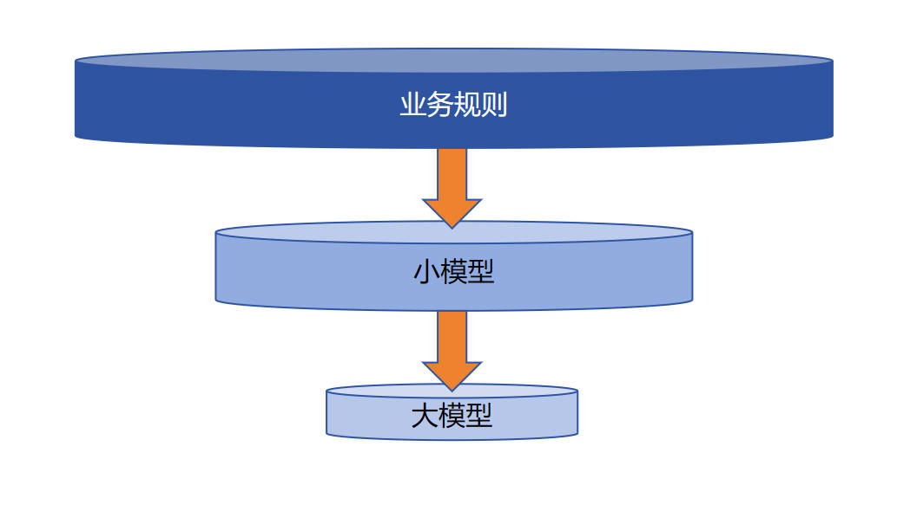

## 1. vLLM 核心优势

### 1.1 性能对比

| 部署方式          | 输出长度 | 耗时     | 速度             |
| ----------------- | -------- | -------- | ---------------- |
| LLaMA-Factory API | -        | -        | **7.26 字/秒**   |
| **vLLM API**      | 1794 字  | 16.03 秒 | **111.92 字/秒** |

💡 **实测效果**：相比传统部署方式，vLLM 推理速度提升约 **15 倍**。

**测试命令**：
```bash
CUDA_VISIBLE_DEVICES=0 API_PORT=8000 vllm serve \
  /workspace/models/Qwen2.5-3B-Instruct-GPTQ-Int4 \
  --enable-lora \
  --lora-modules add1=/workspace/models/lora/checkpoint-1250/
```


### 1.2 vLLM关键技术优化

#### 1.2.1 PageAttention：显存管理革命

| 特性           | 传统 KV Cache          | vLLM PageAttention                      |
| -------------- | ---------------------- | --------------------------------------- |
| **分配方式**   | 连续物理显存，动态增长 | 固定大小块（默认16 tokens）             |
| **显存利用率** | 低（预留大量空闲空间） | **高达 96%**                            |
| **碎片化**     | 严重                   | 通过块表（Block Table）管理，几乎无碎片 |
| **扩展性**     | 需预先分配最大可能长度 | 按需动态分配，写满后自动追加            |

⚠️ **核心原理**：借鉴操作系统虚拟内存机制，将显存分割为固定大小的"页"，通过块表映射实现非连续存储。

#### 1.2.2 批量任务优化（Continuous Batching）

- **异步调度**：不再要求所有并行任务处于同一阶段，新请求可随时插入
- **智能抢占**：当资源不足时，新请求会抢占（Preemption）正在运行的低优先级任务，释放资源等待调度
- **吞吐量提升**：显著减少批次间等待时间，提高 GPU 利用率

#### 1.2.3 多 LoRA 动态加载

```bash
# 同时加载多个 LoRA 适配器
vllm serve base_model \
  --enable-lora \
  --lora-modules \
    lora_a=/path/to/lora_a \
    lora_b=/path/to/lora_b \
    lora_c=/path/to/lora_c
```

| 应用场景     | 业务价值                                         |
| ------------ | ------------------------------------------------ |
| **A/B 测试** | 无缝切换不同版本 LoRA，实时对比效果              |
| **资源节约** | 低频使用的 LoRA 共享同一组 GPU，减少服务器数量   |
| **负载均衡** | 统一资源池，避免单 LoRA 独占服务器导致的资源闲置 |


## 2. vLLM 部署实践

### 2.1 环境选择

⚠️ **Windows 原生支持有限**，推荐以下方案：
- **WSL2**（Windows Subsystem for Linux）
- **Docker** 容器化部署
- **原生 Linux**（Ubuntu 20.04+ 推荐）

### 2.2 安装与启动

**步骤一：安装依赖**

```bash
pip install vllm
```

**步骤二：启动服务**
```bash
CUDA_VISIBLE_DEVICES=0 API_PORT=8000 vllm serve \
  /path/to/base_model \
  --enable-lora \
  --lora-modules add1=/path/to/lora_checkpoint/
```

**步骤三：验证启动**
当控制台出现 `Uvicorn running on http://0.0.0.0:8000` 即表示服务就绪。

### 2.3 客户端调用

```python
import os
import time
from openai import OpenAI

def call_vllm_server(input_text: str, model_name: str = "add1") -> str:
    """
    调用 vLLM API 进行推理
    
    Args:
        input_text: 输入文本
        model_name: 指定 LoRA 名称，空字符串则使用基座模型
    
    Returns:
        生成的文本内容
    """
    client = OpenAI(
        api_key="0",  # vLLM 不验证 API Key，但参数必须存在
        base_url=f"http://localhost:{os.environ.get('API_PORT', 8000)}/v1"
    )
    
    messages = [{"role": "user", "content": input_text}]
    
    response = client.chat.completions.create(
        messages=messages, 
        model=model_name,  # 💡 填入空字符串使用基座模型，填入 LoRA 名称使用对应适配器
        max_tokens=20000
    )
    
    return response.choices[0].message.content

# 性能测试示例
if __name__ == "__main__":
    test_prompt = "对于「初三女生搀扶跌倒老奶奶后反被冤枉」的事件，你怎么看？"
    
    start = time.time()
    result = call_vllm_server(test_prompt, model_name="add1")
    duration = time.time() - start
    
    speed = len(result) / duration
    print(f"输出长度：{len(result)} 字 | 耗时：{duration:.2f} 秒 | 速度：{speed:.2f} 字/秒")
```


## 3. 性能优化四大维度

### 3.1 模型层优化

| 技术         | 原理                                     | 适用场景         |
| ------------ | ---------------------------------------- | ---------------- |
| **模型裁剪** | 移除冗余层/头，减小模型体积，权重数值置0 | 边缘设备部署     |
| **模型量化** | INT4/INT8 权重压缩，降低显存占用         | 消费级 GPU 部署  |
| **模型蒸馏** | 大模型知识迁移至小模型                   | 高并发低延迟场景 |

### 3.2 工具层优化

- **vLLM**：适合高吞吐、多 LoRA 场景
- **HuggingFace TGI**：适合快速原型验证
- **FasterTransformer**：NVIDIA GPU 极致性能优化
- **DeepSpeed-Inference**：超大规模模型分布式推理

### 3.3 Prompt 工程优化

#### 3.3.1 结构化提示（Structure Prompting）
将任务要求模块化，明确分隔输入与规则：

```markdown
你是一位人力资源专家，请分析【简历】与【入职标准】的匹配度。

【简历】
{resume_content}

【入职标准】
{requirements}
```

#### 3.3.2 批处理（Batching）
**单条处理** vs **批量处理**：

```markdown
# ❌ 低效：多次请求抽取单个字段
提取姓名：XXX
提取年龄：XXX

# ✅ 高效：单次请求批量提取所有字段
请从简历中抽取以下信息并以 JSON 格式输出：
- 姓名、年龄、籍贯、政治面貌、毕业院校、工作经历、项目经验

格式示例：
{"姓名": "张三", "年龄": "28", ...}
```

#### 3.3.3 压缩输出（Token Efficiency）
将评分、分类等任务压缩至最小输出单元：

```markdown
你是一位质量评估专家，请对问答对评分（0-9）。
0=完全无关，9=完美回答。
⚠️ 只输出数字，禁止输出任何解释文字。
```

### 3.4 业务层优化

#### 3.4.1 大模型适用边界识别

⚠️ **以下场景慎用大模型**：

| 类型             | 示例                         | 原因                                    |
| ---------------- | ---------------------------- | --------------------------------------- |
| **统计性任务**   | 文本聚类、信息检索           | 传统算法（TF-IDF/BM25）更高效准确       |
| **低延迟任务**   | 高频交易、实时舆情监控       | 推理延迟无法满足毫秒级要求              |
| **简单分类任务** | 情感二分类、主题分类         | BERT 级小模型足够且更快                 |
| **序列标注任务** | 分词、词性标注、通用实体识别 | 专用模型成本更低                        |
| **超专业领域**   | 医药分子式识别、化工配方解析 | 依赖专业词典与规则，通用 LLM 幻觉风险高 |

#### 3.4.2 混合架构：沙漏式数据处理

**核心思想**：用简单快速的规则/传统模型处理 95% 的简单数据，用大模型集中处理 5% 的困难数据。



## 4. 实战案例：车系识别系统优化

### 4.1 背景与约束
- **数据规模**：2.86 亿篇文章，平均 1000 字/篇
- **业务目标**：识别文本中的汽车车系名称（共 3758 个车系）
- **资源限制**：时间紧、预算有限、无标注数据训练序列模型

### 4.2 车系分类策略

| 类型             | 数量  | 示例                 | 处理策略         |
| ---------------- | ----- | -------------------- | ---------------- |
| **无歧义车系**   | 3,129 | 帕萨特、传祺、马自达 | AC 自动机匹配    |
| **常用词歧义**   | 116   | 几何、哪吒、指挥官   | 大模型上下文判定 |
| **英文数字歧义** | 513   | XC60、SL350          | 大模型上下文判定 |

**数据分布**：
- 84.3% 文章无车系 → 直接丢弃
- 13.16% 仅含无歧义车系 → 规则匹配
- **2.54% 含潜在歧义** → 仅这部分需大模型介入

### 4.3 技术方案对比

| 指标           | 方案一：纯大模型 | 方案二：混合策略 |
| -------------- | ---------------- | ---------------- |
| **输入字符数** | 3120.26 亿       | 13.7 亿          |
| **输出字符数** | 10.86 亿         | 0.18 亿          |
| **总成本**     | **759,288 元**   | **3,454 元**     |
| **成本比**     | 100%             | **0.455%**       |

### 4.4 关键实现细节

**批处理 Prompt 设计**：
```python
# 每 20 条数据打包一次请求，大幅降低 API 调用频次
prompt_template = """你是一位汽车行业专家，判断文本片段中的字符串是否代表车系。
规则：是车系输出"是"，否则输出"否"。禁止输出其他字符。

输入格式：
[
  ["文本片段1", "待判定字符串1"],
  ["文本片段2", "待判定字符串2"],
  ...
]

示例输入：
[
  ["确保使用 XC360 安全充电", "xc360"],
  ["XC360 是其中的佼佼者", "xc360"]
]

示例输出：
否是

现在真实输入：
{batch_data}
"""
```

### 4.5 经济效益
通过 **AC 自动机** 过滤 97.46% 的数据，仅将 2.54% 的疑似歧义数据提交大模型，实现：
- **节省成本 99.5%**
- **处理速度满足业务时效性**
- **准确率与纯大模型方案持平**


## 5. 总结

| 优化维度   | 核心策略               | 预期收益    |
| ---------- | ---------------------- | ----------- |
| **模型**   | 量化 + 蒸馏 + 裁剪     | 显存↓ 速度↑ |
| **工具**   | vLLM/PageAttention     | 吞吐↑ 15x+  |
| **Prompt** | 结构化 + 批处理 + 压缩 | 成本↓ 50%+  |
| **业务**   | 沙漏式架构，大模型后置 | 成本↓ 99%+  |

💡 **黄金法则**：**不要用大模型处理所有数据，而要用大模型处理最难的数据。**