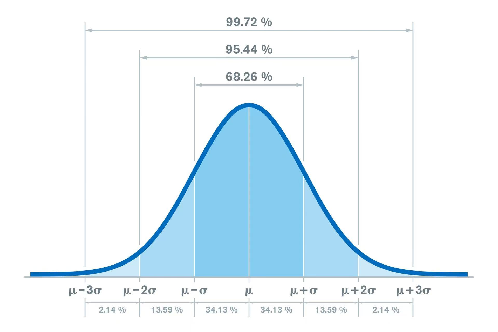

这是一份关于 Python 标准库 random 的深度学习指南。random 模块主要用于生成伪随机数（Pseudo-random numbers）。

我将内容分为：核心 API 详解、高级分布、注意事项以及实战项目。

## 1. 核心 API 详解与代码示例
为了方便记忆，我们将常用的 API 分为四类：整数、序列、浮点数和状态控制。

### 1.1 整数相关 (Integers)

| API                            | 描述                             | 范围表示                    |
| ------------------------------ | -------------------------------- | --------------------------- |
| `randint(a, b)`                | 返回 a 到 b 之间的随机整数       | `[a, b]` (包含 b)           |
| `randrange(start, stop, step)` | 从指定范围内按步长获取一个随机数 | `[start, stop)` (不含 stop) |

```python
import random

# 1. randint: 模拟掷骰子 (1到6，包含6)
dice_roll = random.randint(1, 6)
print(f"掷骰子点数: {dice_roll}")

# 2. randrange: 类似于 range() 函数
# 例如：从 0, 2, 4, ..., 98 中选取一个偶数
even_number = random.randrange(0, 100, 2)
print(f"0-100间的随机偶数: {even_number}")
```

### 1.2 序列操作 (Sequences) —— 最常用功能
这组 API 用于从列表、元组或字符串中提取数据。

| API                               | 描述                     | 特点                         |
| --------------------------------- | ------------------------ | ---------------------------- |
| `choice(seq)`                     | 随机选一个元素           | 空序列会报错                 |
| `choices(seq, weights=None, k=1)` | 随机选 k 个元素 (有放回) | 支持权重，可能重复选中       |
| `sample(seq, k)`                  | 随机选 k 个元素 (无放回) | 元素互斥，k 不能超过序列长度 |
| `shuffle(seq)`                    | 原地打乱序列顺序         | 修改原列表，返回 None        |

```python
fruits = ['苹果', '香蕉', '樱桃', '榴莲', '西瓜']

# 1. choice: 决定今天吃什么
print(f"今天吃: {random.choice(fruits)}")

# 2. choices: 抽奖模拟 (有放回，支持权重)
# 假设 '苹果' 中奖率 50%, '榴莲' 只有 5%
# k=3 表示抽3次
draws = random.choices(
    fruits, 
    weights=[50, 20, 15, 5, 10], 
    k=3
)
print(f"三次抽奖结果 (可能重复): {draws}")

# 3. sample: 选取不重复的样本
# 比如从名单中选 2 位不同的代表
reps = random.sample(fruits, 2)
print(f"选出的代表 (不重复): {reps}")

# 4. shuffle: 洗牌
deck = [1, 2, 3, 4, 5]
random.shuffle(deck)
print(f"打乱后的列表: {deck}")
```

> 关键区别： `choices` 用于由于权重的抽奖（可能抽到一样的），`sample` 用于选取不重复的样本（比如发牌）。

### 1.3 浮点数相关 (Floats)

| API             | 描述                         | 范围         |
| --------------- | ---------------------------- | ------------ |
| `random()`      | 返回 0.0 到 1.0 之间的浮点数 | `[0.0, 1.0)` |
| `uniform(a, b)` | 返回 a 到 b 之间的浮点数     | `[a, b]`     |

```python
# 1. random: 生成基础概率值
prob = random.random()
if prob < 0.1:
    print("触发 10% 概率的暴击！")

# 2. uniform: 生成指定范围的小数
# 模拟温度传感器读书，20.5度 到 25.5度 之间
temp = random.uniform(20.5, 25.5)
print(f"当前模拟温度: {temp:.2f}°C")
```

### 1.4 状态控制 (Reproducibility)
在机器学习或调试代码时，我们需要每次运行代码生成的随机数是一样的，这时需要设定种子 (Seed)。

```python
# 设定种子后，后续的随机序列是固定的
random.seed(42)
print(random.random()) # 每次运行这段代码，输出都一样

random.seed(42)
print(random.random()) # 再次重置种子，输出与上面完全一致
```

## 2. 统计学分布 (高级 API)
除了均匀分布，`random` 还提供了用于科学模拟的分布函数，最典型的是高斯分布（正态分布）。



* `random.gauss(mu, sigma)`:
  * `mu`: 平均值 (Mean)
  * `sigma`: 标准差 (Standard Deviation)
  * 用途：模拟身高、考试成绩、自然界误差等。

```python
# 模拟全班考试成绩：平均分 75，标准差 10
score = random.gauss(75, 10)
print(f"模拟分数: {score:.1f}")
```

## 3. 重要安全警告
> ⚠️ 警示： `random` 模块生成的是伪随机数，绝对不要用于密码学相关的用途（如生成密码、Token、密钥）。
>
> 正确做法： 涉及安全时，请使用 Python 的 `secrets` 模块。

## 4. 实战小项目：RPG 随机地牢战利品生成器
这个项目模拟了一个 RPG 游戏中，击败 Boss 后生成掉落装备的过程。它综合运用了 `choice` (名字), `randint` (数值), `choices` (带权重的稀有度) 和 `uniform` (属性波动)。

### 项目代码 (`loot_generator.py`)

```python
import random
import time

class LootGenerator:
    def __init__(self):
        # 装备前缀
        self.prefixes = ["破碎的", "普通的", "精良的", "史诗的", "传说的", "被诅咒的"]
        # 装备类型
        self.item_types = ["长剑", "盾牌", "法杖", "皮甲", "戒指"]
        # 稀有度及其权重 (传说最难掉落)
        self.rarities = ["普通", "稀有", "史诗", "传说"]
        self.rarity_weights = [60, 30, 9, 1] 

    def generate_gold(self):
        """生成金币：符合正态分布，平均 100，波动 20"""
        gold = int(random.gauss(100, 20))
        return max(1, gold) # 确保金币不为负数

    def generate_stats(self, rarity):
        """根据稀有度生成属性值"""
        base_stat = random.randint(5, 10)
        
        # 稀有度越高，属性倍率越高
        multiplier_map = {
            "普通": 1.0,
            "稀有": 1.5,
            "史诗": 2.5,
            "传说": 5.0
        }
        
        # 增加一点随机浮动 (0.9 ~ 1.1)
        fluctuation = random.uniform(0.9, 1.1)
        
        final_stat = int(base_stat * multiplier_map[rarity] * fluctuation)
        return final_stat

    def drop_loot(self):
        """生成一次掉落"""
        # 1. 决定稀有度 (使用 choices 根据权重抽取)
        rarity = random.choices(self.rarities, weights=self.rarity_weights, k=1)[0]
        
        # 2. 组合名字
        name = f"{random.choice(self.prefixes)} {random.choice(self.item_types)}"
        
        # 3. 生成金币
        gold = self.generate_gold()
        
        # 4. 生成攻击力/防御力
        power = self.generate_stats(rarity)
        
        return {
            "名称": name,
            "稀有度": rarity,
            "属性值": power,
            "金币": gold
        }

# --- 运行模拟 ---
if __name__ == "__main__":
    generator = LootGenerator()
    
    print("⚔️  击败 BOSS！正在计算掉落... ⚔️")
    print("-" * 30)
    
    # 模拟生成 5 件战利品
    for i in range(1, 6):
        loot = generator.drop_loot()
        print(f"掉落 #{i}: [{loot['稀有度']}] {loot['名称']}")
        print(f"    ├─ 强度: {loot['属性值']}")
        print(f"    └─ 附带金币: {loot['金币']}")
        time.sleep(0.5) # 模拟计算延迟
```

### 运行结果示例
```
⚔️  击败 BOSS！正在计算掉落... ⚔️
------------------------------
掉落 #1: [普通] 普通的 戒指
    ├─ 强度: 8
    └─ 附带金币: 98
掉落 #2: [稀有] 精良的 法杖
    ├─ 强度: 14
    └─ 附带金币: 112
掉落 #3: [普通] 破碎的 皮甲
    ├─ 强度: 6
    └─ 附带金币: 85
掉落 #4: [传说] 传说的 长剑   <-- 极低概率触发
    ├─ 强度: 45
    └─ 附带金币: 130
掉落 #5: [普通] 被诅咒的 盾牌
    ├─ 强度: 9
    └─ 附带金币: 105
```

## 总结
* **基础随机**：`randint`, `random`, `uniform`。
* **列表随机**：`choice` (选一个), `choices` (带权重选), `sample` (选不重复), `shuffle` (打乱)。
* **科学随机**：`gauss` (正态分布)。
* **安全**：涉及到密码或 Token，请务必转用 `secrets` 库。
