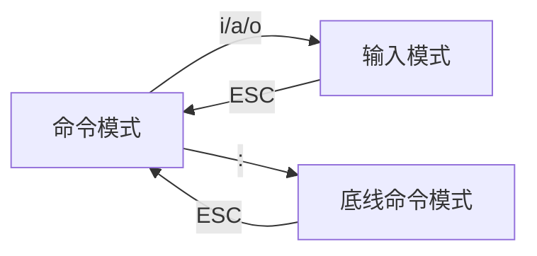

## 1 Linux 系统简介
- **创始人**：林纳斯·托瓦兹（Linus Torvalds），1991 年开发  
- **系统组成**：
  - **内核**：开源免费
  - **发行版**：系统级应用程序（如 Ubuntu、CentOS）


## 2 VMware 虚拟机使用
**核心步骤**

1. 安装 VMware 并导入 Linux 镜像
2. 使用 **FinalShell** 通过 SSH 连接虚拟机：
   - 解决 VMware 中鼠标操作、复制粘贴问题
   - 提供更便捷的命令行操作体验


## 3 Linux 的使用

### 3.1 Linux基础命令

#### 3.1.1 目录结构

- **根目录**：`/`（Linux 文件系统唯一顶级目录）

**路径表示方法**：

| 类型           | 说明                                       | 示例                   |
| :------------- | :----------------------------------------- | :--------------------- |
| **绝对路径**   | 以根目录 `/` 为起点                        | `/home/user/file.txt`  |
| **相对路径**   | 以当前目录为起点，无需 `/` 开头            | `./Documents/file.txt` |
| **特殊路径符** | `.` 当前目录，`..` 上级目录，`~` HOME 目录 | `cd ~/Desktop`         |

⚠️ **重要提示**：`cd ~` 和 `cd` 均可快速返回 HOME 目录。


#### 3.1.2 命令通用格式

```shell
command [-options] [parameter]
```

- `command`：命令主体
- `-options`：控制命令细节的可选参数
- `parameter`：指定操作目标的可选参数


### 3.2 文件/文件夹操作

#### 3.2.1 核心命令速查表

| 命令    | 功能描述      | 常用选项                                                     | 典型示例               | 补充说明                 |
| :------ | :------------ | :----------------------------------------------------------- | :--------------------- | :----------------------- |
| `ls`    | 列出目录内容  | `-a`（显示隐藏文件）<br>`-l`（列表形式）<br>`-h`（易读大小，与`-l`搭配使用） | `ls -alh`              | 多选项可组合使用         |
| `cd`    | 切换工作目录  | 支持特殊路径符                                               | `cd ~/Desktop`         | 无参数时返回 HOME 目录   |
| `pwd`   | 显示当前路径  | 无                                                           | `pwd`                  | 显示绝对路径             |
| `mkdir` | 创建目录      | `-p`（自动创建父目录）                                       | `mkdir -p dir1/dir2`   | ⚠️ 建议在 HOME 目录内操作 |
| `touch` | 创建空文件    | 无                                                           | `touch file.txt`       | 文件已存在则更新时间戳   |
| `cp`    | 复制文件/目录 | `-r`（递归复制目录）                                         | `cp -r src/ dest/`     | 复制目录必须使用 `-r`    |
| `mv`    | 移动/重命名   | 无                                                           | `mv old.txt new.txt`   | 目标不存在时执行重命名   |
| `rm`    | 删除文件/目录 | `-r`（递归删除）<br>`-f`（强制删除）                         | `rm -rf dir/`          | 支持通配符 `*` 模糊匹配  |
| `find`  | 查找文件      | `-name`（按名称）<br>`-size`（按大小）                       | `find / -name "*.log"` | 支持通配符和大小单位     |


#### 3.2.2 关键命令深度解析

**`rm` 命令通配符用法**

```shell
# 匹配以 test 开头的文件/目录
rm test*

# 匹配以 test 结尾的文件/目录
rm *test

# 匹配包含 test 的文件/目录
rm *test*
```

**`find` 按大小查找**

```shell
# 查找大于 100MB 的文件
find /path -size +100M

# 查找小于 1GB 的文件
find /path -size -1G
```

- `+`、`-` 表示大于和小于
- `k`（kb）、`M`（MB）、`G`（GB）为单位

⚠️ **权限警告**：普通用户请勿在 HOME 目录外执行写入操作，否则会因权限不足失败。


### 3.3 文件内容操作

#### 3.3.1 内容查看与过滤

| 命令   | 功能                       | 常用选项                             | 示例                      | 典型应用场景 |
| :----- | :------------------------- | :----------------------------------- | :------------------------ | :----------- |
| `cat`  | 一次性显示全部内容         | 无                                   | `cat file.txt`            | 查看小文件   |
| `more` | 分页显示内容               | 无                                   | `more file.txt`           | 查看大文件   |
| `tail` | 显示末尾内容（默认 10 行） | `-n`（指定行数）<br>`-f`（实时监控） | `tail -f /var/log/syslog` | 日志监控     |
| `grep` | 关键词过滤                 | `-n`（显示行号）                     | `grep -n "error" log.txt` | 日志分析     |
| `echo` | 输出内容                   | 无                                   | `echo "Hello"`            | 脚本输出     |

#### 3.3.2 管道符与重定向

**管道符 `|` **：将左侧命令的输出作为右侧命令的输入

```shell
# 组合过滤：先查找 error，再筛选 critical
cat log.txt | grep "error" | grep -n "critical"

# 查看文件末尾并过滤关键词
tail -f /var/log/syslog | grep "fail"
```

**重定向符 **

- `>` ：覆盖写入文件
- `>>`：追加内容到文件

```shell
# 覆盖写入
echo "Hello Linux" > output.txt

# 追加内容
echo "New line" >> output.txt

# 命令替换：将命令输出作为内容，两种语法：$(pwd) (推荐的标准语法)和`date` (传统的反引号语法)
echo "当前目录: $(pwd)"
echo "当前日期: `date`"
```


### 3.4 命令帮助与定位

```shell
# 查看命令帮助信息
ls --help

# 查看详细手册
man ls

# 查找命令所在路径
which ls
```


## 4. vi/vim 编辑器

### 4.1 模式切换

vi/vim 有三种工作模式，**常用于软件安装后的配置文件修改**。



- **命令模式**：默认模式，支持快捷键操作，按 `ESC` 返回
- **输入模式**：按 `i`（插入）、`a`（追加）、`o`（新行）进入编辑
- **底线命令模 **：按 `:` 输入命令（如 `:wq` 保存退出）


### 4.2 常用快捷键

| 快捷键    | 功能                            |
| :-------- | :------------------------------ |
| `dd`      | 删除当前整行                    |
| `yy`      | 复制当前行                      |
| `p`       | 粘贴到光标下一行                |
| `/关键词` | 搜索关键词（按 `n` 查找下一个） |
| `u`       | 撤销操作                        |


### 4.3 底线命令模式

| 命令      | 功能           |
| :-------- | :------------- |
| `:wq`     | 保存并退出     |
| `:q`      | 仅退出         |
| `:q!`     | 强制退出不保存 |
| `:set nu` | 显示行号       |
| `:n`      | 跳转到第 n 行  |


## 5. Linux 用户与权限管理

### 5.1 用户体系

Linux 用户分为两类：

| 用户类型     | 特点                       | 使用建议                             |
| :----------- | :------------------------- | :----------------------------------- |
| **root **    | 超级管理员，拥有全部权限   | ⚠️ 生产环境避免直接使用               |
| **普通用户** | 默认仅 HOME 目录有完整权限 | 日常操作首选，必要时使用 `sudo` 提权 |


#### 5.1.1 用户管理操作

```shell
# 创建用户（-m 自动创建主目录）
sudo useradd -m itheima

# 设置用户密码（密码需符合复杂度要求）
sudo passwd itheima
```

💡 **HOME 目录规则 **：创建用户 `itcast` 会自动生成 `/home/itcast` 目录，用户在该目录下拥有所有权限。


#### 5.1.2 sudo 权限配置

```shell
# 给普通用户添加sudo权限

# 1. 切换到 root 用户
su - root

# 2. 编辑 sudoers 文件（带语法检查），会自动通过vi编辑器打开：/etc/sudoers
visudo

# 3. 在文件中找到 `# User privilege specification` 部分，找到以下行：
# `root`    ALL=(ALL:ALL) ALL

# 3.1 在下面添加一行（将 username 替换为实际用户名）
username ALL=(ALL:ALL) ALL

# 3.2 免密码配置（配置用户无需输入密码使用sudo功能）
username ALL=(ALL) NOPASSWD: ALL

# 4. 如果使用 `visudo`，按 `Ctrl + X`，然后按 `Y` 确认保存，最后按 `Enter` 退出。
```

⚠️ **安全警告 **：免密码 sudo 存在安全风险，请谨慎配置。

检验配置是否成功：

```shell
sudo apt update
```


### 5.2 文件权限管理

#### 5.2.1 权限查看


文件权限由 10 个字符组成，格式：`drwxr-xr-x`

- 第 1 位：文件类型（`-` 普通文件，`d` 目录，`l`软链接）
- 第 2-4 位：所属用户权限（u）
- 第 5-7 位：所属组权限（g）
- 第 8-10 位：其他用户权限（o）

💡提示：u表示user所属用户权限，g表示group组权限，o表示other其它用户权限


#### 5.2.2 权限修改

**chmod 命令 **：修改文件/目录权限（仅所属用户或 root 可执行）

```shell
# 语法：chmod [-R] 权限 文件/目录， 选项：`-R`，对文件夹内的全部内容应用同样的操作

# 符号表示法
chmod u=rwx,g=rx,o=x hello.txt    # 结果为 rwxr-x--x

# 递归修改目录权限，将文件夹test以及文件夹内全部内容权限设置为：rwxr-x--x
chmod -R u=rwx,g=rx,o=x test/

# 数字表示法（751每个数字转化为二进制（111，101，001）对应有哪些权限）
chmod 751 hello.txt               # 7(rwx)5(rx)1(x) → rwxr-x--x

# 添加执行权限
chmod +x script.sh
```


**chown 命令 **：修改文件所有者（普通用户没有权限修改文件的所有者/所有的用户组，想通过普通用户修改，需 root 权限或 sudo）

通过`ls -l`指令，可以看到文件、文件夹的所有者/所有的用户组

```shell
# 语法：chown [-R] [用户][:][用户组] 文件/目录

# 修改所属用户
sudo chown root test1.txt

# 修改所属用户和用户组
sudo chown root:root test1.txt

# 仅修改用户组
sudo chown :root test1.txt

# 递归修改目录所有者
sudo chown -R itheima:itheima /path/to/dir
```


**权限继承示例 **：

```shell
# 原状态：文件属于 itheima:itheima
-rw-rw-r-- 1 itheima itheima test1.txt

# 修改用户为 root（itheima 变为同组用户）
sudo chown root test1.txt
-rw-rw-r-- 1 root itheima test1.txt  # itheima 仍有读写权限

# 修改用户组为 root（itheima 变为其他用户）
sudo chown :root test1.txt
-rw-rw-r-- 1 root root test1.txt  # itheima 仅保留读权限
```
