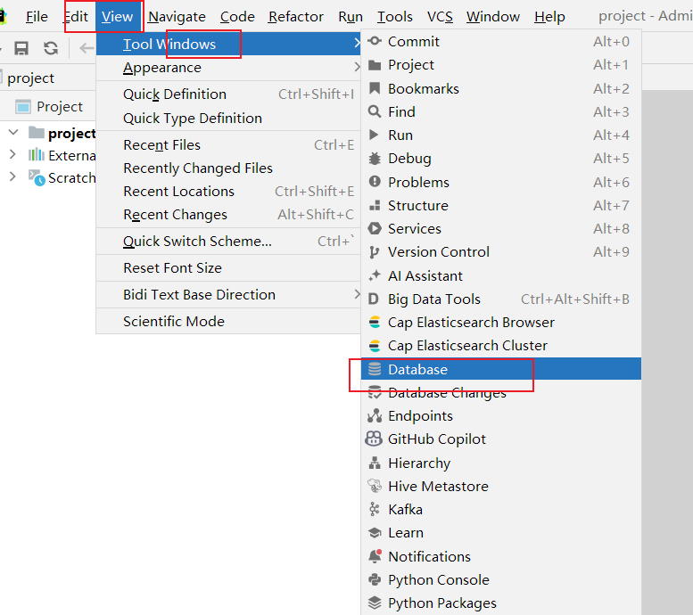
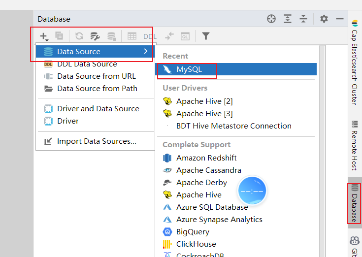

## 1. Linux 使用技巧

### 1.1 常用快捷键

| 快捷键       | 功能说明                    |
| :----------- | :-------------------------- |
| `Ctrl + C`   | 强制停止当前命令            |
| `Ctrl + D`   | 退出/登出当前会话           |
| `Ctrl + R`   | 搜索历史命令                |
| `Ctrl + A`   | 光标移动到命令开始          |
| `Ctrl + E`   | 光标移动到命令结束          |
| `Ctrl + ←/→` | 光标左右跳转到单词边界      |
| `Ctrl + L`   | 清屏（等效于 `clear` 命令） |

**命令行快捷操作：**

- `history`：查看完整历史命令列表
- `!命令前缀`：自动执行最近一条匹配前缀的命令


### 1.2 软件包管理（apt）

使用 **`apt`** 进行软件包管理：`apt` 是 Debian/Ubuntu 系统的软件包管理工具，可自动解决依赖关系。

```shell
# 更新软件源列表（安装/升级前必须执行，通过更新软件源，系统可以获取到最新的软件包信息和版本。）
sudo apt update

# 软件包管理
sudo apt install package_name              # 安装单个软件包
sudo apt install pkg1 pkg2                 # 安装多个软件包
sudo apt install /path/to/file.deb         # 安装本地 deb 文件
sudo apt remove package_name               # 移除软件包（保留配置）
sudo apt remove package1 package2          # 删除指定多个包，以空格分隔
sudo apt purge package_name                # 彻底移除（包含配置）
sudo apt upgrade                           # 升级所有已安装软件包
sudo apt upgrade package_name              # 升级指定软件包

# 查询软件包
sudo apt list                             # 列出所有可用包
sudo apt list --installed                 # 列出已安装包
sudo apt search keyword                   # 搜索软件包
```


### 1.3 服务管理（systemctl）

`Linux`系统很多软件（内置或第三方）均支持使用`systemctl`命令控制：启动、停止、开机自启。能够被`systemctl`管理的软件，一般也称之为：服务

```shell
systemctl start|stop|restart|status|enable|disable 服务名
```

| 子命令    | 功能         |
| :-------- | :----------- |
| `start`   | 启动服务     |
| `stop`    | 停止服务     |
| `restart` | 重启服务     |
| `status`  | 查看服务状态 |
| `enable`  | 设置开机自启 |
| `disable` | 禁用开机自启 |

**常用服务示例：**

- `NetworkManager`：主网络服务
- `ufw`：防火墙服务
- `ssh`：SSH 远程登录服务

**💡 应用场景：** 修改网络配置后，需重启网络服务：`systemctl restart NetworkManager`


### 1.4 符号链接（软连接）

创建文件的快捷方式，类似于 Windows 的快捷方式。

**语法：** `ln -s 源路径 目标路径`

```shell
# 示例：为 /var/www/html 创建软链接到当前用户目录
ln -s /var/www/html ~/webroot

# 访问 ~/webroot 即等同于访问 /var/www/html
```

**⚠️ 注意事项：**

- 源路径建议使用绝对路径，避免因相对路径导致链接失效
- 删除软链接不会影响原文件


### 1.5 IP地址/域名解析/主机名

想联网访问互联网, 必须有IP地址：ip地址两个版本 ipv4、ipv6。

#### IP 地址

- **IPv4 格式：** `a.b.c.d`（每组 0-255）
- **特殊 IP 地址：**
  - `127.0.0.1`：本地回环地址，表示本机
  - `0.0.0.0`：可表示本机或任意 IP（常用于白名单配置）


#### 域名解析

通过域名访问网络服务, 先要进行域名解析，系统按以下顺序查找域名对应 IP：

| 解析方式            | 文件路径/地址                                                | 说明                   |
| :------------------ | :----------------------------------------------------------- | :--------------------- |
| **本地 hosts 文件** | Linux: `/etc/hosts`<br>Windows: `C:\Windows\System32\drivers\etc\hosts` | 优先级最高，可手动配置 |
| **DNS 服务器**      | `8.8.8.8` (Google)<br>`114.114.114.114` (国内通用)           | 网络级域名解析         |


#### 主机名管理

```shell
hostname                                # 查看当前主机名
sudo hostnamectl set-hostname 新主机名   # 永久修改主机名（需 root 权限）
```


#### 固定 IP 配置（可选）

虚拟机默认通过 DHCP 动态获取 IP，可能导致 IP 频繁变更。如需固定 IP 以便远程连接，可在网络设置中手动配置静态 IP（固体步骤用到了查看，现在看对学习没有很大用处。）。


### 1.6 网络操作与文件下载

#### 连通性测试（ping）

```shell
ping 192.168.88.2        # 测试局域网连通性
ping baidu.com           # 测试互联网连通性
```

#### 文件下载

```shell
# wget - 非交互式下载器，可以在命令行内下载网络文件。语法：`wget  [-b]  url`
wget https://example.com/file.zip          # 前台下载
wget -b https://example.com/large-file.iso # 后台下载（日志写入 wget-log）

# curl - HTTP 客户端工具，可用于：下载文件、获取信息等。语法：`curl [-o] url`
curl https://api.example.com/data          # 获取内容并输出到终端
curl -O https://example.com/file.zip       # 下载并保存文件（大写 O）
```


### 1.7 端口与进程管理

#### 端口基础概念

- **虚拟端口**：用于标识主机上的特定应用程序，实现进程间网络通信
- **端口范围（Linux 系统共 65535 个）：**

| 类型         | 范围        | 用途                                      |
| :----------- | :---------- | :---------------------------------------- |
| **公认端口** | 1-1023      | 系统/知名服务预留（如 SSH:22, HTTPS:443） |
| **注册端口** | 1024-49151  | 用户应用程序注册使用                      |
| **动态端口** | 49152-65535 | 临时分配给客户端程序                      |

**⚠️ 警告：** 非特殊需求，请勿占用 1-1023 端口


#### 端口占用查询

```shell
# 扫描主机开放端口
nmap 127.0.0.1

# 查看特定端口占用情况
netstat -anp | grep 端口号    # 获取占用该端口的进程 PID
```


#### 进程查询与管理

**查看所有进程：**

为管理运行的程序，每一个程序在运行的时候，便被操作系统注册为系统中的一个**进程**。并会为每一个进程都分配一个独有的：进程ID（进程号），可以用过`ps`命令查看Linux系统中的进程信息。

```shell
ps -ef    # -e: 显示全部进程  -f: 完整格式化输出
```

**ps -ef 输出字段说明：**

| 字段    | 含义                         |
| :------ | :--------------------------- |
| `UID`   | 进程所属用户 ID              |
| `PID`   | 进程 ID（唯一标识）          |
| `PPID`  | 父进程 ID                    |
| `C`     | CPU 占用率（%）              |
| `STIME` | 进程启动时间                 |
| `TTY`   | 启动终端（? 表示非终端启动） |
| `TIME`  | 累计 CPU 占用时间            |
| `CMD`   | 进程名称或启动命令           |


**查询指定进程：**

```shell
ps -ef | grep mysql      # 过滤包含 mysql 的进程
ps -ef | grep 1447       # 根据 PID 查询详细信息
```

**终止进程：**

```shell
kill PID                  # 正常终止进程
kill -9 PID               # 强制终止进程（-9 信号不可被捕获或忽略）
```


#### 端口冲突解决流程

```shell
# 1. 定位占用端口的进程
netstat -anp | grep 8080

# 2. 查看进程详细信息
ps -ef | grep <PID>

# 3. 根据情况选择：更换端口 或 终止进程
kill -9 <PID>
```


### 1.8 环境变量配置

环境变量是 Key-Value 格式的系统配置信息，用于记录关键运行参数。

**核心概念：**

- **`PATH` 变量**：存储可执行文件搜索路径（多个路径用 `:` 分隔）
- **配置 PATH 后**，可在任意目录直接执行路径下的程序

#### 变量取值

```shell
# 在Linux系统中，$ 符号被用于取”变量”的值
echo $PATH              # 查看 PATH 变量值
echo ${PATH}ABC         # 变量与字符串混合使用时建议加 {}
```


#### 配置方式

**1. 临时生效（当前会话）**

```shell
export PATH=$PATH:/home/user/mybin   # 对当前 Shell 及子进程生效
PATH=$PATH:/home/user/mybin          # 仅对当前 Shell 生效（不导出）
```

**2. 永久生效**

| 作用范围     | 配置文件       | 加载命令              |
| :----------- | :------------- | :-------------------- |
| **当前用户** | `~/.bashrc`    | `source ~/.bashrc`    |
| **所有用户** | `/etc/profile` | `source /etc/profile` |

**💡 提示：** 修改配置后，使用 `source` 命令可立即生效，无需重启终端


### 1.9 文件上传与下载

#### 图形工具

通过 FinalShell、XShell 等 SSH 客户端的文件管理面板进行拖拽传输。

#### 命令行工具（需安装 lrzsz）

```shell
rz                        # 上传文件（打开文件选择对话框）
sz 文件名                  # 下载文件到本地（默认保存至桌面的fsdownload目录）
```


### 1.10 压缩与解压缩

#### tar 命令（Linux 标准）

| 压缩格式  | 特点                             |
| :-------- | :------------------------------- |
| `.tar`    | Tarball 归档文件，仅打包不压缩   |
| `.tar.gz` | 使用 gzip 算法压缩，体积显著减小 |

**命令语法：** `tar [选项] 文件...`

| 选项 | 说明                               |
| :--- | :--------------------------------- |
| `-c` | 创建压缩文件（压缩模式）           |
| `-x` | 解压模式                           |
| `-v` | 显示详细过程                       |
| `-f` | 指定文件名（**必须放在选项最后**） |
| `-z` | 启用 gzip 压缩/解压                |
| `-C` | 指定解压目标目录                   |

**⚠️ 重要规范：**

- `-f` 选项必须在选项组合的最后一位
- `-z` 选项建议放在开头
- `-C` 需单独使用，与其他参数分开

**操作示例：**

```shell
# 压缩
tar -cvf archive.tar file1 file2          # 打包为 .tar
tar -zcvf archive.tar.gz dir/            # 打包并压缩为 .tar.gz

# 解压
tar -xvf archive.tar -C /tmp             # 解压 .tar 到指定目录
tar -zxvf archive.tar.gz                 # 解压 .tar.gz 到当前目录
```


#### zip/unzip 命令（跨平台）

```shell
# 压缩（-r 递归处理目录）
zip -r archive.zip folder/ file1.txt

# 解压（-d 指定目标目录）
unzip archive.zip -d /opt/extract/
```


## 2. MySQL 数据库

### 2.1 **开发环境配置与连接**

- 下载并且激活pycharm(百度网盘里面有)

- 先创建一个python的项目


- 找到 Database 工具栏(界面右边栏也能找到)




- 配置mysql 链接, 这里使用ubantu虚拟机上安装的MySQL (连之前ubantu一定要打开)
  - ip  192.168.58.128
  - 用户名 root
  - 密码 12345678




- 配置好Mysql连接之后, 打开默认控制台, 可以在里面写SQL


### 2.2 数据库基础理论

数据库就是存储数据的仓库，支持**增、删、改、查**操作。数据库分为**关系型数据库**和**非关系型数据库**。

#### 2.2.1 **关系型数据库（RDBMS）**

**核心特点**

1. **结构化数据存储**
   - 数据以表格（二维结构）形式存储，预定义严格的模式（Schema）。
   - 支持主键、外键约束，保证数据完整性。
2. **SQL 支持**
   - 通过 SQL 实现复杂查询（如 JOIN、子查询、聚合函数）。
   - 适合需要多表关联和事务管理的场景（如金融系统）。
3. **ACID 事务**
   - 保证事务的原子性（Atomicity）、一致性（Consistency）、隔离性（Isolation）、持久性（Durability）。
4. **垂直扩展为主**
   - 通过增加 CPU、内存等硬件提升性能，但成本较高。

**适用场景**

- 银行系统（需强一致性）

- ERP、CRM（复杂业务逻辑）

- 需要频繁 JOIN 操作的场景

  

#### 2.2.2 **非关系型数据库（NoSQL）**

**核心特点**

1. **灵活的数据模型**
   - **文档型**（如 MongoDB）：JSON/BSON 格式存储。
   - **键值型**（如 Redis）：简单键值对，适合缓存。
   - **列存储**（如 Cassandra）：按列族组织数据，适合分析。
   - **图数据库**（如 Neo4j）：存储节点和关系，适合社交网络。
2. **高扩展性**
   - 天然支持分布式架构，通过添加节点实现水平扩展。
   - 适合处理海量数据（如日志、物联网设备数据）。
3. **最终一致性（BASE）**
   - 遵循 BASE（Basically Available, Soft-state, Eventually Consistent）原则，牺牲强一致性以提升可用性。
4. **高性能**
   - 针对特定场景优化（如 Redis 的毫秒级响应）。

**适用场景**

- 实时大数据处理（如用户行为日志）
- 高并发读写（如电商秒杀）
- 动态数据结构（如内容管理系统）


#### **2.2.3 核心差异**

| 特性         | 关系型数据库              | 非关系型数据库             |
| :----------- | :------------------------ | :------------------------- |
| **数据模型** | 严格表格结构（行/列）     | 灵活模型（文档/键值/图等） |
| **查询语言** | 标准 SQL                  | 无统一语言（API/特定语法） |
| **扩展方式** | 垂直扩展（升级硬件）      | 水平扩展（增加节点）       |
| **事务支持** | 强 ACID                   | BASE（最终一致性）         |
| **适用数据** | 结构化、高一致性          | 半/非结构化、高灵活性      |
| **代表产品** | MySQL, Oracle, PostgreSQL | MongoDB, Redis, Cassandra  |


### 2.3 Mysql 简介

**核心优势：** 开源免费、支持大型数据库、跨平台、兼容标准 SQL

**登录方式：**

```shell
# 本地登录
mysql -u root -p
# 或明文密码（不推荐）
mysql -u root -p 12345678
# 远程登录
mysql --host=192.168.88.161 --user=root --password=12345678
```


### 2.4 SQL 语言规范

**SQL 分类：**

- **DDL**（Data Definition Language）：操作数据库、表结构
- **DML**（Data Manipulation Language）：增、删、改数据
- **DQL**（Data Query Language）：查询数据（最常用）
- **DCL**（Data Control Language）：权限控制（DBA 管理）

**注释语法：**

```sql
-- 单行注释（标准 SQL）
# 单行注释（MySQL 特有）
/* 多行注释，可自由换行 */
```

**常用数据类型：**

- **字符型：** `char(n)`（定长）, `varchar(n)`（变长）
- **整型：** `int`, `bigint`
- **浮点型：** `float`, `double`, `decimal(m,d)`（精确数值）
- **日期型：** `date`（年月日）, `datetime`（年月日时分秒）


### 2.5 数据定义语言（DDL）

💡**操作数据流程**：DDL 建库建表 →DML 向表中写入数据(增、删、改) → DQL(数据查询)


#### 2.5.1 **数据库操作**

```sql
-- DDL语句 

create database if not exists ai_db charset =utf8;  # 创建数据库，create database 数据库名;

show databases;  # 查看数据库，show databases;

drop database ai_db;  # 删除数据库，drop database 数据库名;

use ai_db;  # 使用数据库，use 数据库名;（选中一个数据库, 后续操作, 都在这个数据库中进行）
```


#### 2.5.2 **数据表操作**

```sql
-- 选中一个数据库, 后续操作, 都在这个数据库中进行
use ai_db;

-- DDL 对数据表的操作

# 创建数据表，create table 表名(字段名 类型 [约束]…)
create table category(
      cid varchar(20) primary key not null ,
      cname varchar(100));  

show tables;  # 查看当前数据库有哪些数据表，show tables;

desc category;  # 查看表结构，desc 表名;

drop table category;  # 删除表，drop table 表名;

-- 添加字段, 需要注意这里添加的字段的名字和sql的关键字冲突了,如果非要使用SQL的关键字作为字段名 需要添加 ``
-- alter table 表名 add 列名 类型 [约束]; 增加一列
alter table category add `desc` varchar(20);

alter table category add num varchar(20);

-- 修改字段名字  alter table 表名 change 老字段名 新字段名字 类型 [约束]; 修改一列名字
alter table category change `desc` description varchar(20);

-- 删除字段 alter table 表名 drop 字段名; 删除一列
alter table category drop description;

-- rename table 表名 to 新表名; 修改表名
rename table category to category2;
```


### 2.6 数据操纵语言（DML）

```sql
-- 插入数据 insert into：
-- insert into 表 (字段1,字段2,字段3...) values(值1,值2,值3...),(值1,值2,值3...)…;

-- 单行插入（值需与表结构一一对应）
insert into category values ('c001','电器');

-- 指定字段插入
insert into category2(cid,cname) values ('c001','电器');
insert into category2 (cid, cname) values('03','化妆品'),('04','书籍'),('05',null);


-- 修改数据 update
-- 格式：update 表名 set 字段名=值,字段名=值,... where 条件
update category2 set cname = '家电';
update category2 set cname='水果' where cid='c001';

-- 删除记录 delete from 或 truncate category;
delete from category2 where cid='c002';
delete from category;  # 可以不接where条件（不指定 WHERE 时删除所有行，但保留表结构，可回滚）

-- truncate快速清空（不可回滚，自增 ID 重置）
truncate category2;
```

**⚠️ 重要规范：**

- 字符串和日期值必须使用 **单引号** 括起（如：`'value'`，在SQL使用到的数据，除了数字，都需要引号。）
- `DELETE` 不带 `WHERE` 子句将删除全表数据，操作前请确认
- `TRUNCATE` 效率更高但无法恢复，且不支持事务回滚
