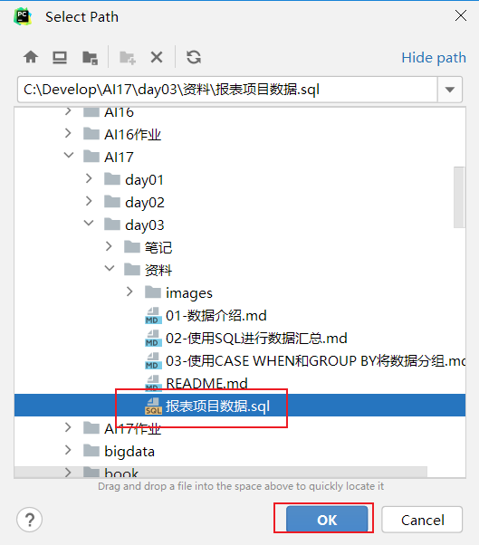

## 1. 数据库约束 (Constraints)

### 1.1 约束类型概览

约束是确保数据**准确性**和**可靠性**的规则。MySQL支持六大核心约束类型：

| 约束类型        | 功能描述   | 关键特性                        | 典型场景                  |
| :-------------- | :--------- | :------------------------------ | :------------------------ |
| **PRIMARY KEY** | 主键约束   | 唯一 + 非空，一表一个           | 记录唯一标识              |
| **NOT NULL**    | 非空约束   | 禁止NULL值                      | 必填字段（用户名、密码）  |
| **UNIQUE**      | 唯一约束   | 值唯一，允许多个NULL            | 邮箱、手机号              |
| **FOREIGN KEY** | 外键约束   | 维护表间参照完整性              | 关联表数据一致性          |
| **DEFAULT**     | 默认值约束 | 未指定时自动填充                | 减少录入工作量            |
| **CHECK**       | 检查约束   | 验证值满足条件（MySQL 8.0.16+） | 业务规则校验（如年龄≥18） |


### 1.2 核心约束详解

#### 主键约束（PRIMARY KEY）

主键是表设计的核心，应遵循以下**黄金法则**：

- **无意义性**：主键应对用户透明，仅作技术标识
- **不可变性**：主键值一旦确定，**永不更新**
- **稳定性**：不应包含动态变化的数据（如时间戳、创建时间）
- **自动化**：推荐使用`AUTO_INCREMENT`自动生成

```sql
-- 示例1：单列主键 + 自动增长（最常用）
CREATE TABLE person(
                    id INT PRIMARY KEY AUTO_INCREMENT,  -- 主键且自动递增，无需人工维护
                    last_name VARCHAR(100),
                    first_name VARCHAR(100)
				   	);

-- 示例2：复合主键（多个列组合唯一）
-- 适用场景：当单个字段无法唯一标识记录时（如订单明细表）
-- 特性：所有组成列均不允许NULL，组合值必须唯一
CREATE TABLE order_items (
                            order_id INT NOT NULL,              -- 订单ID（外键）
                            product_id INT NOT NULL,            -- 商品ID（外键）
                            quantity INT,
                            PRIMARY KEY (order_id, product_id)  -- 复合主键：同一订单中相同商品只能有一条记录
                        );
```

#### 其他核心约束

```sql
-- NOT NULL约束：确保必填字段
CREATE TABLE users (
    user_id INT PRIMARY KEY AUTO_INCREMENT,
    username VARCHAR(50) NOT NULL,      -- 用户名必须填写，不能为NULL
    email VARCHAR(100) NOT NULL         -- 邮箱必须填写，不能为NULL
);

-- UNIQUE约束：确保字段唯一性
-- 方式一：列级定义
CREATE TABLE members (
    member_id INT PRIMARY KEY AUTO_INCREMENT,
    phone VARCHAR(20) UNIQUE            -- 手机号必须唯一
);

-- 方式二：表级定义（推荐，可定义多个列的组合唯一）
CREATE TABLE products (
    product_id INT PRIMARY KEY AUTO_INCREMENT,
    product_code VARCHAR(50) NOT NULL,
    category_id INT,
    UNIQUE (product_code, category_id)  -- 同一分类下商品编码唯一
);

-- DEFAULT约束：提供默认值
CREATE TABLE orders (
    order_id INT PRIMARY KEY AUTO_INCREMENT,
    order_status VARCHAR(20) DEFAULT 'pending',  -- 默认状态为'pending'
    create_time TIMESTAMP DEFAULT CURRENT_TIMESTAMP  -- 默认当前时间
);

-- CHECK约束：MySQL 8.0.16+版本有效
CREATE TABLE employees (
    emp_id INT PRIMARY KEY AUTO_INCREMENT,
    emp_name VARCHAR(50) NOT NULL,
    age INT CHECK (age >= 18 AND age <= 65)  -- 年龄必须在18-65岁之间
);
```


### 1.3 约束的DDL操作

#### 添加约束（ALTER TABLE）

```sql
-- 添加主键约束（通常在建表时定义，后期添加较少见）
ALTER TABLE students ADD PRIMARY KEY (student_id);

-- 添加外键约束（需确保引用表存在且字段类型匹配）
ALTER TABLE orders
ADD CONSTRAINT fk_orders_customer  -- 指定约束名称，便于后续管理
FOREIGN KEY (customer_id) REFERENCES customers(customer_id);

-- 添加CHECK约束
ALTER TABLE employees ADD CHECK (salary >= 3000);

-- 添加DEFAULT约束
ALTER TABLE employees ALTER city SET DEFAULT 'Beijing';
```

#### 删除约束（ALTER TABLE）

```sql
-- 删除主键约束
ALTER TABLE students DROP PRIMARY KEY;

-- 删除外键约束（必须知道约束名称）
ALTER TABLE orders DROP FOREIGN KEY fk_orders_customer;

-- 删除DEFAULT约束
ALTER TABLE employees ALTER city DROP DEFAULT;
```


### 1.4 外键约束深度解析

外键是实现**参照完整性**的核心机制，其工作原理如下：

```sql
-- 主表（一）：分类表
CREATE TABLE category (
    cid VARCHAR(32) PRIMARY KEY,
    cname VARCHAR(100)
);

-- 从表（多）：商品表
CREATE TABLE products (
    pid VARCHAR(32) PRIMARY KEY,
    pname VARCHAR(40),
    price DOUBLE,
    category_id VARCHAR(32),
    -- 外键约束：category_id必须引用category表的cid字段
    FOREIGN KEY (category_id) REFERENCES category(cid)
);

-- 数据操作演示
INSERT INTO category (cid, cname) VALUES('c001', '家电');  -- 必须先插入主表数据

-- ✅ 合法：外键为NULL（表示未分类）
INSERT INTO products (pid, pname) VALUES('p001', '商品名称');

-- ✅ 合法：外键值在主表中存在
INSERT INTO products (pid, pname, category_id) VALUES('p002', '商品名称2', 'c001');

-- ❌ 非法操作：外键值在主表中不存在（会抛出异常）
-- INSERT INTO products (pid, pname, category_id) VALUES('p003', '商品名称2', 'c999');

-- ❌ 非法操作：删除已被引用的主表数据（会抛出异常）
-- DELETE FROM category WHERE cid = 'c001';
```

**核心规则**：

1. **插入规则**：从表外键值必须为NULL或在主表中存在
2. **删除规则**：主表被引用记录**无法直接删除**（需先删除从表关联记录或使用级联删除）


## 2. `DQL` 单表查询

### 2.1 基础查询语法

```sql
SELECT *|字段名 FROM 表名 WHERE 条件;
```

```sql
-- 查询所有字段和记录
SELECT * FROM 表名;

-- 查询指定字段
SELECT pname, price FROM product;

-- 字段运算（查询时动态计算）
SELECT pname, price + 10 AS new_price FROM product;  -- 所有商品价格+10元显示

-- 条件查询（WHERE子句）
SELECT pname, price FROM product WHERE price BETWEEN 200 AND 800;  -- 查询价格在200-800之间的商品
select * from product where  price>=200 and price <=800; -- 下面这句相当于 between 200 and 800

-- IN查询：枚举具体取值（非范围）
SELECT pname, price FROM product WHERE price IN (200, 800);  -- 精确匹配200或800的商品
select * from product where  price=200 or price =800; -- 下面这句相当于 in (200, 800)


-- 非空查询
select * from product where product.category_id is not null ;

-- 模糊查询：在 SQL 的模糊查询中，LIKE 关键字配合通配符使用，主要涉及 % 和 _ 两个通配符（注意 * 不是模糊查询的通配符）
-- % 作用：匹配任意长度的字符串（包括零个字符）；_ 作用：匹配单个任意字符。
select * from product where pname like '香%';
select * from product where pname like '_想%';


select pname,price from product where price!=800;
select * from product where  not (price=200);
```

### 2.2 结果排序（ORDER BY）

```sql
SELECT * FROM 表名 ORDER BY 排序字段 ASC|DESC;  -- ASC 升序 / DESC 降序
```

```sql
-- 单列排序：默认ASC升序，DESC为降序
SELECT * FROM product ORDER BY price DESC;  -- 按价格从高到低排序

-- 多列排序：先按第一字段排序，相同则按第二字段排序
SELECT * FROM product ORDER BY price DESC, category_id DESC;  -- 价格相同再按分类降序

-- 💡 技巧：多字段排序时，只有第一字段有重复值，第二字段排序才生效
```

### 2.3 聚合函数

| 函数          | 功能描述             | 是否忽略NULL |
| :------------ | :------------------- | :----------- |
| `COUNT(*)`    | 统计行数             | ❌            |
| `COUNT(字段)` | 统计字段非NULL值数量 | ✅            |
| `SUM()`       | 计算数值列总和       | ✅            |
| `MAX()`       | 获取最大值           | ✅            |
| `MIN()`       | 获取最小值           | ✅            |
| `AVG()`       | 计算平均值           | ✅            |

```sql
-- 统计所有商品数量
SELECT COUNT(*) FROM product;

-- 统计价格>200的商品数量
SELECT COUNT(*) FROM product WHERE price > 200;

-- 统计c001分类商品的总价和均价
SELECT 
    SUM(price) AS total_price,
    AVG(price) AS avg_price
FROM product 
WHERE category_id = 'c001';

-- 获取价格极值
SELECT MAX(price) AS max_price, MIN(price) AS min_price FROM product;
```

### 2.4 分组统计（GROUP BY & HAVING）

```sql
SELECT 字段1, 字段2... FROM 表名 GROUP BY 分组字段 HAVING 分组条件;  -- HAVING 用于分组后过滤
```

```sql
-- 基础分组：统计每个分类的商品数量
SELECT category_id, COUNT(*) AS product_count
FROM product
GROUP BY category_id;

-- 分组后筛选：统计商品数>2的分类
SELECT category_id, COUNT(*) AS product_count
FROM product
GROUP BY category_id
HAVING product_count > 2;  -- HAVING用于分组后的条件过滤
```

⚠️ **注意**：`WHERE` 用于分组前过滤，`HAVING` 用于分组后过滤。

💡提示：当需求中出现， 每一个/每一种/每一组/每一类 这样的字样, 考虑使用group by 分组。

### 2.5 分页查询（LIMIT）

```sql
SELECT 字段1, 字段2... FROM 表名 LIMIT M, N;  -- M: 起始索引，N: 查询条数
```

```sql
-- LIMIT语法：LIMIT 起始索引, 每页条数
-- 起始索引 = (页码 - 1) × 每页条数

-- 查询第1页，每页5条
SELECT * FROM product LIMIT 0, 5;

-- 查询第2页，每页5条
SELECT * FROM product LIMIT 5, 5;

-- 查询第3页，每页10条
SELECT * FROM product LIMIT 20, 10;
```

### 2.6 完整查询执行顺序

```sql
SELECT [DISTINCT] 列名1, 列名2, ...    -- 1. 选择字段（去重）
FROM 表名                           	-- 2. 指定数据源
[WHERE 条件]                        	-- 3. 原始数据过滤
[GROUP BY 分组列]                   	 -- 4. 数据分组
[HAVING 分组条件]                   	-- 5. 分组结果过滤
[ORDER BY 排序列 [ASC|DESC]]        	-- 6. 结果排序
[LIMIT [偏移量,] 行数];               -- 7. 结果分页

-- 执行优先级：WHERE → GROUP BY → HAVING → ORDER BY → LIMIT
```

### 2.7 单表查询综合示例

```sql
-- 1. 创建示例表（商品表）
CREATE TABLE product (
    pid INT PRIMARY KEY AUTO_INCREMENT,
    pname VARCHAR(20) NOT NULL,
    price DOUBLE NOT NULL,
    category_id VARCHAR(32)
);

-- 2. 插入测试数据（共13条）
INSERT INTO product VALUES
(1, '联想', 5000, 'c001'), (2, '海尔', 3000, 'c001'),
(3, '雷神', 5000, 'c001'), (4, '杰克琼斯', 800, 'c002'),
(5, '真维斯', 200, 'c002'), (6, '花花公子', 440, 'c002'),
(7, '劲霸', 2000, 'c002'), (8, '香奈儿', 800, 'c003'),
(9, '相宜本草', 200, 'c003'), (10, '面霸', 5, 'c003'),
(11, '好想你枣', 56, 'c004'), (12, '香飘飘奶茶', 1, 'c005'),
(13, '海澜之家', 1, 'c002');

-- 3. 综合查询示例
-- 查询：每个上架分类的商品数量，按数量降序，显示前3个分类
SELECT 
    category_id,
    COUNT(*) AS product_count
FROM product
WHERE category_id IS NOT NULL  -- 过滤未分类商品
GROUP BY category_id
HAVING product_count >= 2      -- 只显示商品数≥2的分类
ORDER BY product_count DESC
LIMIT 0, 3;
```


## 3. `DQL` 多表查询

### 3.1 表关系设计

实际业务中，数据分散在多个表中，通过**主键**和**外键**建立关联关系，实现数据完整性与查询灵活性。

#### 一对一关系（One-to-One）

**定义**：一个表中的一条记录对应另一个表中的唯一一条记录。

**适用场景**：将大表垂直拆分（如用户基本信息 vs 用户敏感信息），提高查询效率与安全性。

**实现方式**：

- 在任意一表中添加外键，并设置为唯一约束（`UNIQUE`）。
- 或直接将主键作为外键。

```sql
-- 主表：用户基础信息
CREATE TABLE user (
    user_id INT PRIMARY KEY AUTO_INCREMENT,
    username VARCHAR(50) NOT NULL
);

-- 从表：用户详情（通过主键作为外键实现一对一）
CREATE TABLE user_detail (
    user_id INT PRIMARY KEY,  -- 既是主键也是外键
    address VARCHAR(100),
    phone VARCHAR(20),
    id_card VARCHAR(18),
    FOREIGN KEY (user_id) REFERENCES user(user_id)  -- 外键约束保证一对一
);
```

> **总结**：外键的核心要求是**引用目标必须具有唯一性约束**


#### 一对多关系（One-to-Many）

**定义**：一个表中的一条记录对应另一个表中的多条记录。

**适用场景**：最常见关系（如部门与员工、用户与订单），**在"多"的一方添加外键**。

**实现方式**：

- 在“多”的一方表中添加外键，指向“一”的一方的主键。从表外键的值是对主表主键的引用。从表外键类型，必须与主表主键类型一致。

```sql
-- 主表（一）：部门表
CREATE TABLE department (
    dept_id INT PRIMARY KEY AUTO_INCREMENT,
    dept_name VARCHAR(50) NOT NULL UNIQUE
);

-- 从表（多）：员工表
CREATE TABLE employee (
    emp_id INT PRIMARY KEY AUTO_INCREMENT,
    emp_name VARCHAR(50) NOT NULL,
    salary DECIMAL(10,2),
    dept_id INT,  -- 外键字段
    FOREIGN KEY (dept_id) REFERENCES department(dept_id)  -- 引用部门ID
);
```


#### 多对多关系（Many-to-Many）

**定义**：一个表中的多条记录可以关联另一个表中的多条记录。

**适用场景**：学生选课、用户角色、订单商品等复杂关系，**通过中间表实现**。

**实现方式**：

- 通过**中间表（关联表）**实现，中间表包含两个外键，分别指向两个主表的主键。
- 中间表的主键可以是复合主键（两个外键的组合）。

```sql
-- 表1：学生表
CREATE TABLE student (
    student_id INT PRIMARY KEY AUTO_INCREMENT,
    student_name VARCHAR(50) NOT NULL
);

-- 表2：课程表
CREATE TABLE course (
    course_id INT PRIMARY KEY AUTO_INCREMENT,
    course_name VARCHAR(50) NOT NULL
);

-- 中间表：选课记录（复合主键保证不重复选课）
CREATE TABLE student_course (
    student_id INT NOT NULL,
    course_id INT NOT NULL,
    enrollment_date DATE,
    PRIMARY KEY (student_id, course_id),  -- 复合主键：同一学生不能重复选同一门课
    FOREIGN KEY (student_id) REFERENCES student(student_id),
    FOREIGN KEY (course_id) REFERENCES course(course_id)
);
```


### 3.2 连接查询方式

```sql
-- 准备测试数据
CREATE TABLE hero (
    hid INT PRIMARY KEY,
    hname VARCHAR(255),
    kongfu_id INT  -- 武功ID（外键）
);

CREATE TABLE kongfu (
    kid INT PRIMARY KEY,
    kname VARCHAR(255)  -- 武功名称
);

-- 插入英雄数据（部分英雄无对应武功）
INSERT INTO hero VALUES
(1, '鸠摩智', 9),   -- kongfu_id=9在kongfu表中不存在
(3, '乔峰', 1),     -- 对应降龙十八掌
(4, '虚竹', 4),     -- 对应天山折梅手
(5, '段誉', 12);    -- kongfu_id=12在kongfu表中不存在

-- 插入武功数据
INSERT INTO kongfu VALUES
(1, '降龙十八掌'),
(2, '乾坤大挪移'),
(3, '猴子偷桃'),
(4, '天山折梅手');
```

#### 内连接（INNER JOIN）

返回**两表交集**，仅保留匹配成功的记录。

```sql
-- 语法：INNER JOIN ... ON 连接条件(其中INNER可省略)
SELECT 
    h.hname AS 英雄名,
    k.kname AS 武功名
FROM hero h
INNER JOIN kongfu k ON h.kongfu_id = k.kid;  -- 仅返回有匹配武功的英雄

-- 结果：乔峰、虚竹（鸠摩智和段誉因无匹配武功被排除）
```

#### 左连接（LEFT JOIN）

返回**左表全部记录**，右表不匹配字段填充NULL。

```sql
-- 语法：LEFT JOIN ... ON 连接条件
SELECT 
    h.hname AS 英雄名,
    k.kname AS 武功名
FROM hero h
LEFT JOIN kongfu k ON h.kongfu_id = k.kid;  -- 左表hero全部保留

-- 结果：所有英雄都会显示，无武功的显示NULL
```

#### 右连接（RIGHT JOIN）

返回**右表全部记录**，左表不匹配字段填充NULL。

```sql
-- 语法：RIGHT JOIN ... ON 连接条件
SELECT 
    h.hname AS 英雄名,
    k.kname AS 武功名
FROM hero h
RIGHT JOIN kongfu k ON h.kongfu_id = k.kid;  -- 右表kongfu全部保留

-- 结果：所有武功都会显示，无英雄匹配的显示NULL
```

#### 连接方式对比表

| 连接类型       | 返回结果            | 使用场景         | 数据完整性             |
| :------------- | :------------------ | :--------------- | :--------------------- |
| **INNER JOIN** | 两表匹配的记录      | 查询有效关联数据 | 严格，丢失不匹配数据   |
| **LEFT JOIN**  | 左表全部 + 右表匹配 | 保留左表完整性   | 保留左表，右表可为NULL |
| **RIGHT JOIN** | 右表全部 + 左表匹配 | 保留右表完整性   | 保留右表，左表可为NULL |

**💡 选择建议**：想完整保留哪张表的数据，就把它作为**LEFT JOIN的左表**。实际开发中**RIGHT JOIN较少使用**，通常通过调换表顺序改用LEFT JOIN实现相同效果。

#### 交叉连接（CROSS JOIN）

返回**笛卡尔积**，两表记录数相乘（一般用于数学计算，业务场景较少）。

```sql
SELECT * FROM hero, kongfu;  -- 隐式交叉连接，4英雄×4武功=16条记录, 把所有可能的组合都列出来了
```


### 3.3 高级查询技巧

#### 子查询（Subquery）

子查询是指将一个查询结果作为另一个查询的**条件**或**临时表**使用。

**场景1：作为WHERE条件**

```sql
-- 查询所有化妆品分类的商品
SELECT * FROM products
WHERE category_id = (
    SELECT cid FROM category 
    WHERE cname = '化妆品'  -- 子查询返回单个值
);
```

**场景2：作为临时表（派生表）**

```sql
-- 将子查询结果作为表与主表关联
SELECT * FROM products p, (SELECT * FROM category WHERE cname = '化妆品') c  -- 派生表必须起别名
WHERE p.category_id = c.cid;
```

#### 自连接（Self-Join）

同一张表自我关联，常用于**层级数据查询**（如省市区、组织架构）。

```sql
-- 地区表：包含省、市、区三级数据，通过pid关联上级
CREATE TABLE tb_areas (
    id VARCHAR(30) PRIMARY KEY,
    title VARCHAR(30),  -- 地区名称
    pid VARCHAR(30)     -- 父级地区ID（顶级为'null'）
);

-- 插入广东省数据
INSERT INTO tb_areas VALUES
('1', '广东省', 'null'), 
('3', '深圳市', '1'), 
('5', '南山区', '3'),
('4', '广州市', '1'), 
('6', '宝安区', '3'), 
('7', '越秀区', '4');

-- 查询广东省省市区三级结构
SELECT 
    p.title AS 省,      -- 第一级：省份
    c.title AS 市,      -- 第二级：城市（pid=省份.id）
    d.title AS 区       -- 第三级：区县（pid=城市.id）
FROM tb_areas p         -- 主表：省
JOIN tb_areas c ON c.pid = p.id  -- 第一次自连接：市关联省
JOIN tb_areas d ON d.pid = c.id  -- 第二次自连接：区关联市
WHERE p.title = '广东省';
```


## 4. SQL报表与分析

### 4.1 数据导入方法

在MySQL客户端（如pycharm、DataGrip）中：

1. 右键目标数据库 → 选择 **"运行SQL文件"**
2. 在弹出的对话框中选择对应的`.sql`文件
3. 点击"开始"导入数据





### 4.2 CASE WHEN条件表达式

将**连续数值**转换为**分类标签**，实现业务逻辑可视化。例如：

- 运费 根据运费的多少 → 高运费 中档运费 低运费
- 年龄 根据年龄的大小 → 青少年 , 青年, 中年, 老年

**语法**：

```sql
CASE 
    WHEN 条件1 THEN 结果1
    WHEN 条件2 THEN 结果2
    ELSE 默认结果
END AS 别名
```

```sql
-- 示例：根据客户所在国家划分语言区域
SELECT 
    customer_id,
    company_name,
    country,
    CASE 
        WHEN country IN ('Germany', 'Switzerland', 'Austria') THEN 'German'  -- 德语区
        WHEN country IN ('UK', 'Canada', 'USA', 'Ireland') THEN 'English'   -- 英语区
        ELSE 'Other'  -- 其他语言区
    END AS language_region  -- 新生成列
FROM customers;

-- 示例：根据运费金额划分等级
SELECT 
    order_id,
    freight,
    CASE 
        WHEN freight > 1000 THEN '高运费'
        WHEN freight > 500 THEN '中运费'
        ELSE '低运费'
    END AS freight_level
FROM orders;
```


### 4.3 筛选条件核心区别

| 关键词     | 执行阶段             | 核心用途                                  | 是否支持聚合函数 | 执行顺序 |
| :--------- | :------------------- | :---------------------------------------- | :--------------- | :------- |
| **ON**     | 表连接时（JOIN）     | **指定表间关联条件**（如`a.id = b.a_id`） | ❌ 否             | 第1步    |
| **WHERE**  | 分组前（GROUP BY前） | **过滤原始数据行**（如`price > 100`）     | ❌ 否             | 第2步    |
| **HAVING** | 分组后（GROUP BY后） | **过滤分组结果**（如`COUNT(*) > 3`）      | ✔️ 是             | 第3步    |

**执行优先级**：`ON` → `WHERE` → `GROUP BY` → `HAVING` → `ORDER BY` → `LIMIT`

```sql
-- 综合示例：查询订单金额>1000的客户
SELECT 
    c.customer_id,
    c.company_name,
    SUM(o.order_amount) AS total_amount  -- 聚合函数
FROM customers c
LEFT JOIN orders o ON c.customer_id = o.customer_id  -- ON：连接条件
WHERE c.country = 'USA'  -- WHERE：过滤客户（分组前）
GROUP BY c.customer_id
HAVING total_amount > 1000  -- HAVING：过滤分组结果（聚合后）
ORDER BY total_amount DESC  -- ORDER BY：排序
LIMIT 10;  -- LIMIT：取前10名
```
