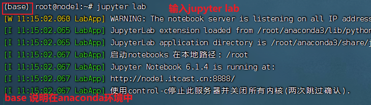
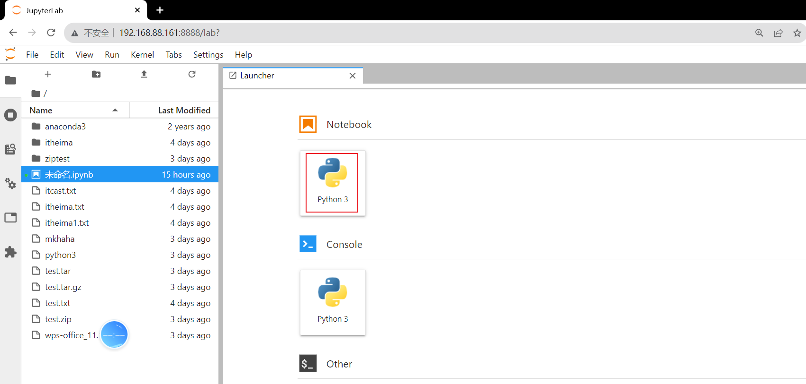
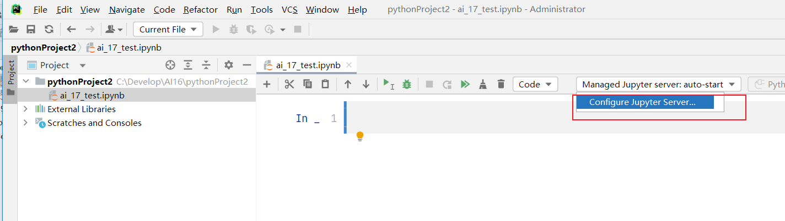
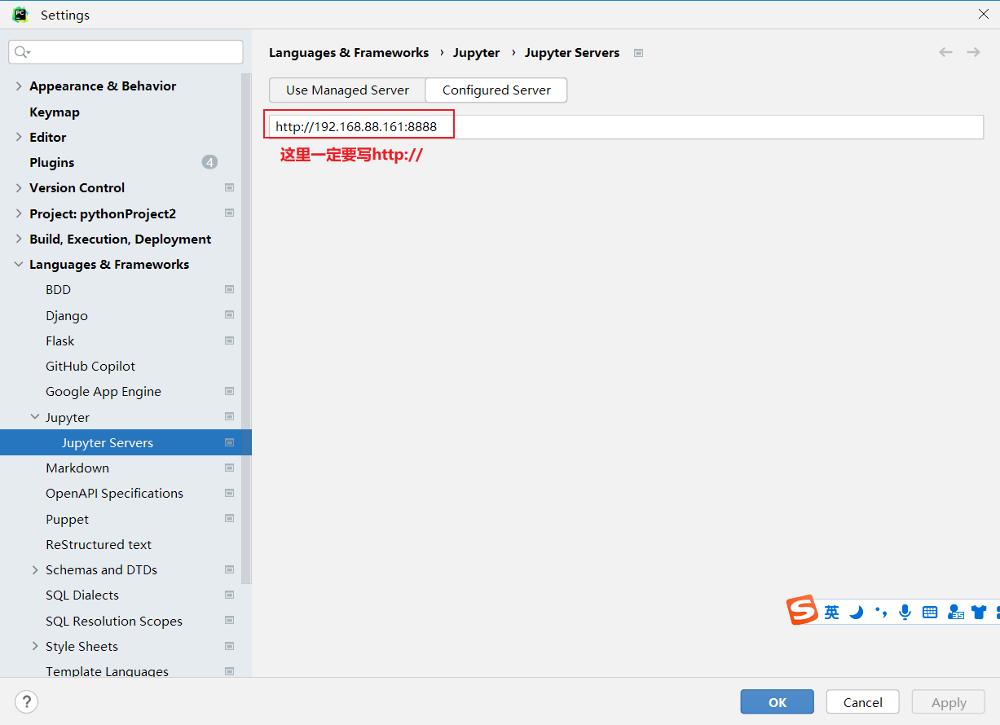
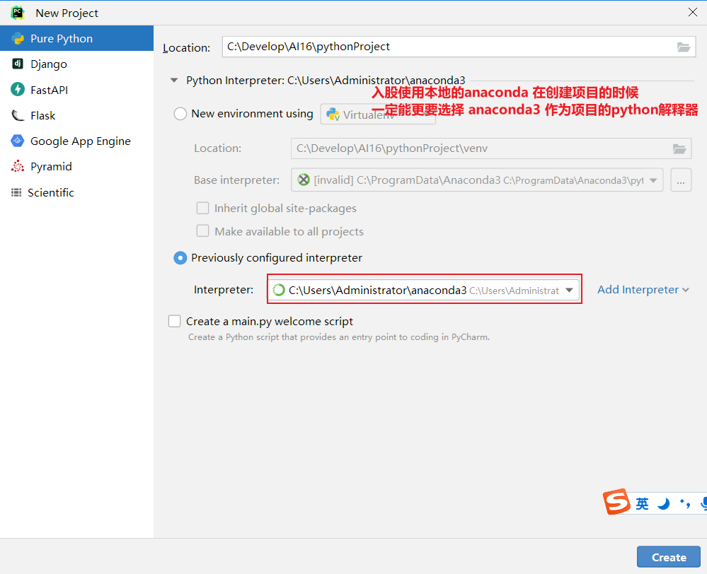
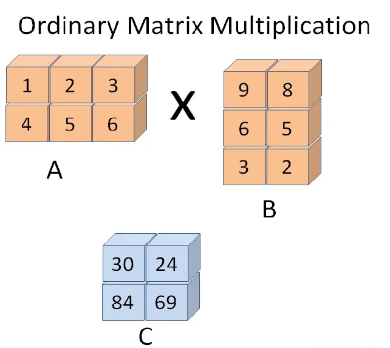

## 1. 窗口函数

### 1.1 核心概念与语法

**窗口函数**是SQL中用于复杂数据分析的高级工具，允许在数据集的特定"窗口"（相关行集合）上执行计算，**不合并原始数据行**，为每行生成独立结果。

#### 基本语法结构

```sql
-- 完整语法格式
SELECT 
    列1, 列2,
    窗口函数() OVER (
        [PARTITION BY 分区列]          -- 定义分组窗口，类似GROUP BY但保留所有行
        [ORDER BY 排序列 [ASC|DESC]]   -- 定义排序规则，确定窗口内计算顺序
        [ROWS/RANGE BETWEEN 起始范围 AND 结束范围]  -- 定义窗口帧，控制计算范围
    ) AS 别名
FROM 表名;
```

**⚠️ 关键区别**：`PARTITION BY`与`GROUP BY`虽然都分组，但`PARTITION BY`返回结果集行数与原始表相同，而`GROUP BY`会合并行。

> 窗口函数讲解：
>
> - 由 `OVER()` 子句定义，决定函数计算的范围。
> - 可以基于分区（`PARTITION BY`）、排序（`ORDER BY`）和行范围（`ROWS` 或 `RANGE`）进一步细化。
>   - `PARTITION BY` 和 `GROUP BY` 的相同点：都会使用字段进行分组 , 做聚合计算的时候, 结果都是一样的
>   - `PARTITION BY` 和 `GROUP BY` 的区别：`GROUP BY` 分组 聚合之后, 分组字段有几个取值, 就会返回几条结果；`PARTITION BY` 返回的结果跟原始数据表的条目数是一样的
>   - `ROWS/RANGE BETWEEN 起始范围 AND 结束范围`：定义窗口的起始和结束范围（**窗口帧**）。
>     1. `UNBOUNDED PRECEDING`：窗口从第一行开始。
>     2. `CURRENT ROW`：当前行。
>     3. `n PRECEDING`/`n FOLLOWING`：当前行前/后n行。
>     4. 示例：`ROWS BETWEEN 2 PRECEDING AND CURRENT ROW`计算当前行及其前两行的聚合。


### 1.2 执行机制对比

| 特性             | 窗口函数               | 普通聚合函数（GROUP BY）       |
| :--------------- | :--------------------- | :----------------------------- |
| **输出行数**     | 与输入行数相同         | 合并为分组后的行数（可能更少） |
| **计算范围**     | 基于窗口分区和排序规则 | 基于分组列                     |
| **典型用途**     | 排名、累计、趋势分析   | 汇总统计（总和、平均值等）     |
| **保留原始数据** | ✅ **保留所有明细行**   | ❌ 仅保留分组和聚合结果         |


### 1.3 常见窗口函数分类

#### 1.3.1 排名函数

```sql
-- ROW_NUMBER()：分配唯一序号，相同值按顺序编号
SELECT name, score, 
       ROW_NUMBER() OVER (ORDER BY score DESC) AS rank
FROM students;

-- RANK()：相同值排名相同，后续排名跳过（如1,1,3）
SELECT name, score, 
       RANK() OVER (ORDER BY score DESC) AS rank
FROM students;

-- DENSE_RANK()：相同值排名相同，后续排名不跳过（如1,1,2）
SELECT name, score, 
       DENSE_RANK() OVER (ORDER BY score DESC) AS rank
FROM students;

-- NTILE(n)：将数据分成n个近似相等的组
SELECT name, score, 
       NTILE(4) OVER (ORDER BY score DESC) AS quartile
FROM students;
```

| name    | score | quartile |
| :------ | :---- | :------- |
| Alice   | 95    | 1        |
| David   | 95    | 1        |
| Grace   | 92    | 1        |
| Bob     | 88    | 2        |
| Eva     | 85    | 2        |
| Jack    | 85    | 2        |
| Henry   | 80    | 3        |
| Ivy     | 78    | 3        |
| Charlie | 76    | 4        |
| Frank   | 70    | 4        |


#### 1.3.2 聚合函数作为窗口函数

**`SUM() OVER()`、`AVG() OVER()`**、 **`COUNT() OVER()`**、 **`MIN() OVER()`**、 **`MAX() OVER()`**

计算累计值或分区内聚合。

```sql
-- 计算每个部门的累计工资（按入职日期排序）
SELECT name, department, salary,
       SUM(salary) OVER (PARTITION BY department ORDER BY hire_date) AS cumulative_salary
FROM employees;
```


#### 1.3.3 偏移函数（核心分析工具）

```sql
-- LAG：获取当前行之前第n行数据
-- LEAD：获取当前行之后第n行数据
SELECT date, revenue,
       LAG(revenue, 1, 0) OVER (ORDER BY date) AS prev_revenue,  -- 前1行数据，无则为0
       LEAD(revenue, 1) OVER (ORDER BY date) AS next_revenue     -- 后1行数据，无则为NULL
FROM sales;

-- 计算环比增长（关键业务场景）
SELECT 
  date, 
  revenue,
  LAG(revenue, 1, 0) OVER (ORDER BY date) AS prev_revenue,  -- 获取上期数据
  revenue - LAG(revenue, 1, 0) OVER (ORDER BY date) AS growth -- 计算增长值
FROM daily_sales;
```

**结果示例**：

| date       | revenue | prev_revenue | growth |
| :--------- | :------ | :----------- | :----- |
| 2023-01-01 | 1000    | 0            | 1000   |
| 2023-01-02 | 1500    | 1000         | 500    |
| 2023-01-03 | 1200    | 1500         | -300   |

**💡 使用技巧**

- **必须指定 `ORDER BY`**：偏移函数依赖排序规则确定“前一行”或“后一行”的位置。

- **处理分区边界**：使用 `PARTITION BY` 时，偏移仅在分区内生效；分区第一行的 `LAG` 返回默认值，最后一行的 `LEAD` 同理。

- **默认值的设置**：通过第三个参数定义默认值，避免返回 `NULL`：


### 1.4 实践案例：员工数据分析

```sql
create database ai charset=utf8;
use ai;

create table employee(
    id int unsigned primary key not null,
    first_name varchar(20) not null,
    last_name varchar(30) not null,
    department_id  tinyint not null,
    salary int not null,
    years_worked  tinyint not null
);

insert into employee values
(1, 'Diane', 'Turner', 1, 5330, 4),
(2, 'Clarence', 'Robinson', 1, 3617, 2),
(3, 'Eugene', 'Phillips', 1, 4877, 2),
(4, 'Philip', 'Mitchell', 1, 5259, 3),
(5, 'Ann', 'Wright', 2, 2094, 5),
(6, 'Charles', 'Wilson', 2, 5167, 5),
(7, 'Russell', 'Johnson', 2, 3762, 4),
(8, 'Jacqueline', 'Cook', 2, 6923, 3),
(9, 'Larry', 'Lee', 3, 2796, 4),
(10, 'Willie', 'Patterson', 3, 4771, 5),
(11, 'Janet', 'Ramirez', 3, 3782, 2),
(12, 'Doris', 'Bryant', 3, 6419, 1),
(13, 'Amy', 'Williams', 3, 6261, 1),
(14, 'Keith', 'Scott', 3, 4928, 8),
(15, 'Karen', 'Morris', 4, 6347, 6),
(16, 'Kathy', 'Sanders', 4, 6286, 1),
(17, 'Joe', 'Thompson', 5, 5639, 3),
(18, 'Barbara', 'Clark', 5, 3232, 1),
(19, 'Todd', 'Bell', 5, 4653, 1),
(20, 'Ronald', 'Butler', 5, 2076, 5)
;

create table department(
    id int unsigned primary key not null,
    name varchar(30) not null
);

insert into department values
(1, 'IT'),
(2, 'Management'),
(3, 'Human Resources'),
(4, 'Accounting'),
(5, 'Help Desk')
;


SELECT
  first_name,
  last_name,
  salary,
  AVG(salary) OVER()
FROM employee;

-- 按部门计算平均薪资 统计每个员工和部门平均薪资的差值
select first_name,last_name,salary ,name ,
       AVG(salary) OVER(partition by department_id) ,
       salary - AVG(salary) OVER(partition by department_id) as difference
from employee
join department on employee.department_id = department.id;
```


```sql
-- 使用RANK/DENSE_RANK/ROW_NUMBER 进行组内排序
create table employee2 (
  											empid int,
  											ename varchar(20) ,
  											deptid int ,
  											salary decimal(10,2)
												);

insert into employee2 values(1,'刘备',10,5500.00);
insert into employee2 values(2,'赵云',10,4500.00);
insert into employee2 values(2,'张飞',10,3500.00);
insert into employee2 values(2,'关羽',10,4500.00);

insert into employee2 values(3,'曹操',20,1900.00);
insert into employee2 values(4,'许褚',20,4800.00);
insert into employee2 values(5,'张辽',20,6500.00);
insert into employee2 values(6,'徐晃',20,14500.00);

insert into employee2 values(7,'孙权',30,44500.00);
insert into employee2 values(8,'周瑜',30,6500.00);
insert into employee2 values(9,'陆逊',30,7500.00);


-- row_number() over(PARTITION BY deptid ORDER BY salary DESC)组内排序
select ename from
(select empid, ename,deptid,salary,row_number() over(PARTITION BY deptid ORDER BY salary DESC) as rank_ from employee2) temp where temp.rank_<3 ;
```

> 需要注意 给窗口函数结果起别名, 这里直接使用rank 会报错, rank是SQL的关键字


### 1.5 SQL别名作用域问题

**⚠️ 核心限制**：同一层级的`SELECT`列表中，不能直接引用其他列的别名。

#### SQL执行顺序

```
FROM → WHERE → GROUP BY → HAVING → SELECT → ORDER BY
```

窗口函数在 `SELECT` 阶段计算，同时 `SELECT` 中的别名（如 `avg_salary_department`）也在这一阶段定义。但同一层级的 `SELECT` 列表中，列的表达式是并行计算的，这意味着：

- 在计算 `salary - avg_salary_department` 时，`avg_salary_department` 尚未被定义（或未被识别）。

- SQL 引擎会直接报错，提示 `avg_salary_department` 列不存在。

#### 错误示例与修正

```sql
-- ❌ 错误：在SELECT中直接引用同层级别名
SELECT 
    first_name,
    salary,
    AVG(salary) OVER (PARTITION BY department_id) AS avg_salary,
    salary - avg_salary AS difference  -- 报错：avg_salary未定义
FROM employee;

-- ✅ 正确：通过子查询或CTE解决,因为子查询会先生成一个临时结果集，别名会成为该结果集的列名，供外层查询使用。
-- CTE
WITH EmployeeStats AS (
    SELECT 
        first_name,
        salary,
        AVG(salary) OVER (PARTITION BY department_id) AS avg_salary  -- 在内层定义别名
    FROM employee
)
SELECT 
    first_name,
    salary,
    avg_salary,
    salary - avg_salary AS difference  -- 在外层引用别名
FROM EmployeeStats;

-- 子查询
SELECT 
  first_name,
  last_name,
  salary,
  name,
  hi,
  salary - hi AS difference  -- 合法：hi 是子查询的列
FROM (
  SELECT 
    e.first_name,
    e.last_name,
    e.salary,
    d.name,
    AVG(e.salary) OVER (PARTITION BY e.department_id) AS hi
  FROM employee e
  JOIN department d ON e.department_id = d.id
) AS sub_query;
```

**💡 最佳实践**：复杂计算优先使用CTE（公用表表达式），代码可读性更高。


## 2. Python数据分析环境搭建

### 2.1 python对比其他工具

Python凭借其**易用性、强大的库支持、灵活性**和**广泛的应用场景**，成为数据分析领域的首选工具。无论是处理小规模数据还是构建复杂的数据科学管道，Python都能提供高效解决方案。

| 工具       | 优势对比                                                     |
| :--------- | :----------------------------------------------------------- |
| **R语言**  | Python通用性更强，适合与工程化部署结合；R在统计模型和可视化细节更专业。 |
| **Excel**  | Python可处理更大规模数据，且避免手动操作错误。               |
| **MATLAB** | Python免费开源，库生态更丰富。                               |

- Pandas：**series** 一列数据；**dataframe** 二维表格

- numpy：  科学计算库, Pandas 默认使用Numpy 做数值计算
- Matplotlib： 灵活的可视化工具，适合生成静态、交互式或动态图表。


### 2.2 开发环境搭建和Notebook使用说明

开发环境： `Jupyter Lab`/`Jupyter notebook`

为什么需要使用`Jupyter`：`Jupyter`是数据科学和教育的“瑞士军刀”，尤其适合需要**交互性**和**可视化**的场景。对于复杂项目，可结合传统 IDE（如 VS Code、PyCharm）使用。其核心价值在于**“将思考过程与成果无缝结合”**，是探索性工作的理想工具

- 可以在虚拟机中（安装**`anaconda`**-python的发行版）：具体操作流程在开发环境配置文件夹中。

- 也可以在本地安装 `anaconda`

- 在pycharm中调用notebook


#### 远程服务器配置流程

打开虚拟机，通过 finalshell 连接，在finalshell 的命令行 输入jupyter lab



打开浏览器, 输入 192.168.88.161:8888  回车之后, 会弹出输入密码的窗口, 输入123456  就可以了

在浏览器中看到如下页面, 点击 notebook就可以创建一个新的notebook




#### PyCharm连接远程Notebook

- 新建一个purepython项目, 解释器选哪个都行
- 创建jupyter notebook


- 创建好notebook后, 打开这个文件, 选择配置Jupyter 服务器






#### 本地环境搭建

安装anaconda 




### 2.3 notebook核心快捷键

| 快捷键          | 操作说明                      | 适用模式          |
| :-------------- | :---------------------------- | :---------------- |
| `Esc`           | 切换到命令模式                | 编辑模式→命令模式 |
| `a` / `b`       | 在当前Cell上方/下方插入新Cell | 命令模式          |
| `dd`            | 删除当前Cell（连按两次）      | 命令模式          |
| `m` / `y`       | 切换为Markdown/Code模式       | 命令模式          |
| `Shift + Enter` | 运行并跳到下一个Cell          | 任意模式          |
| `Ctrl + Enter`  | 仅运行当前Cell                | 任意模式          |


## 3. NumPy科学计算库

### 3.1 核心优势

**NumPy**（Numerical Python）是Python科学计算基础库，提供高性能多维数组操作和数学函数支持。

| 优势           | 说明                                                         |
| :------------- | :----------------------------------------------------------- |
| **⚡ 性能优势** | 底层C实现，向量化操作避免Python循环，处理百万级数据效率提升10-100倍 |
| **🔧 简洁语法** | 一行代码实现复杂矩阵运算，如`A @ B`完成矩阵乘法              |
| **🔗 生态基石** | Pandas、SciPy、TensorFlow等库均基于NumPy构建                 |


### 3.2 numpy的属性

#### **a、形状与维度**

- **`shape`**

数组的维度结构（元组形式），例如 `(行数, 列数)`。

```python
arr = np.array([[1, 2], [3, 4]])
print(arr.shape)  # 输出 (2, 2)
```

- **`ndim`**

数组的维度数（轴的个数）。

```python
print(arr.ndim)  # 输出 2（二维数组）
```

- **`size`**

数组总元素个数。

```python
print(arr.size)  # 输出 4（2×2）
```


#### **b、数据类型**

- **`dtype`**

数组元素的数据类型（如 `int32`, `float64`）。

```python
arr = np.array([1, 2], dtype=np.float32)
print(arr.dtype)  # 输出 float32
```

**💡 内存优化**：大数据场景下，合理选择`dtype`（如`float32`替代`float64`）可节省50%内存。


#### **c、内存信息**

- **`itemsize`**

单个元素占用的字节数（由 `dtype` 决定）。

```python
print(arr.itemsize)  # 输出 4（float32 占4字节）
```


- **`nbytes`**

数组总内存占用（字节数）: `size * itemsize`。

```python
print(arr.nbytes)  # 输出 8（2元素×4字节）
```


####  **d、其他实用属性**

- **`T`**  

返回数组的转置（交换行列），只对二维及以上数组体现为转置，1维数组不变。

```python
print(arr.T)  # 转置（若 arr 是二维数组）
```


#### **e、 关键操作与注意事项**

- **修改形状**

直接修改 `shape` 属性（需总元素数一致）：

```python
arr.shape = (4, 1)  # 在原始数据上修改
```

使用 `reshape()` 方法（返回新数组，原数组不变）：

```python
new_arr = arr.reshape(4, 1)
```

| 属性/方法   | 功能说明                       | 示例代码                                                     | 示例输出              |
| ----------- | ------------------------------ | ------------------------------------------------------------ | --------------------- |
| `shape`     | 数组的维度结构（如`(行, 列)`） | `arr = np.array([[1,2],[3,4]])` `print(arr.shape)`           | `(2, 2)`              |
| `ndim`      | 数组的维度数（轴的个数）       | `print(arr.ndim)`                                            | `2`                   |
| `size`      | 数组总元素个数                 | `print(arr.size)`                                            | `4`                   |
| `dtype`     | 元素的数据类型                 | `arr = np.array([1,2], dtype=np.float32)` `print(arr.dtype)` | `float32`             |
| `itemsize`  | 单元素占用字节数               | `print(arr.itemsize)`                                        | `4`                   |
| `nbytes`    | 数组总内存占用（字节数）       | `print(arr.nbytes)`                                          | `8`                   |
| `T`         | 数组转置                       | `print(arr.T)`                                               | `[[1 3]\n [2 4]]`     |
| 修改`shape` | 直接修改形状，需元素数一致     | `arr.shape = (4, 1)`                                         | 修改后 shape: `(4,1)` |
| `reshape()` | 返回新形状数组，原数组不变     | `new_arr = arr.reshape(4, 1)`                                | 新数组 shape: `(4,1)` |


### 3.3 创建ndarray

#### **a、直接输入创建**

ndarray 每一个元素的数据类型必须一致

```python
a = np.array([2,3,4])
a = np.array([1,2,'haha']) # 如果这样创建的话，会将1，2转换为字符串格式，array(['1', '2', 'haha'], dtype='<U21') 
```


#### b、批量生成创建

- **`zeros()` 、`ones()`、`empty()`**
  - 函数**`zeros()`**创建一个全是0的数组
  - 函数**`ones()`**创建一个全1的数组
  - 函数**`empty()`**创建一个内容随机并且依赖于内存状态的数组。
    - 以上三个方法默认创建的数组类型(`dtype`)都是`float64`
    - 传入的是 shape形状，以元组的形式
    - 实例：`np.ones((2,3,4))`

```python
array([[[1., 1., 1., 1.],
        [1., 1., 1., 1.],
        [1., 1., 1., 1.]],

       [[1., 1., 1., 1.],
        [1., 1., 1., 1.],
        [1., 1., 1., 1.]]])
```


- **`arange ()`** 

`arange()` 类似 `python` 的 `range()` ，创建一个一维 ndarray 数组。

```python
np_arange = np.arange(10,20,5,dtype=int)
print('arange创建np_arange:',np_arange)  # arange创建np_arange: [10 15]
print('arange创建np_arange的元素类型:',np_arange.dtype)  # arange创建np_arange的元素类型: int32
print('arange创建np_arange的类型:',type(np_arange))  # arange创建np_arange的类型: <class 'numpy.ndarray'>
```


#### c、随机生成创建

```python
np.random.rand(3,4) # 0,1 之间，浮点数
np.random.randint(-5,5,size=(3,4)) # 随机的整数 给定起始结束区间, size 生成随机数的形状
np.random.uniform(-1,5,size=(3,4)) # 生成均匀分布浮点数的随机数  给定起始结束区间, size 生成随机数的形状
np.random.randn(2, 3)   # 生成服从标准正态分布（均值为 0，标准差为 1）的随机数数组
```


#### d、生成矩阵

**matrix** 是 ndarray 的子类，只能生成 2 维的矩阵

```python
x1 = np.mat("1 2;3 4") # 字符串定义矩阵
x2 = np.matrix("1 2;3 4") # 字符串定义矩阵

x3 = np.matrix([[1,2,3],[4,5,6]]) # 列表定义矩阵
```


#### e、生成等比/等差数列

- `logspace()` 等比数列：`np.logspace()`是用于创建一个等比数列构成的一维数组，它最常用的有三个参数，第一个参数表示起始点，第二个参数表示终止点，第三个参数表示数列的个数。

```python
# logspace中，开始点和结束点是默认是10的幂
np.logspace(0,0,10)
np.logspace(0,9,10)
np.logspace(0,9,10,base=2) # base 可以换底数  这里就是2^0 ~2^9 生成10个数的等比数列
```


- `linspace()`等差数列：`np.linspace()`是用于创建一个等差数列构成的一维数组，它最常用的有三个参数，第一个参数表示起始点，第二个参数表示终止点，第三个参数表示数列的个数。

```python
np.linspace(1,10,10)
np.linspace(1,10,10,endpoint=False) #endpoint 是否包含结束点, 默认是True 改成False不包含结束点
```

> `logspace()`、`linspace()`创建的数组元素是浮点型。


#### f、ndarray的数据类型

- dtype参数，指定数组的数据类型，类型名+位数，如float64, int32
- astype方法，转换数组的数据类型

```python
import numpy as np

# 初始化3行4列数组，数据类型为float64
zeros_float_arr = np.zeros((3, 4), dtype=np.float64)
print(zeros_float_arr)
print(zeros_float_arr.dtype)  # float64

# astype转换数据类型，将已有的数组的数据类型转换为int32
zeros_int_arr = zeros_float_arr.astype(np.int32)
print(zeros_int_arr)
print(zeros_int_arr.dtype)  # int32
```


### 3.4 Numpy的内置函数

#### **a、基本函数**

```python
import numpy as np
arr = np.random.uniform(-1,5,size=(3,4)) 

np.ceil(arr)   # 向上最接近的整数，参数是 number 或 array
np.floor(arr)  # 向下最接近的整数，参数是 number 或 array
np.rint(arr)   # 四舍五入，参数是 number 或 array
np.isnan(arr)  # 判断元素是否为 NaN(Not a Number)，返回布尔掩码。参数是 number 或 array

# 需要注意multiply/divide 如果是两个ndarray进行运算 shape必须一致
np.multiply(arr,arr)  # 对应位置相乘，参数是 number 或 array
np.divide(arr,arr)    # 对应位置相除，参数是 number 或 array

np.abs()       # 元素的绝对值，参数是 number 或 array
np.where(arr>0,1,-1)  # np.where(condition, x, y): 三元运算符，x if condition else y
```


#### **b、统计函数** 

```python
import numpy as np
arr = np.random.uniform(-1,5,size=(3,4)) 

np.mean(arr)  # 所有元素的平均值,参数是 number 或 array
np.sum(arr)   # 所有元素的和，参数是 number 或 array
np.max(arr)   # 所有元素的最大值，参数是 number 或 array
np.min(arr)   # 所有元素的最小值，参数是 number 或 array
np.argmax(arr)   # 最大值的下标索引值，参数是 number 或 array
np.argmin(arr)   # 最小值的下标索引值，参数是 number 或 array
np.cumsum()   # 返回一个一维数组，每个元素都是之前所有元素的累加和，参数是 number 或 array  
np.cumprod()  # 返回一个一维数组，每个元素都是之前所有元素的累乘积，参数是 number 或 array  


np.std(arr)   # 所有元素的标准差，参数是 number 或 array
np.var(arr)   # 所有元素的方差，参数是 number 或 array
```

**💡 axis参数理解**：多维数组默认统计全部维度，**axis参数**可以按指定轴心统计。`axis=0`可理解为"跨行操作"（压缩行），`axis=1`为"跨列操作"。不确定时可用小数组测试验证！

```python
np.sum(arr,axis=0)  # 数组的按列统计和
np.sum(arr,axis=1)  # 数组的按行统计和
```


**统计概念：标准差与方差**

标准差和方差是统计学中衡量数据 **离散程度（波动性）** 的核心指标，两者密切相关但用途不同。以下是它们的定义、区别及实际意义：

- **方差（Variance）**
  - **定义**：数据点与均值的 **平方差的平均值**。
  - **公式**：

$$
σ^2 = \frac{1}{N} \sum_{i=1}^{N} (x_i - \mu)^2
$$

- **标准差（Standard Deviation）**
  - **定义**：方差的 **平方根**，将离散程度还原到原始数据单位。
  - **公式**：

$$
s = \sqrt{σ^2}
$$

**核心区别**

| **特征**     | **方差（Variance）**             | **标准差（Standard Deviation）**     |
| :----------- | :------------------------------- | :----------------------------------- |
| **单位**     | 原始数据单位的平方（如：米²）    | 与原始数据单位一致（如：米）         |
| **数学性质** | 放大离群值的影响（平方操作）     | 缓解离群值影响（平方根操作）         |
| **应用场景** | 理论分析（如概率模型、优化算法） | 实际解释（如数据波动描述、风险评估） |
| **直观性**   | 较难直接理解（单位不直观）       | 更易解释（单位与数据一致）           |


**实际意义**

- **方差的意义**
  - **反映数据整体波动强度**：方差越大，数据点越分散。
  - **用于数学推导**：在统计学公式（如协方差、回归分析）中，方差更易于代数运算。

- **标准差的意义**
  - **直观衡量波动性**：例如，股票收益率的标准差代表风险。
  - **判断数据分布**：在正态分布中，约 68% 的数据落在均值 ±1 标准差内，95% 在 ±2 标准差内。


**示例**

假设某班级数学成绩为：`[70, 80, 85, 90, 95]`，均值为 `84`。

- **计算方差**：

$$
σ^2 = \frac{(70-84)^2+(80-84)^2+(85-84)^2+(90-84)^2+(95-84)^2}{5} =92
$$

- **计算标准差**：

$$
s = \sqrt{92}≈9.59
$$

- **解读**：学生成绩平均波动约 ±9.59 分。


**总结**

- **方差**是理论计算的基础，**标准差**是实际解释的工具。

- 选择使用场景：

  - 若需要数学运算（如回归分析），优先用方差。

  - 若需直观理解数据波动，用标准差。

    

#### **c、比较函数**

- `np.any()`: 至少有一个元素满足指定条件，返回True

- `np.all()`: 所有的元素满足指定条件，返回True


```python
import numpy as np

# 生成一个2行3列的随机数组，元素服从标准正态分布
arr = np.random.randn(2, 3)

# 检查数组中是否有任一元素大于0
print(np.any(arr > 0))  # 返回True或False

# 检查数组中是否所有元素都大于0
print(np.all(arr > 0))  # 返回True或False
```


#### **d、去重**

`np.unique()`:找到唯一值并返回排序结果，类似于Python的set集合

```python
import numpy as np

# 创建一个2行3列的数组
arr = np.array([[1, 2, 1], [2, 3, 4]])

# 打印数组
print(arr)
"""
输出:
[[1 2 1]
 [2 3 4]]
"""

# 获取数组的唯一值（去重后排序）
unique_values = np.unique(arr)
print(unique_values)
"""
输出:
[1 2 3 4]
"""
```


#### **e、排序**

```python
# 返回副本排序（不改变原数组）
sorted_arr = np.sort(arr)       # 每行单独排序

# 原地排序（修改原数组）
arr.sort()                      # 直接修改arr本身
```


### 3.5 ndarray运算规则

#### a、元素级运算（广播机制）

ndarray的算术运算（加、减、乘、除）是**按照元素位置**计算的。新的数组被创建并且被结果填充。计算的时候, 位置对应的元素 进行 加减乘除的计算, 计算之后得到的结果的shape 跟arr_a  /arr_b 一样

```python
arr_a = np.array([[1, 2], [3, 4]])
arr_b = np.array([[5, 6], [7, 8]])

# 对应位置运算
add_result = arr_a + arr_b      # [[6,8], [10,12]]
sub_result = arr_a - arr_b      # [[-4,-4], [-4,-4]]
mult_result = arr_a * arr_b     # [[5,12], [21,32]]（注意不是矩阵乘法）
div_result = arr_a / arr_b      # [[0.2,0.33], [0.43,0.5]]
```

💡前提：shape相同或遵循广播规则


**广播机制（Broadcasting）详解**

当两个数组shape不同时，NumPy会自动扩展较小数组以匹配较大数组的形状，无需显式复制数据。

```python
# 广播示例：2×2数组与1×2数组相乘
A1 = np.array([[1, 2], [3, 4]])      # shape: (2, 2)
B1 = np.array([[10, 20]])            # shape: (1, 2)

# B1会被自动广播为[[10,20], [10,20]]，然后对应位置相乘
result = A1 * B1
print(result)  # 输出: [[10, 40], [30, 80]]
```

**广播机制三规则**：

**规则1：维度从后向前比较**

```python
import numpy as np

# 示例：二维数组 × 一维数组
A = np.array([[1, 2, 3],      # shape: (2, 3)
              [4, 5, 6]])
              
B = np.array([10, 20, 30])    # shape: (3,)

# 比较顺序（从后向前）：
# A的维度: (2, 3)  →  最后一个维度是3
# B的维度: (3,)    →  最后一个维度是3
#           ↑
#       先比较这里（从后往前）
```

**为什么从后向前？**
因为NumPy数组的**最后维度代表列（特征）**，是数据的最小计算单元。从后比较可以确保核心数据维度对齐。

**规则2：两个维度相等，或其中一个为1，或其中一个不存在**

| 条件               | 说明                                          | 结果             |
| :----------------- | :-------------------------------------------- | :--------------- |
| **维度相等**       | 对应维度长度相同                              | ✅ 兼容，直接运算 |
| **其中一个为1**    | 长度为1的维度可被**拉伸**（复制）以匹配另一个 | ✅ 兼容，自动广播 |
| **其中一个不存在** | 缺失的维度视为1                               | ✅ 兼容，自动补充 |

```python
# 场景1：维度相等（直接运算）
A = np.ones((3, 4))      # shape: (3, 4)
B = np.ones((3, 4))      # shape: (3, 4)
# 结果: (3, 4)，对应位置元素相加

# 场景2：其中一个为1（自动拉伸）
A = np.ones((3, 4))      # shape: (3, 4)
B = np.ones((1, 4))      # shape: (1, 4) → 被拉伸为 (3, 4)
# B的第0维从1复制为3，与A匹配
# 结果: (3, 4)

# 场景3：其中一个不存在（视为1）
A = np.ones((3, 4))      # shape: (3, 4)
B = np.ones((4,))        # shape: (4,) → 视为 (1, 4) → 拉伸为 (3, 4)
# B缺失第0维，先补1，再拉伸
# 结果: (3, 4)
```

**规则3：不满足则报错**

如果对应维度既不相等，也不为1，则无法广播，抛出`ValueError`。

```python
# 错误示例：维度不兼容
A = np.ones((3, 4))      # shape: (3, 4)
B = np.ones((3, 5))      # shape: (3, 5)

# 从后比较：
# A: (3, 4)  最后一个维度是4
# B: (3, 5)  最后一个维度是5
#           ↑
#      4 ≠ 5，且都不为1 → ❌ 报错！

A + B  # ValueError: operands could not be broadcast together with shapes (3,4) (3,5)
```


#### b、矩阵乘法（点积运算）

`arr_a  .dot(arr_b)` 前提： arr_a 列数 = arr_b 行数




```python
# 前提：arr_a列数 == arr_b行数
x = np.array([[1, 2, 3], [4, 5, 6]])  # 2x3矩阵
y = np.array([[6, 23], [-1, 7], [8, 9]])  # 3x2矩阵

# 方法1：使用dot方法
matrix_product = x.dot(y)  # 2x2结果矩阵

# 方法2：使用全局函数
matrix_product2 = np.dot(x, y)

# 计算过程：
# [1*6+2*(-1)+3*8, 1*23+2*7+3*9] = [28, 64]
# [4*6+5*(-1)+6*8, 4*23+5*7+6*9] = [73, 181]
# 结果：[[28, 64], [73, 181]]
```

**⚠️ 常见错误**：混淆`*`（元素乘）与`dot`（矩阵乘），导致维度不匹配错误。


## 4. Pandas数据结构

### 4.1 Series与DataFrame核心概念

**Pandas**提供两种核心数据结构：**Series**（一维）和**DataFrame**（二维）。**Series**表示**DataFrame**的每一列。可以把**DataFrame**看作由**Series**对象组成的字典，其中**key**是列名，值是**Series**。

💡提示：Series和Python中的列表非常相似，但是它的每个元素的**数据类型必须相同**。


#### **4.1.1 Series（单列数据容器）**

- 如果不特殊指定, 会自动添加行索引 Index, 从0开始计数
- 如果想自己设置行索引, 创建Series时可以通过index这个参数来设置行索引

```python
import pandas as pd

# 方式1：从列表创建（自动生成索引0,1,2...）
s1 = pd.Series(['banana', 42])  # 混合类型会转为object

# 方式2：指定自定义索引
s2 = pd.Series(['Tome', 'Male'], index=['Name', 'Gender'])  # 通过index这个参数来设置行索引

# 方式3：从字典创建（键作为行索引）
s3 = pd.Series({'a': 100, 'b': 200, 'c': 300})

# Series与DataFrame转换
s = pd.Series([1, 2, 3], name='Values')
df_from_series = s.to_frame()  # Series转单列DataFrame
```

#### 4.1.2 DataFrame（二维表格）

- 有行索引index, 也有列名 columns
- 是多个 Series 的集合（每列是一个 Series）

```python
# 方式1：从字典创建（推荐，列名即键）
df1 = pd.DataFrame({
    '姓名': ['Tome', 'Bob'],
    '职业': ['算法工程师', 'AI工程师'],
    '年龄': [28, 36]
})

# 方式2：指定列顺序和行索引
df2 = pd.DataFrame(
    data={'职业': ['算法工程师', 'AI工程师'], '年龄': [28, 36]},
    columns=['年龄', '职业'],  # 指定列顺序
    index=['Tome', 'Bob']      # 指定行索引
)

# 方式3：从列表创建（需指定列名）
df3 = pd.DataFrame([[1, 'A'], [2, 'B']], columns=['ID', 'Label'])

# 方式4：从CSV文件读取（真实工作场景）
# index_col参数：指定作为行索引的列
df_csv = pd.read_csv('/path/to/data.csv', index_col='id')
print(df_csv.head())  # 查看前5行

# DataFrame与Series转换
s = df['Column_Name']  # 提取单列
```


#### 4.1.3 核心区别对比

| 特性         | Series            | DataFrame                  |
| :----------- | :---------------- | :------------------------- |
| **维度**     | 一维              | 二维                       |
| **数据形式** | 单列数据          | 多列数据（每列为Series）   |
| **索引结构** | 单层索引（Index） | 行索引 + 列索引（Columns） |
| **创建方式** | 列表、字典        | 字典、列表、CSV/Excel文件  |
| **内存占用** | 更小              | 更大（但功能更丰富）       |


### 4.2 Series常用操作大全

```python
# 使用 DataFrame的loc属性获取数据集里的一行，就会得到一个Series对象,从DataFrame中获取一行/一列数据 都会返回Series。
first_row = df.loc[0]  # 提取第一行，返回Series
age_column = df['年龄']  # 提取列，返回Series
```


**常用属性**

| 属性       | 说明                         | 示例                            |
| :--------- | :--------------------------- | :------------------------------ |
| `s.index`  | 获取 Series 的索引（可修改） | `s.index = ['a', 'b', 'c']`     |
| `s.values` | 获取NumPy数组（底层数据）    | `s.values` → `array([1, 2, 3])` |
| `s.dtype`  | 获取数据类型                 | `s.dtype` → `int64`             |
| `s.name`   | 获取或设置 Series 的名称     | `s.name = "Price"`              |
| `s.size`   | 获取元素数量                 | `s.size` → `3`                  |
| `s.shape`  | 获取形状（一维元组）         | `s.shape` → `(3,)`              |


**常用方法**

**1. 数据查看与统计**

| 方法                   | 说明                                   | 示例                       |
| :--------------------- | :------------------------------------- | :------------------------- |
| `s.head(n)`            | 查看前 `n` 行（默认 5）                | `s.head(3)`                |
| `s.tail(n)`            | 查看后 `n` 行（默认 5）                | `s.tail(2)`                |
| `s.describe()`         | 生成统计摘要（均值、标准差、分位数等） | `s.describe()`             |
| `s.mean()` / `s.sum()` | 计算均值 / 求和                        | `s.mean()` → `25.5`        |
| `s.min()` / `s.max()`  | 找最小值 / 最大值                      | `s.max()` → `100`          |
| `s.unique()`           | 返回唯一值数组                         | `s.unique()` → `[1, 2, 3]` |
| `s.value_counts()`     | 统计各值出现的频次                     | `s.value_counts()`         |

**2. 数据操作**

| 方法                  | 说明                                | 示例                             |
| :-------------------- | :---------------------------------- | :------------------------------- |
| `s.isna()`            | 判断是否为缺失值（返回布尔 Series） | `s.isna()`                       |
| `s.fillna(value)`     | 填充缺失值                          | `s.fillna(0)`                    |
| `s.dropna()`          | 删除缺失值                          | `s.dropna()`                     |
| `s.astype(dtype)`     | 转换数据类型                        | `s.astype('float')`              |
| `s.apply(func)`       | 对每个元素应用函数                  | `s.apply(lambda x: x*2)`         |
| `s.map(dict)`         | 通过字典映射替换值                  | `s.map({1: 'A', 2: 'B'})`        |
| `s.replace(old, new)` | 替换特定值                          | `s.replace(10, 100)`             |
| `s.sort_values()`     | 按值排序                            | `s.sort_values(ascending=False)` |
| `s.sort_index()`      | 按索引排序                          | `s.sort_index()`                 |

**3. 索引操作**

| 方法                | 说明                                 | 示例                    |
| :------------------ | :----------------------------------- | :---------------------- |
| `s.reset_index()`   | 重置索引（原索引变为一列）           | `s.reset_index()`       |
| `s.set_index(keys)` | 将某列设为新索引（需结合 DataFrame） | 通常在 DataFrame 中使用 |
| `s.rename(index)`   | 重命名索引                           | `s.rename({'a': 'X'})`  |

**4. 布尔索引**

| 方法                    | 说明                 | 示例                |
| :---------------------- | :------------------- | :------------------ |
| `s[s > 10]`             | 筛选值大于 10 的元素 | `s[s > 10]`         |
| `s.between(start, end)` | 筛选值在区间内的元素 | `s.between(20, 50)` |


**`describe()`**：打印描述信息

- ```
  一次性返回 计数/均值/标准差/最小值/ 25%分位数 中位数 75%分位数 最大值 这些常用的统计量
  ```

- ```
  字符串型获取的是 计数/唯一值数量/ 出现次数最多的取值, 及其出现的次数
  ```
