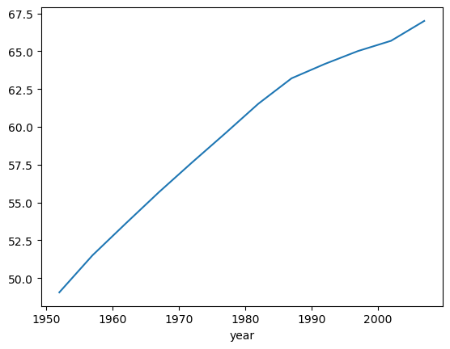

## 1. Anaconda虚拟环境管理

### 1.1 核心概念

Anaconda是专为科学计算设计的Python发行版，内置conda虚拟环境管理器，可为不同项目创建**完全隔离**的Python运行环境。


### 1.2 常用命令速查表

| 命令                                    | 功能                                                   | 示例                                      |
| --------------------------------------- | ------------------------------------------------------ | ----------------------------------------- |
| `conda create -n <env_name>`            | 创建一个新的虚拟环境，名称为 `<env_name>`              | `conda create -n myenv`                   |
| `conda activate <env_name>`             | 激活虚拟环境 `<env_name>`                              | `conda activate myenv`                    |
| `conda deactivate`                      | 退出当前虚拟环境                                       | `conda deactivate`                        |
| `conda env list`                        | 列出所有已创建的虚拟环境                               | `conda env list`                          |
| `conda install <package>`               | 安装包 `<package>` 到当前激活的环境                    | `conda install numpy`                     |
| `conda install -n <env_name> <package>` | 在指定环境 `<env_name>` 中安装包 `<package>`           | `conda install -n myenv pandas`           |
| `conda list`                            | 列出当前环境中的所有已安装的包                         | `conda list`                              |
| `conda update <package>`                | 更新当前环境中的包 `<package>`                         | `conda update numpy`                      |
| `conda update conda`                    | 更新 conda 自身                                        | `conda update conda`                      |
| `conda remove <package>`                | 从当前环境中卸载包 `<package>`                         | `conda remove scipy`                      |
| `conda remove -n <env_name> --all`      | 删除虚拟环境 `<env_name>` 及其所有内容                 | `conda remove -n myenv --all`             |
| `conda clean --all`                     | 清理不再使用的包缓存、日志、索引等文件                 | `conda clean --all`                       |
| `conda info`                            | 显示当前 conda 的配置信息（版本、环境、Python 版本等） | `conda info`                              |
| `conda search <package>`                | 搜索包 `<package>` ，查看其可用版本                    | `conda search scikit-learn`               |
| `conda env export > env.yml`            | 导出当前环境的所有包及其版本为一个 yml 文件            | `conda env export > environment.yml`      |
| `conda env create -f env.yml`           | 根据 yml 文件创建一个新环境                            | `conda env create -f environment.yml`     |
| `conda list --revisions`                | 显示环境中的所有更改历史（安装、卸载、更新等）         | `conda list --revisions`                  |
| `conda install python=<version>`        | 安装或更新指定版本的 Python 到当前环境中               | `conda install python=3.8`                |
| `conda config --add channels <channel>` | 添加新的 conda 仓库源                                  | `conda config --add channels conda-forge` |


### 1.3 为什么需要虚拟环境？

| 优势维度       | 说明                             | 典型案例                                   |
| -------------- | -------------------------------- | ------------------------------------------ |
| **依赖隔离**   | 避免不同项目间库版本冲突         | 项目A需 `numpy 1.18`，项目B需 `numpy 1.20` |
| **环境一致性** | 通过配置文件确保团队协作环境一致 | 导出 `environment.yml` 复现相同环境        |
| **安全性**     | 保护系统级 Python 环境不被破坏   | 避免误操作导致系统工具崩溃                 |
| **灵活高效**   | 轻量级隔离，支持快速创建/删除    | 测试 Python 3.8 与 3.11 兼容性             |


## 2. 布尔索引（Boolean Indexing）

布尔索引是Pandas中按条件筛选数据的核心机制，功能类似SQL的WHERE子句。

### 2.1 基础筛选语法

通过条件表达式生成布尔序列，直接对DataFrame或Series进行筛选：

```python
import pandas as pd

# 创建示例DataFrame
df = pd.DataFrame({
    'name': ['Alice', 'Bob', 'Charlie', 'David'],
    'age': [25, 30, 35, 40],
    'score': [85, 90, 78, 95]
})

# 💡 筛选年龄大于30岁的行（将数据中的某一列和一个值进行比较 (>、< 、==、!=) ，比较之后会返回布尔Series作为掩码）
mask = df['age'] > 30
# True对应的行会保留，False对应的行被过滤(传递的时候, 需要注意要写到中括号中)
result = df[mask]  

# ⚡ 更简洁的写法：直接在方括号内写条件
result = df[df['age'] > 30]
```


### 2.2 多条件组合

使用逻辑运算符 `&`（与）、`|`（或）、`~`（非），**必须用括号明确优先级**：

```python
# ⚠️ 错误写法（运算符优先级导致逻辑混乱）：
# df['age'] > 30 & df['score'] > 80

# ✅ 正确写法：每个条件用括号包裹
result = df[(df['age'] > 30) & (df['score'] > 80)]  # 年龄>30且分数>80

# 或条件示例
result_or = df[(df['age'] > 35) | (df['score'] < 80)]  # 年龄>35或分数<80

# 非条件示例
result_not = df[~((df['age'] > 30) & (df['score'] > 80))]  # 取反
```


### 2.3 处理缺失值

结合 `.isna()` 或 `.notna()` 处理缺失值（NaN）：

```python
# 创建包含缺失值的数据
df_nan = pd.DataFrame({'value': [1, None, 3, 4]})

# 筛选非缺失值（notna()返回True表示值存在）
result = df_nan[df_nan['value'].notna()]

# 筛选缺失值（isna()返回True表示值为NaN）
result_missing = df_nan[df_nan['value'].isna()]
```


### 2.4 修改符合条件的数据

通过布尔索引修改符合条件的值：

```python
# 使用loc定位并修改：分数>=90的等级设为'A'

# 参数1：行条件（布尔Series），参数2：目标列名
df.loc[df['score'] >= 90, 'grade'] = 'A'

# 多条件修改示例
df.loc[(df['age'] > 30) & (df['score'] < 85), 'grade'] = 'C'
```


### 2.5 常见陷阱与解决方案

**索引对齐问题**：若布尔掩码与原数据索引不一致，可能导致错误。需确保索引对齐或重置索引：

```python
mask = pd.Series([True, False, True], index=[0, 1, 3])
result = df[mask.reindex(df.index, fill_value=False)]  #index重置为[0,1,2,3],空白的地方用False填充
```

**运算符优先级**：`&` 和 `|` 的优先级高于比较运算符，必须用括号包裹条件：

```python
# ❌ 错误写法
df['age'] > 30 & df['score'] < 90

# ✅ 正确写法
df[(df['age'] > 30) & (df['score'] < 90)]
```


### 2.6 综合练习

```python
# 读取科学家数据集
scientists = pd.read_csv('data/scientists.csv')

# 计算平均年龄（mean()返回标量值）
avg_age = scientists['Age'].mean()

# 获取年龄高于平均值的科学家姓名
# 方式1：先创建布尔掩码再筛选
age_mask = scientists['Age'] > avg_age
names_above_avg = scientists['Name'][age_mask]

# 方式2：直接链式操作（推荐）
names_above_avg = scientists['Name'][scientists['Age'] > avg_age]

# 底层逻辑：布尔Series的True位置对应的数据会被保留
# 等价于手动指定布尔列表
temp_list = [False, True, True, True, False, False, False, True]
manual_filter = scientists['Name'][temp_list]
```


## 3. Series运算规则

### 3.1 运算特性总览

| 运算类型            | 行为描述                      | 结果特点                |
| :------------------ | :---------------------------- | :---------------------- |
| **Series + 标量**   | 每个元素都与标量进行运算      | 保持原索引结构          |
| **Series + Series** | 按索引对齐计算，不匹配则为NaN | 索引交集有值，差集为NaN |

### 3.2 代码示例

```python
import pandas as pd

# 创建示例Series（带自定义索引）
age = pd.Series([25, 30, 35], index=['A', 'B', 'C'])

# 相同索引运算：一一对应计算
same_index = age + age
# 结果：A:50, B:60, C:70

# 索引不匹配示例：只有B、C能对应计算，A无匹配项
age_mismatch = age + pd.Series([1, 2], index=['B', 'C'])
# 结果：A:NaN, B:31, C:37
# ⚠️ 只有索引完全相同的Series才能完全计算，否则会产生NaN

# 解决索引不匹配：使用add()方法并指定fill_value
age_mismatch_filled = age.add(pd.Series([1, 2], index=['B', 'C']), fill_value=0)
# 结果：A:25.0, B:31.0, C:37.0
```


## 4. DataFrame核心操作速查

### 4.1 基础属性

| 属性       | 描述                       | 示例                           |
| :--------- | :------------------------- | :----------------------------- |
| `.shape`   | DataFrame的行数和列数      | `df.shape` → `(4, 3)`          |
| `.columns` | 列名的索引对象（可修改）   | `df.columns = ['A', 'B', 'C']` |
| `.index`   | 行索引对象（可重置或修改） | `df.index = [0, 1, 2, 3]`      |
| `.dtypes`  | 每列的数据类型             | `df.dtypes` → 显示各列类型     |
| `.values`  | 将DataFrame转换为NumPy数组 | `df.values` → 二维ndarray      |
| `.loc[]`   | 基于标签的索引（行和列）   | `df.loc[0, 'name']` → 获取值   |
| `.iloc[]`  | 基于整数位置的索引         | `df.iloc[0, 1]` → 第一行第二列 |


### 4.2 数据预览

| 方法          | 功能                               | 示例                     |
| :------------ | :--------------------------------- | :----------------------- |
| `.head(n)`    | 查看前`n`行（默认5行）             | `df.head(2)` → 显示前2行 |
| `.tail(n)`    | 查看后`n`行（默认5行）             | `df.tail(3)` → 显示后3行 |
| `.info()`     | 显示数据摘要（列名、非空值、类型） | `df.info()`              |
| `.describe()` | 数值列的统计摘要（均值、标准差等） | `df.describe()`          |


### 4.3 数据操作

| 方法             | 功能                     | 示例                                       |
| :--------------- | :----------------------- | :----------------------------------------- |
| `.query()`       | SQL风格条件筛选          | `df.query("age > 30")`                     |
| `.drop()`        | 删除行/列                | `df.drop(columns=['score'])`               |
| `.rename()`      | 重命名行/列              | `df.rename(columns={'age': '年龄'})`       |
| `.assign()`      | 添加新列（支持链式操作） | `df.assign(age_plus_10=df['age']+10)`      |
| `.sort_values()` | 按列值排序               | `df.sort_values('score', ascending=False)` |


### **4.4 缺失值处理**

| 方法             | 功能                            | 示例                |
| :--------------- | :------------------------------ | :------------------ |
| `.isnull()`      | 检查缺失值（返回布尔DataFrame） | `df.isnull()`       |
| `.dropna()`      | 删除包含缺失值的行或列          | `df.dropna(axis=0)` |
| `.fillna(value)` | 填充缺失值                      | `df.fillna(0)`      |


### **4.5 分组聚合**

| 方法         | 功能                     | 示例                                      |
| :----------- | :----------------------- | :---------------------------------------- |
| `.groupby()` | 按列分组                 | `df.groupby('gender')['score'].mean()`    |
| `.agg(func)` | 应用聚合函数（支持多个） | `df.agg({'age': 'mean', 'score': 'max'})` |

```python
# 按单列分组并聚合
df.groupby('category')['sales'].mean()

# 多列分组+多字段聚合
df.groupby(['year', 'region'])[['sales', 'profit']].agg(['sum', 'mean'])

# 自定义聚合函数
df.groupby('product')['rating'].agg(lambda x: x.max() - x.min())
```


### **4.6 数据合并**

| 方法             | 功能                              | 示例                                                         |
| :--------------- | :-------------------------------- | :----------------------------------------------------------- |
| `.merge()`       | 合并两个DataFrame（类似SQL JOIN） | `pd.merge(df1, df2, on='id')`                                |
| `.concat()`      | 拼接多个DataFrame（行或列）       | `pd.concat([df1, df2], axis=0)`                              |
| `.pivot_table()` | 创建透视表                        | `df.pivot_table(index='name', columns='year', values='sales',aggfunc='mean')` |


### **4.7 文件读写**

| 方法          | 功能            | 示例                                 |
| :------------ | :-------------- | :----------------------------------- |
| `.to_csv()`   | 保存为CSV文件   | `df.to_csv('data.csv', index=False)` |
| `.read_csv()` | 读取CSV文件     | `pd.read_csv('data.csv')`            |
| `.to_excel()` | 保存为Excel文件 | `df.to_excel('data.xlsx')`           |


### **4.8 其他实用方法**

| 方法             | 功能               | 示例                                  |
| :--------------- | :----------------- | :------------------------------------ |
| `.apply(func)`   | 对行或列应用函数   | `df['name'].apply(len)`               |
| `.astype(dtype)` | 强制转换列数据类型 | `df['age'] = df['age'].astype(float)` |
| `.set_index()`   | 设置某列为索引     | `df.set_index('name', inplace=True)`  |
| `.reset_index()` | 重置索引为整数序号 | `df.reset_index(drop=True)`丢弃原索引 |


### **4.9 总结表格**

| **类别**       | **常用属性/方法**                        | **核心功能**     |
| :------------- | :--------------------------------------- | :--------------- |
| **基础属性**   | `.shape`, `.columns`, `.dtypes`          | 描述数据结构     |
| **数据预览**   | `.head()`, `.info()`, `.describe()`      | 快速了解数据分布 |
| **数据操作**   | `.drop()`, `.assign()`, `.sort_values()` | 增删改查与排序   |
| **缺失值处理** | `.isnull()`, `.fillna()`                 | 数据清洗         |
| **分组聚合**   | `.groupby()`, `.agg()`                   | 数据聚合分析     |
| **文件读写**   | `.to_csv()`, `.read_csv()`               | 数据持久化       |
| **高级操作**   | `.merge()`, `.apply()`                   | 复杂数据处理     |


## 5. DataFrame索引操作详解

### 5.1 行索引调整

```python
# 场景1：将某列设置为索引（类似数据库主键）
# 参数：列名，inplace=False默认返回副本
movie2.set_index('movie_title')  # 不推荐：未保存结果
movie2.set_index('movie_title', inplace=True)  # ✅ 推荐：直接修改原对象

# 场景2：重置索引为默认整数序列
# 常用于groupby后索引混乱的情况
movie2.reset_index(inplace=True)  # 将索引变为普通列

# 场景3：加载时直接指定索引列
# 节省内存，避免重复操作
movie = pd.read_csv('data/movie.csv', index_col='movie_title')
```

⚠**提示**：99%关于**DataFrame**/**Series**调整的API , 都会默认在副本上进行修改, 调用修改的方法后, 会把这个副本返回。

- 这类API都有一个共同的参数 inplace 默认值都是False
- 如果把inplace 改成True会直接修改原来的数据, 此时这个方法就没有返回值了


### 5.2 索引重命名

```python
# 方法1：rename()局部重命名（推荐）
idx_rename = {'Avatar': '阿凡达', 'Titanic': '泰坦尼克号'}
col_rename = {'duration': '时长', 'budget': '预算'}

# index: 行索引映射字典 {旧值: 新值}
# columns: 列名映射字典 {旧值: 新值}
# inplace: 是否在原数据修改（默认False，返回副本）
movie3.rename(index=idx_rename, columns=col_rename, inplace=True)

# ⚠️ 注意：字典中不存在的旧名称会被忽略，不会报错，只不过运行之后没有效果，比较适合使用的场景：行/列比较多的时候

# 方法2：整体替换（适合批量修改）
# 步骤1：获取索引列表
index_list = movie3.index.to_list()  # 转换为Python列表
# 步骤2：修改列表元素
index_list[1] = '加勒比海盗：世界的尽头'
# 步骤3：重新赋值
movie3.index = index_list  # 整体替换

# 列名同样操作
col_list = movie3.columns.to_list()
col_list[1] = '导演'
movie3.columns = col_list
```

- dataframe.index：获取行索引；dataframe.columns：获取列索引；数据类型为 **<font color='orange'>pandas.core.indexes.base.Index</font>**
- Index 类型不能直接修改 先需要把这个Index转换成列表, 修改列表中的元素, 再整体替换 index/columns


### 5.3 列操作实战

```python
# 1. 追加新列（算术运算）
movie['是否看过'] = 0  # 创建标志列，0表示未看

# 计算总点赞数（四列求和）
# \是行连续符，提高长代码可读性
movie['脸书点赞总数'] = movie['actor_1_facebook_likes'] + \
                        movie['actor_2_facebook_likes'] + \
                        movie['actor_3_facebook_likes'] + \
                        movie['director_facebook_likes']

# 2. 删除列/行
# 删除列：axis=1或axis='columns'
movie.drop('脸书点赞总数', axis=1, inplace=True)

# 删除行：axis=0或axis='index'
movie.drop('Avatar', axis=0, inplace=True)

# 3. 指定位置插入列
# loc=0表示插入到第0列（最左侧）
# column参数指定新列名
# value参数指定列值（可以是Series或标量）
movie.insert(loc=0, 
             column='利润', 
             value=movie['gross'] - movie['budget'])

# 💡 insert()方法没有inplace参数，会直接修改原数据！
```

**DataFrame列访问两种写法的区别**：

- `df['列名']`：**一定成功**，支持所有列名格式
- `df.列名`：**不推荐**，仅适用于列名是合法Python标识符 (和**python的关键字/方法名无冲突**) 且无空格的情况


### 5.4 数据持久化

保存数据 `df.to_数据格式(路径)`

- **pickle** python特有的数据格式 如果数据处理之后, 后续还是要在Python中使用, 推荐保存成pickle文件
- tsv  用制表符作为分隔符

```python
# 准备示例数据（重置索引并取前5行）
movie5 = movie4.reset_index().head()

movie5.to_pickle('data/movie5.pkl')
movie5.to_csv('data/movie5.csv')
movie5.to_excel('data/movie5.xlsx')
movie5.to_csv('data/movie5_noindex.csv',index=False) # index=False不保存行索引，避免重复索引列
movie5.to_csv('data/movie5_noindex.tsv',index=False,sep='\t') # TSV格式（制表符分隔）
```

加载数据, `pd.read_数据格式(路径)`

```python
pd.read_pickle('data/movie5.pkl')
pd.read_excel('data/movie5.xlsx')
pd.read_csv('data/movie5.csv')
pd.read_csv('data/movie5_noindex.csv')
```


## 6. DataFrame数据分析

### 6.1 DataFrame获取部分数据

```python
# 获取单列：返回Series（一维）
age_series = df['age']

# 获取单列DataFrame：用双层括号
# 结构保持二维，便于后续链式操作
age_df = df[['age']]

# 获取多列：传入列名列表
subset = df[['name', 'age', 'score']]
```

**保持 DataFrame 结构**：若想取单行/单列但返回 `DataFrame`（二维），用双层括号：

```python
df.loc[0]  	 # 返回类型为Series，目标第一行
df.loc[:,0]  # 返回类型为Series，目标第一列

df.loc[0:0]     	# 返回只有一行的 DataFrame（行索引为0）
df.loc[[0]]     	# 返回只有一行的 DataFrame（行索引为0）
df.loc[:, ['A']]	# 返回只有列'A'的 DataFrame
```


### 6.2 loc 和 iloc

`df.loc[[行名字],[列名字]]` / `df.iloc [[行序号],[列序号]]`

```python
# loc/iloc核心区别：标签 vs 位置
# loc基于行/列名（标签索引）
# iloc基于整数位置（0-based）

# 取第一行（Series）
df.loc[0]  # 索引名为0的行
df.iloc[0] # 物理第1行，与索引名无关

# 取多列（DataFrame）
# :表示所有行，[2,4,-1]表示第2、4列和最后一列
df.iloc[:, [2, 4, -1]]  

# 按列名切片（包含终点）
df.loc[:, 'country':'year']  # country到year之间所有列，没有开闭区间的概念
df.loc[:,['country','year']] # :, 获取所有行  获取名字是country 和 year这两列数据

# 步长切片（每2列取1列）
df.iloc[:, 0:6:2]  # 切片 0:6 左闭右开 不包含6，步长2
```

⚠️ 推荐使用**loc**：代码可读性高，不易出错


### 6.3 分组聚合操作

**SQL与Pandas实现对比**

```sql
-- SQL分组语法
select 字段, 聚合函数(字段名字) from 表名 group by 分组字段名字
```

```python
# Pandas等效实现
# 单字段分组 + 单字段聚合
df.groupby('分组字段')['聚合字段'].聚合函数()

# 多字段分组 + 多字段聚合（对字段3和字段4都执行mean和sum两种聚合操作）
df.groupby(['字段1', '字段2'])[['字段3', '字段4']].agg(['mean', 'sum'])
```

**执行流程与注意事项**：

> 1. **索引处理**
>    分组后默认将分组字段设为行索引(index)，多字段分组会产生`MultiIndex`复合索引，可用`reset_index()`转为普通列
> 2. **执行流程**
> 
>- 创建分组对象：`grouped = df.groupby('year')`
> - 字段选择：`series_group = grouped['目标字段']`
> - 执行计算：`result = series_group.mean()`


### 6.4 pandas 简单绘图

```python
series数据.plot()
```

- 默认绘制的是折线图
- index 作为x坐标取值
- value y坐标取值

```python
df.groupby('year')['lifeExp'].mean().plot()
```




## 7. pandas数据分析与处理练习

### 7.1 数据探索流程

```python
# 数据集加载后标准探索流程
df = pd.read_csv('data.csv')

# 1. 元数据概览
df.info()  
# 输出：总行数、各列非空值数量、数据类型、内存占用

# 2. 数值分布统计
df.describe()  # 默认只统计数值列
# 统计类别型数据
df.describe(include='object')  # 显示不同取值的数量、出现频率最高的取值、最高频取值出现的次数

# 3. 缺失值分析
df.isnull().sum()  # 每列缺失值总数
df.isnull().mean()  # 每列缺失值比例
```


### 7.2 极值筛选技巧

```python
# 场景：获取IMDB评分最高的100部电影中预算最低的5部
# 链式操作：先筛选top100，再排序取最小值
result = (movie[['movie_title', 'imdb_score', 'budget']]
          .nlargest(100, 'imdb_score')      # 评分最高的100部
          .nsmallest(5, 'budget'))          # 其中预算最低的5部

# nlargest/nsmallest参数说明：
# n: 返回的记录数
# columns: 排序依据的列名
# keep: 如何处理重复值（'first', 'last', 'all'）
```


### 7.3 多列排序策略

```python
# 按年份降序、评分降序排序
# ascending参数控制每列排序方向
sorted_result = movie.sort_values(
    ['title_year', 'imdb_score'],      # 排序列顺序：先按年，再按分
    ascending=[False, False]           # False=降序，True=升序
)

# 💡 技巧：排序后索引会乱，通常需要重置
sorted_result = sorted_result.reset_index(drop=True)  # drop=True不保留原索引
```


### 7.4 数据去重最佳实践

```python
# 保留每年最后一部电影（按当前排序顺序）
unique_years = sorted_result.drop_duplicates(
    subset=['title_year'],  # 基于年份列判断重复,指定判断重复的列（默认所有列）
    keep='last'             # 'first'保留首次，'last'保留最后，False删除所有重复
)

# 多列去重：subset传入列表
df.drop_duplicates(subset=['year', 'region'], keep='first')

# ⚠️ 去重前务必先排序，否则结果不可控(因为涉及了保留策略)
# 去重后建议重置索引
df_unique = df.sort_values('date').drop_duplicates('id').reset_index(drop=True)
```