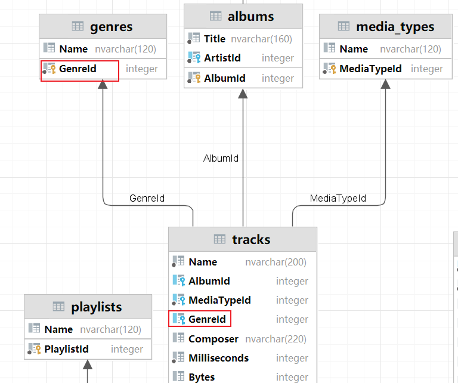
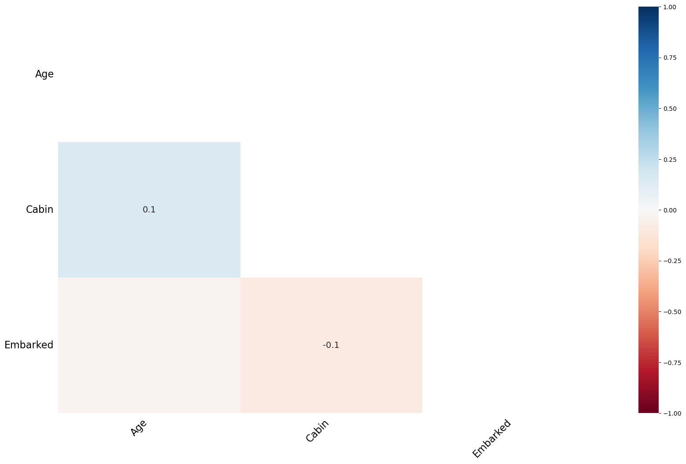
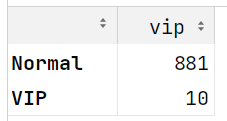
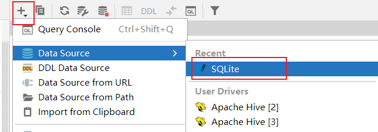
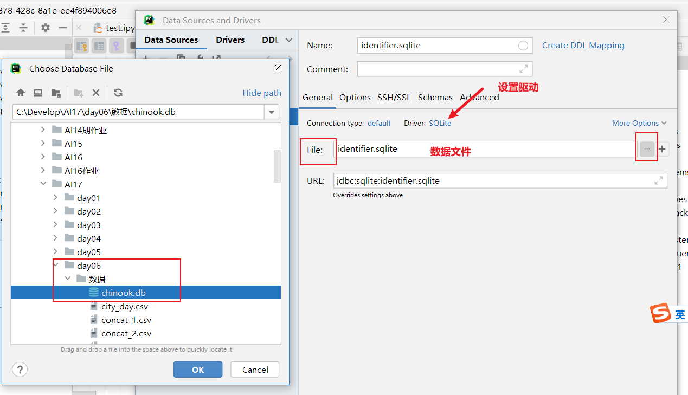
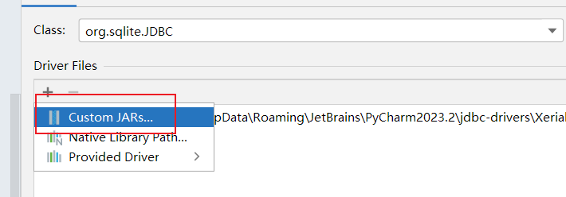

## 1. 租房数据实战演练

### 1.1 数据加载与初步探索

加载数据后，使用以下方法了解数据基本情况：

```python
df.head()      # 查看前5行数据，快速预览数据结构和内容
df.info()      # 查看数据结构、数据类型和非空值数量，识别潜在的数据质量问题
df.describe()  # 获取数值列的统计摘要（计数、均值、标准差、最小最大值等）
```


### 1.2 分组聚合操作

#### 1.2.1 基础分组计数

```python
# 按 view_num 分组统计各组的 district 数量
# as_index=False 确保分组字段作为普通列而非索引，便于后续操作
house_data.groupby('view_num', as_index=False)['district'].count()
```

**关键参数说明**

| 参数       | 说明                       | 默认值 | 使用建议                                                     |
| :--------- | :------------------------- | :----- | :----------------------------------------------------------- |
| `as_index` | 是否将分组字段作为结果索引 | `True` | 设为 `False` 可使分组字段作为普通列，等效于 `groupby().reset_index()` |

⚠️ **计数注意事项**：当数据无缺失值时，对任意列计数结果相同；存在缺失值时需明确指定计数列。

#### 1.2.2 多字段聚合

```python
# 对 house_type 分组，分别对 view_num 求和、price 求均值
house_data.groupby('house_type').agg({
    'view_num': 'sum',   # 计算各户型的总浏览量
    'price': 'mean'      # 计算各户型的平均价格
})
```

**语法特性**

- 使用字典格式 `{'字段': '聚合方法'}` 实现不同字段的不同聚合逻辑
- 常用聚合函数：`sum`（求和）、`mean`（均值）、`count`（计数）、`max`/`min`（最值）


### 1.3 数据可视化

#### 1.3.1 中文显示配置

**pandas**的`Plot()` 实际上调用的是**matplotlib**，matplotlib 中文显示问题解决方案：

```python
import matplotlib.pyplot as plt

# 解决中文显示问题：指定中文字体优先级列表
plt.rcParams['font.sans-serif'] = [
    'Noto Sans CJK JP',      # 首选字体：Noto Sans CJK
    'WenQuanYi Micro Hei',   # 备用字体：文泉驿微米黑
    'SimHei'                 # 备用字体：黑体
]

# 解决负号显示异常问题
plt.rcParams['axes.unicode_minus'] = False
```

#### 1.3.2 条形图绘制

```python
# 绘制户型分布条形图：按户型分组计数并降序展示
house_data.groupby('house_type')['district']  # 按户型分组，选择district列
    .count()                                  # 统计每种户型的数量
    .sort_values(ascending=False)             # 按数量降序排列，便于观察分布
    .plot(kind='bar', figsize=(16, 8))        # 绘制条形图，设置图像尺寸为16×8英寸
```

**plot 核心参数**

| 参数      | 说明     | 示例值                                |
| :-------- | :------- | :------------------------------------ |
| `kind`    | 图表类型 | `'bar'`（条形图）、`'line'`（折线图） |
| `figsize` | 图像尺寸 | `(宽度, 高度)`，单位英寸              |


## 2. DataFrame 数据组合技术

### 2.1 Concat 连接（纵向堆叠）

**适用场景**：结构相同的 DataFrame 连接，如合并多天的日志数据。

```python
# 将多个 DataFrame 纵向堆叠（axis=0）
pd.concat(
    [df1, df2, df3],     # 需要连接的DataFrame列表
    ignore_index=False,  # 是否重建索引：True时创建0-N的新索引
    axis=0               # 连接方向：0=纵向（增加行），1=横向（增加列）
)
```

**参数详解**

| 参数           | 说明         | 默认值  | 注意事项                                               |
| :------------- | :----------- | :------ | :----------------------------------------------------- |
| `ignore_index` | 是否重建索引 | `False` | `True` 时忽略原始索引，创建新的连续索引                |
| `axis`         | 连接方向     | `0`     | `0` 或 `'index'` 表示纵向；`1` 或 `'columns'` 表示横向 |

⚠️ **重要提示**：上下连接时若列名不一致会多出列并填充 `NaN`；左右连接时若行索引不一致会多出行并填充 `NaN`。`df.append()` 方法已弃用，请统一使用 `concat()`。


### 2.2 Merge 连接（类 SQL JOIN）

**核心原理**：基于键值列匹配数据，功能类似 SQL JOIN 操作。

```python
# 示例：从SQLite数据库加载数据
import sqlite3
import pandas as pd

# 创建数据库连接（SQLite数据库为单文件数据库）
con = sqlite3.connect('data/chinook.db')

# 加载tracks表（音乐/视频作品信息：类型、价格、时长、艺术家、专辑等）
tracks = pd.read_sql_query("SELECT * FROM tracks", con)

# 加载genres表（音乐/视频类型：摇滚、爵士、歌剧、喜剧等）
genres = pd.read_sql_query("SELECT * FROM genres", con)

# 创建tracks的子集用于演示
tracks_subset = tracks.loc[[0, 62, 76, 98, 110, 193, 204, 281, 322, 359]]

# 执行外连接合并：基于GenreId关联两张表，保留所有记录
genres.merge(tracks_subset, how='outer', on='GenreId')
```





#### 2.2.1 连接类型（how 参数）

| 连接类型 | SQL 等效         | 说明                             |
| :------- | :--------------- | :------------------------------- |
| `inner`  | INNER JOIN       | 仅保留左右两侧都有的键（交集）   |
| `left`   | LEFT OUTER JOIN  | 保留左侧表中的所有键             |
| `right`  | RIGHT OUTER JOIN | 保留右侧表中的所有键             |
| `outer`  | FULL OUTER JOIN  | 保留左右两侧表中的所有键（并集） |

#### 2.2.2 键值匹配方式（on 参数）

```python
# 单键匹配：连接字段名称相同，直接使用 on
df1.merge(df2, on='id')

# 多键匹配：多个字段组合作为连接键
df1.merge(df2, on=['country', 'city'])

# 异名列匹配：左右表连接字段名称不同，需分别指定
df1.merge(df2, 
          left_on='employee_id',   # 左表连接字段
          right_on='staff_id')     # 右表连接字段

# 使用pd.merge()函数（功能等价）
result = pd.merge(left, right, 
                  left_on='key_left', 
                  right_on='key_right', 
                  how='inner')
```

#### 2.2.3 列名冲突处理

```python
# 连接后若存在同名字段，默认添加后缀 _x（左表）和 _y（右表）
# 可通过 suffixes 参数自定义后缀
df1.merge(df2, on='id', suffixes=('_left', '_right'))
```


### 2.3 Join 连接（基于索引对齐）

**核心特性**：默认基于行索引匹配，是 `merge()` 的简化版，适合快速索引对齐合并。

```python
# 场景1：索引对齐连接（类似concat，但仅支持横向）
stock_2016 = pd.read_csv('data/stocks_2016.csv')
stock_2017 = pd.read_csv('data/stocks_2017.csv')
stock_2018 = pd.read_csv('data/stocks_2018.csv')

# 按索引外连接合并2016和2017数据，同名字段添加年份后缀
# stock_2016 直接 `join` stock_2017，两张表index相同的部分会连在一起
stock_2016.join(stock_2017, 
                lsuffix='_2016',   # 左表（2016）后缀
                rsuffix='_2017',   # 右表（2017）后缀
                how='outer')       # 外连接，保留所有索引
```

```python
# 场景2：列与索引匹配（左表列 vs 右表索引）
stock_2016.join(stock_2018.set_index('Symbol'),  # 右表Symbol列设为索引
                lsuffix='_2016', 
                rsuffix='_2018',
                on='Symbol')     # 指定左表的Symbol列作为连接键
```

💡 **实现替代方案**：上述 `join` 操作均可通过 `merge` 或 `concat` 实现，选择最适合场景的方法即可。

- merge 把 stock_2018 和 stock_2016 要连接的列, 通过`reset_index` 都变成一列
- cancat 把 stock_2016 的 Symbel 通过`set_index` 也设置为Index


### 2.4 三种连接方法核心对比

| 特性         | `pd.concat()`                            | `pd.merge()`                          | `df.join()`                 |
| :----------- | :--------------------------------------- | :------------------------------------ | :-------------------------- |
| **设计目标** | 沿轴堆叠数据                             | 基于列值关联（类SQL JOIN）            | 基于索引关联（简化版merge） |
| **主要轴向** | 支持 `axis=0`（纵向）和 `axis=1`（横向） | 仅横向合并（列扩展）                  | 仅横向合并（列扩展）        |
| **键值匹配** | 无需键值，直接拼接                       | 必须指定 `on` 或 `left_on`/`right_on` | 基于索引（默认）或列名      |
| **索引处理** | 保留原始索引或生成新索引                 | 默认生成新索引                        | 默认保留左表索引            |
| **适用场景** | 简单堆叠数据                             | 复杂键值关联                          | 索引对齐的快速合并          |


### 2.5 适用场景速查表

| 场景                             | 推荐方法         | 原因                             |
| :------------------------------- | :--------------- | :------------------------------- |
| 合并多个同结构表格（行/列堆叠）  | `concat`         | 直接拼接，无需键值匹配，性能最优 |
| 基于列值的复杂关联（如SQL JOIN） | `merge`          | 灵活支持多种连接方式和多键合并   |
| 快速基于索引合并                 | `join`           | 语法简洁，适合索引对齐的简单场景 |
| 横向合并不同特征（相同索引）     | `concat(axis=1)` | 无需键值，直接扩展列，避免冗余   |
| 处理列名不一致的合并             | `concat`         | 自动填充 `NaN`，保留所有列信息   |


## 3. 缺失值处理全流程

### 3.1 缺失值判断与特性

数据缺失是数据分析中的常见现象，主要来源包括数据合并操作（如JOIN）和原始数据本身。

```python
# Pandas提供的缺失值检测API（功能等价）
pd.isnull()   # 检查是否为缺失值，返回布尔Series/DataFrame
pd.isna()     # isnull的别名，推荐使用
pd.notnull()  # 检查是否非缺失值
pd.notna()    # notnull的别名，推荐使用
```

⚠️ 特殊注意事项：NumPy中的缺失值 `np.nan`、`np.NAN`、`np.NaN` 具有特殊性质：

- **不能通过 `==` 运算符直接判断**，只能通过API来判断
- 缺失值之间互不相等

```python
import numpy as np

# 缺失值与其他值的比较
print(np.NAN == True)   # False
print(np.NAN == False)  # False
print(np.NAN == '')     # False
print(np.NAN == 0)      # False

# 缺失值之间的比较
print(np.NAN == np.NaN)  # False
print(np.NAN == np.nan)  # False
print(np.NaN == np.nan)  # False

# 正确检测方法
import pandas as pd
print(pd.isnull(np.NAN))  # True
print(pd.isnull(np.nan))  # True
print(pd.isnull(''))      # False（空字符串不是缺失值）

print(pd.notnull(np.NAN))  # False
print(pd.notnull(np.nan))  # False
print(pd.notnull(''))      # True
```


### 3.2 读取含缺失值的数据

Pandas 提供灵活的缺失值处理选项：

```python
df = pd.read_csv(
    'data/survey_visited1.csv',
    na_values=['?'],           # 额外指定'?'作为缺失值标识符
    keep_default_na=False      # 是否保留默认缺失值识别（如空字符串）
)
```

**参数说明**

| 参数              | 说明                                             | 默认值 | 使用场景                                           |
| :---------------- | :----------------------------------------------- | :----- | :------------------------------------------------- |
| `na_values`       | 除空白值外，额外视为缺失值的符号                 | `None` | 数据中包含自定义缺失标记（如 `?`, `NA`）           |
| `keep_default_na` | 是否保留默认缺失值识别（将空白内容识别为缺失值） | `True` | 设为 `False` 时，仅将 `na_values` 指定的值视为缺失 |


### 3.3 缺失值处理技术

#### **3.3.1 缺失值检测**

```python
titanic = pd.read_csv('data/titanic_train.csv')
titanic.head()

# 统计各列缺失值数量
titanic.isnull().sum()
```


#### **3.3.2 缺失值可视化诊断**

使用 `missingno` 库直观展示缺失情况：

```python
# 安装缺失值可视化库
# pip install missingno

import missingno as msno

# 条形图：展示每列非缺失值数量
msno.bar(titanic)
```


```python
# 绘制缺失值热力图, 发现缺失值之间是否有关联, 是不是A这一列确实, B这一列也会确实
msno.heatmap(titanic)
```



#### 3.3.3 **缺失值删除策略**

```python
# 删除包含缺失值的行/列
titanic.dropna(
    subset=None,    # 指定检查缺失的列，None表示检查所有列
    how='any',      # 'any': 任一有缺失即删除；'all': 全部缺失才删除
    inplace=False,  # False: 返回新对象；True: 原地修改
    axis=0          # 0/'index': 删除行；1/'columns': 删除列
)
```

**参数详解**

| 参数      | 说明         | 可选值/示例                               | 使用建议                                    |
| :-------- | :----------- | :---------------------------------------- | :------------------------------------------ |
| `subset`  | 指定检查列   | `None`（所有列）、`['Age']`（仅检查年龄） | 仅删除关键列缺失的行，保留更多信息          |
| `how`     | 删除条件     | `'any'`、`'all'`                          | `'any'` 更严格，`'all'` 更宽松              |
| `inplace` | 是否原地修改 | `False`（默认）、`True`                   | 建议先设为 `False` 验证结果，再考虑原地修改 |
| `axis`    | 操作轴向     | `0`（删除行）、`1`（删除列）              | 删除列适用于某列缺失率过高场景              |


#### 3.3.4 缺失值填充策略

**💡 策略选择：非时序数据 vs 时序数据**

```python
# 非时序数据：使用统计量填充（示例：用年龄均值填充），直接使用 fillna(值, inplace=True)
titanic['Age'].fillna(
    titanic['Age'].mean(),  # 填充值：平均值（填充策略：众数、平均值、中位数、默认值等）
    inplace=True            # 原地修改
)

# 时序数据：使用前向/后向填充或插值（场景：与时间相关的数值变化（如气温/天气情况/用电量等））
# 加载时序数据并解析日期列
city_day = pd.read_csv('data/city_day.csv', 
                      parse_dates=['Date'],  # 自动转换日期格式
                      index_col='Date')     # 设日期为索引，便于时间序列操作

# 方法1：前向填充（用前一个有效值填充）
city_day['Xylene'][50:64].fillna(method='ffill')

# 方法2：后向填充（用后一个有效值填充）
city_day['Xylene'][50:64].fillna(method='bfill')

# 方法3：线性插值（基于前后有效值连线估算）
city_day['Xylene'][50:64].interpolate(limit_direction='both')
```


### 3.4 缺失值处理最佳实践

💡 **处理原则**：

1. **能不删就不删**：删除会损失信息，仅在缺失率过高（如 >50%，需具体分析）时考虑
2. **类别型数据**：可用 `'缺失'` 或 `'Unknown'` 等类别填充
3. **数值型数据**：可用统计量（均值/中位数/众数）或业务默认值填充
4. **时序数据**：优先使用插值或前后向填充，保持趋势连续性


## 4. Apply 自定义函数应用

**应用场景**：当Pandas内置API无法满足需求时，需对Series或DataFrame的每个元素、行或列应用自定义逻辑。

### 4.1 Series 的 Apply 方法

```python
import pandas as pd

# 创建示例DataFrame
df = pd.DataFrame({
    'a': [10, 20, 30],
    'b': [20, 30, 40]
})

# 定义单参数函数：计算平方值
def my_sq(x):
    """计算平方值
    
    参数:
        x: 数值型输入
        
    返回:
        x的平方
    """
    return x ** 2

# 定义多参数函数：计算任意指数幂
def my_sq2(x, e):
    """计算任意指数幂
    
    参数:
        x: 底数
        e: 指数
        
    返回:
        x的e次幂
    """
    return x ** e
```

```python
# Series调用apply：遍历每个元素应用函数
# 应用单参数函数
df['a_squared'] = df['a'].apply(my_sq)  # 对列a的每个元素求平方

# 应用多参数函数（通过额外参数传递）
df['a_cubed'] = df['a'].apply(my_sq2, e=3)  # 对列a的每个元素求立方
```

💡 **关键要点**：

- `apply` 接收 **函数名** 而非函数调用（即 `my_sq` 而非 `my_sq()`）
- 遍历Series中的每个值，将其传入自定义函数
- 函数返回值整合为新的Series


### 4.2 DataFrame 的 Apply 方法

```python
# df.apply(func, axis=) 核心参数
# axis=0：按列操作（func接收整列数据作为Series）
# axis=1：按行操作（func接收整行数据作为Series）
```


### 4.3 实战案例：泰坦尼克数据集

#### 案例 1：年龄分段处理

把titanic 的数据中, 年龄替换成年龄段

```python
def cut_age(age):
    """将年龄数值转换为年龄段类别
    
    参数:
        age: 年龄数值
        
    返回:
        str: 年龄段类别（未成年/青年/中年/老年/未知）
    """
    if age < 18:
        return '未成年'
    elif 18 <= age < 40:
        return '青年'
    elif 40 <= age < 60:
        return '中年'
    elif 60 <= age < 81:
        return '老年'
    else:
        return '未知'

# 应用函数并统计各年龄段人数
age_distribution = titanic['Age'].apply(cut_age).value_counts()
print(age_distribution)
```


#### **案例 2：VIP 乘客识别**

创建一个字段 vip 

- Pclass  = 1
- 名字 Name 包含特殊称呼 Master , Dr, Sir

```python
# Pclass = 1 并且 Name中 包含了Master/Dr/Sir
def get_vip(x):
    if x['Pclass'] ==1 and ('Master' in x['Name'] or 'Dr' in x['Name'] or 'Sir' in x['Name'] ):
        return 'VIP'
    else:
        return 'Normal'
```

```python
titanic['vip'] = titanic.apply(get_vip,axis=1)
titanic['vip'].value_counts()
```



其他：pycharm链接sqlite数据库文件






