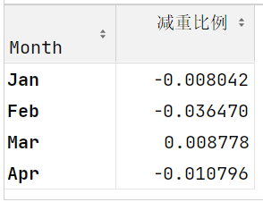
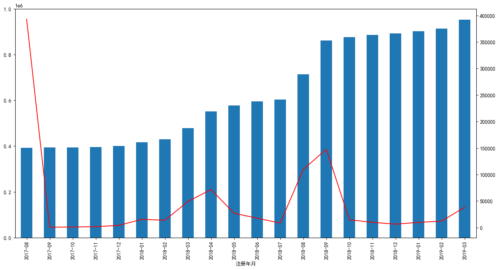
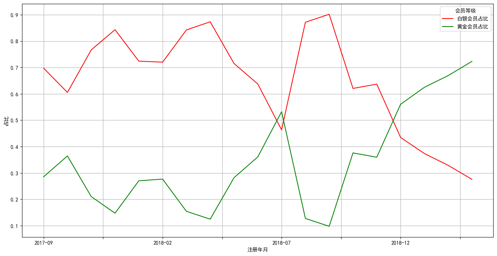
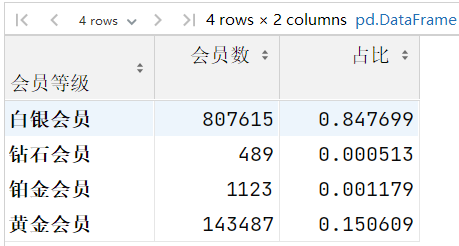
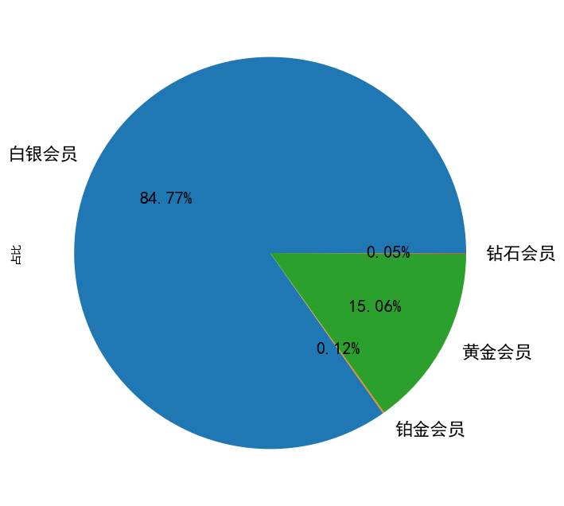
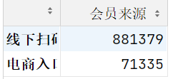
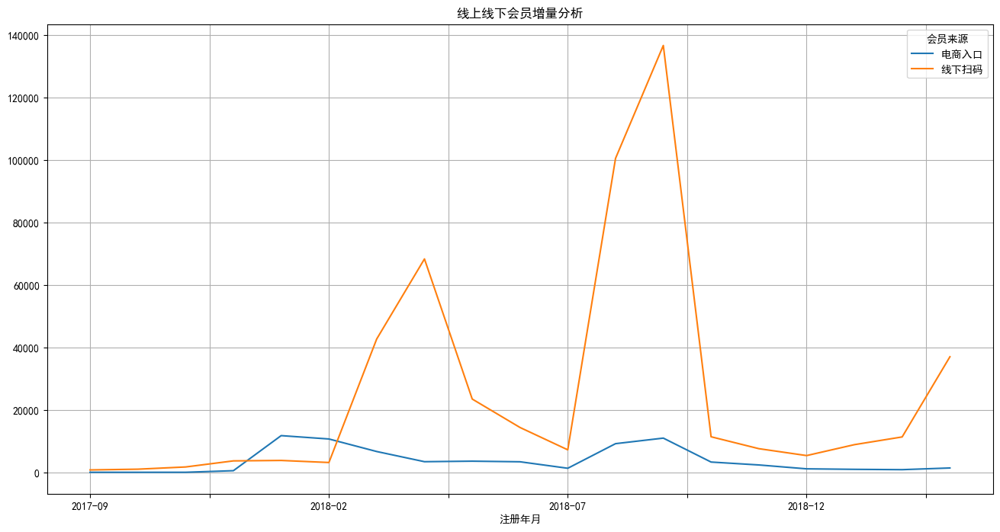

## 1. 向量化函数与Lambda表达式

### 1.1 向量化函数问题分析

在Pandas数据处理中，普通Python函数无法直接处理Series类型的条件判断，这是新手常见的痛点。

```python
import numpy as np
import pandas as pd

def avg_test(x, y):
    # 错误示例：if语句无法直接处理Series布尔数组
    if x == 20:  # ⚠️ 报错：if无法处理Series类型，需要标量布尔值
        return np.NaN
    else:
        return (x + y) / 2

# 尝试调用将失败，因为df['a']是整个Series而非单个值
# avg_test(df['a'], df['b'])  # 报错：ValueError
```

**核心问题**：`if`语句需要单一布尔值，但`x == 20`返回的是包含多个布尔值的Series。

**解决方案**：使用`np.vectorize()`将普通函数转换为向量化函数，自动遍历Series中的每个元素。

```python
# 示例数据准备
df = pd.DataFrame({
    'a': [20, 15, 20, 18],
    'b': [10, 12, 14, 16]
})

# ==================== 方法1：显式向量化 ====================
# 创建向量化版本，np.vectorize会自动遍历每个元素
avg_vec = np.vectorize(avg_test)  # 将普通函数包装为向量化函数
result = avg_vec(df['a'], df['b'])  # 成功执行，返回array([nan, 13.5, nan, 17.0])
print(result)

# ==================== 方法2：装饰器向量化 ====================
@np.vectorize  # 💡 装饰器模式更简洁，直接修饰函数定义
def avg_test_decorated(x, y):
    """向量化函数：当x=20时返回NaN，否则返回平均值"""
    if x == 20:
        return np.NaN
    else:
        return (x + y) / 2

result = avg_test_decorated(df['a'], df['b'])  # 直接调用即可
print(result)
```


### 1.2 装饰器深度解析

#### 1.2.1 核心概念

装饰器是Python的高阶函数特性，遵循**开放-封闭原则**：在不修改原函数代码的前提下，动态添加额外功能。简单来说，装饰器就是**函数的包装器**，它可以在函数执行前后添加一些操作。

#### 1.2.2 基础语法

在Python中，装饰器通常使用 `@` 符号来应用于函数或类。下面是一个简单的装饰器示例：

```python
def my_decorator(func):  # 装饰器接收函数作为参数
    """
    装饰器函数：为被装饰函数添加前置和后置操作
    :param func: 被装饰的原始函数
    :return: 包装后的新函数
    """
    def wrapper(*args, **kwargs):
        # *args接收所有位置参数，**kwargs接收所有关键字参数
        print("前置操作：函数执行前的准备")  # 添加额外功能
        result = func(*args, **kwargs)  # 调用原始函数并保存返回值
        print("后置操作：函数执行后的清理")  # 添加额外功能
        return result  # 返回原始函数的执行结果
    return wrapper  # 返回包装函数

@my_decorator  # 语法糖：等同于 say_hello = my_decorator(say_hello)
def say_hello():
    """原始业务函数"""
    print("Hello!")

# 调用被装饰的函数
say_hello()
# 输出：
# 前置操作：函数执行前的准备
# Hello!
# 后置操作：函数执行后的清理
```

**执行机制**：`@装饰器`本质是将原函数作为参数传递给装饰器，返回的新函数重新赋值给原函数名。


### **1.3 Lambda表达式实战应用**

当数据处理逻辑简单到一行代码时，使用`lambda`创建匿名函数比`def`更优雅。

```python
# 检查DataFrame每列的缺失值数量
# lambda x: x.isnull().sum() 创建匿名函数，x代表每列Series
missing_count = df.apply(lambda x: x.isnull().sum())  # 对每列应用函数
print(missing_count)

# 💡 最佳实践：简单逻辑用lambda，复杂逻辑用def命名函数以提高可读性
```


## 2. 数据分组高级操作

### 2.1 分组聚合

#### 2.1.1 基础语法

```python
# 分组后对单个字段聚合
df.groupby('分组字段')['聚合字段'].count()

# 分组后对多个字段聚合
df.groupby('分组字段')[['聚合字段1', '聚合字段2']].count()

# 不同字段不同聚合方式
df.groupby('year').agg({
    'lifeExp': 'mean',
    'pop': 'median',
    'gdpPercap': 'max'
})
```


#### **2.1.2 自定义聚合函数**

当内置函数无法满足需求时，使用`agg` / `aggregate`方法传入自定义函数。

```python
import numpy as np

# 使用numpy函数聚合
df.groupby('continent')['lifeExp'].aggregate(np.mean)

# 自定义聚合函数示例
def my_mean_diff(s, global_mean):
    return s.mean() - global_mean

global_mean = df['lifeExp'].mean()  # 预先计算全局均值

# 使用自定义函数，通过全局变量传递参数
result = df.groupby('continent')['lifeExp'].agg(
    my_mean_diff, 
    global_mean=global_mean  # 关键字参数传递给自定义函数
)
```


### 2.2 分组转换

#### 2.2.1 概念说明

分组转换（GroupBy + Transform）是Powerful的特征工程工具，特点：

- 对分组数据应用函数
- **返回与原数据相同形状的结果**（关键特性）
- 类似SQL窗口函数，保持数据对齐

```python
# 基础示例：计算每组的均值并广播到原数据行
df = pd.DataFrame({
    'Group': ['A', 'A', 'B', 'B', 'B'],
    'Value': [10, 20, 30, 40, 50]
})

# transform返回与原DataFrame相同长度的Series
df['GroupMean'] = df.groupby('Group')['Value'].transform('mean')
# 结果：A组两行都填充15，B组三行都填充40
```


#### 2.2.2 实战：缺失值填充

处理小费数据集中的缺失值，按性别分组填充。

```python
# 加载并准备数据
tips = pd.read_csv('data/tips.csv')
tips_10 = tips.sample(10, random_state=42)  # 随机采样10条数据（固定随机种子保证可复现）

# 人为制造缺失值：随机选择4条记录
import numpy as np
# np.random.permutation打乱索引，取前4个设为NaN
tips_10.loc[np.random.permutation(tips_10.index)[:4], 'tip'] = np.NaN

def fillna_mean(x):
    """
    自定义转换函数：用组内均值填充缺失值
    :param x: 当前分组的数据Series
    :return: 填充后的Series
    """
    return x.fillna(x.mean())  # x.mean()计算当前组的均值

# 按性别分组转换：缺失值用对应性别的平均小费填充
tips_10['tip_filled'] = tips_10.groupby('sex')['tip'].transform(fillna_mean)
# 结果：不同性别填充的缺失值是该性别各自的小费平均值
```


#### 2.2.3 常见应用场景

```python
# 场景1：Z-Score标准化（按组标准化）
df['Z-Score'] = df.groupby('Group')['Value'].transform(
    lambda x: (x - x.mean()) / x.std()  # (x-组均值)/组标准差
)

# 场景2：用组中位数填充缺失值
df['Filled'] = df.groupby('Group')['Value'].transform(
    lambda x: x.fillna(x.median())  # 中位数更鲁棒
)

# 场景3：组内排名
df['Rank'] = df.groupby('Group')['Value'].transform(
    'rank', ascending=False  # descending ranking
)
```


#### 2.2.4 `transform` vs `apply` vs ` map` 对比

在 Pandas 中，这三个方法的传参方式各不相同。理解它们的关键在于**操作的层级**（是针对整个 DataFrame、某一列，还是每一个单元格）。

以下是它们的详细对比：

##### **1. `map()`：逐元素操作**

`map` 是 **Series** 对象独有的方法（DataFrame 没有 `map`）。

- **传参方式**：逐元素。
- **适用对象**：Series。
- **行为**：将函数应用于 Series 中的每一个元素。它常用于映射值（比如将 "A" 映射为 1）。

```python
# 示例：每个元素都执行一次 lambda
df['col'].map(lambda x: x + 1) 
```


##### 2. `apply()`：灵活多变（最常用）

`apply` 的行为取决于你是在 Series 还是 DataFrame 上调用它。

- **在 Series 上调用**：**逐元素**传入。行为类似于 `map`。
- **在 DataFrame 上调用**：**直接传入 Series**。
  - 默认情况下（`axis=0`），它将每一**列**作为一个 Series 传给函数。
  - 设置 `axis=1` 时，它将每一**行**作为一个 Series 传给函数。

```python
# DataFrame 调用：x 是一个 Series（一整列或一整行）
df.apply(lambda x: x.max() - x.min()) 
```


##### 3. `transform()`：直接传入 Series (通常)

`transform` 的主要特征是：**输出的形状必须与输入的形状完全一致**。

- **传参方式**：**直接传入 Series**（一整列）。
- **特殊之处**：它通常用于执行聚合操作后，将结果广播（Broadcast）回原形状。例如，计算每组的平均值并填充到每个单元格中。
- **注意**：虽然它传入的是 Series，但如果函数返回的是一个标量，它会自动填充回原长度。

```python
# x 是整列 Series，返回的结果会自动对应到原索引
df.transform(lambda x: x - x.mean()) 
```


##### **核心区别总结表**

| **方法**        | **适用对象**     | **传参方式**                              | **主要用途**                     |
| --------------- | ---------------- | ----------------------------------------- | -------------------------------- |
| **`map`**       | Series           | **逐元素**                                | 简单的值替换、格式化             |
| **`apply`**     | DataFrame/Series | **Series** (对DF) / **逐元素** (对Series) | 复杂逻辑、数据聚合、行/列计算    |
| **`transform`** | DataFrame/Series | **Series**                                | 组内标准化、保持原数据形状的操作 |

💡快速判断指南

1. 如果你想**改变数据形状**（比如从 10 行变成 1 个平均值）：用 `apply`。
2. 如果你想**保持数据形状**（比如减去均值）：用 `transform`。
3. 如果你只是想**翻译/替换**单个单元格的值：用 `map`。


### 2.3 分组转换实战：会员减重效果分析

**任务目标**：比较Bob和Amy在1-4月每月的减重效果（每月第4周 vs 第1周）。

```python
# 加载体重数据：每月4周，共32条记录
weight_loss = pd.read_csv('data/weight_loss.csv')

# 定义减重函数
def find_perc_loss(s):
    """
    计算减重比例函数：(首周体重-当前周体重)/首周体重
    :param s: 某人在某月的体重Series（按周顺序）
    :return: 减重比例Series
    """
    first_week_weight = s.iloc[0]  # 每月第一周的体重作为基准
    return (first_week_weight - s) / first_week_weight  # 计算每周相对于首周的减重比例

# 按姓名和月份分组转换
# 核心：groupby的列顺序决定分组粒度，transform应用自定义函数
weight_loss['减重比例'] = weight_loss.groupby(['Name', 'Month'])['Weight'].transform(find_perc_loss)

# 提取第4周数据进行对比
week4 = weight_loss.query('Week == "Week 4"')[['Name', 'Month', '减重比例']]

# 分离两人数据并设置月份为索引（便于对齐计算）
amy_week4 = week4.query('Name == "Amy"').set_index('Month')
bob_week4 = week4.query('Name == "Bob"').set_index('Month')

# 计算减重差异：Bob - Amy
diff = (bob_week4 - amy_week4).rename(columns={'减重比例': 'Bob减重比例 - Amy减重比例'})
# 结果解读：负值表示Amy减重效果更好
```




### 2.4 数据筛选：Query 与 Filter

#### **2.4.1 query方法**

`query()`是**pandas**中一个非常实用的 **`DataFrame`** 方法，它允许你使用字符串表达式来筛选数据（如果条件中还有字符串, 需要用不同类型的引号进行区分），类似于SQL中的WHERE子句。

 ```python
 import pandas as pd
 
 df = pd.DataFrame({
     'A': range(1, 6),
     'B': range(10, 60, 10),
     'C': list('abcde')
 })
 
 # 使用query筛选
 result = df.query('A > 2')
 ```


#### **2.4.2 `query` vs 布尔索引**

`query()`方法和布尔索引是**pandas**中两种常用的数据筛选方式，它们各有优缺点。下面从多个维度进行对比分析：

**1. 语法对比**

```python
# 布尔索引  需要全部用小括号包起来
df[(df['A'] > 2) & (df['B'] < 50) | (df['C'] == 'a')]

# query方法
df.query('A > 2 and B < 50 or C == "a"')
```

**对比**：

- query语法更简洁，更接近自然语言
- 布尔索引需要使用`&`、`|`等运算符，而query可以使用`and`、`or`
- 布尔索引需要重复写**`DataFrame`**名称，**`query`**不需要

**2.可读性对比**

简单条件：两者可读性相当

```python
# 布尔索引
df[df['A'] > 2]

# query
df.query('A > 2')
```

复杂条件：query明显更易读

```python
# 布尔索引
df[(df['A'] > 2) & (df['B'].isin([10, 30])) | (df['C'].str.startswith('a'))]

# query
df.query('A > 2 and B in [10, 30] or C.str.startswith("a")')
```

**3.列名处理**

布尔索引处理特殊列名更方便

```python
# 布尔索引 - 列名中有空格也能正常工作
df[df['column with space'] > 10]

# query - 需要反引号
df.query('`column with space` > 10')
```

布尔索引处理动态列名更直接

```python
col = 'A'
# 布尔索引
df[df[col] > 2]

# query - 需要使用@语法
df.query(f'{col} > 2')  # 或者 df.query('@col > 2')
```


💡提示：`query()` 提供了一种类 SQL 的字符串筛选方式，代码可读性更强。

| **维度**       | **query() 方法**                 | **布尔索引**                     |
| -------------- | -------------------------------- | -------------------------------- |
| **语法示例**   | `df.query('A > 2 and B < 50')`   | `df[(df['A']>2) & (df['B']<50)]` |
| **逻辑符**     | `and`, `or`                      | `&`, `|`                         |
| **变量引用**   | 使用 `@`: `df.query('A > @val')` | 直接使用: `df[df['A'] > val]`    |
| **列名带空格** | 反引号: ``col name` > 10         | 字典访问: `df['col name'] > 10`  |


### 2.5 分组过滤

**groupby** 分组之后, 接 **filter** 方法, 传入一个返回 **True** / **False** 的方法, 当数据传入这个方法中,返回True的会被留下, 返回False的会被过滤掉。

**核心概念**
使用`groupby.filter()`可按组过滤数据：

- 对每个分组应用自定义函数
- 返回`True` → 保留整个分组
- 返回`False` → 过滤掉整个分组

```python
# 加载小费数据
tips = pd.read_csv('data/tips.csv')

# 过滤就餐人数(size)分组：只保留条目数>5的组
# lambda x接收每个分组的DataFrame，返回True保留整个分组
filtered_tips = tips.groupby('size').filter(
    lambda x: x['size'].count() > 5  # 组内记录数大于5则保留
)

# 实际应用：过滤掉数据量过少的组，避免统计偏差
```


### 2.6 DataFrameGroupby对象

DataFrameGroupBy对象是pandas中分组操作的核心，它由`groupby()`方法创建，提供了强大的数据分组和聚合功能，支持延迟计算。

```python
# 创建分组对象（此时不立即计算）
grouped = tips_10.groupby('sex')

# ==================== 核心属性与方法 ====================

# 属性1：查看分组结构（字典：组值 → 索引列表）
print(grouped.groups)  
# 输出：{'Female': [198, 124, 101], 'Male': [24, 6, 153, 211, 176, 192, 9]}

# 方法2：获取指定组的完整DataFrame
female_group = grouped.get_group('Female')
print(f"女性组记录数：{len(female_group)}")

# 方法3：遍历分组（返回元组：(组名, 组DataFrame)）
for group_name, group_data in grouped:
    print(f"\n组名：{group_name}")
    print(f"类型：{type(group_data)}")  # <class 'pandas.core.frame.DataFrame'>
    print(f"前2条数据：\n{group_data.head(2)}")

# 方法4：分组统计（自动聚合）
mean_size_by_sex = grouped['size'].mean()
print("\n按性别平均就餐人数：")
print(mean_size_by_sex)
```

 **核心属性与方法**

| 操作             | 代码示例                       | 返回值说明                       |
| :--------------- | :----------------------------- | :------------------------------- |
| **查看分组结构** | `grouped.groups`               | 返回字典：`{'组值': [索引列表]}` |
| **获取单组数据** | `grouped.get_group('Female')`  | 返回指定组的完整DataFrame        |
| **遍历分组**     | `for name, df in grouped: ...` | 每次迭代返回(组名, 组DataFrame)  |
| **分组统计**     | `grouped['size'].mean()`       | 返回各组指定列的聚合结果         |


**复合索引(MultiIndex)**

```python
# ==================== 复合索引处理 ====================

# 多字段分组产生MultiIndex
result = tips_10.groupby(['sex', 'time'])['size'].mean()
print("\n复合索引结果：")
print(result)

# 访问复合索引：必须使用元组
print("\n访问Female-Dinner数据：")
print(result.loc[('Female', 'Dinner')])

# 重置索引为普通列
result_reset = result.reset_index()  # 将索引转换为普通列
print("\n重置索引后：")
print(result_reset)

# 或直接设置as_index=False
result_no_index = tips_10.groupby(['sex', 'time'], as_index=False)['size'].mean()
```


## 3. 会员运营数据透视分析

**任务：分析会员运营的基本情况**

从量的角度分析会员运营情况：
- 整体会员运营情况（存量，增量）
- 不同渠道（线上，线下）的会员运营情况
- 线下业务，拆解到不同的地区、门店会员运营情况

从质的角度分析会员运营情况：
- 会销比 会员消费占整体消费的占比
- 连带率 是不是每次购买商品的时候, 都购买一件以上
- 复购率 是不是买了之后, 又来买


**透视表：**

```python
df.pivot_table(index= , columns = , values= , aggfunc= )
```

| 参数           | 说明         | 示例                  |
| :------------- | :----------- | :-------------------- |
| `index`        | 行分组字段   | `index='地区编码'`    |
| `columns`      | 列分组字段   | `columns='年月'`      |
| `values`       | 聚合数值字段 | `values='消费数量'`   |
| `aggfunc`      | 聚合函数     | `aggfunc='sum'`       |
| `margins`      | 添加总计行列 | `margins=True`        |
| `margins_name` | 总计行列名称 | `margins_name='总计'` |


**累计求和：**

```py
df['列名'].cumsum()
```


**strftime 时间类型格式化：**将注册年月转换成年月的形式展示

参数：

**年份表示：**

| 代码 | 说明     | 示例 |
| :--- | :------- | :--- |
| `%Y` | 四位年份 | 2023 |
| `%y` | 两位年份 | 23   |

**月份表示：**

| 代码 | 说明             | 示例     |
| :--- | :--------------- | :------- |
| `%m` | 数字月份（补零） | 01-12    |
| `%b` | 缩写的月份名称   | Jan, Feb |
| `%B` | 完整的月份名称   | January  |

**日期表示：**

| 代码 | 说明                 | 示例    |
| :--- | :------------------- | :------ |
| `%d` | 月份中的天数（补零） | 01-31   |
| `%j` | 年中的第几天（补零） | 001-366 |


### 3.1 会员增量和存量分析

```python
import pandas as pd
customer_info = pd.read_excel('data/会员信息查询.xlsx')
customer_info.head()
customer_info.info()
```


-  **会员增量分析：**注册年月分组, 对会员卡号计数

```python
customer_info.loc[:,'注册年月'] = customer_info['注册时间'].apply(lambda x:x.strftime('%Y-%m'))

month_count = customer_info.groupby('注册年月')[['会员卡号']].count()
# DataFrame修改列名
month_count.columns = ['月增量']

# Series修改列名
mouth_count.name = '月增量'
```

绘制会员增量曲线

```python
import matplotlib.pyplot as plt
plt.rcParams['font.sans-serif'] = ['Noto Sans CJK JP', 'WenQuanYi Micro Hei', 'SimHei'] # 正常显示汉字
plt.rcParams['axes.unicode_minus'] = False # 正常显示负号
customer_info.groupby('注册年月')['会员卡号'].count()[1:].plot(figsize=(16,8))
```


**通过透视表计算月增量**

```python
# index 在透视表结果中, 哪一列数据作为行索引  columns 在透视表结果中, 哪一列数据作为列名 values 对哪一个字段进行统计 aggfunc 聚合方式
customer_info.pivot_table(index='注册年月',values='会员卡号',aggfunc='count')
```


- **会员存量分析：**对月增量字段累计求和计算月存量

```python
month_count.loc[:,'会员存量']=month_count['月增量'].cumsum()
```


将月增量和月存量进行可视化

```python
month_count['月增量'].plot(figsize=(16,8),color = 'red',secondary_y = True)
month_count['会员存量'].plot(kind = 'bar',figsize=(16,8))
```




### **3.2 统计月增量会员中的会员等级分布**

```python
# unstack()是pandas中一个用于重塑数据的重要方法，它可以将多级索引的行转换为列，实现数据的"旋转"或"透视"。
customer_info.groupby(['注册年月','会员等级'])['会员卡号'].count().unstack()
member_level = customer_info.pivot_table(index='注册年月',columns='会员等级',values='会员卡号',aggfunc='count')
member_level = member_level[1:]
```


可视化：

```python
import matplotlib.pyplot as plt

# plt.subplots 创建了一个绘图区域 fig 和坐标系 ax1
fig,ax1 = plt.subplots(figsize=(20,8))

# 通过ax1 创建了一个共享x轴的坐标系 ax2
ax2 = ax1.twinx() 

# grid=True 添加网格线  xlabel/ylabel x轴y轴 起名  legend 图例
member_level[['白银会员','黄金会员']].plot.bar(ax=ax1,grid=True,xlabel='年月',ylabel='白银黄金',legend= True)
member_level[['铂金会员','钻石会员']].plot(ax=ax2,color=['red','gray'],ylabel='铂金钻石',legend= True)

# 把ax2 坐标系 图例显示的地方调整到左上角
ax2.legend(loc='upper left')

plt.title('会员增量等级分布')
plt.show()
```


计算不同等级会员占比

```python
member_level.loc[:,'总计'] = member_level.sum(axis=1)
member_level.loc[:,'白银会员占比'] = member_level['白银会员']/member_level['总计']
member_level.loc[:,'黄金会员占比'] = member_level['黄金会员']/member_level['总计']
```


黄金白银会员占比可视化

```python
member_level[['白银会员占比','黄金会员占比']].plot(color=['r','g'],ylabel='占比',figsize=(16,8),grid=True)
```



###  3.3 整体等级分布      

```python
ratio = customer_info.groupby('会员等级')[['会员卡号']].count()
customer_info.pivot_table(index='会员等级',values='会员卡号',aggfunc='count')

ratio.columns=['会员数']
ratio['占比'] = ratio['会员数']/ratio['会员数'].sum()
```



**绘制饼图**

```python
# 由于铂金会员/钻石会员占比较低, 绘图之前先调整在数据中的顺序, 让铂金会员和钻石会员在数据中不要挨着
ratio.loc[['白银会员','铂金会员','黄金会员','钻石会员'],'占比'].plot.pie(figsize=(16,8),autopct='%.2f%%',fontsize=16)
```

- pie 绘制饼图


- autopct 控制显示饼图的占比数据图例   .2f 表示保留两位有效数字


- fontsize = 16 控制字体大小



### 3.4 线上线下会员增量分析 

- **统计数据**     

```python
customer_info['会员来源'].value_counts()
```




计算每个月线上线下的会员增量

```python
customer_info.groupby(['注册年月','会员来源'])['会员卡号'].count().unstack()
online_offline = customer_info.pivot_table(index='注册年月',columns='会员来源',values='会员卡号',aggfunc='count')
```

- **数据可视化**

```python
online_offline[1:].plot(figsize=(16,8),grid=True)
plt.title('线上线下会员增量分析')
plt.show()
```



### 3.5 按地区统计会员数量


将门店信息跟会员数据连接到一起

```python
store_info = pd.read_excel('data/门店信息表.xlsx')
customer_info1 = customer_info.merge(store_info[['店铺代码','地区编码']],left_on='所属店铺编码',right_on='店铺代码',how='left')
```

>会员信息作为左表
>
>left_on 所属门店编码 (customer_info1 表中字段)
>
>right_on='店铺代码' (store_info 表中字段)
>
>how='left' 左连接, 以用户信息表为主

```python
# 统计每个地区会员数量 去掉线上数据  GBL6D01线上电商数据
customer_info2 = customer_info1[customer_info1['地区编码']!='GBL6D01']

# 统计每个地区会员数量
district_count = customer_info2.groupby('地区编码')[['会员卡号']].count()
district_count.columns =['会员数量']

# 统计每个地区店铺数量
district_shop_count = customer_info2[['地区编码','所属店铺编码']].drop_duplicates().groupby('地区编码')['所属店铺编码'].count()
district_shop_count.name = '店铺数量'

# 将会员数量跟店铺数量数据连接起来
district = pd.concat([district_count,district_shop_count],axis=1)
```

>最后的连接使用join也可以
>
>district_count.join(district_shop_count)

计算店均会员数 和 总平均会员数

```python
district['地区店均会员数'] = round(district['会员数量'].div(district['店铺数量']))
district['总平均会员数'] = round(district['会员数量'].sum()/district['店铺数量'].sum())
district = district.sort_values(by='地区店均会员数',ascending=False)
```

可视化

```python
district['地区店均会员数'].plot.bar(figsize=(16,8),color='r',legend=True,grid=True)
district['总平均会员数'].plot(color='g',legend=True,grid=True)
plt.title('地区店均会员分析')
plt.show()
```


### 3.6 各地区会销比

- 加载数据

```python
custom_consume=pd.read_excel('data/会员消费报表.xlsx')
all_orders=pd.read_excel('data/全国销售订单数量表.xlsx')
```

- 将订单日期字段转换为日期时间类型

```python
custom_consume['订单日期'] = pd.to_datetime(custom_consume['订单日期'])
```

- 从订单日期中提取年月数据, 并转换成数值类型方便与另一张表合并

```python
custom_consume['年月'] = custom_consume['订单日期'].apply(lambda x: x.strftime('%Y%m')).astype(int)
```

- 计算各地区会销比,先计算各地区的会员销量

```python
#将销售数据跟地区信息关联起来
member_orders = custom_consume.merge(store_info[['店铺代码','地区编码']],on='店铺代码',how='left')

# 去掉电商数据
member_orders =member_orders[member_orders['地区编码']!='GBL6D01']

# 创建数据透视表 计算每个月每个地区会员的订单数
area_sales= member_orders.pivot_table(index='地区编码',columns='年月',values='消费数量',aggfunc=sum,margins=True,margins_name='汇总')
```

- 计算各地区每个月的总销量

```python
country_sales = all_orders.pivot_table(index='地区代码',columns='年月',values='全部订单数',aggfunc=sum,margins=True,margins_name='汇总')
country_sales
```

两张表相除得到会销比

```python
area_sales/country_sales
```
