## 1. 连带率和复购率计算

### 1.1 连带率计算

连带率的概念和为什么分析连带率

- 连带率是指销售的件数和交易的次数相除后的数值

- 反映的是顾客平均单次消费的产品件数

为什么分析连带率

- 连带率直接影响到客单价

- 连带率反应运营质量

连带率的计算

- 连带率 = 消费数量 / 订单数量

分析连带率的作用

- 通过连带率分析可以反映出人、货、场几个角度的业务问题

**计算连带率**

- 只统计下单的数据

```python
order_data = member_orders.query('订单类型=="下单"')
# 去重, 订单编号相同的只保留一个
order_count = order_data[['年月','地区编码','订单号']].drop_duplicates()
# 数据透视表计算每个地区, 每个月份买了多少单
order_count = order_count.pivot_table(index='地区编码',columns='年月',values='订单号',aggfunc='count')
sale_count = order_data.pivot_table(index='地区编码',columns='年月',values='消费数量',aggfunc='sum')

```

- 连带率计算

```python
sale_count/order_count
```

### 1.2 复购率

复购率的概念和复购率分析的作用

- 复购率：指会员对该品牌产品或者服务的重复购买次数，重复购买率越多，则反应出会员对品牌的忠诚度就越高，反之则越低。
- 计算复购率需要指定时间范围

如何计算复购：

- 会员消费次数一天之内只计算一次

- 复购率 = 一段时间内消费次数大于1次的人数 / 总消费人数

复购率分析的作用：通过复购率分析可以反映出运营状态

-  先把一天内多次购买的用户, 只保留一条

```python
# 订单日期, 卡号, 地区编码
unique_date_order = order_data.drop_duplicates(subset=['订单日期','卡号'])[['订单日期', '卡号', '地区编码','年月']]
consume_count = unique_date_order.pivot_table(index=['地区编码','卡号'],values='订单日期',aggfunc='count').reset_index()
consume_count.rename(columns={'订单日期':'消费次数'},inplace = True)
consume_count['是否复购'] =consume_count['消费次数']>1
result = consume_count.pivot_table(index='地区编码',values=['消费次数','是否复购'],aggfunc={'消费次数':'count','是否复购':'sum'})
result.columns= ['复购人数','消费人数']
result['复购率'] = result['复购人数']/result['消费人数']
result
```

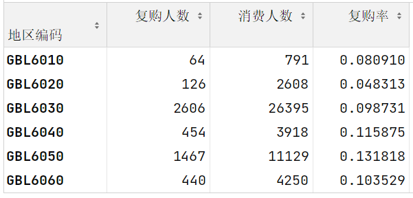

把复购率计算过程封装成方法

```python
def repurchase_rate(oder_data, start,end,col):
    # 使用起始结束的日期筛选要计算的数据的范围
    order_data1 = order_data[(oder_data['年月']<=end)&(order_data['年月']>=start)]
    # 去重
    unique_date_order = order_data1.drop_duplicates(subset=['订单日期','卡号'])[['订单日期', '卡号', '地区编码','年月']]
    consume_count = unique_date_order.pivot_table(index=['地区编码','卡号'],values='订单日期',aggfunc='count').reset_index()
    consume_count.rename(columns={'订单日期':'消费次数'},inplace = True)
    consume_count['是否复购'] =consume_count['消费次数']>1
    result = consume_count.pivot_table(index='地区编码',values=['消费次数','是否复购'],aggfunc={'消费次数':'count','是否复购':'sum'})
    result.columns= ['复购人数','消费人数']
    result[col+'复购率'] = result['复购人数']/result['消费人数']
    return result
```

- 计算复购率环比

```python
# 计算18年1月-18年12月 复购率
result1 = repurchase_rate(order_data,201801,201812,'18年1月-18年12月')
# 计算18年2月-19年1月 复购率
result2 = repurchase_rate(order_data,201802,201901,'18年2月-19年1月')
result = pd.concat([result1.iloc[:,-1],result2.iloc[:,-1]],axis=1)
# 计算复购率环比
result.iloc[:,1]/result.iloc[:,0]
```

业务指标如何转换成代码

- 复购率 = 复购的人数/总消费人数

要按大区和年月日来统计

- **每个**大区**每个**月来消费的会员有**多少**
  - groupby([大区id, 月份])['会员ID'].count()   会员id需要去重 我们算的是人头

- **每个**大区**每个**月不止一天有消费的会员有**多少**
  - 一天消费多次只计算一次    消费日期和会员ID 去重
  - groupby([大区id, 月份])['会员ID'].count() 

计数/去重计数/求和/最大/最小/平均

- 计数/去重计数  id
- 求和 金额/件数


## 2. 日期时间类型数据处理

### 2.1 日期时间类型基础

#### 核心数据类型

| 类型               | 描述       | 精度 | 应用场景     |
| :----------------- | :--------- | :--- | :----------- |
| **Timestamp**      | 单个时间点 | 纳秒 | 精确时间表示 |
| **datetime64[ns]** | 日期时间列 | 纳秒 | 时间序列分析 |
| **Timedelta64**    | 时间差     | 纳秒 | 持续时间计算 |

#### 类型转换方法

Pandas默认日期列为`object`类型，需转换为`datetime64[ns]`才能使用丰富的时间序列功能。

```python
import pandas as pd

# 方法1：加载后转换（推荐）
# ============================================================================
ebola = pd.read_csv('data/country_timeseries.csv')
ebola['Date'] = pd.to_datetime(ebola['Date'])  # 自动识别多种日期格式

# 方法2：加载时自动解析
# ============================================================================
# 方式A：按列索引指定（第0列）
ebola = pd.read_csv('data/country_timeseries.csv', parse_dates=[0])

# 方式B：按列名指定（推荐，可读性强）
ebola = pd.read_csv('data/country_timeseries.csv', parse_dates=['Date'])
```

😬转换前：

|      | Date       | Day  | Deaths\_Guinea | Deaths\_Liberia | Deaths\_SierraLeone |
| :--- | :--------- | :--- | :------------- | :-------------- | :------------------ |
| 0    | 1/5/2015   | 289  | 1786.0         | NaN             | 2977.0              |
| 1    | 1/4/2015   | 288  | 1781.0         | NaN             | 2943.0              |
| 2    | 1/3/2015   | 287  | 1767.0         | 3496.0          | 2915.0              |
| 3    | 1/2/2015   | 286  | NaN            | 3496.0          | NaN                 |
| 4    | 12/31/2014 | 284  | 1739.0         | 3471.0          | 2827.0              |

😊转换后：

|      | Date       | Day  | Deaths\_Guinea | Deaths\_Liberia | Deaths\_SierraLeone |
| :--- | :--------- | :--- | :------------- | :-------------- | :------------------ |
| 0    | 2015-01-05 | 289  | 1786.0         | NaN             | 2977.0              |
| 1    | 2015-01-04 | 288  | 1781.0         | NaN             | 2943.0              |
| 2    | 2015-01-03 | 287  | 1767.0         | 3496.0          | 2915.0              |
| 3    | 2015-01-02 | 286  | NaN            | 3496.0          | NaN                 |
| 4    | 2014-12-31 | 284  | 1739.0         | 3471.0          | 2827.0              |

#### 日期属性提取

```python
# 单个时间点提取
time_stamp = pd.to_datetime('2023-09-01')
time_stamp.year  # 2023
time_stamp.month  # 9
time_stamp.day   # 1

# ============================================================================
# 从单列提取多维度时间特征（特征工程常用）
# 假设df['Date']已是datetime64类型

df['年份'] = df['Date'].dt.year          # 提取年份（如2024）
df['月份'] = df['Date'].dt.month         # 提取月份（1-12）
df['季度'] = df['Date'].dt.quarter       # 提取季度（1-4）
df['日'] = df['Date'].dt.day             # 提取日（1-31）
df['星期'] = df['Date'].dt.dayofweek     # 提取星期（周一=0, 周日=6）

# 💡 最佳实践：时间特征提取是机器学习特征工程的标准步骤
```


### 2.2 日期时间索引

#### 为什么需要日期时间索引？

将日期列设置为索引后，时间范围选择会变得**极其高效**。


#### Tesla股票数据筛选案例

##### 方法一：布尔索引/query

```python
# 加载数据并解析日期
tesla_stock = pd.read_csv('data/TSLA.csv', parse_dates=[0])

# ❌ 不推荐：布尔索引写法（繁琐）
# ⚠️ 注意：必须使用 & 而不是 and，且每个条件需加括号
mask = (tesla_stock['Date'].dt.year == 2015) & (tesla_stock['Date'].dt.month == 8)
august_2015 = tesla_stock[mask]

# 或者使用query（简化版）
august_2015 = tesla_stock.query("Date.dt.year == 2015 and Date.dt.month == 8")  # query() 内部会自动解析 and 为逐元素操作（无需使用 &）
```

在以上的代码中，布尔索引写法中两个条件同时满足需要使用  **&**  而不是  **and**  ，使用and会报错。原因涉及 **Python 运算符的底层机制**和 **Pandas 布尔索引的设计逻辑**。以下是详细解释：

**1. `&` 和 `and` 的核心区别**

- **`and`** 是 Python 的 **逻辑运算符**，用于处理标量（单个布尔值）。
  例如：`(True) and (False)` 返回 `False`。
- **`&`** 是 Python 的 **位运算符**，用于逐元素操作数组或布尔序列。
  例如：`pd.Series([True, False]) & pd.Series([True, True])` 返回 `[True, False]`。


**2. 为什么 `and` 会报错？**

当你在 Pandas 中对 DataFrame/Series 使用 `and` 时，Python 会尝试将整个布尔序列视为一个标量值进行逻辑运算，但布尔序列的真值是未定义的（**ambiguous**）。例如：

```python
# 以下代码会报错！
tesla_stock[(tesla_stock['Date'].dt.year==2015) and (tesla_stock['Date'].dt.month==8)]
```

**错误原因**

- `(tesla_stock['Date'].dt.year==2015)` 返回一个布尔 Series（如 `[True, False, True, ...]`）。
- Python 的 `and` 运算符要求左右两侧为标量布尔值（True/False），但布尔 Series 的真值无法直接判断（因为它包含多个值）。
- 触发错误：`ValueError: The truth value of a Series is ambiguous. Use a.empty, a.bool(), a.item(), a.any() or a.all().`


**3. 为什么 `&` 可以正常工作？**

`&` 运算符被 Pandas 重载为逐元素（element-wise）的布尔运算，适合处理布尔序列：

```python
# 正确写法
tesla_stock[(tesla_stock['Date'].dt.year==2015) & (tesla_stock['Date'].dt.month==8)]
```

**关键机制**

1. `(tesla_stock['Date'].dt.year==2015)` 生成一个布尔 Series，例如：

   ```python
   [True, False, True, ...]
   ```

2. `(tesla_stock['Date'].dt.month==8)` 生成另一个布尔 Series：

   ```python
   [False, True, True, ...]
   ```

3. `&` 运算符对这两个 Series **逐元素执行逻辑与操作**，生成最终的布尔掩码：

   ```python
   [True & False, False & True, True & True, ...] → [False, False, True, ...]
   ```

4. DataFrame 根据掩码筛选符合条件的行。


**4. 注意事项**

- **括号不可省略**：由于运算符优先级问题，必须用括号包裹每个条件：

```python
# 错误写法（缺少括号）
tesla_stock[tesla_stock['Date'].dt.year==2015 & tesla_stock['Date'].dt.month==8]

# 正确写法
tesla_stock[(tesla_stock['Date'].dt.year==2015) & (tesla_stock['Date'].dt.month==8)]
```

- **多个条件组合**：多个条件需要用 `&`（与）、`|`（或）、`~`（非）组合：

```python
# 筛选 2015 年 8 月 或 2020 年 12 月
mask = (
    (tesla_stock['Date'].dt.year==2015) & 
    (tesla_stock['Date'].dt.month==8) |
    (tesla_stock['Date'].dt.year==2020) & 
    (tesla_stock['Date'].dt.month==12)
)
```

计算优先级：

1. `&` 的优先级比 `|` 高
2. 两者都比比较运算符（`==`, `<`, `>`等）的优先级高


**5. 替代方案：`query()` 方法**

如果觉得 `&` 的写法繁琐，可以用 `query()` 简化语法：

```python
tesla_stock.query("Date.dt.year == 2015 and Date.dt.month == 8")
```

- `query()` 内部会自动解析 `and` 为逐元素操作（无需使用 `&`）。


**总结**

| 场景                | 正确操作                |
| :------------------ | :---------------------- |
| 标量布尔运算        | `and`、`or`、`not`      |
| Pandas 布尔序列运算 | `&`、`|`、`~`（带括号） |


##### 方法二：日期时间索引

- 把**Date**设置为日期时间索引, 这类操作就会变得十分简单

```python
# 加载数据并解析日期
tesla_stock = pd.read_csv('data/TSLA.csv', parse_dates=[0])

# ✅ 推荐：日期时间索引（简洁高效）
tesla_stock.set_index('Date', inplace=True)
august_2015 = tesla_stock.loc['2015-08']  # 直接字符串切片
```


#### 时间差索引（TimedeltaIndex）

在 Pandas 中，`timedelta64` 类型用于表示时间差（时间间隔），例如计算两个时间点之间的差异。把timedelta64这个类型的数据设置为索引, 就是时间差值索引timedeltaIndex：

```python
# 重置索引
tesla_stock.reset_index(inplace=True)

# 创建相对时间差列（相对于最小日期）
tesla_stock['ref_date'] = tesla_stock['Date'] - tesla_stock['Date'].min()
tesla_stock.set_index('ref_date', inplace=True)

# 时间差切片（包含端点，即使端点值不存在也能正确返回, 这就是TimeDeltaIndex 优势）
first_4_days = tesla_stock.loc['0 days':'4 days']
```


### 2.3 生成日期时间序列

```python
# 基础语法
pd.date_range('起始时间', '结束时间', freq='频率标识')

# 常用频率标识
# 1. 日/周/月/季度
# D: 日历日, B: 工作日, W: 每周, M: 月末, MS: 月初
# Q: 季度末, QS: 季度初, A: 年末, AS: 年初

# 2. 小时/分钟/秒
# H: 小时, T/min: 分钟, S: 秒, L/ms: 毫秒

# 实战示例
# 生成2023年8月到10月的工作日序列
workdays = pd.date_range('2023-08-01', '2023-10-30', freq='B')

# 隔一个工作日取样
every_other_workday = pd.date_range('2023-08-01', '2023-10-30', freq='2B')

# 每月第一个星期四
first_thu = pd.date_range('2023-08-01', '2023-10-30', freq='WOM-1THU')
# WOM: week of month, THU: Thursday

# 每月第三个星期五
third_fri = pd.date_range('2023-08-01', '2023-10-30', freq='WOM-3FRI')
```


### 2.4 日期时间数据**最佳实践**

**转换日期列**：如果数据中包含了日期时间的数据，并且后续计算/数据的处理需要用到日期时间类型数据的特性，需要把他转换成日期时间类型

```python
# pd.to_datetime(一列数据)  
df['date'] = pd.to_datetime(df['date_str'])

# pd.read_csv(parse_dates= [列名/序号]) 加载的时候直接进行转换
df = pd.read_csv('data.csv', parse_dates=['date_col'])
```

**特征工程**：在特征处理/数据处理，看见日期时间类型数据需要马上反映出通过这一列数据,可以做出很多列特征来

```python
df['year'] = df['date'].dt.year
df['month'] = df['date'].dt.month
df['quarter'] = df['date'].dt.quarter
df['dayofweek'] = df['date'].dt.dayofweek  # 周一=0,周日=6
```

**高效查询**：如果想快速的对日期进行切片/范围选取的操作, 可以把它转换成日期时间索引

```python
df.set_index('date', inplace=True)
df.loc['2023-01':'2023-03']  # 日期范围切片
```


### 2.5 高级应用技巧

#### 时间范围筛选

```python
# 设置日期时间为索引后，可使用便捷方法
# 筛选每天2:00-5:00的数据（不包含开始时间）
night_data = crime.between_time('2:00', '5:00', include_start=False)

# 筛选每天5:43的数据
specific_time = crime.at_time('5:43')
```

#### 时间重采样（Resample）

```python
# 按周重采样并计算均值
weekly_avg = crime.resample('W').mean()

# 按月重采样并求和
monthly_sum = crime.resample('M').sum()

# 按季度重采样并计数
quarterly_count = crime.resample('Q').count()
# 类似于groupby，但专门用于时间序列
```

#### 性能优化技巧

```python
# 对DatetimeIndex切片前，建议先排序
crime.sort_index(inplace=True)  # 提高切片效率
filtered = crime.loc['2023-01-01':'2023-06-30']
```


## 3. 数据可视化

### 3.1 可视化库选型指南

| 库类型         | 代表库         | 特点                    | 适用场景           |
| :------------- | :------------- | :---------------------- | :----------------- |
| **静态图形**   | **Matplotlib** | Python最基础绘图库      | 精细控制，学术出版 |
|                | **Pandas**     | 内置Matplotlib，简化API | 快速探索数据       |
|                | **Seaborn**    | 统计图形，美化样式      | 统计分析与展示     |
| **交互式图形** | **Pyecharts**  | 基于JavaScript          | Web应用，丰富交互  |
|                | **Plotly**     | 交互式Web可视化         | 动态数据展示       |


### 3.2 Matplotlib基础

#### 3.2.1 两种绘图API对比

Matplotlib提供两种编程范式：**面向过程**（快速）与**面向对象**（精细控制）。

```python
import matplotlib.pyplot as plt
import numpy as np

# 示例数据
x = [-3, 5, 7]
y = [10, 2, 5]
```

**面向过程示例- 快速简单：**

```python
plt.figure(figsize=(12, 5))  # 创建画布
plt.plot(x, y)               # 绘制折线
plt.grid(True)               # 显示网格
plt.xlim(-3, 7)              # 设置X轴范围
plt.ylim(2, 11)              # 设置Y轴范围
plt.xlabel('x axis', size=20) # X轴标签
plt.ylabel('y axis', size=10) # Y轴标签
plt.title('折线图')          # 标题
plt.show()                   # 显示图形
```

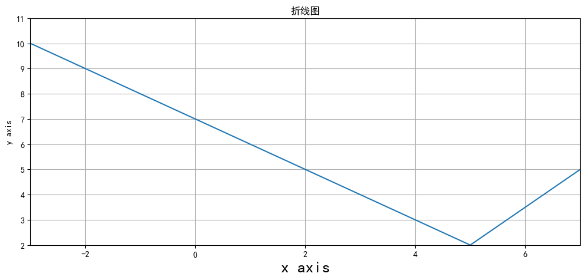

**面向对象示例- 精细控制：**

```python
fig, ax = plt.subplots(figsize=(12, 5))  # 创建画布和坐标系
ax.plot(x, y)                # 在坐标系中绘图
ax.set_xlim(-3, 7)           # 设置X轴范围
ax.set_ylim(2, 11)
ax.set_xlabel('x axis', size=20)
ax.set_ylabel('y axis', size=10)
ax.set_title('折线图')
plt.show()
```


#### 3.2.2 Anscombe四重奏：可视化的力量

**数据集背景**：统计学家Frank Anscombe构造的四组数据，统计特性几乎完全相同，但实际分布截然不同。

```python
import pandas as pd
anscombe = pd.read_csv('data/anscombe.csv')
anscombe.dataset.value_counts()
```

4组数据, 放在一个数据集中, 分别用I, II, III , IV 加以区分

| dataset | count |
| :------ | :---- |
| I       | 11    |
| II      | 11    |
| III     | 11    |
| IV      | 11    |


**统计特性对比：**

```python
anscombe.groupby('dataset').describe().T
```

`describe()`查看数据的查看数据的分布情况，发现每组数据中, x, y 的分布情况基本相同, 从均值, 极值和几个4分位数上看, 这几组数据貌似分布差不多

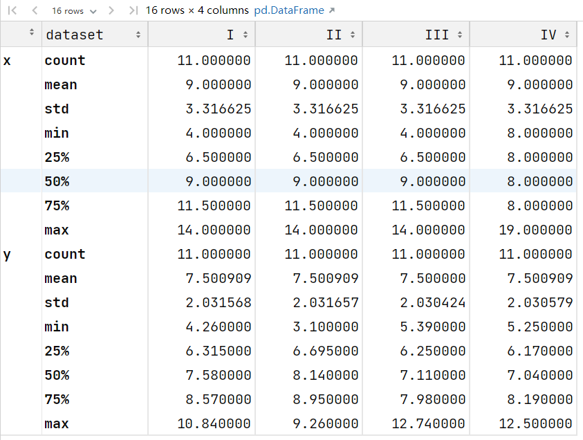


**可视化揭示差异：**

```python
# 上面的数据一共可以分成4分 I II III IV  我们把这四份数据分别可视化, 画4张小图, 放到一个画布中
fig = plt.figure(figsize=(16,8))
# 在画布中 设置一个两行两列的框, 第一个框 对应axes1
axes1 = fig.add_subplot(2,2,1)
# 在画布中 设置一个两行两列的框, 第二个框 对应axes2
axes2 = fig.add_subplot(2,2,2)
# 在画布中 设置一个两行两列的框, 第三个框 对应axes3
axes3 = fig.add_subplot(2,2,3)
# 在画布中 设置一个两行两列的框, 第四个框 对应axes4
axes4 = fig.add_subplot(2,2,4)

axes1.scatter(anscombe[anscombe['dataset']=='I']['x'],anscombe[anscombe['dataset']=='I']['y'])
axes2.scatter(anscombe[anscombe['dataset']=='II']['x'],anscombe[anscombe['dataset']=='II']['y'])
axes3.scatter(anscombe[anscombe['dataset']=='III']['x'],anscombe[anscombe['dataset']=='III']['y'])
axes4.scatter(anscombe[anscombe['dataset']=='IV']['x'],anscombe[anscombe['dataset']=='IV']['y'])	
plt.show()
```

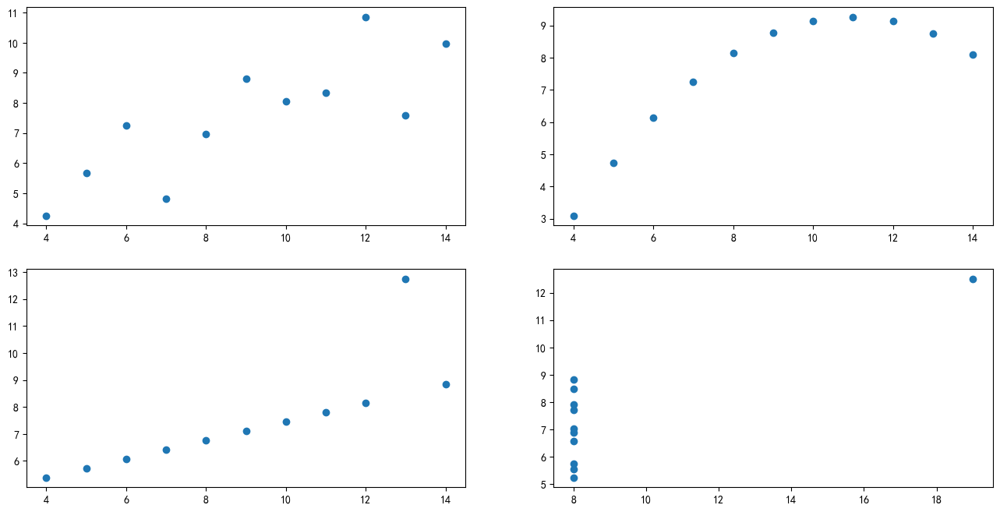

💡 **核心启示**：仅依赖统计指标会掩盖数据真实模式，可视化是必要验证步骤


### 3.3 Matplotlib 单变量可视化

#### 3.3.1 直方图 (Histogram)

展示连续变量的分布情况：

```python
tips = pd.read_csv('data/tips.csv')
# 创建绘图区域
plt.figure(figsize=(16,8))

# 绘制账单金额的直方图, 指定把账单金额均匀分成10组
plt.hist(tips['total_bill'],bins=10)

# 填写标签
plt.title('总账单金额的分布情况')
plt.xlabel('账单金额')
plt.ylabel('出现次数')
```

**直方图原理：**

```python
# 计算直方图的bin边界
bill_min = tips['total_bill'].min()  # 3.07
bill_max = tips['total_bill'].max()  # 50.81
bin_edges = np.linspace(bill_min, bill_max, 11)  # 11个点形成10个区间,直方图的高度, 就是落到每个区间中的数据的条目数

print("Bin边界值：\n", np.round(bin_edges, 2))
```

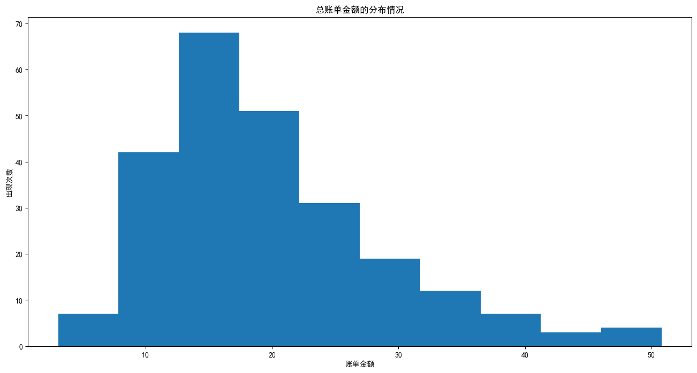


### 3.4 Matplotlib双变量与多变量可视化

#### 3.4.1 散点图（Scatter Plot）

散点图用于表示一个连续变量随另一个连续变量的变化所呈现的大致趋势

```python
# 了解账单金额和小费之间的关系可以绘制散点图
plt.figure(figsize=(12,8))
plt.scatter(tips['total_bill'],tips['tip'])
plt.xlabel('账单金额')
plt.ylabel('小费金额')
plt.grid(True)
```

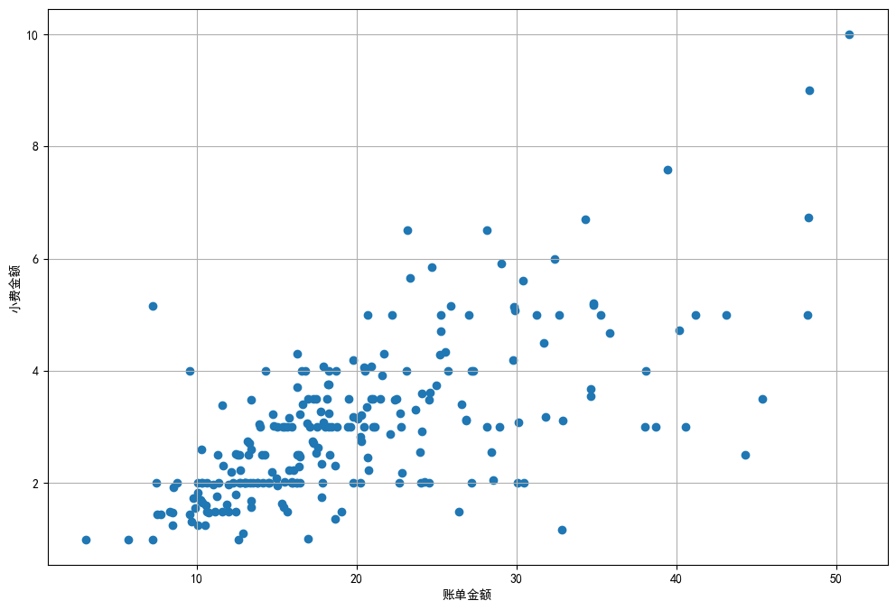

**多变量可视化：**

- 通过颜色、大小、透明度添加更多维度：

```python
# 添加一列, 用来区分不同性别显示的颜色
def recode_sex(sex):
    if sex=='Female':
        return 'r'
    else:
        return 'b'
tips['sex_color'] = tips['sex'].apply(recode_sex)
```

- 绘制散点图

```python
plt.figure(figsize=(12,8))

# c=tips['sex_color'] 区分颜色；s = tips['size']*10 区分大小；alpha=0.5 设置点的透明度
plt.scatter(tips['total_bill'],tips['tip'],c=tips['sex_color'],s = tips['size']*10,alpha=0.5)
plt.xlabel('账单金额')
plt.ylabel('小费金额')
plt.legend(tips['sex'])
```


## 4. Pandas原生绘图

Pandas基于Matplotlib封装，支持DataFrame/Series直接调用`.plot`方法，快速生成图表。

### 4.1 数据准备与概览

```python
# 加载葡萄酒评论数据集
reviews = pd.read_csv('data/winemag-data_first150k.csv', index_col=0)

# 数据概览
reviews.info()  # 查看数据类型和缺失值
```

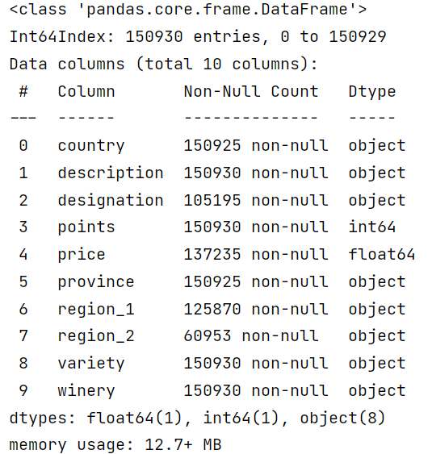


```python
# 数值型数据统计描述
reviews.describe()
```

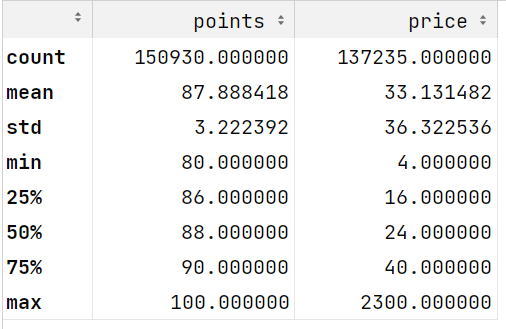

```python
# 非数值型数据统计描述
reviews.describe(include=object)
```

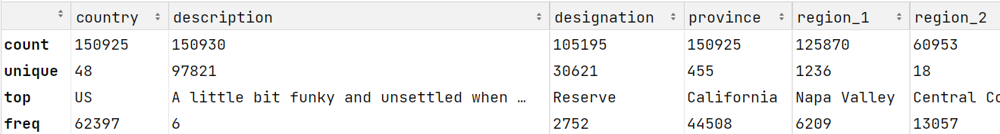


### 4.1 Pandas 单变量可视化

**数据类型与可视化选择**

| 数据类型       | 推荐可视化类型         | 使用建议                                        |
| :------------- | :--------------------- | :---------------------------------------------- |
| **类别型数据** | 柱状图                 | 展示各类别数量对比                              |
|                | 饼图                   | 仅适用于类别数较少(5-6个以内)且所有类别构成整体 |
| **数值型数据** | 折线图 (`plot.line()`) | 展示数据变化趋势                                |
|                | 直方图 (`plot.hist()`) | 展示数据分布特征                                |

**直方图绘制注意事项**

当数据分布不均匀（倾斜的数据, 有取值数量较少的极大, 极小值）时，这个时候如果不做数据的处理, 直接绘制直方图, 不能反映出数据的分布来, 只能得到一个柱子

- 将极值单独取出分析
- 对去除极值后的数据绘制直方图


#### 4.1.1 柱状图（Bar Chart）

**案例：统计葡萄酒出产种类最多的10个省份**

```python
# 获取出现次数最多的前10个省份
province_counts = reviews['province'].value_counts().head(10)

# 绘制彩色柱状图
kwargs = dict(
    figsize=(16, 8),
    fontsize=20,
    color=['b','orange','g','r','purple','brown','pink','gray','cyan','y']
)

province_counts.plot.bar(**kwargs)
```

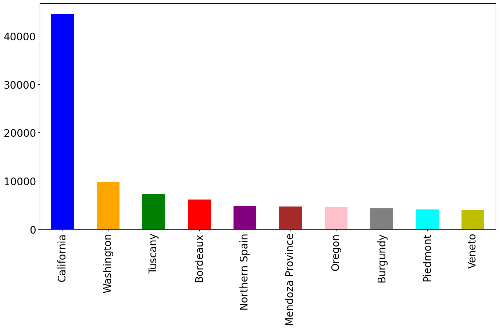

```python
import matplotlib.pyplot as plt
from matplotlib import ticker

fig,ax = plt.subplots(figsize=(16,8))

# 设置Y轴为百分比格式 decimals=1表示百分比的小数位数为1，xmax表示 100%对应的数据值
ax.yaxis.set_major_formatter(ticker.PercentFormatter(xmax=1,decimals=1))

# normalize=True：返回比例而非绝对值
province_pct = reviews['province'].value_counts(normalize=True).head(10)

kwargs = dict(
    fontsize=20,
    color=['b','orange','g','r','purple','brown','pink','gray','cyan','y']
)

province_pct.plot.bar(**kwargs)
```

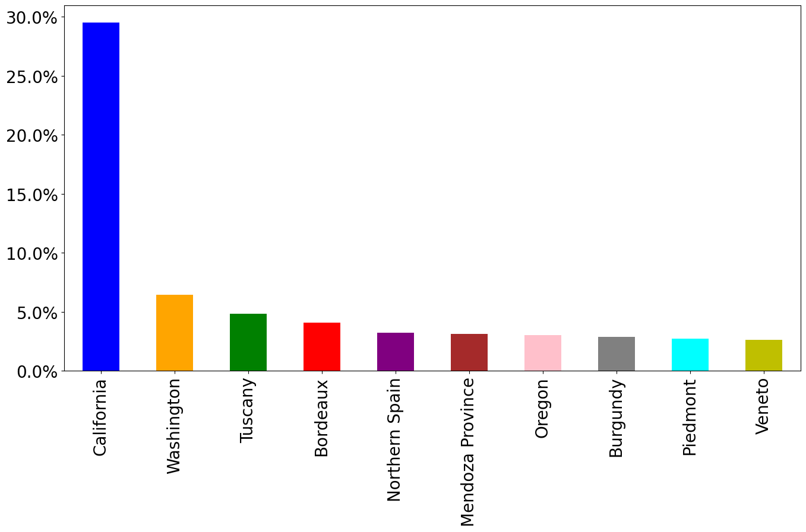		

#### 4.1.2 折线图与面积图

**案例：绘制葡萄酒评分的分布情况**

```python
# 折线图展示评分分布，为了方便绘图 sort_index 对行索引进行排序
reviews['points'].value_counts().sort_index().plot.line(grid=True)
```

```python
# 面积图展示评分分布
reviews['points'].value_counts().sort_index().plot.area(grid=True)
```

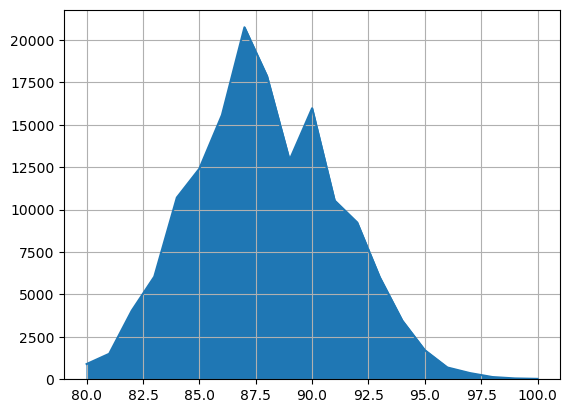

#### 4.1.3 直方图应用

绘制直方图的时候需要注意, 如果数据是有偏的, 需要先将数据进行处理：这里葡萄酒的价格分布并不均匀, 高于500元的葡萄酒种类很少, 先从数据中截取价格<150的再绘制直方图
```python
# 处理价格极值后绘制直方图
reviews[reviews['price']<150]['price'].plot.hist(bins=15)
```

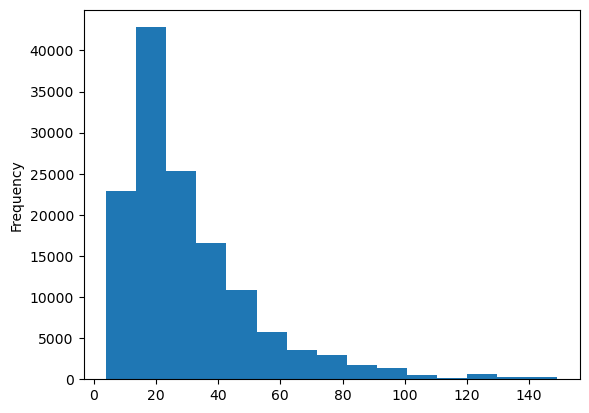

```python
# quantile 计算分位数
reviews['price'].quantile(0.9994)
```

>500.0


#### 4.1.4 饼图应用

- 饼图适合统计类别数量不多, 组合起来是1的数据的可视化

```python
reviews['province'].value_counts().head(10).plot.pie()
```


#### 4.1.5 图表选型决策树

| 数据类型   | 分析目标 | 推荐图表       | 关键参数                | 注意事项             |
| :--------- | :------- | :------------- | :---------------------- | :------------------- |
| **类别型** | 数量对比 | 柱状图（bar）  | `color`, `edgecolor`    | 类别不宜过多（<15）  |
| **类别型** | 占比分析 | 饼图（pie）    | `autopct`, `startangle` | 类别≤6个，避免3D效果 |
| **数值型** | 分布形态 | 直方图（hist） | `bins`, `alpha`         | 处理前检查数据偏度   |
| **数值型** | 趋势变化 | 折线图（line） | `marker`, `grid`        | 时间序列需排序       |
| **数值型** | 累积趋势 | 面积图（area） | `alpha`, `stacked`      | 适合展示堆叠效果     |

**最佳实践提示**：当处理有偏分布数据时，建议先进行数据预处理（如去除极值、分箱等）再可视化，以获得更清晰的分布特征。

