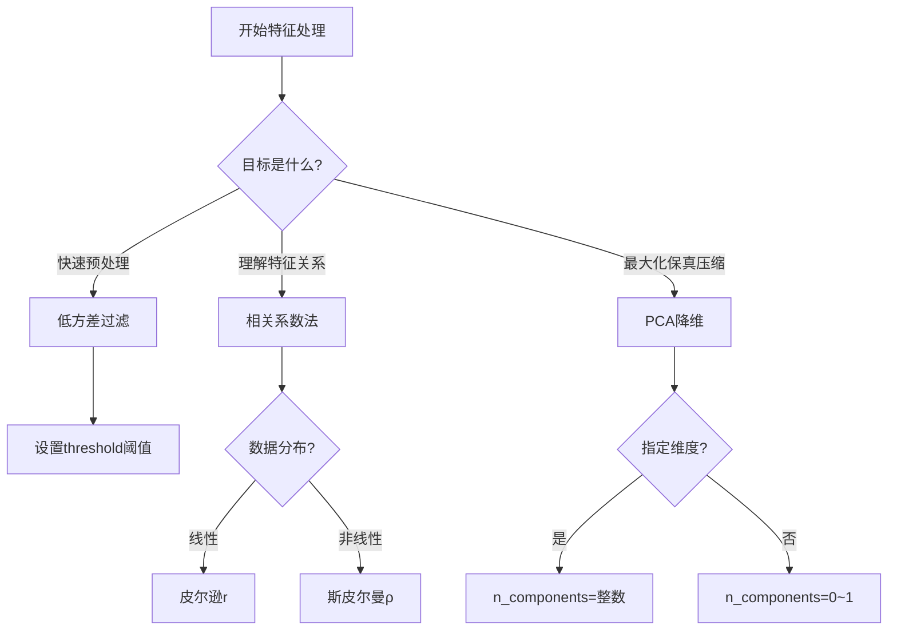

## 1、朴素贝叶斯

### 1.1 朴素贝叶斯介绍

####  1.1.1 常见的概率公式

| 样本数 | 职业   | 体型 | 是否喜欢 |
| ------ | ------ | ---- | -------- |
| 1      | 程序员 | 超重 | 不喜欢   |
| 2      | 产品   | 匀称 | 喜欢     |
| 3      | 程序员 | 匀称 | 喜欢     |
| 4      | 程序员 | 超重 | 喜欢     |
| 5      | 美工   | 匀称 | 不喜欢   |
| 6      | 美工   | 超重 | 不喜欢   |
| 7      | 产品   | 匀称 | 喜欢     |

**条件概率：**  表示事件$A$在另外一个事件$B$已经发生条件下的发生概率，记为$P(A|B)$。

> **示例：** 在女神喜欢的条件下，职业是程序员的概率？  
>
> - 女神喜欢条件下，有样本2、3、4、7共4个  
> - 其中职业为程序员的样本有3、4共2个  
> - 则 $P(\text{程序员}|\text{喜欢}) = \frac{2}{4} = 0.5$  


**联合概率：**  表示多个条件同时成立的概率，记为$P(AB) = P(A) P(B|A)$。  特征条件独立性假设下：$P(AB) = P(A) P(B)$。

> **示例：** 职业是程序员并且体型匀称的概率？  
> 1. 数据集中共有7个样本  
> 2. 职业是程序员的样本有1、3、4共3个，概率为$\frac{3}{7}$  
> 3. 在职业为程序员的样本中，体型匀称的样本有3共1个，概率为$\frac{1}{3}$  
> 4. 则联合概率为$\frac{3}{7} \times \frac{1}{3} = \frac{1}{7}$  


**联合概率 + 条件概率：**  计算$P(AB|C) = P(A|C) P(B|AC)$。

> **示例：** 在女神喜欢的条件下，职业是程序员、体重超重的概率？  
> 1. 女神喜欢条件下，有样本2、3、4、7共4个  
> 2. 其中职业为程序员的样本有3、4共2个，概率为$\frac{2}{4}=0.5$  
> 3. 在这2个样本中，体型超重的样本有4共1个，概率为$\frac{1}{2}=0.5$  
> 4. 则 $P(\text{程序员}, \text{超重}|\text{喜欢}) = 0.5 \times 0.5 = 0.25$  


**简言之：**  

- **条件概率**：在限定条件下某事件发生的概率，记为$P(B|A)$。  
- **联合概率**：多个事件同时发生的概率，记为$P(AB) = P(B) \times P(A|B)$。


#### 1.1.2 贝叶斯公式

$$
P(C | W) = \frac{P(W | C)P(C)}{P(W)}=\frac{P(C \cap W)}{P(W)}
$$

- $P(C)$ 表示 $C$ 出现的概率  
- $P(W|C)$ 表示 $C$ 条件下 $W$ 出现的概率  
- $P(W)$ 表示 $W$ 出现的概率  


**示例计算**

| 编号 | 职业   | 体型 | 喜欢的概率？ |
| ---- | ------ | ---- | ------------ |
| 1    | 程序员 | 超重 | ?            |

- 目标：计算 $P(\text{喜欢} \mid \text{程序员}, \text{超重})$  
- 分解：  
   - $P(W \mid C) = P(\text{程序员}, \text{超重} \mid \text{喜欢})$  
   - $P(C) = P(\text{喜欢})$  
   - $P(W) = P(\text{程序员}, \text{超重})$  


**计算步骤**

- **先验概率** $P(\text{喜欢})$：  $$\frac{4}{7} \quad (\text{样本2,3,4,7共4个喜欢})$$

- **条件概率** $P(\text{程序员}, \text{超重} \mid \text{喜欢})$：  $$\frac{1}{4} \quad (\text{喜欢样本中，编号4满足条件})$$  。调整先验概率：  $$P(\text{程序员}, \text{超重} \mid \text{喜欢}) \times P(\text{喜欢}) = \frac{1}{4} \times \frac{4}{7} = \frac{1}{7}$$

- **联合概率** $P(\text{程序员}, \text{超重})$：  $$P(\text{程序员}) \times P(\text{超重} \mid \text{程序员}) = \frac{3}{7} \times \frac{2}{3} = \frac{2}{7}$$  （程序员样本3个，其中超重2个）

- **后验概率** $P(\text{喜欢} \mid \text{程序员}, \text{超重})$：  $$\frac{\frac{1}{7}}{\frac{2}{7}} = 0.5$$


**结论**

对于“职业=程序员，体型=超重”的样本，被分类为“喜欢”的概率为 **50%**。


#### 1.1.3 朴素贝叶斯

朴素贝叶斯在贝叶斯定理的基础上引入**特征条件独立假设**，即假设特征之间相互独立。这一假设显著简化了联合概率的计算：

- **条件联合概率**的简化：  
   $$
   P(\text{程序员}, \text{超重} \mid \text{喜欢}) = P(\text{程序员} \mid \text{喜欢}) \times P(\text{超重} \mid \text{喜欢})
   $$

- **联合概率**的简化：  
   $$
   P(\text{程序员}, \text{超重}) = P(\text{程序员}) \times P(\text{超重})
   $$

#### 1.1.4 拉普拉斯平滑系数
为解决训练样本不足导致的概率为0的问题，引入拉普拉斯平滑：

$$
P(F_1 \mid C) = \frac{N_t + \alpha}{N + \alpha m}
$$

- $\alpha$：拉普拉斯平滑系数，一般指定为 1
- $N_t$：$F_1$ 中符合条件 $C$ 的样本数量
- $N$：在条件 $C$ 下所有样本的总数  
- $m$：**所有独立样本**的总数

**作用**：通过在分子和分母添加平滑项，避免零概率问题，提升模型鲁棒性。


**示例说明**  

若某特征在训练集中未出现（如“职业=设计师”），传统计算会得$P(\text{设计师} \mid \text{喜欢})=0$，但平滑后：  
$$
P(\text{设计师} \mid \text{喜欢}) = \frac{0 + 1}{4 + 1 \times 3} = \frac{1}{7} \quad (\text{假设}m=3)
$$


### 1.2 情感分析

#### 1.2.1 api介绍

```python
from sklearn.naive_bayes import MultinomialNB
# 初始化朴素贝叶斯分类器
model = MultinomialNB(alpha=1.0)  # alpha为拉普拉斯平滑系数
```


#### 1.2.2 商品评论情感分析

已知商品评论数据，根据数据进行情感分类（好评、差评)

| 编号 | 内容                                                 | 评价 |
| :--- | :--------------------------------------------------- | :--- |
| 0    | 从编程小白的角度看，入门极佳。                       | 好评 |
| 1    | 很好的入门书，简洁全面，适合小白。                   | 好评 |
| 2    | 讲解全面，许多小细节都有顾及，三个小项目受益匪浅。   | 好评 |
| 3    | 前半部分讲概念深入浅出，要言不烦，很赞               | 好评 |
| 4    | 看了一遍还是不会写，有个概念而已                     | 差评 |
| 5    | 中规中矩的教科书，零基础的看了依旧看不懂             | 差评 |
| 6    | 内容太浅显，个人认为不适合有其它语言编程基础的人     | 差评 |
| 7    | 破书一本                                             | 差评 |
| 8    | 适合完完全全的小白读，有其他语言经验的可以去看别的书 | 差评 |
| 9    | 基础知识写的挺好的！                                 | 好评 |
| 10   | 太基础                                               | 差评 |
| 11   | 略_嗦。。适合完全没有编程经验的小白                  | 差评 |
| 12   | 真的真的不建议买                                     | 差评 |


**步骤分析**

- 获取数据
- 数据基本处理
  - 取出内容列，对数据进行分析
  - 判定评判标准
  - 选择停用词
  - 把内容处理，转化成标准格式
  - 统计词的个数
  - 准备训练集和测试集
- 模型训练
- 模型评估

​	

**代码实现**

```python
import pandas as pd
import numpy as np
import jieba
import matplotlib.pyplot as plt
from sklearn.feature_extraction.text import CountVectorizer
from sklearn.naive_bayes import MultinomialNB
```

- 获取数据

```python
# 加载数据
data = pd.read_csv("./data/书籍评价.csv", encoding="gbk")
data
```

- 2）数据基本处理

```python
# 2.1） 取出内容列，对数据进行分析
content = data["内容"]
content.head()

# 2.2） 判定评判标准 -- 1好评;0差评
data.loc[data.loc[:, '评价'] == "好评", "评论标号"] = 1  # 把好评修改为1
data.loc[data.loc[:, '评价'] == '差评', '评论标号'] = 0

good_or_bad = data['评价'].values  # 获取数据
print(good_or_bad)
# ['好评' '好评' '好评' '好评' '差评' '差评' '差评' '差评' '差评' '好评' '差评' '差评' '差评']

# 2.3） 选择停用词
# 加载停用词
stopwords=[]
with open('./data/stopwords.txt','r',encoding='utf-8') as f:
    lines=f.readlines()
    print(lines)
    for tmp in lines:
        line=tmp.strip()
        print(line)
        stopwords.append(line)
# stopwords  # 查看新产生列表

#对停用词表进行去重
stopwords=list(set(stopwords))#去重  列表形式
print(stopwords)

# 2.4） 把“内容”处理，转化成标准格式
comment_list = []
for tmp in content:
    print(tmp)
    # 对文本数据进行切割
    # cut_all 参数默认为 False,所有使用 cut 方法时默认为精确模式
    seg_list = jieba.cut(tmp, cut_all=False)
    print(seg_list)  # <generator object Tokenizer.cut at 0x0000000007CF7DB0>
    seg_str = ','.join(seg_list)  # 拼接字符串
    print(seg_str)
    comment_list.append(seg_str)  # 目的是转化成列表形式
# print(comment_list)  # 查看comment_list列表。

# 2.5） 统计词的个数
# 进行统计词个数
# 实例化对象
# CountVectorizer 类会将文本中的词语转换为词频矩阵
#stop_words=stopwords 这个参数的作用是让 CountVectorizer 在分词统计时自动过滤掉 stopwords 列表中的停用词（如“的”、“了”、“和”等无实际意义的词），从而只统计有意义的词语，提高文本特征的质量
con = CountVectorizer(stop_words=stopwords)
# 进行词数统计
#x 是由 CountVectorizer 处理后的稀疏矩阵，表示每条评论中各词语（去除停用词后）出现的次数。它的每一行对应一条评论，每一列对应一个词，元素值为该词在该评论中出现的次数。类型为 scipy.sparse.csr_matrix，可用 x.toarray() 查看具体的词频数组。
X = con.fit_transform(comment_list)  # 它通过 fit_transform 函数计算各个词语出现的次数
name = con.get_feature_names_out()  # 通过 get_feature_names_out()可获取词袋中所有文本的关键字
print(X.toarray())  # 通过 toarray()可看到词频矩阵的结果
print(name)

# 2.6）准备训练集和测试集
# 准备训练集   这里将文本前10行当做训练集  后3行当做测试集
x_train = X.toarray()[:10, :]
y_train = good_or_bad[:10]
# 准备测试集
x_text = X.toarray()[10:, :]
y_text = good_or_bad[10:]
```

- 3）模型训练

```python
# 构建贝叶斯算法分类器
mb = MultinomialNB(alpha=1)  # alpha 为可选项，默认 1.0，添加拉普拉修/Lidstone 平滑参数
# 训练数据
mb.fit(x_train, y_train)
# 预测数据
y_predict = mb.predict(x_text)
#预测值与真实值展示
print('预测值：',y_predict)
print('真实值：',y_text)
```

- 4）模型评估

```python
mb.score(x_text, y_text)
```


### 1.3 朴素贝叶斯预测规则

**实例演示：垃圾邮件分类**

假设特征：$X = (x_1 = \text{点击}, x_2 = \text{链接})$，类别 $y \in \{\text{垃圾邮件}, \text{正常邮件}\}$


**问题设定**

我们有一个二分类问题：
- **类别($y$)**：垃圾邮件($y=1$)或正常邮件($y=0$)
- **特征($X$)**：每个邮件有两个特征
  - $x_1$：是否包含"点击"这个词
  - $x_2$：是否包含"链接"这个词


**训练数据统计**：

| 概率项                       | 垃圾邮件 ($y=1$) | 正常邮件 ($y=0$) |
| ---------------------------- | ---------------- | ---------------- |
| 先验概率 $P(y)$              | 0.6              | 0.4              |
| $P(x_1 = \text{点击}\mid y)$ | 0.9              | 0.1              |
| $P(x_2 = \text{链接}\mid y)$ | 0.8              | 0.2              |

> 根据训练数据数据得出以上概率。


**分类过程**

根据贝叶斯定理：$$P(y \mid X) = P(y) \times P(X \mid y)$$

由于朴素贝叶斯的"朴素"假设(特征条件独立)：$$P(y \mid X) = P(y) \times P(x_1 \mid y) \times P(x_2 \mid y)$$


**计算后验概率**：

1. **对垃圾邮件 ($y=1$)**：  
   $$
   P(y=1|X) = P(y=1) \cdot P(x_1|y=1) \cdot P(x_2|y=1) = 0.6 \times 0.9 \times 0.8 = 0.432
   $$

2. **对正常邮件 ($y=0$)**：  
   $$
   P(y=0|X) = P(y=0) \cdot P(x_1|y=0) \cdot P(x_2|y=0) = 0.4 \times 0.1 \times 0.2 = 0.008
   $$

**预测结果**：  

$0.432 > 0.008 \quad \Rightarrow \quad \hat{y} = \text{垃圾邮件}$


## 2、特征降维

### 2.1 降维概述

**核心问题**：高维特征可能导致模型泛化性能下降。

**典型场景**：

- **低方差特征**：取值相近，信息量低
- **高相关特征**：冗余信息，未提供额外价值

**降维方法对比**：

| 方法           | 原理                 | 适用场景       | 特点                       |
| :------------- | :------------------- | :------------- | :------------------------- |
| **低方差过滤** | 删除方差低于阈值特征 | 快速初步筛选   | 计算简单，可能丢失局部信息 |
| **PCA**        | 线性变换保最大方差   | 高维数据压缩   | 无损信息，创造新特征       |
| **相关系数**   | 移除高度相关特征     | 特征解释性分析 | 保留原始特征，可解释性强   |


### 2.2 低方差过滤法

**原理**：删除方差接近零的特征。

```python
from sklearn.feature_selection import VarianceThreshold

# 初始化：删除方差低于阈值的特征
selector = VarianceThreshold(threshold=0.1)

# 拟合并转换
X_filtered = selector.fit_transform(X)  # X: [n_samples, n_features]
```

**应用示例**：

```python
import pandas as pd
from sklearn.feature_selection import VarianceThreshold

# 1. 加载高维数据
data = pd.read_csv('data/垃圾邮件分类数据.csv')
print(f"原始数据维度: {data.shape}")  # (971, 25734)

# 2. 应用方差过滤
transformer = VarianceThreshold(threshold=0.1)
data_filtered = transformer.fit_transform(data)

print(f"降维后数据维度: {data_filtered.shape}")  # (971, 1044)
```

**效果**：特征数从 **25,734** 降至 **1,044**，保留方差显著特征。


### 2.3 主成分分析（PCA）


**核心思想**：线性投影至低维空间，保留最大方差方向。

**数学表达**：

$$
X_{\text{PCA}} = X \cdot W
$$

其中 \( W \) 为按特征值降序排列的特征向量矩阵。

```python
from sklearn.decomposition import PCA
from sklearn.datasets import load_iris

# 加载数据
x, y = load_iris(return_X_y=True)

# 方式1：按信息保留比例降维
pca_ratio = PCA(n_components=0.95)  # 保留95%方差
x_pca_95 = pca_ratio.fit_transform(x)
print(f"降维后形状: {x_pca_95.shape}")  # (150, 2)

# 方式2：指定目标维度
pca_fixed = PCA(n_components=2)  # 强制降至2维
x_pca_2 = pca_fixed.fit_transform(x)
print(f"前5个样本:\n{x_pca_2[:5]}")
```

**输出示例**：

```
[[-2.68412563  0.31939725]
 [-2.71414169 -0.17700123]
 [-2.88899057 -0.14494943]
 [-2.74534286 -0.31829898]
 [-2.72871654  0.32675451]]
```

⚠️ **重要区别**：

- `n_components=0.95`：自动选择维度以保留95%信息
- `n_components=2`：强制降为2维，可能损失较多信息


### 2.4 相关系数法

#### 2.4.1 皮尔逊相关系数

**适用**：衡量**线性**相关程度（$r \in [-1, 1]$）

**计算公式**：
$$
r = \frac{n\sum xy - (\sum x)(\sum y)}{\sqrt{[n\sum x^2 - (\sum x)^2][n\sum y^2 - (\sum y)^2]}}
$$


**示例计算**（假设数据）：
$$
r = \frac{10 \times 16679.09 - 346.2 \times 422.5}{\sqrt{(10 \times 14304.52 - 346.2^2)(10 \times 19687.81 - 422.5^2)}} = 0.994
$$

**解读**：

| $r$ 值域  | 相关强度 | 业务含义               |
| --------- | -------- | ---------------------- |
| 0.8 ~ 1.0 | 极强相关 | 可考虑删除其中一个特征 |
| 0.6 ~ 0.8 | 强相关   | 需结合业务判断         |
| 0.4 ~ 0.6 | 中等相关 | 保留两者可能有益       |
| < 0.4     | 弱相关   | 建议保留               |


#### 2.4.2 斯皮尔曼相关系数

**适用**：衡量**单调**相关程度（$\rho \in [-1, 1]$），不要求线性

**计算公式**：
$$
\rho = 1 - \frac{6 \sum d_i^2}{n(n^2 - 1)}
$$
上面的公式中， $d_i$为样本中不同特征在数据中排序的序号差值，计算举例如下所示


计算：
$$
\rho = 1 - \frac{6 \times 25.5}{7 \times 48} \approx -0.23
$$

**结论**：$\rho \approx -0.23$（弱单调负相关）


**实战代码对比**：

```python
from scipy.stats import pearsonr, spearmanr
from sklearn.datasets import load_iris
import pandas as pd

# 加载数据
iris = load_iris()
df = pd.DataFrame(iris.data, columns=iris.feature_names)

# 计算花萼长度与宽度的相关性
feature_x = df['sepal length (cm)']
feature_y = df['sepal width (cm)']

# 皮尔逊相关系数
pearson_corr, pearson_p = pearsonr(feature_x, feature_y)
print(f"皮尔逊相关系数: {pearson_corr:.4f}")
print(f"p-value: {pearson_p:.4f} (p<0.05表示显著)")
# 皮尔逊相关系数: -0.11756978413300204 不相关性概率: 0.15189826071144918   结果: -0.1176，弱负相关

# 斯皮尔曼相关系数
spearman_corr, spearman_p = spearmanr(feature_x, feature_y)
print(f"斯皮尔曼相关系数: {spearman_corr:.4f}")
print(f"p-value: {spearman_p:.4f}")
# 斯皮尔曼相关系数: -0.166777658283235 不相关性概率: 0.04136799424884587  结果: -0.1668，弱单调负相关
```

💡 **选择建议**：

- 数据呈线性分布 → 皮尔逊
- 数据非线性但单调 → 斯皮尔曼
- 存在异常值 → 斯皮尔曼更鲁棒


## 3. 方法总结与选型指南

### 3.1 场景化选型决策树



### 3.2 关键参数速查表

| 方法           | 核心参数       | 推荐值    | 作用                     |
| -------------- | -------------- | --------- | ------------------------ |
| **朴素贝叶斯** | `alpha`        | 1.0       | 平滑系数，防止零概率     |
| **低方差过滤** | `threshold`    | 0.0~0.5   | 方差阈值，删除低信息特征 |
| **PCA**        | `n_components` | 0.95或2-3 | 信息保留比例或目标维度   |
