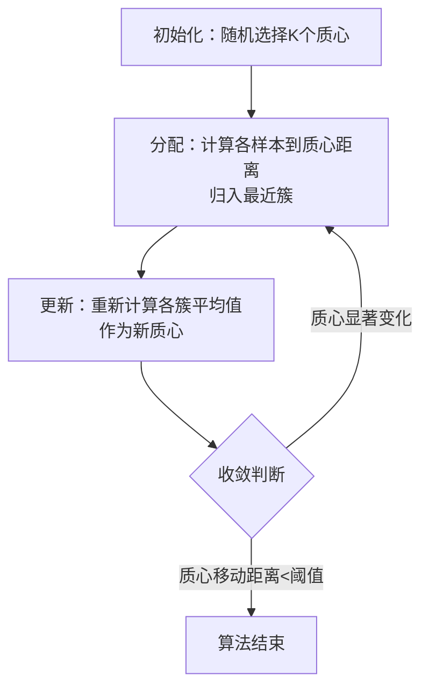
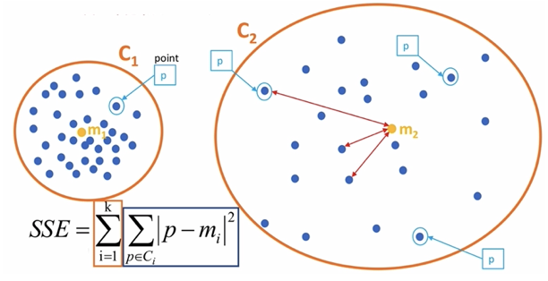

## 1. 聚类算法核心概念

### 1.1 算法定义

聚类是典型的**无监督学习**算法，通过计算样本间的**相似度**（常用欧氏距离）将相似样本自动归为一类。算法无需预先标注数据，可自主发现数据内在结构。

### 1.2 典型应用场景

| 领域           | 具体应用                                           |
| :------------- | :------------------------------------------------- |
| **商业智能**   | 用户画像构建、广告精准推荐、客户分群、异常消费检测 |
| **信息检索**   | 搜索引擎流量分类、恶意流量识别、新闻主题聚合       |
| **计算机视觉** | 图像分割、模式识别、离群点检测                     |
| **生物信息**   | 基因功能片段发掘、蛋白质分类                       |
| **地理服务**   | 基于位置的商业推送、区域热点分析                   |

### 1.3 算法分类体系

#### 按聚类粒度划分

- **细聚类**：生成精确、细致的子类，适用于高精度分析场景
- **粗聚类**：生成宽泛的顶层分类，适用于快速探索性分析


#### 按实现方法划分

| 算法类型     | 核心原理         | 适用场景               | 特点                       |
| :----------- | :--------------- | :--------------------- | :------------------------- |
| **K-means**  | 基于质心迭代优化 | 球形分布、大规模数据   | 简单高效，需预设簇数量     |
| **层次聚类** | 构建树状聚类结构 | 小规模数据、需层次结构 | 无需预设K值，计算复杂度高  |
| **DBSCAN**   | 基于密度划分     | 任意形状簇、含噪声数据 | 自动识别异常点，对参数敏感 |
| **谱聚类**   | 图论与特征向量   | 复杂结构数据           | 效果优异，计算开销大       |


## 2. K-Means算法详解

### 2.1 Scikit-learn API参考

```python
from sklearn.cluster import KMeans

# 核心参数
kmeans = KMeans(
    n_clusters=8,        # 聚类中心数量，默认8
    max_iter=300,        # 最大迭代次数
    random_state=None,   # 随机种子
    n_init='auto'        # 初始化次数（自动选择）
)
```

#### 关键方法对比

| 方法             | 功能描述          | 返回标签 | 支持新数据预测 | 典型用途 |
| :--------------- | :---------------- | :------- | :------------- | :------- |
| `fit(X)`         | 计算聚类中心      | ❌ 不返回 | ❌ 不支持       | 训练模型 |
| `predict(X)`     | 预测样本所属簇    | ✅ 返回   | ✅ 支持         | 推理预测 |
| `fit_predict(X)` | 训练+预测一步到位 | ✅ 返回   | ❌ 不支持       | 快速实验 |

⚠️ **重要提示**：`fit()`方法虽完成聚类分配，但必须通过`predict()`显式获取标签，后者额外支持对新数据的预测能力。


### 2.2 快速入门案例

随机创建不同二维数据集作为训练集，并结合k-means算法将其聚类，你可以尝试分别聚类不同数量的簇，并观察聚类效果：


```python
import matplotlib.pyplot as plt
from sklearn.datasets import make_blobs
from sklearn.cluster import KMeans
from sklearn.metrics import calinski_harabasz_score

# 1. 创建合成数据集
# 1000个样本，2个特征，4个真实簇
# 簇中心在[-1,-1], [0,0],[1,1], [2,2]， 簇方差分别为[0.4, 0.2, 0.2, 0.2]
X, y_true = make_blobs(
    n_samples=1000,
    n_features=2,
    centers=[[-1, -1], [0, 0], [1, 1], [2, 2]],
    cluster_std=[0.4, 0.2, 0.2, 0.2],
    random_state=9
)

# 2. 可视化原始数据
plt.figure(figsize=(8, 6))
plt.scatter(X[:, 0], X[:, 1], alpha=0.6, marker='o')
plt.title("原始数据分布")
plt.xlabel("特征1")
plt.ylabel("特征2")
plt.show()

# 3. 执行K-means聚类（K=4）
kmeans = KMeans(n_clusters=4, random_state=9)
# 分别尝试n_cluses=2\3\4,然后查看聚类效果
y_pred = kmeans.fit_predict(X)

# 4. 可视化聚类结果
plt.figure(figsize=(8, 6))
plt.scatter(X[:, 0], X[:, 1], c=y_pred, alpha=0.6)
plt.title("K-means聚类结果 (K=4)")
plt.legend()
plt.show()

# 5. 评估聚类质量
ch_score = calinski_harabaz_score(X, y_pred)
print(f"Calinski-Harabasz 指数: {ch_score:.2f}")
```


## 3. K-Means算法执行流程

### 3.1 标准迭代过程



#### 详细步骤说明

1. **初始化阶段** 
   - 在特征空间中随机选取K个点作为初始聚类中心（质心）
   - 建议多次初始化（`n_init`参数）避免局部最优

2. **分配阶段** 
   - 对每个样本计算其到K个质心的欧氏距离
   - 将样本分配给距离最近的质心所属簇

3. **更新阶段** 
   - 对每个簇，计算簇内所有样本的均值向量
   - 将均值向量设为该簇的新质心

4. **收敛判断** 
   - 若新旧质心位置变化小于阈值或达到最大迭代次数，算法终止
   - 否则返回步骤2继续迭代

💡 **算法特性**：K-Means一定会收敛，不会无限迭代。但对初始质心敏感，可能陷入局部最优解。


### 3.2 完整流程示例

假设有6个二维数据点：P1(2,3), P2(3,4), P3(5,6), P4(7,8), P5(1,2), P6(9,9)，设K=2。

**初始状态**：随机选择P1、P2作为初始质心

**第1次迭代**：

- 计算距离：P3离P2更近，P4离P2更近，P5离P1更近，P6离P2更近
- 簇划分：C1={P1,P5}, C2={P2,P3,P4,P6}
- 新质心：C1'=(1.5,2.5), C2'=(6,6.75)

**第2次迭代**：

- 重新分配：P1、P5归入C1，其余归入C2
- 质心更新后位置不变，**算法收敛**


## 4. 聚类效果评估体系

### 4.1 核心评估指标对比

| 指标    | 全称              | 计算原理                   | 优化方向          | 适用场景       |
| :------ | :---------------- | :------------------------- | :---------------- | :------------- |
| **SSE** | 误差平方和        | 样本到质心距离平方和       | ⬇️ 越小越好        | 肘部法选K      |
| **SC**  | 轮廓系数          | 结合簇内凝聚度与簇间分离度 | ⬆️ 越大越好 (-1,1) | 评估聚类紧密度 |
| **CH**  | Calinski-Harabasz | 类间离散度 / 类内离散度    | ⬆️ 越大越好        | 自动选K值      |

### 4.2 各指标详解

#### SSE (Sum of Squared Errors)


$$
SSE = \sum_{i=1}^{K}\sum_{p \in C_i}|p - m_i|^2
$$

- $K$：簇数量
- $C_i$：第i个簇
- $p$：单个样本
- $m_i$：第i个簇的质心



**解读**：SSE越小，样本越接近质心，聚类效果越好。但SSE随K值增加单调递减。

```python
# 1.导入依赖包
from sklearn.cluster import KMeans
import matplotlib.pyplot as plt
from sklearn.datasets import make_blobs
from sklearn.metrics import calinski_harabasz_score

def dm01_SSE误差平方和求模型参数():
  # 2.构建数据，产生数据 random_state=22固定好
  x, y = make_blobs(n_samples=1000, n_features=2, centers=[[-1,-1], [0, 0], [1, 1], [2, 2]],cluster_std=[0.4, 0.2, 0.2, 0.2], 											random_state=22)
  # 3.模型训练及 SSE
  sse_list = []
  for clu_num in range(1, 100):
    my_kmeans = KMeans(n_clusters=clu_num, max_iter=100, random_state=0)
    my_kmeans.fit(x)
    sse_list.append(my_kmeans.inertia_ ) # 获取SSE的值

  # 4.展示效果
  plt.figure(figsize=(18, 8), dpi=100)
  plt.xticks(range(0, 100, 3), labels=range(0, 100, 3))
  plt.grid()
  plt.title('sse')
  plt.plot(range(1, 100), sse_list, 'or-')
  plt.show()
```


#### SC (Silhouette Coefficient)

**计算步骤**：

1. 计算样本i到同簇其他点的平均距离$a_i$（簇内不相似度）
2. 计算样本i到最近其他簇所有点的平均距离$b_i$（簇间不相似度）
3. 轮廓系数$s_i = \frac{b_i - a_i}{\max(a_i, b_i)}$


**解读**：SC取值[-1, 1]，越接近1说明聚类越合理。可用于选择最优K值。


#### 肘部法 (Elbow Method)

**核心思想**：绘制SSE-K曲线，寻找"肘点"作为最佳K值。


**操作流程**：

```python
sse_values = []
K_range = range(1, 15)

for k in K_range:
    kmeans = KMeans(n_clusters=k, random_state=42)
    kmeans.fit(X)
    sse_values.append(kmeans.inertia_)

# 可视化肘部曲线
plt.plot(K_range, sse_values, 'bo-')
plt.axvline(x=4, color='red', linestyle='--')  # 假设肘点在K=4
plt.xlabel('簇数量 K')
plt.ylabel('SSE')
plt.title('肘部法确定最优K值')
plt.show()
```

💡 **技巧**：肘点通常出现在SSE下降率由急转缓的拐点处。


#### CH (Calinski-Harabasz) 指数

CH 系数结合了聚类的凝聚度（Cohesion）和分离度（Separation）、**质心的个数**，希望用最少的簇进行聚类。
$$
\text{CH}(k) = \frac{SSB}{SSW} \cdot \frac{m-k}{k-1}
$$

$$
SSW = \sum_{i=1}^{m} \|x_i - C_{pi}\|^2
$$

$$
SSB = \sum_{j=1}^{k} n_j \|C_j - \bar{X}\|^2
$$


- $SSB$：簇间离散度（越大越好）
  - $n_j$ 表示样本的个数
  - $C_j$ 表示质心
  - $\bar{X}$ 表示质心与质心之间的中心点
  - $k$ 表示质心个数
- $SSW$：簇内离散度（越小越好）
  - $x_i$ 表示某个样本
  - $C_{pi}$ 表示质心
  - $m$ 表示样本数量

**优势**：自动平衡聚类质量与簇数量，无需真实标签即可评估。


### 4.3 完整评估示例

```python
from sklearn.datasets import make_blobs
from sklearn.cluster import KMeans
from sklearn.metrics import silhouette_score, calinski_harabasz_score
import numpy as np

# 生成测试数据
X, _ = make_blobs(n_samples=1000, centers=4, random_state=42)

# 测试不同K值
results = []
for k in range(2, 8):
    kmeans = KMeans(n_clusters=k, random_state=42)
    y_pred = kmeans.fit_predict(X)
    
    results.append({
        'K': k,
        'SSE': kmeans.inertia_,
        'SC': silhouette_score(X, y_pred),
        'CH': calinski_harabasz_score(X, y_pred)
    })

# 输出评估表格
import pandas as pd
df_results = pd.DataFrame(results)
print(df_results)

# 推荐K值（CH最大化）
best_k = df_results.loc[df_results['CH'].idxmax(), 'K']
print(f"\n📊 推荐K值: {best_k} (CH指数最高)")
```


## 5. 实战案例：客户分群分析

### 5.1 业务背景

**目标**：基于客户性别、年龄、年收入和消费指数，识别高价值客户群体，挖掘业务增长点。

**数据集特征**：

- 样本量：200条客户记录
- 特征维度：4维（Gender, Age, Annual Income, Spending Score）
- 关键字段：年收入（k美元）、消费评分（1-100）
- **后续步骤**：使用聚类算法对具有相似特征的顾客进行聚类，并可视化结果。


### 5.2 案例实现

```python
import pandas as pd
import matplotlib.pyplot as plt
from sklearn.cluster import KMeans
from sklearn.metrics import silhouette_score

# 1️⃣ 数据加载与预处理
def load_and_preprocess_data(filepath='data/customers.csv'):
    """加载数据并选择关键特征"""
    dataset = pd.read_csv(filepath)
    # 选择第3、4列：年收入和消费指数
    X = dataset.iloc[:, [3, 4]]  # Annual Income, Spending Score
    return X

# 2️⃣ K值选择（肘部法+轮廓系数）
def optimal_k_selection(X, max_k=10):
    """自动确定最优聚类数量"""
    sse_scores = []
    sc_scores = []
    
    for k in range(2, max_k + 1):
        kmeans = KMeans(n_clusters=k, random_state=42, n_init=10)
        kmeans.fit(X)
        
        sse_scores.append(kmeans.inertia_)
        sc_scores.append(silhouette_score(X, kmeans.labels_))
    
    # 可视化评估指标
    fig, (ax1, ax2) = plt.subplots(1, 2, figsize=(15, 5))
    
    # 肘部法
    ax1.plot(range(2, max_k + 1), sse_scores, 'bo-')
    ax1.set_xlabel('簇数量 K')
    ax1.set_ylabel('SSE')
    ax1.set_title('肘部法分析')
    ax1.grid(True)
    
    # 轮廓系数
    ax2.plot(range(2, max_k + 1), sc_scores, 'ro-')
    ax2.set_xlabel('簇数量 K')
    ax2.set_ylabel('轮廓系数')
    ax2.set_title('SC系数分析')
    ax2.grid(True)
    
    plt.show()
    
    # 推荐K值（SC最大）
    optimal_k = 2 + np.argmax(sc_scores)
    print(f"💡 推荐聚类数量: {optimal_k}")
    return optimal_k

# 3️⃣ 执行聚类分析
def customer_segmentation(X, n_clusters):
    """执行K-means聚类并可视化结果"""
    kmeans = KMeans(n_clusters=n_clusters, random_state=42, n_init=10)
    y_kmeans = kmeans.fit_predict(X)
    
    # 可视化聚类结果
    plt.figure(figsize=(12, 8))
    colors = ['red', 'blue', 'green', 'cyan', 'magenta', 'orange']
    labels = ['标准客户', '传统客户', '普通客户', '年轻客户', '高价值客户']
    
    for i in range(n_clusters):
        plt.scatter(
            X.values[y_kmeans == i, 0], 
            X.values[y_kmeans == i, 1],
            s=100, 
            c=colors[i % len(colors)],
            label=labels[i % len(labels)],
            alpha=0.6
        )
    
    # 绘制质心
    plt.scatter(
        kmeans.cluster_centers_[:, 0], 
        kmeans.cluster_centers_[:, 1],
        s=300, 
        c='black', 
        marker='*', 
        label='聚类中心',
        edgecolors='white'
    )
    
    plt.title('客户分群聚类分析', fontsize=16)
    plt.xlabel('年收入 (k$)', fontsize=12)
    plt.ylabel('消费评分 (1-100)', fontsize=12)
    plt.legend(loc='upper right')
    plt.grid(True, alpha=0.3)
    plt.show()
    
    return kmeans, y_kmeans

# 4️⃣ 主执行流程
if __name__ == '__main__':
    # 加载数据
    X = load_and_preprocess_data()
    
    # 确定最优K值
    optimal_k = optimal_k_selection(X, max_k=10)
    
    # 执行聚类（业务场景通常选择K=5）
    kmeans, labels = customer_segmentation(X, n_clusters=5)
    
    # 输出各群体特征
    print("\n📊 客户群体特征分析:")
    for i in range(5):
        cluster_data = X[labels == i]
        print(f"\n群体 {i+1} ({labels[labels==i].shape[0]}人):")
        print(f"  平均年收入: {cluster_data.iloc[:,0].mean():.1f}k$")
        print(f"  平均消费评分: {cluster_data.iloc[:,1].mean():.1f}")
```

### 5.3 参数调优指南

| 参数           | 作用       | 推荐值       | 调优策略                 |
| :------------- | :--------- | :----------- | :----------------------- |
| `n_clusters`   | 簇数量     | 用肘部法确定 | 业务知识+评估指标结合    |
| `n_init`       | 初始化次数 | 10-20        | 增加稳定性，避免局部最优 |
| `max_iter`     | 最大迭代   | 300          | 数据量大时可适当增加     |
| `random_state` | 随机种子   | 固定值       | 保证结果可复现           |
