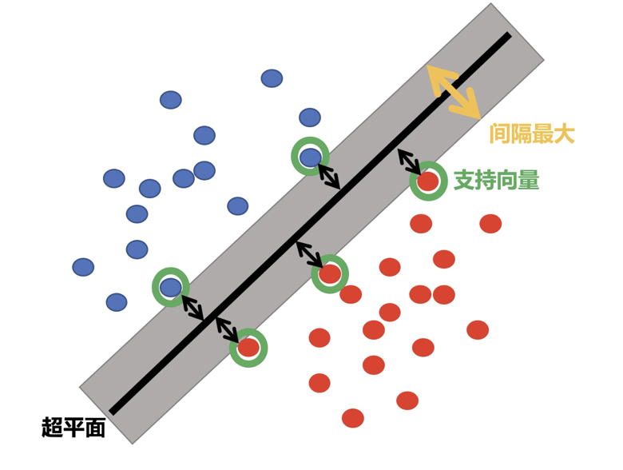
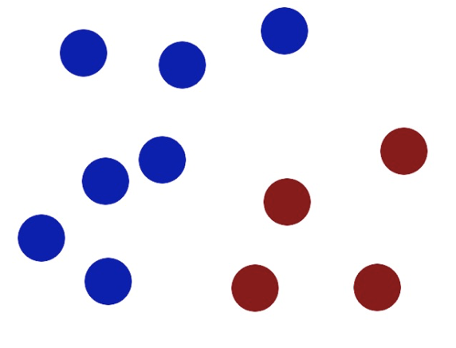
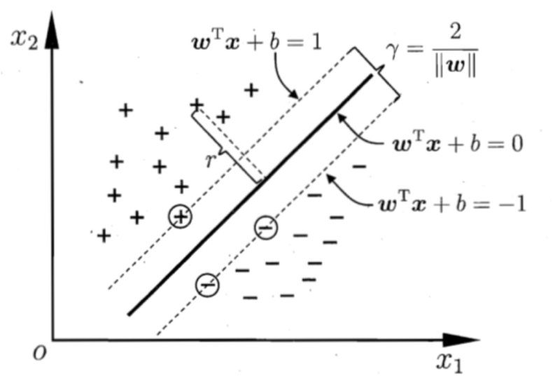
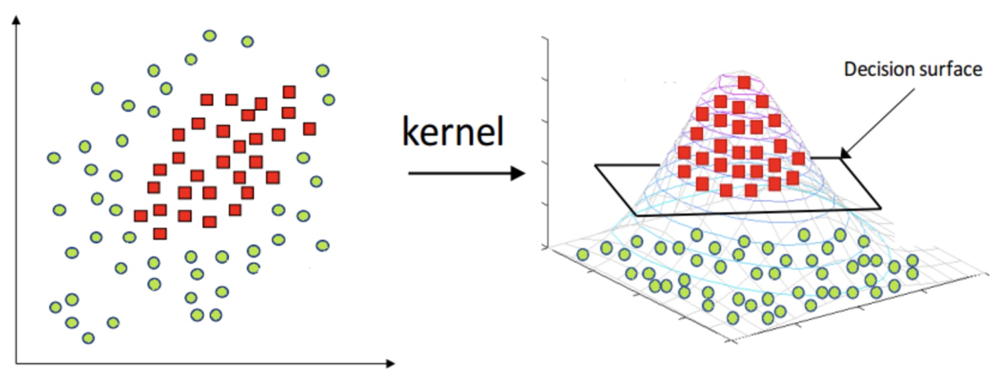
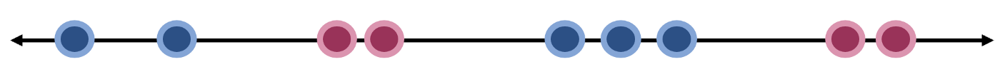

## 1. 核心概念

### 1.1 SVM定义与思想

**支持向量机（Support Vector Machine, SVM）** 是一种监督学习算法，其核心思想是：在特征空间中寻找到一个超平面，使不同类别的样本被最大化分隔。



**关键特性**：

- 适用于线性/非线性分类、回归及异常值检测
- **特别适用于中小型复杂数据集的分类任务**

### 1.2 从几何视角理解SVM

通过一个生动的故事来理解SVM工作原理：

在很久以前的情人节，大侠要去救他的爱人，但魔鬼和他玩了一个游戏。魔鬼在桌子上似乎有规律放了两种颜色的球，说：***你用一根棍分开它们？要求：尽量在放更多球之后，仍然适用。***



于是大侠这样放，干的不错！


然后魔鬼，又在桌上放了更多的球，似乎有一个球站错了阵营。


怎么办？？

把分解的小棍儿变粗。

> **SVM就是试图把棍放在最佳位置，好让在棍的两边有尽可能大的间隙。**


现在即使魔鬼放了更多的球，棍仍然是一个好的分界线。


然后，在SVM 工具箱中有另一个更加重要的技巧（ **trick**）。 魔鬼看到大侠已经学会了一个trick，于是魔鬼给了大侠一个新的挑战。


现在，大侠没有棍可以很好帮他分开两种球了，现在怎么办呢？

当然像所有武侠片中一样大侠桌子一拍，球飞到空中。然后，凭借大侠的轻功，大侠抓起一张纸，插到了两种球的中间。


现在，从魔鬼的角度看这些球，这些球看起来像是被一条曲线分开了。


再之后，无聊的大人们，把上面的物体起了别名：

| 故事元素 | 实际含义               | 技术解释                   |
| :------- | :--------------------- | :------------------------- |
| 球       | 数据（data）           | 训练样本在特征空间中的表示 |
| 棍子     | 分类器（classifier）   | 决策边界（超平面）         |
| 最大间隙 | 最优化（optimization） | 最大化分类间隔             |
| 拍桌子   | 核方法（kernelling）   | 通过非线性映射转换数据     |
| 纸       | 超平面（hyperplane）   | 高维空间中的决策面         |

### 1.3 核心术语详解

#### 超平面最大间隔

- **目标**：找到使最近训练样本距离最远的决策边界
- **优势**：泛化能力强，对新样本预测更稳定
- **对比**：普通线性分类器的决策边界可能过于接近样本，导致过拟合

> 
>
> 上左图显示了三种可能的线性分类器的决策边界：
>
> 虚线所代表的模型表现非常糟糕，甚至都无法正确实现分类。其余两个模型在这个训练集上表现堪称完美，但是**它们的决策边界与实例过于接近，导致在面对新实例时，表现可能不会太好**。
>
> **右图中的实线代表SVM分类器的决策边界**，不仅分离了两个类别，且**尽可能远离最近的训练实例**。

#### 支持向量

距离超平面最近的那些样本点，它们决定了最优超平面的位置。


## 2. 间隔类型与惩罚机制

### 2.1 硬间隔（Hard Margin）

**定义**：要求所有样本都被正确分类，且不允许任何样本落在间隔区域内。

**适用条件**：数据集必须**严格线性可分**

**局限性**：

- 对异常值极其敏感
- 实际应用中极少遇到完美线性可分的数据


> 当有一个额外异常值的鸢尾花数据，左图的数据根本找不出硬间隔，而右图最终显示的决策边界与我们之前所看到的无异常值时的决策边界也大不相同，可能无法很好地泛化。
>


### 2.2 软间隔（Soft Margin）与惩罚系数C

**定义**：允许部分样本违反间隔约束，在最大化间隔和分类错误之间寻找平衡。

**关键参数**：惩罚系数 **C**


| C值大小   | 间隔宽度 | 间隔违例数 | 模型特性       | 适用场景             |
| :-------- | :------- | :--------- | :------------- | :------------------- |
| **C值大** | 较窄     | 较少       | 高偏差，低方差 | 数据干净，异常值少   |
| **C值小** | 较宽     | 较多       | 低偏差，高方差 | 含噪声数据，需强泛化 |

**可视化理解**：C值越小，决策边界越"宽松"，对错误分类的惩罚越轻。


## 3. SVM算法原理

### 3.1 目标函数推导



**优化目标**：找到参数 $(w, b)$ 使分类间隔 $\gamma$ 最大化

**点到超平面距离公式**：
$$
r = \frac{|w^T x + b|}{||w||}
$$

**约束条件**（确保正确分类）：
$$
\begin{cases}
w^T x_i + b \geq +1, & y_i = +1 \\
w^T x_i + b \leq -1, & y_i = -1
\end{cases}
$$

**最终优化问题**（转换为更易求解的形式）：
$$
\min_{w,b} \frac{1}{2} ||w||^2 \\
s.t. \quad y_i(w^T x_i + b) \geq 1, \quad i = 1,2,...,m
$$

> **💡 提示**：$\frac{1}{2}$ 的引入是为了求导时消除系数，简化计算。

### 3.2 拉格朗日对偶转换

**原问题**：带约束的优化问题
$$
\min_{w,b} \max_{\alpha} L(w,b,\alpha)
$$

**对偶问题**：通过拉格朗日乘子法转换为无约束问题
$$
\max_{\alpha} \min_{w,b} L(w,b,\alpha)
$$

**求解步骤**：

1. **对w求偏导**：得到 $w = \sum_{i=1}^n \alpha_i y_i \Phi(x_i)$
2. **对b求偏导**：得到 $\sum_{i=1}^n \alpha_i y_i = 0$
3. **回代消元**：得到仅含 $\alpha$ 的优化问题

**对偶问题最终形式**：
$$
\min_{\alpha} \frac{1}{2} \sum_{i=1}^n \sum_{j=1}^n \alpha_i \alpha_j y_i y_j K(x_i,x_j) - \sum_{i=1}^n \alpha_i \\
s.t. \quad \sum_{i=1}^n \alpha_i y_i = 0, \quad \alpha_i \geq 0
$$

### 3.3 超平面参数求解

**支持向量**：$\alpha_i > 0$ 对应的样本点

**参数计算公式**：

- 权重向量：$w^* = \sum_{i=1}^N \alpha_i^* y_i \Phi(x_i)$
- 偏置项：$b^* = y_k - \sum_{i=1}^N \alpha_i^* y_i K(x_i, x_k)$ （对任意支持向量 $x_k$）

⚠️ **注意**：实际实现中通常对所有支持向量计算 $b^*$ 后取平均值，以提高数值稳定性。

> **SVM思想**：要去求一组参数（$w,b$）,使其构建的超平面函数能够最优地分离两个集合。样本空间中任意点$x$到超平面（$w,b$）的距离可写成：
> $$
> r = \frac{|w^T x + b|}{||w||}
> $$
>
> > **推导过程：**
>
> > **1. 超平面的定义**
> >
> > 超平面由参数 $(w, b)$ 定义，其方程为：
> > $$
> > w^T x + b = 0
> > $$
> > 其中：
> >
> > - $w$ 是法向量（决定超平面的方向），
> > - $b$ 是偏置项（决定超平面的位置）。
> >
> > 
> >
> > **2. 点到平面的距离公式（几何推导）**
> >
> > 设：
> >
> > - 点 $x_0$ 是空间中的一个任意点，
> > - 点 $x_p$ 是超平面上离 $x_0$ 最近的点（即 $x_0$ 在超平面上的投影）。
> >
> > 由于 $x_p$ 在超平面上，满足：
> > $$
> > w^T x_p + b = 0
> > $$
> >
> > 向量 $x_0 - x_p$ 与法向量 $w$ 平行（因为 $x_p$ 是投影点），所以：
> > $$
> > x_0 - x_p = k \cdot \frac{w}{\|w\|}
> > $$
> > 其中：
> >
> > - $k$ 是一个标量，
> > - $\frac{w}{\|w\|}$ 是 $w$ 的单位方向向量。
> >
> > 距离 $d$ 就是 $\|x_0 - x_p\|$，即：
> > $$
> > d = |k|
> > $$
> >
> > 
> >
> > **3. 计算 $k$**
> >
> > 将 $x_0 - x_p = k \cdot \frac{w}{\|w\|}$ 代入超平面方程：
> > $$
> > w^T \left(x_0 - k \cdot \frac{w}{\|w\|}\right) + b = 0
> > $$
> > 展开：
> > $$
> > w^T x_0 - k \cdot \frac{w^T w}{\|w\|} + b = 0
> > $$
> > 由于 $w^T w = \|w\|^2$，所以：
> > $$
> > w^T x_0 + b - k \cdot \|w\| = 0
> > $$
> > 解得：
> > $$
> > k = \frac{w^T x_0 + b}{\|w\|}
> > $$
> >
> > 因此，距离为：
> > $$
> > d = |k| = \frac{|w^T x_0 + b|}{\|w\|}
> > $$
> >
> > 
> >
> > **4. 结论**
> >
> > 任意点 $x$ 到超平面 $w^T x + b = 0$ 的距离为：
> > $$
> > \boxed{r = \frac{|w^T x + b|}{\|w\|}}
> > $$
>
> 
>
> 欲找到具有最大间隔的划分超平面，也就是要找到能满足下式中约束的参数$w$和$b$，使得间隔$y$最大。
>
> $$
> \begin{cases}
> w^T x_i + b \geq +1, & y_i = +1; \\
> w^T x_i + b \leq -1, & y_i = -1.
> \end{cases}
> $$
>
> 距离超平面最近的几个训练样本点使上式等号成立，他们被称为“支持向量”，两个异类支持向量到超平面的距离之和为：
> $$
> \gamma = \frac{2}{||w||}
> $$
>
> 
>
> SVM 我们要求解的目标是：在能够将所有样本能够正确分割开的基础上，求解最大间隔。
>
> 1. 最大间隔距离表示：
>
> $$
> \gamma = \frac{2}{\|w\|}
> $$
>
> 2. 训练样本能够正确分类：
>
> $$
> \begin{cases}
> w^T x_i + b \geq +1, & y_i = +1 \\
> w^T x_i + b \leq -1, & y_i = -1
> \end{cases}
> $$
>
> 我们希望在将所有样本正确分类的情况，实现间隔最大化。所以，我们的目标函数可以写为：
> $$
> \max_{w,b} \frac{2}{\|w\|}
> $$
>
> $$
> s.t.\quad y_i \left( w^T x_i + b \right) \geq 1, i = 1, 2, \cdots, m
> $$
>
> **我们可以将其转换为最小化问题**：
> $$
> \min_{w,b} \frac{1}{2} \|w\|^2
> $$
>
> $$
> s.t. \quad y_i \left( w^T x_i + b \right) \geq 1, i = 1, 2, \cdots, m
> $$
>
> > - $\|w\|$ 范数为：$\sqrt{w_1^2 + w_2^2 + \ldots + w_n^2}$，加上平方之后将根号去掉，不影响优化目标。
> > - $\frac{1}{2}$ 是为了求导的时候，能够将系数去掉。
>
> 
>
> - **约束条件优化问题转换**
>
> 添加核函数，将目标函数转换为以下形式
> $$
> \min_{w,b} \frac{1}{2} \| w \|^2
> $$
>
> $$
> s.t.\quad \sum_{i=1}^n (1 - y_i(w^T \cdot \Phi(x_i) + b)) \leq 0
> $$
>
> 目标函数是一个带有约束条件的优化问题，不太容易直接求解，所以先使用拉格朗日乘子法将其转换为多元极值问题，其转换过程如下:
> $$
> R(x) = f(x) + a g(x)
> $$
> $f(x)$ 是我们的原问题，$g(x)$ 为原问题的约束条件。构建拉格朗日函数：其中 $a_i$ 为拉格朗日乘子（相当于 $\lambda_i$）
>
> 拉格朗日乘子法构建的拉格朗日函数将目标优化函数和优化约束条件放在了一起，从而将带约束的极值问题转换为不带约束极值问题。
>
> 我们的问题可以转化为
> $$
> L(w, b, \alpha) = \frac{1}{2} \| w \|^2 - \sum_{i=1}^n \alpha_i \left( y_i \left( w^T \cdot \Phi(x_i) + b \right) - 1 \right)
> $$
> 要想求得极小值，上式后半部分应该取的极大值，最后转换成对偶问题
> $$
> \min_{w,b} \max_{\alpha} L(w, b, \alpha) \iff \max_{\alpha} \min_{w,b} L(w, b, \alpha)
> $$
>
>
> -  **对偶问题转换**
>
> 对 $w$ 求偏导，并令其等于 0：
> $$
> \frac{\partial L}{\partial w} = w - \sum_{i=1}^{n} \alpha_i y_i \varphi (x_i) = 0
> $$
> 得出：
> $$
> w = \sum_{i=1}^{n} \alpha_i y_i \varphi (x_i)
> $$
> 对 $b$ 求偏导：
> $$
> \frac{\partial L}{\partial b} = -\sum_{i=1}^{n} \alpha_i y_i = 0
> $$
> 即：
> $$
> \sum_{i=1}^{n} \alpha_i y_i = 0
> $$
> 将对 $w$、$b$ 求偏导的结果带入到原拉格朗日公式中：
>
> $$
> \begin{aligned}
> L(w, b, \alpha) &= \frac{1}{2} ||w||^2 - \sum_{i=1}^{n} a_i (y_i (w^T \varphi(x_i) + b) - 1) \\
> &= \frac{1}{2} w^T w - \sum_{i=1}^{n} a_i y_i w^T \varphi(x_i) - b \sum_{i=1}^{n} a_i y_i + \sum_{i=1}^{n} a_i \\
> &= \frac{1}{2} w^T w - \sum_{i=1}^{n} a_i y_i w^T \varphi(x_i) + \sum_{i=1}^{n} a_i \\
> &= \frac{1}{2} w^T \sum_{i=1}^{n} a_i y_i \varphi(x_i) - w^T \sum_{i=1}^{n} a_i y_i \varphi(x_i) + \sum_{i=1}^{n} a_i \\
> &= \sum_{i=1}^{n} a_i - \frac{1}{2} \left( \sum_{i=1}^{n} a_i y_i \varphi(x_i) \right)^T \cdot \sum_{i=1}^{n} a_i y_i \varphi(x_i) \\
> &= \sum_{i=1}^{n} a_i -\frac{1}{2}  \sum_{i=1}^{n} \sum_{j=1}^{n} a_i a_j y_i y_j \varphi^T(x_i) \varphi(x_j)
> \end{aligned}
> $$
>
> 此时，求解当 $\alpha$ 是什么值时，该值会变得很大，当求出 $\alpha$ 值，再求解 $w, b$ 值。此时，就变成了极大极小值问题。
>
> 
>
> - **确定超平面**
>
> 求解当 $\alpha$ 什么值时公式值最大
> $$
> a^* = \arg \max_{\alpha} \left( \sum_{i=1}^n \alpha_i - \frac{1}{2} \sum_{i=1}^{n} \sum_{j=1}^{n} \alpha_i \alpha_j y_i y_j \Phi^T (x_i) \Phi (x_j) \right)
> $$
> 将上面的问题转换为极小值问题：
> $$
> \min_{\alpha} \frac{1}{2} \sum_{i=1}^n \sum_{j=1}^n \alpha_i \alpha_j y_i y_j (\Phi (x_i) \cdot \Phi (x_j)) - \sum_{i=1}^n \alpha_i
> $$
>
> $$
> s.t.\quad \sum_{i=1}^n \alpha_i y_i = 0
> $$
>
> $$
> \alpha_i \geq 0, \quad i = 1, 2, \ldots, n
> $$
>
> 将训练样本带入上面公式，求解出 $\alpha$ 值。然后，将 $\alpha$ 值代入下面公式计算 $w, b$ 的值：
> $$
> w^* = \sum_{i=1}^N \alpha_i^* y_i \Phi (x_i)
> $$
>
> $$
> b^* = y_j - \sum_{i=1}^N \alpha_i^* y_i (\Phi (x_i) \cdot \Phi (x_j))
> $$
>
> 最后求得分离超平面：
> $$
> w^* \Phi (x) + b^* = 0
> $$
>
>
> > **支持向量机(SVM)中偏置项 $b^*$ 的计算公式推导**
> >
> > - **根据支持向量的定义**  
> >
> >   对于任意支持向量 $x_k$（满足 $\alpha_k > 0$），其函数间隔为 1：
> >   $$
> >   y_k \left( w^* \cdot \Phi(x_k) + b^* \right) = 1
> >   $$
> >   其中 $w^* = \sum_{i=1}^N \alpha_i^* y_i \Phi(x_i)$。
> >
> > - **代入 $w^*$ 的表达式**  
> >   $$
> >   y_k \left( \sum_{i=1}^N \alpha_i^* y_i \Phi(x_i) \cdot \Phi(x_k) + b^* \right) = 1
> >   $$
> >   两边乘以 $y_k$ 得：
> >   $$
> >   \sum_{i=1}^N \alpha_i^* y_i \Phi(x_i) \cdot \Phi(x_k) + b^* = y_k
> >   $$
> >
> > - **解出 $b^*$**  
> >   $$
> >   b^* = y_k - \sum_{i=1}^N \alpha_i^* y_i \Phi(x_i) \cdot \Phi(x_k)
> >   $$
> >   通常对所有支持向量取平均：
> >   $$
> >   b^* = \frac{1}{|S|} \sum_{k \in S} \left( y_k - \sum_{i=1}^N \alpha_i^* y_i \Phi(x_i) \cdot \Phi(x_k) \right)
> >   $$
> >   其中 $S$ 是支持向量的集合。
> >
> > 关键点
> >
> > - **核函数简化**：内积 $\Phi(x_i) \cdot \Phi(x_j)$ 可替换为核函数 $K(x_i, x_j)$
> > - **支持向量的作用**：仅依赖支持向量（$\alpha_k > 0$ 的样本）计算 $b^*$
> >
> > 最终公式
> > $$
> > b^* = y_k - \sum_{i=1}^N \alpha_i^* y_i K(x_i, x_k)
> > $$
> > （实际实现时对所有支持向量取平均）
>


## 4. 核函数（Kernel Function）

### 4.1 核函数的作用

**核心思想**：通过非线性映射将原始输入空间转换到高维特征空间，使原本线性不可分的样本在新空间中线性可分。

**优势**：无需显式计算映射后的坐标，而是通过核函数直接计算内积，大幅降低计算复杂度。



### 4.2 常用核函数对比

| 核函数类型      | 数学表达式                         | 特点               | 适用场景               |
| :-------------- | :--------------------------------- | :----------------- | :--------------------- |
| **线性核**      | $K(x,z) = x^T z$                   | 速度快，无维度提升 | 线性可分或大数据集     |
| **多项式核**    | $K(x,z) = (\gamma x^T z + r)^d$    | 通过多项式特征升维 | 已知多项式关系的数据   |
| **高斯核(RBF)** | $K(x,z) = \exp(-\gamma ||x-z||^2)$ | 映射到无限维空间   | 非线性复杂关系，最常用 |

### 4.3 高斯核函数深度解析

**数学定义**：
$$
K(x,z) = \exp(-\gamma ||x-z||^2)
$$

**参数γ的影响**：

- **γ越大**：高斯分布越"窄"，模型越复杂，过拟合风险高
- **γ越小**：高斯分布越"宽"，模型越简单，欠拟合风险高

**可视化理解**：从1维到2维的升维映射可使原本缠绕的数据变得线性可分。



**任务**：找到一种方法，用一条线将数据完美分类。如果只从1维的角度考虑，这是一项不可能完成的任务，但可以用升维度的办法来解决问题。

让我们引入一个函数 `f(x)`，图像如下图所示。 将 x 的每个值映射到其对应的输出。使得所有蓝点在Y轴的输出更大，而红点在Y轴的输出偏小。此时，我们可以使用一条水平线将数据完美分类。


## 5. 实践：SVM分类案例

### 5.1 鸢尾花二分类任务

#### 步骤1：数据准备与可视化

```python
import numpy as np
import matplotlib.pyplot as plt
from sklearn import datasets

# 加载鸢尾花数据集
X, y = datasets.load_iris(return_X_y=True)

# 数据筛选：仅取前两个类别和前两个特征（二分类问题）
X = X[y < 2, :2]  # 特征筛选：保留前两个特征
y = y[y < 2]      # 类别筛选：保留类别0和1

# 数据可视化：绘制两类样本的散点图
plt.scatter(X[y==0, 0], X[y==0, 1], color='red', label='类别0')   # 类别0样本
plt.scatter(X[y==1, 0], X[y==1, 1], color='blue', label='类别1') # 类别1样本
plt.xlabel('花萼长度')  # X轴标签
plt.ylabel('花萼宽度')  # Y轴标签
plt.legend()            # 显示图例
plt.title('原始数据分布') # 图表标题
plt.show()
```


#### 步骤2：数据标准化

```python
from sklearn.preprocessing import StandardScaler

# 创建标准化器
std_scaler = StandardScaler()

# 拟合并转换数据：计算均值方差并应用标准化
X_standard = std_scaler.fit_transform(X)

# 💡 提示：SVM对特征尺度敏感，标准化是必要步骤
```

#### 步骤3：训练不同C值的线性SVM模型

```python
from sklearn.svm import LinearSVC

# 创建高C值模型（硬间隔倾向）
svc_hard = LinearSVC(C=30)  # C=30：较强惩罚，间隔较窄
svc_hard.fit(X_standard, y)

# 创建低C值模型（软间隔倾向）
svc_soft = LinearSVC(C=0.1) # C=0.1：较弱惩罚，间隔较宽
svc_soft.fit(X_standard, y)

# 输出模型准确率
print(f"高C值模型准确率: {svc_hard.score(X_standard, y):.4f}")
print(f"低C值模型准确率: {svc_soft.score(X_standard, y):.4f}")
```

#### 步骤4：决策边界可视化函数

```python
def plot_decision_boundary(model, axis):
    """
    绘制分类模型的决策边界
    
    参数:
        model: 训练好的分类器
        axis: [xmin, xmax, ymin, ymax] 绘图范围
    """
    # 创建网格点：将坐标平面划分为细密的网格
    x0, x1 = np.meshgrid(
        np.linspace(axis[0], axis[1], int((axis[1]-axis[0])*100)).reshape(-1, 1),
        np.linspace(axis[2], axis[3], int((axis[3]-axis[2])*100)).reshape(-1, 1)
    )
    
    # 将网格点组合成特征矩阵
    X_new = np.c_[x0.ravel(), x1.ravel()]
    
    # 预测所有网格点的类别
    y_predict = model.predict(X_new)
    zz = y_predict.reshape(x0.shape)
    
    # 设置自定义颜色映射
    from matplotlib.colors import ListedColormap
    custom_map = ListedColormap(["#EF9A9A", "#FFF59D", "#90CAF9"])
    
    # 绘制决策边界（填充等高线图）
    plt.contourf(x0, x1, zz, linewidth=5, cmap=custom_map)

def plot_decision_boundary_with_margin(model, axis):
    """
    绘制决策边界及间隔区域（仅适用于线性SVM）
    
    参数:
        model: 训练好的LinearSVC模型
        axis: [xmin, xmax, ymin, ymax] 绘图范围
    """
    # 绘制决策边界
    plot_decision_boundary(model, axis)
    
    # 提取模型参数
    w = model.coef_[0]      # 权重向量 [w0, w1]
    b = model.intercept_[0] # 偏置项
    
    # 超平面方程: w0*x0 + w1*x1 + b = 0
    # => x1 = -w0/w1 * x0 - b/w1
    
    # 生成x轴坐标点
    plot_x = np.linspace(axis[0], axis[1], 200)
    
    # 计算间隔边界（支持向量所在平面）
    # 间隔为 1/||w||，所以上下边界为 ±1/||w||
    up_y = -w[0]/w[1] * plot_x - b/w[1] + 1/w[1]    # 上边界
    down_y = -w[0]/w[1] * plot_x - b/w[1] - 1/w[1]  # 下边界
    
    # 筛选在绘图范围内的点
    up_index = (up_y >= axis[2]) & (up_y <= axis[3])
    down_index = (down_y >= axis[2]) & (down_y <= axis[3])
    
    # 绘制间隔边界线
    plt.plot(plot_x[up_index], up_y[up_index], color="black", linestyle='--', label='间隔边界')
    plt.plot(plot_x[down_index], down_y[down_index], color="black", linestyle='--')
```

#### 步骤5：对比不同C值效果

```python
# 创建画布
fig, axes = plt.subplots(1, 2, figsize=(14, 6))

# 绘制高C值效果
plt.sca(axes[0])
plot_decision_boundary_with_margin(svc_hard, axis=[-3, 3, -3, 3])
plt.scatter(X_standard[y==0, 0], X_standard[y==0, 1], color='red', label='类别0')
plt.scatter(X_standard[y==1, 0], X_standard[y==1, 1], color='blue', label='类别1')
plt.title('C=30 (硬间隔倾向)')
plt.legend()
plt.grid(True, alpha=0.3)

# 绘制低C值效果
plt.sca(axes[1])
plot_decision_boundary_with_margin(svc_soft, axis=[-3, 3, -3, 3])
plt.scatter(X_standard[y==0, 0], X_standard[y==0, 1], color='red', label='类别0')
plt.scatter(X_standard[y==1, 0], X_standard[y==1, 1], color='blue', label='类别1')
plt.title('C=0.1 (软间隔倾向)')
plt.legend()
plt.grid(True, alpha=0.3)

plt.tight_layout()
plt.show()
```

**结论**：C值变小，间隔区间变大，从硬间隔逐渐变为软间隔，模型泛化能力增强。


### 5.2 非线性分类：高斯核SVM

#### 步骤1：生成月牙形非线性数据

```python
from sklearn import datasets

# 生成月牙形非线性可分数据
# noise: 添加噪声程度, random_state: 随机种子保证可复现
X, y = datasets.make_moons(noise=0.15, random_state=22)

# 可视化数据分布
plt.scatter(X[y==0, 0], X[y==0, 1], color='red', label='类别0')
plt.scatter(X[y==1, 0], X[y==1, 1], color='blue', label='类别1')
plt.xlabel('特征1')
plt.ylabel('特征2')
plt.title('非线性可分数据')
plt.legend()
plt.show()
```


#### 步骤2：创建高斯核SVM流水线

```python
from sklearn.preprocessing import StandardScaler
from sklearn.svm import SVC
from sklearn.pipeline import Pipeline

def RBFKernelSVC(gamma=1.0):
    """
    创建高斯核SVM模型流水线
    
    参数:
        gamma: 高斯核参数，控制核函数宽度
              - gamma越大，模型越复杂（过拟合风险）
              - gamma越小，模型越简单（欠拟合风险）
    
    返回:
        Pipeline对象，包含标准化和SVM分类器
    """
    return Pipeline([
        ('std_scaler', StandardScaler()),  # 数据标准化层
        ('svc', SVC(kernel='rbf', gamma=gamma))  # 高斯核SVM分类器
    ])
```

#### 步骤3：对比不同gamma值的效果

```python
# 定义待测试的gamma值列表
gamma_values = [0.1, 0.5, 10, 100]

# 创建画布
fig, axes = plt.subplots(2, 2, figsize=(12, 10))
axes = axes.ravel()  # 将二维数组展平为一维

# 遍历每个gamma值进行训练和可视化
for idx, gamma in enumerate(gamma_values):
    # 创建并训练模型
    svc = RBFKernelSVC(gamma=gamma)
    svc.fit(X, y)
    
    # 绘制决策边界
    plt.sca(axes[idx])
    plot_decision_boundary(svc, axis=[-1.5, 2.5, -1.0, 1.5])
    plt.scatter(X[y==0, 0], X[y==0, 1], color='red', s=30)
    plt.scatter(X[y==1, 0], X[y==1, 1], color='blue', s=30)
    plt.title(f'gamma={gamma}')
    plt.grid(True, alpha=0.3)

plt.tight_layout()
plt.show()
```

#### 步骤4：gamma参数影响总结

| gamma值 | 决策边界形状 | 模型状态       | 风险类型 | 建议                  |
| :------ | :----------- | :------------- | :------- | :-------------------- |
| **0.1** | 接近线性     | 欠拟合         | 高偏差   | 增大gamma             |
| **0.5** | 平滑曲线     | **适中**       | **平衡** | **推荐起点**          |
| **10**  | 复杂曲线     | 轻微过拟合     | 方差增大 | 监控验证集            |
| **100** | 极度不规则   | **严重过拟合** | 高方差   | 减小gamma或增加正则化 |

⚠️ **重要结论**：gamma是控制模型复杂度的关键超参数，需要通过交叉验证调优。


