## 1、图像基础

### 1.1 图像是什么？

- **基本单元**：像素（pixel）
- **取值范围**：每个像素 0–255（`np.uint8`）
  - 0 → 纯黑
  - 255 → 纯白
- **彩色图像**：RGB 三通道
  - 形状张量：`[H, W, C]`
    - H：高（行数）
    - W：宽（列数）
    - C：通道数（RGB ⇒ 3）


### 1.2 用 Matplotlib 生成纯色图

| 颜色 | 像素值 | NumPy 代码                    |
| ---- | ------ | ----------------------------- |
| 全黑 | 0      | `np.zeros([200, 200, 3])`     |
| 全白 | 255    | `np.full([200, 200, 3], 255)` |

```py
import numpy as np
import matplotlib.pyplot as plt

# 全黑
# black = np.zeros([200,200,3],dtype=np.uint8)
black = np.zeros([200, 200, 3])
plt.imshow(black.astype('uint8'))
plt.show()

# 全白
white = np.full([200, 200, 3], 255)
plt.imshow(white.astype('uint8'))
plt.show()
```


### 1.3 加载真实图片并查看形状

```python
import matplotlib.pyplot as plt

img = plt.imread("data/img.jpg")     # 读
print("Shape (H, W, C):", img.shape) # (640, 640, 3)

plt.imshow(img)
plt.show()
```


**图像的加载方法总结**

| 维度                | `plt.imread()`                                               | `plt.imshow()`                              |
| ------------------- | ------------------------------------------------------------ | ------------------------------------------- |
| **作用**            | 把图片文件读入内存，得到 NumPy 数组                          | 把 NumPy 数组渲染成图像并显示               |
| **常用调用**        | `img = plt.imread('path/img.jpg')`                           | `plt.imshow(img)`                           |
| **输入类型**        | 字符串路径（jpg/png/…）                                      | NumPy 数组 (H, W) 或 (H, W, 3) 或 (H, W, 4) |
| **返回值 / 副作用** | 返回 `np.ndarray`，形状 `(H, W, C)`，dtype 通常为 `uint8` 或 `float32` | 无返回值，直接在 Figure 上画图像            |

> 一句话记忆：**`imread` 读进来，`imshow` 画出来。**


### 1.4 CNN卷积神经网络概述

> **卷积神经网络（CNN）＝ 含卷积层的神经网络**，专为**图像特征自动提取**而生。

#### 1. 三大核心组件

| 层级                     | 作用           | 关键词          | 典型操作    |
| ------------------------ | -------------- | --------------- | ----------- |
| **卷积层 (Convolution)** | 局部特征提取   | 卷积核          | `Conv2D`    |
| **池化层 (Pooling)**     | 降维、压缩参数 | 下采样 / 不变性 | `MaxPool2D` |
| **全连接层 (FC)**        | 输出最终结果   | 分类 / 回归     | `Dense`     |


#### 2. 典型堆叠范式

```text
[Conv → ReLU → Pool] × N   ← 特征提取
→ Flatten → [FC → ReLU] × M ← 结果输出
```


## 2、卷积层	

### 2.1 卷积层计算过程

#### 1. 卷积计算：基本概念

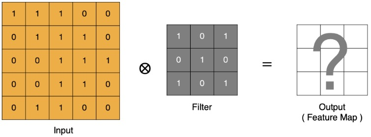

**输入（Input）**：表示待处理的原始图像。

**卷积核（Filter）**：又称滤波矩阵，是 3×3 或 5×5 等小尺寸权重矩阵。

**特征图（Feature Map / Output）**：输入图像经过卷积核后得到的结果，通常尺寸变小，称为特征图。

#### 2. 卷积运算的数学本质

卷积运算 = 卷积核与输入的局部区域做点积（逐元素相乘后求和）。

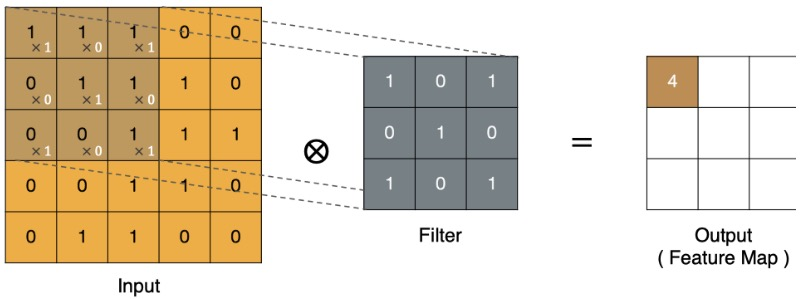

最终的特征图结果为：

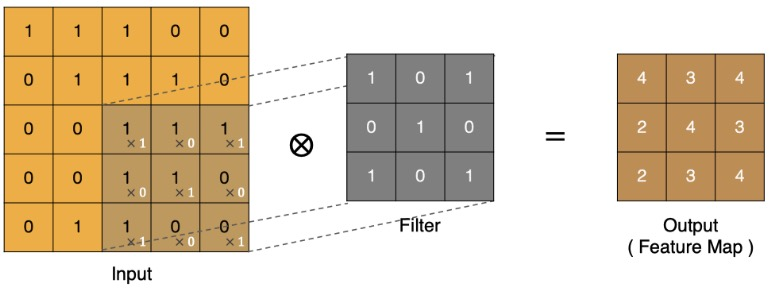

#### 3. Padding（填充）

**问题**：卷积后特征图尺寸缩小。

**解决**：在原图四周补 0（或其他值），即可保持输出尺寸不变。

**示例**：

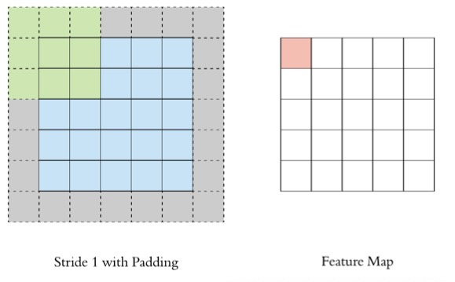

```tex
Stride=1, Padding=1 → 输入 5×5 → 输出 5×5
```

#### 4. Stride（步长）

**定义**：卷积核每次滑动的像素数。

- Stride = 1：逐像素滑动，输出尺寸较大。

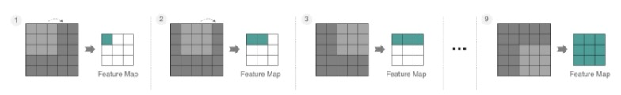

- Stride = 2：隔 1 像素滑动，输出尺寸减半，计算量降低。

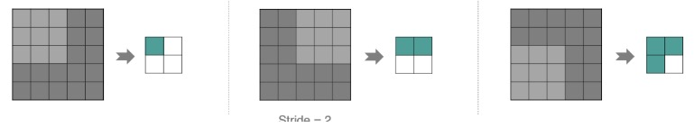

#### 5. 多通道卷积（RGB 等）

实际图像通常为 3 通道（RGB）。

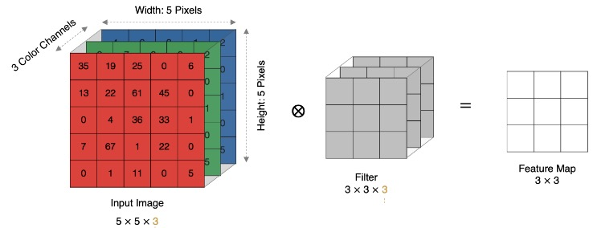

- 输入：5×5×3
- 卷积核：3×3×3（每个通道对应一组权重）
- 输出：3×3×1（单通道特征图）

**计算方式**：对 3 个通道分别做卷积，再把 3 个结果相加，加上偏置，最后通过激活函数。

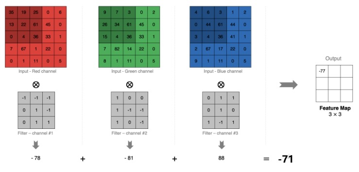

#### 6. 多卷积核（多特征图）

若希望提取多种特征，可使用 N 个不同的卷积核。

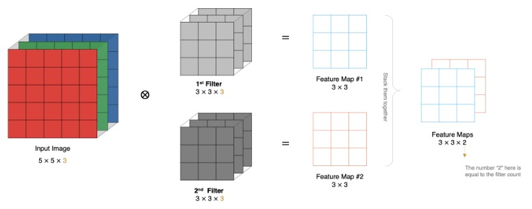

- 输入：5×5×3
- 第 1 个卷积核：3×3×3 → 输出 3×3×1（Feature Map #1）
- 第 2 个卷积核：3×3×3 → 输出 3×3×1（Feature Map #2）
- …
- 最终输出：3×3×N（N 等于卷积核个数）


### 2.2 特征图大小计算

#### 1. 特征图尺寸计算公式

| 符号  | 含义                                          |
| ----- | --------------------------------------------- |
| **W** | 输入图像边长（假设正方形）                    |
| **F** | 卷积核边长（通常取奇数 1*1、 3\*3、 5\*5  …） |
| **P** | Padding（四周补 0 的圈数）                    |
| **S** | Stride（步长）                                |
| **N** | 输出特征图边长                                |

**公式**
$$
N = \frac{W - F + 2P}{S} + 1
$$


#### 2. 计算示例

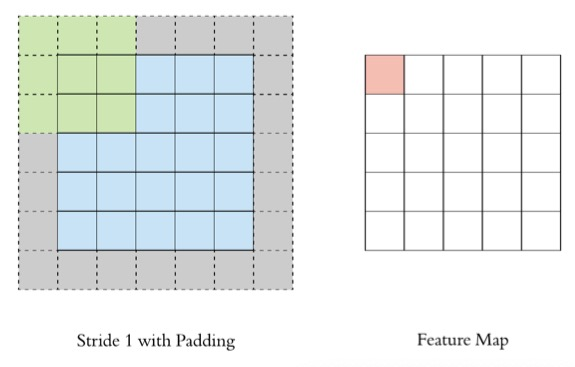

| 输入 | 卷积核 | Padding | Stride | 计算过程            | 结果    |
| ---- | ------ | ------- | ------ | ------------------- | ------- |
| 5×5  | 3×3    | 1       | 1      | (5-3+2×1)/1 + 1 = 5 | **5×5** |

#### 3. PyTorch 卷积层 API

##### 定义卷积层

```python
nn.Conv2d(
    in_channels,      # 输入通道数
    out_channels,     # 输出通道数 = 卷积核个数
    kernel_size,      # 卷积核尺寸，可为单个 int 或 (H, W)
    stride=1,         # 步长，默认 1
    padding=0         # 补零圈数，默认 0
)
```

##### 完整示例代码

```python
import torch
import torch.nn as nn
import matplotlib.pyplot as plt

def test():
    # 1. 读取图像 (H, W, C) → (640, 640, 3)
    img = plt.imread('data/img.jpg')
    plt.imshow(img);
    plt.show()

    # 2. 构造卷积层
    conv = nn.Conv2d(in_channels=3,
                     out_channels=3,
                     kernel_size=3,
                     stride=2,
                     padding=0)

    # 3. 调整维度 (H, W, C) → (B, C, H, W)
    img = torch.tensor(img).permute(2, 0, 1).unsqueeze(0).float()

    # 4. 前向计算
    feature_map = conv(img)

    # 5. 打印输出形状
    print(feature_map.shape)   # torch.Size([1, 3, 319, 319])

if __name__ == '__main__':
    test()
```


## 3、池化

### 3.1 池化层计算过程

| 作用     | 说明                                                     |
| -------- | -------------------------------------------------------- |
| **降维** | 缩减特征图尺寸，减少参数量与计算量                       |
| **分类** | 最大池化（`Max Pooling`）、平均池化（`Average Pooling`） |

#### 1. 最大池化 vs 平均池化

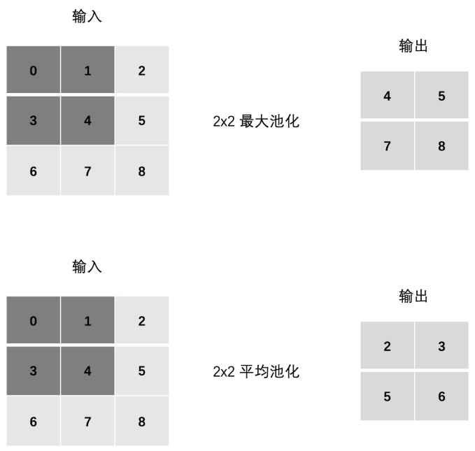


#### 2. Stride

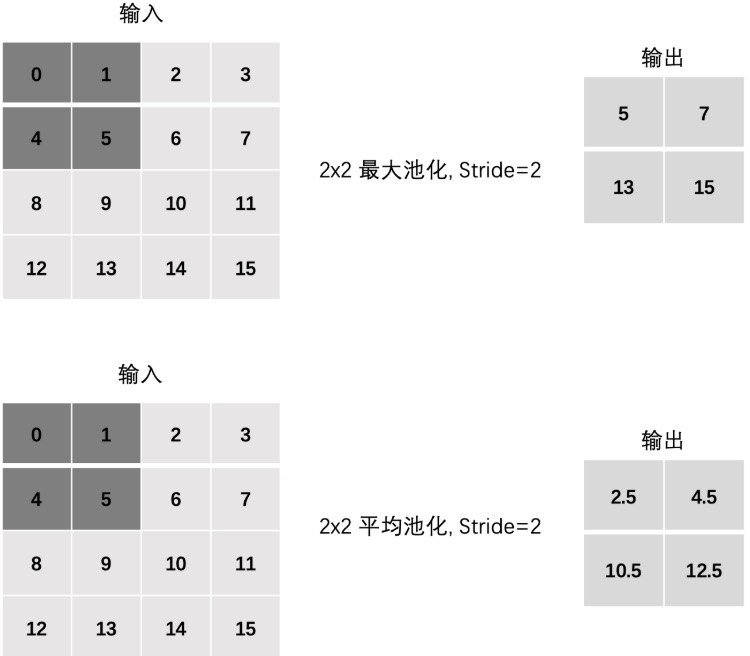

#### 3. Padding 

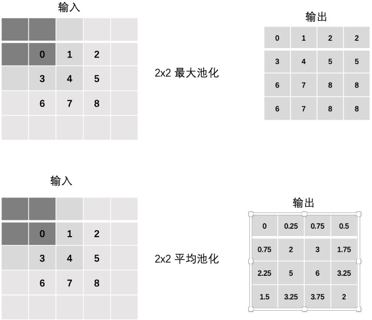

#### 4. 多通道池化

每个通道 **独立池化**，输出通道数保持不变。 

例：3 通道 3×3 → 3 通道 2×2（2×2 最大池化，Stride=1）。

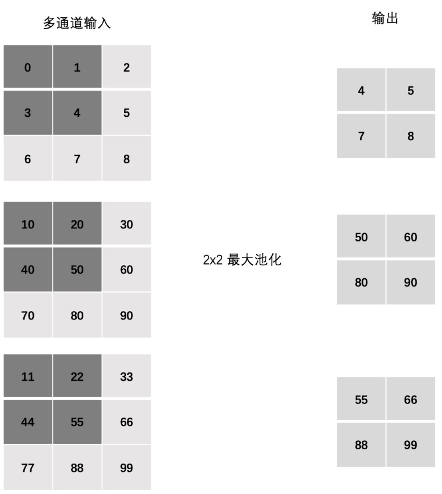

### 3.2 PyTorch 池化 API

| 类型     | 函数原型                                     | 常用参数                  |
| -------- | -------------------------------------------- | ------------------------- |
| 最大池化 | `nn.MaxPool2d(kernel_size, stride, padding)` | `kernel_size=2, stride=1` |
| 平均池化 | `nn.AvgPool2d(kernel_size, stride, padding)` | `kernel_size=2, stride=1` |

```python
# 单通道
import torch
import torch.nn as nn

# 单通道 3×3
x = torch.tensor([[[0., 1., 2.],
                   [3., 4., 5.],
                   [6., 7., 8.]]])

max_pool = nn.MaxPool2d(2, stride=1)
avg_pool = nn.AvgPool2d(2, stride=1)

print("MaxPool:\n", max_pool(x))
print("AvgPool:\n", avg_pool(x))

# 多通道（3 通道 3×3）
x = torch.tensor([[[ 0.,  1.,  2.],
                   [ 3.,  4.,  5.],
                   [ 6.,  7.,  8.]],
                  [[10., 20., 30.],
                   [40., 50., 60.],
                   [70., 80., 90.]],
                  [[11., 22., 33.],
                   [44., 55., 66.],
                   [77., 88., 99.]]])

pool = nn.MaxPool2d(2, stride=1)
print("多通道 MaxPool:\n", pool(x))
```


## 4、CIFAR10图像分类案例

### 4.1 CIFAR-10 数据集速览

| 项目     | 数值                                                         |
| -------- | ------------------------------------------------------------ |
| 训练集   | 50 000 张                                                    |
| 测试集   | 10 000 张                                                    |
| 类别     | 10 类（飞机、汽车、鸟、猫、鹿、狗、青蛙、马、船、卡车），每个类别有6k个图像 |
| 图像尺寸 | 32×32×3                                                      |

```python
# PyTorch 中的 torchvision.datasets 计算机视觉模块封装了 CIFAR10 数据集, 使用方法如下:
from torchvision.datasets import CIFAR10
from torchvision.transforms import Compose, ToTensor

def create_dataset():
    train_ds = CIFAR10(root='data', train=True,  transform=Compose([ToTensor()]))
    valid_ds = CIFAR10(root='data', train=False, transform=Compose([ToTensor()]))
    return train_ds, valid_ds
```


### 4.2 网络结构总览

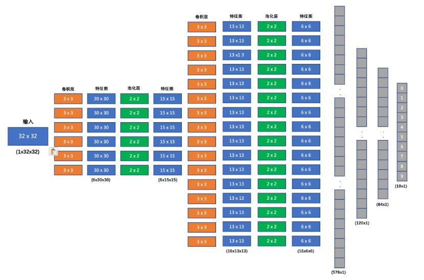

> 一个卷积核对应前面的所有层★

| 层次        | 输出尺寸     | 配置与说明            |
| ----------- | ------------ | --------------------- |
| **Input**   | (3, 32, 32)  | 原始 RGB 图像         |
| **Conv1**   | (6, 30, 30)  | 3×3 kernel, stride=1  |
| **ReLU**    | 同上         | 非线性激活            |
| **Pool1**   | (6, 15, 15)  | 2×2 MaxPool, stride=2 |
| **Conv2**   | (16, 13, 13) | 3×3 kernel, stride=1  |
| **ReLU**    | 同上         | 非线性激活            |
| **Pool2**   | (16, 6, 6)   | 2×2 MaxPool, stride=2 |
| **Flatten** | 576          | 16×6×6                |
| **FC1**     | 120          | 全连接 + ReLU         |
| **FC2**     | 84           | 全连接 + ReLU         |
| **Output**  | 10           | Softmax               |

```python
# 模型代码
import torch.nn as nn
import torch.nn.functional as F

class ImageClassification(nn.Module):
    def __init__(self):
        super().__init__()
        self.conv1 = nn.Conv2d(3, 6, kernel_size=3)
        self.pool  = nn.MaxPool2d(2, 2)
        self.conv2 = nn.Conv2d(6, 16, kernel_size=3)
        self.fc1   = nn.Linear(16 * 6 * 6, 120)
        self.fc2   = nn.Linear(120, 84)
        self.fc3   = nn.Linear(84, 10)

    def forward(self, x):
        x = self.pool(F.relu(self.conv1(x)))  # (B,6,15,15)
        x = self.pool(F.relu(self.conv2(x)))  # (B,16,6,6)
        x = x.view(x.size(0), -1)             # (B,576)
        x = F.relu(self.fc1(x))
        x = F.relu(self.fc2(x))
        return self.fc3(x)                    # (B,10)
```


### 4.3 训练函数

```python
import torch, time
from torch.utils.data import DataLoader
from torch import optim, nn

BATCH_SIZE = 64

def train(model, train_ds, epochs=100):
    criterion = nn.CrossEntropyLoss()
    optimizer = optim.Adam(model.parameters(), lr=1e-3)

    for epoch in range(1, epochs + 1):
        loader = DataLoader(train_ds, batch_size=BATCH_SIZE, shuffle=True)
        total_loss, batches = 0.0, 0

        t0 = time.time()
        for x, y in loader:
            pred = model(x)
            loss = criterion(pred, y)

            optimizer.zero_grad()
            loss.backward()
            optimizer.step()

            total_loss += loss.item()
            batches += 1

        print(f'epoch:{epoch:3d}  loss:{total_loss/batches:.5f}  '
              f'time:{time.time()-t0:.2f}s')

    torch.save(model.state_dict(), 'data/image_classification.pth')
```


### 4.4 预测函数

```py
def test(valid_ds):
    model = ImageClassification()
    model.load_state_dict(torch.load('data/image_classification.pth'))
    model.eval()  # 关闭dropput及BNN

    loader = DataLoader(valid_ds, batch_size=64, shuffle=False)
    correct = total = 0


    for x, y in loader:
        pred = model(x)
        correct += (torch.argmax(pred,dim=-1) == y).sum().item()
        # correct += (pred.argmax(1) == y).sum().item()
        #功能分解：
        # pred.argmax(1) - 获取每个样本预测概率最高的类别索引
        # == y - 将预测结果与真实标签进行比较，返回布尔值张量
        # .sum() - 统计正确预测的样本总数
        # .item() - 将单元素张量转换为Python数值
        # 最终将当前批次中预测正确的样本数累加到correct变量中
        total += y.size(0)

    acc = correct / total
    print(f'Accuracy: {acc:.2f}')
```


### 4.5 一键运行入口

```python
if __name__ == '__main__':
    train_ds, valid_ds = create_dataset()
    net = ImageClassification()
    train(net, train_ds, epochs=10)  # 快速演示
    test(valid_ds)
```


### 4.6 总结卡片

| 要点 | 一句话                           |
| ---- | -------------------------------- |
| 数据 | 32×32×3 彩色图，10 类            |
| 网络 | 2 层卷积 + 2 层池化 + 3 层全连接 |
| 训练 | CrossEntropy + Adam              |
| 精度 | 约 57 %（可继续调优）            |