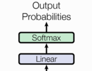
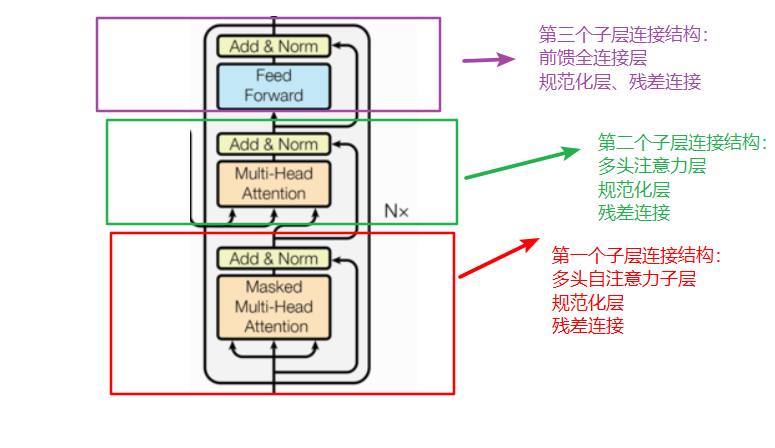
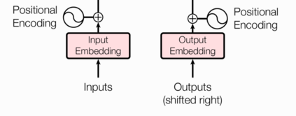
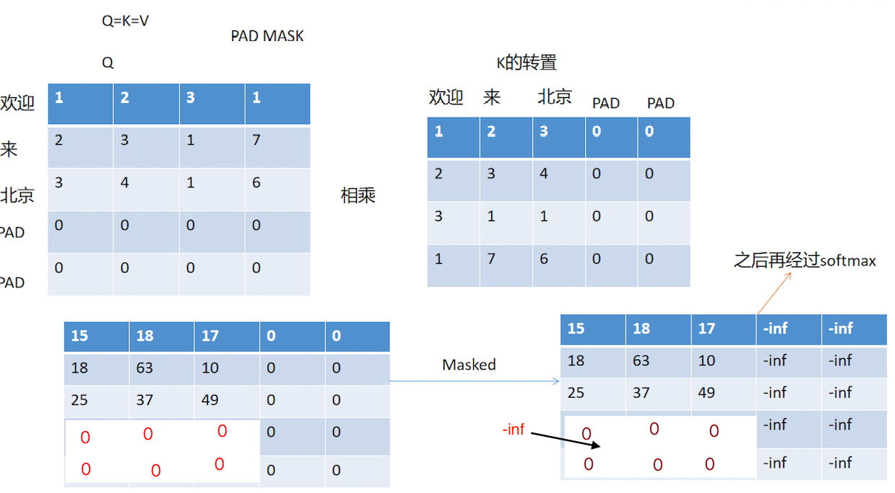
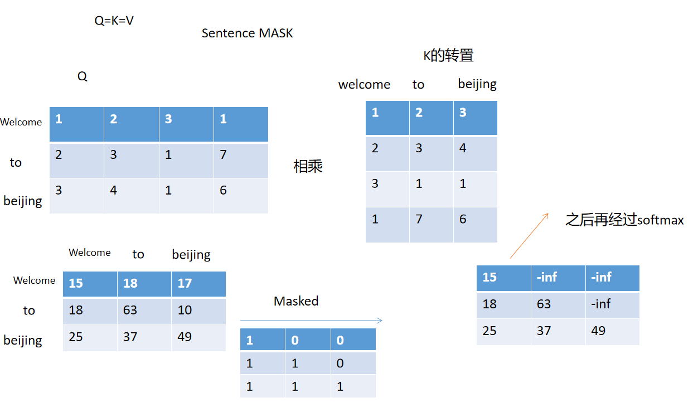

# Transformer模型

### 1 Transformer 的诞生

2017年提出，2018年google发表了BERT模型，使得Transformer架构流行起来，BERT在许多NLP任务上，取得了Soat的成就。


### 2. Transformer 的优势

相比当时主流的 **LSTM** 和 **GRU** 模型，Transformer 具备两个显著优势：

- **并行训练能力强**：能够利用分布式 GPU 进行并行训练，显著提升模型训练效率。
- **长距离依赖建模能力强**：在分析和预测更长文本时，能更有效地捕捉间隔较远的语义关联。


### 3 Transformer的模型架构

架构图展示：


#### 3.1 整体架构

主要组成部分

```properties
1、输入部分
2、编码器部分
3、解码器部分
4、输出部分
```

#### 3.2 输入部分


```properties
word Embeddding + Positional Encoding
词嵌入层+位置编码器层
```

#### 3.3 输出部分



```properties
1、Linear层
2、softmax层
```

#### 3.4 编码器部分

结构图：


组成部分：

```properties
1、N个编码器层堆叠而成（原论文中，N=6）
2、每个编码器有两个子层连接结构构成
3、第一个子层连接结构：多头自注意力层+规范化层+残差连接层
4、第二个子层连接结构：前馈全连接层+规范化层+残差连接层
```

#### 3.5 解码器部分

结构图：



组成部分：

```properties
1、N个解码器堆叠而成（原论文中，N=6）
2、每个解码器有三个子层连接结构构成
3、第一个子层连接结构：多头自注意力层+规范化层+残差连接层
4、第二个子层连接结构：多头注意力层+规范化层+残差连接层
5、第三个子层连接结构：前馈全连接层+规范化层+残差连接层
```


## 一、 输入部分



### 1.1 输入部分介绍

输入部分包含两个主要模块：

- **源文本嵌入层（Source Embedding）**
- **目标文本嵌入层（Target Embedding）**

两者都配有 **位置编码器（Positional Encoding）**，用于为词向量添加位置信息。


### 1.2 文本嵌入层的作用

- 将词汇的 **数字索引** 转换为 **高维向量表示**。
- 在高维空间中捕捉词汇之间的语义关系。
- 提升模型对词语语义的理解能力。


### 1.3 文本嵌入层代码实现

```python
class Embeddings(nn.Module):
    def __init__(self, d_model, vocab):
        """
        初始化词嵌入层
        :param d_model: 词嵌入维度（如512）
        :param vocab: 词汇表大小
        """
        super().__init__()
        self.d_model = d_model
        self.vocab = vocab
        # 定义嵌入层：将词汇索引映射为d_model维向量
        self.lut = nn.Embedding(vocab, d_model)

    def forward(self, x):
        """
        前向传播
        :param x: 输入的词汇索引张量，形状为 [batch_size, seq_len]
        :return: 嵌入后的张量，形状为 [batch_size, seq_len, d_model]
        """
        # 乘以 sqrt(d_model) 是为了缩放嵌入值，便于后续与位置编码相加
        return self.lut(x) * math.sqrt(self.d_model)    
```

> 💡 **复习笔记：Transformer 中 Embedding 缩放之谜**
>
> ##### 1. 核心公式
>
> 在 Transformer 的输入层，最终输入向量 $X_{final}$ 的计算方式为：
>$$
> X_{final} = \text{Embedding}(x) \times \sqrt{d_{model}} + \text{Positional Encoding}
>$$
> 
>##### 2. 为什么要乘以 $\sqrt{d_{model}}$ ？
> 
>##### 🎯 核心目的：调整“信噪比”，平衡语义与位置
> 
> 通过放大词嵌入的量级，确保模型以**词义**为主体，以**位置**为辅助。
> 
> | **维度**      | **词嵌入 (Embedding)**         | **位置编码 (PE)**              |
>| ------------- | ------------------------------ | ------------------------------ |
> | **性质**      | 随机初始化（训练初期像“噪音”） | 确定性的正余弦函数（信号清晰） |
>| **值域/方差** | 均值为 0，方差为 1             | 值域固定在 $[-1, 1]$           |
> | **代表意义**  | 核心语义信息（主信号）         | 顺序、位置信息（修正信号）     |
>
> 
> 
> ##### 3. 深度解析：为什么不乘会导致“位置编码过强”？
>
> 虽然位置编码的值域 $[-1, 1]$ 看起来不大，但如果不缩放，会产生以下三个问题：
>
> ##### A. 信号掩盖（Masking Effect）
>
> 在训练初期，Embedding 是随机生成的。如果直接与 $[-1, 1]$ 的 PE 相加，位置信号的**确定性规律**会掩盖掉随机初始化的**语义特征**。模型会倾向于优先学习容易捕捉的位置规律，而忽略了复杂的词义联系。
> 
> ##### B. 权重比例失衡
>
> - **不缩放时**：Embedding 和 PE 的量级几乎是 1:1。
>- **缩放后**（以 $d_{model}=512$ 为例）：$\sqrt{512} \approx 22.6$。此时 Embedding 的量级被放大到 PE 的 **20多倍**。
> - **直观理解**：这就像在画图时，Embedding 是**底色和构图**，PE 是**坐标细线**。如果不加深底色的对比度，坐标线就会反客为主，干扰画面。
> 
> ##### C. 梯度与收敛稳定性
>
> 缩放后的向量模长更大，有助于将激活值推离 Softmax 的饱和区，使得在深层网络中梯度传导更加稳定，避免训练初期的梯度消失或震荡。


### 1.4 位置编码器的作用

- Transformer 没有循环结构，无法捕捉序列顺序。
- 位置编码器为每个词向量添加 **位置信息**，将词汇的位置可能代表的不同特征信息和`word_embedding`进行融合，以此来弥补位置信息的缺失。


### 1.5 位置编码器代码实现

```properties
1、保证同一词汇随着所在位置不同它对应位置嵌入向量会发生变化
2、正弦波和余弦波的值域范围都是1到-1这又很好的控制了嵌入数值的大小, 有助于梯度的快速计算
```

**Transformer** 使用固定的正弦/余弦函数作为位置编码：
$$
PE_{(pos, 2i)} = \sin \left( \frac{pos}{10000^{2i/d_{\text{model}}}} \right), \quad PE_{(pos, 2i+1)} = \cos \left( \frac{pos}{10000^{2i/d_{\text{model}}}} \right)
$$

```python
class PositionalEncoding(nn.Module):
    """
    Transformer 的位置编码器

    输入：
        x: [batch_size, seq_len, d_model]  已做过词嵌入的张量
    输出：
        与 x 形状相同的张量，但每一时刻都叠加了对应的位置编码
    """

    def __init__(self, d_model: int, dropout: float = 0.1, max_len: int = 5000):
        """
        参数说明
        ----------
        d_model : 词嵌入维度（也是 PE 的维度）
        dropout : Dropout 概率
        max_len : 预编码的最大序列长度，可根据任务调大/调小
        """
        super().__init__()

        # ---------- 1. 预计算位置编码 ----------
        pe = torch.zeros(max_len, d_model)              # [max_len, d_model]
        position = torch.arange(0, max_len).unsqueeze(1)  # [max_len, 1]

        # 分母项：10000^(2i/d_model) 取对数后一次算完，数值更稳定
        div_term = torch.exp(
            torch.arange(0, d_model, 2) *
            -(math.log(10000.0) / d_model)
        )                                               # [d_model//2]

        # 奇数列 sin，偶数列 cos
        pe[:, 0::2] = torch.sin(position * div_term)   # 偶数索引
        pe[:, 1::2] = torch.cos(position * div_term)   # 奇数索引

        # 增加 batch 维度，方便后续广播
        pe = pe.unsqueeze(0)                           # [1, max_len, d_model]

        # 注册为 buffer：随模型保存/加载，但不参与反向传播
        # 什么是buffer: 对模型效果有帮助的，但是却不是模型结构中超参数或者参数，不参与模型训练
        self.register_buffer('pe', pe)

        # ---------- 2. Dropout ----------
        self.dropout = nn.Dropout(p=dropout)

    def forward(self, x: torch.Tensor) -> torch.Tensor:
        """
        前向逻辑
        ----------
        x : [batch_size, seq_len, d_model]
        """
        # 按实际序列长度截取 PE，并设为不需要梯度
        # 注意：输入的x形状2*4*512  pe是1*60*512 形状 如何进行相加（广播机制）
        x = x + self.pe[:, :x.size(1)]
        return self.dropout(x)
```
> `pe[:, 0::2] = torch.sin(position * div_term)`为什么可以成功？
>
> 这是一个非常棒的问题！你观察到了张量形状（Shape）在相乘时的不一致，这正是理解 PyTorch **广播机制（Broadcasting）** 的核心点。
>
> 简单直接的回答是：**PyTorch 自动应用了广播机制，将 `[max_len, 1]` 与 `[d_model // 2]` 的乘法转换成了对矩阵的操作。**
>
> 下面我为你详细拆解这个计算过程：
>
> ##### 1. 维度分析
>
> 在你的代码中：
>
> - `position`: 形状为 `[max_len, 1]`。可以看作是一个有 $max\_len$ 行、1 列的**列向量**。
> - `div_term`: 形状为 `[d_model // 2]`。可以看作是一个长度为 $d\_model // 2$ 的**一维行向量**。
>
> ##### 2. 广播机制如何运作
>
> 当执行 `position * div_term` 时，PyTorch 会执行以下步骤：
>
> 1. **对齐维度**：`div_term` 被视为 `[1, d_model // 2]`。
> 2. **扩展（虚拟复制）**：
>    - `position` 在第 2 维（列）上复制，从 `[max_len, 1]` 扩展为 `[max_len, d_model // 2]`。
>    - `div_term` 在第 1 维（行）上复制，从 `[1, d_model // 2]` 扩展为 `[max_len, d_model // 2]`。
> 3. **逐元素相乘**：两个形状完全一致的矩阵进行点乘。
>
> **结果：** 得到的张量形状是 **`[max_len, d_model // 2]`**。
>
> ##### 3. 公式对应关系
>
> 这个计算过程完美契合了 Transformer 论文中的位置编码公式：
>
> $$PE_{(pos, 2i)} = \sin\left(\frac{pos}{10000^{2i/d_{model}}}\right)$$
>
> $$PE_{(pos, 2i+1)} = \cos\left(\frac{pos}{10000^{2i/d_{model}}}\right)$$
>
> - **`position`** 代表 $pos$。
> - **`div_term`** 代表 $\frac{1}{10000^{2i/d_{model}}}$。
> - 矩阵中的第 $(r, c)$ 个元素，正好就是第 $r$ 个位置在第 $c$ 个频率分量上的值。
>
> ##### 4. 赋值过程
>
> ```
> pe[:, 0::2] = torch.sin(position * div_term)
> ```
>
> - `pe[:, 0::2]` 的形状是 `[max_len, d_model // 2]`（选取了所有行和所有的偶数列）。
> - `torch.sin(position * div_term)` 的形状通过广播也正好是 `[max_len, d_model // 2]`。
>
> 因为左右两边的 **Shape 完全匹配**，所以赋值能够成功。
>
> ##### 总结
>
> 你之所以觉得“如何乘”，是因为直觉上在考虑**矩阵乘法（Matrix Multiplication）**，而这里使用的是**逐元素相乘（Element-wise Multiplication）**。
>
> ---
>
> **为什么使用三角函数来进行位置编码：**
>
> 当然！这是一个非常核心且精彩的问题。Transformer 模型使用三角函数进行位置编码，是其设计中的一个神来之笔。原因可以归结为以下几个核心点：
>
> **1. 根本原因：自注意力机制的排列不变性**
>
> 这是最根本的出发点。Transformer 的核心—自注意力机制（Self-Attention）—在处理一个序列时，是**同时**查看所有词的，而不是像 RNN 那样逐个查看。
>
> - **问题**：对于自注意力机制来说，输入 `[“是”, “的”, “今天”, “好”, “天气”]` 和 `[“天气”, “好”, “是”, “今天”, “的”]` 是没有区别的。它只关心词与词之间的关联强度（通过点积计算），而完全丢失了它们在序列中的**顺序信息**。
> - **需求**：因此，我们必须**显式地**将每个词的位置信息注入到模型中，否则模型就无法理解语言的顺序结构（“狗咬人” vs “人咬狗”）。
>
> 
>
> **2. 为什么选择“正弦和余弦”函数？**
>
> 解决了“为什么需要”的问题，接下来是“为什么是它”。作者选择三角函数而不是简单的位置编号（1, 2, 3, ...）或其他方法，主要基于三角函数几个完美的数学性质：
>
> **性质一：能够编码绝对位置，同时蕴含相对位置信息**
>
> 模型不仅能知道每个词是“第几个”（绝对位置），更能轻松地学到词与词之间“相隔多远”（相对位置）。
>
> - **数学魔法**：对于某个位置 `pos` 和偏移量 `k`，位置 `pos + k` 的位置编码可以被表示为位置 `pos` 的位置编码的**线性函数**。
>
>   $$\cos(\alpha + \beta) = \cos\alpha\cos\beta - \sin\alpha\sin\beta$$
>
>   $$\sin(\alpha + \beta) = \sin\alpha\cos\beta + \cos\alpha\sin\beta$$
>
>   这意味着，对于任何固定的偏移量 $k$，位置 $pos+k$ 的编码可以表示为位置 $pos$ 的编码的**线性组合**。
>
>   - **直观理解**：模型在处理第 $pos$ 个词时，如果它想“往回看”第 $pos-k$ 个词，它不需要重新学习每一个位置，只需要学习一个通用的线性变换（旋转矩阵），就可以从当前位置推导出目标位置。这让模型能够更轻松地捕捉词与词之间的**距离感**。
>
> **性质二：可以处理任意长度的序列（外推性）**
>
> 模型在训练时可能只见过长度为 512 的句子，但在推理时可能遇到长度为 600 的句子。
>
> - 如果用**可学习的位置编码（Learned Positional Embedding）**，模型就无法处理比训练时更长的序列，因为它没见过 513、514 等位置的特征。
> - 而**正弦位置编码**是**确定性的公式计算**出来的。你可以为**任何位置**（哪怕是第 10000 位）计算出一个唯一的位置编码向量。这使得 Transformer 理论上可以处理无限长的序列，尽管在实际中由于注意力计算复杂度的限制，性能会下降，但至少从输入上是可行的。
>
> **性质三：值域有界且平滑，易于模型学习**
>
> - **有界性**：三角函数的值域始终在 $[-1, 1]$ 之间。这保证了位置编码在与词嵌入（Embedding）相加时，不会在数值上“淹没”词义信息，也不会导致梯度爆炸。同时，函数曲线是平滑的，相邻位置的值变化很小，符合“相邻位置应该相似”的直觉。
> - **唯一性**：通过使用从高频到低频（波长从 $2\pi$ 到 $10000 \cdot 2\pi$）的一系列组合，每一个位置在 $d\_model$ 维度上都会形成一个独一无二的“指纹”。
>
> **性质四：不同维度对应不同波长，提供了丰富的结构性信息**
>
> 公式设计得非常巧妙：
> $$
> PE_{(pos, 2i)} = \sin \left( \frac{pos}{10000^{2i/d_{\text{model}}}} \right), \quad PE_{(pos, 2i+1)} = \cos \left( \frac{pos}{10000^{2i/d_{\text{model}}}} \right)
> $$
>
> - `i` 是维度索引（从 0 到 `d_model/2 - 1`）。
> - 随着维度 `i` 的增大，`10000^(2i/d_model)` 的值会越来越大，频率会越来越低（波长越来越长）。
> - **低维度**（i 小）：波长很短，函数值变化剧烈。这些维度可能编码了非常精细的、近距离的位置关系。
> - **高维度**（i 大）：波长很长，函数值变化缓慢。这些维度可能编码了粗糙的、远距离的、甚至全局的位置关系。
>
> 这符合人类语言的直觉：物理距离越近的词，通常关联性越强。这种“高频振荡积分的趋零性”能帮助注意力机制（Attention）更自然地聚焦在局部上下文。


> **为什么奇偶位置要分别使用正弦和余弦，而不是统一用正弦？**
>
> 这是一个非常深刻和精彩的问题，它触及了Transformer位置编码设计的核心精髓。简单来说，**同时使用正弦和余弦是为了给每个位置创造一个独一无二的、可学习的“指纹”，并且让模型能够轻松地学到单词之间的相对位置关系。**
>
> 如果只使用正弦函数，这个系统就会崩溃。下面我们详细拆解原因。
>
> **1. 最根本的问题：避免不同位置编码相同**
>
> 这是最致命的问题。如果只使用正弦函数（`sin`），**不同的位置可能会产生完全相同的位置编码**。
>
> - **例子**：假设我们有一个非常简单的编码方案：`PE(pos) = sin(pos)`。
>   - 位置 1 的编码：`sin(1) ≈ 0.84`
>   - 位置 1 + 2π 的编码：`sin(1 + 2*3.14) ≈ sin(1 + 6.28) ≈ sin(7.28) ≈ 0.84`
>   - 位置 1 + 4π 的编码同样也是 ≈ 0.84。
>
> 由于正弦函数的周期性，位置 `pos` 和位置 `pos + 2kπ`（k是整数）的编码值是完全相同的。模型将无法区分这些位置，这是一个灾难性的问题。
>
> **原始方案如何解决？**
> 原始公式是 `PE(pos, 2i)=sin(pos / 10000^(2i/d))` 和 `PE(pos, 2i+1)=cos(pos / 10000^(2i/d))`。注意，分母上的 `10000^(2i/d)` 使得每个维度 `i` 都有**不同的频率**。一个维度可能周期很短（例如每2个位置重复一次），另一个维度周期可能很长（例如每10000个位置重复一次）。
>
> - **虽然单个正弦或余弦维度自身是周期性的，但将所有维度的正弦和余弦值组合成一个向量时，整个位置编码向量 `PE_pos` 在实用的序列长度内几乎是独一无二的。** 这就好比用多个不同频率的周期信号组合起来，为每个位置生成一个唯一ID。
>
> 
>
> **2. 核心优势：线性变换表达相对位置**
>
> 这是Transformer作者设计三角函数编码的“神来之笔”。**对于某个固定的偏移量 `k`，位置 `pos + k` 的位置编码可以表示为位置 `pos` 的位置编码的一个线性变换。**
>
> 这揭示了 Transformer 位置编码最核心的数学动机：**将“绝对位置”转化为“相对位移”的可计算性。**模型可以通过简单的矩阵运算，轻松地根据一个词的位置信息，计算出另一个词相对于它的位置（是下一个词？还是隔了10个词？）。
>
> 
>
> ##### 1. 直观理解：什么是“线性变换表达相对位置”？
>
> 在自然语言中，“相对位置”比“绝对位置”往往更重要。比如，动词通常关注它前面的主语，这种“关注前面第 $k$ 个词”的关系，在不同句子中是一致的。
>
> 如果位置编码是随机的，模型必须为每一个位置对 $(1,2), (2,3), (10,11)$ 分别学习关系。但有了这段文字提到的**线性变换**性质，模型只需要学会一个通用的“旋转矩阵”，就能处理所有的“距离为 $k$”的词对。
>
> ##### 2. 核心数学结构的拆解
>
> 这段文字展示了一个经典的**旋转矩阵 (Rotation Matrix)** 结构。
>
> ##### 第一步：单组正余弦的组合
>
> 位置编码是成对出现的（一个 $sin$ 对应一个 $cos$）。对于同一个频率 $\omega$，我们把它们看作二维平面上的一个向量：
>
> 
>
> $$\vec{v}_{pos} = \begin{bmatrix} \sin(\omega \cdot pos) \\ \cos(\omega \cdot pos) \end{bmatrix}$$
>
> ##### 第二步：平移即旋转
>
> 当我们从位置 $pos$ 移动到 $pos+k$ 时，目标位置的编码可以写成：
>
> 
>
> $$\begin{bmatrix} \sin(\omega(pos+k)) \\ \cos(\omega(pos+k)) \end{bmatrix} = \begin{bmatrix} \cos(\omega k) & \sin(\omega k) \\ -\sin(\omega k) & \cos(\omega k) \end{bmatrix} \begin{bmatrix} \sin(\omega pos) \\ \cos(\omega pos) \end{bmatrix}$$
>
> - 中间那个矩阵 $M$ 只包含变量 $k$，与具体的起始位置 $pos$ **完全无关**。
> - 这意味着：**从位置 1 挪到位置 3，和从位置 10 挪到位置 12，所经历的“数学变换”是一模一样的。**
>
> **`PE(pos + k)` 这个向量可以通过一个只依赖于偏移量 `k` 的矩阵 `M`，乘以 `PE(pos)` 这个向量得到。** 这个线性变换的属性对于模型学习“注意力”机制至关重要（例如，学习“关注前一个词”这种模式），因为它提供了强大的**相对位置先验**。
>
> 
>
> **3. 提供丰富且互补的信息**
>
> 正弦（sin）和余弦（cos）函数是相位差为90度的函数，它们提供了互补的信息。想象一个圆：
>
> - `sin` 给你在y轴上的高度。
> - `cos` 给你在x轴上的长度。
>
> 同时知道sin和cos，你就能唯一确定一个点在这个圆上的角度（即位置信息）。如果只知道sin，你会丢失一半的信息，无法确定准确的角度（例如，sin(30°) 和 sin(150°) 的值是相同的）。
>
> 在位置编码中，每个频率的sin和cos配对，为模型提供了更完整、更稳定的位置信息表示。


### 1.6 可视化位置编码

```python
import matplotlib.pyplot as plt
import numpy as np

# 绘制PE位置特征sin-cos曲线
def dm_draw_PE_feature():

    # 1 创建pe位置矩阵[1,5000,20]，每一列数值信息：奇数列sin曲线 偶数列cos曲线
    my_pe = PositionalEncoding(d_model=20, dropout=0)
    print('my_positionalencoding.shape--->', my_pe.pe.shape)

    # 2 创建数据x[1,100,20], 给数据x添加位置特征  [1,100,20] ---> [1,100,20]
    y = my_pe(torch.zeros(1, 100, 20))
    print('y--->', y.shape)

    # 3 画图 绘制pe位置矩阵的第4-7列特征曲线
    plt.figure(figsize=(20, 20))
    # 第0个句子的，所有单词的，绘制4到8维度的特征 看看sin-cos曲线变化
    plt.plot(np.arange(100), y[0, :, 4:8].numpy())
    plt.legend(["dim %d" %p for p in [4,5,6,7]])
    plt.show()
```


> ✅效果分析：
>
> - 每个维度的正弦/余弦曲线代表不同位置的特征变化。
> - 同一词汇在不同位置，其嵌入向量会发生变化。
> - 值域范围为 [-1, 1]，有助于控制梯度大小，加快模型收敛。

| 模块                   | 功能                     |
| ---------------------- | ------------------------ |
| **Embeddings**         | 将词汇索引转为向量表示   |
| **PositionalEncoding** | 为词向量添加位置信息     |
| **可视化**             | 展示不同位置对特征的影响 |


## 二、编码部分

### 2.1 编码部分组成


```properties
由N个编码器层组成（原论文N=6）
1、每个编码器层由两个子层连接结构
2、第一个子层连接结构：多头自注意力机制层+残差连接层+规范化层
3、第二个子层连接结构：前馈全连接层+残差连接层+规范层
```


### 2.2 掩码张量

#### 1. 定义与本质

- **掩**＝遮掩；**码**＝张量中的数值。
- 掩码本身需要一个掩码张量，元素仅取 0 或 1，至于是0对应位置或是1对应位置进行掩码，可以自己设定。
- 作用：让**另一个张量**的对应位置数值被**屏蔽或替换**。

#### 2. 在 Transformer 中的角色

- 应用场景：**Attention 计算**。
- 风险：训练时整个输出一次性 Embedding，模型可能**偷看到未来 token**。
- 目标：保证解码器**自回归**特性——当前位置只能依赖**已生成**的内容。
- 手段：用掩码张量把**未来位置**置为无效（−∞ 或 0），防止信息泄露。

#### 3. 掩码分类

- PADDING MASK：句子补齐的PAD,去除影响



| 要点     | 说明                                                         |
| -------- | ------------------------------------------------------------ |
| 目的     | 让 **PAD token** 不参与注意力计算，避免模型把无效信息当成语义。 |
| 典型场景 | ① Encoder Self-Attention<br>② Decoder Cross-Attention（Encoder-Decoder Attention） |
| 取值     | **1** 表示**真实 token**（保留）<br>**0** 表示**PAD**（遮掩） |
| 实现方式 | 把 PAD 位置置为 **−∞**（softmax 后概率 ≈ 0）                 |

- SETENCES MASK：解码器端，防止未来信息被提前利用



**掩码张量（Mask Tensor）小结**：

**Padding Mask** 挡“空白”，**Subsequent Mask** 挡“未来”；一个护语义，一个保生成，

| 要点                    | 说明                                                         |
| ----------------------- | ------------------------------------------------------------ |
| 定义                    | 仅含 0/1 的张量，尺寸任意；0 或 1 代表「遮掩」还是「保留」可自定义。 |
| 在 Transformer 中的目的 | 防止 Attention 计算时窥见「未来」token，保证自回归性质。     |
| 典型用法                | 生成「下三角」矩阵，用在 Decoder 的 Self-Attention。         |


```python
import numpy as np
import torch

def subsequent_mask(size: int) -> torch.Tensor:
    """
    生成 (1, size, size) 的下三角掩码张量；
    返回 torch.uint8 类型，1 表示「可见」，0 表示「被遮掩」。
    """
    # 1) 先构造上三角（k=1 表示不包含对角线）
    upper_tri = np.triu(m=np.ones((1, size, size)), k=1).astype('uint8')
    # 2) 1 - upper_tri 即为下三角（含对角线）
    return torch.from_numpy(1 - upper_tri)

# --- 测试 ---
if __name__ == "__main__":
    print(subsequent_mask(5))
```


## 三、注意力机制

### 3.1 计算规则:

我们使用的注意力计算规则如下：
$$
Attention(Q, K, V) = Softmax \left( \frac{QK^T}{\sqrt{d_k}} \right) V
$$
其中：

- $Q$：查询矩阵（Query）
- $K$：键矩阵（Key）
- $V$：值矩阵（Value）
- $d_k$：键向量的维度，用于缩放点积，防止梯度消失


### 3.2 注意力机制的代码实现

```python
def attention(query, key, value, mask=None, dropout=None):
    # query, key, value：代表注意力的三个输入张量
    # mask：代表掩码张量
    # dropout：传入的dropout实例化对象

    # 1 求查询张量特征尺寸大小
    d_k = query.size()[-1]

    # 2 求查询张量q的权重分布socres  q@k^T /math.sqrt(d_k)
    # [2,4,512] @ [2,512,4] --->[2,4,4]
    scores =  torch.matmul(query, key.transpose(-2, -1) ) / math.sqrt(d_k)

   # 3 是否对权重分布scores 进行 masked_fill
    if mask is not None:
        # 根据mask矩阵0的位置 对sorces矩阵对应位置进行掩码
        scores = scores.masked_fill(mask == 0, -1e9)

    # 4 求查询张量q的权重分布 softmax
    p_attn = F.softmax(scores, dim=-1)

    # 5 是否对p_attn进行dropout
    if dropout is not None:
        p_attn = dropout(p_attn)

    # 返回 查询张量q的注意力结果表示 bmm-matmul运算, 注意力查询张量q的权重分布p_attn
    # [2,4,4]*[2,4,512] --->[2,4,512]
    return torch.matmul(p_attn, value), p_attn
```

> 在 Transformer 的缩放点积注意力（Scaled Dot-Product Attention）机制中，除以 $\sqrt{d_k}$ 是为了解决**梯度消失**问题，并保证训练的**稳定性**。
>
> 以下是详细的原因分析：
>
> ##### 1. 点积结果的方差爆炸
>
> 当我们计算点积 $QK^T$ 时，如果输入向量 $q$ 和 $k$ 的维度 $d_k$ 很大，点积结果的数值会变得非常大。
>
> 假设 $q$ 和 $k$ 的每个分量都是均值为 0、方差为 1 的独立随机变量。根据概率论，两个维度为 $d_k$ 的向量进行点积，其结果的**均值为 0，方差则为 $d_k$**。
>
> - 当 $d_k$ 较小时（如 64），方差尚可接受。
> - 当 $d_k$ 较大时（如 512 或更高），点积结果的波动会非常剧烈。
>
> ##### 2. Softmax 函数的饱和区
>
> Softmax 函数的公式如下：
>
> $$\text{Softmax}(x_i) = \frac{e^{x_i}}{\sum e^{x_j}}$$
>
> 当输入值 $x$ 非常大或非常小时，Softmax 会进入**饱和区**（Saturated Region）：
>
> - **极大值**经过 Softmax 后会接近 1。
> - **其余值**会接近 0。
>
> 在这种情况下，Softmax 的梯度（导数）会变得**极其微小**（几乎为 0）。这会导致反向传播时出现梯度消失，模型无法有效更新参数。
>
> ##### 3. $\sqrt{d_k}$ 的缩放作用
>
> 通过除以 $\sqrt{d_k}$，我们可以将点积结果的方差从 $d_k$ 重新缩放回 **1**。
>
> $$Var\left( \frac{QK^T}{\sqrt{d_k}} \right) = \frac{1}{d_k} Var(QK^T) = \frac{d_k}{d_k} = 1$$
>
> 这样做的直接好处是：
>
> - **保持数值稳定**：让点积后的数值落在 Softmax 梯度较大的区域。
> - **收敛更快**：梯度平滑有助于模型在训练初期快速收敛。
>
> ##### 总结对比
>
> | **特性**         | **不除以 dk**                 | **除以 dk (Scaled)** |
> | ---------------- | ----------------------------- | -------------------- |
> | **点积方差**     | 随维度 $d_k$ 线性增长         | 始终保持在 1 左右    |
> | **Softmax 状态** | 容易出现“胜者通吃”，非 0 即 1 | 概率分布更平滑       |
> | **梯度情况**     | 梯度消失严重                  | 梯度稳定，利于学习   |
>
> > **有趣的历史：** 在 Attention Is All You Need 原文中，作者提到当 $d_k$ 较小时，不缩放也没关系；但对于较大的维度，缩放是必须的。
>
> ---
>
> **为什么编码器需要计算注意力？**
>
> **编码器做“注意力”不是为了“看”别人，而是为了把整句话里所有词重新洗牌、融合成新的上下文向量，让每个词都带上整句的语义。**
> 下面拆开讲。
>
> 1. 没有注意力，编码器只能“各扫门前雪”
>
> - Transformer 的输入是**独立嵌入**（每个词只知道自己是谁）。
> - 如果仅做前馈网络，一个词永远不知道它前面是“not”还是“very”，语义就被锁死在局部。
>
> 2. 注意力 = 全局信息高速公路
>
> - 用 query 去查整句的 key/value，相当于一次性问完“整句话里谁跟我有关？有多相关？”
> - 输出是**带权重的全局和**，每个位置都融合了整句信息。
> - 这样“bank”在遇到“river”时就能激活“河岸”义，遇到“investment”时激活“银行”义。
>
> 3. 多头注意力再放大差异
>
> - 单头只能学一种关联方式；多头把 embedding 切成多份，各自学不同的关联（句法、指代、实体等）。
> - 编码器重复堆叠 6 层（N=6），每一层都让信息再“洗一次牌”，语义越来越全局、抽象。
>
> 4. 并行与效率
>
> - RNN 必须从左到右一步步传隐状态，远距离依赖“梯度缩水”。
> - 注意力矩阵一次性算出所有位置两两相关度，**并行+直接长依赖**，训练快，效果也好。
>
> 总结一句话
>
> > 编码器算注意力，是为了**把孤立的词向量升级成“整句上下文”向量**，为后续层（自注意力或交叉注意力）提供**富含全局语义**的表示，否则模型根本“看不懂”句子。


### 3.3 多头注意力机制：

#### 1. 概念解析

- **多头注意力的“头”并非指多组线性变换层**，而是**仅使用一组线性变换层**（即三个变换张量对 Q、K、V 分别进行线性变换）。
- 变换不会改变张量尺寸，因此变换矩阵为**方阵**。
- **多头的作用体现在词义层面**：将输出张量按最后一维（词嵌入维度）切分成多个部分，每个“头”获得一组 Q、K、V。
- 每个头只处理词嵌入的一部分，最终并行计算注意力，形成**多头注意力机制**。


#### 2. 多头注意力的作用

- **优化不同特征子空间**：每个头关注词嵌入的不同部分，捕捉多样化语义特征。
- **均衡注意力偏差**：避免单一注意力机制带来的偏差。
- **提升模型表达能力**：实验表明，多头机制可显著提升模型性能。


#### 3. 结构图示意

```properties
输入 Q, K, V
   ↓
Linear（3个，分别作用于Q、K、V）
   ↓
拆分成多个头（head）
   ↓
Scaled Dot-Product Attention（并行计算）
   ↓
Concat（拼接多头结果）
   ↓
Linear（最终输出）
```


架构图：


代码实现：

```python
# --------------------------------------------------
# 工具：深度copy模型 输入模型对象和copy的个数 存储到模型列表中
# --------------------------------------------------
def clones(module, N):
    return nn.ModuleList([copy.deepcopy(module) for _ in range(N)])

# --------------------------------------------------
# 多头注意力层
# --------------------------------------------------

class MultiHeadedAttention(nn.Module):

    def __init__(self, head, embedding_dim, dropout=0.1):
        """
        head: 头数
        embedding_dim: 模型维度（必须能被 head 整除）
        """
        super().__init__()
        
        # 确认数据特征能否被被整除 eg 特征尺寸512 % 头数8
        assert embedding_dim % head == 0
        # 计算每个头特征尺寸 特征尺寸512 // 头数8 = 64
        self.d_k = embedding_dim // head
        # 多少头数
        self.head = head
        # 4 个线性层：3 个用于 Q/K/V，1 个用于最后输出
        self.linears = clones(nn.Linear(embedding_dim, embedding_dim), 4)
        # 注意力权重分布
        self.attn = None
        # dropout层
        self.dropout = nn.Dropout(p = dropout)

    def forward(self, query, key, value, mask=None):
        """
        参数：
            query/key/value: [batch, seq_len, embedding_dim]
            mask: [batch, seq_len, seq_len]  0 表示 mask
        返回：
            out: [batch, seq_len, embedding_dim]
        """
        # 若使用掩码，则掩码增加一个维度[8,4,4] -->[1,8,4,4]
        if mask is not None:
            mask = mask.unsqueeze(0)

        # 求数据多少行 eg:[2,4,512] 则batch_size=2
        batch_size = query.size()[0]

        # 数据形状变化[2,4,512] ---> [2,4,8,64] ---> [2,8,4,64]
        # 4代表4个单词 8代表8个头 让句子长度4和句子特征64靠在一起 更有利捕捉句子特征
        query, key, value = [model(x).view(batch_size, -1, self.head, self.d_k).transpose(1,2) for model, x in zip(self.linears, (query, key, value) ) ]

        # 注意力结果表示x形状 [2,8,4,64] 注意力权重attn形状：[2,8,4,4]
        # attention([2,8,4,64],[2,8,4,64],[2,8,4,64],[1,8,4,4]) ==> x[2,8,4,64], self.attn[2,8,4,4]]
        x, self.attn = attention(query, key, value, mask=mask, dropout=self.dropout)

        # 数据形状变化 [2,8,4,64] ---> [2,4,8,64] ---> [2,4,512]
        x = x.transpose(1,2).contiguous().view(batch_size, -1, self.head*self.d_k)

        # 返回最后变化后的结果 [2,4,512]---> [2,4,512]
        return self.linears[-1](x)
```


## 四、前馈全连接层

**前馈全连接层简介**

在 Transformer 模型中，**前馈全连接层**是一个包含两层线性变换的神经网络模块。

| 要点 | 说明                                                       |
| ---- | ---------------------------------------------------------- |
| 位置 | 夹在每一个 Encoder / Decoder 层的“多头注意力”之后。        |
| 结构 | 两层线性映射 + 一次非线性激活 + Dropout。                  |
| 作用 | 增强模型的表达能力，弥补注意力机制在复杂函数拟合上的不足。 |


**代码实现**

```python
import torch.nn as nn
import torch.nn.functional as F

class PositionwiseFeedForward(nn.Module):
    """
    Position-wise 前馈全连接层
    输入形状：(batch, seq_len, d_model)
    输出形状：(batch, seq_len, d_model)
    """

    def __init__(self, d_model, d_ff, dropout=0.1):
        super).__init__()
        # 第一层：升维 ⬅️
        self.w1 = nn.Linear(d_model, d_ff)
        # 第二层：降维 ⬅️
        self.w2 = nn.Linear(d_ff, d_model)
        # Dropout 层
        self.dropout = nn.Dropout(dropout)

    def forward(self, x):
        """
        x: (batch, seq_len, d_model)
        """
        # ① 升维 → ② ReLU → ③ Dropout → ④ 降维 ⬅️
        return self.w2(self.dropout(F.relu(self.w1(x))))
```


**小结**

| 维度     | 内容                                         |
| -------- | -------------------------------------------- |
| **输入** | 任意形状 `(..., d_model)`                    |
| **输出** | 同输入形状，保持维度不变                     |
| **核心** | 两层 Linear：先升维 `d_ff`，再降维 `d_model` |
| **激活** | ReLU（默认），也可换 GELU / Swish            |
| **正则** | 仅一次 Dropout，放在激活之后、第二层之前     |


## 五、规范化层

### 5.1 作用

- 规范化层是**所有深层网络模型中不可或缺的标准网络层**。
- 随着网络层数的增加，经过多层计算后，参数可能会出现**过大或过小**的情况。
- 这种情况可能导致：
  - 学习过程异常；
  - 模型收敛速度变慢。
- 因此，通常在若干层之后接入规范化层，对特征值进行**数值规范化**，使其保持在合理范围内，从而**稳定训练过程**。

> 这里的“参数”指的是**参数的数值（value）**，而不是参数的个数（数量）。
>
> 在深层网络中，随着层数加深，**激活值或梯度的数值**可能会因为连乘、连加等操作而变得过大（爆炸）或过小（消失），导致训练不稳定或收敛缓慢。规范化层的作用就是对**这些数值进行标准化处理**，使其保持在合理范围内，从而稳定训练过程。


### 5.2 代码实现

```python
class LayerNorm(nn.Module):
    """
    层标准化 (Layer Normalization)
    适用于 Transformer 等深层网络，缓解内部协变量偏移问题
    """

    def __init__(self, features: int, eps: float = 1e-6):
        """
        参数
        ----
        features : 输入张量最后一维的宽度（即 d_model）
        eps      : 防止分母为 0 的小常数
        """

        super().__init__()
        
        # 可学习参数：缩放 γ 与偏移 β
        # 定义a2 规范化层的系数 y=kx+b中的k
        self.a2 = nn.Parameter(torch.ones(features))

        # 定义b2 规范化层的系数 y=kx+b中的b
        self.b2 = nn.Parameter(torch.zeros(features))

        self.eps = eps

    def forward(self, x):

        # 对数据求均值 保持形状不变（保持维度，方便广播）
        # [2,4,512] -> [2,4,1]
        mean = x.mean(-1,keepdims=True)

        # 对数据求方差 保持形状不变
        # [2,4,512] -> [2,4,1]
        std = x.std(-1, keepdims=True)

        # 对数据进行标准化变换 反向传播可学习参数a2 b2
        # 注意 * 表示对应位置相乘 不是矩阵运算
        y = self.a2 * (x-mean)/(std + self.eps) + self.b2
        
        return  y
```
