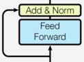
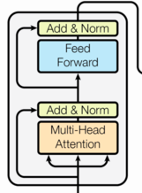
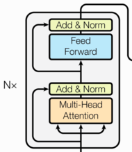
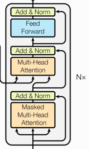

## 六、子层连接结构

### **6.1 什么是子层连接结构**

- 输入到每个子层以及规范化层的过程中使用了残差链接（跳跃连接），因此把这一部分整体称为**子层连接**。
- 每个编码器层包含两个子层，对应形成两个子层连接结构。

**结构图：**




代码实现：

```python
class SublayerConnection(nn.Module):
    """
    子层连接结构（残差 + LayerNorm + Dropout）
    适用于 Transformer 中“多头注意力”或“前馈全维”子层。
    """

    def __init__(self, d_model, dropout=0.1):
        """
        参数
        ----
        d_model : 词嵌入/隐藏层维度。
        dropout : 置零比率。
        """
        super().__init__()
        self.norm = nn.LayerNorm(d_model)   # 1. 层归一化
        self.dropout = nn.Dropout(dropout)  # 2. Dropout

    def forward(self, x, sublayer):
        """
        前向传播：残差连接 + 层归一化 + Dropout

        参数
        ----
        x : Tensor[batch, seq_len, d_model]
            来自上一子层的输入。
        sublayer : callable
            当前子层的计算函数（多头注意力或前馈网络）。

        返回
        ----
        Tensor[batch, seq_len, d_model]
            经过残差与归一化后的输出。
        """
        # 方式 1：Pre-Norm（Transformer 原版）
        # 数据self.norm() -> sublayer()->self.dropout() + x
        return x + self.dropout(sublayer(self.norm(x)))

        # 方式 2：Post-Norm（注释掉，按需启用）
        # 数据sublayer() -> self.norm() ->self.dropout() + x
        # return self.norm(x + self.dropout(sublayer(x)))
```


## 七、编码器层

结构图：



作用： **每个编码器层完成一次对输入的特征提取过程**, 即编码过程。

代码实现：

```python
class EncoderLayer(nn.Module):
    """
    Transformer 编码器中的一个层，包含：
      1. 多头自注意力子层
      2. 前馈全连接子层
    两个子层均通过 SublayerConnection 做残差 + LayerNorm + Dropout。
    """

    def __init__(self, d_model, self_attn, feed_forward, dropout):
        """
        参数
        ----
        d_model : int
            词嵌入/隐藏层维度（默认 512）。
        self_attn : nn.Module
            已实例化的多头自注意力层。
        feed_forward : nn.Module
            已实例化的逐位置前馈网络。
        dropout : float
            子层连接中的 dropout 比率。
        """
        super().__init__()
        self.self_attn = self_attn      # 多头自注意力
        self.feed_forward = feed_forward  # 前馈网络
        
        # 克隆两份子层连接结构：一份给注意力，一份给前馈
        self.sublayer = clones(SublayerConnection(d_model, dropout), 2)
        self.size = d_model             # 记录维度，便于后续调试

    # ----------------------------------------------------------
    def forward(self, x, mask):
        """
        参数
        ----
        x : Tensor[batch, seq_len, d_model]
            上一层输出（或输入嵌入）。
        mask : Tensor[batch, 1, seq_len, seq_len]
            用于屏蔽 <pad> 的注意力掩码。

        返回
        ----
        Tensor[batch, seq_len, d_model]
            经本层处理后的特征。
        """
        # 子层 1：多头自注意力（Q=K=V=x）
        x1 = self.sublayer[0](x, lambda x: self.self_attn(x, x, x, mask))

        # 子层 2：逐位置前馈网络
        x2 = self.sublayer[1](x1, self.feed_forward)

        return x2
```


## 八、编码器

作用：编码器用于对输入进行指定的特征提取过程, 也称为编码, 由N个编码器层堆叠而成.

结构图：



代码实现：

```python
# ------------------------------------------------------------------
#  encoder.py  Transformer 编码器（N 层堆叠 + 末端 LayerNorm）
# ------------------------------------------------------------------

class Encoder(nn.Module):
    """
    由 N 个相同的 EncoderLayer 堆叠而成，
    最后再过一次 LayerNorm，得到整个编码器输出。
    """

    def __init__(self, layer, N):
        """
        参数
        ----
        layer : EncoderLayer
            已经实例化的单个编码器层。
        N : int
            需要堆叠的层数。
        """
        super().__init__()
        # 深度拷贝 N 份编码器层
        self.layers = clones(layer, N)
        # 末端 LayerNorm，维度与层内保持一致
        self.norm = nn.LayerNorm(layer.size)

    # ----------------------------------------------------------
    def forward(self, x, mask):
        """
        参数
        ----
        x : Tensor[batch, seq_len, d_model]
            输入序列嵌入或上一模块特征。
        mask : Tensor[batch, 1, seq_len, seq_len]
            用于屏蔽 <pad> 的自注意力掩码。

        返回
        ----
        Tensor[batch, seq_len, d_model]
            经 N 层编码 + 末端归一化后的最终表示。
        """
        # 依次通过 N 个编码器层
        for layer in self.layers:
            x = layer(x, mask)

        # 最后统一 LayerNorm
        return self.norm(x)
```


## 九、解码器部分

结构图：



组成部分：

```properties
1、N个解码器层堆叠而成
2、每个解码器层由三个子层连接结构组成
3、第一个子层连接结构：多头自注意力（masked）层+ 规范化层+残差连接
4、第二个子层连接结构：多头注意力层+ 规范化层+残差连接
5、第三个子层连接结构：前馈全连接层+ 规范化层+残差连接
```

## 十、解码器层

作用：

```properties
作为解码器的组成单元, 每个解码器层根据给定的输入向目标方向进行特征提取操作，即解码过程。
```

代码实现：

```python
class DecoderLayer(nn.Module):
    """
    Transformer 解码器单层
    顺序：Masked 自注意力 → 编解码交叉注意力 → 前馈网络
    每层后均接 Add & Norm（通过 SublayerConnection 实现）
    """

    def __init__(self, size, self_attn, src_attn, feed_forward, dropout):
        super(DecoderLayer, self).__init__()
        self.size = size               # 模型维度 d_model（也用于残差维度校验）
        self.self_attn = self_attn     # 自注意力机制层对象 q=k=v
        self.src_attn  = src_attn      # 一遍注意力机制对象 q!=k=v（Q 来自解码器，K/V 来自编码器）
        self.feed_forward = feed_forward  # 前馈全连接层对象

        # 克隆 3 个 SublayerConnection，分别对应上述三个子层
        self.sublayer = clones(SublayerConnection(size, dropout), 3)

    def forward(self, x, memory, src_mask, tgt_mask):
        """
        参数:
            x       : 解码器输入  (batch, tgt_len, d_model)
            memory  : 编码器输出  (batch, src_len, d_model)
            src_mask: 编码器掩码，屏蔽 <pad> 等区域  (batch, src_len, src_len)
            tgt_mask: 解码器掩码，包含后续词屏蔽   (batch, tgt_len, tgt_len)
        返回:
            经过单层解码后的张量，尺寸同 x
        """
        # 子层 1：Masked 自注意力（q=k=v 均为 x）
        x = self.sublayer[0](x, lambda x: self.self_attn(x, x, x, tgt_mask))

        # 子层 2：编解码交叉注意力（q=x, k=v=memory）
        x = self.sublayer[1](x, lambda x: self.src_attn(x, memory, memory, src_mask))

        # 子层 3：前馈网络
        x = self.sublayer[2](x, self.feed_forward)

        return x
```

## 十一、解码器

作用：

```properties
根据编码器的结果以及上一次预测的结果, 对下一次可能出现的'值'进行特征表示
```

代码实现：

```python

class Decoder(nn.Module):

    def __init__(self, layer, N):
        # 参数layer 解码器层对象
        # 参数N 解码器层对象的个数

        super(Decoder, self).__init__()

        # clones N个解码器层
        self.layers = clones(layer, N)

        # 定义规范化层
        self.norm = LayerNorm(layer.size)

    def forward(self, x, memory, source_mask, target_mask):

        # 数据以此经过各个子层
        for layer in self.layers:
            x = layer(x, memory, source_mask, target_mask)

        # 数据最后经过规范化层
        return self.norm(x)
```


## 十二、输出部分

```properties
作用:通过线性变化得到指定维度的输出
```

代码

```python
class Generator(nn.Module):
    def __init__(self, d_model, vocab_size):
        # 参数d_model 线性层输入特征尺寸大小
        # 参数vocab_size 线层输出尺寸大小
        super(Generator, self).__init__()
        # 定义线性层
        self.project = nn.Linear(d_model, vocab_size)

    def forward(self, x):
        # 数据经过线性层 最后一个维度归一化 log方式
        x = F.log_softmax(self.project(x), dim=-1)
        return x
```


## 十三、Transformer模型搭建

完整的编码器-解码器结构：


### 1、编码器-解码器结构的代码：

```python
class EncoderDecoder(nn.Module):
    def __init__(self, encoder, decoder, src_embed, tgt_embed, generator):
        super().__init__()
        # 编码器对象
        self.encoder = encoder
        # 解码器对象
        self.decoder = decoder
        # 编码器输入部分对象：wordEmbedding+positionEncoding
        self.src_embed = src_embed
        # 解码器输入部分对象：wordEmbedding+positionEncoding
        self.tgt_embed = tgt_embed
        # 输出部分对象
        self.generator = generator

    def forward(self, source, target, source_mask, target_mask):
        # source代表原始编码器的输入：比如[2, 4]
        # target代表原始解码器的输入：比如[2, 4]
        # source_mask[8, 4, 4]本质代表是padding——mask，用在编码器的多头自注意力计算以及，解码器第二个子层的多头注意力计算
        # target_mask[8, 4, 4] 本质代表是sentence-mask,用在解码器的第一个子层的多头自注意力计算
        # 将source送入编码器输入部分对象：wordEmbedding+positionEncoding
        encoder_embed_x = self.src_embed(source) # [2, 4, 512]
        # 将embed_x送入encoder
        encoder_result = self.encoder(encoder_embed_x, source_mask) # [2, 4, 512]
        # 将target送入编码器输入部分对象：wordEmbedding+positionEncoding
        decoder_embed_x = self.tgt_embed(target)
        #将数据送入解码器，得到解码结果
        decoder_result = self.decoder(decoder_embed_x, encoder_result, source_mask, target_mask)
        # 将解码器的输出送入输出层
        output = self.generator(decoder_result)
        return output
```

### 2、Tansformer模型构建代码：

```python
def make_model(source_vocab, target_vocab, N=6, d_model=512, d_ff=1024, head=8, dropout_p=0.1):
    # 得到深拷贝函数的对象
    c = copy.deepcopy
    # 实例化多头注意力机制对象
    attn = MutiHeadAttention(embed_dim=d_model, head=head, dropout_p=dropout_p)
    # 实例化前馈全连接层对象
    ff = FeedForward(d_model=d_model, d_ff=d_ff, dropout_p=dropout_p)
    # 文本嵌入层实例化对象:编码器
    encode_embed = Embeddings(vocab_size=source_vocab, d_model=d_model)
    # 位置编码实例化对象
    position = PositionEncoding(d_model=d_model, dropout=dropout_p, max_len=2000)
    # 文本嵌入层实例化对象:解码器
    decode_embed = Embeddings(vocab_size=target_vocab, d_model=d_model)
    # 实例化输出层
    generator = Generator(d_model=d_model, vocab_size=target_vocab)
    # 实例化encoder_decoder模型
    model = EncoderDecoder(encoder=Encoder(EncoderLayer(d_model, c(attn), c(ff),dropout_p), N),
                           decoder=Decoder(DecoderLayer(d_model, c(attn), c(attn), c(ff), dropout_p), N),
                           src_embed=nn.Sequential(encode_embed, c(position)),
                           tgt_embed=nn.Sequential(decode_embed,c(position)),
                           generator=generator)

    # 对参数进行初始化
    for p in model.parameters():
        if p.dim() > 1:
            nn.init.xavier_uniform_(p)
    return model
```

```python
if __name__ == '__main__':
    model = make_model(source_vocab=1000, target_vocab=1000)
    source = torch.tensor([[1, 2, 3, 4], [2, 4, 6, 8]])
    target = torch.tensor([[5, 3, 3, 4], [2, 40, 6, 80]])
    source_mask=target_mask=torch.zeros(8, 4, 4)
    result = model(source, target, source_mask, target_mask)
    print(f'transformer的输出结果--》{result.shape}')
```


```python
# nn.Sequential()详解

import torch
import torch.nn as nn

class My_Model(nn.Module):
    # def __init__(self, vocab_size, d_model, output_size=10):
    #     super().__init__()
    #     self.embed = nn.Embedding(vocab_size, d_model)
    #     self.linear1 = nn.Linear(d_model, 8)
    #     self.linear2 = nn.Linear(8, output_size)

    def __init__(self, vocab_size, d_model, output_size=10):
        super().__init__()
        self.sqeuen = nn.Sequential( nn.Embedding(vocab_size, d_model),
                                     nn.Linear(d_model, 8),
                                     nn.Linear(8, output_size))


    # def forward(self, x):
    #     x = self.embed(x)
    #     x = self.linear1(x)
    #     x = self.linear2(x)
    #     return x

    def forward(self, x):
        x = self.sqeuen(x)
        return x
```
