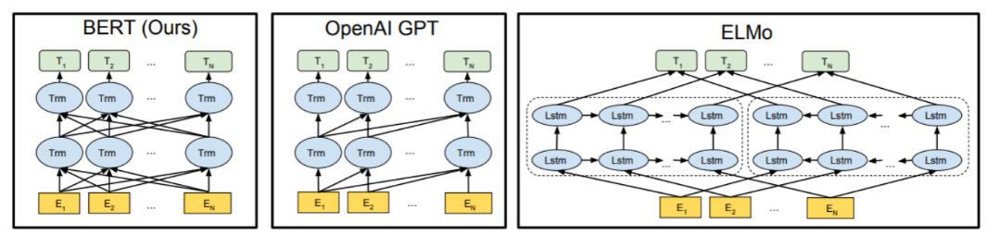
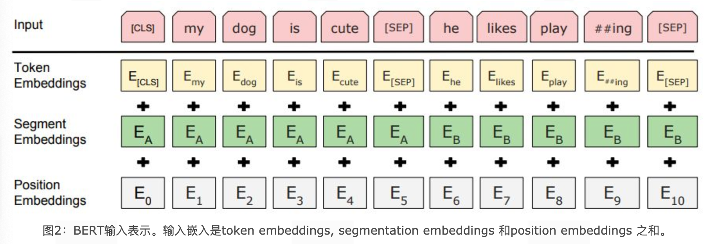
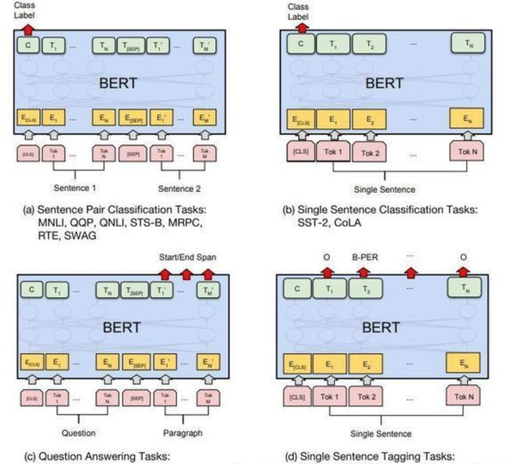

## 1 BERT模型介绍

### 1.1 BERT简介

- **全称**：Bidirectional Encoder Representations from Transformers
- **发布时间**：2018 年 10 月，由 Google AI 研究院提出
- **突破性表现**：
  - 在机器阅读理解测试 **SQuAD 1.1** 中全面超越人类表现
  - 在 **11 项 NLP 任务**中取得 SOTA（State of the Art）成绩
    - GLUE 基准提升至 **80.4%**（绝对提升 7.6%）
    - MultiNLI 准确度达到 **86.7%**（绝对提升 5.6%）

> ✅ BERT 被认为是 NLP 发展史上的**里程碑式模型**


### 1.2 BERT架构

#### 1.2.1 总体架构

BERT 采用 **Transformer Encoder** 结构，是一个典型的**双向编码模型**。与 OpenAI GPT（单向）和 ELMo（拼接双向 LSTM）不同，BERT 在所有层中同时考虑**左右上下文信息**。



**宏观结构三大模块**

| 模块名称             | 颜色标记 | 功能说明                 |
| :------------------- | :------- | :----------------------- |
| **Embedding 模块**   | 🟡 黄色   | 将输入文本转化为向量表示 |
| **Transformer 模块** | 🔵 蓝色   | 实现双向编码与特征提取   |
| **预微调模块**       | 🟢 绿色   | 根据不同下游任务进行微调 |


#### 1.2.2 Embedding 模块详解

BERT 的输入嵌入由以下三种 Embedding **相加**组成：



| 类型                    | 说明                                                         |
| :---------------------- | :----------------------------------------------------------- |
| **Token Embeddings**    | 词向量，首个 token 为 `[CLS]`，用于分类任务                  |
| **Segment Embeddings**  | 区分句子 A 和句子 B， 是为了服务后续的两个句子为输入的预训练任务 |
| **Position Embeddings** | 学习得到的位置编码（非 Transformer 的三角函数方式）          |

> 🔍 示例输入：`[CLS] my dog is cute [SEP] he likes play##ing [SEP]`


#### 1.2.3 双向 Transformer 模块

- 只使用 Transformer 的 **Encoder 部分**，不使用 Decoder
- 所有层均为**双向上下文建模**
- 两大预训练任务体现在该模块的训练过程中


#### 1.2.4 预微调模块（Fine-tuning）

- 经过中间层Transformer的处理后，BERT的最后一层根据任务的不同需求而做不同的调整即可。
- 比如对于sequence-level的分类任务, BERT直接取第一个`[CLS]` token 的final hidden state, 再加一层全连接层后进行softmax来预测最终的标签。

> 对于不同的任务, 微调都集中在预微调模块, 几种重要的NLP微调任务架构图展示如下




| 任务类型       | 处理方式                   |
| -------------- | -------------------------- |
| **句子对分类** | 取 `[CLS]` 向量 + 全连接层 |
| **单句分类**   | 同上                       |
| **问答任务**   | 预测答案起止位置           |
| **序列标注**   | 对每个 token 进            |

> - 从上图中可以发现, 在面对特定任务时, 只需要对预微调层进行微调, 就可以利用Transformer强大的注意力机制来模拟很多下游任务, 并得到SOTA的结果. (句子对关系判断, 单文本主题分类, 问答任务(QA), 单句贴标签(NER))
> - 若干可选的超参数建议如下：
>
> | 参数                  | 建议值           |
> | :-------------------- | :--------------- |
> | Batch Size            | 16 或 32         |
> | Learning Rate（Adam） | 5e-5, 3e-5, 2e-5 |
> | Epochs                | 3 或 4           |


### 1.3 BERT的预训练任务

BERT 通过两个无监督任务进行预训练，提升其对语言的理解能力：

- 任务一: Masked LM (带mask的语言模型训练)
- 任务二: Next Sentence Prediction (下一句话预测任务)


#### ✅ 任务一：**Masked Language Model（Masked LM）**

🔍 目标：

训练模型**理解双向上下文**，解决传统语言模型只能单向或拼接建模的问题。


🧪 操作流程：

- **随机抽取 15% 的 token** 作为预测目标

- 对这些 token 进行以下三种处理之一：

  | 处理方式        | 概率 | 示例                                   |
  | :-------------- | :--- | :------------------------------------- |
  | 替换为 `[MASK]` | 80%  | `my dog is hairy` → `my dog is [MASK]` |
  | 替换为随机词    | 10%  | `my dog is hairy` → `my dog is apple`  |
  | 保持不变        | 10%  | `my dog is hairy` → `my dog is hairy`  |

- 模型根据上下文预测这些被处理的 token


💡 设计亮点：

- 模型**无法确定**哪些词被替换或掩盖，从而**强制学习上下文语义**
- 仅对 15% 的 token 操作，**不会破坏语言整体结构**


#### ✅ 任务二：**Next Sentence Prediction（NSP）**

🔍 目标：

让模型**理解句子间的关系**，为下游任务（如 QA、NLI）提供语义连贯性判断能力。


🧪 操作流程：

1. 输入句子对 (A, B)

2. 模型判断 B 是否为 A 的真实下一句

   | 类型       | 比例 | 标签                |
   | :--------- | :--- | :------------------ |
   | 真实下一句 | 50%  | `IsNext`（正样本）  |
   | 随机句子   | 50%  | `NotNext`（负样本） |


📈 效果：

- 在测试集上可达到 **97%~98% 的准确率**
- 显著增强模型对**句子间逻辑关系**的理解能力


## 2 BERT模型特点

### 2.1 BERT模型优缺点

**✅ 一、BERT 的优点**

| 优点                 | 说明                               |
| :------------------- | :--------------------------------- |
| **SOTA 性能**        | 在 11 项 NLP 任务中取得最优结果    |
| **基于 Transformer** | 并行计算能力强，能捕捉长距离依赖   |
| **双向上下文建模**   | 使用 Encoder 实现真正的双向表示    |
| **微调灵活**         | 预训练后适配多种下游任务，扩展性强 |


**⚠️ 二、BERT 的缺点**

| 缺点                 | 说明                                                         |
| :------------------- | :----------------------------------------------------------- |
| **模型庞大**         | 参数多，推理慢，不适合资源受限场景                           |
| **中文以字为 token** | 无法利用词向量，难以处理生僻词（被替换为 `[UNK]`）           |
| **训练/预测不一致**  | `[MASK]` 只在训练中出现，预测阶段缺失，带来偏差              |
| **收敛慢**           | 按照BERT的MLM任务中的约定，每个 batch 仅 15% token 参与训练，效率低 |

> BERT目前给出的中文模型中，是以字为基本token单位的，很多需要词向量的应用无法直接使用。


### 2.2 BERT的MLM 任务中的 80%-10%-10% 策略

**❓ 为什么不是 100% `[MASK]`？**

- 如果全部 mask，模型在微调阶段从未见过原始词，导致**信息缺失**
- 保留部分原始词（10%）让模型看到**真实语言面貌**

**❓ 为什么加入 10% 随机词？**

- 防止模型“**死记硬背**”当前 token
- 强迫模型结合上下文进行**语义建模**，提升泛化能力


**✅ 总结策略作用：**

| 比例 | 处理方式        | 目的                       |
| :--- | :-------------- | :------------------------- |
| 80%  | 替换为 `[MASK]` | 学习上下文预测能力         |
| 10%  | 替换为随机词    | 防止模型偷懒、死记硬背     |
| 10%  | 保持原词        | 保留真实语义信息，避免偏差 |


### 2.3 BERT 处理长文本的方法

> ⚠️ **BERT**预训练模型所接收的最大sequence长度是512，所以BERT 最大输入长度为 **512 token**（含 `[CLS]` 和 `[SEP]`）

**三种截断策略：**

| 策略            | 描述                                                | 适用场景                         |
| :-------------- | :-------------------------------------------------- | :------------------------------- |
| **Head-only**   | 保留前 510 个 token(要留两个位置给`[CLS]`和`[SEP]`) | 开头信息更重要，如新闻标题       |
| **Tail-only**   | 保留后 510 个 token                                 | 结尾信息更关键，如法律文书       |
| **Head + Tail** | 保留前 128 + 后 382（或前 256 + 后 254）            | 综合前后关键信息，适合大多数文本 |

> head+only方式：选择前128个token和最后382个token (文本总长度在800以内)。 或者前256个token和最后254个token (文本总长度大于800)。


## 3 BERT系列模型介绍

### 3.1 AlBERT模型

#### 3.1.1 AlBERT模型的架构

| 项目     | 内容                                                         |
| -------- | ------------------------------------------------------------ |
| 论文     | A Lite BERT for Self-Supervised Learning of Language Representations |
| 发布     | ICLR 2020 会议                                               |
| 发布机构 | Google AI + 芝加哥大学                                       |
| 模型架构 | AlBERT和BERT基本一致, 核心模块都是基于Transformer的强大特征提取能力。 |


#### 3.1.2 AlBERT模型的优化点

相比较于BERT模型，AlBERT的出发点即是希望降低预训练的难度，同时提升模型关键能力。主要引入了5大优化.

| 序号 | 优化点名称           | 具体描述                                           |
| ---- | -------------------- | -------------------------------------------------- |
| 1    | 词嵌入参数的因式分解 | 降低词嵌入维度，减少参数量，提升训练效率           |
| 2    | 隐藏层之间的参数共享 | 共享部分或全部隐藏层参数，减少模型复杂度           |
| 3    | 去掉NSP，增加SOP任务 | 移除下一句预测（NSP），改为句子顺序预测（SOP）任务 |
| 4    | 去掉Dropout操作      | 移除Dropout，简化模型结构，可能提升训练稳定性      |
| 5    | MLM任务的优化        | 对掩码语言模型（MLM）进行改进，提升预训练效果      |


**✅ 优化 1：词嵌入参数因式分解（Factorized Embedding Parameterization）**

**背景：**

- BERT 中词嵌入维度 = 隐藏层维度（如 768）
- 词向量矩阵参数量大：`vocab_size × hidden_size`

**ALBERT 改进：**

AlBERT的作者认为，词向量只记录了少量的词汇本身的信息，更多的语义信息和句法信息包含在隐藏层中，因此词嵌入的维度不一定非要和隐藏层的维度一致。

- 引入**低维投影层**（词嵌入维度，如 128 维）
- 参数量从 **2300 万** 降至 **48 万**

| 模型   | 参数计算公式                         | 参数量（估算）                |
| :----- | :----------------------------------- | :---------------------------- |
| BERT   | `vocab × hidden`                     | 30k × 768 ≈ 2300 万           |
| ALBERT | `vocab × project + project × hidden` | 30k×128 + 128×768 ≈ **48 万** |


**✅ 优化 2：跨层参数共享（Cross-layer Parameter Sharing）**

做法：

- 所有 Transformer 层**共享同一套参数**
- 包括：多头注意力 + 前馈网络

效果：

- 参数量减少为原来的 **1/12（base）或 1/24（large）**
- 模型更轻量，训练更稳定

> 在BERT模型中，无论是12层的base，还是24层的large模型，其中每一个Encoder Block都拥有独立的参数模块，包含多头注意力子层，前馈全连接层。**非常重要的一点是，这些层之间的参数都是独立的，随着训练的进行都不一样了！**那么为了减少模型的参数量， 一个很直观的做法便是让这些层之间的参数共享， 本质上只有一套Encoder Block的参数！


**✅ 优化 3：替换 NSP 为 SOP 任务**

| 任务 | 全称                          | 目标                         | 问题                             |
| :--- | :---------------------------- | :--------------------------- | :------------------------------- |
| NSP  | Next Sentence Prediction      | 判断句子 B 是否为 A 的下一句 | 太简单，易过拟合，语义区分度差   |
| SOP  | **Sentence Order Prediction** | 判断句子 A、B 是否为正常语序 | 更有挑战性，增强**语序建模能力** |

样本构造：

- 正样本：A → B（正常语序）
- 负样本：B → A（逆序）****


------

- 第三: 去掉NSP, 增加SOP预训练任务.
- BERT模型的成功很大程度上取决于两点, 一个是基础架构采用Transformer, 另一个就是精心设计的两大预训练任务, MLM和NSP. 但是BERT提出后不久, 便有研究人员对NSP任务提出质疑, 我们也可以反思一下NSP任务有什么问题?

------

- 在AlBERT模型中, 直接舍弃掉了NSP任务, 新提出了SOP任务(Sentence Order Prediction), 即两句话的顺序预测, 文本中正常语序的先后两句话[A, B]作为正样本, 则[B, A]作为负样本.
- 增加了SOP预训练任务后, 使得AlBERT拥有了更强大的语义理解能力和语序关系的预测能力.

------

- 第四: 去掉dropout操作.
- 原始论文中提到, 在AlBERT训练达到100万个batch_size时, 模型依然没有过拟合, 作者基于这个试验结果直接去掉了Dropout操作, 竟然意外的发现AlBERT对下游任务的效果有了进一步的提升. **这是NLP领域第一次发现dropout对大规模预训练模型会造成负面影响, 也使得AlBERT v2.0版本成为第一个不使用dropout操作而获得优异表现的主流预训练模型**

------

- 第五: MLM任务的优化.
- segments-pair的优化:
  - BERT为了加速训练, 前90%的steps使用了长度为128个token的短句子, 后10%的steps才使用长度为512个token的长句子.
  - AlBERT在90%的steps中使用了长度为512个token的长句子, 更长的句子可以提供更多上下文信息, 可以显著提升模型的能力.
- Masked-Ngram-LM的优化:
  - BERT的MLM目标是随机mask掉15%的token来进行预测, 其中的token早已分好, 一个个算.
  - AlBERT预测的是Ngram片段, 每个片段长度为n (n=1,2,3), 每个Ngram片段的概率按照公式分别计算即可. 比如1-gram, 2-gram, 3-gram的概率分别为6/11, 3/11, 2/11.

------

- AlBERT系列中包含一个albert-tiny模型, 隐藏层仅有4层, 参数量1.8M, 非常轻巧. 相比较BERT, 其训练和推理速度提升约10倍, 但精度基本保留, 语义相似度数据集LCQMC测试集达到85.4%, 相比于bert-base仅下降1.5%, 非常优秀.

### 3.2 RoBERTa模型[¶](#2-roberta)

#### RoBERTa模型的架构[¶](#21-roberta)

- 原始论文<< RoBERTa: A Robustly Optimized BERT Pretraining Approach >>, 由FaceBook和华盛顿大学联合于2019年提出的模型.
- 从模型架构上看, RoBERTa和BERT完全一致, 核心模块都是基于Transformer的强大特征提取能力. 改进点主要集中在一些训练细节上.
  - 第1点: More data
  - 第2点: Larger batch size
  - 第3点: Training longer
  - 第4点: No NSP
  - 第5点: Dynamic masking
  - 第6点: Byte level BPE

#### RoBERTa模型的优化点[¶](#22-roberta)

- 针对于上面提到的7点细节, 一一展开说明:
- 第1点: More data (更大的数据量)
  - 原始BERT的训练语料采用了16GB的文本数据.
  - RoBERTa采用了160GB的文本数据.
    - 1: Books Corpus + English Wikipedia (16GB): BERT原文使用的之数据.
    - 2: CC-News (76GB): 自CommonCrawl News数据中筛选后得到数据, 约含6300万篇新闻, 2016年9月-2019年2月.
    - 3: OpenWebText (38GB): 该数据是借鉴GPT2, 从Reddit论坛中获取, 取点赞数大于3的内容.
    - 4: Storie (31GB): 同样从CommonCrawl获取, 属于故事类数据, 而非新闻类.

------

- 第2点: Larger batch size (更大的batch size)
  - BERT采用的batch size等于256.
  - RoBERTa的训练在多种模式下采用了更大的batch size, 从256一直到最大的8000.

------

- 第3点: Training longer (更多的训练步数)
  - RoBERTa的训练采用了更多的训练步数, 让模型充分学习数据中的特征.

------

- 第4点: No NSP (去掉NSP任务)
  - 从2019年开始, 已经有越来越多的证据表明NSP任务对于大型预训练模型是一个负面作用, 因此在RoBERTa中直接取消掉NSP任务.
  - 论文作者进行了多组对照试验:
    - 1: Segment + NSP (即BERT模式). 输入包含两部分, 每个部分是来自同一文档或者不同文档的segment(segment是连续的多个句子), 这两个segment的token总数少于512, 预训练包含MLM任务和NSP任务.
    - 2: Sentence pair + NSP (使用两个连续的句子 + NSP, 并采用更大的batch size). 输入也是包含两部分, 每个部分是来自同一个文档或者不同文档的单个句子, 这两个句子的token 总数少于512. 由于这些输入明显少于512个tokens, 因此增加batch size的大小, 以使tokens总数保持与SEGMENT-PAIR + NSP相似, 预训练包含MLM任务和NSP任务.
    - 3: Full-sentences (如果输入的最大长度为512, 那么尽量选择512长度的连续句子; 如果跨越document, 就在中间加上一个特殊分隔符, 比如[SEP]; 该试验没有NSP). 输入只有一部分(而不是两部分), 来自同一个文档或者不同文档的连续多个句子, token总数不超过512. 输入可能跨越文档边界, 如果跨文档, 则在上一个文档末尾添加文档边界token, 预训练不包含NSP任务.
    - 4: Document-sentences (和情况3一样, 但是步跨越document; 该实验没有NSP). 输入只有一部分(而不是两部分), 输入的构造类似于Full-sentences, 只是不需要跨越文档边界, 其输入来自同一个文档的连续句子, token总数不超过512. 在文档末尾附近采样的输入可以短于512个tokens, 因此在这些情况下动态增加batch size大小以达到与Full-sentecens相同的tokens总数, 预训练不包含NSP任务.

------

- 总的来说, 实验结果表明1 < 2 < 3 < 4.
  - 真实句子过短的话, 不如拼接成句子段.
  - 没有NSP任务更优.
  - 不跨越document更优.

------

- 第5点: Dynamic masking (采用动态masking策略)
  - 原始静态mask: 即BERT版本的mask策略, 准备训练数据时, 每个样本只会进行一次随机mask(因此每个epoch都是重复的), 后续的每个训练步都采用相同的mask方式, 这是原始静态mask.
  - 动态mask: 并没有在预处理的时候执行mask, 而是在每次向模型提供输入时动态生成mask, 所以到底哪些tokens被mask掉了是时刻变化的, 无法提前预知的.

------

- 第6点: Byte level BPE (采用字节级别的Encoding)
  - 基于char-level: 原始BERT的方式, 在中文场景下就是处理一个个的汉字.
  - 基于bytes-level: 与char-level的区别在于编码的粒度是bytes, 而不是unicode字符作为sub-word的基本单位.
- 当采用bytes-level的BPE之后, 词表大小从3万(原始BERT的char-level)增加到5万. 这分别为BERT-base和BERT-large增加了1500万和2000万额外的参数. 之前有研究表明, 这样的做法在有些下游任务上会导致轻微的性能下降. 但论文作者相信: 这种统一编码的优势会超过性能的轻微下降.

### 3.3 MacBert模型[¶](#3-macbert)

#### MacBert模型的架构[¶](#32-macbert)

- MacBert模型由哈工大NLP实验室于2020年11月提出, 2021年5月发布应用, 是针对于BERT模型做了优化改良后的预训练模型.
- << Revisiting Pre-trained Models for Chinese Natural Language Processing >>, 通过原始论文题目也可以知道, MacBert是针对于中文场景下的BERT优化.
- MacBert模型的架构和BERT大部分保持一致, 最大的变化有两点:
  - 第一点: 对于MLM预训练任务, 采用了不同的MASK策略.
  - 第二点: 删除了NSP任务, 替换成SOP任务.

#### MacBert模型的优化点[¶](#33-macbert)

- 第一点: 对于MLM预训练任务, 采用了不同的MASK策略.
  - 1: 使用了全词masked以及n-gram masked策略来选择tokens如何被遮掩, 从单个字符到4个字符的遮掩比例分别为40%, 30%, 20%, 10%
  - 2: 原始BERT模型中的[MASK]出现在训练阶段, 但没有出现在微调阶段, 这会造成exposure bias的问题. 因此在MacBert中提出使用类似的单词来进行masked. 具体来说, 使用基于Word2Vec相似度计算包训练词向量, 后续利用这里面找近义词的功能来辅助mask, 比如以30%的概率选择了一个3-gram的单词进行masked, 则将在Word2Vec中寻找3-gram的近义词来替换, 在极少数情况下, 当没有符合条件的相似单词时, 策略会进行降级, 直接使用随机单词进行替换.
  - 3: 使用15%的百分比对输入单词进行MASK, 其中80%的概率下执行策略2(即替换为相似单词), 10%的概率下替换为随机单词, 10%的概率下保留原始单词不变.

------

- 第二点: 删除了NSP任务, 替换成SOP任务.
- 第二点优化是直接借鉴了AlBERT模型中提出的SOP任务.

------

- 在NLP著名的难任务阅读理解中, MacBert展现出非常优秀的表现.

#### 3.4 SpanBERT模型[¶](#4-spanbert)

#### SpanBERT模型的架构[¶](#41-spanbert)

- 论文的主要贡献有3点:
  - 1: 提出了更好的Span Mask方案, 再次展示了随机遮掩连续一段tokens比随机遮掩单个token要好.
  - 2: 通过加入了Span Boundary Objective(SBO)训练任务, 增强了BERT的性能, 特别在一些和Span适配的任务, 如抽取式问答.
  - 3: 用实验数据获得了和XLNet一致的结果, 发现去除掉NSP任务, 直接用连续一长句训练效果更好.

------

- 架构图中可以清晰的展示论文的核心贡献点:
  - Span Masking
  - Span Boundary Objective

#### Span Masking[¶](#42-span-masking)

- 关于创新的MASK机制, 一般来说都是相对于原始BERT的基准进行改进. 对于BERT, 训练时会随机选取整句中的最小输入单元token来进行遮掩, 中文场景下本质上就是进行字级别的MASK. 但是这种方式会让本来应该有强相关的一些连在一起的字词, 在训练时被割裂开了.
- 那么首先想到的做法: 既然能遮掩字, 那么能不能直接遮掩整个词呢? 这就是BERT-WWM模型的思想.

```
原始输入: 使用语言模型来预测下一个词的概率.

原始BERT: 使用语言[MASK]型来[MASK]测下一个词的[MASK]率.

BERT-WWM: 使用语言[MASK][MASK]来[MASK][MASK]下一个词的[MASK][MASK].
```

------

> - 引申: 百度著名的ERNIE模型中, 直接引入命名实体(Named Entity)的外部知识, 进行整个实体的遮掩, 进行训练.

------

- 综合上面所说, 会更自然的想到, 既然整词的MASK, 那么如果拥有词的边界信息会不会让模型的能力更上一层楼呢? SpanBERT给出的是肯定的回答!!!
- 论文中关于span的选择, 走了这样一个流程:
  - 第一步: 根据几何分布, 先随机选择一个**span长度**.
  - 第二步: 再根据均匀分布随机选择这一段的**起始位置**.
  - 第三步: 最后根据前两步的start和length直接进行MASK.

------

> - 结论: 论文中详细论证了按照上述算法进行MASK, 随机被遮掩的文本平均长度等于3.8

#### Span Boundary Objective(SBO)[¶](#43-span-boundary-objectivesbo)

- SBO任务是本篇论文最核心的创新点, 希望通过增加这个预训练任务, 可以让被遮掩的Span Boundary的词向量, 能够学习到Span内部的信息

------

- 具体的做法: 在训练时取Span前后边界的两个词, 需要注意这两个词不在Span内, 然后用这两个词向量加上Span中被MASK掉的词的位置向量, 来预测原词.
- 更详细的操作如下, 即将词向量和位置向量进行拼接, 经过GeLU激活和LayerNorm处理, 连续经过两个全连接层, 得到最终的输出张量:

------

- 最后预测Span中原词的时候会得到一个损失, 这就是SBO任务的损失; 再将其和BERT自身的MLM任务的损失进行加和, 共同作为SpanBERT的目标损失函数进行训练

#### NSP任务反思[¶](#44-nsp)

- 为什么选择Single Sentence而不是BERT的Two Sentence?
  - 1: 训练文本的长度更大, 可以学会长程依赖.
  - 2: 对于NSP的负样本, 基于另一个主题文档的句子来预测单词, 会给MLM任务引入很大的噪声.
  - 3: AlBERT模型已经给出了论证, 因为NSP任务太简单了.

## 4 ELMo模型介绍

- 学习了什么是ELMo.
  - ELMo是2018年3月由华盛顿大学提出的一种预训练语言模型.
  - ELMo在6种NLP测试任务中有很大的提升表现.
- 学习了ELMo的结构.
  - ELMo架构总体上采用了双向双层LSTM的结构.
  - 最底层的Embedding模块.
  - 中间层的双向双层LSTM模块.
  - 最上层的特征融合模块.
- 学习了ELMo的预训练任务.
  - ELMo的本质思想就是根据当前上下文对word embedding进行动态调整的语言模型.
  - ELMo的预训练是一个明显的两阶段过程.
    - 第一阶段: 利用语言模型进行预训练, 得到基础静态词向量和双向双层LSTM网络.
    - 第二阶段: 在拥有上下文的环境中, 将上下文输入双向双层LSTM中, 得到动态调整后的word embedding, 等于将单词融合进了上下文的语义, 可以更准确的表达单词的真实含义.
- 学习了ELMo的效果.
  - 经过与GloVe静态词向量的对比, 明显可以看出ELMo的词向量可以更好的表达真实语义, 更好的解决多义词的问题.
- 学习了ELMo的待改进点.
  - ELMo的特征提取器没有选用更强大的Transformer, 在提取特征上肯定弱于现在的最优结果.

## 5 GPT模型介绍

- 学习了什么是GPT.
  - GPT是OpenAI公司提出的一种预训练语言模型.
  - 本质上来说, GPT是一个单向语言模型.
- 学习了GPT的架构.
  - GPT采用了Transformer架构中的解码器模块.
  - GPT在使用解码器模块时做了一定的改造, 将传统的3层Decoder Block变成了2层Block, 删除了encoder-decoder attention子层, 只保留Masked Multi-Head Attention子层和Feed Forward子层.
  - GPT的解码器总共是由12个改造后的Decoder Block组成的.
- 学习了GPT的预训练任务.
  - 第一阶段: 无监督的预训练语言模型. 只利用单词前面的信息来预测当前单词.
  - 第二阶段: 有监督的下游任务fine-tunning.

## 6 BERT GPT ELMo模型对比

学习了BERT, GPT, ELMo之间的区别: * 三者所选取的特征提取器不同. * BERT采用的是Transformer架构中的Encoder模块. * GPT采用的是Transformer架构中的Decoder模块. * ELMo采用的双层双向LSTM模块.

- 三者所采用的语言模型单/双向不同.
  - BERT采用的是最彻底的双向语言模型, 可以同时关注context before和context after.
  - GPT采用的是单向语言模型, 即Transformer中的Decoder, 由于采用了mask机制, 所以未来信息context after都不可见.
  - ELMo表面上被认为是双向语言模型, 但实际上是左右两个单向LSTM模型分别提取特征, 在进行简单的拼接融合.