## 1 实体抽取基本知识

### 1.1 什么是命名实体识别（NER）

**实体**：文本中承载信息的语义单元，是文本语义理解的基础。

- 常见实体类型包括：人名、地名、机构名、时间、日期、货币、百分比。

- 示例句子：

  

  - 时间实体：1736年1月19日
  - 人名实体：詹姆斯·瓦特
  - 地名实体：苏格兰、格拉斯哥、克莱德河湾、格林诺克

**NER任务目标**：从文本中识别出这些命名性实体，并将其分类到指定类别。


### 1.2 命名实体识别的方法

#### 1.2.1 基于规则的方法

- **适用场景**：适用于文本结构较为规范、实体有明显上下文的场景（如价格抽取）。
- **优点**：
  - 简单、快速
- **缺点**：
  - 适用性差
  - 维护成本高，随语料复杂度增加，规则可能冲突，系统难以维护

> 示例：
> 若价格格式统一为“数字+元”，可用正则表达式 `\d+\.?\d+元` 抽取。
> 若出现“一千八百万”、“伍佰贰拾圆”、“2000万元”等多样表达，则需不断修改规则。


#### 1.2.2 基于传统机器学习的方法

- **基本流程**：
  1. 人工选择特征（如词性、上下文、词缀等）
  2. 选择并训练统计模型
  3. 使用模型预测实体
- **常用标注方法**：
  - IO
  - BIO
  - BIOES

| 文本序列 | IO标注 | BIO标注 | BIOES标注 |
| :------- | :----- | :------ | :-------- |
| 瓦       | I-PER  | B-PER   | B-PER     |
| 特       | I-PER  | I-PER   | E-PER     |
| 出       | O      | O       | O         |
| 生       | O      | O       | O         |
| 于       | O      | O       | O         |
| 苏       | I-LOC  | B-LOC   | B-LOC     |
| 格       | I-LOC  | I-LOC   | I-LOC     |
| 兰       | I-LOC  | I-LOC   | E-LOC     |

- **常用模型**：
  - 支持向量机（SVM）
  - 隐马尔可夫模型（HMM）
  - 条件随机场（CRF）
- **优点**：
  - 灵活、健壮
  - 可移植到其他领域
- **缺点**：
  - 依赖人工设计特征
  - 依赖分词等自然语言处理工具，性能受限


#### 1.2.3 基于深度学习的方法

- **特点**：
  - 无需人工设计特征
  - 减少对预处理工具的依赖
  - 常用模型：CNN、RNN、LSTM、BiLSTM-CRF（最常用）
- **优点**：
  - 准确率和召回率较高
- **缺点**：
  - 强烈依赖大量人工标注数据
  - 标注语料缺乏是训练的主要瓶颈


✅**三种方法的对比：**

| 方法类型          | 优点                   | 缺点                         |
| :---------------- | :--------------------- | :--------------------------- |
| 基于规则          | 简单直观、可控性强     | 覆盖有限、维护成本高         |
| 基于统计/机器学习 | 灵活、可迁移           | 依赖特征工程、需大量标注数据 |
| 基于深度学习      | 准确率高、无需人工特征 | 依赖大规模标注语料           |


### 1.3 NER评测标准

命名实体识别的性能通常通过以下三个指标评估：

- **准确率（Precision）**：  
  
  - 所有预测为正的样本中，实际为正的比例  
    $$
    Precision = \frac{TP}{TP + FP}
    $$
  
- **召回率（Recall）**：  
  
  - 所有实际为正的样本中，被正确预测为正的比例  
    $$
    Recall = \frac{TP}{TP + FN}
    $$
  
- **F1值**：  
  
  - 准确率和召回率的调和平均数
    $$
    F1 = \frac{2 \times Precision \times Recall}{Precision + Recall}
    $$
  
  

### 1.4 NER面临的挑战

- **标签重叠问题**：
  - 当前模型通常假设每个词只能属于一个标签，无法处理一个词对应多个实体类型的情况。
  - 多标签实体抽取仍是未来研究的重要方向。
- **实体类别扩展问题**：
  - 当前方法多集中于传统实体（如人名、地名、机构名）。
  - 实际应用中实体类型更多，且缺乏标注数据，限制了模型的泛化能力。


## 2 基于规则实现NER

### 2.1 基于规则实现NER的原理

- **核心思想**：人工构造规则模板，结合词典、正则表达式等方式进行实体匹配。

- **特点：**简单，但是针对复杂任务，效果不好

- **实现步骤：**

  | 方法名称         | 说明                     |
  | :--------------- | :----------------------- |
  | **领域字典匹配** | 构建领域词典，匹配关键词 |
  | **正则表达式**   | 定义模式，提取结构化实体 |


### 2.2 案例分析：识别机构名

📌 规则设计：

- 若词语后紧跟 **“公司”、“集团”**，则可能是**机构名的结束**
- 若词语为地名（词性为`ns`），则可能是**机构名的开始**

📌 实现步骤：

1. 构建词典：`['公司', '有限公司', '大学', '政府', '人民政府', '总局']`
2. 对文本进行**序列标注**：
   - 词典词 → 标记为 `S`（开始）或 `E`（结束）
   - 其他词 → 标记为 `O`
3. 使用正则表达式 `"S+O*E+"` 提取机构名

```python
import jieba
import jieba.posseg as pseg
import re

# 机构关键词词典
org_tag = ['公司', '有限公司', '大学', '政府', '人民政府', '总局']

def extract_org(text):
    # 使用jieba进行分词和词性标注
    words_flags = pseg.lcut(text)
    
    words = []      # 存储分词结果
    features = []   # 存储每个词的标签（用于规则匹配）

    for word, flag in words_flags:
        words.append(word)

        # 如果当前词是机构关键词，标记为E（结束）
        if word in org_tag:
            features.append('E')
        # 如果是地名（jieba中'ns'表示地名），标记为S（起始）
        elif flag == 'ns':
            features.append('S')
        # 其他词标记为O（无关）
        else:
            features.append('O')

    # 将标签列表拼接成字符串，便于正则匹配
    labels = "".join(features)

    # 定义正则：匹配一个或多个S，后跟任意个O，再跟一个或多个E
    pattern = re.compile(r'S+O*E+')

    # 找到所有匹配的实体标签段
    match_label = re.finditer(pattern, labels)

    # 根据匹配结果提取原始文本中的机构名
    match_list = []
    for match in match_label:
        start = int(match.start())
        end = int(match.end())
        match_list.append("".join(words[start:end]))

    return match_list

# 测试文本
text = "可在接到本决定书之日起六十日内向中国国家市场监督管理总局申请行政复议，杭州海康威视数字技术股份有限公司"

# 输出识别结果
print(extract_org(text))
# 输出结果：
# ['中国国家市场监督管理总局', '杭州海康威视数字技术股份有限公司']
```


## 3 基于BiLSTM+CRF实现NER

### 3.1 BiLSTM+CRF模型介绍

**BiLSTM + CRF** 是一种常用于**命名实体识别（NER）** 的深度学习模型，其核心目标是：

> 从一段自然语言文本中识别出具有特定意义的实体（如人名、地名、组织名等），并标注其**位置**与**类型**。

NER 本质上是一个**序列标注问题**。例如：

- 输入文本：`我是中国人`
- 输出标签：`O O B I I`（BIO 标注体系）
  - `B`：实体的开始
  - `I`：实体的中间或结尾
  - `O`：非实体部分

根据标签序列 `O O B I I`，可解码出分词结果：`我 / 是 / 中国人`。

> ✅ 序列标注广泛应用于：中文分词、语音识别、机器翻译、命名实体识别等任务，而常见的序列标注模型包括HMM, CRF, RNN, LSTM, GRU等模型。 


#### **3.1.1 模型架构概览：**

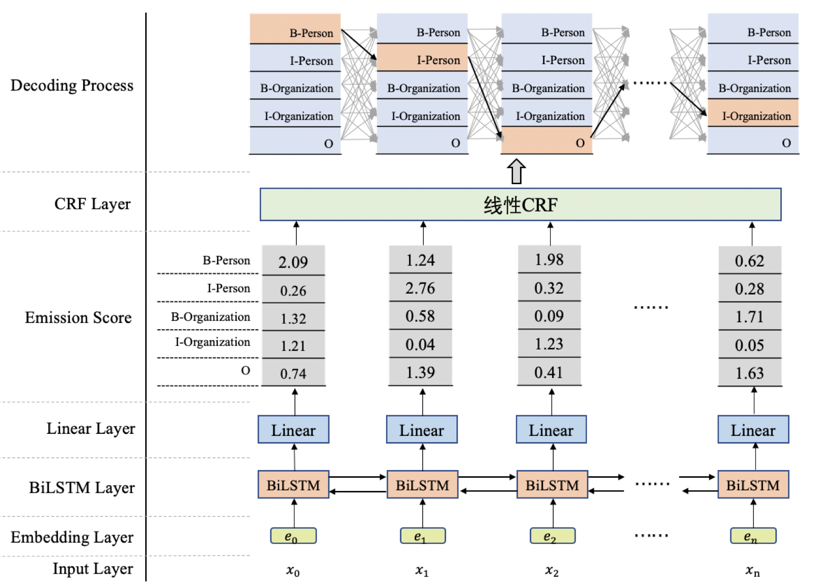

#### 3.1.2 核心组件详解

**1. BiLSTM：双向长短期记忆网络**

- **单向 LSTM**：只能捕捉从前向后的上下文信息。
- **BiLSTM**：同时建模**前向**与**反向**信息，更全面地理解文本语义。
- 输出：每个词对应一个隐藏状态向量，作为后续预测的“发射分数”基础。

> ✅ BiLSTM 输出 → 经 Linear 层 → 得到每个词对应每个标签的得分（即发射分数）


**2. CRF：条件随机场（Conditional Random Field）**

**作用：**

CRF 层接收 BiLSTM 输出的**发射分数**（每个位置对每个标签的得分），并建模**标签之间的转移约束**（如：`B-Person` 后不能接 `I-Organization`），从而在所有可能路径中找到**全局最优的标签序列**。


示例：可能的路径

```properties
路径1：B-Person → I-Person → O → ... → I-Organization
路径2：B-Organization → I-Person → O → ... → I-Person
路径3：B-Organization → I-Organization → O → ... → O
```

CRF 通过**维特比算法（Viterbi）** 找出**概率最大、最合理**的一条路径作为最终输出。


✅**模型流程总结**

1. **输入文本** → 分词 → 词向量（Embedding）
2. **BiLSTM** 提取上下文特征 → 输出隐藏状态
3. **Linear 层** 将隐藏状态映射为标签发射分数
4. **CRF 层** 基于发射分数 + 转移约束 → 解码最优标签序列
5. **输出结果**：每个词对应的实体标签

| 模块         | 优势说明                                             |
| :----------- | :--------------------------------------------------- |
| **BiLSTM**   | 捕捉双向上下文，语义理解更强                         |
| **CRF**      | 建模标签间依赖，避免非法标签组合，提升整体准确率     |
| **联合训练** | 端到端训练，整体优化，效果优于单独使用 BiLSTM 或 CRF |


### 3.2 CRF原理

#### 3.2.1 线性 CRF 的定义

> **目标**：建模输入序列 $X = [x_1, x_2, ..., x_n]$ 到输出标签序列 $Y = [y_1, y_2, ..., y_n]$ 的条件概率分布 $P(Y|X)$。

若在给定输入序列 $X$ 的条件下，输出序列 $Y$ 满足**马尔可夫性**：

$$
P(y_i | X, y_1, ..., y_{i-1}, y_{i+1}, ..., y_n) = P(y_i | X, y_{i-1}, y_{i+1})
$$

则称 $P(Y|X)$ 为**线性CRF**。


**🔍 关键点：**

- 输入序列 $X$ 和输出序列 $Y$ 是**线性结构**
- 每个标签 $y_i$ 仅依赖于：
  - 当前输入 $x_i$
  - 相邻标签 $y_{i-1}, y_{i+1}$
- 大大简化了建模 **CRF** 的复杂度

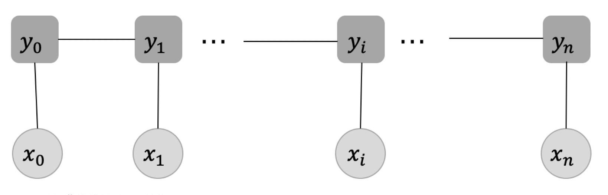


#### 3.2.2 两个核心概念：发射分数 & 转移分数

| 概念         | 含义说明                                                     |
| ------------ | ------------------------------------------------------------ |
| **发射分数** | 每个输入词 $x_i$ 对应各个标签的得分（由 BiLSTM + Linear 层输出） |
| **转移分数** | 标签之间的转移得分（如 `B-Person → I-Person` 是高概率转移）  |


##### 1 **发射分数（Emission Score）**

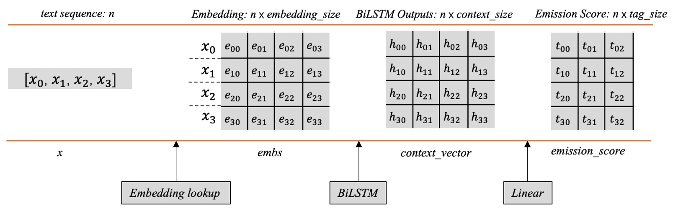

**生成流程：**`文本序列 → Embedding → BiLSTM → Linear → Emission Score`

- **输入**：词向量矩阵（shape: $[n, \text{embedding\_size}]$）
- **BiLSTM 输出**：上下文向量矩阵（shape: $[n, \text{context\_size}]$）
- **Linear 层**：线性变换 $y = XW + b$
  - $W \in [\text{context\_size}, \text{tag\_size}]$
  - 输出：**发射分数矩阵**（shape: $[n, \text{tag\_size}]$）

> ✅ 每行表示一个词对所有标签的得分，用于后续 CRF 解码。


##### 2 转移分数（Transition Score）

**转移矩阵 $T$（可学习参数）：**

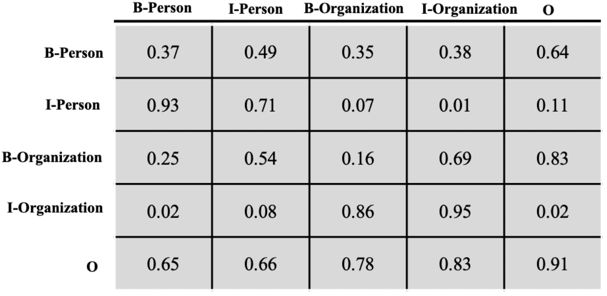


这个转移分数矩阵是CRF中的一个**可学习的参数矩阵**，它的存在能够帮助我们显示地去建模标签之间的转移关系，提高命名实体识别的准确率。

> ✅ 矩阵竖着理解，数值高表示常见转移（如 `B-Person → I-Person`）


**转移分数计算：**

路径：`B-Person → I-Person → O → O → B-Organization → I-Organization`

$$
\text{Score} = T_{I\text{-}P,B\text{-}P} + T_{O,I\text{-}P}+T_{O,O}+T_{B\text{-}O,O}+T_{I\text{-}O,B\text{-}O}
$$


#### 3.2.3 CRF 的损失函数设计

前面提到，**CRF**（条件随机场）能够帮助我们从全局角度进行建模，在所有可能的路径中选择效果最优、得分最高的那条路径。那么，具体应该如何建模这个策略呢？下面我们来详细说明。

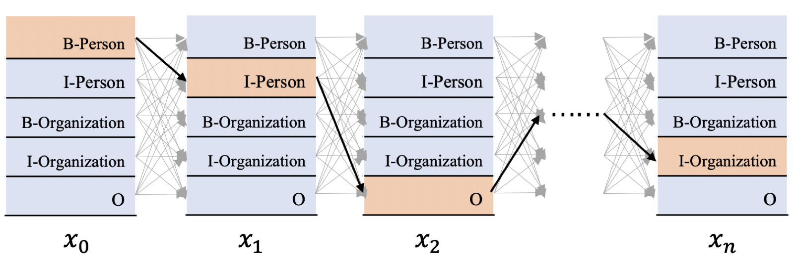

如上图所示，给定一个输入序列：
$$
x = [x_0, x_1, x_2, \dots, x_n]
$$

其中，每个词 $x_i$ 都对应一个发射分数向量（即标签向量），向量的维度等于标签的类别数。我们的目标是解码出对应的标签序列：

$$
y = [y_0, y_1, y_2, \dots, y_n]
$$

形式化为条件概率：

$$
P(y \mid x) = P(y_0, y_1, \dots, y_n \mid x_0, x_1, \dots, x_n)
$$


✅**解码策略与路径概率**

CRF 的解码策略是：在所有可能的路径中，找出概率最大、效果最优的一条路径作为输出。

假设标签数量为 $k$，文本长度为 $n$，则总共有 $N = k^n$ 条可能的路径。我们用 $S_i$ 表示第 $i$ 条路径的得分，则某条标签序列出现的概率可以表示为：

$$
P(S) = \frac{e^{S}}{\sum_{j=1}^{N} e^{S_j}}
$$


✅**真实路径与损失函数**

假设我们有一条真实路径（即我们期望模型解码出的标签序列），记为 $S_{\text{real}}$，其得分为 $S_{\text{real}}$，则其出现的概率为：

$$
P(S_{\text{real}}) = \frac{e^{S_{\text{real}}}}{\sum_{j=1}^{N} e^{S_j}}
$$

我们建模的目标就是不断提高 $P(S_{\text{real}})$ 的值。相应地，我们可以定义损失函数为：

$$
\text{loss} = -P(S_{\text{real}}) = -\frac{e^{S_{\text{real}}}}{\sum_{j=1}^{N} e^{S_j}}
$$

为了方便优化，我们通常将损失函数转换到对数空间（log-space），因为 log 函数是单调递增的，不会影响优化方向：

$$
\text{loss} = -\log P(S_{\text{real}}) = -\log \left( \frac{e^{S_{\text{real}}}}{\sum_{j=1}^{N} e^{S_j}} \right)
= \log \left( \sum_{j=1}^{N} e^{S_j} \right) - S_{\text{real}}
$$


✅**最终损失函数形式**

这就是我们最终得到的 **CRF 损失函数**：

$$
\text{loss} = \log \left( \sum_{j=1}^{N} e^{S_j} \right) - S_{\text{real}}
$$

整个 BiLSTM + CRF 模型的训练目标，就是最小化这个损失函数。

从公式可以看出，损失函数包含两个部分：

1. **归一化项**：对所有路径得分进行 log-sum-exp 操作，即：

   $$
   \log \left( \sum_{j=1}^{N} e^{S_j} \right)
   $$

2. **真实路径得分**：即 $S_{\text{real}}$


#### 3.2.4 单条路径的分数计算

在开始之前，我们先统一符号定义：**𝑛**代表文本序列长度，**𝑡𝑎𝑔_𝑠𝑖𝑧𝑒**代表标签的数量。

- **E**：发射分数矩阵，形状为 `[n, tag_size]`  
  - 每行对应一个词语的发射分数  
  - 每列对应一个标签  
  - 例如：`E[i][j]` 表示第 `i` 个词取标签 `j` 的发射分数  
  - 举例：`E[0][1]` 表示词 $x_0$ 取标签 $\text{id}=1$ 的分数

- **T**：转移分数矩阵，形状为 `[tag_size, tag_size]`  
  - 表示标签之间的转移关系  
  - **注意**：`T[i][j]` 表示从标签 **id=j** 转移到标签 **id=i** 的分数  
  - 举例：`T[0][3]` 表示从标签 $\text{id}=3$ 转移到标签 $\text{id}=0$ 的分数

标签与 id 对应关系如下：

| Tag    | B-Person | I-Person | B-Organization | I-organization | O    |
| ------ | -------- | -------- | -------------- | -------------- | ---- |
| Tag_id | 0        | 1        | 2              | 3              | 4    |


✅**路径分数的构成**

每条路径的分数由**发射分数**和**转移分数**共同组成。

以图5中标记的黄色路径为例：


- $x_0$ 的标签是 $\text{B-Person}$（id=0），发射分数为：$E[0][0]$  
- $x_1$ 的标签是 $\text{I-Person}$（id=1），发射分数为：$E[1][1]$  
- 从 $\text{B-Person} \rightarrow \text{I-Person}$ 的转移分数为：$T[1][0]$  （当前标签 id=1，上一标签 id=0）

前两个词的累计分数为：

$$
E[0][0] + T[1][0] + E[1][1]
$$

接下来：

- $x_2$ 的标签是 $\text{O}$（id=4），发射分数为：$E[2][4]$  
- 从 $\text{I-Person} \rightarrow \text{O}$ 的转移分数为：$T[4][1]$  （当前标签 id=4，上一标签 id=1）

此时累计分数为：

$$
E[0][0] + T[1][0] + E[1][1] + T[4][1] + E[2][4]
$$

依此类推，可计算出整条路径的分数。


✅**路径分数的形式化表达**

设第 $i$ 个位置的标签为 $y_i$，则整条路径的分数为：

$$
\text{Score}(y) = \sum_{i=0}^{n-1} E[i][y_i] + \sum_{i=1}^{n-1} T[y_i][y_{i-1}]
$$

> n为文本序列长度，最多只到n-1

其中：

- 第一项为所有位置的发射分数之和  
- 第二项为相邻标签之间的转移分数之和  
  - 注意：$T[y_i][y_{i-1}]$ 表示从上一标签 $y_{i-1}$ 转移到当前标签 $y_i$


#### 3.2.5 全部路径的分数计算

损失函数由两项组成：

1. 单条真实路径的分数；
2. 归一化项（即全部路径分数的 log-sum-exp，下文简称为“全部路径之和”）。

既然已经知道如何计算单条路径的分数，一个最直观的想法就是：

> 遍历所有路径，挨个求分数，再做 log-sum-exp。

理论上可行，但路径数量是**指数级**的。  例如，对一段含 50 个字符的文本做实体识别，标签集大小为 31，则路径总数为

$$
31^{50} \approx 2.6 \times 10^{74}
$$

这个数字在工程上完全无法接受，会彻底拖垮训练与推理效率。

因此，必须换一种高效思路——**前向算法（Forward Algorithm）**。  （经典动态规划，此处不再展开。）  

其核心思想是：把“所有路径之和”拆解为**逐位置累加**的局部计算，最终用 $O(n \cdot k^2)$ 的时间复杂度得到
$$
\log \sum_{\text{all } y} e^{\text{Score}(y)}
$$

其中 $k$ 为标签数，$n$ 为序列长度。


#### 3.2.6 Viterbi 解码

前面我们已经掌握了：

- CRF 损失函数；
- 单条路径分数计算；
- 全部路径之和的高效计算。

训练阶段已经没问题了。但**推理阶段**还需要一步：

> 从所有可能路径中，找出**得分最高**的那一条。

显然不能先算出全部路径分数再挑最大值——路径数量依然是 $k^n$。

这里使用 **Viterbi 算法**（亦称维特比解码）。  其思想与前向算法类似，同样是动态规划，但目标由“求和”变为“求最大值”：

- 逐位置记录**到当前节点为止的最高分**；
- 同时记录对应的最佳前缀路径；
- 最后一步回溯，即可得到全局最优标签序列。

时间复杂度仍为 $O(n \cdot k^2)$，可在线性时间内完成解码。


### 3.3 Viterbi算法原理

#### 🧩 问题引入

如下图所示，假设你要从起点 **S** 到终点 **E** 找到一条**最短路径**，除了暴力枚举所有路径，还有更高效的方法吗？

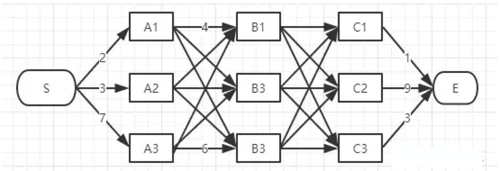

> **Viterbi算法** 正是为了解决这种**篱笆型图（trellis）中的最短路径问题**。
> 图的节点按列组织，每列节点数量可以不同，节点只能与**相邻列**的节点相连，**不能跨列连接**。


#### ✅ 算法核心思想

Viterbi算法采用**动态规划**思想，**逐列推进**，每一步只保留**当前最优路径**，其余路径被**剪枝**。


#### 🚶‍♂️ 步骤详解

##### ① 从起点 S 出发，分析第一列（A列）

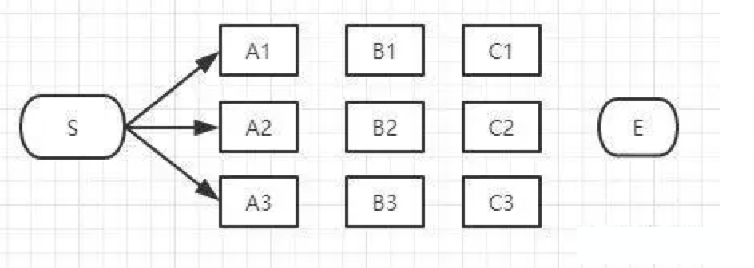

- 可能路径：
  - S → A1
  - S → A2
  - S → A3

> 此时无法判断哪条是全局最优，**全部保留**。


##### ② 推进到第二列（B列），逐个节点分析

##### 🔹 分析 B1：

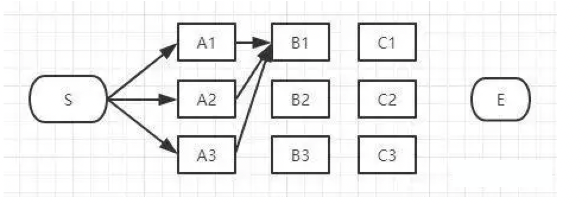

- 可能路径：
  - S → A1 → B1
  - S → A2 → B1
  - S → A3 → B1

> 比较三条路径长度，**保留最短的一条**（假设为 S-A3-B1），**其余剪枝**。

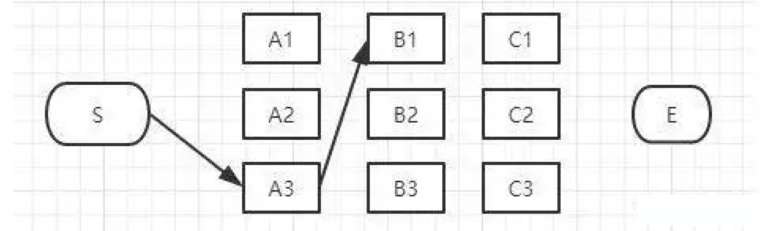


##### 🔹 分析 B2：

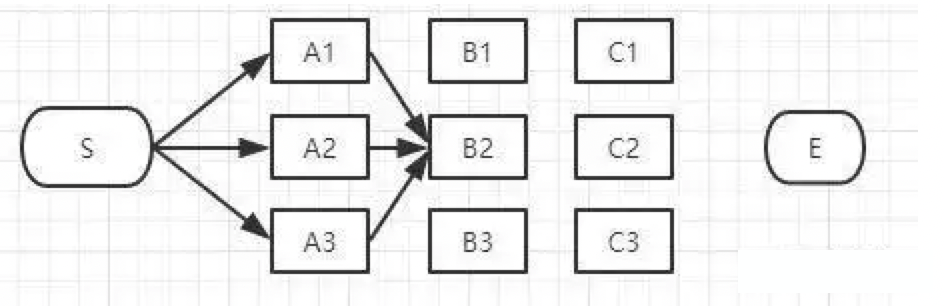

- 可能路径：
  - S → A1 → B2
  - S → A2 → B2
  - S → A3 → B2

> 同样只保留最短的一条（假设为 S-A1-B2），**其余剪枝**。

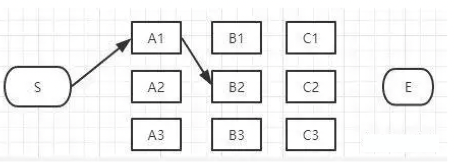


##### 🔹 分析 B3：

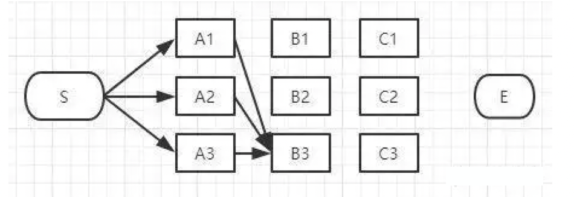

- 可能路径：
  - S → A1 → B3
  - S → A2 → B3
  - S → A3 → B3

> 保留最短的一条（假设为 S-A2-B3），**其余剪枝**。

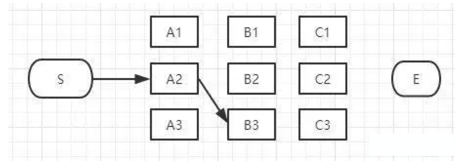


##### ③ 当前保留的路径汇总

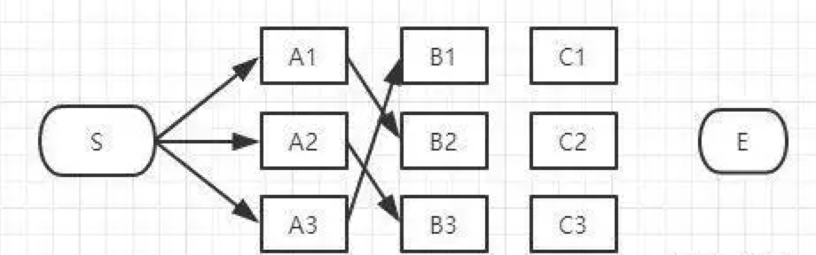

> 当前备选最短路径：

- S → A3 → B1
- S → A1 → B2
- S → A2 → B3

> 仍无法确定全局最优，**继续推进**。


##### ④ 推进到第三列（C列）

##### 🔹 分析 C1：

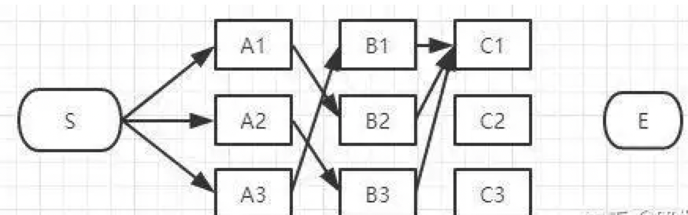

- 可能路径：
  - S → A3 → B1 → C1
  - S → A1 → B2 → C1
  - S → A2 → B3 → C1

> 保留最短的一条（假设为 S-A3-B1-C1），**其余剪枝**。

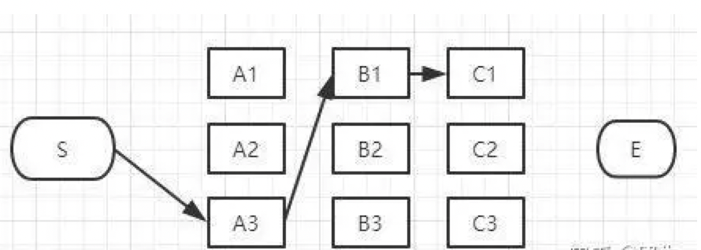


##### 🔹 同理分析 C2 和 C3：

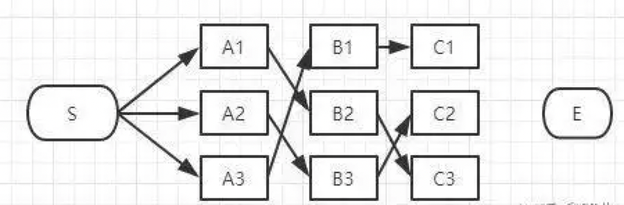


##### ⑤ 最终推进到终点 E

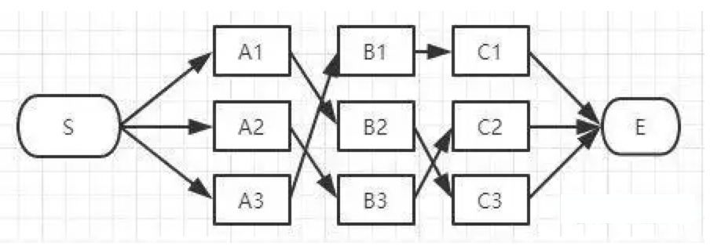

- 可能路径：
  - S → ... → C1 → E
  - S → ... → C2 → E
  - S → ... → C3 → E

> 比较三条路径总长度，**最短者即为全局最优路径**。

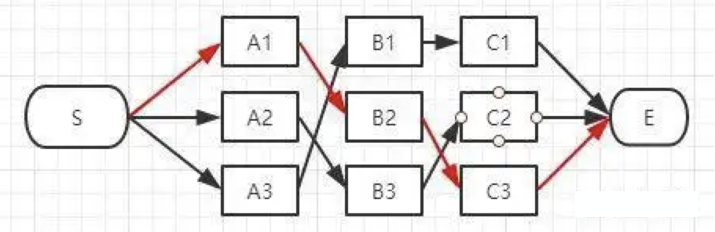


####  前向算法 vs 穷举法 vs 维特比算法

##### ✅ 前向算法（Forward Algorithm）

- **用途**：计算观测序列的**总概率**（所有路径的概率之和）。

- **特点**：

  - 使用**动态规划**高效计算。
  - **避免穷举所有路径**，显著降低复杂度。

- **时间复杂度**：

  > **`O(n * k^2)`**

  - `n`：序列长度
  - `k`：每个位置可能的标签数


##### ⚠️ 穷举所有路径（Brute-force）

- **用途**：计算所有可能路径的概率。

- **缺点**：

  - 路径数量随序列长度呈**指数增长**。
  - **计算代价极高**，不适用于实际应用。

- **时间复杂度**：

  > **`O(k^n)`**

  - `n`：序列长度
  - `k`：每个位置可能的标签数

  > ⚠️ **指数级增长**，不可扩展！


##### 🎯 维特比算法（Viterbi Algorithm）

- **用途**：找出**最可能的状态路径**（最优路径）。

- **特点**：

  - 同样基于**动态规划**。
  - 每步只保留**概率最大的路径**，其余剪枝。

- **时间复杂度**：

  > **`O(n * k^2)`**

  - 与**前向算法相同**，但目标不同：
    - 前向算法：**求总概率**
    - 维特比算法：**求最优路径**

| 算法类型       | 目的                 | 时间复杂度   | 是否实用   |
| :------------- | :------------------- | :----------- | :--------- |
| **穷举法**     | 计算所有路径概率     | `O(k^n)`     | ❌ 不可扩展 |
| **前向算法**   | 计算观测序列总概率   | `O(n * k^2)` | ✅ 高效实用 |
| **维特比算法** | 找出最可能的状态路径 | `O(n * k^2)` | ✅ 高效实用 |
