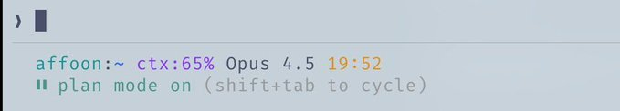

## 1. 核心概念与架构

### 技能 (Skills) 与 命令 (Commands)

- **定义**：
  - **Skills (技能)**：像规则一样运作，限定在特定范围和工作流中。是执行特定工作流的提示词简写。
  - **Commands (命令)**：通过斜杠 `/` 执行的技能。
- **位置区别**：
  - Skills: `~/.claude/skills` (更广泛的工作流定义)
  - Commands: `~/.claude/commands` (快速可执行的提示词)
- **特性**：
  - **链式调用**：支持在一个 prompt 中串联多个命令。例如：`/refactor-clean` (清理代码) -> `/tdd` (测试驱动开发) -> `/e2e` (端到端测试)。
- **示例**：
  - `codemap-updater.md`: 在检查点更新代码地图，方便 Claude 导航而不消耗过多上下文。https://github.com/affaan-m/everything-claude-code/blob/main/commands/update-codemaps.md

### 钩子 (Hooks)

- **定义**：基于特定事件触发的自动化操作。限制在工具调用和生命周期事件中。
- **类型**：
  - `PreToolUse`: 工具执行前 (验证、提醒)。
  - `PostToolUse`: 工具完成后 (格式化、反馈循环)。
  - `UserPromptSubmit`: 用户发送消息时。
  - `Stop`: Claude 完成响应时。
  - `PreCompact`: 上下文压缩前。
  - `Notification`: 权限请求。
- **技巧**：
  - 使用 `hookify` 插件通过对话方式创建 Hook，无需手动编写 JSON。
  - **实战示例**：在运行长时间命令前检查是否在 `tmux` 中；工具使用后自动运行 Prettier 格式化。

### 子代理 (Subagents)

- **定义**：主 Claude (编排者) 可以委托任务的进程。
- **特点**：
  - 范围有限，可后台或前台运行。
  - 可以独立使用特定的 Skills。
  - 支持沙盒化，配置特定的工具权限。
- **结构示例** (`~/.claude/agents/`):
  - `planner.md` (规划), `architect.md` (架构), `tdd-guide.md` (测试), `code-reviewer.md` (审查).

### 规则与记忆 (Rules and Memory)

- **存储位置**：`.rules` 文件夹下的 `.md` 文件。
- **两种方式**：
  1. 单个 `CLAUDE.md` (所有内容在一个文件中)。
  2. 模块化规则文件夹 (`~/.claude/rules/`)。
- **分类示例**：`security.md`, `coding-style.md`, `git-workflow.md`, `agents.md`。
- **具体规则举例**：代码库中无 Emoji、前端避免紫色色调、部署前必测试、禁止提交 `console.log`。


## 2. 扩展与集成

### MCPs (Model Context Protocol)

- **作用**：连接外部服务（如数据库、部署平台），不是替代 API，而是 Prompt 驱动的封装。
- **示例**：Supabase MCP (直接拉取数据/运行SQL), Chrome (控制浏览器点击测试)。
- **关键警告 (CRITICAL)**：**上下文窗口管理**。
  - 过多的工具会急剧消耗上下文（200k 窗口可能压缩前仅剩 70k）。
  - **黄金法则**：配置 20-30 个 MCP，但**每个项目仅启用约 10 个**（或保持活跃工具 < 80 个）。
  - 管理命令：`/plugins` 或 `/mcp`。

### 插件 (Plugins)

- **定义**：打包安装工具的方式（包含 Skill + MCP + Hooks）。
- **安装**：`claude plugin marketplace add [url]` -> `/plugins` 安装。
- **推荐插件类型**：
  - **LSP Plugins** (Language Server Protocol): 提供实时类型检查、跳转定义、智能补全。
    - `typescript-lsp`, `pyright-lsp`。
  - `hookify`: 对话式创建 Hook。
  - `mgrep`: 增强版搜索工具。


## 3. 工作流技巧与工具

### 键盘快捷键

- `Ctrl+U`: 删除整行。
- `!`: 快速 Bash 命令前缀。
- `@`: 搜索文件。
- `/`: 发起斜杠命令。
- `Shift+Enter`: 多行输入。
- `Tab`: 切换思考过程显示 (Thinking display)。
- `Esc Esc`: 中断 Claude / 恢复代码。

### 实用命令

- `/fork`: 分叉对话，并行处理不重叠的任务。
- `/rewind`: 回退到之前的状态。
- `/statusline`: 自定义状态栏 (显示分支、上下文%、待办事项)。
- `/checkpoints`: 文件级撤销点。
- `/compact`: 手动触发上下文压缩。
- `/mgrep`: 比 ripgrep 更强，支持本地 (`mgrep "function"`) 和网页搜索 (`mgrep --web "query"`)。

### 并行与长任务处理

- **Git Worktrees**: 用于并行运行多个 Claude 实例而不产生文件冲突。
- **tmux**: 用于长运行命令（如服务器启动），Claude 可以 detach/reattach 会话查看日志。

### 安全

- **Sandboxing**: 风险操作使用沙盒模式。
- **Permissions**: 小心使用 `--dangerously-skip-permissions`。


## 4. 编辑器集成

虽然 Claude Code 可在任何终端运行，但搭配编辑器效果更佳。

### Zed (作者首选)

- **优势**：
  - **Agent Panel**: 实时跟踪 Claude 的文件修改。
  - **性能**: Rust 编写，速度快，资源占用低。
  - **CMD+Shift+R**: 命令面板，快速访问自定义斜杠命令。
  - **集成**: 终端与编辑器分屏 (Ctrl+G 快速打开当前文件)。

### VSCode / Cursor

- 也可行，支持通过 `\ide` 启用 LSP 功能，或使用官方扩展。


## 5. 作者的完整配置参考 (My Setup)

### 已安装：（我通常一次只启用其中 4-5 个）

```markdown
ralph-wiggum@claude-code-plugins       # 循环自动化
frontend-design@claude-code-plugins    # UI/UX patterns
commit-commands@claude-code-plugins    # Git workflow
security-guidance@claude-code-plugins  # 安全检查
pr-review-toolkit@claude-code-plugins  # PR自动化
typescript-lsp@claude-plugins-official # TS intelligence
hookify@claude-plugins-official        # Hook creation
code-simplifier@claude-plugins-official
feature-dev@claude-code-plugins
explanatory-output-style@claude-code-plugins
code-review@claude-code-plugins
context7@claude-plugins-official       # Live documentation
pyright-lsp@claude-plugins-official    # Python types
mgrep@Mixedbread-Grep                  # Better search
```

- `ralph-wiggum` (循环自动化), `commit-commands` (Git流), `security-guidance`, `pr-review-toolkit` (PR自动化).
- `typescript-lsp` / `pyright-lsp` (代码智能).
- `hookify`, `mgrep`

### MCP Servers 配置

已配置（用户级别）：

```json
{
  "github": { "command": "npx", "args": ["-y", "@modelcontextprotocol/server-github"] },
  "firecrawl": { "command": "npx", "args": ["-y", "firecrawl-mcp"] },
  "supabase": {
    "command": "npx",
    "args": ["-y", "@supabase/mcp-server-supabase@latest", "--project-ref=YOUR_REF"]
  },
  "memory": { "command": "npx", "args": ["-y", "@modelcontextprotocol/server-memory"] },
  "sequential-thinking": {
    "command": "npx",
    "args": ["-y", "@modelcontextprotocol/server-sequential-thinking"]
  },
  "vercel": { "type": "http", "url": "https://mcp.vercel.com" },
  "railway": { "command": "npx", "args": ["-y", "@railway/mcp-server"] },
  "cloudflare-docs": { "type": "http", "url": "https://docs.mcp.cloudflare.com/mcp" },
  "cloudflare-workers-bindings": {
    "type": "http",
    "url": "https://bindings.mcp.cloudflare.com/mcp"
  },
  "cloudflare-workers-builds": { "type": "http", "url": "https://builds.mcp.cloudflare.com/mcp" },
  "cloudflare-observability": {
    "type": "http",
    "url": "https://observability.mcp.cloudflare.com/mcp"
  },
  "clickhouse": { "type": "http", "url": "https://mcp.clickhouse.cloud/mcp" },
  "AbletonMCP": { "command": "uvx", "args": ["ableton-mcp"] },
  "magic": { "command": "npx", "args": ["-y", "@magicuidesign/mcp@latest"] }
}
```

每个项目已禁用（上下文窗口管理）：

```markdown
# In ~/.claude.json under projects.[path].disabledMcpServers
disabledMcpServers: [
  "playwright",
  "cloudflare-workers-builds",
  "cloudflare-workers-bindings",
  "cloudflare-observability",
  "cloudflare-docs",
  "clickhouse",
  "AbletonMCP",
  "context7",
  "magic"
]
```

关键在于——我配置了 14 个 MCP，但每个项目只启用 5-6 个。这样可以保持上下文窗口的良好运行。

- **配置了 14+ 个，但按项目禁用大部分以节省上下文**。
- 常用：Github, Firecrawl, Supabase, Memory, Sequential Thinking, Vercel, Railway, Cloudflare (Docs/Workers), Clickhouse。
- **策略**：在 `~/.claude.json` 中使用 `disabledMcpServers` 禁用当前项目不需要的 MCP。

### 关键 Hooks 配置 (JSON)

```json
{
  "PreToolUse": [
    // tmux reminder for long-running commands
    { "matcher": "npm|pnpm|yarn|cargo|pytest", "hooks": ["tmux reminder"] },
    // Block unnecessary .md file creation
    { "matcher": "Write && .md file", "hooks": ["block unless README/CLAUDE"] },
    // Review before git push
    { "matcher": "git push", "hooks": ["open editor for review"] }
  ],
  "PostToolUse": [
    // Auto-format JS/TS with Prettier
    { "matcher": "Edit && .ts/.tsx/.js/.jsx", "hooks": ["prettier --write"] },
    // TypeScript check after edits
    { "matcher": "Edit && .ts/.tsx", "hooks": ["tsc --noEmit"] },
    // Warn about console.log
    { "matcher": "Edit", "hooks": ["grep console.log warning"] }
  ],
  "Stop": [
    // Audit for console.logs before session ends
    { "matcher": "*", "hooks": ["check modified files for console.log"] }
  ]
}
```


1. **PreToolUse**:
   - `npm/cargo/pytest` -> 提醒使用 `tmux`。
   - `Write .md` -> 阻止不必要的 md 文件创建。
   - `git push` -> 打开编辑器进行审查。
2. **PostToolUse**:
   - `Edit .ts/.js` -> 运行 `prettier --write`。
   - `Edit .ts` -> 运行 `tsc --noEmit` (类型检查)。
   - `Edit` -> `grep` 检查 `console.log` 警告。
3. **Stop**:
   - 会话结束前审计修改过的文件是否有 `console.log`。

**自定义状态行**

显示用户、目录、带有脏值指示器的 Git 分支、剩余上下文百分比、模型、时间和待办事项数量：




### 规则结构 (`~/.claude/rules/`)

```markdown
~/.claude/rules/
  security.md      # Mandatory security checks
  coding-style.md  # Immutability, file size limits
  testing.md       # TDD, 80% coverage
  git-workflow.md  # Conventional commits
  agents.md        # Subagent delegation rules
  patterns.md      # API response formats
  performance.md   # Model selection (Haiku vs Sonnet vs Opus)
  hooks.md         # Hook documentation
```

- `security.md` (强制安全检查)
- `coding-style.md` (不可变性, 文件大小限制)
- `testing.md` (TDD, 80% 覆盖率)
- `git-workflow.md` (Conventional Commits)
- `agents.md` (子代理委托规则)
- `patterns.md` (API 响应格式)
- `performance.md` (模型选择策略)

**次级代理商**

```markdown
~/.claude/agents/
  planner.md           # Break down features
  architect.md         # System design
  tdd-guide.md         # Write tests first
  code-reviewer.md     # Quality review
  security-reviewer.md # Vulnerability scan
  build-error-resolver.md
  e2e-runner.md        # Playwright tests
  refactor-cleaner.md  # Dead code removal
  doc-updater.md       # Keep docs synced
```


### 核心要点总结

1. **不要过度复杂化**：配置应像微调，而不是重新架构。
2. **上下文窗口很宝贵**：禁用不用的 MCP 和插件。
3. **并行执行**：使用 `/fork` 和 `git worktrees`。
4. **自动化重复工作**：使用 Hooks 处理格式化、代码检查、提醒等钩子
5. **限定子代理范围**：工具有限=执行更高效。