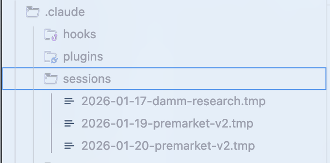

# Claude Code 上下文与内存

## 1. 基础：手动会话交接（Session Handover）

**核心理念**：通过“总结并存档”的方式，在不同会话（Session）之间传递关键信息，防止旧上下文污染新任务，同时保证任务连续性。

### 操作流程

1. **会话结束前**：使用工具或命令总结当前进度。
2. **生成交接文件**：
   - **位置**：建议存放在 `.claude` 文件夹中。
   - **格式**：使用 `.tmp` 或 `.md` 文件。
   - **内容要求**：
     - ✅ **有效的方法**（附带验证证据）。
     - ❌ **尝试过但无效的方法**（避免AI大模型重复踩坑）。
     - 🔍 **哪些方法尚未尝试**。
     - ⏳ **剩余待办事项** (To-Do List)。
3. **新会话开始**：
   - 创建一个新文件（避免旧的大量无关 Context）。
   - 仅提供上述“交接文件”的路径作为初始上下文。
4. **维护**：定期备份日志文件夹，或删除不再需要的会话记录。

> **适用场景**：当上下文窗口已满，但任务尚未完成，需要“重置”并继续进行复杂工作时。




## 2. 进阶：策略性上下文压缩（Strategic Compaction）

**核心理念**：从“被动压缩”转变为“主动管理”。避免 Claude 在任务执行中途自动压缩上下文导致丢失关键信息。

### 为什么需要手动压缩？

- **自动压缩的弊端**：发生在任意时间点，可能打断逻辑链。
- **手动压缩的优势**：
  - 在逻辑阶段之间进行（如：探索结束后，执行代码前）。
  - 在里程碑完成后，开始下一个任务前。

### 实施方案：[**Strategic Compact Skill**](https://github.com/affaan-m/everything-claude-code/tree/main/skills/strategic-compact)

利用 `PreToolUse` 钩子运行脚本，监控工具调用次数，并在达到阈值时建议用户进行压缩。

**脚本逻辑 (Bash 示例)**：

```bash
#!/bin/bash
# 监控工具调用次数
COUNTER_FILE="/tmp/claude-tool-count-$$"
THRESHOLD=${COMPACT_THRESHOLD:-50}

# 计数逻辑... (省略具体计数代码，见原文)

# 触发建议
if [ "$count" -eq "$THRESHOLD" ]; then
  echo "[建议] 已达到 $THRESHOLD 次工具调用 - 如果正处于阶段转换，请考虑使用 /compact" >&2
fi
```

**部署**：将其连接到编辑/写入操作的 `PreToolUse` 钩子。


## 3. 高级：动态系统提示注入 (System Prompt Injection)

**核心理念**：利用 CLI 命令将上下文直接注入到**系统提示符（System Prompt）**层级，而非作为用户消息或文件读取。

### 为什么这样做？（权限层级论）

Claude 处理指令的优先级遵循以下层级：

1. **System Prompt (最高权重)**：定义行为规则、核心约束。
2. **User Message**：具体的任务指令。
3. **Tool Output**：文件读取的内容（`@file`）。

通过 CLI 注入，可以确保核心规则不会被后续的对话冲淡。

### 实施方法

使用 `--system-prompt` 参数启动 Claude：

```bash
claude --system-prompt "$(cat memory.md)"
```

### 最佳实践：场景化别名 (Aliases)

[**System Prompt Context Example Files**](https://github.com/affaan-m/everything-claude-code/tree/main/contexts)

在 `.bashrc` 或 `.zshrc` 中设置不同模式的别名，实现一键切换上下文：

| **模式**        | **别名命令示例**  | **上下文文件焦点**                       |
| --------------- | ----------------- | ---------------------------------------- |
| **开发模式**    | `claude-dev`      | 侧重代码实现、架构规范 (`dev.md`)        |
| **Code Review** | `claude-review`   | 侧重安全性、代码质量标准 (`review.md`)   |
| **调研模式**    | `claude-research` | 侧重发散思维、行动前探索 (`research.md`) |

```bash
# Daily development
alias claude-dev='claude --system-prompt "$(cat ~/.claude/contexts/dev.md)"'

# PR review mode
alias claude-review='claude --system-prompt "$(cat ~/.claude/contexts/review.md)"'

# Research/exploration mode
alias claude-research='claude --system-prompt "$(cat ~/.claude/contexts/research.md)"'
```


## 4. 专家级：内存持久化钩子 (Memory Persistence Hooks)

**核心理念**：利用生命周期钩子（Lifecycle Hooks）完全自动化记忆的保存与加载，实现“无感”的跨会话记忆。

### 记忆流向图解

```Plaintext
会话 1                  会话 2
[启动]                  [启动]
  │                       │
  ▼                       ▼
Hook: SessionStart ◄──── 读取旧上下文 (Loading)
  │                       │
[工作阶段]              [基于旧记忆工作]
  │                       │
  ▼                       ▼
Hook: PreCompact ──────► 保存状态 (Saving)
  │
[系统压缩上下文]
  │
  ▼
Hook: Stop ────────────► 持久化存储 (Persisting)
```


### 核心工作流

利用以下三种钩子串联会话：

1. **SessionStart (会话启动)**
   - **动作**：自动加载过去 7 天的会话摘要或特定上下文。
   - **效果**：Claude 启动即“知情”。
2. **PreCompact (预压缩)**
   - **动作**：在系统执行上下文压缩（丢失细节）**之前**，将当前关键状态保存到文件。
   - **效果**：防止压缩导致的信息丢失。
3. **Stop (会话结束)**
   - **动作**：生成每日会话总结，记录开始/结束时间。
   - **效果**：持久化学习成果到磁盘，完整保留会话记录。

### 配置示例 (`config.json`)[**Memory Persistant Hooks**](https://github.com/affaan-m/everything-claude-code/tree/main/scripts/hooks/)

```json
{
  "hooks": {
    "PreCompact": [{
      "matcher": "*",
      "hooks": [{ "type": "command", "command": "~/.claude/hooks/pre-compact.sh" }]
    }],
    "SessionStart": [{
      "matcher": "*",
      "hooks": [{ "type": "command", "command": "~/.claude/hooks/session-start.sh" }]
    }],
    "Stop": [{
      "matcher": "*",
      "hooks": [{ "type": "command", "command": "~/.claude/hooks/session-end.sh" }]
    }]
  }
}
```


## 🔑 关键区别

|      操作      |   上下文   |    会话文件     |  使用场景  |
| :------------: | :--------: | :-------------: | :--------: |
|  **`/clear`**  | ❌ 完全清空 |     不更新      |  几乎不用  |
| **`/compact`** | ✅ 摘要保留 |     不更新      |  逻辑边界  |
|  **自动压缩**  | ✅ 摘要保留 | PreCompact 标记 | Token 满了 |
| **SessionEnd** | ✅ 保持不变 |    创建/更新    |  会话结束  |


## 💡 答案

**不是不需要清理，而是不需要 `/clear`：**

- ❌ **`/clear`** — 太暴力，丢失一切
- ✅ **`/compact`** — 在合适时机手动压缩  
- ✅ **自动压缩** — Token 满时触发，有 PreCompact 保护

> **记住：上下文不是垃圾，是资产。压缩不是清理，是归档。**

你的会话文件会持续累积知识，每次 **SessionStart** 都能加载之前的上下文。这就是**"内存持久化"**的真正价值。


 
