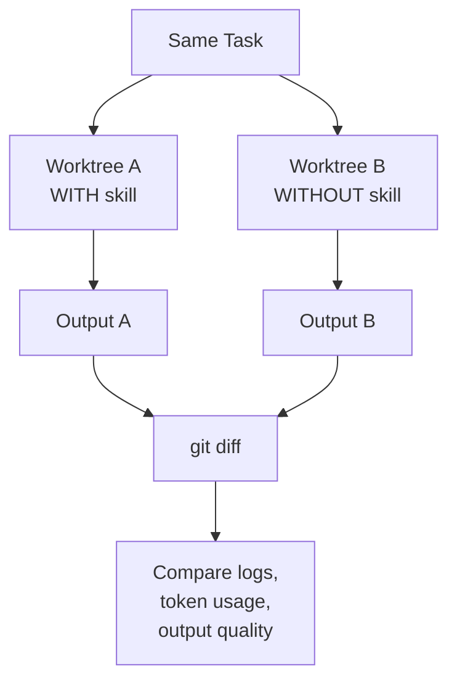

## 1. 可观测性与标准化 (Observability & Standardization)

为了有效地调整评估（Evals）和工具集（Harness），需要建立标准化的观察方法。

- **tmux 进程追踪 (Thinking Stream Tracing):**
  - 将 tmux 进程挂钩，实时追踪思维流（Thinking Stream）。
  - 在特定技能（Skill）被触发时输出日志。
- **PostToolUse 钩子 (Hooks):**
  - 设置钩子记录 Claude 具体执行了什么操作。
  - 精准记录产生的变更（Change）和输出结果（Output）。


## 2. 基准测试工作流 (Benchmarking Workflow)

通过对比“使用技能”与“不使用技能”的输出来量化相对性能。

**核心方法：**

1. **分叉对话 (Fork Conversation):** 针对同一任务创建两个分支。
2. **双工作树 (Worktrees):** 一个分支启用技能 (Worktree A)，另一个禁用 (Worktree B)。
3. **Diff 分析:** 最后拉取 `git diff` 并比较日志。

**流程图示：**




## 3. 评估模式类型 (Eval Pattern Types)

根据工作性质选择“基于检查点”或“持续性”评估。

| **特性**     | **基于检查点 (Checkpoint-Based)**       | **持续性评估 (Continuous Evals)**              |
| ------------ | --------------------------------------- | ---------------------------------------------- |
| **触发机制** | 在预设的里程碑处触发                    | 每 N 分钟或重大变更后触发                      |
| **流程**     | 验证通过 -> 继续 验证失败 -> 必须修复   | 计时器/变更 -> 运行测试/Lint -> 报告回归       |
| **适用场景** | **线性工作流** (具有明确阶段的功能实现) | **长会话/探索性重构** (无明确里程碑的维护工作) |
| **优势**     | 确保每个阶段稳扎稳打                    | 即时发现回归错误，防止技术债堆积               |

```
CHECKPOINT-BASED                         CONTINUOUS
─────────────────                        ──────────

  [Task 1]                                 [Work]
     │                                        │
     ▼                                        ▼
  ┌─────────┐                            ┌─────────┐
  │Checkpoint│◄── verify                 │ Timer/  │
  │   #1    │    criteria                │ Change  │
  └────┬────┘                            └────┬────┘
       │ pass?                                │
   ┌───┴───┐                                  ▼
   │       │                            ┌──────────┐
  yes     no ──► fix ──┐                │Run Tests │
   │              │    │                │  + Lint  │
   ▼              └────┘                └────┬─────┘
  [Task 2]                                   │
     │                                  ┌────┴────┐
     ▼                                  │         │
  ┌─────────┐                          pass     fail
  │Checkpoint│                          │         │
  │   #2    │                           ▼         ▼
  └────┬────┘                        [Continue] [Stop & Fix]
       │                                          │
      ...                                    └────┘

Best for: Linear workflows              Best for: Long sessions
with clear milestones                   exploratory refactoring
```

**技术债预防策略：**

- **干预机制:** 任务完成后强制 Claude 运行验证技能和 PostToolUse 钩子。
- **持续代码图谱 (Continuous Codemap):** 保持代码图谱的实时更新，使其成为仓库之外的“真理来源 (Source of Truth)”，防止死代码和文件混乱。


## 4. 评分器类型 (Grader Types)

1. **基于代码 (Code-Based):**
   - **方法:** 字符串匹配、二进制测试、静态分析。
   - **特点:** 快、便宜、客观，但对有效变体（Valid Variations）脆弱。
2. **基于模型 (Model-Based):**
   - **方法:** 评分量表 (Rubric scoring)、自然语言断言、成对比较。
   - **特点:** 灵活、能处理细微差别，但非确定性且昂贵。
3. **人工评分 (Human Graders):**
   - **方法:** 专家审查 (SME review)、众包判断。
   - **特点:** 质量金标准，但最贵且最慢。


## 5. 关键指标 (Key Metrics)

选择指标取决于你对**可能性**与**一致性**的需求。

- **pass@k (关注可能性):**
  - **定义:** $k$ 次尝试中，**至少有 1 次**成功。
  - **应用:** 当你只需要它行得通，且有验证反馈机制时使用。
  - *示例:* $k=5$ 时成功率 97% -> 只要试得够多就能成。
- **pass^k (关注一致性):**
  - **定义:** **所有 $k$ 次**尝试都必须成功。
  - **应用:** 当一致性至关重要，需要近乎确定性的输出质量/风格时使用。
  - *示例:* $k=5$ 时成功率 17% -> 很难连续成功，反映了高难度或低稳定性。


## 6. 评估路线图构建 (Building an Eval Roadmap)

*(参考来源：Anthropic)*

1. **尽早开始:** 从 20-50 个基于真实失败案例的简单任务开始。
2. **转化失败:** 将用户报告的失败转化为测试用例。
3. **任务明确:** 任务描述应无歧义（两位专家应能得出相同结论）。
4. **平衡数据集:** 包含应该发生行为和**不应该**发生行为的案例。
5. **稳健的工具集 (Robust Harness):** 每次试验都从干净的环境开始。
6. **关注结果:** 评分对象是 Agent 的产出，而不是它采取的路径。
7. **监控饱和度:** 如果通过率达到 100%，说明需要添加更难的测试。