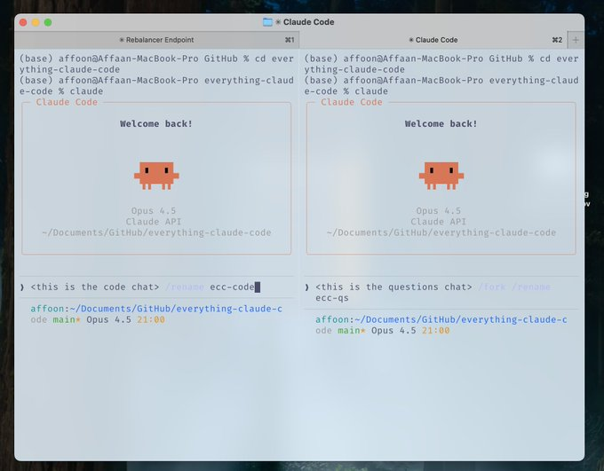

这里是为您整理的关于 **AI 辅助项目启动与工作流 (Groundwork & Workflow)** 的笔记。

------

# 🛠️ Project Groundwork & AI Workflow Notes

## 1. 核心原则：基础的重要性 (The Foundation)

- **现状：** 随着代码库的复杂度和规模增加，技术债务 (Tech Debt) 也会随之增加。
- **对策：** 在项目初期打好基础至关重要。除了配置 Claude，还需要遵循明确的规则来管理复杂性。

## 2. 启动模式：双实例并行 (The Two-Instance Kickoff Pattern)

建议在新建空仓库时，同时开启两个 Claude 实例，分工协作：

### 🤖 实例 1：脚手架代理 (Scaffolding Agent)

- **主要职责：** 铺设项目基础架构。
- **具体任务：**
  - 创建项目目录结构 (Project structure)。
  - 设置配置文件（如 `CLAUDE.md`, 规则, agents 等）。
  - 确立代码规范与惯例 (Conventions)。
  - 搭建项目骨架 (Skeleton)。

### 🕵️ 实例 2：深度调研代理 (Deep Research Agent)

- **主要职责：** 连接外部服务与文档，提供信息支持。
- **具体任务：**
  - 执行联网搜索 (Web search)。
  - 撰写详细的产品需求文档 (PRD)。
  - 绘制架构图 (Mermaid diagrams)。
  - 从官方文档中提取并编译参考资料 (Reference compilation)。

------

## 3. 操作设置与技巧 (Operational Setup)

### 🖥️ 终端布局 (Terminal Layout)

- **左侧终端：** 专注编码 (Coding)。
- **右侧终端：** 专注提问 (Questions) —— 善用 `/rename` 和 `/fork` 命令。
- **目的：** 避免频繁手动复制上下文或依赖爬虫，防止模型使用过时的语法或端点。

### 📄 `llms.txt` 模式

- **方法：** 在许多技术文档 URL 后添加 `/llms.txt` (例如: `helius.dev/docs/llms.txt`)。
- **优势：** 获取一份专为 LLM 优化的干净文档版本，直接投喂给 Claude，避免解析错误。

------

## 4. 核心哲学：构建可复用模式 (Build Reusable Patterns)

> *"Early on, I spent time building reusable workflows/patterns... this had a wild compounding effect." — @omarsar0*

- **观点：** 投资于“模式” (Patterns) 优于投资于特定模型的“技巧” (Tricks)。
- **价值：** 模式具有复利效应，且在模型升级后依然有效 (Transferable)。
- **高回报的投资领域：**
  - Subagents (子代理)
  - Skills (技能库)
  - Commands (指令集)
  - Planning patterns (规划模式)
  - MCP tools (模型上下文协议工具)
  - Context engineering patterns (上下文工程模式)

------

### 💡 下一步建议

您是否需要我为您生成一份 **`CLAUDE.md` 的基础模板**，或者是 **项目启动的 Checklist**？