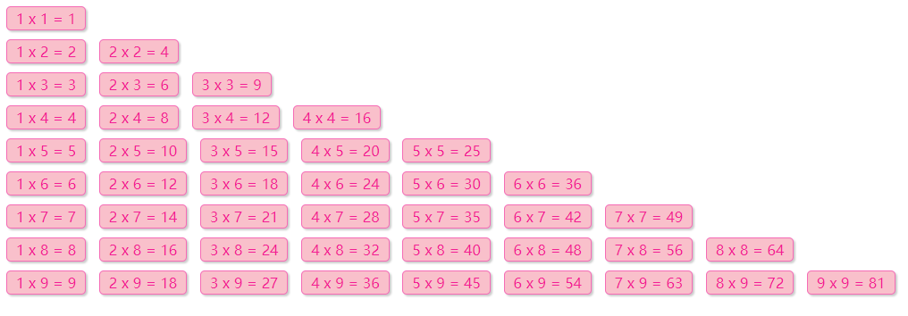

## 一、循环嵌套

### 1.1 基本概念

循环嵌套指在一个循环语句内部包含另一个循环。类比天文现象：地球**自转**（内层循环）的同时围绕太阳**公转**（外层循环）。

**核心原则**：外层循环执行一次，内层循环执行完整的一轮。

### 1.2 基本语法

```javascript
for (初始化; 循环条件; 变量计数) {
    for (初始化; 循环条件; 变量计数) {
        // 重复执行的代码
    }
}
```

### 1.3 应用示例

**示例 1：每日单词记忆**

```javascript
// 外层循环：记录第 n 天
for (let i = 1; i < 4; i++) {
    document.write(`第${i}天 <br>`);
    
    // 内层循环：记录单词数量
    for (let j = 1; j < 6; j++) {
        document.write(`记住第${j}个单词<br>`);
    }
}
```

**示例 2：打印三角形**

```javascript
// 外层控制行数
for (let i = 1; i <= 5; i++) {
    // 内层控制每行星星数（与行号相等）
    for (let j = 1; j <= i; j++) {
        document.write('★');
    }
    document.write('<br>');
}
// 输出：
// ★
// ★★
// ★★★
// ★★★★
// ★★★★★
```

**示例 3：九九乘法表**

```css
/* 样式定义 */
span {
    display: inline-block;
    width: 100px;
    padding: 5px 10px;
    border: 1px solid pink;
    margin: 2px;
    border-radius: 5px;
    box-shadow: 2px 2px 2px rgba(255, 192, 203, .4);
    background-color: rgba(255, 192, 203, .1);
    text-align: center;
    color: hotpink;
}
```

```javascript
// 外层：控制行数（1-9）
for (let i = 1; i <= 9; i++) {
    // 内层：控制每行列数（不超过当前行号）
    for (let j = 1; j <= i; j++) {
        document.write(`
            <span>${j} × ${i} = ${j * i}</span>
        `);
    }
    document.write('<br>');
}
```




## 二、数组（Array）

### 2.1 什么是数组？

| 特性         | 说明                                                 |
| :----------- | :--------------------------------------------------- |
| **定义**     | 一种引用数据类型，用于在单个变量名下存储**多个数据** |
| **索引**     | 从 `0` 开始编号，用于定位数组中的具体元素            |
| **元素类型** | 可存储任意数据类型（字符串、数字、布尔值等）         |

### 2.2 数组的定义与访问

```javascript
// 1. 定义空数组
let emptyArr = [];

// 2. 定义非空数组
let classes = ['小明', '小刚', '小红', '小丽', '小米'];

// 3. 通过索引访问元素
console.log(classes[0]);  // '小明'（第一个元素）
console.log(classes[2]);  // '小红'
console.log(classes[5]);  // undefined（索引超出范围）

// 4. 数组元素可以是任意类型
let mixed = ['HTML', 100, true, null];
```

### 2.3 数组遍历

使用 `for` 循环结合 `length` 属性遍历数组：

```javascript
let stars = ['迪丽热巴', '古力娜扎', '佟丽娅', '玛尔扎哈', '哈尼克孜'];

// 💡 技巧：使用 arr.length 获取数组长度，避免硬编码
for (let i = 0; i < stars.length; i++) {
    console.log(stars[i]);
}
```


## 三、数组操作（增删改查）

### 3.1 查询与修改

| 操作     | 语法                | 说明                                 |
| :------- | :------------------ | :----------------------------------- |
| **查询** | `数组[索引]`        | 索引不存在返回 `undefined`           |
| **修改** | `数组[索引] = 新值` | 索引不存在则**新增元素**（⚠️ 不推荐） |

```javascript
let arr = ['迪丽热巴', '古力娜扎'];

// 查询
console.log(arr[0]);      // '迪丽热巴'
console.log(arr[2]);      // undefined

// 修改
arr[1] = '佟丽娅';        // 正常修改
arr[3] = '古力娜扎';      // ⚠️ 索引3不存在，会新增元素并改变数组长度
```

### 3.2 新增元素

| 方法               | 作用                         | 返回值       |
| :----------------- | :--------------------------- | :----------- |
| `push(元素...)`    | 在**末尾**添加一个或多个元素 | 新数组的长度 |
| `unshift(元素...)` | 在**开头**添加一个或多个元素 | 新数组的长度 |

```javascript
let arr = ['迪丽热巴'];

// 末尾添加
arr.push('佟丽娅');           // 返回 2
arr.push('古力娜扎', '杨幂');  // 可同时添加多个

// 开头添加
arr.unshift('刘亦菲');         // 返回 5
```

### 3.3 删除元素

| 方法      | 作用                 | 返回值       |
| :-------- | :------------------- | :----------- |
| `pop()`   | 删除**最后一个**元素 | 被删除的元素 |
| `shift()` | 删除**第一个**元素   | 被删除的元素 |

```javascript
let colors = ['red', 'green', 'blue'];

colors.pop();      // 删除 'blue'，返回 'blue'
colors.shift();    // 删除 'red'，返回 'red'
// 结果：['green']
```

### 3.4 splice() 方法（万能方法）

`splice()` 可在任意位置**删除**或**添加**元素，⚠️ **会修改原数组**。

**语法**：`数组.splice(start, deleteCount, item1, item2, ...)`

| 参数              | 说明                                     |
| :---------------- | :--------------------------------------- |
| `start`           | 起始索引（从0开始）                      |
| `deleteCount`     | 删除的元素个数（可选，省略则删除到末尾） |
| `item1, item2...` | 要添加的新元素（可选）                   |

```javascript
let arr = ['迪丽热巴', '古力娜扎', '佟丽娅', '玛尔扎哈'];

// 1. 删除：从索引1开始删除1个元素
arr.splice(1, 1);  
// 结果：['迪丽热巴', '佟丽娅', '玛尔扎哈']

// 2. 删除到末尾：从索引1开始删除所有
arr.splice(1);  
// 结果：['迪丽热巴']

// 3. 新增：在索引1位置添加元素（删除0个）
arr.splice(1, 0, '刘德华', 'pink老师');  
// 结果：['迪丽热巴', '刘德华', 'pink老师', '古力娜扎', ...]

// 💡 技巧：操作开头/结尾用 pop/push/shift/unshift，操作中间用 splice
```


## 四、综合案例

### 4.1 手风琴效果

**核心技巧**：利用循环拼接字符串（原理类似累加求和）

1. 声明空字符串 `str = ''`
2. 循环中使用 `+=` 拼接 HTML 结构
3. 将拼接结果插入容器

```javascript
let images = [
    './images/1.jpg',
    './images/2.jpg',
    './images/3.jpg',
    './images/4.jpg',
    './images/5.jpg',
    './images/6.jpg',
    './images/7.jpg'
];

// 1. 声明空字符串
let str = '';

// 2. 循环拼接
for (let i = 0; i < images.length; i++) {
    str += `
        <div>
            
        </div>
    `;
}

// 3. 渲染到页面
document.write(`
    <div class="box">
        ${str}
    </div>
`);
```

**配套 CSS**：

```css
.box {
    display: flex;
    overflow: hidden;
    width: 1120px;
    height: 260px;
    margin: 50px auto;
}

.box > div {
    width: 120px;
    border: 1px solid #fff;
    transition: all 0.5s;
}

.box > div:hover {
    width: 400px;  /* 悬停展开效果 */
}
```

### 4.2 动态柱形图

**需求**：用户输入四个季度的数据，生成可视化柱形图。

**实现思路**：

1. **数据收集**：循环弹出输入框，将4个数据存入数组
2. **渲染图表**：遍历数组，拼接生成带样式的柱子 HTML

```javascript
// ========== 步骤1：收集数据 ==========
let data = [];

for (let i = 1; i <= 4; i++) {
    let num = +prompt(`请输入第${i}季度的销售额（单位：万）`);
    data.push(num);
}

// ========== 步骤2：渲染图表 ==========
let htmlStr = '';

for (let i = 0; i < data.length; i++) {
    htmlStr += `
        <div style="height: ${data[i]}px;" 
             title="第${i + 1}季度 - ${data[i]}万">
            <span>${data[i]}万</span>
            <h4>第${i + 1}季度</h4>
        </div>
    `;
}

document.write(`
    <h3 class="title">2099年季度销售数额（单位：万）</h3>
    <div class="box">
        ${htmlStr}
    </div>
`);
```

**配套 CSS**（节选）：

```css
.box {
    display: flex;
    justify-content: space-around;
    align-items: flex-end;
    width: 800px;
    min-height: 300px;
    border-left: 1px solid #4b578f;
    border-bottom: 1px solid #4b578f;
    margin: 0 auto;
}

.box > div {
    width: 40px;
    background: linear-gradient(#3c99ff, #4489d0, #2283e4);
    border-radius: 8px 8px 0 0;
    transition: all .2s;
}

.box > div:hover {
    animation: glow .5s alternate infinite;
}

@keyframes glow {
    to {
        box-shadow: 0 5px 29px rgba(53, 111, 226, 0.88);
    }
}
```


## 五、拓展知识

### 5.1 数组排序 sort()

```javascript
let scores = [88, 78, 100, 34, 99];

// ⚠️ 注意：默认 sort() 按字符串排序，可能产生意外结果
// scores.sort();  // [100, 34, 78, 88, 99] —— 不正确！

// 正确做法：传入比较函数
// 升序
scores.sort((a, b) => a - b);  
// 结果：[34, 78, 88, 99, 100]

// 降序
scores.sort((a, b) => b - a);  
// 结果：[100, 99, 88, 78, 34]

// 获取最值
let max = scores[0];                    // 最大值
let min = scores[scores.length - 1];    // 最小值
```

### 5.2 选择排序算法（了解）

**原理**：每一轮从剩余元素中找出最小（或最大）值，放到已排序序列的末尾。

```javascript
let arr = [4, 2, 5, 1, 3];

// 外层：控制比较轮数（n-1轮）
for (let i = 0; i < arr.length - 1; i++) {
    let minIndex = i;  // 假设当前位置最小
    
    // 内层：查找真实最小值的索引
    for (let j = i + 1; j < arr.length; j++) {
        if (arr[j] < arr[minIndex]) {
            minIndex = j;
        }
    }
    
    // 交换位置（如果最小值不在当前位置）
    if (minIndex !== i) {
        let temp = arr[minIndex];
        arr[minIndex] = arr[i];
        arr[i] = temp;
    }
}

console.log(arr);  // [1, 2, 3, 4, 5]
```

💡 **可视化学习**：访问 [VisualGo](https://visualgo.net/zh/sorting) 查看排序算法动画演示。


## 核心知识点速查表

| 概念     | 关键语法/方法                          | 注意事项           |
| :------- | :------------------------------------- | :----------------- |
| 循环嵌套 | `for` 内嵌 `for`                       | 外层一次，内层一轮 |
| 数组定义 | `let arr = []` / `let arr = [1, 2, 3]` | 索引从 `0` 开始    |
| 数组长度 | `arr.length`                           | 遍历时常用         |
| 末尾操作 | `push()` / `pop()`                     | 修改原数组         |
| 开头操作 | `unshift()` / `shift()`                | 修改原数组         |
| 任意位置 | `splice(start, deleteCount, items...)` | 万能方法           |
| 数组排序 | `sort((a, b) => a - b)`                | 必须传入比较函数   |
