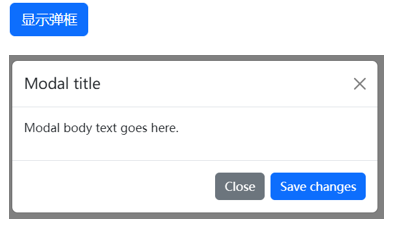
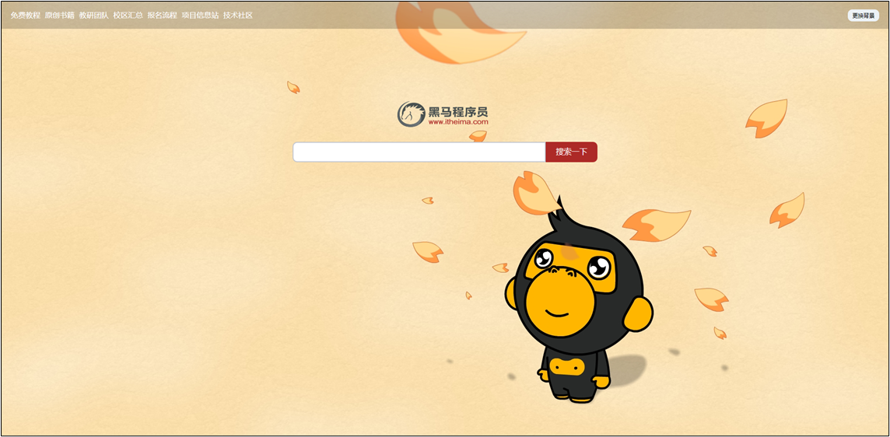
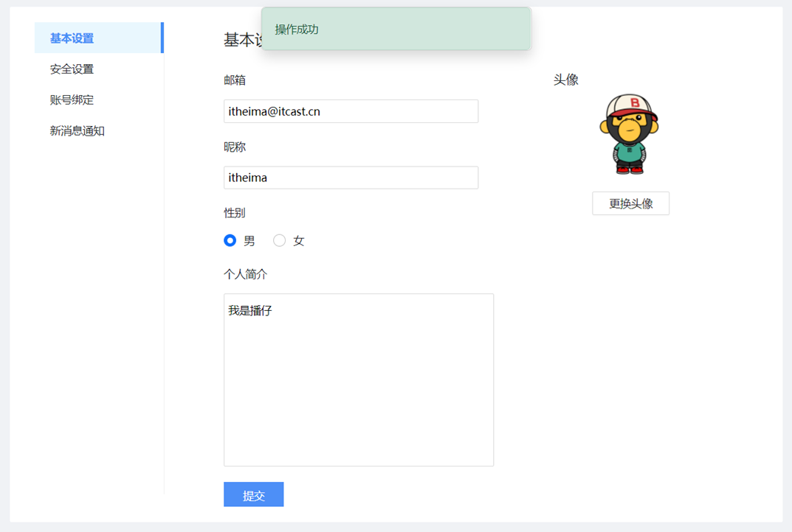

## 一、Bootstrap 弹框

### 1.1 属性控制

Bootstrap 弹框可在不离开当前页面的情况下，显示独立内容供用户操作。

**控制弹框显示与隐藏的属性：**

| 属性                      | 作用                       | 示例                                                         |
| :------------------------ | :------------------------- | :----------------------------------------------------------- |
| `data-bs-toggle="modal"`  | 触发弹框显示               | `<button data-bs-toggle="modal" data-bs-target=".my-box">显示弹框</button>` |
| `data-bs-target`          | 指定目标弹框（CSS 选择器） | `data-bs-target=".my-box"`                                   |
| `data-bs-dismiss="modal"` | 关闭当前弹框               | `<button data-bs-dismiss="modal">Close</button>`             |

**基础结构示例：**



```html
<!DOCTYPE html>
<html lang="zh-CN">
<head>
  <meta charset="UTF-8">
  <title>Bootstrap 弹框</title>
  <!-- 引入 bootstrap.css -->
  <link href="https://cdn.jsdelivr.net/npm/bootstrap@5.2.2/dist/css/bootstrap.min.css" rel="stylesheet">
</head>
<body>
  <!-- 触发按钮 -->
  <button type="button" class="btn btn-primary" data-bs-toggle="modal" data-bs-target=".my-box">
    显示弹框
  </button>

  <!-- 弹框结构 -->
  <div class="modal my-box" tabindex="-1">
    <div class="modal-dialog">
      <div class="modal-content">
        <!-- 弹框头部 -->
        <div class="modal-header">
          <h5 class="modal-title">Modal title</h5>
          <button type="button" class="btn-close" data-bs-dismiss="modal" aria-label="Close"></button>
        </div>
        <!-- 弹框身体 -->
        <div class="modal-body">
          <p>Modal body text goes here.</p>
        </div>
        <!-- 弹框底部 -->
        <div class="modal-footer">
          <button type="button" class="btn btn-secondary" data-bs-dismiss="modal">Close</button>
          <button type="button" class="btn btn-primary">Save changes</button>
        </div>
      </div>
    </div>
  </div>

  <!-- 引入 bootstrap.js -->
  <script src="https://cdn.jsdelivr.net/npm/bootstrap@5.2.2/dist/js/bootstrap.min.js"></script>
</body>
</html>
```

### 1.2 JS 控制

当需要在弹框显示或隐藏前执行 JS 逻辑时，应使用 JS 方式控制。

**核心语法：**

```js
// 1. 创建弹框对象
const modalDom = document.querySelector('CSS选择器')
const modal = new bootstrap.Modal(modalDom)

// 2. 显示弹框
modal.show()

// 3. 隐藏弹框
modal.hide()
```

**典型应用场景：** 点击编辑按钮时，先在输入框填入默认姓名，再显示弹框；点击保存按钮时，先获取用户输入并打印，再隐藏弹框。

```js
// 创建弹框对象
const modalDom = document.querySelector('.name-box')
const modal = new bootstrap.Modal(modalDom)

// 编辑姓名 -> 点击 -> 赋予默认姓名 -> 弹框显示
document.querySelector('.edit-btn').addEventListener('click', () => {
  document.querySelector('.username').value = '默认姓名'
  modal.show() // 显示弹框
})

// 保存 -> 点击 -> 获取姓名打印 -> 弹框隐藏
document.querySelector('.save-btn').addEventListener('click', () => {
  const username = document.querySelector('.username').value
  console.log('模拟把姓名保存到服务器上', username)
  modal.hide() // 隐藏弹框
})
```

💡 **选择建议：** 直接显示/隐藏用属性方式；需要先执行 JS 逻辑再显示/隐藏，用 JS 方式。


## 二、图书管理案例（增删改查）

### 2.1 渲染图书列表

**核心思路：** 获取数据 → 渲染数据

```js
const creator = '老张' // 外号，用于区分不同用户的数据

/**
 * 封装：获取并渲染图书列表
 * 因为增删改后都需要刷新列表，所以封装为函数方便复用
 */
function getBooksList() {
  // 1. 获取数据
  axios({
    url: 'http://hmajax.itheima.net/api/books',
    params: { creator } // 通过外号获取对应数据
  }).then(result => {
    const bookList = result.data.data
    
    // 2. 渲染数据：使用 map 生成 HTML 字符串，再用 join 拼接
    const htmlStr = bookList.map((item, index) => {
      return `<tr>
        <td>${index + 1}</td>
        <td>${item.bookname}</td>
        <td>${item.author}</td>
        <td>${item.publisher}</td>
        <td data-id=${item.id}>
          <span class="del">删除</span>
          <span class="edit">编辑</span>
        </td>
      </tr>`
    }).join('')
    
    document.querySelector('.list').innerHTML = htmlStr
  })
}

// 网页加载时，获取并渲染列表一次
getBooksList()
```

### 2.2 新增图书

**核心思路：** 准备弹框 → 收集数据提交 → 刷新列表

```js
// 1. 创建新增弹框对象
const addModalDom = document.querySelector('.add-modal')
const addModal = new bootstrap.Modal(addModalDom)

// 2. 保存按钮点击事件
document.querySelector('.add-btn').addEventListener('click', () => {
  // 2.1 收集表单数据
  const addForm = document.querySelector('.add-form')
  const bookObj = serialize(addForm, { hash: true, empty: true })
  
  // 2.2 提交到服务器保存
  axios({
    url: 'http://hmajax.itheima.net/api/books',
    method: 'POST',
    data: {
      ...bookObj,  // 展开表单数据
      creator      // 携带外号
    }
  }).then(result => {
    // 2.3 添加成功后，重新请求并渲染图书列表
    getBooksList()
    
    // 重置表单并隐藏弹框
    addForm.reset()
    addModal.hide()
  })
})
```

### 2.3 删除图书

**核心思路：** 绑定点击事件（获取图书 ID）→ 调用删除接口 → 刷新列表

```js
// 使用事件委托，在列表容器上绑定点击事件
document.querySelector('.list').addEventListener('click', e => {
  // 判断点击的是否为删除元素
  if (e.target.classList.contains('del')) {
    // 获取图书 id（从自定义属性 data-id 中读取）
    const theId = e.target.parentNode.dataset.id
    
    // 调用删除接口
    axios({
      url: `http://hmajax.itheima.net/api/books/${theId}`,
      method: 'DELETE'
    }).then(() => {
      // 删除成功后，刷新图书列表
      getBooksList()
    })
  }
})
```

### 2.4 编辑图书

**核心思路：** 获取当前数据并回显 → 收集修改后数据提交 → 刷新列表

```js
// 1. 创建编辑弹框对象
const editDom = document.querySelector('.edit-modal')
const editModal = new bootstrap.Modal(editDom)

// 2. 编辑元素点击事件（事件委托）
document.querySelector('.list').addEventListener('click', e => {
  if (e.target.classList.contains('edit')) {
    // 2.1 获取当前编辑图书的 id
    const theId = e.target.parentNode.dataset.id
    
    // 2.2 调用查询详情接口，获取数据并回显到表单
    axios({
      url: `http://hmajax.itheima.net/api/books/${theId}`
    }).then(result => {
      const bookObj = result.data.data
      
      // 遍历数据对象，使用属性名匹配类名，快速赋值
      const keys = Object.keys(bookObj) // ['id', 'bookname', 'author', 'publisher']
      keys.forEach(key => {
        document.querySelector(`.edit-form .${key}`).value = bookObj[key]
      })
    })
    
    editModal.show() // 显示编辑弹框
  }
})

// 3. 修改按钮点击事件
document.querySelector('.edit-btn').addEventListener('click', () => {
  // 3.1 收集编辑表单数据
  const editForm = document.querySelector('.edit-form')
  const { id, bookname, author, publisher } = serialize(editForm, { hash: true, empty: true })
  
  // ⚠️ 注意：id 通过隐藏域携带，无需用户修改
  // <input type="hidden" class="id" name="id" value="84783">
  
  // 3.2 提交保存修改
  axios({
    url: `http://hmajax.itheima.net/api/books/${id}`,
    method: 'PUT',
    data: {
      bookname,
      author,
      publisher,
      creator
    }
  }).then(() => {
    // 修改成功后，重新获取并刷新列表
    getBooksList()
    editModal.hide() // 隐藏弹框
  })
})
```

### 2.5 增删改查核心思路总结

| 操作           | 核心步骤                           | 关键代码特征                              |
| :------------- | :--------------------------------- | :---------------------------------------- |
| **查（渲染）** | 获取数据 → 渲染数据                | `axios` GET 请求 + `map` 生成 HTML        |
| **增（新增）** | 准备弹框 → 收集数据提交 → 刷新列表 | `axios` POST 请求 + `form.reset()`        |
| **删（删除）** | 获取 ID → 调用删除接口 → 刷新列表  | `axios` DELETE 请求 + 事件委托            |
| **改（编辑）** | 回显数据 → 收集修改提交 → 刷新列表 | `axios` PUT 请求 + `Object.keys` 遍历回显 |

💡 **通用规律：** 增删改查的核心流程相通，只是请求方法和业务细节不同，掌握一套即可迁移到各类数据管理场景。


## 三、图片上传

### 3.1 基本流程

图片上传是将本地图片提交到服务器保存，获取服务器返回的图片 URL，再通过 `img` 标签加载显示。

**为什么上传到服务器？** 浏览器本地保存是临时的，上传到服务器才能随时随地访问。

**核心步骤：**

1. 通过文件选择元素获取用户选择的本地文件
2. 使用 `FormData` 对象装入文件（图片是文件流，不是普通字符串）
3. 提交到服务器，获取返回的图片 URL
4. 将 URL 设置到 `img` 标签的 `src` 属性中显示

### 3.2 核心代码

```html
<!DOCTYPE html>
<html lang="zh-CN">
<head>
  <meta charset="UTF-8">
  <title>图片上传</title>
</head>
<body>
  <!-- 文件选择元素 -->
  <input type="file" class="upload">
  <!-- 图片预览 -->
  

  <script src="https://cdn.jsdelivr.net/npm/axios/dist/axios.min.js"></script>
  <script>
    /**
     * 图片上传流程：
     *  1. 获取图片文件
     *  2. 使用 FormData 携带图片文件
     *  3. 提交到服务器，获取图片 URL 并显示
     */
    document.querySelector('.upload').addEventListener('change', e => {
      // 1. 获取图片文件对象
      console.log(e.target.files[0])
      
      // 2. 使用 FormData 携带图片文件
      const fd = new FormData()
      fd.append('img', e.target.files[0])
      
      // 3. 提交到服务器
      axios({
        url: 'http://hmajax.itheima.net/api/uploadimg',
        method: 'POST',
        data: fd
      }).then(result => {
        console.log(result)
        // 取出图片 URL，设置到 img 标签显示
        const imgUrl = result.data.data.url
        document.querySelector('.my-img').src = imgUrl
      })
    })
  </script>
</body>
</html>
```


## 四、网站换肤案例



### 4.1 需求与实现

实现更换网站背景图的效果，并保证刷新后背景图依然存在。

**实现步骤：**

1. 获取用户选择的背景图片，上传并将服务器返回的 URL 设置为 `body` 背景
2. 上传成功时，将图片 URL 保存到 `localStorage`
3. 网页运行后，从 `localStorage` 读取 URL 并设置背景（需判断是否存在）

### 4.2 核心代码

```js
/**
 * 网站换肤实现：
 *  1. 选择图片上传，设置 body 背景
 *  2. 上传成功时，"保存"图片 URL 到 localStorage
 *  3. 网页运行后，"获取" URL 并应用
 */

// 1. 监听文件选择变化事件
document.querySelector('.bg-ipt').addEventListener('change', e => {
  const fd = new FormData()
  fd.append('img', e.target.files[0])
  
  // 上传图片到服务器
  axios({
    url: 'http://hmajax.itheima.net/api/uploadimg',
    method: 'POST',
    data: fd
  }).then(result => {
    const imgUrl = result.data.data.url
    
    // 设置 body 背景图
    document.body.style.backgroundImage = `url(${imgUrl})`
    
    // 2. 保存图片 URL 到本地存储
    localStorage.setItem('bgImg', imgUrl)
  })
})

// 3. 网页加载时，读取本地存储的背景图 URL
const bgUrl = localStorage.getItem('bgUrl')
console.log(bgUrl)

// 短路运算：只有当 bgUrl 存在时才设置背景
bgUrl && (document.body.style.backgroundImage = `url(${bgUrl})`)
```

| `localStorage` 方法   | 作用     | 示例                                    |
| :-------------------- | :------- | :-------------------------------------- |
| `setItem(key, value)` | 存储数据 | `localStorage.setItem('bgImg', imgUrl)` |
| `getItem(key)`        | 读取数据 | `localStorage.getItem('bgImg')`         |


## 五、个人信息设置案例



### 5.1 信息渲染

将外号对应的用户信息和头像渲染到页面表单中。

```js
const creator = '播仔' // 外号，用于获取对应用户数据

/**
 * 信息渲染：
 *  1. 获取用户数据
 *  2. 回显数据到对应标签
 */
axios({
  url: 'http://hmajax.itheima.net/api/settings',
  params: { creator }
}).then(result => {
  const userObj = result.data.data
  
  // 遍历数据对象，根据 key 回显到对应标签
  Object.keys(userObj).forEach(key => {
    if (key === 'avatar') {
      // 头像：设置到 img 标签的 src
      document.querySelector('.prew').src = userObj[key]
    } else if (key === 'gender') {
      // 性别：0 男，1 女，通过下标选中对应单选框
      const gRadioList = document.querySelectorAll('.gender')
      const gNum = userObj[key]
      gRadioList[gNum].checked = true
    } else {
      // 其他普通字段：设置到对应输入框
      document.querySelector(`.${key}`).value = userObj[key]
    }
  })
})
```

### 5.2 头像修改

修改用户头像并立即生效，刷新后仍为修改后的头像。

```js
/**
 * 头像修改：
 *  1. 获取头像文件
 *  2. 提交服务器并更新头像
 */
document.querySelector('.upload').addEventListener('change', e => {
  // 1. 获取头像文件
  const fd = new FormData()
  fd.append('avatar', e.target.files[0])
  fd.append('creator', creator) // ⚠️ 必须携带外号，服务器需知道保存到哪个用户下
  
  // 2. 提交到服务器
  axios({
    url: 'http://hmajax.itheima.net/api/avatar',
    method: 'PUT',
    data: fd
  }).then(result => {
    const imgUrl = result.data.data.avatar
    // 将新头像回显到页面上
    document.querySelector('.prew').src = imgUrl
  })
})
```

### 5.3 信息修改

收集用户修改后的信息，提交到服务器保存。

```js
/**
 * 信息修改：
 *  1. 收集表单信息
 *  2. 提交到服务器保存
 */
document.querySelector('.submit').addEventListener('click', () => {
  // 1. 收集表单数据
  const userForm = document.querySelector('.user-form')
  const userObj = serialize(userForm, { hash: true, empty: true })
  userObj.creator = creator
  
  // 性别是数字字符串，转成数字类型
  userObj.gender = +userObj.gender
  console.log(userObj)
  
  // 2. 提交到服务器保存（PUT 请求表示更新）
  axios({
    url: 'http://hmajax.itheima.net/api/settings',
    method: 'PUT',
    data: userObj
  }).then(result => {
    // 页面数据已是最新，无需重新获取刷新
  })
})
```

### 5.4 结果提示框

使用 Bootstrap Toast 提示框反馈操作结果给用户。

**Toast 使用步骤：**

1. 准备标签结构（模板中已提供）
2. 设置自动消失延迟时间：`data-bs-delay="1500"`
3. 使用 JS 创建 Toast 对象并显示

```html
<!-- 提示框结构 -->
<div class="toast my-toast" data-bs-delay="1500">
  <div class="toast-body">
    保存成功
  </div>
</div>
```

```js
// 在信息修改提交成功后，显示提示框
axios({
  url: 'http://hmajax.itheima.net/api/settings',
  method: 'PUT',
  data: userObj
}).then(result => {
  // 创建 Toast 对象
  const toastDom = document.querySelector('.my-toast')
  const toast = new bootstrap.Toast(toastDom)
  
  // 显示提示框（1.5秒后自动消失）
  toast.show()
})
```

| Bootstrap 弹框类型  | 适用场景                             | 控制方式           |
| :------------------ | :----------------------------------- | :----------------- |
| **Modal（模态框）** | 需要用户交互的复杂操作（如表单填写） | 属性控制 / JS 控制 |
| **Toast（提示框）** | 简单的结果反馈（如保存成功/失败）    | JS 控制            |