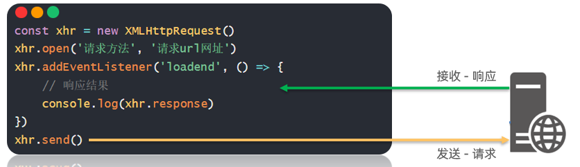
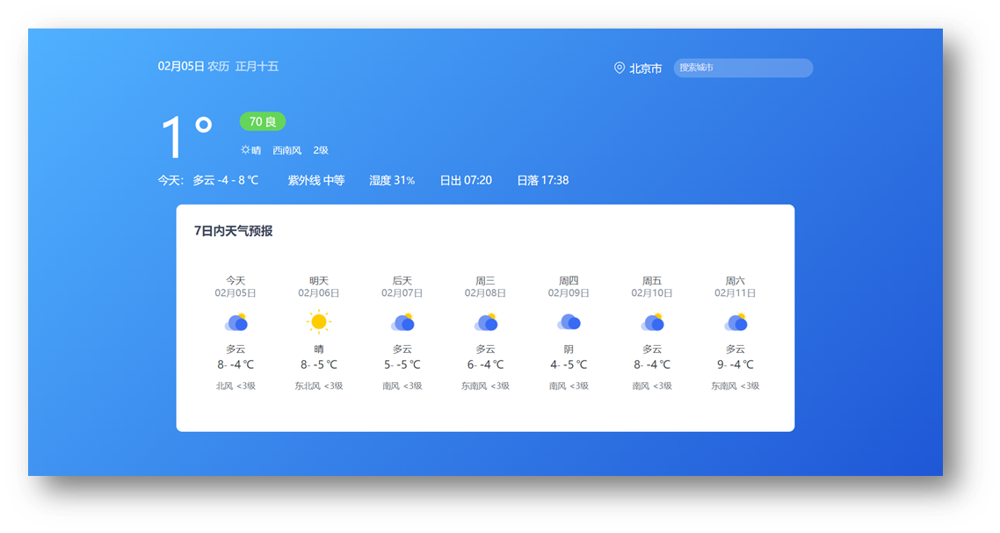

## 一、XMLHttpRequest 基础

### 1.1 核心概念

AJAX（Asynchronous JavaScript and XML）是浏览器与服务器通信的核心技术，其底层依赖浏览器提供的 `XMLHttpRequest`（XHR）对象。axios 等 HTTP 库本质上是对 XHR 的封装，学习 XHR 有助于理解网络请求的真实运作机制。

**XHR 与 axios 的关系：**

| 层级 | 角色             | 特点                                                     |
| :--- | :--------------- | :------------------------------------------------------- |
| 底层 | `XMLHttpRequest` | 浏览器原生 API，需手动处理请求配置、状态判断、数据转换   |
| 上层 | `axios`          | 封装 XHR，提供简洁的 API，自动处理参数拼接、数据序列化等 |

### 1.2 基础使用步骤



XHR 发起请求遵循四个标准步骤：

```js
// 1. 创建 XMLHttpRequest 对象
const xhr = new XMLHttpRequest()

// 2. 配置请求方法和 URL
xhr.open('GET', 'http://hmajax.itheima.net/api/province')

// 3. 监听 loadend 事件，接收响应结果
xhr.addEventListener('loadend', () => {
  console.log(xhr.response)
})

// 4. 发起请求
xhr.send()
```

**完整示例：获取省份列表**

```js
/**
 * 目标：使用 XMLHttpRequest 对象与服务器通信
 * 步骤：创建对象 → 配置请求 → 监听响应 → 发送请求
 */
const xhr = new XMLHttpRequest()
xhr.open('GET', 'http://hmajax.itheima.net/api/province')

xhr.addEventListener('loadend', () => {
  // 将 JSON 字符串解析为 JavaScript 对象
  const data = JSON.parse(xhr.response)
  // 将省份列表用 <br> 连接并渲染到页面
  document.querySelector('.my-p').innerHTML = data.list.join('<br>')
})

xhr.send()
```


## 二、查询参数与数据提交

### 2.1 查询参数传递

查询参数用于向服务器传递额外信息，格式为 `?参数名1=值1&参数名2=值2`。

**手动拼接示例：**

```js
const xhr = new XMLHttpRequest()
// 直接在 URL 后拼接查询字符串
xhr.open('GET', 'http://hmajax.itheima.net/api/city?pname=辽宁省')
xhr.addEventListener('loadend', () => {
  const data = JSON.parse(xhr.response)
  document.querySelector('.city-p').innerHTML = data.list.join('<br>')
})
xhr.send()
```

**💡 技巧：使用 URLSearchParams 自动转换**

当参数较多时，手动拼接容易出错。`URLSearchParams` 可将对象自动转换为查询字符串：

```js
const paramsObj = new URLSearchParams({
  pname: '辽宁省',
  cname: '大连市'
})
const queryString = paramsObj.toString()
// 结果："pname=辽宁省&cname=大连市"
```

### 2.2 数据提交（POST 请求）

提交数据时需手动设置请求头，并将 JavaScript 对象转为 JSON 字符串：

```js
/**
 * 目标：使用 XHR 进行数据提交，完成用户注册
 */
document.querySelector('.reg-btn').addEventListener('click', () => {
  const xhr = new XMLHttpRequest()
  xhr.open('POST', 'http://hmajax.itheima.net/api/register')
  
  xhr.addEventListener('loadend', () => {
    console.log(xhr.response)
  })

  // ⚠️ 注意：必须设置请求头，告知服务器发送的是 JSON 格式数据
  xhr.setRequestHeader('Content-Type', 'application/json')

  // 将 JS 对象转换为 JSON 字符串
  const userObj = { username: 'itheima007', password: '7654321' }
  const userStr = JSON.stringify(userObj)

  // 在 send() 中携带请求体数据
  xhr.send(userStr)
})
```

**XHR 数据提交关键要点：**

| 步骤 | 操作                                                   | 说明                           |
| :--- | :----------------------------------------------------- | :----------------------------- |
| 1    | `setRequestHeader('Content-Type', 'application/json')` | 声明请求体数据类型             |
| 2    | `JSON.stringify(data)`                                 | 将 JS 对象序列化为 JSON 字符串 |
| 3    | `xhr.send(jsonString)`                                 | 在 send 方法中传入请求体       |


## 三、Promise 异步管理

### 3.1 Promise 的作用

Promise 是用于管理异步操作最终完成（或失败）及其结果值的对象。相比传统回调函数，Promise 具有以下优势：

- **逻辑清晰**：通过 `then()` 和 `catch()` 明确分离成功与失败处理
- **链式调用**：避免回调地狱，支持优雅的异步流程控制
- **状态驱动**：内部状态机制是 axios 等库的实现基础

### 3.2 基础语法

```js
// 1. 创建 Promise 对象
const p = new Promise((resolve, reject) => {
  // 2. 执行异步任务
  setTimeout(() => {
    // 成功时调用 resolve，触发 then()
    resolve('模拟 AJAX 请求-成功结果')
    
    // 失败时调用 reject，触发 catch()
    // reject(new Error('模拟 AJAX 请求-失败结果'))
  }, 2000)
})

// 3. 接收结果
p.then(result => {
  console.log(result)  // 成功回调
}).catch(error => {
  console.log(error)   // 失败回调
})
```

### 3.3 Promise 的三种状态

每个 Promise 对象必定处于以下三种状态之一，且状态一旦确定不可更改：

| 状态   | 英文        | 含义                       | 触发回调  |
| :----- | :---------- | :------------------------- | :-------- |
| 待定   | `pending`   | 初始状态，异步操作尚未完成 | 无        |
| 已兑现 | `fulfilled` | 异步操作成功完成           | `then()`  |
| 已拒绝 | `rejected`  | 异步操作失败               | `catch()` |

```plain
pending ──resolve()──→ fulfilled ──→ then()
   │
   └──reject()──→ rejected ──→ catch()
```

### 3.4 结合 XHR 获取省份列表

使用 Promise 封装 XHR，实现更优雅的异步管理：

```js
/**
 * 目标：使用 Promise 管理 XHR 请求省份列表
 * 核心：通过 xhr.status 判断请求是否成功（2xx 为成功）
 */
const p = new Promise((resolve, reject) => {
  const xhr = new XMLHttpRequest()
  xhr.open('GET', 'http://hmajax.itheima.net/api/province')

  xhr.addEventListener('loadend', () => {
    // 判断响应状态码：200-299 范围内为成功
    if (xhr.status >= 200 && xhr.status < 300) {
      resolve(JSON.parse(xhr.response))  // 成功：解析并传递数据
    } else {
      reject(new Error(xhr.response))    // 失败：传递错误对象
    }
  })

  xhr.send()
})

// 使用 Promise 结果
p.then(result => {
  document.querySelector('.my-p').innerHTML = result.list.join('<br>')
}).catch(error => {
  // ⚠️ 注意：错误对象建议使用 console.dir 详细打印
  console.dir(error)
  document.querySelector('.my-p').innerHTML = error.message
})
```


## 四、封装简易版 axios

### 4.1 基础封装：支持 GET 请求

通过 Promise 封装 XHR，模拟 axios 的核心行为：

```js
/**
 * 目标：封装简易版 axios 函数
 * 功能：支持 URL、请求方法配置，返回 Promise 对象
 */
function myAxios(config) {
  return new Promise((resolve, reject) => {
    const xhr = new XMLHttpRequest()
    
    // 默认请求方法为 GET
    xhr.open(config.method || 'GET', config.url)

    xhr.addEventListener('loadend', () => {
      if (xhr.status >= 200 && xhr.status < 300) {
        resolve(JSON.parse(xhr.response))
      } else {
        reject(new Error(xhr.response))
      }
    })

    xhr.send()
  })
}

// 使用封装的函数获取省份列表
myAxios({
  url: 'http://hmajax.itheima.net/api/province'
}).then(result => {
  document.querySelector('.my-p').innerHTML = result.list.join('<br>')
}).catch(error => {
  document.querySelector('.my-p').innerHTML = error.message
})
```

### 4.2 增强封装：支持查询参数

```js
function myAxios(config) {
  return new Promise((resolve, reject) => {
    const xhr = new XMLHttpRequest()

    // 1. 判断是否存在 params 选项
    if (config.params) {
      // 2. 使用 URLSearchParams 转换并拼接到 URL
      const paramsObj = new URLSearchParams(config.params)
      const queryString = paramsObj.toString()
      config.url += `?${queryString}`
    }

    xhr.open(config.method || 'GET', config.url)
    
    xhr.addEventListener('loadend', () => {
      if (xhr.status >= 200 && xhr.status < 300) {
        resolve(JSON.parse(xhr.response))
      } else {
        reject(new Error(xhr.response))
      }
    })

    xhr.send()
  })
}

// 获取指定地区列表
myAxios({
  url: 'http://hmajax.itheima.net/api/area',
  params: {
    pname: '辽宁省',
    cname: '大连市'
  }
}).then(result => {
  console.log(result)
})
```

### 4.3 完整封装：支持请求体提交

```js
/**
 * 完整版 myAxios：支持 GET/POST、查询参数、请求体数据
 */
function myAxios(config) {
  return new Promise((resolve, reject) => {
    const xhr = new XMLHttpRequest()

    // 处理查询参数
    if (config.params) {
      const paramsObj = new URLSearchParams(config.params)
      const queryString = paramsObj.toString()
      config.url += `?${queryString}`
    }

    xhr.open(config.method || 'GET', config.url)

    xhr.addEventListener('loadend', () => {
      if (xhr.status >= 200 && xhr.status < 300) {
        resolve(JSON.parse(xhr.response))
      } else {
        reject(new Error(xhr.response))
      }
    })

    // 处理请求体数据
    if (config.data) {
      // 设置请求头，声明内容类型为 JSON
      xhr.setRequestHeader('Content-Type', 'application/json')
      // 将数据转为 JSON 字符串并发送
      const jsonStr = JSON.stringify(config.data)
      xhr.send(jsonStr)
    } else {
      xhr.send()
    }
  })
}

// 注册用户示例
document.querySelector('.reg-btn').addEventListener('click', () => {
  myAxios({
    url: 'http://hmajax.itheima.net/api/register',
    method: 'POST',
    data: {
      username: 'itheima999',
      password: '666666'
    }
  }).then(result => {
    console.log(result)
  }).catch(error => {
    console.dir(error)
  })
})
```


## 五、实战案例：天气预报应用



### 5.1 功能概述

基于封装的 `myAxios` 实现天气预报应用，包含以下功能：

1. **默认展示**：页面加载时显示北京市天气
2. **城市搜索**：输入关键字实时搜索匹配城市
3. **切换城市**：点击搜索列表中的城市，切换显示对应天气

### 5.2 核心实现

**天气数据获取与渲染函数：**

```js
/**
 * 获取并渲染指定城市的天气数据
 * @param {string} cityCode - 城市编码（如北京市：'110100'）
 */
function getWeather(cityCode) {
  myAxios({
    url: 'http://hmajax.itheima.net/api/weather',
    params: { city: cityCode }
  }).then(result => {
    const wObj = result.data

    // 1. 渲染日期信息
    const dateStr = `
      <span class="dateShort">${wObj.date}</span>
      <span class="calendar">农历&nbsp;
        <span class="dateLunar">${wObj.dateLunar}</span>
      </span>`
    document.querySelector('.title').innerHTML = dateStr

    // 2. 渲染城市名称
    document.querySelector('.area').innerHTML = wObj.area

    // 3. 渲染当前气温与天气
    const nowWStr = `
      <div class="tem-box">
        <span class="temp">
          <span class="temperature">${wObj.temperature}</span>
          <span>°</span>
        </span>
      </div>
      <div class="climate-box">
        <div class="air">
          <span class="psPm25">${wObj.psPm25}</span>
          <span class="psPm25Level">${wObj.psPm25Level}</span>
        </div>
        <ul class="weather-list">
          <li>
            
            <span class="weather">${wObj.weather}</span>
          </li>
          <li class="windDirection">${wObj.windDirection}</li>
          <li class="windPower">${wObj.windPower}</li>
        </ul>
      </div>`
    document.querySelector('.weather-box').innerHTML = nowWStr

    // 4. 渲染当日详细天气
    const twObj = wObj.todayWeather
    const todayWStr = `
      <div class="range-box">
        <span>今天：</span>
        <span class="range">
          <span class="weather">${twObj.weather}</span>
          <span class="temNight">${twObj.temNight}</span>
          <span>-</span>
          <span class="temDay">${twObj.temDay}</span>
          <span>℃</span>
        </span>
      </div>
      <ul class="sun-list">
        <li><span>紫外线</span><span class="ultraviolet">${twObj.ultraviolet}</span></li>
        <li><span>湿度</span><span class="humidity">${twObj.humidity}</span>%</li>
        <li><span>日出</span><span class="sunriseTime">${twObj.sunriseTime}</span></li>
        <li><span>日落</span><span class="sunsetTime">${twObj.sunsetTime}</span></li>
      </ul>`
    document.querySelector('.today-weather').innerHTML = todayWStr

    // 5. 渲染 7 日天气预报
    const dayForecast = wObj.dayForecast
    const dayForecastStr = dayForecast.map(item => `
      <li class="item">
        <div class="date-box">
          <span class="dateFormat">${item.dateFormat}</span>
          <span class="date">${item.date}</span>
        </div>
        
        <span class="weather">${item.weather}</span>
        <div class="temp">
          <span class="temNight">${item.temNight}</span>-
          <span class="temDay">${item.temDay}</span>
          <span>℃</span>
        </div>
        <div class="wind">
          <span class="windDirection">${item.windDirection}</span>
          <span class="windPower">${item.windPower}</span>
        </div>
      </li>`).join('')
    
    document.querySelector('.week-wrap').innerHTML = dayForecastStr
  })
}

// 默认加载北京市天气（城市编码：110100）
getWeather('110100')
```

**城市搜索功能：**

```js
/**
 * 监听输入框 input 事件，实时搜索城市列表
 * 💡 技巧：使用 input 事件而非 change 事件，可实时响应输入变化
 */
document.querySelector('.search-city').addEventListener('input', (e) => {
  myAxios({
    url: 'http://hmajax.itheima.net/api/weather/city',
    params: { city: e.target.value }
  }).then(result => {
    const liStr = result.data.map(item => 
      `<li class="city-item" data-code="${item.code}">${item.name}</li>`
    ).join('')
    document.querySelector('.search-list').innerHTML = liStr
  })
})
```

**城市切换功能：**

```js
/**
 * 使用事件委托监听城市列表点击事件
 * 通过 data-code 属性获取城市编码，切换天气显示
 */
document.querySelector('.search-list').addEventListener('click', e => {
  // 判断点击目标是否为城市列表项
  if (e.target.classList.contains('city-item')) {
    const cityCode = e.target.dataset.code
    // 复用 getWeather 函数，实现城市切换
    getWeather(cityCode)
  }
})
```


## 六、核心要点总结

| 知识点           | 关键内容                                                     |
| :--------------- | :----------------------------------------------------------- |
| **XHR 四步曲**   | 创建对象 → `open()` 配置 → 监听 `loadend` → `send()` 发送    |
| **查询参数**     | URL 后拼接 `?key=value`，或使用 `URLSearchParams` 自动转换   |
| **POST 提交**    | 设置 `Content-Type: application/json`，`JSON.stringify()` 转换数据 |
| **Promise 状态** | `pending` → `fulfilled`（`resolve`）/ `rejected`（`reject`） |
| **状态码判断**   | `xhr.status >= 200 && xhr.status < 300` 表示请求成功         |
| **axios 原理**   | 本质是 Promise + XHR 的封装，自动处理参数拼接和数据序列化    |
