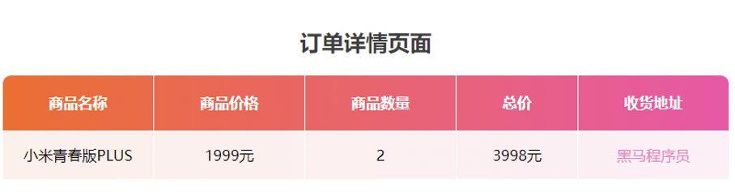

## 一、JavaScript 概述

### 1.1 什么是 JavaScript？

JavaScript 是一种运行在**客户端（浏览器）**的编程语言，用于创建动态更新的内容、控制多媒体、制作图像动画等交互效果。

### 1.2 代码引入方式

| 方式         | 语法                              | 适用场景           |
| :----------- | :-------------------------------- | :----------------- |
| **内部方式** | `<script>...</script>`            | 快速测试、小型页面 |
| **外部方式** | `<script src="demo.js"></script>` | 大型项目、代码复用 |

⚠️ **注意**：当 `script` 标签使用 `src` 属性引入外部文件时，标签内部的代码会被**忽略**。

```html
<!-- 错误示例：内部代码不会执行 -->
<script src="demo.js">
  alert(666);  // 此行代码会被忽略
</script>
```

### 1.3 注释与结束符

| 类型     | 语法             | 快捷键     |
| :------- | :--------------- | :--------- |
| 单行注释 | `// 注释内容`    | `Ctrl + /` |
| 多行注释 | `/* 注释内容 */` | -          |

💡 **提示**：JavaScript 中分号 `;` 代表语句结束，多数情况下可省略，使用回车替代。

### 1.4 输入输出语句

| 语句               | 作用                               | 示例                              |
| :----------------- | :--------------------------------- | :-------------------------------- |
| `alert()`          | 页面弹出警示框                     | `alert('提示信息')`               |
| `document.write()` | 向页面输出内容（可解析 HTML 标签） | `document.write('<h1>标题</h1>')` |
| `console.log()`    | 控制台输出（用于调试）             | `console.log('调试信息')`         |
| `prompt()`         | 弹出输入框，接收用户输入           | `prompt('请输入姓名:')`           |


## 二、变量

### 2.1 变量的概念

变量是计算机中存储数据的**容器**，用于存放数值。可以理解为一个个用来装东西的"纸箱子"。

### 2.2 变量的声明与赋值

```javascript
// 1. 先声明，后赋值
let age;
age = 18;

// 2. 声明并赋值（推荐）
let str = 'hello world!';

// 3. 变量更新
age = 19;  // 更新为新的值
// let age = 20;  // ⚠️ 错误：不能重复声明同一变量

// 4. 声明多个变量（不推荐，可读性差）
let uname = 'pink老师', sex = '男';
// 推荐写法：每行声明一个变量
let userName = 'pink老师';
let userSex = '男';
```

### 2.3 let 与 var 的区别

| 特性         | `var`                              | `let`                                        |
| :----------- | :--------------------------------- | :------------------------------------------- |
| **作用域**   | 函数作用域                         | 块级作用域                                   |
| **变量提升** | 会提升（初始化为 `undefined`）     | 会提升但处于"暂时性死区"，未初始化前访问报错 |
| **重复声明** | 允许                               | 不允许                                       |
| **全局对象** | 全局变量会成为 `window` 对象的属性 | 不会绑定到 `window` 对象                     |

⚠️ **重要结论**：`var` 存在变量提升、重复声明等问题，**现代 JavaScript 开发统一使用 `let` 声明变量**

### 2.4 变量的本质

变量本质是程序在**内存**中申请的一块用来存放数据的小空间。

### 2.5 变量命名规范

#### 硬性规则（必须遵守）

1. 只能包含字母、数字、下划线 `_`、美元符号 `$`
2. **不能以数字开头**
3. 区分大小写（`Age` 和 `age` 是不同的变量）
4. 不能使用 JavaScript 关键字或保留字（如 `let`、`var`、`function` 等）

#### 软性规范（建议遵守）

1. **见名知义**：使用有意义的名称，如 `userName` 而非 `x`
2. **小驼峰命名法**：第一个单词首字母小写，后续单词首字母大写
   - 示例：`myName`、`userFirstName`、`productPrice`

```javascript
// ✅ 正确示例
let myName = 'pink老师';
let userAge = 18;
let _price = 99.9;
let $count = 10;

// ❌ 错误示例
let 1num = 10;      // 数字开头
let num! = 10;      // 包含非法字符
let let = 10;       // 使用关键字
let NL = 19;        // 无意义缩写（不规范）
```


## 三、常量

### 3.1 常量的概念

常量也是用于保存数据的容器，但**值不允许改变**。适用于值永远不会改变的场景，如数学常数 π。

```javascript
const PI = 3.14;
console.log(PI);  // 3.14

// PI = 3.14159;  // ⚠️ 错误：常量不能重新赋值

// const URL;  // ⚠️ 错误：常量声明时必须初始化
```

⚠️ **注意**：

1. 常量**不允许重新赋值**
2. 常量**声明时必须初始化**（赋值）


## 四、数据类型

> JavaScript 是**弱类型**语言，变量的数据类型由赋值的值决定。

### 4.1 基本数据类型

| 类型          | 说明                       | 示例                           | 检测结果    |
| :------------ | :------------------------- | :----------------------------- | :---------- |
| **Number**    | 数字（整数、小数、正负数） | `18`、`3.14`、`-5`             | `number`    |
| **String**    | 字符串（被引号包裹的文本） | `'hello'`、`"world"`、``模板`` | `string`    |
| **Boolean**   | 布尔值（真/假）            | `true`、`false`                | `boolean`   |
| **Undefined** | 未定义（变量声明但未赋值） | `let x;`                       | `undefined` |

使用 `typeof` 关键字检测数据类型：

```javascript
let num = 18;
console.log(typeof num);  // "number"

let str = 'hello';
console.log(typeof str);  // "string"
```

### 4.2 字符串类型详解

#### 引号使用规则

- 单引号 `''`、双引号 `""`、反引号 ```` 均可包裹字符串
- **推荐**使用单引号
- **嵌套规则**：外双内单，或外单内双

```javascript
// ✅ 正确嵌套
console.log('今日特价"跳楼大甩卖"速速抢购');
console.log("今日特价'跳楼大甩卖'速速抢购");

// ❌ 错误：不能嵌套自身
// console.log('it's ok');  // 语法错误
console.log("it's ok");     // ✅ 正确
console.log('it\'s ok');    // ✅ 使用转义符
```

⚠️ **注意**：变量名**不要加引号**，否则会被识别为字符串而非变量。

### 4.3 模板字符串（ES6）

**使用场景**：简化字符串与变量的拼接。

**语法**：使用反引号 \`\` 包裹，变量通过 `${变量名}` 嵌入。

```javascript
let age = 91;

// 传统拼接方式
console.log('pink老师今年' + age + '岁');

// 模板字符串方式（推荐）
console.log(`pink老师今年${age}岁`);

// 支持多行字符串
let html = `
  <div>
    <h1>标题</h1>
    <p>内容</p>
  </div>
`;
```

💡 **优势**：

- 代码更简洁，可读性更强
- 支持直接换行，无需手动添加 `\n`
- 可在 `${}` 中执行表达式或函数调用

### 4.4 布尔类型与 Undefined

```javascript
// 布尔类型：仅有两个值 true 和 false
let isCool = true;
isCool = false;
console.log(typeof isCool);  // "boolean"

// Undefined：变量声明但未赋值时的默认值
let tmp;
console.log(typeof tmp);  // "undefined"
console.log(tmp);         // undefined
```


## 五、运算符

### 5.1 算术运算符

| 运算符 | 作用           | 示例    | 结果 |
| :----- | :------------- | :------ | :--- |
| `+`    | 加法           | `1 + 2` | `3`  |
| `-`    | 减法           | `5 - 3` | `2`  |
| `*`    | 乘法           | `2 * 3` | `6`  |
| `/`    | 除法           | `6 / 3` | `2`  |
| `%`    | 取模（取余数） | `5 % 3` | `2`  |

💡 **取模运算的应用**：判断一个数是否能被另一个数整除（余数为 0 表示能整除）。

```javascript
// 算术运算示例
console.log(1 + 2 * 3 / 2);  // 4（先乘除后加减）

// 取模运算
console.log(4 % 2);  // 0  → 4 能被 2 整除
console.log(5 % 3);  // 2  → 5 除以 3 余 2

// 判断数字是否在范围内（8096 到 36999）
let num = 10000;
console.log(num >= 8096 && num <= 36999);  // true
```

⚠️ **注意**：非数字类型参与算术运算可能返回 `NaN`（Not a Number），但字符串与数字相加会进行拼接。

```javascript
console.log('pink老师' - 2);  // NaN（减法失败）
console.log('pink老师' + 2);  // "pink老师2"（字符串拼接）
```

### 5.2 赋值运算符

| 运算符 | 作用     | 等价写法    |
| :----- | :------- | :---------- |
| `=`    | 基础赋值 | `x = y`     |
| `+=`   | 加法赋值 | `x = x + y` |
| `-=`   | 减法赋值 | `x = x - y` |
| `*=`   | 乘法赋值 | `x = x * y` |
| `/=`   | 除法赋值 | `x = x / y` |
| `%=`   | 取模赋值 | `x = x % y` |

```javascript
let num = 1;
num += 1;  // 等价于 num = num + 1
console.log(num);  // 2
```

### 5.3 自增/自减运算符

| 符号 | 作用           | 示例           |
| :--- | :------------- | :------------- |
| `++` | 自增（值加 1） | `x++` 或 `++x` |
| `--` | 自减（值减 1） | `x--` 或 `--x` |

**前缀式 vs 后缀式**：

- **前缀式** `++x`：先自增，后使用值
- **后缀式** `x++`：先使用值，后自增

```javascript
let x = 3;

// 单独使用时，无区别
x++;  // x 变为 4
++x;  // x 变为 5

// 参与运算时的区别
let a = 3;
let b = ++a;  // 前缀式：a 先变为 4，然后 b = 4
console.log(a, b);  // 4, 4

let c = 3;
let d = c++;  // 后缀式：d 先获得 3，然后 c 变为 4
console.log(c, d);  // 4, 3
```

### 5.4 比较运算符

| 运算符 | 作用                       | 示例        | 结果    |
| :----- | :------------------------- | :---------- | :------ |
| `>`    | 大于                       | `3 > 5`     | `false` |
| `<`    | 小于                       | `3 < 5`     | `true`  |
| `>=`   | 大于等于                   | `3 >= 3`    | `true`  |
| `<=`   | 小于等于                   | `3 <= 5`    | `true`  |
| `===`  | **全等**（值和类型都相等） | `3 === '3'` | `false` |
| `==`   | 相等（仅比较值）           | `3 == '3'`  | `true`  |
| `!==`  | 不全等                     | `3 !== '3'` | `true`  |
| `!=`   | 不相等                     | `3 != 4`    | `true`  |

⚠️ **重要**：**推荐使用 `===`（全等）和 `!==`（不全等）**，避免类型转换带来的意外结果。

```javascript
console.log(3 === 3);    // true（值和类型都相同）
console.log(3 === '3');  // false（类型不同：number vs string）

console.log(3 == '3');   // true（仅值相同，发生类型转换）
console.log(3 !== '3');  // true（类型不同，不全等）
```

### 5.5 逻辑运算符

| 符号 | 名称   | 读法 | 特点               | 口诀         |
| :--- | :----- | :--- | :----------------- | :----------- |
| `&&` | 逻辑与 | 并且 | 两边都为真才为真   | **一假则假** |
| `||` | 逻辑或 | 或者 | 两边有一个真就为真 | **一真则真** |
| `!`  | 逻辑非 | 取反 | 真变假，假变真     | 取反         |

**真值表**：

| A       | B       | A `&&` B | A `||` B | `!`A    |
| :------ | :------ | :------- | :------- | :------ |
| `false` | `false` | `false`  | `false`  | `true`  |
| `false` | `true`  | `false`  | `true`   | `true`  |
| `true`  | `false` | `false`  | `true`   | `false` |
| `true`  | `true`  | `true`   | `true`   | `false` |

```javascript
// 逻辑与：一假则假
console.log(true && false);  // false
console.log(3 > 5 && 2 < 4); // false（3>5 为 false）

// 逻辑或：一真则真
console.log(true || false);  // true
console.log(false || false); // false

// 逻辑非：取反
console.log(!false);  // true
console.log(!true);   // false
```

### 5.6 运算符优先级

| 优先级（从高到低） | 运算符                                                   |
| :----------------- | :------------------------------------------------------- |
| 1                  | `()`（小括号）                                           |
| 2                  | `++`、`--`（自增/自减）                                  |
| 3                  | `!`（逻辑非）                                            |
| 4                  | 算术运算符（`*`、`/`、`%` 优先于 `+`、`-`）              |
| 5                  | 比较运算符（`>`、`<`、`>=`、`<=` 优先于 `===`、`==` 等） |
| 6                  | `&&`（逻辑与）                                           |
| 7                  | `||`（逻辑或）                                           |
| 8                  | 赋值运算符（`=`、`+=` 等）                               |

💡 **记忆口诀**：逻辑运算符优先级：`!` > `&&` > `||`


## 六、综合案例：商品订单信息页面



### 6.1 需求分析

用户输入商品价格、数量和收货地址，系统自动计算总价并生成美观的订单表格。

### 6.2 实现步骤

1. **输入数据**：通过 `prompt()` 获取用户输入
2. **处理数据**：计算总价 `total = price * num`
3. **输出数据**：使用模板字符串生成 HTML 表格

### 6.3 完整代码

```html
<!DOCTYPE html>
<html lang="zh-CN">
<head>
  <meta charset="UTF-8">
  <meta name="viewport" content="width=device-width, initial-scale=1.0">
  <title>订单详情页面</title>
  <style>
    .title {
      text-align: center;
      color: #3e3e3e;
    }
    .order {
      border-collapse: collapse;
      margin: 0 auto;
      text-align: center;
      border-radius: 10px 10px 0 0;
      overflow: hidden;
    }
    /* 表头渐变背景 */
    .order tr:nth-child(1) {
      background-image: linear-gradient(to right, #f46e33, #f057a5);
    }
    /* 数据行背景 */
    .order tr:nth-child(2) {
      background-image: linear-gradient(to right, #fdf0eb, #fdeff6);
    }
    .order th {
      padding: 5px 50px;
      color: #fff;
    }
    .order th, .order td {
      border: 1px solid #fff;
      line-height: 50px;
    }
    .order tr:nth-child(2) td:last-child {
      color: #f282bb;
    }
  </style>
</head>
<body>
  <h2 class="title">订单详情页面</h2>

  <script>
    // 1. 输入数据
    let price = prompt('请输入商品单价:');
    let num = prompt('请输入商品数量:');
    let address = prompt('请输入收货地址:');

    // 2. 处理数据：计算总价
    let total = price * num;

    // 3. 输出数据：使用模板字符串生成表格
    document.write(`
      <table class="order">
        <tr>
          <th>商品名称</th>
          <th>商品价格</th>
          <th>商品数量</th>
          <th>总价</th>
          <th>收货地址</th>
        </tr>
        <tr>
          <td>小米青春版PLUS</td>
          <td>${price}元</td>
          <td>${num}</td>
          <td>${total}元</td>
          <td>${address}</td>
        </tr>
      </table>
    `);
  </script>
</body>
</html>
```
