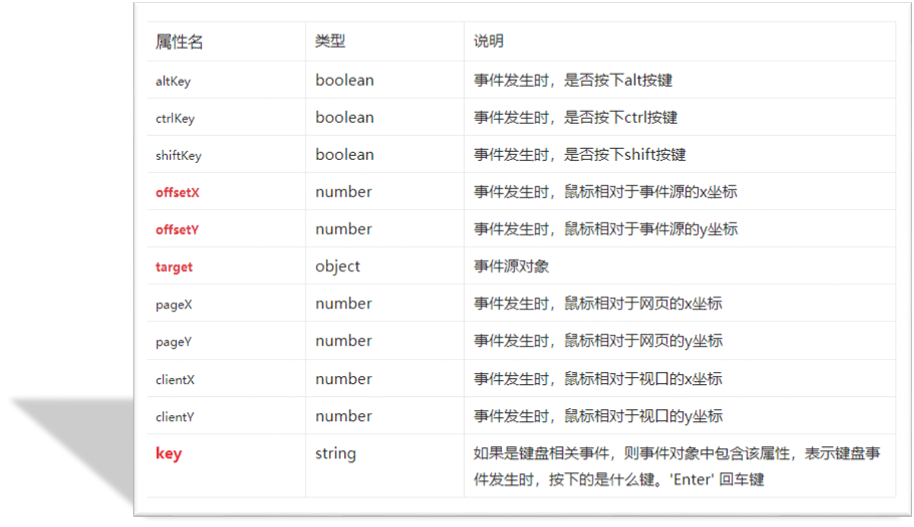

## 一、事件监听基础

### 1.1 事件的概念

**事件**是程序运行过程中发生的特定动作或特定事情，例如：

- 点击按钮
- 鼠标经过菜单
- 键盘按键

当事件发生时，可以执行预先定义的代码逻辑（如弹出提示框、显示下拉菜单等）。

### 1.2 事件监听语法

事件监听（又称事件注册、事件绑定）是将事件处理函数注册到元素对象的过程。

**语法格式**：

```javascript
元素对象.addEventListener('事件类型', 事件处理函数)
```

**三要素**：

| 要素             | 说明                         | 示例                                         |
| :--------------- | :--------------------------- | :------------------------------------------- |
| **事件源**       | 被触发的DOM元素              | `const btn = document.querySelector('.btn')` |
| **事件类型**     | 触发条件（点击、鼠标经过等） | `'click'`、`'mouseenter'`                    |
| **事件处理函数** | 触发后执行的代码逻辑         | `function() { alert('秋香') }`               |

**基础示例**：

```html
<!DOCTYPE html>
<html lang="zh-CN">
<head>
    <meta charset="UTF-8">
    <title>事件监听示例</title>
</head>
<body>
    <button class="btn">唐伯虎</button>
    <script>
        // 1. 获取元素对象
        const btn = document.querySelector('.btn');
        
        // 2. 添加事件监听：点击按钮弹出提示框
        btn.addEventListener('click', function () {
            alert('秋香');
        });
    </script>
</body>
</html>
```

⚠️ **注意事项**：

1. 事件类型需加引号且使用**小写**
2. 事件处理函数在点击后执行，每次点击都会触发一次

### 1.3 回调函数

**回调函数**是指作为参数传递给另一个函数的函数（"回头调用"的函数）。

**常见应用场景**：

```javascript
// 1. 定时器中的回调函数
setInterval(function () {
    console.log('定时器回调');
}, 1000);

// 2. 事件监听中的回调函数
btn.addEventListener('click', function () {
    console.log('事件回调');
});
```

### 1.4 事件监听版本对比

| 版本      | 语法                                | 特点                                  |
| :-------- | :---------------------------------- | :------------------------------------ |
| **DOM 0** | `元素.on事件类型 = function() {}`   | 简单，但同名事件会被覆盖              |
| **DOM 2** | `元素.addEventListener(类型, 函数)` | 支持多事件监听，功能更丰富 💡 **推荐** |

**对比示例**：

```javascript
// DOM 0 方式（会被覆盖）
btn.onclick = function () { alert('弹窗1'); };
btn.onclick = function () { alert('弹窗2'); }; // 只执行这个

// DOM 2 方式（不会覆盖）
btn.addEventListener('click', function () { console.log('监听1'); });
btn.addEventListener('click', function () { console.log('监听2'); }); // 两者都执行
```


## 二、事件类型详解

事件类型为大小写敏感的字符串，统一使用**小写字母**。

### 2.1 鼠标事件

| 事件类型     | 触发时机       | 应用场景               |
| :----------- | :------------- | :--------------------- |
| `click`      | 鼠标点击元素时 | 按钮点击、链接跳转     |
| `mouseenter` | 鼠标移入元素时 | 显示下拉菜单、高亮效果 |
| `mouseleave` | 鼠标移出元素时 | 隐藏下拉菜单、取消高亮 |

**示例代码**：

```javascript
const box = document.querySelector('.box');

// 鼠标点击
box.addEventListener('click', function () {
    console.log('点击了盒子');
});

// 鼠标经过
box.addEventListener('mouseenter', function () {
    console.log('鼠标经过了盒子');
});

// 鼠标离开
box.addEventListener('mouseleave', function () {
    console.log('鼠标离开了盒子');
});
```

### 2.2 焦点事件

针对表单元素的光标聚焦状态。

| 事件类型 | 触发时机       | 方法                          |
| :------- | :------------- | :---------------------------- |
| `focus`  | 元素获得焦点时 | `元素.focus()` - 自动获得焦点 |
| `blur`   | 元素失去焦点时 | `元素.blur()` - 自动失去焦点  |

**示例代码**：

```html
<style>
    input[type="text"] {
        width: 245px;
        height: 50px;
        padding-left: 20px;
        border: 1px solid #ccc;
        font-size: 17px;
        outline: none;
    }
</style>

<input type="text" class="search-text">
<input type="text" class="search">

<script>
    const searchText = document.querySelector('.search-text');
    
    // 获得焦点事件
    searchText.addEventListener('focus', function () {
        console.log('获得了焦点');
    });
    
    // 失去焦点事件
    searchText.addEventListener('blur', function () {
        console.log('失去了焦点');
    });
    
    // 自动获得焦点（如百度首页搜索框）
    const search = document.querySelector('.search');
    search.focus();
</script>
```

### 2.3 键盘事件与Input事件

| 事件      | 触发时机            | 获取表单值特点                                    |
| :-------- | :------------------ | :------------------------------------------------ |
| `keydown` | 按下键盘时触发      | **不包含**最后一次按键值（如输入"ab"，获取到"a"） |
| `keyup`   | 弹起键盘时触发      | 包含完整输入内容（如输入"abc"，获取到"abc"）      |
| `input`   | 表单value变化时触发 | 包含完整输入内容（如输入"abc"，获取到"abc"）      |

**执行顺序**：`keydown` → `input` → `keyup`

**示例代码**：

```html
<textarea id="tx" placeholder="发一条友善的评论" rows="2"></textarea>

<script>
    const tx = document.querySelector('#tx');

    // 1. 键盘按下事件（keydown）
    tx.addEventListener('keydown', function () {
        console.log('keydown: ' + tx.value); // 缺少最后一个字符
    });

    // 2. 键盘弹起事件（keyup）
    tx.addEventListener('keyup', function () {
        console.log('keyup: ' + tx.value); // 完整内容
    });

    // 3. 输入事件（input）- 最常用
    tx.addEventListener('input', function () {
        console.log('input: ' + tx.value); // 完整内容
    });
</script>
```

💡 **技巧**：实时获取用户输入内容时，优先使用 `input` 或 `keyup` 事件。


## 三、事件对象

### 3.1 事件对象概述

**事件对象**是事件触发时自动创建的对象，包含事件相关的详细信息（如鼠标位置、按键编码等）。

**使用场景**：

- 判断用户按下的具体按键（如回车键发布评论）
- 获取鼠标点击的坐标位置
- 确定事件目标元素

### 3.2 事件对象的使用

事件对象作为回调函数的**第一个参数**传入，通常命名为 `event`、`evt` 或 `e`。

**示例代码**：

```javascript
const box = document.querySelector('.box');
const tx = document.querySelector('#tx');

// 鼠标点击事件对象
box.addEventListener('click', function (e) {
    console.log(e); // 输出完整事件对象
    console.log(e.clientX, e.clientY); // 鼠标点击坐标
});

// 键盘事件对象 - 检测回车键
tx.addEventListener('keyup', function (e) {
    // e.key 获取按下的键名
    if (e.key === 'Enter') {
        alert('您按下了回车键');
    }
});
```





## 四、环境对象（this）

### 4.1 this指向规则

**环境对象**指函数内部特殊的 `this` 关键字，其指向取决于函数的调用方式。

**粗略规则**：**谁调用函数，this就指向谁**

| 调用场景 | this指向          | 示例                                              |
| :------- | :---------------- | :------------------------------------------------ |
| 全局环境 | `window` 对象     | `console.log(this)`                               |
| 普通函数 | `window` 对象     | `function fn() { console.log(this) }`             |
| 对象方法 | 该对象            | `obj.sing()` → this指向obj                        |
| 事件监听 | 绑定事件的DOM元素 | `btn.addEventListener('click', fn)` → this指向btn |

**示例代码**：

```javascript
// 1. 全局环境
console.log(this); // window

// 2. 普通函数
function fn() {
    console.log(this); // window
}
window.fn(); // 等价于直接调用 fn()

// 3. 对象方法
const obj = {
    uname: '佩奇',
    sing: function () {
        console.log(this); // obj 对象
        console.log(this.uname); // "佩奇"
    }
};
obj.sing();

// 4. 事件监听
const btn = document.querySelector('button');
btn.addEventListener('click', function () {
    console.log(this); // btn 元素对象
    this.style.backgroundColor = 'pink'; // 修改按钮背景色
});
```

💡 **技巧**：在事件处理函数中使用 `this` 可直接访问当前元素，无需重新查询DOM。


## 五、排他思想

### 5.1 概念与应用

**排他思想**是一种DOM操作思路，用于突出显示当前选中的元素，同时移除其他元素的样式。

**典型应用场景**：

- 标签页切换（Tab栏）
- 轮播图指示器高亮
- 下拉菜单选中项

### 5.2 实现口诀

1. **排除其他人** - 遍历所有元素，移除目标样式
2. **保留我自己** - 为当前元素添加目标样式

**效果示意**：

> 多个元素中，只有鼠标经过的当前元素显示高亮样式，其余元素恢复默认样式。
