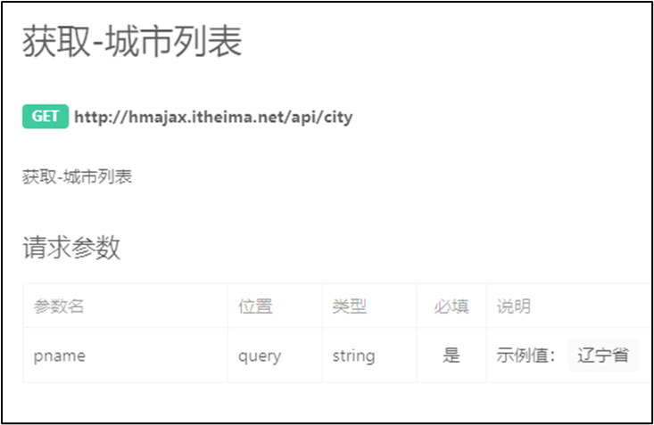
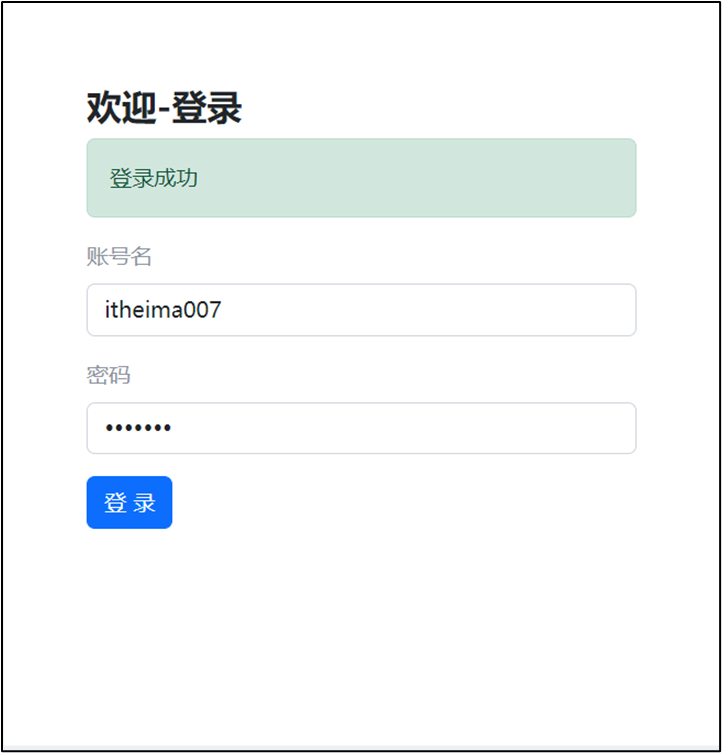

## 一、AJAX 与 axios 基础

### 1.1 什么是 AJAX

AJAX（Asynchronous JavaScript and XML）是一种使用浏览器内置的 `XMLHttpRequest` 对象与服务器进行异步通信的技术。它允许网页在不重新加载整个页面的情况下，动态获取和更新数据。

**核心作用：**

- 浏览器与服务器之间的**动态数据交互**
- 让页面数据"活"起来，不再依赖代码中写死的固定值

**学习路径建议：**

1. 先掌握 **axios** 库的使用（语法简洁，Vue/React 生态通用）
2. 再深入理解 `XMLHttpRequest` 底层原理


### 1.2 axios 快速入门

axios 是一个基于 Promise 的 HTTP 客户端，用于浏览器和 Node.js。

**引入方式：**

```html
<script src="https://cdn.jsdelivr.net/npm/axios/dist/axios.min.js"></script>
```

**基础语法：**

```js
axios({
  url: '目标资源地址'  // 标记资源的网址
}).then((result) => {
  // 对服务器返回的数据做后续处理
})
```

**完整示例 —— 获取省份列表：**

```html
<!DOCTYPE html>
<html lang="zh-CN">
<head>
  <meta charset="UTF-8">
  <title>AJAX 概念与 axios 使用</title>
</head>
<body>
  <p class="my-p"></p>
  
  <!-- 1. 引入 axios 库 -->
  <script src="https://cdn.jsdelivr.net/npm/axios/dist/axios.min.js"></script>
  <script>
    // 2. 使用 axios 函数发起请求
    axios({
      url: 'http://hmajax.itheima.net/api/province'
    }).then(result => {
      // 💡 好习惯：多打印，确认属性名
      console.log(result)
      console.log(result.data.list)
      
      // 3. 将省份列表插入页面
      document.querySelector('.my-p').innerHTML = result.data.list.join('<br>')
    })
  </script>
</body>
</html>
```


## 二、认识 URL

### 2.1 URL 的组成

URL（Uniform Resource Locator，统一资源定位符）用于定位网络中的资源。

| 组成部分     | 说明                             | 示例                 |
| :----------- | :------------------------------- | :------------------- |
| **协议**     | 规定浏览器与服务器传递数据的格式 | `http://`            |
| **域名**     | 标记服务器在互联网中的方位       | `hmajax.itheima.net` |
| **资源路径** | 标识服务器内具体资源的位置       | `/api/news`          |

**示例解析：**

```plain
http://hmajax.itheima.net/api/news
│      │                      │
│      │                      └── 资源路径：新闻列表接口
│      └── 域名：黑马 AJAX 服务器
└── 协议：超文本传输协议
```

### 2.2 使用 axios 访问新闻列表

```js
axios({
  url: 'http://hmajax.itheima.net/api/news'
}).then(result => {
  console.log(result)
})
```


## 三、URL 查询参数

### 3.1 查询参数的作用

查询参数用于向服务器传递**额外信息**，使服务器返回匹配的数据而非全部数据。

**语法格式：**

```plain
http://xxxx.com/xxx/xxx?参数名1=值1&参数名2=值2
```

### 3.2 axios 携带查询参数

使用 `params` 选项传递查询参数：

```js
axios({
  url: 'http://hmajax.itheima.net/api/city',
  params: {
    pname: '辽宁省'  // 参数名由后端规定
  }
}).then(result => {
  console.log(result.data.list)
})
```

**完整示例 —— 查询城市列表：**

```html
<!DOCTYPE html>
<html lang="zh-CN">
<head>
  <meta charset="UTF-8">
  <title>查询参数</title>
</head>
<body>
  <p></p>
  <script src="https://cdn.jsdelivr.net/npm/axios/dist/axios.min.js"></script>
  <script>
    axios({
      url: 'http://hmajax.itheima.net/api/city',
      params: {
        pname: '辽宁省'
      }
    }).then(result => {
      document.querySelector('p').innerHTML = result.data.list.join('<br>')
    })
  </script>
</body>
</html>
```


## 四、案例：地区列表查询

### 4.1 需求分析

根据输入的**省份名**和**城市名**，查询下属的地区列表。

| 配置项           | 值                                   |
| :--------------- | :----------------------------------- |
| URL              | `http://hmajax.itheima.net/api/area` |
| 查询参数 `pname` | 省份或直辖市名字                     |
| 查询参数 `cname` | 城市名字                             |

### 4.2 实现代码

```js
/*
  获取地区列表: http://hmajax.itheima.net/api/area
  查询参数:
    pname: 省份或直辖市名字
    cname: 城市名字
*/

// 1. 绑定查询按钮点击事件
document.querySelector('.sel-btn').addEventListener('click', () => {
  // 2. 获取省份和城市输入值
  let pname = document.querySelector('.province').value
  let cname = document.querySelector('.city').value

  // 3. 发起 axios 请求
  axios({
    url: 'http://hmajax.itheima.net/api/area',
    params: {
      pname,   // ES6 简写：属性名与变量名相同
      cname    // 等同于 pname: pname, cname: cname
    }
  }).then(result => {
    // 4. 将数据转为 li 标签并插入页面
    let list = result.data.list
    let theLi = list.map(areaName => 
      `<li class="list-group-item">${areaName}</li>`
    ).join('')
    
    document.querySelector('.list-group').innerHTML = theLi
  })
})
```


## 五、常用请求方法与数据提交

### 5.1 HTTP 请求方法概览

| 请求方法 | 作用     | 使用场景             |
| :------- | :------- | :------------------- |
| **GET**  | 获取数据 | 查询资源、获取列表   |
| **POST** | 提交数据 | 注册、登录、创建资源 |
| PUT      | 更新数据 | 修改全部资源         |
| DELETE   | 删除数据 | 移除资源             |
| PATCH    | 局部更新 | 修改部分资源字段     |

> ⚠️ **注意**：axios 默认请求方法为 `GET`，获取数据时可省略 `method` 配置。

### 5.2 使用 POST 提交数据

当需要向服务器保存数据（如注册账号、提交订单）时，使用 `POST` 方法，配合 `data` 选项传递数据：

```js
axios({
  url: '目标资源地址',
  method: 'POST',       // 指定请求方法
  data: {
    参数名: 值           // 提交的数据对象
  }
}).then(result => {
  // 处理成功响应
})
```

### 5.3 案例：用户注册

| 配置项          | 值                                       |
| :-------------- | :--------------------------------------- |
| URL             | `http://hmajax.itheima.net/api/register` |
| 请求方法        | `POST`                                   |
| 参数 `username` | 用户名（中英文和数字，最少8位）          |
| 参数 `password` | 密码（最少6位）                          |

```js
document.querySelector('.btn').addEventListener('click', () => {
  axios({
    url: 'http://hmajax.itheima.net/api/register',
    method: 'POST',
    data: {
      username: 'itheima007',
      password: '7654321'
    }
  })
})
```

### 5.4 axios 核心配置项汇总

| 配置项   | 类型     | 作用                               |
| :------- | :------- | :--------------------------------- |
| `url`    | `string` | 目标资源地址                       |
| `method` | `string` | 请求方法（GET/POST/PUT/DELETE...） |
| `params` | `object` | 查询参数（URL 后拼接）             |
| `data`   | `object` | 请求体数据（POST 等提交用）        |


## 六、axios 错误处理

### 6.1 捕获请求错误

当请求失败时（如注册重复用户名），使用 `.catch()` 方法捕获错误并处理：

```js
axios({
  url: 'http://hmajax.itheima.net/api/register',
  method: 'post',
  data: {
    username: 'itheima007',
    password: '7654321'
  }
}).then(result => {
  // 成功处理
  console.log(result)
}).catch(error => {
  // ⚠️ 失败处理：提取错误信息展示给用户
  console.log(error)
  console.log(error.response.data.message)
  alert(error.response.data.message)
})
```

**错误处理语法结构：**

```js
axios({ /* 请求配置 */ })
  .then(result => { /* 成功处理 */ })
  .catch(error => { /* 失败处理 */ })
```


## 七、HTTP 协议 —— 请求报文

### 7.1 请求报文结构

HTTP 协议规定了浏览器与服务器之间传递数据的固定格式。**请求报文**是浏览器发送给服务器的内容。

```plain
POST /api/register HTTP/1.1          ← 请求行（方法 + URL + 协议）
Host: hmajax.itheima.net             ← 请求头（键值对附加信息）
Content-Type: application/json       ← 请求头（内容类型）
                                      ← 空行（分隔请求头与请求体）
{"username":"itheima007",...}        ← 请求体（发送的数据资源）
```

| 组成部分   | 说明                                    |
| :--------- | :-------------------------------------- |
| **请求行** | 包含请求方法、URL、协议版本             |
| **请求头** | 键值对格式的附加信息，如 `Content-Type` |
| **空行**   | 分隔请求头与请求体                      |
| **请求体** | 实际发送给服务器的数据资源              |

### 7.2 浏览器中查看请求报文

在 Chrome 开发者工具的 **Network（网络）面板** 中：

1. 发起请求后选中对应请求
2. 查看 **Headers** 标签页
3. 在 **Request Payload** 中查看请求体数据

> 💡 **技巧**：通过检查请求报文，可快速确认代码发送的数据是否正确，辅助排查接口调用问题。


## 八、HTTP 协议 —— 响应报文

### 8.1 响应报文结构

**响应报文**是服务器返回给浏览器的内容。

| 组成部分             | 说明                                    |
| :------------------- | :-------------------------------------- |
| **响应行（状态行）** | 协议版本、HTTP 状态码、状态信息         |
| **响应头**           | 键值对格式的附加信息，如 `Content-Type` |
| **空行**             | 分隔响应头与响应体                      |
| **响应体**           | 服务器返回的实际数据资源                |

### 8.2 HTTP 响应状态码

状态码用于表明请求是否成功完成：

| 状态码范围 | 含义       | 常见示例                     |
| :--------- | :--------- | :--------------------------- |
| `2xx`      | 成功       | `200 OK` — 请求成功          |
| `3xx`      | 重定向     | `301 Moved Permanently`      |
| `4xx`      | 客户端错误 | `404 Not Found` — 资源不存在 |
| `5xx`      | 服务器错误 | `500 Internal Server Error`  |

> ⚠️ **注意**：`404` 表示客户端请求的资源在服务器上不存在，需检查 URL 是否正确。


## 九、接口文档

### 9.1 什么是接口文档

接口文档是由**后端工程师**编写和提供的技术文档，描述了前端与服务器通信时使用的接口规范。

### 9.2 接口文档包含内容



| 内容         | 说明                         |
| :----------- | :--------------------------- |
| **请求 URL** | 接口的完整地址               |
| **请求方法** | GET / POST / PUT / DELETE 等 |
| **请求参数** | 参数名、类型、是否必填、说明 |
| **响应数据** | 返回数据的格式与字段说明     |

### 9.3 案例：登录接口调用

```js
document.querySelector('.btn').addEventListener('click', () => {
  axios({
    url: 'http://hmajax.itheima.net/api/login',
    method: 'post',
    data: {
      username: 'itheima007',
      password: '7654321'
    }
  })
})
```


## 十、案例：用户登录

### 10.1 主要业务流程

实现用户登录功能的核心步骤：

1. **绑定事件**：登录按钮点击事件
2. **获取数据**：从输入框获取用户名和密码
3. **前端校验**：判断长度是否符合要求
4. **提交请求**：通过 axios 将数据提交到服务器
5. **反馈结果**：根据响应提示用户成功或失败

```js
// 1. 登录按钮点击事件
document.querySelector('.btn-login').addEventListener('click', () => {
  // 2. 获取用户名和密码
  const username = document.querySelector('.username').value
  const password = document.querySelector('.password').value

  // 3. 长度校验
  if (username.length < 8) {
    console.log('用户名必须大于等于8位')
    return  // 阻止代码继续执行
  }
  if (password.length < 6) {
    console.log('密码必须大于等于6位')
    return
  }

  // 4. 提交数据到服务器
  axios({
    url: 'http://hmajax.itheima.net/api/login',
    method: 'POST',
    data: { username, password }  // ES6 简写
  }).then(result => {
    console.log(result.data.message)
  }).catch(error => {
    console.log(error.response.data.message)
  })
})
```

### 10.2 提示信息封装



当多处需要显示提示信息时，建议封装为通用函数：

```js
/**
 * 显示提示框
 * @param {string} msg - 提示文字
 * @param {boolean} isSuccess - true: 成功(绿色), false: 失败(红色)
 */
function alertFn(msg, isSuccess) {
  // 1. 显示提示框
  myAlert.classList.add('show')

  // 2. 设置内容与样式
  myAlert.innerText = msg
  const bgStyle = isSuccess ? 'alert-success' : 'alert-danger'
  myAlert.classList.add(bgStyle)

  // 3. 2秒后自动隐藏
  setTimeout(() => {
    myAlert.classList.remove('show')
    myAlert.classList.remove(bgStyle)  // 重置背景色，避免类名冲突
  }, 2000)
}
```

> 💡 **技巧**：封装函数前先明确需求与参数，再实现细节，最后在需要的地方调用。


## 十一、form-serialize 插件

### 11.1 插件作用

form-serialize 插件用于**快速收集表单元素的值**，避免逐个标签手动获取，提高开发效率。

### 11.2 使用步骤

**1. 引入插件：**

```html
<script src="./lib/form-serialize.js"></script>
```

**2. 准备表单结构（必须设置 `name` 属性）：**

```html
<form class="example-form">
  <input type="text" name="username">
  <input type="password" name="password">
  <input type="button" class="btn" value="提交">
</form>
```

> ⚠️ **注意**：`name` 属性的值建议与接口文档参数名保持一致。

**3. 调用 `serialize` 函数：**

```js
document.querySelector('.btn').addEventListener('click', () => {
  const form = document.querySelector('.example-form')
  
  /**
   * serialize(表单对象, 配置对象)
   * 
   * 配置对象参数：
   *   - hash: 数据结构格式
   *     - true: 返回 JS 对象（推荐，用于请求体）
   *     - false: 返回查询字符串
   *   - empty: 是否收集空值
   *     - true: 收集空值（推荐，保持数据结构一致）
   *     - false: 忽略空值
   */
  const data = serialize(form, { hash: true, empty: true })
  console.log(data)
  // 输出: { username: 'itheima007', password: '7654321' }
  
  // ES6 解构获取具体字段
  const { username, password } = data
})
```

### 11.3 在登录案例中应用

```js
// 使用 form-serialize 收集登录表单数据
const form = document.querySelector('.login-form')
const data = serialize(form, { hash: true, empty: true })
const { username, password } = data

// 提交到服务器
axios({
  url: 'http://hmajax.itheima.net/api/login',
  method: 'POST',
  data: { username, password }
})
```

> 💡 **技巧**：引入第三方插件后，只需在需要修改的地方替换原有逻辑，修改一点测试一点，确保功能正常。
