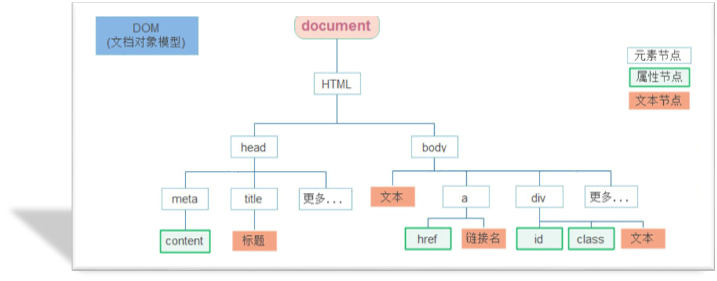

## 一、日期对象 (Date)

### 1.1 概述

**Date** 是JavaScript内置对象，用于表示日期和时间。

💡 **核心概念**：使用日期对象前必须先进行**实例化**（即使用 `new` 关键字创建对象）。

### 1.2 实例化方式

```javascript
// 方式1：获取当前日期和时间
const date = new Date();
console.log(date);  // 输出当前系统时间

// 方式2：获取指定日期和时间
const date1 = new Date('2099-12-12 08:08:08');
console.log(date1);  // 输出: 2099-12-12T00:08:08.000Z
```

### 1.3 日期格式化方法

#### 1.3.1 基础获取方法

| 方法            | 作用     | 返回值范围   | ⚠️ 注意事项        |
| :-------------- | :------- | :----------- | :---------------- |
| `getFullYear()` | 获取年份 | 四位数字年份 | —                 |
| `getMonth()`    | 获取月份 | `0 ~ 11`     | 实际月份需 **+1** |
| `getDate()`     | 获取日期 | `1 ~ 31`     | 随月份变化        |
| `getDay()`      | 获取星期 | `0 ~ 6`      | 0表示星期日       |
| `getHours()`    | 获取小时 | `0 ~ 23`     | 24小时制          |
| `getMinutes()`  | 获取分钟 | `0 ~ 59`     | —                 |
| `getSeconds()`  | 获取秒数 | `0 ~ 59`     | —                 |

```javascript
const myDate = new Date();

// 格式化输出示例
const year = myDate.getFullYear();        // 2023
const month = myDate.getMonth() + 1;      // 月份需要+1修正
const day = myDate.getDate();             // 27
const week = myDate.getDay();             // 5 (星期五)

console.log(`当前日期: ${year}年${month}月${day}日`);
```

#### 1.3.2 本地化方法

| 方法                   | 作用               | 输出示例             |
| :--------------------- | :----------------- | :------------------- |
| `toLocaleString()`     | 返回日期时间字符串 | `2023/1/27 23:19:20` |
| `toLocaleDateString()` | 返回日期部分       | `2023/1/27`          |
| `toLocaleTimeString()` | 返回时间部分       | `23:19:20`           |

```javascript
const date = new Date();

console.log(date.toLocaleString());      // 2023/1/27 23:19:20
console.log(date.toLocaleDateString());  // 2023/1/27
console.log(date.toLocaleTimeString());  // 23:19:20
```

💡 **实战示例**：实时时钟显示

```javascript
function getDateTime() {
    const date = new Date();
    return date.toLocaleString();
}

// 初始化显示，避免1秒空白期
const box = document.querySelector('.box');
box.innerText = getDateTime();

// 每秒更新
setInterval(function () {
      document.querySelector('.box').innerText = getDateTime();
}, 1000);
```

### 1.4 时间戳

**时间戳**是指从1970年01月01日00时00分00秒起至现在的总毫秒数（数字型）。

**应用场景**：倒计时计算

**计算公式**：

- 剩余毫秒数 = 将来时间戳 - 现在时间戳
- 将毫秒数转换为天/时/分/秒即得倒计时

```javascript
// 获取时间戳的三种方法

// 方法1：通过Date实例
const date = new Date();
console.log(date.getTime());

// 方法2：使用 + 运算符（隐式转换）
console.log(+new Date());

// 方法3：静态方法（推荐，性能最优）
console.log(Date.now());
```


## 二、DOM节点操作



### 2.1 DOM树与节点概念

**DOM树**：HTML文档的树状结构表现形式。

**节点类型**：

- **元素节点**（重点）：所有HTML标签，如 `<body>`、`<div>`
- **属性节点**：元素属性，如 `href`、`class`
- **文本节点**：元素内的文本内容

### 2.2 查找节点

利用节点关系查找，返回值为对象。

#### 2.2.1 父节点

```javascript
元素.parentNode
```

```javascript
// 示例：点击关闭按钮隐藏父容器
const closeBtn = document.querySelector('.close');

closeBtn.addEventListener('click', function() {
    // 通过子元素获取父节点
    this.parentNode.style.display = 'none';
});
```

#### 2.2.2 子节点

```javascript
父元素.children  // 返回所有子元素节点的集合（伪数组）
```

```javascript
const ul = document.querySelector('ul');

// 访问特定子元素
console.log(ul.children);           // 所有子元素
console.log(ul.children[0]);        // 第一个子元素
console.log(ul.children[2]);        // 第三个子元素
```

#### 2.2.3 兄弟节点

| 属性                     | 作用               |
| :----------------------- | :----------------- |
| `previousElementSibling` | 获取上一个兄弟元素 |
| `nextElementSibling`     | 获取下一个兄弟元素 |

```javascript
const li2 = document.querySelector('ul li:nth-child(2)');

console.log(li2.previousElementSibling);  // 上一个兄弟
console.log(li2.nextElementSibling);      // 下一个兄弟
```

### 2.3 增加节点

**操作流程**：

1. 创建新节点
2. 将节点插入到指定位置

| 方法                    | 作用             | 类比CSS    |
| :---------------------- | :--------------- | :--------- |
| `element.append(节点)`  | 在父元素末尾插入 | `::after`  |
| `element.prepend(节点)` | 在父元素开头插入 | `::before` |

```javascript
const ul = document.querySelector('ul');

// 创建节点
const newLi = document.createElement('li');
newLi.innerHTML = '我是新元素';

// 追加到末尾
ul.append(newLi);

// 插入到开头
const firstLi = document.createElement('li');
firstLi.innerHTML = '我是第一个';
ul.prepend(firstLi);
```

### 2.4 删除节点

```javascript
element.remove()
```

⚠️ **重要区别**：

| 操作                             | DOM树状态      | 页面显示   | 适用场景               |
| :------------------------------- | :------------- | :--------- | :--------------------- |
| `element.remove()`               | 节点被**移除** | 完全消失   | 彻底删除元素           |
| `element.style.display = 'none'` | 节点**保留**   | 隐藏不可见 | 临时隐藏，后续可能显示 |

```javascript
// 彻底删除节点
const removeEl = document.querySelector('.remove');
removeEl.remove();  // 从DOM树中完全移除

// 仅隐藏节点
const hideEl = document.querySelector('.hide');
hideEl.style.display = 'none';  // DOM中仍存在，仅不可见
```


## 三、移动端事件 (M端事件)

### 3.1 触摸事件概述

移动端特有的**触屏事件（Touch）**，适用于Android和iOS设备。

**Touch对象**：代表一个触摸点（手指或触控笔）。

### 3.2 常用触摸事件

| 事件         | 触发时机           |
| :----------- | :----------------- |
| `touchstart` | 手指触摸屏幕时     |
| `touchmove`  | 手指在屏幕上滑动时 |
| `touchend`   | 手指离开屏幕时     |

```javascript
const box = document.querySelector('.box');

// 触摸开始
box.addEventListener('touchstart', function() {
    console.log('触摸开始');
});

// 触摸滑动
box.addEventListener('touchmove', function() {
    console.log('触摸滑动中...');
});

// 触摸结束
box.addEventListener('touchend', function() {
    console.log('触摸结束');
});
```


## 四、JS插件使用

### 4.1 插件学习思路

1. **看官网**：了解插件功能与适用场景
2. **查文档**：阅读基本使用流程
3. **跑Demo**：找到符合需求的示例代码
4. **集成开发**：应用到实际项目中

### 4.2 AlloyFinger 手势插件

**AlloyFinger** 是腾讯AlloyTeam开源的超轻量级Web手势插件。

**使用步骤**：

1. **引入库文件**

   ```html
   <!-- 方式1：本地引入 -->
   <script src="alloy_finger.js"></script>
   
   <!-- 方式2：CDN引入 -->
   <script src="https://unpkg.com/alloyfinger@0.1.16/alloy_finger.js"></script>
   ```

2. **配置使用**

   ```javascript
   new AlloyFinger(element, {
       swipe: function(e) {
           // 滑动处理逻辑
           // e.direction 可判断方向: Left, Right, Up, Down
           console.log('滑动方向:', e.direction);
       }
   });
   ```


## 五、综合案例要点

### 5.1 数组遍历方法

```javascript
arr.forEach(function(element, index) {
    // element: 当前数组元素
    // index: 当前元素索引
    console.log(`索引${index}: ${element}`);
});
```

### 5.2 字符串截取

```javascript
字符串.substring(起始索引, [结束索引])
// 返回从起始索引到结束索引（不包含）的子字符串
```

### 5.3 核心思想转变

💡 **数据驱动视图**：减少对DOM的直接操作，通过**操作数据**来更新页面。

**开发模式**：

1. 所有增删操作针对**数组数据**
2. 根据数组数据**重新渲染页面**
3. 使用**事件委托**减少事件注册次数，并为动态新增元素自动绑定事件

**事件委托优势**：

- 减少事件注册数量，提升性能
- 自动处理新增元素的事件绑定
