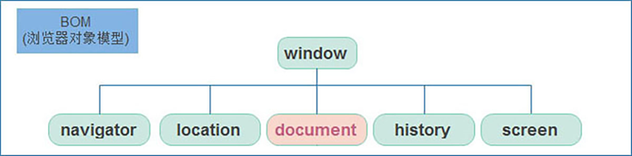

## 一、JavaScript 技术体系概览

JavaScript 由 **ECMAScript** 和 **Web APIs** 两大核心部分组成：

| 组成部分                        | 核心职责       | 关键知识点                                     |
| :------------------------------ | :------------- | :--------------------------------------------- |
| **ECMAScript**                  | 语言基础规范   | 变量、数据类型、流程控制、函数、对象等语法核心 |
| **DOM** (Document Object Model) | 文档对象模型   | 操作 HTML 文档的 API，实现页面元素增删改查     |
| **BOM** (Browser Object Model)  | 浏览器对象模型 | 操作浏览器窗口的 API，实现导航、存储、系统交互 |


## 二、BOM 浏览器对象模型





### 2.1 Window 对象 —— 全局顶级对象

`window` 对象是 BOM 的核心，也是 JavaScript 的**全局顶级对象**。

**核心特性**：

1. **全局作用域**：所有全局变量和函数自动挂载为 `window` 的属性和方法
2. **隐式调用**：访问 `window` 下的属性和方法时可省略 `window` 前缀
3. **内置对象聚合**：包含 `document`、`console`、`alert` 等常用对象

```javascript
// 以下三种写法等价
window.alert('Hello');
alert('Hello');        // 推荐写法

// 全局变量自动挂载
var username = 'Admin';
console.log(window.username);  // 输出: Admin
```

⚠️ **注意**：使用 `let` 或 `const` 声明的变量不会挂载到 `window` 对象。


### 2.2 定时器系统

JavaScript 提供两种定时器机制，适用于不同场景：

| 类型         | 方法                        | 执行特性                   | 清除方法                 |
| :----------- | :-------------------------- | :------------------------- | :----------------------- |
| **延迟执行** | `setTimeout(fn, delay)`     | 延迟指定时间后**执行一次** | `clearTimeout(timerId)`  |
| **间歇执行** | `setInterval(fn, interval)` | 每隔指定时间**重复执行**   | `clearInterval(timerId)` |

#### 💡 延迟函数 (setTimeout)

```javascript
// 1. 开启延迟函数 —— 3秒后执行一次
const timerId = setTimeout(function() {
  console.log('⏰ 延迟执行：我只执行一次');
}, 3000);

// 2. 返回值：正整数，表示定时器编号（用于清除）
console.log(timerId);  // 例如：1

// 3. 清除延迟函数（取消执行）
clearTimeout(timerId);
```

⚠️ **重要注意事项**：

1. **异步执行**：延迟函数需要等待，后续代码**优先执行**（非阻塞）
2. **单次执行**：`setTimeout` 仅执行一次，不同于 `setInterval` 的循环执行
3. **编号管理**：返回值可用于精准清除特定定时器


### 2.3 Location 对象 —— URL 操作中心

`location` 对象拆分并保存 URL 地址的各个组成部分，是页面导航的核心工具。

| 属性/方法  | 类型 | 功能说明                                           | 使用示例                                |
| :--------- | :--- | :------------------------------------------------- | :-------------------------------------- |
| `href`     | 属性 | 获取/设置**完整 URL**，赋值可实现页面跳转          | `location.href = 'https://example.com'` |
| `search`   | 属性 | 获取 URL 中 `?` 后的**查询参数**                   | `?search=笔记本&page=1`                 |
| `hash`     | 属性 | 获取 URL 中 `#` 后的**锚点值**（用于单页应用路由） | `#/music`                               |
| `reload()` | 方法 | 刷新当前页面                                       | `location.reload(true)` 强制刷新        |

```html
<body>
  <form>
    <input type="text" name="search"> 
    <button>搜索</button>
  </form>
  <a href="#/music">音乐</a>
  <a href="#/download">下载</a>
  <button class="reload">刷新页面</button>

  <script>
    // 1. href 属性 —— 获取完整地址或跳转
    console.log(location.href);  // 当前完整 URL
    // location.href = 'https://www.itcast.cn';  // 页面跳转

    // 2. search 属性 —— 获取查询参数
    console.log(location.search);  // 输出: ?search=笔记本

    // 3. hash 属性 —— 获取路由锚点
    console.log(location.hash);  // 输出: #/music 或 #/download

    // 4. reload() 方法 —— 刷新页面
    document.querySelector('.reload').addEventListener('click', function() {
      location.reload();      // 普通刷新（F5）
      // location.reload(true); // 强制刷新（Ctrl+F5）—— 跳过缓存
    });
  </script>
</body>
```


### 2.4 Navigator 对象 —— 浏览器信息检测

`navigator` 对象记录浏览器自身相关信息，常用于**设备类型检测**和**兼容性处理**。

**典型应用场景**：通过 `userAgent` 检测浏览器版本及平台，实现移动端自动跳转。

```javascript
// 检测 userAgent 实现移动端自动跳转
(function() {
  const userAgent = navigator.userAgent;
  
  // 正则匹配 Android 或 iPhone
  const isAndroid = /(Android);?[\s\/]+([\d.]+)?/.test(userAgent);
  const isIOS = /(iPhone\sOS)\s([\d_]+)/.test(userAgent);
  
  // 移动设备自动跳转至移动站点
  if (isAndroid || isIOS) {
    location.href = 'https://m.itcast.cn';
  }
})();
```


### 2.5 History 对象 —— 浏览历史管理

`history` 对象管理浏览器历史记录，与地址栏的前进/后退操作相对应。

**适用场景**：OA 办公系统、多步骤表单、单页应用（SPA）路由控制。

| 方法        | 功能         | 参数说明                         |
| :---------- | :----------- | :------------------------------- |
| `back()`    | 后退一页     | 无参数                           |
| `forward()` | 前进一页     | 无参数                           |
| `go(n)`     | 跳转指定页数 | 正数前进，负数后退，`go(0)` 刷新 |

```html
<body>
  <button class="back">← 后退</button>
  <button class="forward">前进 →</button>

  <script>
    // 前进操作
    document.querySelector('.forward').addEventListener('click', function() {
      // history.forward();  // 等价于 history.go(1)
      history.go(1);
    });

    // 后退操作
    document.querySelector('.back').addEventListener('click', function() {
      // history.back();  // 等价于 history.go(-1)
      history.go(-1);
    });
  </script>
</body>
```


## 三、本地存储系统（重点）

本地存储允许将数据持久化保存在浏览器中，**页面刷新或关闭后数据不丢失**。

### 3.1 核心优势

1. **数据持久化**：页面刷新或关闭不丢失数据
2. **容量充足**：`localStorage` 和 `sessionStorage` 约 **5MB** 存储空间
3. **纯前端实现**：无需后端接口即可实现数据存储


### 3.2 localStorage —— 长期本地存储

**特性**：数据长期保留在本地浏览器中，刷新页面和关闭页面均不会丢失。

**核心方法**（省略 `window` 前缀）：

| 方法     | 语法                               | 说明                               |
| :------- | :--------------------------------- | :--------------------------------- |
| 存储数据 | `localStorage.setItem(key, value)` | 键值对形式存储，**值必须为字符串** |
| 读取数据 | `localStorage.getItem(key)`        | 返回字符串类型的值                 |
| 删除数据 | `localStorage.removeItem(key)`     | 删除指定键值对                     |
| 清空所有 | `localStorage.clear()`             | 清除当前域名下所有存储             |

```javascript
// 本地存储 —— 基础操作示例
// 1. 存储数据（自动转换为字符串）
localStorage.setItem('username', 'Kimi');
localStorage.setItem('age', 18);  // 数字会被转为字符串

// 2. 读取数据（返回字符串）
const age = localStorage.getItem('age');
console.log(age);        // '18'
console.log(typeof age); // 'string'

// 3. 删除指定数据
localStorage.removeItem('age');

// 4. 清空所有存储
// localStorage.clear();
```


### 3.3 sessionStorage —— 会话级存储

**与 localStorage 的区别**：

| 特性         | localStorage           | sessionStorage                               |
| :----------- | :--------------------- | :------------------------------------------- |
| **生命周期** | 永久保存，除非手动删除 | 页面会话期间保存，**关闭浏览器标签页即清除** |
| **作用域**   | 同源窗口共享           | 同一标签页内有效                             |
| **API 方法** | 完全相同               | 完全相同                                     |

```javascript
// sessionStorage 用法与 localStorage 完全一致
sessionStorage.setItem('tempData', '临时数据');
const data = sessionStorage.getItem('tempData');
sessionStorage.removeItem('tempData');
```


### 3.4 存储复杂数据类型

⚠️ **核心问题**：本地存储只能存储**字符串**，无法直接存储对象或数组。

**解决方案**：使用 `JSON.stringify()` 和 `JSON.parse()` 进行序列化与反序列化。

#### 存储对象/数组（序列化）

```javascript
// 定义复杂数据类型
const product = {
  name: '小米13',
  price: 3999,
  specs: ['8GB+128GB', '12GB+256GB']
};

// ❌ 错误：直接存储会丢失数据
localStorage.setItem('product', product);
console.log(localStorage.getItem('product'));  // '[object Object]' —— 数据损坏！

// ✅ 正确：使用 JSON.stringify() 转换为 JSON 字符串
localStorage.setItem('product', JSON.stringify(product));
// 存储结果：'{"name":"小米13","price":3999,"specs":["8GB+128GB","12GB+256GB"]}'
```


#### 读取并还原数据（反序列化）

```javascript
// 从本地存储读取（得到的是 JSON 字符串）
const productStr = localStorage.getItem('product');
console.log(typeof productStr);  // 'string'

// ❌ 错误：直接使用字符串无法访问对象属性
// console.log(productStr.name);  // undefined

// ✅ 正确：使用 JSON.parse() 转换回对象
const productObj = JSON.parse(productStr);
console.log(productObj.name);   // '小米13'
console.log(productObj.price);  // 3999
console.log(productObj.specs);  // ['8GB+128GB', '12GB+256GB']
```

**完整流程示例**：

```javascript
// 完整的数据存取流程
const student = {
  id: '2024001',
  name: '张三',
  major: '计算机科学',
  employed: true
};

// 1. 存储：对象 → JSON 字符串
localStorage.setItem('student', JSON.stringify(student));

// 2. 读取：JSON 字符串 → 对象
const savedStudent = JSON.parse(localStorage.getItem('student'));

// 3. 使用数据
console.log(`学生 ${savedStudent.name} (${savedStudent.id}) 就业状态：${savedStudent.employed ? '已就业' : '未就业'}`);
```


## 四、数组高级方法

### 4.1 map() 方法 —— 数据映射转换

**功能**：遍历数组，对每个元素执行回调函数处理，**返回全新数组**（不改变原数组）。

**适用场景**：数据格式化、批量转换、渲染前的数据处理。

```javascript
const colors = ['red', 'blue', 'pink'];

// map 方法：处理数据并返回新数组
const colorDescriptions = colors.map(function(element, index) {
  // element: 当前数组元素 ('red', 'blue', 'pink')
  // index: 当前索引 (0, 1, 2)
  return `${element} 颜色（索引：${index}）`;
});

console.log(colorDescriptions);
// 输出：['red 颜色（索引：0）', 'blue 颜色（索引：1）', 'pink 颜色（索引：2）']
```

**map vs forEach 关键区别**：

| 方法        | 返回值                         | 主要用途           |
| :---------- | :----------------------------- | :----------------- |
| `map()`     | **返回新数组**（处理后的结果） | 数据转换、映射     |
| `forEach()` | `undefined`（无返回值）        | 纯遍历、执行副作用 |


### 4.2 join() 方法 —— 数组转字符串

**功能**：将数组所有元素连接为一个字符串，可自定义分隔符。

| 参数                    | 结果示例（基于 `['red', 'blue', 'pink']`） |
| :---------------------- | :----------------------------------------- |
| `join()` 或 `join(',')` | `red,blue,pink`（默认逗号分隔）            |
| `join('')`              | `redbluepink`（无分隔符）                  |
| `join(' | ')`           | `red | blue | pink`（自定义分隔符）        |
| `join('<br>')`          | HTML 换行拼接（常用于生成 HTML）           |

```javascript
const colors = ['red', 'blue', 'pink'];

// 1. map 处理数据
const processed = colors.map(ele => ele + '颜色');
// ['red颜色', 'blue颜色', 'pink颜色']

// 2. join 转换为字符串
console.log(processed.join());       // red颜色,blue颜色,pink颜色
console.log(processed.join(''));     // red颜色blue颜色pink颜色
console.log(processed.join(' | '));  // red颜色 | blue颜色 | pink颜色
```


## 五、知识总结与最佳实践

### 5.1 核心知识点回顾

```plain
┌─────────────────────────────────────────────────────────────┐
│                     Web APIs 技术体系                        │
├─────────────────────────────────────────────────────────────┤
│  ECMAScript (基础语法)                                        │
│  ├── 变量、数据类型、运算符                                    │
│  ├── 流程控制（if/for/while）                                 │
│  └── 函数、对象、数组                                         │
├─────────────────────────────────────────────────────────────┤
│  DOM (文档操作)     ← 操作 HTML 元素                           │
│  └── 元素选择、内容修改、样式控制、事件绑定                      │
├─────────────────────────────────────────────────────────────┤
│  BOM (浏览器操作)   ← 本节课重点                               │
│  ├── window (全局对象、定时器)                                 │
│  ├── location (URL 操作、页面跳转)                             │
│  ├── navigator (浏览器信息、设备检测)                          │
│  ├── history (历史记录管理)                                    │
│  └── Storage (本地存储)                                       │
│      ├── localStorage (永久存储)                             │
│      ├── sessionStorage (会话存储)                           │
│      └── JSON 序列化 (复杂数据类型存储)                        │
└─────────────────────────────────────────────────────────────┘
```

