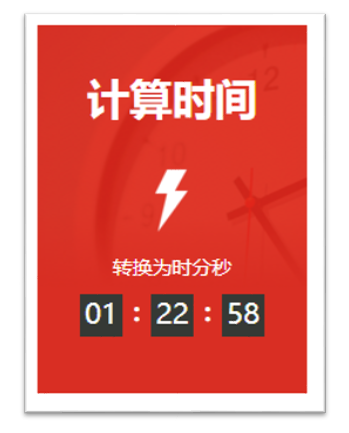

## 一、函数基础

### 1.1 什么是函数

**函数** 是可以被重复使用的代码块，用于将具有相同或相似逻辑的代码进行"包裹"，实现代码复用。

#### 函数声明语法

```javascript
function 函数名(参数1, 参数2...) {
  // 函数体
  return 结果
}
```

一个完整的函数声明包含5个部分：

| 组成部分 | 说明                               | 示例              |
| :------- | :--------------------------------- | :---------------- |
| 关键字   | 使用 `function` 关键字             | `function`        |
| 函数名   | 采用**小驼峰命名法**，建议使用动词 | `sayHi`, `getSum` |
| 形式参数 | 小括号内声明，用于接收传递的数据   | `(x, y)`          |
| 函数体   | 大括号内的代码逻辑                 | `{ ... }`         |
| 返回值   | 使用 `return` 返回结果             | `return x + y`    |

#### 函数调用

```javascript
// 1. 声明函数
function sayHi() {
  console.log('嗨~')
}

// 2. 调用函数
sayHi()  // 输出: 嗨~
sayHi()  // 可重复调用
```

⚠️ **注意**：函数必须被调用才会执行，使用 `()` 进行调用。

### 1.2 函数参数

通过向函数传递参数，可以让函数更加灵活多变。

#### 形参与实参

| 概念     | 定义           | 位置                 |
| :------- | :------------- | :------------------- |
| **形参** | 形式上的参数   | 函数声明时的小括号内 |
| **实参** | 实际传递的参数 | 函数调用时的小括号内 |

```javascript
// 形参：x, y
function sum(x, y) {
  return x + y
}

// 实参：1, 2
console.log(sum(1, 2))  // 输出: 3
```

#### 参数个数不匹配的处理

```javascript
function sum(x, y) {
  return x + y
}

// 1. 形参过多 → 自动补充 undefined
console.log(sum(1))      // NaN (1 + undefined)

// 2. 实参过多 → 多余的被忽略
console.log(sum(1, 2, 3))  // 3

// 3. 最佳实践：保持形参和实参个数统一
```

### 1.3 函数默认参数

可以给形参设置默认值，当缺少实参传递或传递 `undefined` 时生效。

```javascript
function sum(x = 0, y = 0) {
  return x + y
}

console.log(sum())                    // 0
console.log(sum(undefined, undefined)) // 0
console.log(sum(1, 2))                // 3
```

💡 **技巧**：默认参数主要处理函数形参，语法比逻辑中断更简洁。

### 1.4 逻辑中断（逻辑短路）

逻辑中断存在于逻辑运算符 `&&` 和 `||` 中，满足条件时会中断代码执行。

| 运算符 | 中断条件       | 说明                                    |
| :----- | :------------- | :-------------------------------------- |
| `&&`   | 左边为 `false` | 返回左边值；左边为 `true` 则返回右边值  |
| `||`   | 左边为 `true`  | 返回左边值；左边为 `false` 则返回右边值 |

```javascript
// 逻辑与中断
console.log(false && 1 + 2)  // false (中断)
console.log(true && 1 + 2)   // 3

// 逻辑或中断
console.log(true || 1 + 2)   // true (中断)
console.log(false || 1 + 2)  // 3
```

#### 应用场景：参数默认值

```javascript
function sum(x, y) {
  x = x || 0  // 如果 x 为 falsy 值，则赋值为 0
  y = y || 0
  return x + y
}

console.log(sum())      // 0
console.log(sum(1, 2))  // 3
```

### 1.5 函数返回值

使用 `return` 关键字将函数内部执行结果传递到外部。

```javascript
function sum(x, y) {
  return x + y
}

let result = sum(1, 2)
console.log(result)  // 3
```

#### 返回值注意事项

| 注意事项       | 说明                                                    |
| :------------- | :------------------------------------------------------ |
| **终止函数**   | `return` 会立即结束函数，后续代码不执行                 |
| **不要换行**   | `return` 和被返回的结果之间不允许换行，否则自动补充分号 |
| **默认返回值** | 没有 `return` 时，函数默认返回 `undefined`              |

```javascript
// 1. return 终止函数
function test() {
  return '结果'
  console.log('这行不会执行')
}

// 2. 不要换行（错误示例）
function badSum(x, y) {
  return  // 相当于 return;
  x + y   // 不会执行
}

// 3. 无 return 返回 undefined
function fn() {}
console.log(fn())  // undefined
```


## 二、作用域

**作用域（Scope）**：变量或值在代码中可用性的范围。

### 2.1 全局作用域

作用于所有代码执行的环境（整个 `<script>` 标签内部或独立的 JS 文件）。

```javascript
// 全局变量
let globalVar = '我是全局变量'

function test() {
  console.log(globalVar)  // 可以访问
}
```

### 2.2 局部作用域

| 类型           | 范围             | 示例                              |
| :------------- | :--------------- | :-------------------------------- |
| **函数作用域** | 函数内部         | `function fn() { ... }`           |
| **块级作用域** | 大括号 `{}` 内部 | `if () { ... }`, `for () { ... }` |

```javascript
function test() {
  let localVar = '我是局部变量'  // 函数作用域
  console.log(localVar)
}

// console.log(localVar)  // 报错：未定义

if (true) {
  let blockVar = '块级变量'  // 块级作用域
}
```

⚠️ **注意**：

- 函数内部变量未声明直接赋值，会被视为全局变量（**强烈不推荐**）
- 函数形参可视为局部变量

### 2.3 变量访问原则

**就近原则**：在能够访问到的情况下，先找局部，局部没有再找全局。

```javascript
let x = 10  // 全局变量

function test() {
  let x = 20  // 局部变量
  console.log(x)  // 20（优先访问局部）
}

test()
console.log(x)  // 10
```


## 三、匿名函数

函数分为**具名函数**（有名字）和**匿名函数**（无名字）。

### 3.1 函数表达式

将匿名函数赋值给变量，通过变量名称调用。

```javascript
// 声明
let fn = function() {
  console.log('函数表达式')
}

// 调用
fn()
```

#### 特点

1. 函数也是一种数据类型
2. **必须先定义，后使用**（不存在函数提升）
3. 形参和实参使用与具名函数一致

### 3.2 立即执行函数（IIFE）

**IIFE**（Immediately Invoked Function Expression）：在定义后立即执行的函数表达式。

#### 语法格式

```javascript
// 写法1：括号包裹函数表达式
(function() {
  console.log('立即执行1')
})()

// 写法2：括号包裹函数声明
(function() {
  console.log('立即执行2')
}())
```

#### 核心作用

- ⚠️ **避免全局变量污染**：创建独立的作用域
- 封装私有变量
- 模块化开发基础

#### 注意事项

```javascript
// 多个 IIFE 之间必须用分号隔开
(function() { ... })();
(function() { ... })();

// 带参数的 IIFE
(function(a, b) {
  console.log(a + b)
})(1, 2)  // 输出: 3
```


## 四、综合案例：时间转换器



### 需求分析

用户输入秒数，自动转换为**时:分:秒**格式显示。

### 计算公式

| 单位 | 计算公式                              |
| :--- | :------------------------------------ |
| 小时 | `h = parseInt(总秒数 / 60 / 60 % 24)` |
| 分钟 | `m = parseInt(总秒数 / 60 % 60)`      |
| 秒数 | `s = parseInt(总秒数 % 60)`           |

### 完整代码实现

```javascript
// 1. 获取用户输入的总秒数
let totalSeconds = +prompt('请您输入总的秒数:')

// 2. 封装转换函数
function getTime(t = 0) { // 💡 默认参数：t = 0 防止无输入时出错
  // 计算时分秒
  let h = parseInt(t / 60 / 60 % 24)  // 小时
  let m = parseInt(t / 60 % 60)       // 分钟
  let s = parseInt(t % 60)            // 秒数
  
  // 数字补0（小于10时前面加0）
  h = h < 10 ? '0' + h : h
  m = m < 10 ? '0' + m : m
  s = s < 10 ? '0' + s : s
  
  // 返回HTML字符串
  return `
    <span class="hour">${h}</span>
    <span class="minute">${m}</span>
    <span class="second">${s}</span>
  `
}

// 3. 调用函数并渲染到页面
let str = getTime(totalSeconds)
document.write(`
  <div class="timer">
    ${str}
  </div>
`)
```