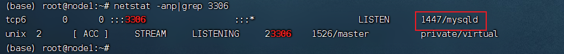
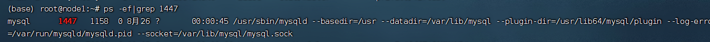
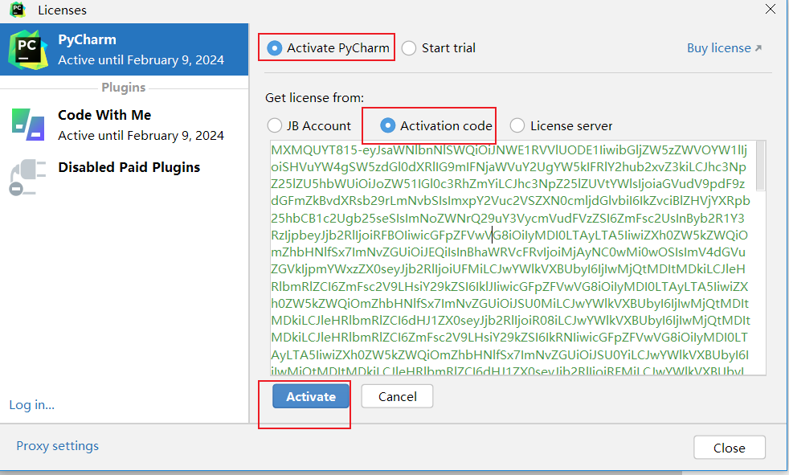
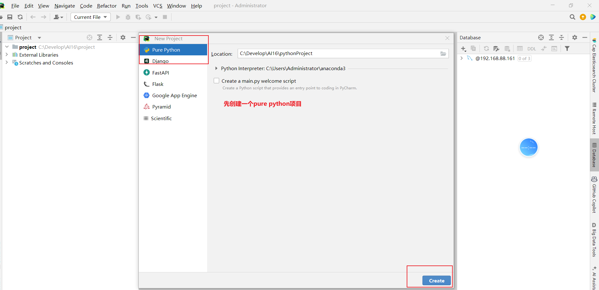
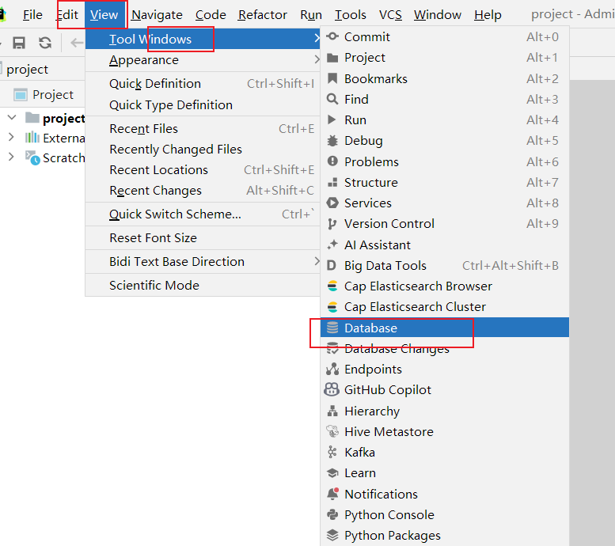
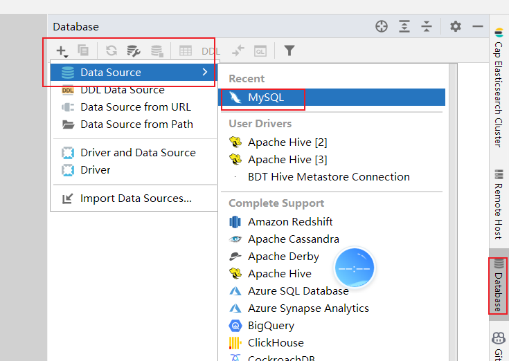
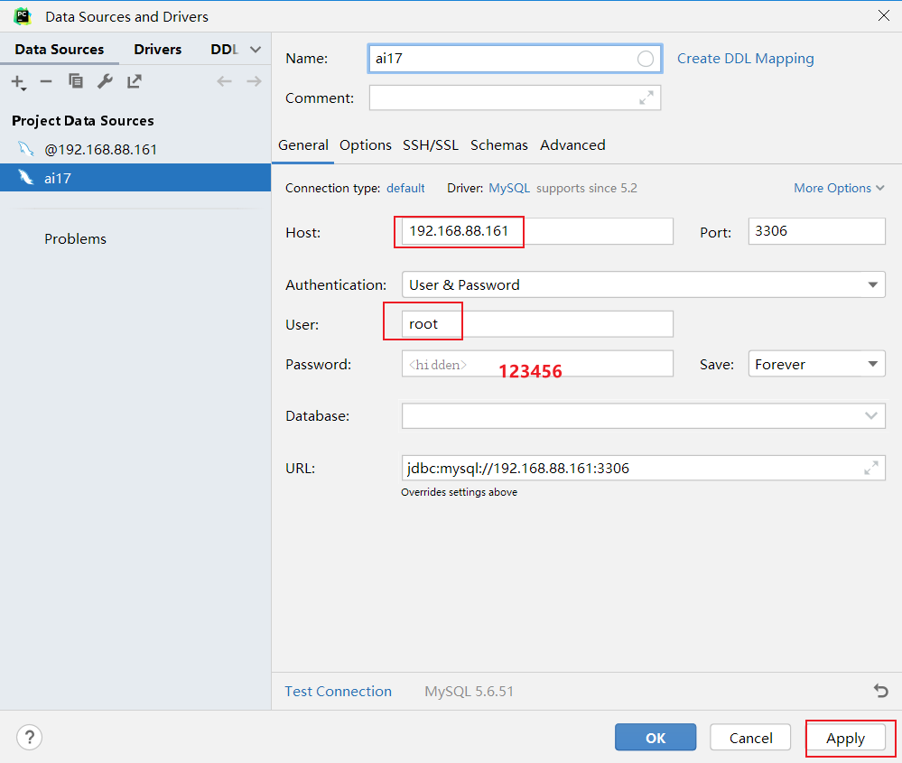
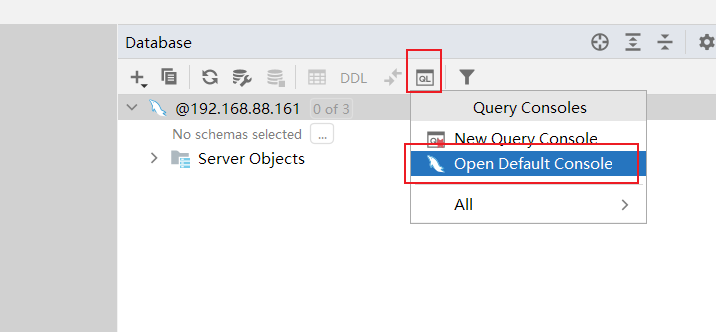

## `Linux`使用技巧

### 1 常用快捷键

- ctrl + c 强制停止
- ctrl + d 退出登出
- `history` 查看历史命令
- !命令前缀，自动匹配上一个命令
- ctrl + r，搜索历史命令
-  ctrl + a | e，光标移动到命令开始或结束
- ctrl + ← | →，左右跳单词
- ctrl + l 或 clear命令 清屏


### 2 软件安装

- apt：是 Debian 和基于 Debian 的 Linux 发行版（如 Ubuntu）中使用的软件包管理工具，用于自动化安装配置`Linux`软件，并可以自动解决依赖问题。

- 使用 `apt` 进行软件包管理：

  - **更新软件源**：在安装或升级任何软件包之前，首先需要更新本地的软件源列表。通过更新软件源，系统可以获取到最新的软件包信息和版本。使用以下命令来更新软件源：

    ```shell
    sudo apt update
    ```

  - **安装、移除、升级软件包**：

    ```shell
    sudo apt install package_name # 安装一个软件包
    sudo apt install package1 package2 # 可要安装多个包，以空格分隔
    sudo apt install /full/path/file.deb # 要安装本地 deb 文件，需提供文件的完整路径，否则该命令将尝试从 APT 存储库检索并安装该程序包。
    sudo apt remove package_name # 删除已安装的软件包
    sudo apt remove package1 package2 # 删除指定多个包，以空格分隔
    sudo apt upgrade # 将已安装的软件包升级到最新版本
    sudo apt upgrade package_name # 升级单个包
    ```

  - 查看软件包列表：

  ```shell
  sudo apt list # 列出所有可用包
  sudo apt list --installed # 列出已安装的包
  ```


### 3 服务/软件 打开关闭 `systemctl`

`Linux`系统很多软件（内置或第三方）均支持使用`systemctl`命令控制：启动、停止、开机自启。能够被`systemctl`管理的软件，一般也称之为：服务

```shell
systemctl start|stop|status|enable|disable 软件名
```

>start 启动
>
>stop 关闭
>
>status 查看状态
>
>enable 开启开机自启
>
>disable 关闭开机自启

应用场景:  修改了网络配置, 需要重启网络的服务 `systemctl stop/start`

- 系统内置的服务比较多，比如：

  - NetworkManager，主网络服务

  - ufw，防火墙服务

  - ssh，ssh服务（FinalShell远程登录`Linux`使用的就是这个服务）

    

### 4 软连接

在系统中创建软链接，可以将文件、文件夹链接到其它位置。类似Windows系统中的《快捷方式》

语法：`ln -s 参数1 参数2`

- -s选项，创建软连接

- 参数1：被链接的文件或文件夹；参数2：要链接去的目的地


### 5 IP地址/域名解析/主机名

想联网访问互联网, 必须有IP地址：ip地址两个版本 ipv4、ipv6。ipv4： a.b.c.d  4个8位二进制数组成（0-255）

- 特殊IP有：127.0.0.1，本地回环IP，表示本机。

- 0.0.0.0：也可表示本机，也可以在一些白名单中表示任意IP

通过域名访问网络服务, 先要进行域名解析

- 通过本地的hosts 记录域名和ip的对应关系
  - `windows` C:\Windows\System32\drivers\etc\hosts
  - `Linux` /etc/hosts
- DNS服务 在网络上记录了域名和ip的对应关系
  - 8.8.8.8  114.114.114.114

主机名, 每一台机器都有名字

- hostname查看主机名

- `hostnamectl set-hostname 主机名`，修改主机名（需root）

  

### 6 ubantu 固定ip设置(了解)

**为什么需要固定IP：**

当前我们虚拟机的`Linux`操作系统，其IP地址是通过DHCP服务获取的。**DHCP**：动态获取IP地址，即每次重启设备后都会获取一次，可能导致IP地址频繁变更。

原因：办公电脑IP地址变化无所谓，但是我们要远程连接到Linux系统，如果IP地址经常变化我们就要频繁修改适配很麻烦。

固体步骤用到了查看，现在看对学习没有很大用处。


### 7 网络操作/文件下载

- `ping`：测试网络是否联通 。语法：`ping url /ping ip`
  
  - ping 192.168.88.2  测局域网通不通
  - ping baidu.com 测互联网是否联通
  
- `wget`：是非交互式的文件下载器，可以在命令行内下载网络文件。语法：`wget  [-b]  url`
  
  - 选项：-b，可选，后台下载，会将日志写入到当前工作目录的wget-log文件
  - 参数：url，下载链接
  
- `curl`：发送http请求的命令，可用于：下载文件、获取信息等。语法：`curl [-o] url`
  
  - 选项：-O，用于下载文件，当url是下载链接时，可以使用此选项保存文件
  
  - 参数：url，要发起请求的网络地址
  
    

### 8 端口占用查看/进程查询	

**端口**：是设备与外界通讯交流的出入口。端口可以分为物理端口和虚拟端口两类。

- 物理端口：又可称之为接口，是可见的端口，如USB接口，HDMI端口等。
- 虚拟端口：是指计算机内部的端口，是不可见的，是用来操作系统和外部进行交互使用的。
  - 虚拟端口的作用：计算机程序之间的通讯，通过IP只能锁定计算机，但是无法锁定具体的程序。通过端口可以锁定计算机上具体的程序，确保程序之间进行沟通

- `Linux`系统可以支持65535个端口，这6万多个端口分为3类进行使用：
  - 公认端口：1~1023，通常用于一些系统内置或知名程序的预留使用，如SSH服务的22端口，HTTPS服务的443端口，**非特殊需要，不要占用这个范围的端口**
  - 注册端口：1024~49151，通常可以随意使用，用于松散的绑定一些程序\服务
  - 动态端口：49152~65535，通常不会固定绑定程序，而是当程序对外进行网络链接时，用于临时使用。


**查看端口占用**

- 可以通过使用nmap命令查看端口的占用情况。
  - 语法：`nmap 被查看的ip地址`。例如：`nmap 127.0.0.1`
- 可以通过netstat命令，查看指定端口的占用情况
  - 语法：`netstat -anp | grep 端口号`
  - 可以查看指定端口被占用的情况 获取占用端口的进程ID




**查看进程**

为管理运行的程序，每一个程序在运行的时候，便被操作系统注册为系统中的一个：进程。并会为每一个进程都分配一个独有的：进程ID（进程号），可以用过ps命令查看Linux系统中的进程信息。

- 语法：**ps -ef**    查看进程相关的所有信息

  - 选项：-e，显示出全部的进程

  - 选项：-f，以完全格式化的形式展示信息（展示全部信息）

    

  - 从左到右分别是：

    - **UID**：进程所属的用户**ID**
    - **PID**：进程的进程号**ID**
    - **PPID**：进程的父**ID**（启动此进程的其它进程）
    - **C**：此进程的**CPU**占用率（百分比）
    - **STIME**：进程的启动时间
    - **TTY**：启动此进程的终端序号，如显示**?**，表示非终端启动
    - **TIME**：进程占用**CPU**的时间
    - **CMD**：进程对应的名称或启动路径或启动命令

- 查看指定进程
  - 语法：`ps -ef |grep tail`，过滤不仅仅过滤名称，进程号，用户ID等等，都可以被grep过滤哦。




**关闭进程**

语法：`kill [-9] 进程id`，选项：-9，表示强制关闭进程

查询出1447是mysql占用之后, 可以根据当前情况判断

- 如果端口冲突, 可以选择换端口
- kill -9 1447


### 9 环境变量

环境变量是一组信息记录，类型是KeyValue型（名称=值），用于操作系统运行的时候记录关键信息

- 配置环境变量的时候, 主要就是配置PATH
- PATH 是一系列的**文件夹**, 多个文件夹之间用 **:** 隔开
- 配置了PATH之后, 在PATH中的可执行文件, 在任何一个工作目录下敲文件名就可以直接执行了


**$**符号：在Linux系统中，**$**符号被用于取”变量”的值，如`echo $PATH`，又或者：`echo ${PATH}ABC`，当和其它内容混合在一起的时候，可以通过{}来标注取的变量是谁。


**`Linux` 配置环境变量**

- 临时设置：
  - 语法：**`export 变量名=变量值`**      或者       **`变量名=变量值`**
  - `export PATH=$PATH:/home/itheima/myenv`
  - 直到当前 Shell 会话结束（关闭终端或退出 Shell），若使用 `export`，变量对当前 Shell **及其启动的子进程**可见。若未使用 `export`，变量仅对当前 Shell 有效，子进程无法继承。
- 永久生效：
  - 针对当前用户：~/.bashrc文件中配置
  - 针对全部用户：/etc/profile文件中配置
  - 配置完成，可以通过source命令立刻生效

```shell
source /etc/profile
source ~/.bashrc
```

创建一个文件mkhaha 添加可执行的权限：chmod +x mkhaha


### 10 上传、下载

宿主机与虚拟机之间的文件交换

- FinalShell软件的下方窗体中，提供了Linux的文件系统视图，可以方便的上传下载
- 可以通过rz、sz命令进行文件传输
  - 上传命令，语法：`rz`
  - 下载命令，语法：`sz 要下载的文件`
  - 文件会自动下载到桌面的：fsdownload文件夹中


### 11 压缩解压缩

以下为Linux系统常用的压缩格式：tar、gzip、zip


**tar命令**

- 压缩文件后缀名：.tar及.gz
  - .tar，称之为tarball，归档文件，即简单的将文件组装到一个.tar的文件内，并没有太多文件体积的减少，仅仅是简单的封装
  - .gz，也常见为.tar.gz，gzip格式压缩文件，即使用gzip压缩算法将文件压缩到一个文件内，可以极大的减少压缩后的体积
- 语法：`tar [-c -v -x -f -z -C] 参数1 参数2 ... 参数N`
  - -c，创建压缩文件，用于压缩模式
  - -v，显示压缩、解压过程，用于查看进度
  - -x，解压模式
  - -f，要创建的文件，或要解压的文件，-f选项必须在所有选项中位置处于最后一个
  - -z，gzip模式，不使用-z就是普通的tarball格式
  - -C，选择解压的目的地，用于解压模式

示例：tar/tar.gz

- 打tar包：`tar -cvf xxxx.tar 文件名`

- 打 tar.gz包：`tar -zcvf xxxx.tar 文件名`

- 解开tar包：`tar -xvf xxxx.tar -C 要解开的目的地路径`

- 解开tar.gz包：`tar -zxvf xxxx.tar -C 要解开的目的地路径`

- 注意：

  - -f选项，必须在选项组合体的最后一位
  
  - -z选项，建议在开头位置
  
  - -C选项单独使用，和解压所需的其它参数分开


**zip** **命令**

- 压缩语法：`zip [-r] 参数1 参数2 ... 参数N`
  - -r，被压缩的包含文件夹的时候，需要使用-r选项，和rm、cp等命令的-r效果一致
- 解压语法：unzip [-d] 参数
  - -d，指定要解压去的位置，同tar的-C选项
  - 参数，被解压的zip压缩包文件


示例：zip

- 打包zip：`zip [-r] XXX.zip  要打包的文件 .....`

- 解压zip：`unzip xxx.zip -d 指定要解压的目录`


## Mysql

环境配置

激活pycharm



先创建一个python的项目



找到 Database 工具栏



配置mysql 链接, 这里使用centos上的Mysql (连之前centos一定要打开)

- ip 192.168.88.161
- 用户名 root
- 密码 123456

mac 同学在mac本地安装一下  ip  127.0.0.1

https://zhuanlan.zhihu.com/p/599351042





配置好Mysql连接之后, 打开默认控制台, 可以在里面写SQL



### 1 数据库简介

数据库就是存储数据的仓库，用户可以对数据库中的数据进行增加，修改，删除及查询操作。

数据库分为关系型数据库和非关系型数据库。

常用的关系型数据库有：MySQL，Oracle，DB2，SQLserver，sqlite

常用的非关系型数据库有：Redis，Hbase，MongoDB

### 2 Mysql 简介

MySQL的特点：免费，支持大型数据库，标准的SQL语言形式，跨平台。

课程使用的版本 centos上装的是5.6.51  不支持窗口函数 window function

后面使用MySQL8.0版本。2018

MySQL登录的两种方式：

方法一：mysql -uroot -p123456

方法二：mysql --host=192.168.88.161 --user=root --password=123456

### 3 SQL 语言介绍

- 结构化查询语言(Structured Query Language)简称SQL，是关系型数据库管理系统都需要遵循的规范，是数据库认识的语句。不同的数据库生产厂商都支持SQL语句，但都有自己特有内容。

- 标准SQL 

  - Mysql 支持的SQL 可以看做是标准SQL的方言 (大多数都一样, 少部分区别)
  - Oracle 支持的SQL 可以看做是标准SQL的方言

- SQL 的分类

  操作数据库数据表  DDL

  对数据进行增加删除修改 DML

  对数据库进行**查询 DQL**

  DCL  权限控制, 用户创建管理   不涉及(DBA 管理)

- SQL 注释

```
/**/：多行注释，在注释区域内可以随意换行
-- # ：单行注释，写在语句开头，换行后注释截止。
单行注释快捷键：ctrl+/
```

- 常用的数据类型：
  - 字符：char，varchar
  - 整数：int
  - 浮点型：float, double,decimal
  - 日期型：date，datetime


### 4 SQL语言的DDL

**DDL 建库建表** →DML 向表中写入数据(修改, 删除) → DQL(数据查询)

数据库操作

- 创建数据库：CREATE DATABASE 数据库名；
- 查看数据库：SHOW DATABASES;
- 删除数据库：DROP DATABASE 数据库名；
- 使用数据库：USE 数据库名

```sql
-- DDL 创建数据库
create database if not exists ai_db charset =utf8;
-- create database if not exists 数据库名 charset=字符集
show databases;

-- 删除数据库
DROP DATABASE ai_db;

-- 选中一个数据库, 后续操作, 都在这个数据库中进行
use ai_db;
```

数据表操作

创建表：CREATE TABLE 表名(字段名 类型 约束…)

查询表：SHOW TABLES;     DESC 表名；

删除表：drop table 表名;

修改表：

- alter  table  表名  add  列名  类型(长度)  [约束];   增加一列
- alter table 表名 change 旧列名 新列名 类型(长度) 约束;  修改一列名字
- alter table 表名 drop 列名;	删除一列
- rename table 表名 to 新表名;  修改表名

```sql
-- 选中一个数据库, 后续操作, 都在这个数据库中进行
use ai_db;

-- DDL 对数据表的操作
-- 创建数据表
create table category(cid varchar(20) primary key not null ,cname varchar(100));

-- 查看当前数据库有哪些数据表
show tables;
-- 查看表结构
desc category;

use mysql;
show tables;
desc plugin;

-- 添加字段, 需要注意这里添加的字段 字段的名字和sql的关键字冲突了,
-- 如果非要使用SQL的关键字作为字段名 需要添加 ``
-- alter table 表名 add `字段名字 字段类型;
alter table category add `desc` varchar(20);
desc category;

alter table category add num varchar(20);

-- 修改字段名字  alter table 表名 change 老字段名 新字段名字 类型;
alter table category change `desc` description varchar(20);

-- 删除字段 alter table 表名 drop 字段名;
alter table category drop description;

-- rename table 表名 to 新表名;
rename table category to category2;
show tables;


use ai_db;
drop table ai_db.category;
```

### 5 SQL语言的DML

插入记录：格式：insert into 表 (字段1,字段2,字段3...) values(值1,值2,值3...),(值1,值2,值3...)…;

更新记录：格式：update 表名 set 字段名=值,字段名=值,...;

删除记录：delete from 表名 [where 条件];truncate category;

```sql
-- DML
-- 插入数据 insert into
insert into category values ('c001','电器');
insert into category values ('c002','衣服');
insert into category2 values ('c002','衣服',3);
insert into category2(cid,cname) values ('c001','电器');
# insert into category2(cname,num) values ('衣服',3);
insert into category2 (cid, cname) values('03','化妆品'),('04','书籍'),('05',null);
insert into category2 values('06','玩具',4),('07','蔬菜',5);

-- 修改数据
-- 格式：update 表名 set 字段名=值,字段名=值,... where 条件
update category2 set cname = '家电';
# where;
update category2 set cname='水果' where cid='c001';


delete from category2 where cid='c002';
delete from category;
truncate category2;
```

>update category2 set cname = '家电';
>
>delete from category;
>
>update 不带where条件会一次性修改 要修改字段的所有的记录
>
>delete from  不带where条件, 会删除所有记录


## 小结

`Linux`使用技巧

网络下载软件, 解压缩, 修改配置文件, 配置环境变量, 启动服务

- 有可能会出现端口冲突
- 查询端口占用情况  netstat -anp | grep 端口号   → 获取到占用端口的 pid
- 通过端口占用的对应的程序pid 查询进程的详细信息决定 换端口还是kill占用的程序
  - ps -ef|grep pid编号
  - kill -9 进程编号

Mysql

- 关系型数据库/非关系型数据库

  - 写在表格中的数据, 有固定的表结构, 每个字段都有固定的数据类型这种数据就是关系型数据, Mysql这类关系型数据库处理的就是这种数据

  - 非关系型数据 没有固定的表结构, 每个字段存储数据大小不固定
    - 视频
    - 图片
    - 长文本

- SQL 

  - ISO SQL 标准SQL
  - Mysql  Oracle SqlSever DM2
  - DDL DML DQL DCL

- 今天作业

  - `Linux` 思维导图 补充完整
  - SQL 

编码

iso8859-1 没有中文

gbk

utf-8

username char(3)
