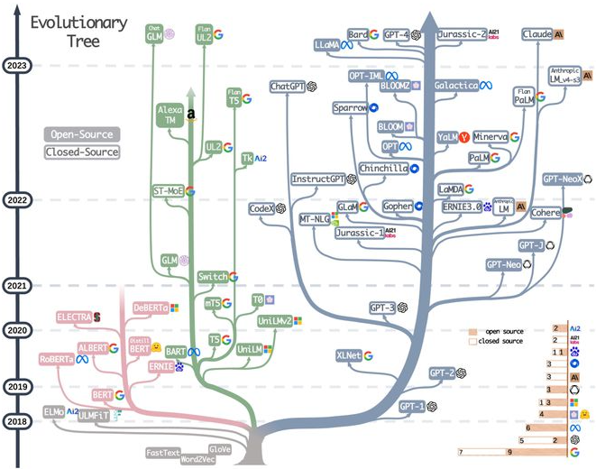
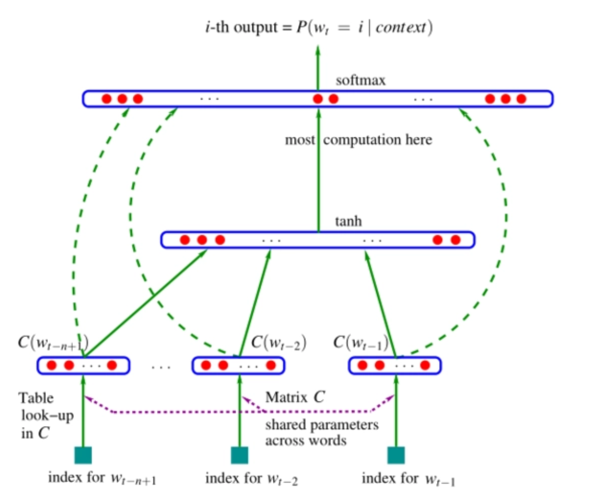

## 1. 大语言模型(LLM)技术背景

### 1.1 核心定义

大语言模型(Large Language Model, LLM)是基于深度学习的人工智能模型，专为理解和生成人类语言而设计。这类模型能够处理多种自然语言任务，包括文本分类、问答系统、机器翻译、对话生成等复杂场景。

**关键参数标准**：当前业界将参数量超过**100亿(10B)**的预训练语言模型定义为"大语言模型"，典型代表包括：

- GPT-3 (1750亿参数)
- PaLM (5400亿参数)
- LLaMA (1300亿参数)
- 文心一言、ChatGLM等国产大模型



### 1.2 技术演进三阶段

| 阶段         | 时间      | 核心特征                                | 典型模型               | 技术范式                   |
| :----------- | :-------- | :-------------------------------------- | :--------------------- | :------------------------- |
| **第一阶段** | 2018-2019 | 自监督训练目标(MLM/NSP)+Transformer架构 | BERT、GPT、XLNet       | Pre-training + Fine-tuning |
| **第二阶段** | 2020-2021 | 规模化参数与语料，探索多元架构          | BART、T5、GPT-3        | 大规模预训练               |
| **第三阶段** | 2022至今  | **AIGC时代**，千亿参数，对话式交互      | ChatGPT、GPT-4、PaLM-2 | 人机对齐、多模态生成       |


## 2. 语言模型(Language Model)

### 2.1 数学定义

语言模型旨在建模词汇序列的生成概率，其核心任务是计算句子序列$S = \{W_1, W_2, W_3, \dots, W_n\}$ 出现的概率 $P(S)$ 。

**通俗理解**：判断一句话"像不像人话"的概率评估工具。概率越高，说明该序列越符合自然语言规律。


**标准定义**：
$$
P(S) = P(W_1, W_2, \dots, W_n) = P(W_1) \cdot P(W_2|W_1) \cdot \cdots \cdot P(W_n|W_1, W_2, \dots, W_{n-1})
$$
**关键洞察**：只要能准确计算条件概率$P(W_n|W_1, W_2, \dots, W_{n-1})$，就能推导出整个句子的概率分布。


### 2.2 应用视角

从文本生成角度，语言模型也可定义为：**给定前文语境，预测下一个最可能出现的词**。这构成了现代LLM自回归生成的基础。


## 3. 语言模型技术演进路线

### 3.1 基于统计的N-gram模型

#### 3.1.1 核心思想

为解决全序列概率计算的参数爆炸问题，引入**马尔可夫假设**：词的出现概率仅与前面有限个词相关。
$$
P(W_n | W_1, \dots, W_{n-1}) = P(W_n | W_{n-N}, \dots, W_{n-1})
$$

> 其中 N 表示马尔可夫阶数，即当前词只依赖于前面的 N 个词。


#### 3.1.2 三种典型形式

| 模型类型    | 公式表达                                                     | 依赖长度      | 参数规模    |
| ----------- | ------------------------------------------------------------ | ------------- | ----------- |
| **Unigram** | $$P(S) = \prod_{i=1}^n P(W_i)$$                              | 0（词间独立） | $$\|V\|$$   |
| **Bigram**  | $$P(S) = P(W_1) \prod_{i=2}^n P(W_i\|W_{i-1})$$              | 1个前驱词     | $$\|V\|^2$$ |
| **Trigram** | $$P(S) = P(W_1)P(W_2\|W_1) \prod_{i=3}^n P(W_i\|W_{i-1},W_{i-2})$$ | 2个前驱词     | $$\|V\|^3$$ |


#### 3.1.3 工作原理解析（Bigram示例）

假设语料库统计结果如下：

| 词对      | 计数 | 前驱词 | 计数 |
| :-------- | :--- | :----- | :--- |
| (我,想)   | 800  | 我     | 2100 |
| (想,去)   | 600  | 想     | 900  |
| (去,打)   | 690  | 去     | 2000 |
| (打,篮球) | 20   | 打     | 800  |

**计算过程：**
$$
P(\text{想} \mid \text{我}) = \frac{C(\text{我, 想})}{C(\text{我})} = \frac{800}{2100} \approx 0.38
$$

$$
P(\text{去} \mid \text{想}) = \frac{C(\text{想, 去})}{C(\text{想})} = \frac{600}{900} \approx 0.67
$$

$$
P(\text{打} \mid \text{去}) = \frac{C(\text{去, 打})}{C(\text{去})} = \frac{690}{2000} = 0.345
$$

$$
P(\text{篮球} \mid \text{打}) = \frac{C(\text{打, 篮球})}{C(\text{打})} = \frac{20}{800} = 0.025
$$

**完整句子概率计算：**
$$
\begin{aligned}
P(\text{我想去打篮球}) &= P(\text{想} \mid \text{我}) \times P(\text{去} \mid \text{想}) \times P(\text{打} \mid \text{去}) \times P(\text{篮球} \mid \text{打}) \\
&= 0.38 \times 0.67 \times 0.345 \times 0.025 \approx 0.0022
\end{aligned}
$$

**预测应用：**

在"我想去打【MASK】"位置，比较：

- $$P(\text{篮球}) = 0.0022$$
- $$P(\text{晚饭}) = 0.00022$$

> 结论：模型选择概率更高的"篮球"作为预测结果。


#### 3.1.4 优缺点分析	

| 维度       | 说明                                                         |
| :--------- | :----------------------------------------------------------- |
| ✅ **优点** | 极大似然估计，参数易训练；可解释性强；计算高效               |
| ❌ **缺点** | 缺乏长距离依赖建模；参数空间指数级增长；数据稀疏严重；泛化能力弱 |


### 3.2 神经网络语言模型 



#### 3.2.1 架构创新

通过词向量（Word Embedding）和神经网络捕捉语义关联，解决数据稀疏问题。

**典型结构：**

- **输入层**：将前 $n - 1$ 个词的词向量拼接为输入 $x$
- **隐藏层**：全连接层 + 激活函数（如 $\tanh$）
- **输出层**：Softmax 生成词汇表 $V$ 上的概率分布

$$
y = \text{softmax}(W_h \cdot \tanh(W_x \cdot x + b_h) + b_o)
$$

其中：
- $x$：拼接的词向量输入
- $W_x, W_h$：权重矩阵
- $b_h, b_o$：偏置项
- $y$：词汇表上的概率分布


#### 3.2.2 技术优势

- **泛化能力强**：相似词具有相近向量表示
- **自动特征学习**：无需人工设计特征模板
- **缓解数据稀疏**：词向量平滑处理未登录词(OOV)


#### 3.2.3 局限性

- 长序列建模能力有限，存在**梯度消失**问题
- 难以生成连贯的长文本
- 训练效率低于传统统计模型


### 3.3 基于Transformer的预训练模型


#### 3.3.1 架构突破

Transformer通过**自注意力机制**实现动态上下文建模，彻底解决了长距离依赖问题。

**核心组件**：

- **多头注意力**：并行捕捉不同语义关系
- **位置编码**：显式注入序列位置信息
- **残差连接与层归一化**：稳定深层网络训练

#### 3.3.2 预训练-微调范式

- **预训练阶段**：在海量无标注文本上学习通用语言表征
- **微调阶段**：在下游任务数据上调整参数，实现知识迁移

#### 3.3.3 预训练语言模型的特点：

- 优点：更强大的泛化能力，丰富的语义表示，可以有效防止过拟合。
- 缺点：计算资源需求大，可解释性差等


### 3.4 大语言模型时代

#### 3.4.1 涌现能力(Emergent Abilities)

当模型规模突破某个阈值后，会自发涌现出小型模型不具备的能力：

- **上下文学习(In-context Learning)**：通过示例即可完成任务
- **思维链(Chain-of-Thought)**：复杂推理能力
- **指令遵循**：理解并执行自然语言指令

#### 3.4.2 大语言模型的特点

- **优点**：像“人类”一样智能，具备了能与人类沟通聊天的能力，甚至具备了使用插件进行自动信息检索的能力
- **缺点**：参数量大，算力要求高、生成部分有害的、有偏见的内容等等


## 4. 语言模型评估体系

### 4.1 评估指标总览

| 指标      | 适用场景           | 评估维度     | 核心思想       |
| :-------- | :----------------- | :----------- | :------------- |
| **BLEU**  | 机器翻译、文本生成 | **精确率**   | n-gram重叠度   |
| **ROUGE** | 自动摘要、问答系统 | **召回率**   | 关键信息覆盖度 |
| **PPL**   | 所有语言模型       | **概率质量** | 模型困惑程度   |


### 4.2 BLEU：基于精确率的评估

#### 4.2.1 计算原理

BLEU 通过比较候选文本与参考文本的 n-gram 重叠率来评估质量，取值范围 $[0, 1]$，越接近 1 质量越好。

**计算公式：**
$$
\text{BLEU} = BP \times \exp\left(\sum_{n=1}^N w_n \log p_n\right)
$$

**其中：**

- $p_n$：n-gram 精确率
- $BP$：惩罚因子（ brevity penalty，过短文本惩罚）
- $w_n$：权重（通常取 $1/N$）
- $N$：最大 n-gram 阶数（通常取 4）


#### 4.2.2 计算示例

**测试案例**：

```python
candidate = "It is a nice day today"  # 译文
reference = "Today is a nice day"     # 参考翻译
```

| N-gram     | 候选序列                                         | 参考序列                            | 匹配数 | 精确率     |
| :--------- | :----------------------------------------------- | :---------------------------------- | :----- | :--------- |
| **1-gram** | {it, is, a, nice, day, today}                    | {today, is, a, nice, day}           | 5      | 5/6 ≈ 0.83 |
| **2-gram** | {it is, is a, a nice, nice day, day today}       | {today is, is a, a nice, nice day}  | 3      | 3/5 = 0.60 |
| **3-gram** | {it is a, is a nice, a nice day, nice day today} | {today is a, is a nice, a nice day} | 2      | 2/4 = 0.50 |
| **4-gram** | {it is a nice, is a nice day, a nice day today}  | {today is a nice, is a nice day}    | 1      | 1/3 ≈ 0.33 |


#### 4.2.3 改进的计数方法

通过上面的例子分析可以发现，匹配的个数越多，BLEU值越大，则说明候选句子更好. 但是也会出现下面的极端情况：

⚠️ **问题**：若候选文本为"the the the the"，会错误地获得高分。

```properties
candidate: the the the the
reference: The cat is standing on the ground
如果按照1-gram的方法进行匹配，则匹配度为1，显然是不合理的，所以需要将计算某个词的出现次数进行改进
```

💡**解决方案**：使用修正的n-gram计数，为避免上述问题，引入如下改进策略：

> **不再简单计算某个词在候选译文中出现的次数，而是计算该词在候选译文和参考译文中出现次数的较小值。**


**定义公式：**
$$
\text{count}_k = \min(c_k, s_k)
$$

**符号说明：**

- $k$：候选译文中出现的第 $k$ 个词语
- $c_k$：该词语在候选译文中出现的次数
- $s_k$：该词语在参考译文中出现的次数

**总结**

通过引入最小匹配次数机制，可以有效避免无意义重复词带来的高分误导，使 BLEU 值更合理地反映译文质量。


#### 4.2.4 Python实现

```python
from nltk.translate.bleu_score import sentence_bleu

def calculate_bleu_scores(reference, candidate):
    """
    计算不同粒度的BLEU分数
    
    参数:
        reference: 参考文本列表，如 [['This', 'is', 'a', 'reference', 'text.']]
        candidate: 生成文本字符串，如 ['This', 'is', 'some', 'generated', 'text.']
    
    返回:
        包含BLEU-1到BLEU-4分数的元组
    """
    # BLEU-1: 仅考虑单个词匹配（权重100%分配给1-gram）
    bleu_1 = sentence_bleu(reference, candidate, weights=(1, 0, 0, 0))
    
    # BLEU-2: 均匀考虑1-gram和2-gram（各50%权重）
    bleu_2 = sentence_bleu(reference, candidate, weights=(0.5, 0.5, 0, 0))
    
    # BLEU-3: 均匀考虑1/2/3-gram（各33%权重）
    bleu_3 = sentence_bleu(reference, candidate, weights=(0.33, 0.33, 0.33, 0))
    
    # BLEU-4: 均匀考虑1/2/3/4-gram（各25%权重，最常用）
    bleu_4 = sentence_bleu(reference, candidate, weights=(0.25, 0.25, 0.25, 0.25))
    
    return bleu_1, bleu_2, bleu_3, bleu_4

# 示例使用
reference_texts = [['This', 'is', 'a', 'reference', 'text.']]
generated = ['This', 'is', 'some', 'generated', 'text.']

bleu_scores = calculate_bleu_scores(reference_texts, generated)
print(f"BLEU-1: {bleu_scores[0]:.4f}")  # 词级匹配度
print(f"BLEU-2: {bleu_scores[1]:.4f}")  # 短语流畅度
print(f"BLEU-3: {bleu_scores[2]:.4f}")  # 语义连贯性
print(f"BLEU-4: {bleu_scores[3]:.4f}")  # 综合质量分
```


### 4.3 ROUGE：基于召回率的评估

#### 4.3.1 与BLEU的核心区别

- **BLEU**关注精确率（生成文本中有多少在参考中）
- **ROUGE**关注召回率（参考文本中有多少被生成）

#### 4.3.2 ROUGE-N计算公式

$$
\text{ROUGE-N} = \frac{\sum_{S \in \text{References}} \sum_{\text{gram}_n \in S} \text{Count}_{\text{match}}(\text{gram}_n)}{\sum_{S \in \text{References}} \sum_{\text{gram}_n \in S} \text{Count}(\text{gram}_n)}
$$

其中：
- $\text{gram}_n$：n-gram 片段
- $\text{Count}_{\text{match}}(\text{gram}_n)$：匹配的 n-gram 数量
- $\text{Count}(\text{gram}_n)$：参考文本中的 n-gram 总数


#### 4.3.3 计算示例

```python
from rouge import Rouge

def evaluate_rouge(generated, reference):
    """
    计算ROUGE指标
    
    参数:
        generated: 模型生成的文本字符串
        reference: 参考文本字符串
    
    返回:
        ROUGE-1的精确率、召回率和F1分数
    """
    rouge = Rouge()
    # get_scores返回列表，每个元素是一个样本的得分
    scores = rouge.get_scores(generated, reference)
    
    rouge1_precision = scores[0]["rouge-1"]["p"]  # 精确率：生成文本中正确的比例
    rouge1_recall = scores[0]["rouge-1"]["r"]     # 召回率：参考文本中被覆盖的比例
    rouge1_f1 = scores[0]["rouge-1"]["f"]         # F1分数：精确率和召回率的调和平均
    
    return rouge1_precision, rouge1_recall, rouge1_f1

# 示例调用
gen_text = "This is some generated text."
ref_text = "This is another generated reference text."

p, r, f1 = evaluate_rouge(gen_text, ref_text)
print(f"ROUGE-1 精确率: {p:.2%}")
print(f"ROUGE-1 召回率: {r:.2%}")
print(f"ROUGE-1 F1分数: {f1:.4f}")
```


### 4.4 困惑度PPL：概率质量评估

#### 4.4.1 核心思想

**困惑度衡量模型对测试数据的"困惑"程度**。模型越好，对真实句子赋予的概率越高，困惑度越低。

#### 4.4.2 数学定义

对于测试集 $W = w_1, w_2, \dots, w_N$，困惑度定义为：

**形式一（基于概率）：**

$$
PP(W) = P(w_1 w_2 \dots w_N)^{-\frac{1}{N}} = \sqrt[N]{\frac{1}{P(w_1 w_2 \dots w_N)}}
$$

**形式二（基于交叉熵）：**
$$
PP(W) = 2^{-\frac{1}{N} \sum_{i=1}^N \log_2 P(w_i | w_1, \dots, w_{i-1})}
$$

> 💡**拓展：困惑度PPL的公式推导**
>
> **步骤1：计算整个序列的概率**
>
> 根据概率的链式法则：
>
> $$
> P(W) = P(w_1, w_2, \ldots, w_N) = \prod_{i=1}^{N} P(w_i \mid w_1, \ldots, w_{i-1})
> $$
>
> 其中 $P(w_i \mid w_1, \ldots, w_{i-1})$ 是模型根据上文预测当前词 $w_i $ 的条件概率。
>
> **步骤2：计算对数似然**
>
> 取对数将乘积变为求和（数值更稳定）：
>
> $$
> \log P(W) = \sum_{i=1}^{N} \log P(w_i \mid w_1, \ldots, w_{i-1})
> $$
>
> **步骤3：计算平均负对数似然**
>
> 我们关心**每个词的平均不确定性**。因此，用总词数 \( N \) 归一化，并取负号（因为对数概率为负，取负后变成正的"不确定性"度量）：
>
> $$
> \text{平均负对数似然} = -\frac{1}{N} \log P(W) = -\frac{1}{N} \sum_{i=1}^{N} \log P(w_i \mid w_1, \ldots, w_{i-1})
> $$
>
> **步骤4：转化为困惑度**
>
> 困惑度定义为**指数化的平均负对数似然**：
>
> $$
> \text{PPL}(W) = \exp\left( -\frac{1}{N} \log P(W) \right)
> $$
>
> 代入步骤3的公式：
>
> $$
> \text{PPL}(W) = \exp\left( -\frac{1}{N} \sum_{i=1}^{N} \log P(w_i \mid w_1, \ldots, w_{i-1}) \right)
> $$
>
> 根据指数和对数的性质，这等价于：
>
> $$
> \text{PPL}(W) = \left( \prod_{i=1}^{N} \frac{1}{P(w_i \mid w_1, \ldots, w_{i-1})} \right)^{\frac{1}{N}}
> $$
>
> ---


#### 4.4.3 Python实现详解

```python
import math

def calculate_perplexity(corpus, unigram_model):
    """
    计算语言模型的困惑度
    
    参数:
        corpus: 测试语料，格式为[[word1, word2, ...], ...]
        unigram_model: 训练好的unigram概率分布字典
    
    返回:
        困惑度数值（越小越好）
    """
    total_perplexity = 0
    num_sentences = len(corpus)
    
    # 遍历语料中的每个句子
    for sentence in corpus:
        # 初始化句子概率为1
        sentence_prob = 1.0
        
        # 计算句子中每个词的概率乘积
        for word in sentence:
            sentence_prob *= unigram_model.get(word, 1e-6)  # 平滑处理：未登录词给极小概率
            
        # 计算句子长度的倒数作为指数
        sentence_length = len(sentence)
        
        # 防止概率为0导致log计算错误
        if sentence_prob > 0:
            # 计算log2概率的平均值并转换为困惑度
            log_avg = -math.log2(sentence_prob) / sentence_length
            sentence_ppl = 2 ** log_avg
        else:
            sentence_ppl = float('inf')  # 无效概率返回无穷大
            
        total_perplexity += sentence_ppl
    
    # 返回语料库的平均困惑度
    avg_perplexity = total_perplexity / num_sentences
    return avg_perplexity

# 示例语料库
test_corpus = [
    ['I', 'have', 'a', 'pen'],
    ['He', 'has', 'a', 'book'],
    ['She', 'has', 'a', 'cat']
]

# 训练的unigram模型（概率分布）
unigram_prob = {
    'I': 1/11, 'have': 1/11, 'a': 3/11, 'pen': 1/11,
    'He': 1/11, 'has': 2/11, 'book': 1/11,
    'She': 1/11, 'cat': 1/11
}

# 计算并输出困惑度
ppl = calculate_perplexity(test_corpus, unigram_prob)
print(f'模型困惑度为: {ppl:.2f}')

# 💡 解读：困惑度7.47表示模型平均需要从7.47个词中选择下一个词
# 理想情况下，困惑度等于词汇表大小时，模型相当于随机猜测
```
