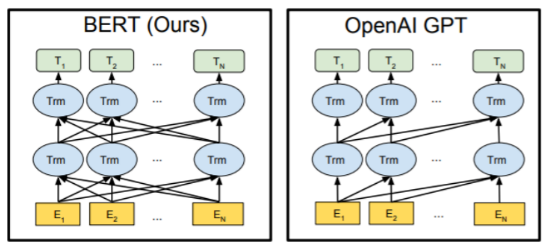
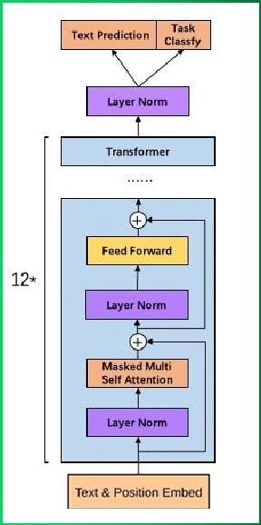
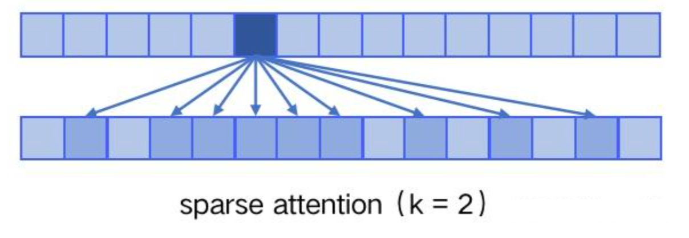

## 1. ChatGPT 的本质

ChatGPT 是 OpenAI 于 2022 年 11 月发布的对话式 AI 系统，基于 GPT-3.5 架构并通过 **RLHF（人类反馈强化学习）** 技术优化，实现更自然、更安全、更对齐人类意图的交互体验。

**⚠️ 关键认知**

- **≠ 单纯参数堆砌**：模型越大≠效果越好，可能产生能力不一致问题（过拟合训练分布）
- **核心突破**：通过人类反馈解决大型语言模型输出不对齐问题
- **能力范围**：撰写文案、代码生成、多语言翻译、逻辑推理等复杂任务

## 2. GPT-1：生成式预训练的开端

2018年发布的 GPT-1 首次提出"生成式预训练 + 判别式微调"范式，奠定后续模型基础。

### 2.1 模型架构

GPT-1 采用 **单向 Transformer Decoder** 架构，与 BERT 的双向 Encoder 形成鲜明对比：

| 组件           | GPT-1 (单向)         | BERT (双向)         |
| :------------- | :------------------- | :------------------ |
| **核心结构**   | Transformer Decoder  | Transformer Encoder |
| **注意力机制** | 仅关注上文（Masked） | 同时关注上下文      |
| **优势任务**   | 自然语言生成（NLG）  | 自然语言理解（NLU） |

**结构细节：**

| 参数                | 取值    |
| :------------------ | :------ |
| transformer 层数    | 12      |
| 特征维度            | 768     |
| transformer head 数 | 12      |
| **总参数量**        | 1.17 亿 |

**关键改动**：移除原始 Decoder 中的 encoder-decoder attention 层，仅保留 Masked Self-Attention 和 Feed Forward 层。

### 2.2 训练策略：两阶段范式

#### 阶段一：无监督预训练

**目标函数**：最大化序列似然概率
$$
L_1(U) = \sum_i \log P(u_i|u_{i-k}, \cdots, u_{i-1}; \Theta)
$$
其中：

- $$U = [u_1, u_2, \cdots, u_n]$$ 为输入序列
- $$k$$ 为上下文窗口大小，$$k$$ 越大模型能力越强
- $$\Theta$$ 为模型参数

**计算流程**：

1. 输入嵌入：`h₀ = UWₑ + Wₚ`
   - `Wₑ`：词嵌入矩阵（`vocab_size × embedding_dim`）
   - `Wₚ`：位置编码矩阵（`max_seq_len × embedding_dim`）
2. 多层 Transformer 编码：`hₜ = transformer_block(hₜ₋₁)`
3. 输出概率分布：`P(u) = softmax(hₜWₑᵀ)`

#### 阶段二：有监督微调

**下游任务适配**：在预训练基础上增加任务特定的分类层，目标函数为：
$$
P(y|x^1, \cdots, x^m) = softmax(h_l^m W_y)
$$
**任务输入改造**：

- **分类任务**：`[Start] + 文本 + [Extract]`
- **文本蕴涵**：`[Start] + 前提 + [Delim] + 假设 + [Extract]`
- **相似度**：正序/倒序拼接后分别编码
- **多选问答**：每个选项独立成二分类任务

### 2.3 数据集与性能

**训练数据**：BooksCorpus（5GB，7000+本书籍）
**选择理由**：长文本依赖 + 零泄漏（未公开发布）

**性能表现**：

- ✅ 在12个下游任务中9个达到 SOTA
- ✅ 验证 Transformer 在语义特征提取上的强大能力
- ❌ 单向结构限制上下文理解
- ❌ 每个任务需独立微调，效率较低

> 微调后，模型只能适应具体微调的任务，需要做其他任务的话，需要拿预训练模型重新微淘。

## 3. GPT-2：Zero-shot 多任务学习

2019 年 GPT-2 的核心突破：**无需微调即可执行多任务**，验证"数据+参数规模"的涌现能力。

### 3.1 架构微调

| 改动项           | GPT-1                   | GPT-2                                 | 目的         |
| :--------------- | :---------------------- | :------------------------------------ | :----------- |
| **层归一化位置** | 在每个子层后            | 在每个子层前                          | 梯度更稳定   |
|                  |                         | 在最后一层Tansfomer Block后增加了LN层 | 梯度更稳定   |
| **序列长度**     | 512                     | 1024                                  | 捕捉更长依赖 |
| **训练方法**     | pre-train + fine-tuning | zero-shot                             | 无需微调     |
| **batch_size**   | 64                      | 512                                   | 训练更稳定   |
| **最大层数**     | 12                      | 48（12、24、36、48）                  | 提升模型容量 |
| **总参数量**     | 1.17亿                  | 15亿                                  | 增强表征能力 |

> 💡提示：随着模型层数不断增加，梯度消失和梯度爆炸的风险越来越大，**层归一化位置**调整能够**减少预训练过程中各层之间的方差变化，使梯度更加稳定**

### 3.2 核心思想：语言模型即通用任务

**核心假设**：任何有监督任务都是语言模型的子集。当模型容量足够大、数据覆盖足够广时，**任务描述本身可作为提示（Prompt）**引导模型完成特定任务。

**Zero-shot 示例**：

- 翻译任务：`translate to french, {english text}, {french text}`
- 阅读理解：`answer the question, {document}, {question}, {answer}`

**有效性来源**：海量语料中天然包含任务描述的模式，模型在预训练中已隐式学习。

### 3.3 数据与性能

**训练数据**：WebText（800万网页，40GB，过滤 Wikipedia 防泄漏）

**能力表现**：

- ✅ 8 个语言模型任务中 7 个 Zero-shot 超越 SOTA
- ✅ 海量数据和大量参数训练出来的词向量模型有迁移到其它类别任务中而不需要额外的训练
- ❌ 无监督学习仍有提升空间
- ❌ 有些任务上的表现不如随机

## 4. GPT-3：Few-shot 情境学习

2020 年的 GPT-3 将参数规模推向千亿级，引入 **情境学习（In-context Learning）** 概念，平衡性能与效率。

### 4.1 模型架构

GPT-3 并非单一模型，而是一个模型系列，各版本具有不同数量的可训练参数：

| 模型名称              | 参数量 | 层数 | 模型维度 | 头数 | 头维度 | 批大小 | 学习率   |
| :-------------------- | :----- | :--- | :------- | :--- | :----- | :----- | :------- |
| GPT-3 Small           | 125M   | 12   | 768      | 12   | 64     | 0.5M   | 6.0×10−4 |
| GPT-3 Medium          | 350M   | 24   | 1024     | 16   | 64     | 0.5M   | 3.0×10−4 |
| GPT-3 Large           | 760M   | 24   | 1536     | 16   | 96     | 0.5M   | 2.5×10−4 |
| GPT-3 XL              | 1.3B   | 24   | 2048     | 24   | 128    | 1M     | 2.0×10−4 |
| GPT-3 2.7B            | 2.7B   | 32   | 2560     | 32   | 80     | 1M     | 1.6×10−4 |
| GPT-3 6.7B            | 6.7B   | 32   | 4096     | 32   | 128    | 2M     | 1.2×10−4 |
| GPT-3 13B             | 13.0B  | 40   | 5140     | 40   | 128    | 2M     | 1.0×10−4 |
| GPT-3 175B 或 "GPT-3" | 175.0B | 96   | 12288    | 96   | 128    | 3.2M   | 0.6×10−4 |

**架构创新**：GPT-3 在结构上延续 GPT 模型，但引入了 **Sparse Transformer** 中的稀疏注意力（sparse attention）模块。

**核心区别**

- **Dense Attention**（传统自注意力）：每个 token 与所有其他 token 两两计算注意力，复杂度为 *O*(*n*2) 
- **Sparse Attention**（稀疏注意力）：每个 token 仅与特定子集计算注意力，复杂度降为 *O*(*n*⋅log*n*) 

**具体实现**

稀疏注意力仅对以下距离计算注意力，其余设为 0：

- 相对距离不超过 k
- 相对距离为 k, 2k, 3k, ... 的倍数

**主要优势**

- **降低计算复杂度**：减少显存占用和计算耗时，支持处理更长序列
- **符合语义特性**：体现"局部紧密相关、远程稀疏相关"的特点，对近距离上下文关注更多，远距离关注更少

### 4.2 核心思想：Few-shot 学习

**三种评估方式对比**： 

| 方式          | 示例数量 | 特点                | 性能     |
| :------------ | :------- | :------------------ | :------- |
| **Zero-shot** | 0        | 仅任务描述          | 基础能力 |
| **One-shot**  | 1        | 任务描述 + 1个示例  | 中等     |
| **Few-shot**  | 2-100    | 任务描述 + 少量示例 | **最佳** |

**💡关键洞察**：In-context learnin核心思想在于通过少量的数据寻找一个合适的初始化范围，使得模型能够在有限的数据集上快速拟合，并获得不错的效果。

### 4.3 训练数据集

| 数据集                  | Token 数量 | 占比 | 说明                   |
| :---------------------- | :--------- | :--- | :--------------------- |
| Common Crawl (filtered) | 4100亿     | 60%  | 大规模网页数据，需清洗 |
| WebText2                | 190亿      | 22%  | Reddit 高赞链接        |
| Books1                  | 120亿      | 8%   | 互联网图书语料         |
| Books2                  | 550亿      | 8%   | 互联网图书语料         |
| Wikipedia               | 30亿       | 2%   | 高质量百科数据         |

**总计**：约 45 TB 原始文本，清洗后 570 GB。

### 4.4 GPT-3模型的特点

#### **表1：与 GPT-2 的核心区别对比**

| **对比维度**   | **GPT-2**        | **GPT-3**                    |
| :------------- | :--------------- | :--------------------------- |
| **生成效果**   | 基础文本生成     | 可生成人类难以区分的新闻文章 |
| **学习模式**   | 主推 Zero-shot   | 主推 Few-shot（更强创新性）  |
| **模型结构**   | 标准 Transformer | 引入 Sparse Attention 模块   |
| **训练语料**   | 40GB             | 45TB（清洗后 570GB）         |
| **最大参数量** | 15 亿            | 1750 亿（116倍）             |

#### **表2：GPT-3 主要优点**

| **序号** | **优点描述**                                                 |
| :------- | :----------------------------------------------------------- |
| 1        | Zero-shot/One-shot 下性能尚可，Few-shot 下可超越微调 SOTA 模型 |
| 2        | 无需针对下游任务进行 Fine-tuning，简化部署流程               |

#### **表3：GPT-3 主要缺点**

| **序号** | **缺点描述**                           |
| :------- | :------------------------------------- |
| 1        | 海量数据导致难以杜绝生成敏感内容       |
| 2        | 在"填空类"等特定任务上效果有限         |
| 3        | 长文本生成易重复、前后矛盾、逻辑衔接差 |
| 4        | 训练与推理成本极其高昂                 |

## 5. ChatGPT：RLHF 对齐革命

ChatGPT 并非简单扩大模型规模，而是通过 **人类反馈强化学习（RLHF）** 解决对齐问题，使输出更安全、更可控。

### 5.1 问题根源：能力不对齐

GPT-3 等大型模型存在 **能力不一致** 现象：

- 训练目标：预测下一个词（语言建模）
- 人类期望：有用、无害、真实

**解决方案**：引入 RLHF，将人类偏好直接注入训练过程。

------

### 5.2 强化学习基础

**核心要素**：

- **Agent**：策略模型（如 ChatGPT）
- **Environment**：对话上下文
- **State**：当前输入 prompt + 历史对话
- **Action**：生成的文本 token
- **Reward**：人类反馈的质量评分
- **Policy (π)**：策略函数 `π(a|s) = P(A=a|S=s)`

**训练循环**：

1. Agent 观测当前状态 `s₁`
2. 根据策略采样动作 `a₁`（生成回复）
3. 环境返回奖励 `r₁`（质量评分）和新状态 `s₂`
4. 重复直至对话结束，优化策略以最大化累计奖励

------

### 5.3 RLHF 训练三阶段

#### 阶段一：监督微调（SFT）

**目标**：创建初始策略模型，学习人类示范行为。

**流程**：

1. **数据收集**：标注人员撰写高质量对话样本（prompt → ideal response）
2. **模型选择**：基于 GPT-3.5（code-davinci-003）
3. **微调训练**：在 13K prompt-response 对上监督学习

**产物**：SFT 模型（Supervised Fine-Tuned Model）

#### 阶段二：奖励模型训练（RM）

**目标**：学习人类偏好函数，为任意输出打分。

**流程**：

1. **采样对比**：对同一 prompt，SFT 模型生成 4-9 个不同回复
2. **人工排序**：标注者按质量排序（如 A > B > C > D）
3. **训练目标**： pairwise 排序损失

**损失函数**：

L(*θ*)=−(*x*,*y**w*,*y**l*)∑log(*σ*(*r**θ*(*x*,*y**w*)−*r**θ*(*x*,*y**l*)))

- `x`：输入 prompt
- `y_w`：得分较高的回复
- `y_l`：得分较低的回复
- `r_θ`：奖励模型（6亿参数的 GPT-3 蒸馏版）

**产物**：RM 模型，可自动评分任意回复质量

#### 阶段三：PPO 强化学习优化

**目标**：使用 RM 作为奖励函数，进一步优化 SFT 模型。

**算法**：近端策略优化（Proximal Policy Optimization）

**流程**：

1. **输入 prompt**：从数据集中采样用户问题
2. **生成回复**：当前策略模型（PPO 模型）生成文本
3. **质量评分**：RM 模型对回复打分
4. **策略更新**：根据奖励分数，使用 PPO 算法更新策略参数（最大化奖励 + 保持与 SFT 模型差异不过大）
5. **迭代循环**：重复 2-4 步，持续改进

**关键机制**：PPO 的 clip 机制防止策略更新过大，保证训练稳定性。

------

### 5.4 ChatGPT 能力评估

**优势**：

- ✅ **对齐性**：输出更安全、更符合人类价值观
- ✅ **连贯性**：多轮对话上下文理解能力强
- ✅ **通用性**：降低使用门槛，无需精心设计 prompt

**局限**：

- ⚠️ **"幻觉"问题**：可能一本正经地生成错误信息
- ⚠️ **时效性**：知识截止于训练数据时间
- ⚠️ **计算成本**：推理成本高昂，服务稳定性挑战

------

## 6. 技术演进总结

表格

复制

| 维度         | GPT-1                     | GPT-2            | GPT-3          | ChatGPT             |
| :----------- | :------------------------ | :--------------- | :------------- | :------------------ |
| **核心范式** | 预训练+微调               | Zero-shot        | Few-shot       | RLHF 对齐           |
| **参数规模** | 1.17亿                    | 15亿             | 1750亿         | 基于 175B 优化      |
| **数据策略** | 单一书籍语料              | 网页数据混合     | 45TB 多源语料  | 在 GPT-3 数据基础上 |
| **任务适配** | 需独立微调                | 无需微调         | 少量示例提示   | 自然语言指令        |
| **关键突破** | 验证 Transformer 迁移能力 | 验证规模涌现能力 | 情境学习有效性 | 解决人类对齐难题    |

## 📊 GPT 系列模型演进总览

| 模型        | 发布时间   | 参数量       | 核心创新                | 训练策略      | 适用场景 |
| :---------- | :--------- | :----------- | :---------------------- | :------------ | :------- |
| **GPT-1**   | 2018年6月  | 1.17亿       | 单向 Transformer 预训练 | 预训练 + 微调 | NLU 任务 |
| **GPT-2**   | 2019年2月  | 15亿         | Zero-shot 多任务学习    | 纯预训练      | 文本生成 |
| **GPT-3**   | 2020年5月  | 1750亿       | Few-shot 情境学习       | 纯预训练      | 通用任务 |
| **ChatGPT** | 2022年11月 | 基于 GPT-3.5 | RLHF 人类反馈强化学习   | 预训练 + RLHF | 对话交互 |