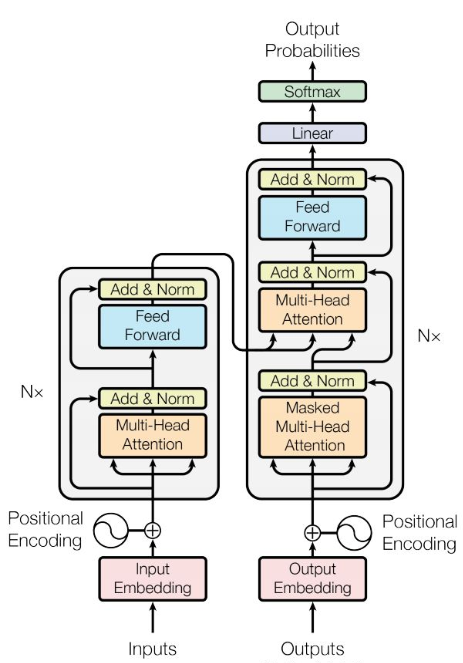
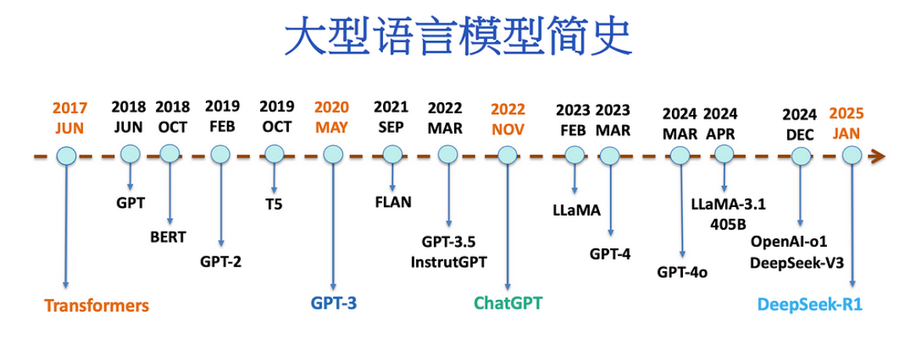
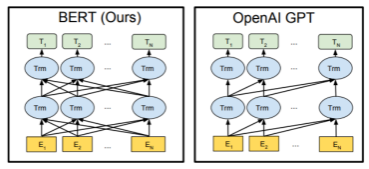
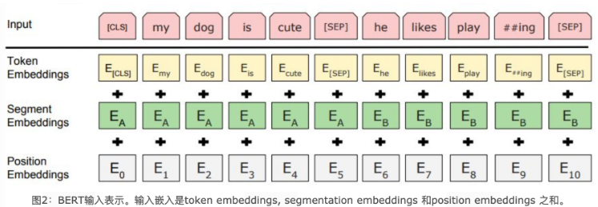
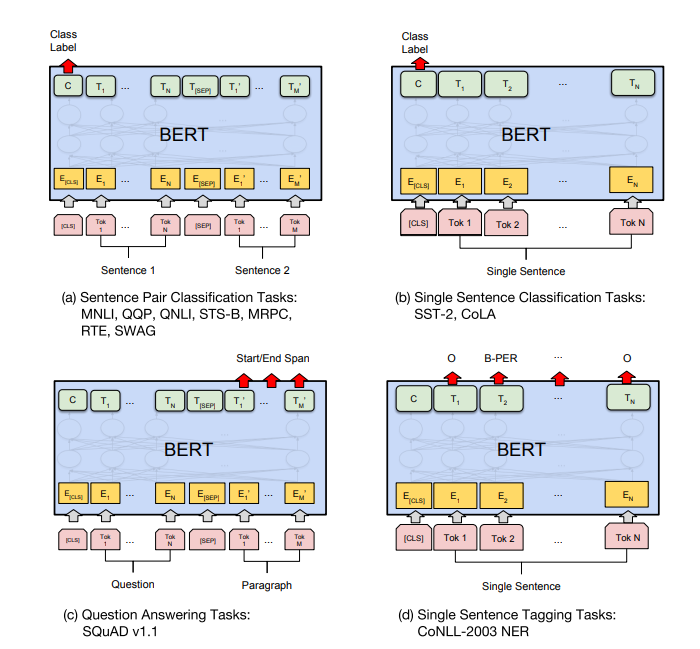
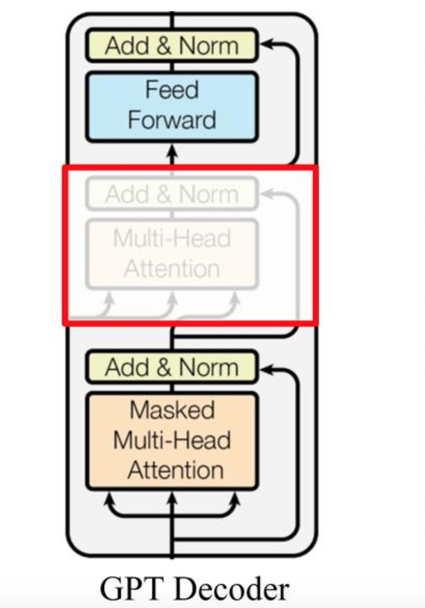
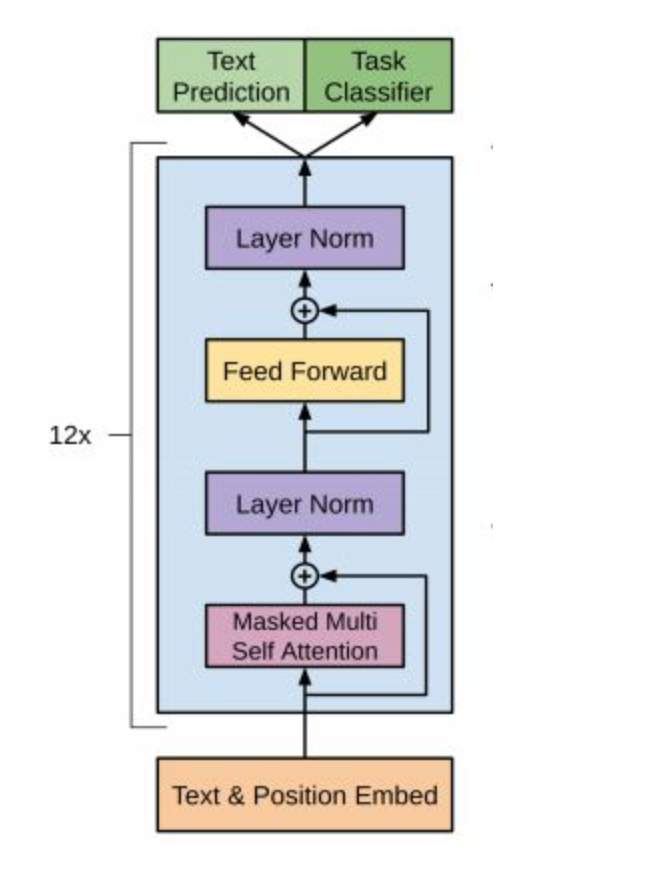
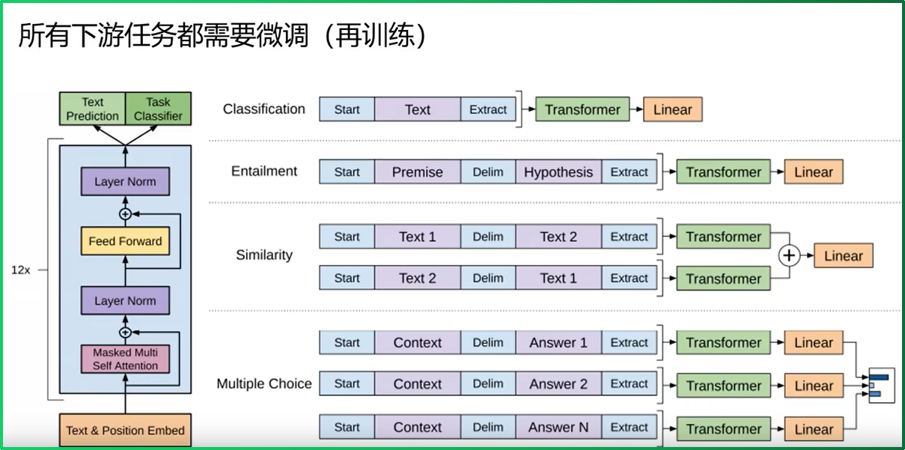

## 1. 架构分类总览

大语言模型均衍生于2017年提出的Transformer架构，根据对编码器-解码器结构的不同取舍，主要分为三大类别：



| 架构类型            | 代表模型       | 核心特点                       | 适用任务                              | 注意力机制            |
| :------------------ | :------------- | :----------------------------- | :------------------------------------ | :-------------------- |
| **自编码模型 (AE)** | BERT           | Encoder-Only，双向上下文理解   | 自然语言理解(NLU)、文本分类、抽取式QA | 双向注意力            |
| **自回归模型 (AR)** | GPT系列、LLaMA | Decoder-Only，单向生成         | 自然语言生成(NLG)、文本生成、摘要翻译 | 因果掩码注意力        |
| **序列到序列模型**  | T5             | Encoder-Decoder，编码-解码分离 | 机器翻译、文本转换                    | 编码器双向+解码器单向 |

💡 **选型建议**：当前千亿参数级大模型普遍采用**Decoder-only**架构，因其在训练效率、工程实现和生成能力上具有综合优势。



## 2. 自编码模型：BERT

### 2.1 模型概述

BERT（Bidirectional Encoder Representations from Transformers）是Google于2018年10月提出的里程碑式模型，在SQuAD、GLUE等11项NLP基准测试中全面超越人类水平。

**核心创新**：采用**双向Transformer编码器**，通过掩码语言建模（MLM）实现深度上下文理解。

### 2.2 架构组成



BERT架构由三大模块堆叠而成：

| 模块层级   | 组件名称        | 功能说明                       |
| :--------- | :-------------- | :----------------------------- |
| **输入层** | Embedding模块   | 词嵌入、位置嵌入、句子分段嵌入 |
| **编码层** | 双向Transformer | 12层Transformer编码器块        |
| **输出层** | 预微调模块      | 根据不同下游任务定制输出头     |

#### 2.2.1 Embedding模块详解

BERT的Embedding是三种嵌入向量的**逐元素加和**，非拼接：



| 嵌入类型                | 作用           | 特殊设计                                                     |
| :---------------------- | :------------- | :----------------------------------------------------------- |
| **Token Embeddings**    | 词元语义表示   | 首词元固定为[CLS]，用于分类任务                              |
| **Position Embeddings** | 位置信息编码   | **可学习参数**，非三角函数固定编码                           |
| **Segment Embeddings**  | 句子对关系标记 | 句子分段嵌入张量, 是为了服务后续的两个句子为输入的预训练任务 |


### 2.3 预训练任务

BERT采用**多任务联合预训练**策略，两个任务同步进行：

| 任务名称                     | 训练目标           | 数据构造策略                                                 | 训练比例 |
| :--------------------------- | :----------------- | :----------------------------------------------------------- | :------- |
| **Masked LM**                | 预测被掩码的词     | 15%词元被选中： • 80%替换为[MASK] • 10%随机替换 • 10%保持不变 | 100%     |
| **Next Sentence Prediction** | 判断B是否为A的下句 | • 50%真实连续句子对（IsNext） • 50%随机拼接句子对（NotNext） | 100%     |

⚠️ **关键细节**：Masked LM任务中保留10%未改变的词元，是为了缓解**预训练-微调差异**——[MASK]符号在微调阶段永远不会出现。


### 2.4 微调适配策略

BERT模型在经过中间层Transformer编码后，其最后一层可根据下游任务需求进行灵活调整。通过仅对**预微调模块**进行针对性训练，即可充分利用Transformer强大的注意力机制，在多种NLP任务上达到业界领先水平（SOTA）。

> **核心洞察**：预训练后的BERT模型仅需微调顶层结构，即可快速适配不同的下游任务，无需修改底层Transformer架构。




**各任务类型实现细节**

| 任务类型     | 说明                                                         |
| :----------- | :----------------------------------------------------------- |
| 句对分类任务 | 模型同时处理两个句子，通过[CLS]的表示捕捉句子间交互关系，适用于自然语言推断、语义相似度等场景。 |
| 单句分类任务 | 专注于单个文本的分析，包括情感分析、语法正确性判断等。       |
| 问答任务     | 给定问题和段落，模型需预测答案的起始和结束位置。通过预测段落中每个token作为答案起止点的概率实现。 |
| 单句标注任务 | 对序列中每个token进行分类，如命名实体识别（NER）、词性标注等。 |


**超参数配置建议**

| 超参数       | 推荐值           | 说明                                   |
| :----------- | :--------------- | :------------------------------------- |
| **批量大小** | 16, 32           | 根据GPU内存选择，较大批次通常更稳定    |
| **学习率**   | 5e-5, 3e-5, 2e-5 | 使用Adam优化器，建议从3e-5开始尝试     |
| **训练轮次** | 3, 4             | BERT微调通常不需要过多轮次，避免过拟合 |


### 2.5 模型规格

| 参数项              | BERT-Base                                   | BERT-Large |
| :------------------ | :------------------------------------------ | :--------- |
| **Transformer层数** | 12                                          | 24         |
| **特征维度**        | 768                                         | 1024       |
| **注意力头数**      | 12                                          | 16         |
| **总参数量**        | 1.15亿                                      | 3.4亿      |
| **训练数据**        | BooksCorpus (800M词) + Wikipedia (2,500M词) | 同左       |


### 2.6 优缺点总结

| 维度           | 说明                                                         |
| :------------- | :----------------------------------------------------------- |
| ✅ **核心优势** | 双向上下文建模，语言理解能力卓越；微调范式成熟，下游任务适配简单 |
| ❌ **主要局限** | 预训练-微调存在分布差异；不适合生成任务；                    |

> BERT在预训练过程中使用【mask】符号对输入进行处理，这些符号在下游的finetune任务中永远不会出现，这会导致**预训练-微调差异**。


## 3. 自回归模型：GPT

### 3.1 模型概述

GPT（Generative Pre-training）于2018年6月由OpenAI提出，采用**单向Transformer解码器**，通过自回归方式预测下一个词元，奠定了生成式大模型的基础范式。

**核心区别**：与BERT不同，GPT仅用**上文信息**预测当前词，天然适配文本生成任务。


### 3.2 架构设计


#### 3.2.1 解码器变体



GPT采用Transformer解码器，但移除了编码器-解码器交叉注意力层，保留：

- **掩码多头自注意力**（Masked Multi-Head Attention）
- **前馈神经网络**（Feed Forward）

相比经典Transformer解码器（6层），GPT使用**12层解码器块**，增强建模能力。




### 3.3 两阶段训练流程

GPT的训练包括两阶段过程: **无监督预训练 + 有监督微调**

| 阶段     | 训练方式     | 目标函数                                                     | 数据特点         |
| -------- | ------------ | ------------------------------------------------------------ | ---------------- |
| 第一阶段 | 无监督预训练 | $L_1(U) = \sum_i \log P(u_i|u_{i-k}, \cdots, u_{i-1}; \Theta)$ | 大规模未标注文本 |
| 第二阶段 | 有监督微调   | $$L_2 = \sum_{(x,y)} \log P(y|x^1, \cdots, x^m)$$            | 下游任务标注数据 |


#### 3.3.1 无监督的预测练语言模型

给定句子 $$U = [u_1, u_2, ..., u_n]$$，GPT训练语言模型时的目标是最大化下面的似然函数：
$$
L_1(U) = \sum_i \log P(u_i|u_{i-k}, \cdots, u_{i-1}; \Theta)
$$
其中：

- $$U = [u_1, u_2, \cdots, u_n]$$ 为输入序列
- $$k$$ 为上下文窗口大小，$$k$$ 越大模型能力越强
- $$\Theta$$ 为模型参数


GPT是一个单向语言模型，模型对输入U进行特征嵌入得到 transformer 第一层的输入$h_0$，再经过多层 transformer 特征编码，使用最后一层的输出即可得到当前预测的概率分布，计算过程如下：
$$
h_0 = UW_e + W_p
$$
其中：

- $W_p$ 为单词的位置编码，形状是`[max_seq_len, embedding_dim]`
- $W_e$ 为单词本身的word embedding，形状是`[vocab_size, embedding_dim]`


得到输入张量h0后，要将$h_0$传入GPT的Decoder Block中，依次得到$h_t$：
$$
h_t = transformer\_block(h_{l-1}) \quad l \in [1,t]
$$
最后通过得到的ht来预测下一个单词：
$$
P(u) = softmax(h_tW_e^T)
$$


#### 3.3.2 有监督的下游任务fine-tunning

GPT经过预测练后，会针对具体的下游任务对模型进行微调。微调采用的是有监督学习，训练样本包括单词序列  $[x1, x2, ..., xn]$  和 label y。GPT微调的目标任务是根据单词序列  $[x1, x2, ..., xn]$  预测标签y。
$$
P(y|x^1, \cdots, x^m) = softmax(h_l^m W_y)
$$
其中：

-  $$W_y$$ 表示预测输出的矩阵参数


微调任务的目标是最大化下面的函数：
$$
L_2 = \sum_{(x,y)} \log P(y|x^1, \cdots, x^m)
$$
联合优化：最终损失函数为两者加权
$$
L_3 = L_2 + \lambda L_1
$$


### 3.4 下游任务适配

根据下游任务适配的过程分两步: 1. 根据任务定义不同输入 ，2. 对不同任务增加不同的分类层




| 任务类型       | 输入格式                              | 处理流程                   |
| :------------- | :------------------------------------ | :------------------------- |
| **文本分类**   | `[START] 文本 [EXTRACT]`              | 取最后token特征接全连接    |
| **文本蕴涵**   | `[START] 前提 [DELIM] 假设 [EXTRACT]` | 双向拼接后预测             |
| **文本相似度** | 两个句子正反向各拼接一次              | 特征拼接后接全连接         |
| **多选题问答** | `问题 [DELIM] 选项_i [EXTRACT]`       | 每个选项独立打分，选最高分 |

💡 **统一性**：GPT通过**输入构造+参数复用**统一处理不同任务，所有任务共享相同的Transformer主干，仅输入层（取最后token）和输出层做轻量改造。


### 3.5 模型规格与数据

| 参数项              | GPT-1                           |
| :------------------ | :------------------------------ |
| **Transformer层数** | 12                              |
| **特征维度**        | 768                             |
| **注意力头数**      | 12                              |
| **总参数量**        | 1.17亿                          |
| **预训练数据**      | BooksCorpus（5GB，7400万+句子） |

**数据优势**：书籍文本包含高质量长句，利于学习长距离依赖；且未公开发布，验证泛化能力更严格。


### 3.6 优缺点总结

| 维度           | 说明                                                         |
| :------------- | :----------------------------------------------------------- |
| ✅ **核心优势** | 生成能力强，适合NLG任务；训练目标简洁，数据构造简单；任务适配灵活 |
| ❌ **主要局限** | 单向建模，无法利用下文信息；不同任务需独立微调，迁移成本较高 |


## 4. 序列到序列模型：T5

### 4.1 模型概述

T5（Text-to-Text Transfer Transformer）由Google于2020年提出，核心思想是 **"所有NLP任务都可视为文本到文本的转换"** 。

**统一范式**：通过前缀提示（Prefix）将分类、问答、翻译等任务都转换为seq2seq格式，实现**单一模型、单一损失函数、统一训练流程**。

```properties
# 任务转换示例
"translate English to German: That is good." → "Das ist gut."
"stsb sentence1: ... sentence2: ..." → "3.5"
```


### 4.2 架构特点

T5在原始Transformer基础上做了以下改进：

| 改进项       | 具体设计                                        | 优势                    |
| :----------- | :---------------------------------------------- | :---------------------- |
| **层归一化** | 移除bias，将Layer Norm放在残差连接外            | 训练更稳定              |
| **位置编码** | 简化版相对位置编码 每层共享，同层不同头独立学习 | 支持更长序列 节省参数量 |

**位置编码细节**：学习32个位置Embedding，覆盖长度差至128，超过则共享同一编码。


### 4.3 训练策略

| 训练策略     | 具体方法                                                  |
| :----------- | :-------------------------------------------------------- |
| 自监督预训练 | 采用Span Corruption（类似BERT的MLM，但掩码连续片段）      |
| 多任务预训练 | 可同时混入SQuAD、WMT等监督数据进行联合训练                |
| 数据规模     | 基于清洗后的CommonCrawl构建C4数据集，仅保留高质量英文文本 |


### 4.4 模型规格

| 参数项              | T5-Base                             |
| :------------------ | :---------------------------------- |
| **Transformer层数** | 24                                  |
| **特征维度**        | 768                                 |
| **注意力头数**      | 12                                  |
| **总参数量**        | 2.2亿                               |
| **预训练数据**      | C4（Colossal Clean Crawled Corpus） |


### 4.5 优缺点总结

| 维度           | 说明                                                         |
| :------------- | :----------------------------------------------------------- |
| ✅ **核心优势** | 任务统一性强，扩展性好；参数量相对较小，训练效率高           |
| ❌ **主要局限** | 计算资源需求大；模型可解释性不足；Encoder-Decoder结构复杂度高 |


## 5. 架构演进趋势：Decoder-only统治地位

**当前格局**：千亿参数级大模型（GPT-3/4、PaLM、LLaMA等）**普遍采用Decoder-only架构**，根本原因在于：

| 因素         | Decoder优势                   | Encoder-Decoder劣势        |
| :----------- | :---------------------------- | :------------------------- |
| **训练效率** | 无编码器-解码器交互，并行度高 | 交叉注意力增加复杂度       |
| **工程实现** | 单一结构，部署维护简单        | 双组件协调，系统复杂       |
| **理论表达** | 因果掩码避免低秩问题          | 双向注意力可能削弱表达能力 |
| **参数效率** | 同等效果下参数量更少          | 编码器部分冗余，参数翻倍   |

⚠️ **关键洞察**：Encoder-Decoder在某些场景表现更好，往往只是因为**参数量翻倍**，而非架构本质优势。在同等算力预算下，Decoder-only是更优解。