## 1. 核心模型概览

当前主流开源大语言模型主要分为五大系列，各系列在参数规模、架构设计和应用场景上各有侧重。

| 模型系列     | 研发机构 | 核心特点                     | 参数规模  | 中文支持         | 开源协议       |
| :----------- | :------- | :--------------------------- | :-------- | :--------------- | :------------- |
| **LLaMA**    | Meta     | 生态最完善，社区衍生模型最多 | 7B-405B   | 基础版弱，需扩展 | 自定义商用授权 |
| **ChatGLM**  | 清华大学 | 中文优化最佳，双语平衡       | 6B-130B   | 原生支持         | Apache 2.0     |
| **Baichuan** | 百川智能 | 中文语料占比高，商用友好     | 7B-13B    | 原生支持         | Apache 2.0     |
| **Qwen**     | 阿里云   | 多模态能力领先，企业级支持   | 0.5B-72B  | 原生支持         | Apache 2.0     |
| **Yi**       | 零一万物 | 性能与效率平衡，代码能力强   | 6B-34B    | 原生支持         | Apache 2.0     |
| **DeepSeek** | 深度求索 | 推理能力突出，MoE架构创新    | 1.5B-671B | 原生支持         | MIT（最宽松）  |

## 2. LLaMA 系列模型

**LLaMA**（Large Language Model Meta AI）是 Meta AI 于2023年2月发布的开放且高效的大型基础语言模型系列，昵称"羊驼系模型"。该系列包含 **7B、13B、33B、65B** 四种参数规模，训练数据主要以英语为主（拉丁语系），并包含GitHub代码数据。

**核心特点**：

- 所有训练数据均为开源数据
- LLaMA-65B/33B：在 **1.4 万亿 tokens** 上训练
- LLaMA-7B/13B：在 **1 万亿 tokens** 上训练
- 中文token仅几百个，对中文分词编码效率较低

### 2.1 训练目标

**核心任务**：语言模型，即根据已有上文预测下一个词

**分词器（Tokenizer）**：

- 采用 **BPE（Byte-Pair Encoding）分词算法**
- 词表大小：**32,000**
- 中文token数量极少（仅几百个），导致中文编码效率偏低

### 2.2 模型结构

与GPT系列相同的 **Decoder-only 架构**，但融合多项前沿改进：

### （1）Pre-normalization

- **改进点**：使用 **Pre-Layer Norm** 替代传统 Post-Layer Norm
- **归一化函数**：**RMSNorm**
  - 去除了Layer Norm中减去均值的部分
  - 计算时间减少约 **7%～64%**
  - 显著提升训练稳定性

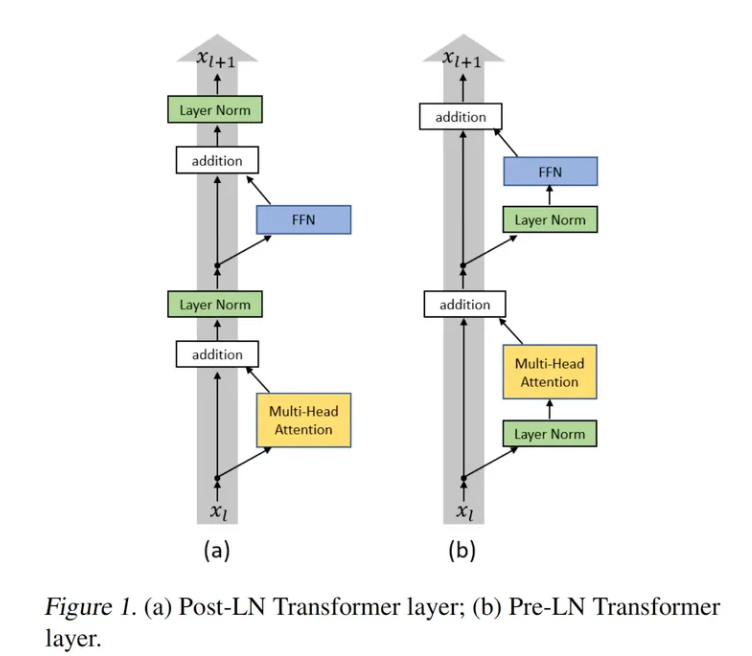

### （2）激活函数

- **改进**：将ReLU替换为  **SwiGLU**  激活函数
- **效果**：提升模型非线性表达能力

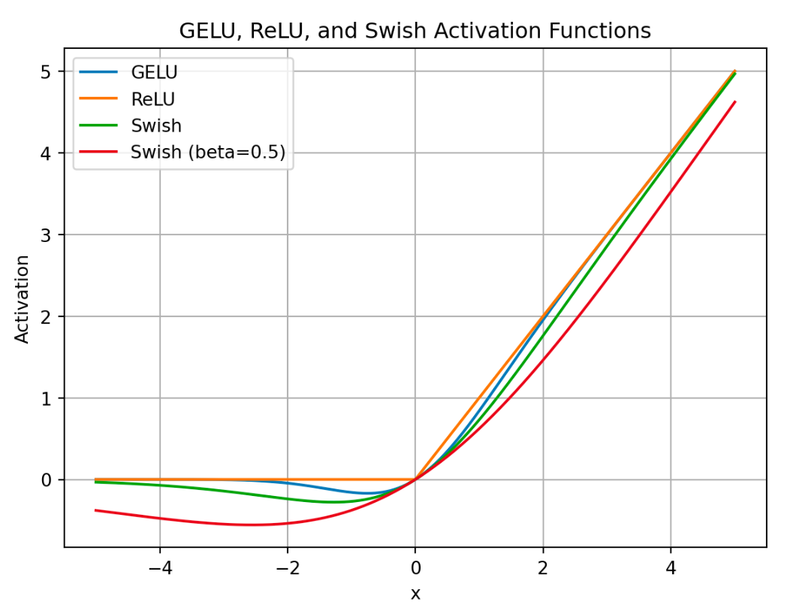

### （3）位置编码

- **改进**：去除绝对位置编码，采用 **旋转位置编码（RoPE）**
- **优势**：更好地捕捉长文本中的位置信息

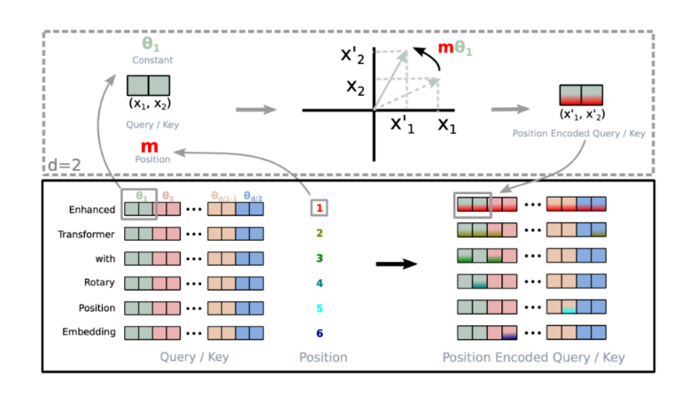

**RoPE实现机制**：

对 token 序列中的每个词嵌入向量计算 query 和 key 向量，为每个位置计算旋转位置编码，将 query 和 key 向量的元素按两两一组应用旋转变换，最后计算内积得到 self-attention 结果。

> 旋转位置编码（RoPE）是一种**让 Transformer 模型“认出”单词顺序**的技巧，但不用传统的“位置 1、2、3……”这种数字标签。它的核心思想是：**把位置信息偷偷塞进单词的“方向”里**，就像给每个词偷偷贴了个“隐形指南针”。
>
> **举个生活例子🌰**
>
> 想象你和朋友玩一个游戏：
>
> 1. **传统位置编码**：你按顺序给每个人发编号牌（1号、2号、3号……），大家按号排队。
>    *问题*：如果队伍很长（比如1000人），编号牌会越来越大，模型可能“记不住”。
> 2. **旋转位置编码**：不给编号牌，而是让每个人**原地转个特定角度**（比如第1人转30°，第2人转60°……）。
>    - 你不需要知道编号，只要看**他面朝的方向**，就能猜到他是第几个。
>    - 即使队伍很长，转圈的角度也会循环（比如360°后回到原方向），不会“数值爆炸”。
>
> **技术原理（大白话版）**
>
> 1. **把单词变成“箭头”**：
>    每个词被拆成两半（比如“猫”的向量分成前一半和后一半），看作二维平面上的**箭头坐标**（x, y）。
> 2. **按位置转箭头**：
>    第1个词的箭头转θ，第2个词转2θ……（θ是固定的小角度）。*这样，位置信息就藏在箭头的“朝向”里*。
> 3. **Attention时“对齐方向”**：
>    当模型计算两个词的关联（Attention）时，**反向旋转其中一个箭头**，让它们的朝向“对齐”。
>    - 如果两个词离得近（比如第3和第5），旋转后方向差不多，算出的关联分数高。
>    - 如果离得远（比如第3和第1000），方向差很多，关联分数低。
>
> **为什么这样设计？**
>
> - **不怕序列长**：旋转角度是循环的（360°一圈），哪怕第1万个词，角度也不会“爆表”。
> - **相对位置**：模型直接通过“方向差”知道两个词隔多远，**不需要绝对位置**（比如能直接看出“猫”在“狗”前面3个位置）。
> - **乘法实现**：所有旋转用简单的乘法（三角函数）完成，计算超快。
>
> 💡一句话总结：RoPE就是：**把“第几个词”这个信息，偷偷转成“箭头转了多少度”**，让模型通过“方向差”自己悟出位置关系，既省内存又不怕长文本。

------

### 2.3 衍生应用生态

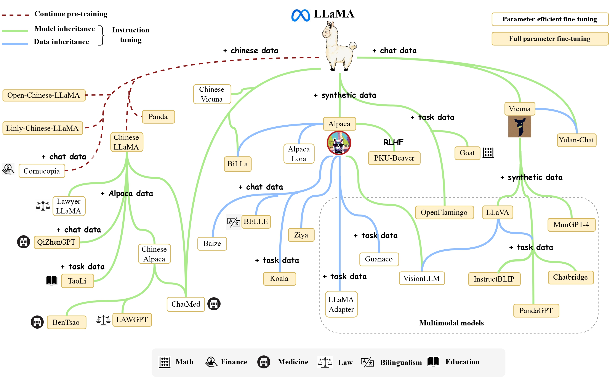

**主流衍生模型**：

| 模型名称          | 机构       | 微调数据         | 特点                 |
| :---------------- | :--------- | :--------------- | :------------------- |
| **Alpaca**        | 斯坦福大学 | 52K英文指令数据  | 轻量级指令遵循       |
| **Vicuna**        | 伯克利     | ShareGPT对话数据 | 对话能力优化         |
| **BELLE**         | 链家       | ChatGPT生成数据  | 中文场景优化         |
| **Chinese LLaMA** | 社区项目   | 中文语料         | 扩充中文词表至49,953 |

**Chinese LLaMA关键技术**：

- 在中文语料上使用SentencePiece训练20,000个中文词汇
- 与原始LLaMA tokenizer合并
- 最终词表大小：**49,953**

### 2.4 迭代版本对比

| 版本        | 发布时间  | 参数量         | 上下文长度       | 训练数据        | 核心改进                                                    | 商业许可               |
| :---------- | :-------- | :------------- | :--------------- | :-------------- | :---------------------------------------------------------- | :--------------------- |
| **Llama 1** | 2023年2月 | 7B/13B/30B/65B | 2,048 tokens     | 1.4T tokens     | - SwiGLU激活函数  - RMSNorm归一化  - RoPE位置编码 | ❌ 仅限研究             |
| **Llama 2** | 2023年7月 | 7B/13B/34B/70B | **4,096 tokens** | **2T tokens**   | - RLHF对齐优化  - Chat版本发布                         | ✅ 免费商用（月活<7亿） |
| **Llama 3** | 2024年4月 | 8B/70B/405B    | **8,192 tokens** | **15T+ tokens** | - TikToken分词器（128K词表）  - 推理性能大幅提升       | ✅ 完全开源商用         |

## 3. ChatGLM 系列模型

ChatGLM 是清华大学开源的支持中英双语的对话语言模型，基于约 **1万亿 token** 的中英双语数据训练（中英文比例 1:1），融合监督微调（SFT）、反馈自助、人类反馈强化学习（RLHF）等技术，62亿参数的 **ChatGLM-6B** 已能生成高度符合人类偏好的回答。

### 3.1 训练目标

GLM 采用创新的 **自回归空白填充（Autoregressive Blank Infilling）** 预训练框架，核心思想是将 NLU 任务转化为包含任务描述的完形填空问题，通过自回归方式生成答案。

**核心机制说明：**

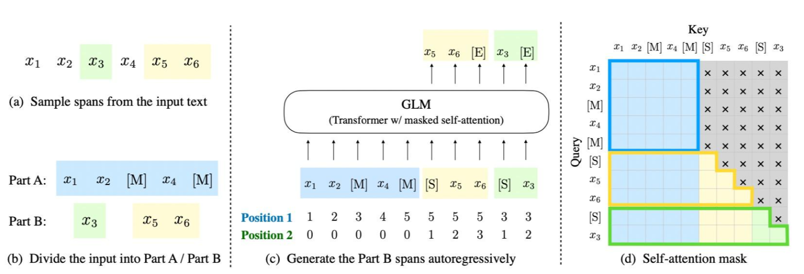

**训练流程分步解析：**

1. **文本掩码**：对原始文本序列随机挖去连续片段。例如文本 `[x₁, x₂, x₃, x₄, x₅, x₆]` 中，挖去 `[x₃]` 和 `[x₅, x₆]` 两个片段（GLM-130B 支持短语、长段落及文章级掩码）
2. **重构输入**：将挖去部分替换为 `[M]` 标记，保留的 **Part A** 作为上下文，被掩码的 **Part B** 需要模型预测重构
3. **顺序变换**：随机打乱 Part B 中各片段的顺序，增强模型对片段间关系的捕捉能力
4. **自回归生成**：每个片段在输入时前面加上` [S]`，在输出时后面加上 `[E]`，模型基于 Part A 和已生成的 Part B 内容逐步预测
5. **注意力机制**：采用二维位置编码，Part A 的词语可互相看见（双向），Part B 只能看到 Part A 和自身已生成的部分（单向）

> **技术细节补充**
>
> - **二维位置编码**：每个 token 拥有两个位置维度
>   - **第一维**：片段在原始文本中的位置（如 `[x₃]`→3，`[x₅,x₆]`→5）
>   - **第二维**：片段内部的位置索引（如 `x₅`→2，`x₆`→3）
> - **注意力掩码**：灰色区域被掩盖，确保自回归生成的因果性

### 3.2 模型结构

采用类 Transformer Decoder 架构（也称 Prefix-Decoder），主要改进包括：

| 改进项                   | 具体实现                          | 优势                           |
| :----------------------- | :-------------------------------- | :----------------------------- |
| **Embedding 层梯度缩减** | 梯度范数缩小 10 倍                | 提升训练稳定性                 |
| **Layer Normalization**  | 采用 Deep Norm 的 post-layer norm | 缓解深层网络退化               |
| **激活函数**             | GeGLU 替代 ReLU                   | 增强非线性表达能力             |
| **位置编码**             | 旋转位置编码 RoPE                 | 支持更长上下文，位置信息更稳健 |

### 3.3 迭代版本演进

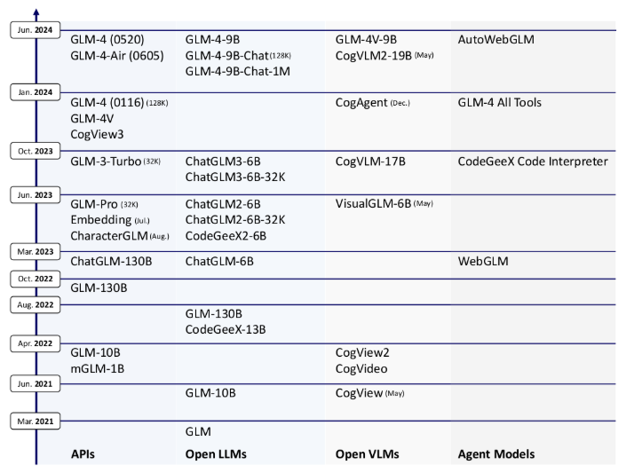

#### 1️⃣ GLM-130B（2022年8月）

- **架构创新**：自回归填空目标，区别于纯自回归（GPT）或自编码（BERT）
- **评测表现**：HELM 评测中与 GPT-3（davinci）相当
- **里程碑**：亚洲首个入选斯坦福大学大模型评测的千亿级开源模型

#### 2️⃣ ChatGLM-6B（2023年3月）

- **中文优化**：专为中英双语对话设计，支持消费级显卡部署
- **对齐技术**：SFT + RLHF 双阶段训练
- **社区影响力**：Hugging Face 下载量超 **1000万次**

#### 3️⃣ ChatGLM2-6B（2023年6月）

- **性能跃升**：MMLU 提升 **23%**，GSM8K、BBH 等基准测试显著优化
- **代码能力**：同步推出 CodeGeeX2-6B，代码生成能力大幅增强

#### 4️⃣ ChatGLM3-6B（2023年9月）

- **功能扩展**：支持 **函数调用** 与 **代码解释器**，增强复杂任务处理能力
- **评测覆盖**：在 42 个基准测试（语义、数学、推理等）中表现优异
- **对话优化**：长文本理解与多轮对话能力显著提升

#### 5️⃣ GLM-4 系列（2024年1月）

| 版本                 | 核心特性                                     | 对标水平        |
| :------------------- | :------------------------------------------- | :-------------- |
| **GLM-4（基座）**    | 支持 **128K 上下文**，多任务性能接近 GPT-4   | GPT-4 同级      |
| **GLM-4-9B（开源）** | **1M（100万）超长上下文**，推理速度提升 3 倍 | 超越 Llama-3-8B |

## 4. Baichuan 系列模型

Baichuan-7B 由百川智能于2023年6月发布，是一款**开放且可商用**的大型预训练语言模型。模型支持中英双语，基于约 **1.2万亿（1.2T）token** 训练，拥有 **70亿参数**。

### 4.1 训练目标

Baichuan-7B 采用标准的 **语言模型目标**：根据已有上文预测下一个词。

**技术配置**：

- **Tokenizer**：BPE分词算法，词表大小 **64,000**
- **训练数据**：开源中英数据 + 自抓中文互联网数据 + 高质量知识性数据

### 4.2 模型结构

Baichuan 采用 **Decoder-only** 架构，与 LLaMA 设计相似，关键改进如下：

| 改进点       | 技术实现                 | 效果                           |
| :----------- | :----------------------- | :----------------------------- |
| **归一化**   | Pre-layer Norm + RMSNorm | 提升训练稳定性                 |
| **激活函数** | SwiGLU                   | 增强非线性表达能力             |
| **位置编码** | RoPE（旋转位置编码）     | 支持更长上下文，位置信息更稳健 |

### 4.3 迭代版本演进

📊 版本对比表

| 版本             | 发布时间  | 参数规模 | 训练数据     | 上下文长度 | 核心创新                | 性能表现                            |
| :--------------- | :-------- | :------- | :----------- | :--------- | :---------------------- | :---------------------------------- |
| **Baichuan-7B**  | 2023年6月 | 7B       | 1.4T tokens  | 2,048      | 首创中英双语开源模型    | C-EVAL、MMLU超越同规模开源模型      |
| **Baichuan-13B** | 2023年7月 | 13B      | 1.4T+ tokens | 4,096      | 采用 **ALiBi** 位置编码 | 中文C-EVAL评测中部分领域超越ChatGPT |

## 5. Qwen 系列模型

通义千问（Qwen）是由阿里云自主研发的大模型系列，用于理解和分析用户输入的自然语言，以及图片、音频、视频等多模态数据。

### 5.1训练目标

Qwen不仅仅是一个语言模型，而是一个致力于实现通用人工智能（AGI）的项目，目前包含了大型语言模型（LLM）和大型多模态模型（LMM）。下图展示了Qwen的主要组成部分：

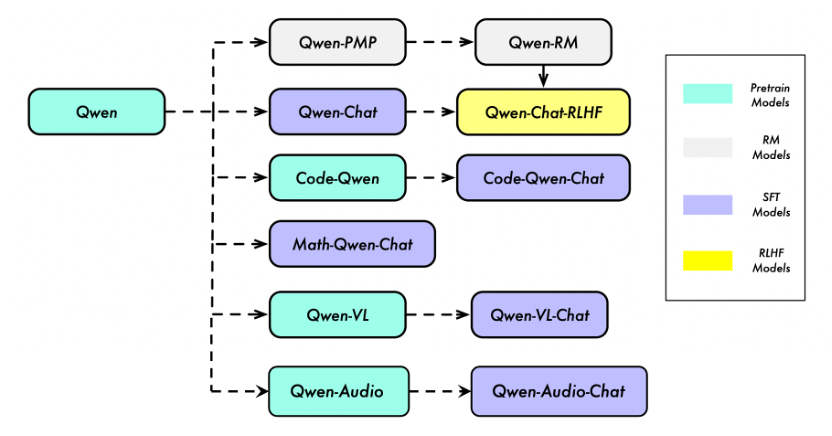

### 5.2 模型结构

Qwen采用Decoder-only架构，并做了以下关键改进：

| 技术组件     | 实现方式                               | 优势                             |
| :----------- | :------------------------------------- | :------------------------------- |
| **位置编码** | RoPE（Rotary Positional Embedding）    | 增强长文本建模能力，支持位置外推 |
| **归一化层** | RMSNorm（Root Mean Square Layer Norm） | 训练更稳定，计算效率更高         |
| **激活函数** | SwiGLU（Swish-Gated Linear Unit）      | 特征提取能力更强，收敛更快       |

**架构创新点：**

- **分组查询注意力（GQA）**：在7B以上模型中应用，显著降低推理显存占用
- **动态NTK-RoPE**：支持上下文长度动态扩展，无需重新训练

### 5.3 迭代版本

| 版本    | 发布年份  | 主要特性                                                     |
| :------ | :-------- | :----------------------------------------------------------- |
| Qwen1.5 | 2023年8月 | - 基于Transformer架构，采用RoPE位置编码和SwiGLU激活函数  - 支持32K长上下文，优化多语言能力（12种语言）  - 引入分组查询注意力（GQA）（仅大模型），降低推理显存占用 |
| Qwen2   | 2024年1月 | - 全系支持GQA，推理效率提升  - 上下文扩展至128K，增强长文本处理能力  - 训练数据增至7万亿token，优化数学、代码能力 |
| Qwen2.5 | 2025年1月 | - Qwen2.5-1M：首个支持百万Tokens（1M）上下文的大模型，处理速度超越GPT-4o-mini 7倍  - 稀疏注意力+长度外推：使32K训练模型适应1M任务  - 多模态版本Qwen2.5-VL：支持图像、视频、文本联合理解，72B版本在视觉问答、文档解析任务中表现领先 |

## 6. Yi 系列模型

**零一万物**（01.AI）是由李开复博士于2023年创立的人工智能公司，专注于大语言模型（LLM）的研发与应用，致力于打造世界级开源与闭源大模型，并推动AI 2.0的商业化落地。

### 6.1 训练目标

零一万物模型专注于中文场景深度优化，采用中英双语图文对训练策略，重点提升多语言理解与多模态融合能力。训练数据包含大规模中文互联网文本、专业领域语料及高质量图文对数据，通过指令微调和人类反馈强化学习（RLHF）优化对齐效果。

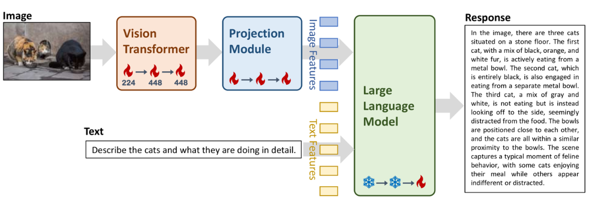

### 6.2 模型结构

Yi系列模型在LLaMA架构基础上进行优化，核心结构对比如下：

| 组件           | Yi模型配置            | 改进说明                            |
| :------------- | :-------------------- | :---------------------------------- |
| **核心架构**   | Decoder-Only          | 与LLaMA一致，适配自回归生成任务     |
| **位置编码**   | RoPE（旋转位置编码）  | 增强长文本建模能力                  |
| **归一化层**   | RMSNorm               | 提升训练稳定性，减少计算开销约7-15% |
| **激活函数**   | SwiGLU                | 相比GeLU提升特征提取效率            |
| **注意力机制** | 分组查询注意力（GQA） | 在34B+模型中应用，降低推理显存占用  |

### 6.2 版本矩阵

| 版本       | 发布时间   | 主要特性                                                     |
| :--------- | :--------- | :----------------------------------------------------------- |
| Yi-34B     | 2023年11月 | - 零一万物的首个开源大模型  - 支持**中英双语**，性能对标LLaMA-2  - 在AlpacaEval 2.0等国际评测中表现优异 |
| Yi-1.5系列 | 2024年5月  | - 升级版本包括：Yi-6B、Yi-9B、Yi-34B  - 优化**推理效率**和**多轮对话能力**  - 在Hugging Face、魔塔社区开源，吸引全球开发者 |
| Yi-Coder   | 2024年9月  | - 提供1.5B、9B版本  - 支持**52种编程语言**  - 128K上下文窗口，适用于复杂代码项目 |

## 7. DeepSeek 系列模型

DeepSeek 是由深度求索公司开发的大语言模型（LLM）系列，专注于实现通用人工智能（AGI）目标。该系列包含生成式模型（DeepSeek-V3）和推理型模型（DeepSeek-R1），通过混合专家（MoE）架构、多头潜在注意力（MLA）等创新技术，在保持高性能的同时显著降低计算资源消耗。

### 7.1核心模型版本

| 模型            | 类型     | 参数规模   | 上下文  | 核心优势              | 开源协议 |
| :-------------- | :------- | :--------- | :------ | :-------------------- | :------- |
| **DeepSeek-V3** | 基座模型 | 671B (MoE) | 128K    | 生成质量高，MoE架构   | MIT      |
| **DeepSeek-R1** | 推理模型 | 671B (MoE) | 128K    | 数学/代码推理SOTA     | MIT      |
| **蒸馏版**      | 轻量模型 | 1.5B-70B   | 32-128K | 保持80%能力，单卡可跑 | MIT      |

### 7.2 架构创新与技术特性

#### 1. 多头潜在注意力机制（MLA）

**核心目标**：通过低秩分解技术显著降低长文本处理时的显存占用，同时保持注意力机制的性能。

**技术原理**：

- 对传统多头注意力进行低秩分解，将键值（KV）缓存压缩至低维潜在空间
- 显存需求减少约30%，显著提升长序列处理效率
- 支持超长上下文窗口，适用于法律文档分析、多轮对话等场景

**实现优势**：

- 降低长文本推理时的显存瓶颈
- 提升序列处理速度
- 保持模型对长距离依赖的捕捉能力

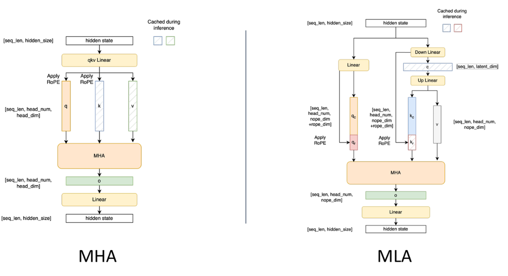

> **注意力机制中的Q、K、V分别是什么❓**
>
> 在注意力机制（Attention Mechanism）中，**Q（Query）、K（Key）、V（Value）** 是三个核心的概念，借鉴了信息检索的思想：
>
> - **Q (Query) - 查询**：表示当前正在关注或试图理解的信息。它像一个“问题”，用来去和其他所有信息做比较，以决定应该关注哪里。
> - **K (Key) - 键**：表示被查询信息的“标识”或“标签”。所有信息（包括 Q 本身）都对应一个 Key，用于被 Q 来匹配。
> - **V (Value) - 值**：表示被查询信息的实际内容。一旦 Q 和某个 K 匹配成功，就应该关注其对应的 Value。
>
> **核心计算过程**
>
> 注意力机制的核心是通过计算 **Q 和 K 的相似度** 来得到注意力分数，然后用这个分数对 **V** 进行加权求和，得到最终的输出。
>
> 最常见的计算方式是 **缩放点积注意力 (Scaled Dot-Product Attention)**：
>
> 1. **计算相似度**：计算 Q 和每个 K 的点积，得到注意力分数。 `scores = Q * K^T`
> 2. **缩放**：为了防止点积结果过大导致梯度消失，会除以一个缩放因子（通常是 Key 维度的平方根）。 `scores = scores / sqrt(d_k)`
> 3. **归一化**：用 Softmax 函数将分数转化为概率分布（权重和为 1）。 `attention_weights = softmax(scores)`
> 4. **加权求和**：用归一化后的权重对 V 进行加权求和，得到最终的输出。 `output = attention_weights * V`
>
> **形象比喻**
>
> 可以把注意力机制想象成一个**查字典的过程**：
>
> - **Q**：你要查询的“问题”或“词”
> - **K**：字典中每个词条的“索引”或“标题”
> - **V**：字典中每个词条的“详细解释”
>
> 当你用 Q 去查字典时，你会先拿 Q 和所有词条的 K（索引）进行匹配，找到最相关的几个词条，然后重点关注这些词条对应的 V（解释），最终综合这些信息得到答案。
>
> **在Transformer中的作用**
>
> 在Transformer模型中，Q、K、V 都是通过**将输入词嵌入（Embedding）与三个不同的可学习权重矩阵相乘**得到的：
>
> - `Q = X * W_Q`
> - `K = X * W_K`
> - `V = X * W_V`
>
> 这种设计让模型能够**动态地**为每个词生成适合当前上下文的 Q、K、V，从而灵活地捕捉序列中不同位置之间的依赖关系。通过自注意力机制，每个词都能“关注”到句子中其他所有词，并根据相关性大小分配注意力权重。
>
> **总结**：Q、K、V 是注意力机制中实现“动态加权”的核心三元组。Q 是查询者，K 是被查询的标识，V 是被查询的内容。通过 Q 与 K 的匹配来决定对 V 的关注程度，从而让模型聚焦于最重要的信息。
>
> ---

#### 2. 混合专家架构（Mixture-of-Experts, MoE）

**核心目标**：通过稀疏激活机制，在保持模型总参数量的前提下，降低单次推理的计算开销。

**技术实现**：

- 模型总参数量达6710亿，但单次前向传播仅激活约370亿参数（约5.5%）
- 将模型划分为多个专家子网络，每个输入token仅路由到少数专家
- 动态路由机制确保计算资源的高效利用

**性能收益**：

- 推理速度提升3-5倍
- 能耗降低60%以上
- 保持与Dense模型相当的性能水平

⚠️ **注意**：MoE架构虽然降低了单次推理成本，但仍需足够的显存加载完整模型参数。

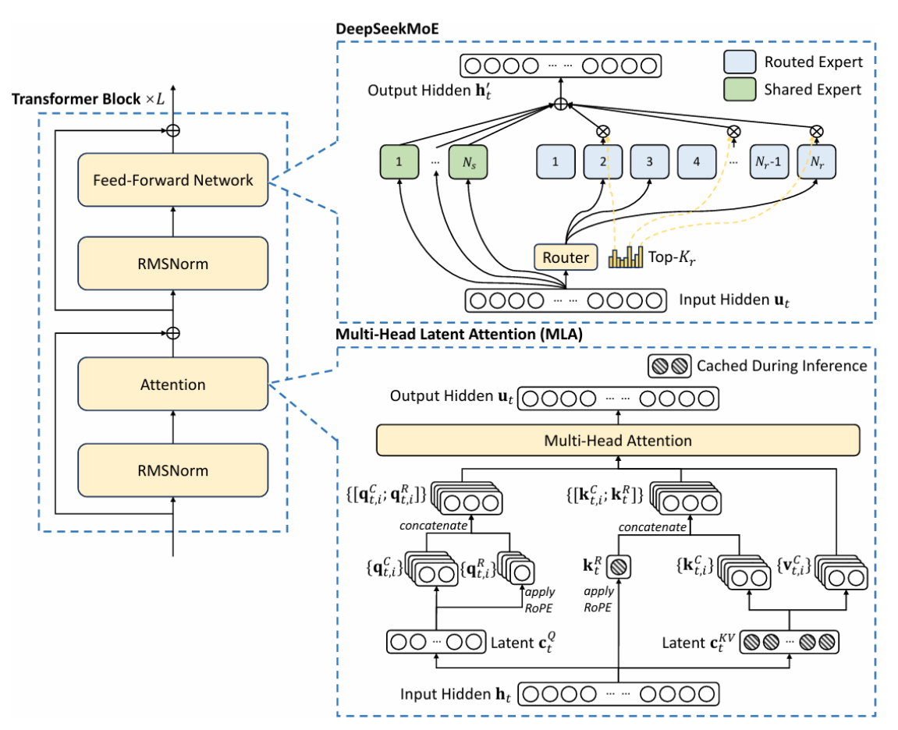

#### 3. FP8混合精度训练框架

**核心目标**：通过低位宽量化技术减少训练显存占用，加速训练过程。

**技术方案**：

- 采用FP8（8位浮点数）替代传统的FP16/FP32进行训练
- 结合精细的梯度缩放策略，避免梯度下溢
- 在backward pass中自动转换精度，确保训练稳定性

**通讯优化**：

- **DualPipe技术**：优化多GPU间的数据传输流水线
- 重叠计算与通信，减少GPU空闲等待时间
- 支持千卡级分布式训练的高效扩展

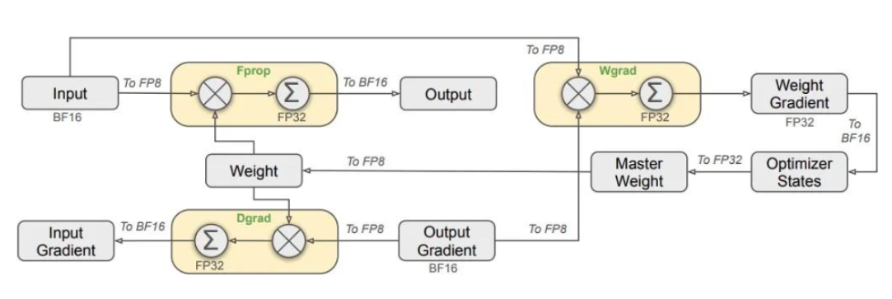

### 7.3 训练策略与流程

#### 1. DeepSeek-V3 训练流程

| 模型            | 阶段名称           | 关键内容描述                                                 |
| :-------------- | :----------------- | :----------------------------------------------------------- |
| **DeepSeek-V3** | 基础预训练阶段     | 在海量中英文语料上进行自监督学习，构建基础语言理解与生成能力。 |
|                 | 上下文长度扩展阶段 | 第一阶段：将最大上下文长度从4K扩展至32K； 第二阶段：进一步扩展至128K，采用渐进式训练策略。 |
|                 | 后训练对齐阶段     | 包括有监督微调（SFT）和人类反馈强化学习（RLHF），优化模型输出与人类偏好的一致性。 |

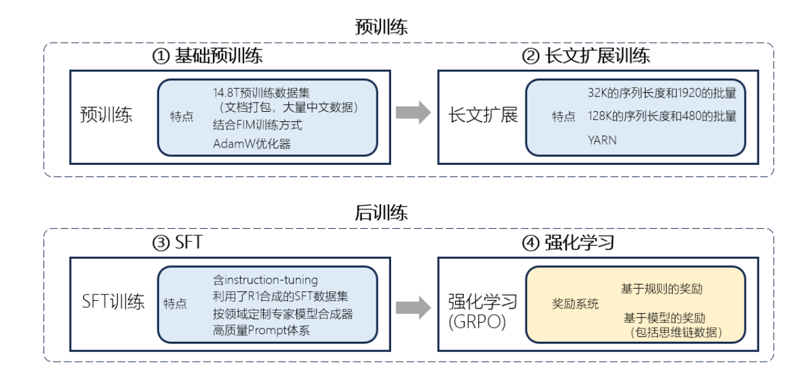

#### 2. DeepSeek-R1 训练流程

R1在V3基础上进行专项优化，训练分为四个阶段：

| 模型            | 阶段编号 | 阶段名称             | 关键内容描述                                                 |
| :-------------- | :------- | :------------------- | :----------------------------------------------------------- |
| **DeepSeek-R1** | ①        | 冷启动：CoT SFT      | 使用数千高质量CoT（思维链）示例进行SFT，提升模型推理能力。   |
|                 | ②        | 面向推理的强化学习   | 使用规则驱动的准确率奖励和格式奖励，通过强化学习（GRPO）进一步提升推理能力。 |
|                 | ③        | 拒绝采样与SFT        | 使用拒绝采样生成600k推理数据与200k非推理数据，进行SFT，增强模型的有用性与推理能力。 |
|                 | ④        | 全场景强化学习与对齐 | 使用奖励模型进行强化学习，优化模型在各类任务中的表现，提升通用性与人类偏好一致性。 |

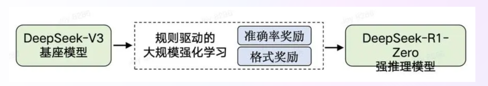

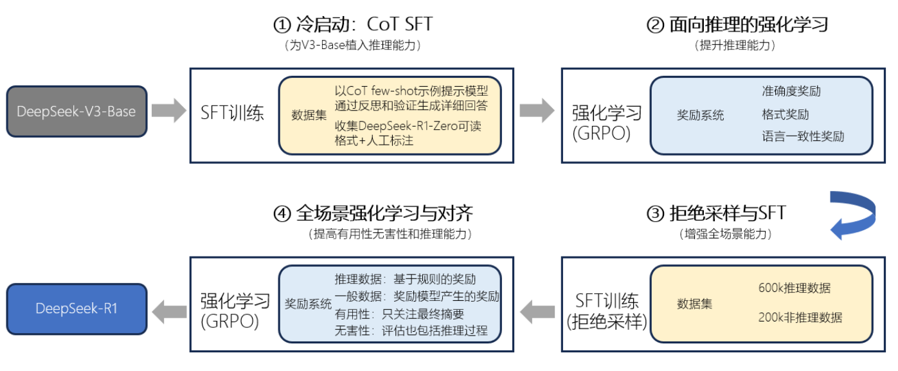

## 8. 开源协议对比

| 协议类型       | 商用授权           | 修改限制         | 专利授权   | 代表模型              | 适用场景       |
| :------------- | :----------------- | :--------------- | :--------- | :-------------------- | :------------- |
| **MIT**        | ✅ 完全自由         | 无限制           | 无         | DeepSeek              | 商业化产品集成 |
| **Apache 2.0** | ✅ 需保留声明       | 需标注修改       | ✅ 专利保护 | Qwen/Baichuan/ChatGLM | 企业级应用     |
| **Llama协议**  | ⚠️ 有条件(月活<7亿) | 禁止用于训练竞品 | 无         | Llama 3               | 中小企业       |
| **MCP**        | ✅ 标准接口         | 遵循协议规范     | 无         | Claude生态            | 工具链集成     |

⚠️ **合规建议**：使用Llama协议模型时，需定期核查月活用户数，接近7亿门槛时需与Meta协商单独授权。

## 9. 技术选型建议

根据模型参数规模与量化方式，推荐配置如下：

| 模型大小  | 训练显存 | 推理显存(FP16) | 推荐GPU        | 训练时间   | 多卡需求     | 适用场景          |
| :-------- | :------- | :------------- | :------------- | ---------- | :----------- | :---------------- |
| **7B**    | 20-24GB  | 14GB           | RTX 4090/A6000 | 数天至数周 | 可选         | 个人研究/中小企业 |
| **13B**   | 40-48GB  | 26GB           | A100 40G*2     | 1–2 周     | 必需(2卡)    | 企业级应用        |
| **32B**   | 200GB+   | 70GB           | A100 80G*4     | 2–4 周     | 必需(4卡+)   | 复杂任务/云服务   |
| **70B**   | 400GB+   | 140GB          | H100 80G*8     | 1–3 个月   | 必需(8卡+)   | 超大规模部署      |
| **304B+** | 1.5TB+   | 600GB+         | H100集群       | 数月以上   | 必需(100卡+) | 科研/国家级计算   |

💡 **量化建议**：推理时可使用4-bit量化，显存需求降低约50-60%，适合消费级显卡部署。

## 10. 总结

当前主流开源大模型已形成**技术趋同**与**差异化竞争**并存格局：

- **架构层面**：RoPE+RMSNorm+SwiGLU成为事实标准，MoE与GQA是效率优化方向
- **数据层面**：训练数据量从1T→15T tokens，质量比规模更重要
- **协议层面**：MIT/Apache 2.0推动商业化，Llama协议构建生态护城河
- **应用层面**：长上下文(1M+)、多模态、推理能力是三大演进方向

💡 **建议**：新项目中优先考虑**Apache 2.0协议**模型（如Qwen2.5），平衡性能与合规性；对于极致推理场景，**DeepSeek-R1**是当前最佳选择。