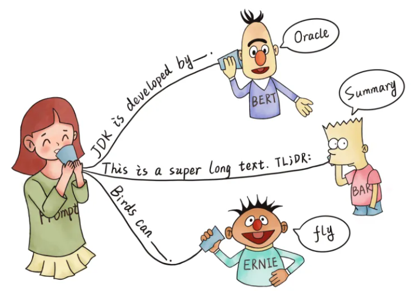
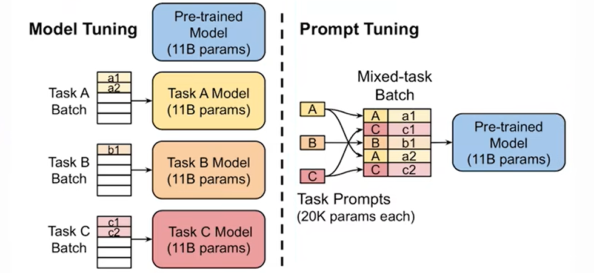
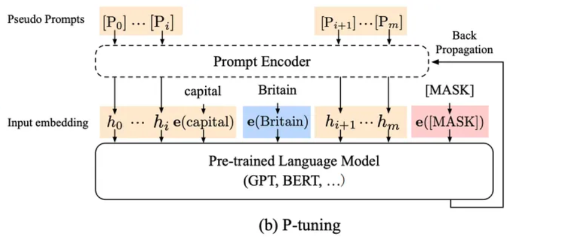
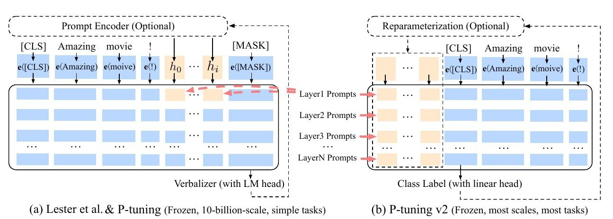
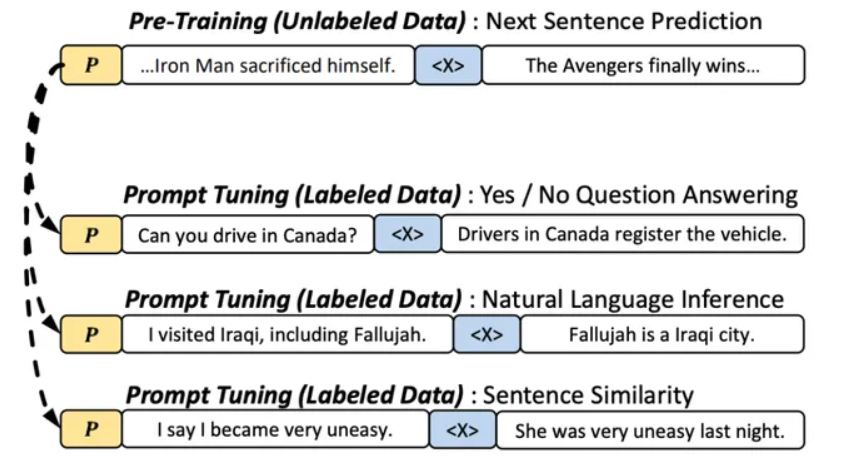

## 1 大模型提示词工程应用实战

### 1 金融行业动态方向评估项目

> 基于 ChatGLM-6B 的 Zero-shot / Few-shot Prompt 工程实战


#### 1. 项目定位

| 维度     | 说明                                                         |
| :------- | :----------------------------------------------------------- |
| 目标     | 无需专业算法背景，仅通过 Prompt 设计即可让大模型完成**金融文本分类 / 信息抽取 / 文本匹配**三大任务。 |
| 技术栈   | ChatGLM-6B + Zero-shot / Few-shot + Instruction Prompt       |
| 数据领域 | 中文金融公告、研报、新闻（可无缝迁移至其他行业）             |


#### 2. Zero-shot vs Few-shot 速览

| 场景          | 样本量 | 优点                | 风险             | 适用阶段    |
| :------------ | :----- | :------------------ | :--------------- | :---------- |
| **Zero-shot** | 0      | 无需标注，秒级上线  | 边界 case 易出错 | 冷启动、POC |
| **Few-shot**  | 1 ~ 32 | 精度↑、对齐业务用语 | 样本质量敏感     | 小样本迭代  |

> 💡 **经验**：先用 Zero-shot 跑通基线，再通过 Few-shot 把 F1 提升 5~15 个百分点。


#### 3. 环境依赖（一键安装）

```bash
pip install -r requirements.txt
```

```text
protobuf>=3.19.5,<3.20.1
transformers>=4.26.1
icetk
cpm_kernels
streamlit==1.17.0
```

> ⚠️ 建议使用 **Python 3.8 ~ 3.10** 虚拟环境，CUDA≥11.4 可开启 GPU 推理加速。


### 2 基于LLM的金融文本分类实战

#### 1. 任务概述

##### 1.1 业务场景

本章节处理真实的金融场景文本分类需求。给定以下4段金融领域文本，目标是自动识别每段文本所属的报告类型：

```python
# 待分类的金融文本样本
sentences = [
    "今日，央行发布公告宣布降低利率，以刺激经济增长。这一降息举措将影响贷款利率，并在未来几个季度内对金融市场产生影响。",
    "ABC公司今日发布公告称，已成功完成对XYZ公司股权的收购交易。本次交易是ABC公司在扩大业务范围、加强市场竞争力方面的重要举措。据悉，此次收购将进一步巩固ABC公司在行业中的地位，并为未来业务发展提供更广阔的发展空间。详情请见公司官方网站公告栏",
    "公司资产负债表显示，公司偿债能力强劲，现金流充足，为未来投资和扩张提供了坚实的财务基础。",
    "最新的分析报告指出，可再生能源行业预计将在未来几年经历持续增长，投资者应该关注这一领域的投资机会"
]
```

##### 1.2 预期输出

模型应将上述文本分类为以下四个类别之一：

```python
['新闻报道', '公司公告', '财务报告', '分析师报告']
```


#### 2. Prompt设计策略

##### 2.1 设计原则

⚠️ **核心要点**：Prompt设计需同时解决两个关键问题：

1. **任务定义清晰性**：明确告知模型"文本分类"的任务要求
2. **输出格式规范性**：强制模型按照指定格式返回结果

##### 2.2 In-context Learning设计

💡 **技巧**：通过提供高质量示例（Few-shot），引导模型理解任务模式，无需微调即可提升准确率。

| 角色       | 示例内容                    | 设计目的                           |
| :--------- | :-------------------------- | :--------------------------------- |
| **System** | "现在你是一个文本分类器..." | 明确任务身份和职责范围             |
| **User**   | 展示待分类文本              | 提供真实输入样本                   |
| **Bot**    | 给出正确分类结果            | 作为标签示范，建立输入输出映射关系 |

##### 2.3 实际Prompt结构

```properties
System: 现在你是一个文本分类器，你需要按照要求将我给你的句子分类到：['新闻报道', '公司公告', '财务报告', '分析师报告']类别中。

示例1:
User: "今日，股市经历了一轮震荡..." 是['新闻报道', '公司公告', '财务报告', '分析师报告']里的什么类别？
Bot: 新闻报道

示例2:
User: "本公司年度财务报告显示..." 是['新闻报道', '公司公告', '财务报告', '分析师报告']里的什么类别？
Bot: 财务报告

实际输入:
User: "待分类文本" 是['新闻报道', '公司公告', '财务报告', '分析师报告']里的什么类别？
Bot: [模型预测结果]
```


#### 3. 代码实现详解

##### 3.1 环境准备与依赖导入

```python
# -*- coding: utf-8 -*-
"""
LLM文本分类主程序
基于ChatGLM-6B模型实现Few-shot文本分类
"""

#  rich库提供美观的终端输出格式
from rich import print
from rich.console import Console

#  transformers库加载预训练模型和分词器
from transformers import AutoTokenizer, AutoModel

# ⚠️ 模型配置说明
# 使用ChatGLM-6B-int4量化版本以降低显存需求
# 原始模型需要13G+显存，int4版本可降至6G左右

# 定义分类体系：类别名称 -> 典型示例
# 这些示例将用于构建Few-shot学习的上下文
class_examples = {
    '新闻报道': '今日，股市经历了一轮震荡，受到宏观经济数据和全球贸易紧张局势的影响。投资者密切关注美联储可能的政策调整，以适应市场的不确定性。',
    '财务报告': '本公司年度财务报告显示，去年公司实现了稳步增长的盈利，同时资产负债表呈现强劲的状况。经济环境的稳定和管理层的有效战略执行为公司的健康发展奠定了基础。',
    '公司公告': '本公司高兴地宣布成功完成最新一轮并购交易，收购了一家在人工智能领域领先的公司。这一战略举措将有助于扩大我们的业务领域，提高市场竞争力',
    '分析师报告': '最新的行业分析报告指出，科技公司的创新将成为未来增长的主要推动力。云计算、人工智能和数字化转型被认为是引领行业发展的关键因素，投资者应关注这些趋势'
}
```

##### 3.2 Prompt初始化函数

```python
def init_prompts():
    """
    初始化Prompt模板，构建Few-shot学习上下文
    
    功能：
        1. 提取所有类别名称
        2. 构建系统指令（System Prompt）
        3. 将类别示例转换为对话历史格式
    
    返回:
        dict: 包含两个键值
            - 'class_list': 类别名称列表
            - 'pre_history': 对话历史，用于In-context Learning
    
    实现逻辑：
        预先构建多轮对话历史，让模型在预测时参考这些示例
    """
    # 提取类别名称作为分类标签空间
    class_list = list(class_examples.keys())
    
    # 构建系统级Prompt，明确任务定义
    pre_history = [
        (
            f'现在你是一个文本分类器，你需要按照要求将我给你的句子分类到：{class_list}类别中。',
            f'好的。'  # 模型确认理解任务
        )
    ]

    # 遍历所有类别示例，构建Few-shot样本
    # 每个样本格式：(带标签的提问, 正确答案)
    for _type, example in class_examples.items():
        # 构造提问模板
        question = f'“{example}”是 {class_list} 里的什么类别？'
        # 将(问题, 答案)作为一轮对话加入历史
        pre_history.append((question, _type))

    return {'class_list': class_list, 'pre_history': pre_history}
```

##### 3.3 核心推理函数

```python
def inference(sentences: list, custom_settings: dict):
    """
    执行批量文本分类推理
    
    参数:
        sentences (list): 待分类的文本列表，每个元素为字符串
        custom_settings (dict): Prompt配置，包含类别列表和对话历史
    
    功能说明:
        - 对输入的每个句子构造完整的Prompt
        - 调用ChatGLM模型生成分类结果
        - 使用rich库美化输出格式
    
    技术要点:
        - 复用pre_history实现Few-shot推理
        - 每个句子独立推理，互不影响
    """
    # 遍历待分类文本
    for sentence in sentences:
        # 使用rich显示推理状态动画
        with console.status("[bold bright_green] Model Inference..."):
            # 构造最终Prompt：待分类文本 + 类别空间
            sentence_with_prompt = f"“{sentence}”是 {custom_settings['class_list']} 里的什么类别？"
            
            # 调用模型进行生成
            # history参数传递Few-shot示例，实现In-context Learning
            response, history = model.chat(
                tokenizer, 
                sentence_with_prompt, 
                history=custom_settings['pre_history']
            )
        
        # 使用rich格式化输出结果
        print(f'>>> [bold bright_red]sentence: {sentence}')
        print(f'>>> [bold bright_green]inference answer: {response}')
        print("-" * 80)  # 分隔线提升可读性
```

##### 3.4 主程序入口

```python
if __name__ == '__main__':
    # 初始化rich控制台实例
    console = Console()
    
    # ⚠️ 硬件配置选择
    # 如果GPU显存充足(>13G)，可使用cuda:0
    # 否则使用cpu或int4量化版本
    device = 'cpu'  # 或 'cuda:0'
    
    # 加载分词器
    # trust_remote_code=True允许加载自定义模型结构
    tokenizer = AutoTokenizer.from_pretrained(
        "./ChatGLM-6B/THUDM/chatglm-6b-int4",
        trust_remote_code=True
    )
    
    # 加载量化后的模型以节省显存
    # .float()确保CPU兼容，.half().cuda()用于GPU加速
    model = AutoModel.from_pretrained(
        "./ChatGLM-6B/THUDM/chatglm-6b-int4",
        trust_remote_code=True
    ).float()  # 使用浮点数格式适配CPU
    
    # 将模型移动到指定设备
    model.to(device)
    
    # 定义待分类的金融文本
    sentences = [
        "今日，央行发布公告宣布降低利率，以刺激经济增长。这一降息举措将影响贷款利率，并在未来几个季度内对金融市场产生影响。",
        "ABC公司今日发布公告称，已成功完成对XYZ公司股权的收购交易。本次交易是ABC公司在扩大业务范围、加强市场竞争力方面的重要举措。据悉，此次收购将进一步巩固ABC公司在行业中的地位，并为未来业务发展提供更广阔的发展空间。详情请见公司官方网站公告栏",
        "公司资产负债表显示，公司偿债能力强劲，现金流充足，为未来投资和扩张提供了坚实的财务基础。",
        "最新的分析报告指出，可再生能源行业预计将在未来几年经历持续增长，投资者应该关注这一领域的投资机会"
    ]
    
    # 初始化Prompt配置
    custom_settings = init_prompts()
    
    # 执行批量推理
    inference(sentences, custom_settings)
```


#### 4. 运行结果展示

成功执行后，终端将输出如下格式的分类结果：

```
>>> sentence: 今日，央行发布公告宣布降低利率...
>>> inference answer: 新闻报道
--------------------------------------------------------------------------------
>>> sentence: ABC公司今日发布公告称，已成功完成...
>>> inference answer: 公司公告
--------------------------------------------------------------------------------
>>> sentence: 公司资产负债表显示，公司偿债能力强劲...
>>> inference answer: 财务报告
--------------------------------------------------------------------------------
>>> sentence: 最新的分析报告指出，可再生能源行业...
>>> inference answer: 分析师报告
```

💡 **输出解读**：模型通过In-context Learning准确理解了分类任务，并正确识别了每段文本的金融业务场景。


#### 5. 关键配置说明

##### 5.1 硬件要求

| 配置项    | 最低要求   | 推荐配置     | 备注                           |
| :-------- | :--------- | :----------- | :----------------------------- |
| 存储空间  | 12GB       | 20GB+        | 模型文件约12GB，需预留缓存空间 |
| 显存(GPU) | 6GB (int4) | 13GB+ (fp16) | 量化版本显存需求减半           |
| 内存(CPU) | 8GB        | 16GB         | CPU模式需要更多内存交换        |

##### 5.2 模型选择建议

```python
# GPU用户（显存>13G）
model = AutoModel.from_pretrained("THUDM/chatglm-6b", trust_remote_code=True).half().cuda()

# GPU用户（显存6G-13G）
model = AutoModel.from_pretrained("THUDM/chatglm-6b-int4", trust_remote_code=True).cuda()

# CPU用户
model = AutoModel.from_pretrained("THUDM/chatglm-6b-int4", trust_remote_code=True).float()
```

⚠️ **重要提示**：首次运行需科学上网下载模型，建议提前下载至本地路径`./ChatGLM-6B/THUDM/chatglm-6b-int4`


### 3 LLM实现金融文本信息抽取

#### 1. LLM信息抽取任务介绍

##### 1.1 任务定义

本任务旨在从金融新闻文本中自动抽取出结构化的实体信息，包括股票交易的关键要素。

##### 1.2 Schema定义

| 实体类型 | 属性列表                               |
| :------- | :------------------------------------- |
| **金融** | 日期、股票名称、开盘价、收盘价、成交量 |

##### 1.3 示例文本

| 序号  | 示例文本                                                     |
| :---- | :----------------------------------------------------------- |
| 示例1 | 2023-02-15，寓意吉祥的节日，股票佰笃[BD]美股开盘价10美元，虽然经历了波动，但最终以13美元收盘，成交量微幅增加至460,000，投资者情绪较为平稳。 |
| 示例2 | 2023-04-05，市场迎来轻松氛围，股票盘古(0021)开盘价23元，尽管经历了波动，但最终以26美元收盘，成交量缩小至310,000，投资者保持观望态度。⚠️ **注意**：示例中货币单位存在"元"与"美元"混用，实际应用中需统一标准化 |

**任务目标**：从上述文本中识别并提取SPO（Subject-Predicate-Object）三元组信息，输出结构化JSON格式数据。


#### 2. Prompt设计策略

##### 2.1 设计原则

💡 **核心要点**：在Zero-Shot场景下，Prompt设计需包含以下要素：

1. **任务定义**：清晰告知模型"信息抽取"的任务要求
2. **格式约束**：强制规定JSON输出格式与特殊值处理规则
3. **上下文学习**：通过Few-Shot示例引导模型理解任务模式

##### 2.2 Prompt模板结构

```properties
现在你需要帮助我完成信息抽取任务，当我给你一个句子时，你需要帮我抽取出句子中实体信息，并按照JSON的格式输出，上述句子中没有的信息用['原文中未提及']来表示，多个值之间用','分隔。

【示例1】
User: '2023-01-10，股市震荡。股票古哥-D[EOOE]美股今日开盘价100美元，一度飙升至105美元，随后回落至98美元，最终以102美元收盘，成交量达到520000。'
提取上述句子中"金融"('日期', '股票名称', '开盘价', '收盘价', '成交量')类型的实体...
Bot: {'日期': ['2023-01-10'],'股票名称': ['古哥-D[EOOE]美股'],'开盘价': ['100美元'],'收盘价': ['102美元'],'成交量': ['520000']}

【待处理文本】
{用户输入文本}
提取上述句子中"{实体类型}"({属性列表})类型的实体...
```


#### 3. 关系抽取任务代码实现

##### 3.1 导入必备工具包

```python
import re           # 导入正则表达式库，用于文本清洗与格式提取
import json         # 导入JSON库，用于数据结构转换与解析

from rich import print  # 导入rich库的print函数，实现终端彩色美观输出
from transformers import AutoTokenizer, AutoModel  # 导入transformers库的核心组件

# 定义金融实体类型及其属性Schema
# key: 实体类型，value: 该类型包含的属性列表
schema = {
    '金融': ['日期', '股票名称', '开盘价', '收盘价', '成交量'],
}

# 定义信息抽取的Prompt模板
# {}为占位符，运行时动态填充具体句子和Schema
IE_PATTERN = "{}\n\n提取上述句子中{}的实体，并按照JSON格式输出，上述句子中不存在的信息用['原文中未提及']来表示，多个值之间用','分隔。"

# 提供Few-Shot示例供模型学习
# content: 示例句子；answers: 标准答案JSON
ie_examples = {
    '金融': [
        {
            'content': '2023-01-10，股市震荡。股票古哥-D[EOOE]美股今日开盘价100美元，一度飙升至105美元，随后回落至98美元，最终以102美元收盘，成交量达到520000。',
            'answers': {
                '日期': ['2023-01-10'],
                '股票名称': ['古哥-D[EOOE]美股'],
                '开盘价': ['100美元'],
                '收盘价': ['102美元'],
                '成交量': ['520000'],
            }
        }
    ]
}
```

##### 3.2 构建`init_prompts()`函数

```python
def init_prompts():
    """
    初始化Prompt模板，构建In-Context Learning上下文
    
    功能：
    - 创建任务说明的初始对话历史
    - 将Few-Shot示例转换为模型可理解的对话格式
    - 动态生成带有Schema约束的Prompt
    
    返回：
        dict: 包含'ie_pre_history'键的字典，值为对话历史列表
    """
    # 初始化对话历史，首先添加系统级任务说明
    ie_pre_history = [
        (
            "现在你需要帮助我完成信息抽取任务，当我给你一个句子时，你需要帮我抽取出句子中实体信息，并按照JSON的格式输出，上述句子中没有的信息用['原文中未提及']来表示，多个值之间用','分隔。",
            '好的，请输入您的句子。'  # 模型确认理解任务的回复
        )
    ]

    # 遍历所有Few-Shot示例，构建上下文学习样本
    for _type, example_list in ie_examples.items():
        # 打印调试信息，确认加载的示例
        print(f'信息抽取样本的原始句子是--》{example_list}')
        
        for example in example_list:
            sentence = example['content']  # 提取示例句子
            properties_str = ', '.join(schema[_type])  # 将属性列表转为逗号分隔字符串
            schema_str_list = f'“{_type}”({properties_str})'  # 构造Schema描述字符串
            
            # 使用模板生成完整的Prompt
            sentence_with_prompt = IE_PATTERN.format(sentence, schema_str_list)
            
            # 将（Prompt, 标准答案）作为一轮对话加入历史
            ie_pre_history.append((
                f'{sentence_with_prompt}',  # 带Prompt的输入
                f"{json.dumps(example['answers'], ensure_ascii=False)}"  # JSON格式的标准答案
            ))
            
            # 打印调试信息，确认构建的对话历史
            print(f'ie_pre_history-->{ie_pre_history}')

    return {'ie_pre_history': ie_pre_history}  # 返回设置好的对话历史
```

##### 3.3 构建`clean_response()`函数

```python
def clean_response(response: str):
    """
    对模型输出结果进行后处理清洗
    
    功能：
    - 提取Markdown代码块中的JSON内容（如果存在）
    - 处理中文顿号、全角符号等格式问题
    - 尝试将字符串解析为JSON对象
    
    参数：
        response (str): 模型原始输出的字符串
    
    返回：
        dict or str: 成功则返回解析后的JSON字典，失败返回原始字符串
    """
    # 处理模型可能返回的Markdown代码块格式
    if '```json' in response:
        # 使用正则提取```json ... ```之间的内容
        res = re.findall(r'```json(.*?)```', response)
        if len(res) and res[0]:  # 确保提取到有效内容
            response = res[0]
        # 将中文顿号替换为英文逗号，统一分隔符
        response.replace('、', ',')
    
    # 尝试将字符串解析为JSON对象
    try:
        return json.loads(response)  # 成功返回字典
    except:
        return response  # 失败返回原始字符串，避免程序崩溃
```

##### 3.4 构建`inference()`函数

```python
def inference(sentences: list, custom_settings: dict):
    """
    执行批量信息抽取的推理函数
    
    功能：
    - 遍历待处理句子列表
    - 动态生成带Schema约束的Prompt
    - 调用模型生成结果并后处理
    - 彩色打印输出结果
    
    参数：
        sentences (List[str]): 待抽取的文本句子列表
        custom_settings (dict): 包含'ie_pre_history'对话历史的配置字典
    
    说明：
        本示例简化了分类步骤，直接指定为"金融"类型
    """
    for sentence in sentences:
        # 简化的分类结果（实际应用中应调用分类模型）
        cls_res = "金融"
        
        # 验证分类结果是否在Schema定义中
        if cls_res not in schema:
            print(f'⚠️ 警告：模型推断的类型"{cls_res}"不在Schema字典中，程序退出')
            exit()
        
        # 构建Schema字符串（同init_prompts中的逻辑）
        properties_str = ', '.join(schema[cls_res])
        schema_str_list = f'“{cls_res}”({properties_str})'
        sentence_with_ie_prompt = IE_PATTERN.format(sentence, schema_str_list)
        
        # 调用ChatGLM模型生成结果
        # history参数传递Few-Shot示例，实现In-Context Learning
        ie_res, _ = model.chat(tokenizer, sentence_with_ie_prompt, history=custom_settings['ie_pre_history'])
        
        # 清洗模型输出
        ie_res = clean_response(ie_res)
        
        # 使用rich库打印美观的彩色结果
        print(f'>>> [bold bright_red]sentence: {sentence}')
        print(f'>>> [bold bright_green]inference answer:')
        print(ie_res)
```


#### 4. 主程序入口与运行

```python
if __name__ == '__main__':
    # 设备配置：GPU加速或CPU推理
    # device = 'cuda:0'  # GPU版本（需13G+显存）
    device = 'cpu'       # CPU版本（速度较慢但兼容性更好）
    
    # 加载ChatGLM-6B模型的分词器
    # trust_remote_code=True允许执行模型仓库中的自定义Python代码
    tokenizer = AutoTokenizer.from_pretrained(
        "./ChatGLM-6B/THUDM/chatglm-6b",
        trust_remote_code=True
    )
    
    # 加载ChatGLM-6B模型（约12G磁盘空间）
    # .float()使用全精度浮点数（CPU必需）
    # .half().cuda()使用半精度以节省显存（GPU推荐）
    model = AutoModel.from_pretrained(
        "./ChatGLM-6B/THUDM/chatglm-6b",
        trust_remote_code=True
    ).float()
    
    # 将模型移动到指定设备
    model.to(device)
    
    # 定义待抽取的金融文本列表
    sentences = [
        '2023-02-15，寓意吉祥的节日，股票佰笃[BD]美股开盘价10美元，虽然经历了波动，但最终以13美元收盘，成交量微幅增加至460,000，投资者情绪较为平稳。',
        '2023-04-05，市场迎来轻松氛围，股票盘古(0021)开盘价23元，尽管经历了波动，但最终以26美元收盘，成交量缩小至310,000，投资者保持观望态度。',
    ]
    
    # 初始化Prompt配置（加载Few-Shot示例）
    custom_settings = init_prompts()
    
    # 执行批量信息抽取
    inference(
        sentences,
        custom_settings
    )
```

##### 4.1 运行结果示例

```properties
信息抽取样本的原始句子是--》[{'content': '2023-01-10...', 'answers': {...}}]
ie_pre_history-->[('任务说明...', '好的...'), ('Prompt...', '{"日期": ["2023-01-10"]...}')]

>>> sentence: 2023-02-15，寓意吉祥的节日...
>>> inference answer:
{
    '日期': ['2023-02-15'],
    '股票名称': ['佰笃[BD]美股'],
    '开盘价': ['10美元'],
    '收盘价': ['13美元'],
    '成交量': ['460,000']
}

>>> sentence: 2023-04-05，市场迎来轻松氛围...
>>> inference answer:
{
    '日期': ['2023-04-05'],
    '股票名称': ['盘古(0021)'],
    '开盘价': ['23元'],  # ⚠️ 注意：单位与收盘价不一致
    '收盘价': ['26美元'],
    '成交量': ['310,000']
}
```


### 4 基于LLM实现金融文本匹配

#### 1 任务场景与数据示例

##### 1.1 任务定义

本任务要求模型自动识别两组金融文本在**语义层面**的相似性，输出二分类结果（相似/不相似）。

##### 1.2 评测数据集

构造3对具有代表性的金融短文本：

| 编号 | 句子一                           | 句子二                           | 期望输出   |
| :--- | :------------------------------- | :------------------------------- | :--------- |
| 1    | 股票市场今日大涨，投资者乐观。   | 持续上涨的市场让投资者感到满意。 | **相似**   |
| 2    | 油价大幅下跌，能源公司面临挑战。 | 未来智能城市的建设趋势愈发明显。 | **不相似** |
| 3    | 利率上升，影响房地产市场。       | 高利率对房地产有一定冲击。       | **相似**   |


#### 2 Prompt工程设计

##### 2.1 设计核心原则

1. **任务定义清晰化**：明确告知模型「文本匹配任务」的具体要求
2. **输出格式规范化**：强制模型返回结构化、可解析的结果
3. **上下文学习（In-context Learning）**：通过高质量示例激活模型的few-shot能力

##### 2.2 Prompt模板结构

```properties
System: 现在你需要帮助我完成文本匹配任务，当我给你两个句子时，
         你需要回答我这两句话语义是否相似。只需要回答"是"或"不是"。
         
User: 句子一: [示例句子A]
      句子二: [示例句子B]
      上面两句话是相似的语义吗？
Bot: 是/不是  # 人工标注的标准答案
```

💡 **设计技巧**：通过`pre_history`参数将示例对话嵌入模型上下文，形成 **"系统指令+示例演示+当前任务"** 的三段式结构，显著提升Zero-shot场景下的稳定性。


#### 3 完整代码实现

##### 3.1 环境准备与工具导入

```python
from rich import print          # 导入rich库实现美观的终端打印
from transformers import AutoTokenizer, AutoModel  # 导入HuggingFace核心组件
import os                       # 操作系统接口

# =========================================
# 训练示例数据构造
# key: 标签（"是"表示相似，"不是"表示不相似）
# value: (句子1, 句子2) 元组列表
# =========================================
examples = {
    '是': [  # 正例：语义相似的句子对
        ('公司ABC发布了季度财报，显示盈利增长。', '财报披露，公司ABC利润上升。'),
    ],
    '不是': [  # 负例：语义不相关的句子对
        ('黄金价格下跌，投资者抛售。', '外汇市场交易额创下新高。'),
        ('央行降息，刺激经济增长。', '新能源技术的创新。')
    ]
}
```


##### 3.2 Prompt初始化函数

```python
def init_prompts():
    """
    初始化Prompt模板，构建用于In-context Learning的对话历史。
    
    功能说明：
    1. 首先注入系统级指令，明确任务目标和输出约束
    2. 动态遍历examples字典，将标注样本转换为多轮对话格式
    3. 返回结构化历史记录，供模型推理时作为上下文
    
    返回值:
        dict: 包含'pre_history'键的字典，值为List[Tuple[str, str]]格式
              每个元组代表一轮对话：(用户输入, 标准回复)
    """
    # 初始化系统指令，明确任务边界
    pre_history = [
        (
            '现在你需要帮助我完成文本匹配任务，当我给你两个句子时，'
            '你需要回答我这两句话语义是否相似。只需要回答"是"或"不是"。',
            '好的，我将只回答"是"或"不是"。'
        )
    ]

    # 遍历所有示例，构建Few-shot上下文
    # key: "是"或"不是"标签
    # sentence_pairs: 属于该标签的所有句子对
    for key, sentence_pairs in examples.items():
        for sentence_pair in sentence_pairs:
            sentence1, sentence2 = sentence_pair  # 解包句子对
            
            # 构建符合任务格式的查询语句
            query = f'句子一: {sentence1}\n句子二: {sentence2}\n上面两句话是相似的语义吗？'
            
            # 将(查询, 答案)添加到历史记录
            pre_history.append((query, key))

    return {'pre_history': pre_history}
```


##### 3.3 模型推理函数

```python
def inference(sentence_pairs: list, custom_settings: dict):
    """
    执行批量文本匹配推理的主函数。
    
    参数说明:
        sentence_pairs (list): 待推理的句子对列表，格式为[(s1, s2), ...]
        custom_settings (dict): 包含pre_history的上下文配置字典
    
    处理流程:
        1. 遍历每个句子对
        2. 拼接Prompt模板与当前查询
        3. 调用模型生成响应
        4. 格式化输出结果
    """
    # 遍历待预测数据集
    for sentence_pair in sentence_pairs:
        sentence1, sentence2 = sentence_pair  # 解包当前句子对
        
        # 构造带提示的查询语句，格式与训练示例严格一致
        sentence_with_prompt = (
            f'句子一: {sentence1}\n'
            f'句子二: {sentence2}\n'
            '上面两句话是相似的语义吗？'
        )
        
        # 调用ChatGLM的chat接口进行推理
        # - tokenizer: 分词器
        # - sentence_with_prompt: 当前查询
        # - history=custom_settings['pre_history']: 注入Few-shot上下文
        response, history = model.chat(
            tokenizer, 
            sentence_with_prompt, 
            history=custom_settings['pre_history']
        )
        
        # 使用rich库打印带样式的结果
        print(f'>>> [bold bright_red]Sentence: {sentence_pair}')  # 红色显示输入
        print(f'>>> [bold bright_green]Inference: {response}')    # 绿色显示预测
        # print(history)  # 调试用：打印完整对话历史
```


##### 3.4 主程序入口

```python
if __name__ == '__main__':
    # ==================== 模型加载配置 ====================
    # device = 'cuda:0'  # GPU推理配置（需13GB+显存）
    device = 'cpu'       # CPU推理配置（适用于资源受限环境）
    
    # 从本地路径加载分词器
    # trust_remote_code=True: 允许执行模型自定义的Python代码
    tokenizer = AutoTokenizer.from_pretrained(
        "./ChatGLM-6B/THUDM/chatglm-6b",
        trust_remote_code=True
    )
    
    # 加载模型并配置精度
    # .float(): 全精度加载（CPU推荐使用）
    # .half().cuda(): 半精度加载（GPU推荐使用，节省显存）
    model = AutoModel.from_pretrained(
        "./ChatGLM-6B/THUDM/chatglm-6b",
        trust_remote_code=True
    ).float()
    model.to(device)  # 将模型移动到指定设备
    
    # ==================== 测试数据构造 ====================
    # 构造3组金融领域的测试样本，覆盖股市、能源、地产场景
    sentence_pairs = [
        ('股票市场今日大涨，投资者乐观。', '持续上涨的市场让投资者感到满意。'),  # 同义表达
        ('油价大幅下跌，能源公司面临挑战。', '未来智能城市的建设趋势愈发明显。'),  # 主题无关
        ('利率上升，影响房地产市场。', '高利率对房地产有一定冲击。'),              # 因果关联
    ]

    # ==================== 执行推理 ====================
    # 初始化Few-shot Prompt配置
    custom_settings = init_prompts()
    
    # 执行批量推理
    inference(
        sentence_pairs,
        custom_settings
    )
```

⚠️ **运行要求**：

- **存储空间**：ChatGLM-6B模型约需12GB+磁盘空间
- **GPU显存**：全精度加载需13GB+显存（推荐NVIDIA V100/A100）
- **量化方案**：显存不足时可使用`int8`/`int4`量化加载
- **依赖库**：`transformers>=4.23.1`, `rich`, `torch`


#### 4 预期输出结果

成功执行后，终端将显示如下格式的结果：

```properties
>>> Sentence: ('股票市场今日大涨，投资者乐观。', '持续上涨的市场让投资者感到满意。')
>>> Inference: 是

>>> Sentence: ('油价大幅下跌，能源公司面临挑战。', '未来智能城市的建设趋势愈发明显。')
>>> Inference: 不是

>>> Sentence: ('利率上升，影响房地产市场。', '高利率对房地产有一定冲击。')
>>> Inference: 是
```


## 2 大模型Prompt-Tuning方法

### 1. NLP任务四种范式演进

自然语言处理任务的发展可分为四个阶段，每个阶段都代表着训练范式的重大转变：

| 范式         | 技术特征                   | 代表方法                     | 核心优势                             | 主要局限                          |
| :----------- | :------------------------- | :--------------------------- | :----------------------------------- | :-------------------------------- |
| **第一范式** | 传统机器学习模型           | TF-IDF特征 + 朴素贝叶斯/ SVM | 模型轻量，可解释性强                 | 依赖人工特征工程，准确率有限      |
| **第二范式** | 深度学习模型               | Word2Vec特征 + LSTM/CNN      | 自动特征学习，准确率提升             | 仍需任务特定架构，数据需求大      |
| **第三范式** | 预训练模型 + Fine-Tuning   | BERT + Fine-Tuning           | 通用性强，小数据可训练好模型         | 存在预训练-微调目标差异，易过拟合 |
| **第四范式** | 预训练模型 + Prompt + 预测 | BERT + Prompt-Tuning         | **训练数据需求显著减少**，语义更连贯 | 模板设计复杂，需精细调优          |

**💡 发展趋势**：NLP领域正朝着**精度更高、监督更少、泛化更强**的方向演进，Prompt-Tuning是这一方向的最新突破。


### 2. Fine-Tuning（微调）的技术瓶颈

#### 2.1 基本原理

Fine-Tuning是经典的迁移学习方式，将预训练语言模型（如BERT）在特定任务数据上继续训练，使模型适应下游任务。

```properties
预训练模型权重 → 任务数据继续训练 → 全参数更新 → 适配特定任务
```

**典型流程**：

1. 输入文本 → BERT编码 → [CLS]向量
2. 新增MLP分类器 → 下游任务预测
3. **全模型参数更新**（BERT + 分类器）

#### 2.2 核心痛点

⚠️ **Fine-Tuning面临两大根本问题**：

| 问题类型           | 具体表现                                  | 根源分析                                 |
| :----------------- | :---------------------------------------- | :--------------------------------------- |
| **语义偏差**       | 预训练目标（MLM/NSP）与下游任务目标差异大 | Pre-Training与Fine-Tuning之间存在目标Gap |
| **存储资源要求大** | 每个任务需要保存一份完整的模型权重        | Fine-Tuning 后模型只能适应特定的下游任务 |
| **过拟合风险**     | 小样本下新增参数易过拟合，泛化能力下降    | 任务特定参数过多，监督信号不足           |

**💡 根本矛盾**：Fine-Tuning让**预训练模型迁就下游任务**，导致适应成本高昂，尤其在数据稀缺场景下效果不佳。


### 3. Prompt-Tuning（提示微调）

#### 3.1 什么是Prompt？

Prompt即"提示"，类比"你画我猜"游戏中的提示词。核心思想是：**通过精心设计的提示信息，引导预训练模型理解任务意图，而非强制改变模型本身**。



#### 3.2 Prompt-Tuning核心定义

**Prompt-Tuning**将下游任务转换为与预训练任务（MLM）一致的**完形填空**格式，实现<span color='red'>**任务迁就模型**</span>的新范式。

**情感分析示例对比**：

| 阶段     | 传统Fine-Tuning                    | Prompt-Tuning                                           |
| :------- | :--------------------------------- | :------------------------------------------------------ |
| **输入** | `[CLS] I like Disney films. [SEP]` | `[CLS] I like Disney films. [SEP] It was [MASK]. [SEP]` |
| **处理** | 提取[CLS]向量 → 新增分类器         | 复用MLM头 → 预测[MASK]位置词                            |
| **参数** | 更新全模型 + 分类器                | **仅更新MLM头**，预训练模型冻结                         |
| **预测** | 二分类输出                         | Verbalizer映射：`great`→positive, `terrible`→negative   |

**核心三要素**：

1. **Template（模板）**：含`[MASK]`的提示文本，如`It was [MASK].`
2. **Verbalizer（标签映射器）**：建立预测词与标签的映射关系
3. **训练目标**：最小化MLM任务与下游任务的联合损失

> 💡**预训练模型的两个组成部分**
>
> ```python
> 预训练模型(BERT) = Transformer编码器(主体) + MLM预测头(分类层)
> ```
>
> | 组件                  | 功能                 | 参数规模       | Prompt-Tuning中是否冻结        |
> | :-------------------- | :------------------- | :------------- | :----------------------------- |
> | **Transformer编码器** | 提取文本语义特征     | **99%+参数**   | ✅ **冻结** (不更新梯度)        |
> | **MLM预测头**         | 将特征映射到词表概率 | 最后一层线性层 | 复用预训练好的，**不额外训练** |


### 4. Prompt-Tuning技术发展历程

```Mermaid
graph LR
    A[GPT-3提出In-context Learning] --> B[离散Prompt构建];
    B --> C[连续Prompt向量];
    C --> D[Prompt-Oriented Fine-Tuning];
    D --> E[Hard/Soft Prompt分离];
    E --> F[超大规模模型应用];
    F --> G[Instruction-tuning & Chain-of-Thought];
```

**关键里程碑**：

- **2020**：GPT-3提出In-context Learning，奠定思想基础
- **2021**：PET模型确立PVP（Pattern-Verbalizer-Pair）框架
- **2021-2022**：Prompt Tuning、P-tuning等连续提示方法涌现
- **2023+**：与超大模型结合，发展出In-Context Learning、Instruction-tuning等新范式


### 5. Prompt-Tuning主要方法详解

#### 5.1 鼻祖：GPT-3与In-context Learning

##### 5.1.1 核心思想

GPT-3《Language Models are Few-Shot Learners》开创性提出**情景学习（In-context Learning, ICL）**，**无需修改模型参数**即可实现few-shot/zero-shot学习。

**三种学习模式对比**：

| 方法          | 定义                     | 示例                                             | 适用场景       |
| :------------ | :----------------------- | :----------------------------------------------- | :------------- |
| **Zero-shot** | 仅提供任务描述，直接预测 | `中文翻译英文：销售→`                            | 模型能力极强时 |
| **One-shot**  | 提供1个示例指导          | `中文翻译英文：你好→hello, 销售→`                | 数据极度稀缺   |
| **Few-shot**  | 提供10-100个示例         | `你好→hello, 再见→goodbye, 购买→purchase, 销售→` | 小样本标准场景 |

⚠️**局限性**：依赖**超大规模模型**（>100B参数），小规模模型效果骤降。


#### 5.2 PET模型：PVP框架确立

**PET（Pattern-Exploiting Training）** 将任务统一建模为**完形填空**问题，核心贡献是提出**PVP（Pattern-Verbalizer-Pair）**组件：

| 组件           | 符号 | 定义                                 | 关键挑战           |
| :------------- | :--- | :----------------------------------- | :----------------- |
| **Pattern**    | T    | 含`[mask]`的模板，如`It was [mask].` | 如何构建最优模板   |
| **Verbalizer** | V    | 标签词映射，如`great`→positive       | 如何选择有效映射词 |

⚠️ **PVP选择敏感性**：相同数据集下，**不同的Pattern/Verbalizer组合会导致结果差异巨大**，如下图所示（实验结果）：

| Pattern           | Verbalizer (great/terrible) | Verbalizer (good/bad) | 性能差距 |
| :---------------- | :-------------------------- | :-------------------- | :------- |
| `It was [mask].`  | 92.3%                       | 89.1%                 | **3.2%** |
| `This is [mask].` | 88.7%                       | 91.5%                 | **2.8%** |

**人工设计缺陷**：

- 依赖专家先验知识，成本高
- 无法保证最优解，训练不稳定
- 与预训练MLM分布存在差异（比如MLM训练通常都是长文本，mask的数量也并非只有1个，预测的概率分布也并非是有限的）

💡 **解决思路**：从**离散模板**走向**连续提示向量（Soft Prompt）**。


### 6. Soft Prompt：连续提示微调

#### 6.1 核心思想

将离散的模板token转换为**可优化的连续向量**——**伪标记（Pseudo Token）**，在语义空间中自动学习最优提示。

**形式化定义**：

- 输入句子：$x$
- 连续模板：$T = [x_1, [v_1], [v_2], \ldots, [v_n], [\text{MASK}]]$
- 每个伪标记 $v_i$ 是一个可训练的向量，而非真实词汇

**优势**：不同样本可在连续向量空间中自适应寻找最优伪标记，**泛化能力更强**。


#### 6.2 代表方法对比

| 方法              | 适用模型      | 核心创新                | 参数更新       | 典型场景       |
| :---------------- | :------------ | :---------------------- | :------------- | :------------- |
| **Prompt Tuning** | T5等NLG模型   | 固定前缀提示，冻结PLM   | 仅prompt向量   | 文本生成       |
| **P-tuning**      | BERT等NLU模型 | BiLSTM编码器+锚点初始化 | Prompt编码器   | 自然语言理解   |
| **PPT**           | 通用          | 无标注预训练soft prompt | 先预训练后微调 | **小样本学习** |


#### 6.3 Prompt Tuning（NLG任务）



**核心机制**：

- 为每个输入添加**固定长度的前缀提示**（如100个伪标记）
- **完全冻结**预训练大模型参数
- 仅通过反向传播更新**提示向量**和**MLP头**

**伪标记初始化策略**：

| 策略             | 方法描述                   | 适用情况                       |
| :--------------- | :------------------------- | :----------------------------- |
| **随机初始化**   | 正态/均匀分布随机向量      | 通用场景，需充分训练           |
| **词表初始化**   | 从预训练词表中随机选词映射 | 加速收敛，保持语义             |
| **标签词初始化** | 用Verbalizer对应词嵌入     | **分类任务首选**，限制输出空间 |

**性能特点**：

- ✅ **优点**：大模型参数固定，指定附加参数来适配下游任务，性能接近全参数微调
- ⚠️ **缺点**：小样本场景效果差，收敛慢，调参复杂


#### 6.4 P-tuning（NLU任务）



> 图中的$Pi$等价于上文的$vi$ ，表示伪标记


**四大技术技巧**：

1. **伪标记依赖建模**：采用**Bi-LSTM+前馈网络**作为Prompt Encoder，捕捉伪标记间的时序依赖
2. **锚点词指定**：选择输入中**语义代表性词汇**（如"capital"、"Britain"）作为部分伪标记的初始化
3. **重参数化（Reparameterization）**：训练后仅保留优化后的**embedding table**，推理时**移除Prompt Encoder**
4. **混合提示（Hybrid Prompt）**：离散token与连续向量混合，如 `[x][it][v1][mask]`


**P-tuning v2升级**：



- 在**每一层Transformer**都应用连续提示
- 专为**NLU任务**优化，效果更全面


#### 6.5 PPT（Pre-trained Prompt Tuning）




**解决痛点**：Soft Prompt随机初始化在小样本下优化困难。（由于连续的模板是随机初始化的，即其存在新的参数，少量样本可能依然很难确保这些模板被很好地优化。因此简单的方法就是对这些连续的模板也进行预训练。PPT旨在通过先让这些连续提示在大量无标注的预训练语料进行预训练，然后将其加载到对应下游任务的PLM上进行训练）

**两阶段训练**：

1. **预训练阶段**：在**大量无标注语料**上预训练soft prompt（PLM参数**固定**）
2. **微调阶段**：加载预训练prompt，在下游任务上微调或zero-shot预测

**优势**：

- ✅ **小样本性能显著提升**
- ✅ 收敛速度加快
- ❌ 需人工划分任务类别进行预训练


### 7. 方法全景对比总结

#### 7.1 Hard Prompt vs Soft Prompt

| 维度         | Hard Prompt（离散）                | Soft Prompt（连续）          |
| :----------- | :--------------------------------- | :--------------------------- |
| **形式**     | 真实文本字符串，如`It was [mask].` | 可训练向量`[v1],[v2]...`     |
| **构建方式** | 人工设计 / 自动搜索                | 随机初始化 + 反向传播优化    |
| **参数量**   | 0（不新增参数）                    | 少量（prompt向量+编码器）    |
| **稳定性**   | 方差大，对措辞敏感                 | 更稳定，自适应学习           |
| **可解释性** | 高（人类可读）                     | 低（黑盒向量）               |
| **代表方法** | PET                                | Prompt Tuning, P-tuning, PPT |

#### 7.2 Soft Prompt方法深度对比

| 特性           | Prompt Tuning    | P-tuning                | PPT                     |
| :------------- | :--------------- | :---------------------- | :---------------------- |
| **适用任务**   | NLG（文本生成）  | NLU（自然语言理解）     | 通用（尤其小样本）      |
| **模型参数**   | 冻结PLM          | 冻结PLM                 | 冻结PLM（两阶段）       |
| **核心结构**   | 固定前缀 + MLP   | BiLSTM编码器 + 混合提示 | 无标注预训练 + 任务微调 |
| **初始化**     | 随机/词表/标签词 | 锚点词 + LSTM编码       | 自监督预训练初始化      |
| **收敛速度**   | 慢               | 中等                    | **快**                  |
| **小样本性能** | 较差             | 中等                    | **优秀**                |
| **工程复杂度** | 高               | 中等                    | 较高（需预训练）        |
