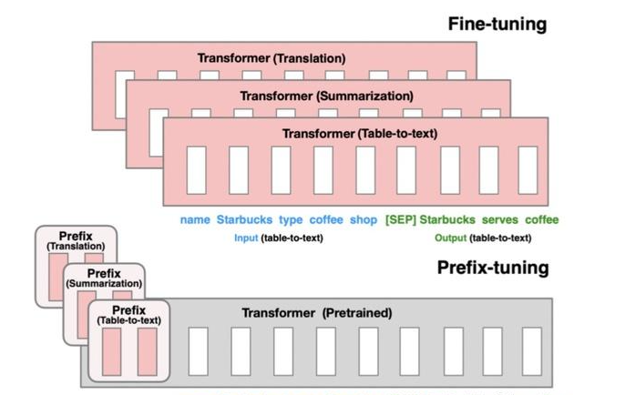
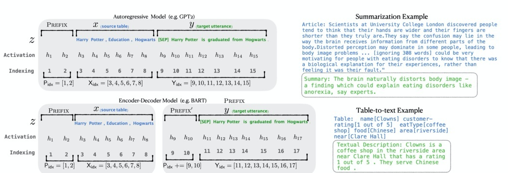
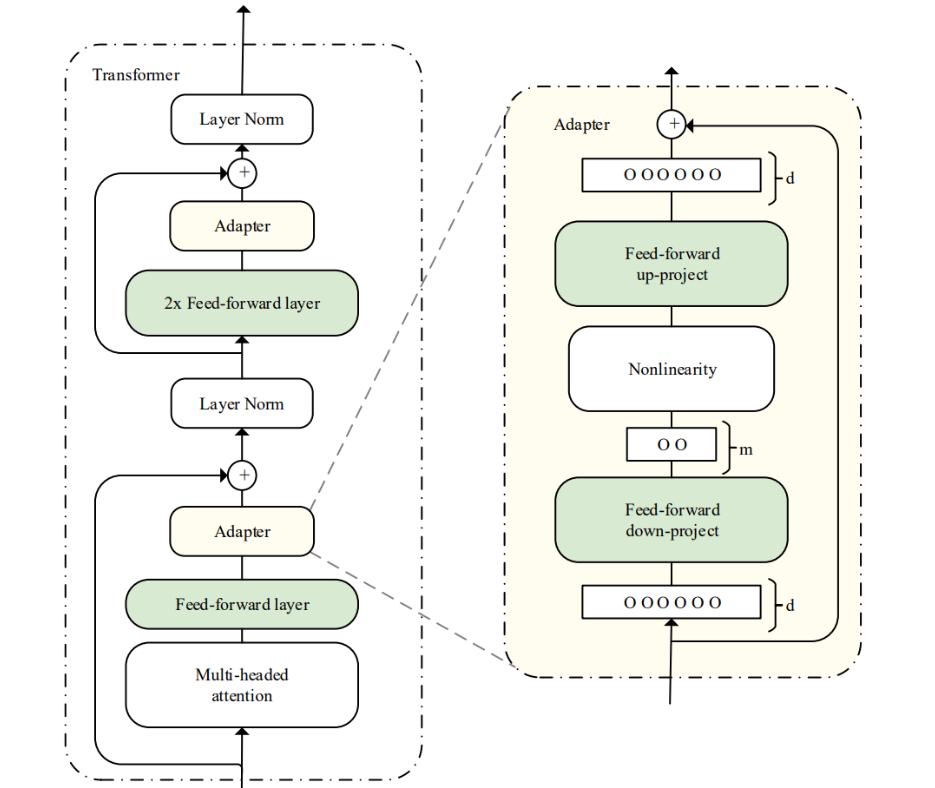
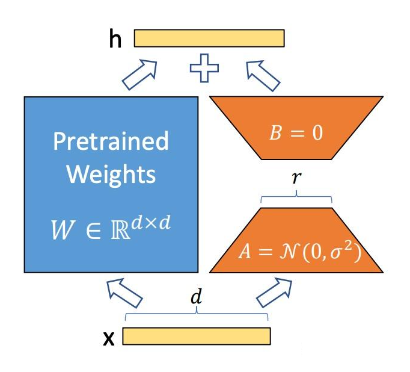
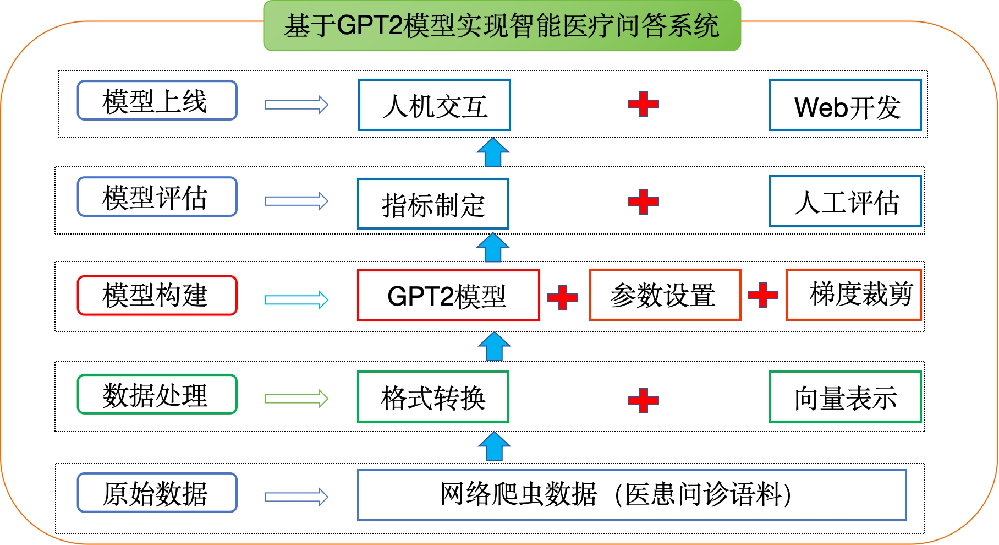
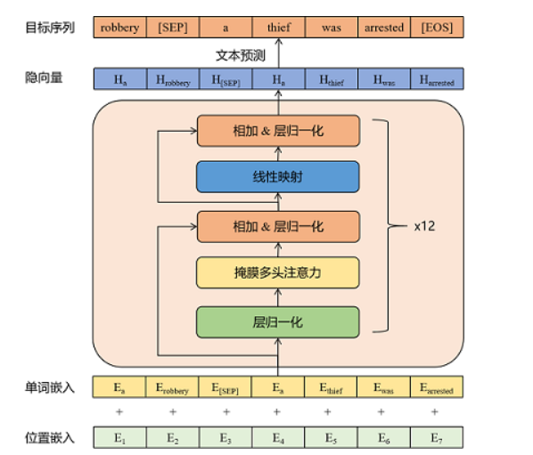

## 1 LLM的PEFT微调方法

### 1. PEFT（大模型参数高效微调）

#### 1.1 技术概述

**参数高效微调（Parameter-Efficient Fine-Tuning, PEFT）** 是目前工业界应用大模型的主流方式。与全量微调相比，PEFT仅微调少量或额外的模型参数，同时固定大部分预训练参数，具有以下核心优势：

- **大幅降低计算和存储成本**
- **实现与全量微调相当的性能**
- **使大模型在消费级硬件上进行微调变得可行**


#### 1.2 三大主流方法分类

| 方法类型                 | 核心思想               | 参数更新位置        | 典型代表                |
| :----------------------- | :--------------------- | :------------------ | :---------------------- |
| **Prefix/Prompt-Tuning** | 添加可训练的前缀tokens | 输入层或隐层        | Prefix Tuning, P-Tuning |
| **Adapter-Tuning**       | 插入小型神经网络模块   | Transformer各层之间 | Adapter Tuning          |
| **LoRA**                 | 低秩矩阵近似权重更新   | 旁路分支            | LoRA, QLoRA             |

> 💡 **HuggingFace PEFT库**：开源的高效微调库，直接支持上述三类方法。


### 2. Prefix Tuning

#### 2.1 核心原理

Prefix-Tuning在模型输入前添加**连续的、任务特定的向量序列**（称为"前缀"），这些前缀被视为"虚拟tokens"，由**不对应真实tokens的自由参数**组成。

**关键特性：**

- 冻结PLM所有参数，仅更新优化特定任务的prefix
- 每个下游任务只需存储学习到的prefix，实现模块化部署
- 显著降低额外计算和存储开销




#### 2.2 工作机制



以GPT-2自回归语言模型为例：

1. **输入重构**：将输入`x`和输出`y`拼接为`z=[x; y]`
2. **添加前缀**：在输入前添加前缀，`z=[Prefix, x, y]`
   - 前缀索引`P_idx`对应参数化向量矩阵`P_θ`，维度为`|P_idx| × dim(h_i)`
3. **隐层计算**：
   - 若索引为前缀索引`P_idx`，直接从参数化矩阵`P_θ`复制对应向量作为隐层表示`h_i`
   - **重要**：在模型**每一层**都添加前缀向量
   - 非前缀位置的`h_i`通过PLM计算得到，但受左侧前缀参数影响

#### 2.3 优化策略

这是 Prefix-Tuning 最精妙也最关键的部分。

**问题**: 如果我们直接优化前缀矩阵 `P_θ`，会遇到什么困难？

- **维度不匹配**: 前缀矩阵 `P_θ` 的维度通常是 `[前缀长度, 隐藏层维度]`。例如，前缀长度为 5，隐藏层维度为 768，那么 `P_0` 是一个 5x768 的矩阵。
- **训练不稳定**: 直接优化这样一个高维、低秩（相对于整个模型而言）的矩阵，在训练初期容易导致梯度爆炸或消失，使得训练过程不稳定，收敛困难。

**解决方案: MLP 重参数化 (MLP Reparameterization)**

为了稳定训练，作者没有直接优化 `P_θ`，而是引入了一个**更小的、更容易优化的矩阵 `P_w`**，并通过一个**多层感知机 (MLP)** 来生成最终的前缀参数 `P_θ`。

- **公式**: `P_θ[i, :] = MLP_θ(P_w[i, :])`
  - `P_w`: 一个尺寸更小的可学习矩阵，例如 `[前缀长度, 低维嵌入维度]`（如 5x100）。它的参数量远小于 `P_θ`。
  - `MLP_θ`: 一个小型的神经网络（通常是一个单层或两层的全连接网络），其参数 `θ` 是我们要优化的对象。
  - `P_θ`: 最终用于注入模型的前缀矩阵，它是由 `MLP_θ` 对 `P_w` 进行变换后动态生成的。

**好处**:

1. **降低优化难度**: 我们现在只需要优化一个维度更低、结构更简单的 `MLP_θ` 和 `P_w`，而不是直接优化高维的 `P_θ`。这使得训练更加稳定和高效。
2. **增加表达能力**: 虽然 `P_w` 很小，但通过 `MLP_θ` 的非线性变换，它可以映射到一个更大空间的 `P_θ`，从而保持了足够的表达能力来适应各种下游任务。
3. **参数效率**: 整体需要优化的参数量依然非常少，符合 Prefix-Tuning 的初衷。

**总结**: 训练时，我们**只更新 `MLP_θ` 和 `P_w` 的参数**，而整个预训练模型 `φ` 的参数始终被固定。这确保了极高的参数效率和计算效率。


#### 2.4 与相关方法对比

| 方法              | 前缀位置   | 参数初始化     | 层间应用 |
| :---------------- | :--------- | :------------- | :------- |
| **Prefix-Tuning** | 固定开头   | MLP初始化      | 每层添加 |
| **P-Tuning**      | 位置不固定 | LSTM+MLP初始化 | 仅输入层 |
| **Prompt Tuning** | 输入层     | 简化方式       | 仅输入层 |


### 3. Adapter Tuning

#### 3.1 核心原理

Adapter Tuning在预训练模型**内部的网络层之间**插入小型神经网络模块（称为**适配器**），微调时仅训练这些适配器参数。

**参数关系：**

- $|w_0| << |w|$：w是预训练模型的参数， $w_0$是新添加的适配器的参数
- $Ø_w(x)$：原始预训练模型
- $Ø_{w,w_0}(x)$：添加适配器后的模型

#### 3.2 架构设计



**Series Adapter结构：**

- 添加到每个Transformer层**两次**：多头注意力后 + 两层前馈网络后
- **Bottleneck结构**：下投影矩阵 → 非线性函数 → 上投影矩阵
- 包含**残差连接**，确保信息流畅


### 4. LoRA

#### 4.1 技术背景

Prefix Tuning存在**优化困难**、**性能非单调变化**、为前缀保留部分序列长度**会减少用于处理下游任务的序列长度**等问题；Adapter Tuning添加适配器层会引入额外的计算，带来**推理延迟**问题。LoRA（Low-Rank Adaptation）通过**低秩矩阵近似**解决这些痛点。

#### 4.2 核心思想

**冻结预训练模型权重**，在每个Transformer块中注入可训练的低秩分解矩阵：



**矩阵分解过程：**

- **矩阵A**：将数据从d维降到r维（r为LoRA秩，关键超参数）
- **矩阵B**：将数据从r维升回d维（初始化为0，再刚开始训练的时候保持预训练模型的能力）
- **缩放因子α**：控制低秩矩阵影响强度
- 模型训练结束后，需要将A+B部分的参数与原大模型的参数合并在一起使用。

#### 4.3 Python伪代码实现

```python
# 参数配置
input_dim = 768       # 预训练模型隐藏层大小
output_dim = 768      # 层输出大小
rank = 8              # 低秩适应的秩'r'
alpha = 1.0           # 缩放因子

# 权重定义
W = ...               # 预训练权重 (input_dim x output_dim)
W_A = nn.Parameter(torch.empty(input_dim, rank))   # LoRA权重A
W_B = nn.Parameter(torch.empty(rank, output_dim))  # LoRA权重B

# 初始化
nn.init.kaiming_uniform_(W_A, a=math.sqrt(5))
nn.init.zeros_(W_B)   # B初始化为0确保训练从0开始

def lora_forward_matmul(x, W, W_A, W_B):
    """前向传播：原始权重 + LoRA低秩更新"""
    h = x @ W                    # 常规矩阵乘法
    h += x @ (W_A @ W_B) * alpha # 添加缩放的LoRA更新
    return h
```

#### 4.4 技术优势

💡 **LoRA是目前最通用、效果最好的微调方法之一**，具有以下特点：

- **无推理延迟**：训练完成后可合并参数，推理与原始模型一致
- **参数效率极高**：仅需训练少量低秩矩阵参数
- **模块化设计**：可轻松切换不同任务的适配器


## 2 基于GPT2搭建医疗问诊机器人

### 1. 项目概述

#### 1.1 项目背景

聊天机器人是基于自然语言处理技术的智能对话系统，能够模拟人类自然语言交流。当前在多个领域广泛应用：

- **在线客服**：快速响应用户常见问题
- **个人助手**：提供个性化推荐、日程管理等
- **社交娱乐**：趣味对话、语言学习
- **医疗咨询**：提供专业医疗建议

典型产品包括微软小冰、阿里云小蜜、百度智能云小度等。

本项目聚焦**医疗领域**，构建智能医疗问答系统，为用户提供准确、高效、优质的医疗问诊服务。

#### 1.2 学习目标

| 目标层次     | 具体内容                                         |
| :----------- | :----------------------------------------------- |
| **理解层面** | 理解医疗问诊机器人的开发背景与企业应用场景       |
| **掌握层面** | 掌握基于GPT2模型搭建医疗问诊机器人的完整实现流程 |


### 2. 环境准备

| 依赖项       | 版本要求 | 说明         |
| :----------- | :------- | :----------- |
| Python       | 3.6+     | 基础运行环境 |
| PyTorch      | 1.7.0    | 深度学习框架 |
| Transformers | 4.2.0    | 预训练模型库 |


### 3. 项目结构



```
项目根目录/
├── data/                          # 数据存储目录
│   ├── 儿科疾病问诊信息.xlsx         # 原始医疗问诊数据
│   ├── train.txt                  # 转换后的对话语料
│   └── train.pkl                  # tokenize后的序列化数据
├── save_model/                    # 模型保存目录
├── samples/                       # 对话样本保存目录
├── data_preprocess/               # 数据预处理模块
│   ├── data_handle.py            # Excel转TXT
│   ├── preprocess.py             # TXT转PKL
│   ├── dataset.py                # DataSet封装
│   └── dataloader.py             # DataLoader封装
├── train.py                      # 训练主程序
├── interact.py                   # 交互预测程序
├── functions_tools.py            # 工具函数
└── parameter_config.py           # 参数配置
```


### 4. 数据处理流程

#### 4.1 原始数据格式

原始文件 `儿科疾病问诊信息.xlsx` 包含 **101,603** 条医疗问诊记录，结构如下：

| 字段名       | 说明     | 示例                              |
| :----------- | :------- | :-------------------------------- |
| `department` | 科室名称 | 儿科                              |
| `title`      | 疾病标题 | 先天性胃缺失                      |
| `ask`        | 患者问题 | 出生16天，检查出有先天性胃缺失... |
| `answer`     | 医生回答 | 先天性心脏病可以治愈的，建议到... |

#### 4.2 数据预处理步骤

数据转换流程：`Excel → TXT → PKL → DataSet → DataLoader`

```bash
# 步骤1：Excel转TXT格式
python data_handle.py

# 步骤2：TXT转序列化PKL文件
python preprocess.py --train_path data/train.txt --save_path data/train.pkl
```

⚠️ **注意**：对话之间需用**空行**分隔，格式如下：

```
患者问题文本
医生回答文本

患者问题文本
医生回答文本
```


### 5. 模型架构

#### 5.1 GPT2架构解析



#### 5.2 核心参数配置

| 参数名        | 值    | 说明            |
| :------------ | :---- | :-------------- |
| `n_embd`      | 768   | 词向量维度      |
| `n_head`      | 12    | 注意力头数      |
| `n_layer`     | 12    | Transformer层数 |
| `n_positions` | 1024  | 最大位置编码    |
| `vocab_size`  | 21128 | 词汇表大小      |

> 💡**拓展：多头注意力机制**
>
> #### 一、背景：什么是注意力机制？
>
> 在Transformer中，**自注意力机制**（Self-Attention）让模型在处理一个序列（如一句话）时，能够动态地关注序列中不同位置之间的相关性。
>
> 标准的**缩放点积注意力**（Scaled Dot-Product Attention）计算如下：
>
> $$
> \text{Attention}(Q,K,V)=\text{softmax}\left(\frac{QK^T}{\sqrt{d_k}}\right)V
> $$
>
> 其中：
>
> - $Q$（Query）、$K$（Key）、$V$（Value）是输入序列通过线性变换得到的矩阵；
> - $d_k$ 是Key的维度（用于缩放，防止点积过大导致梯度消失）。
>
> 但**单头注意力**（Single-Head Attention）存在一个局限：它只能学习**一种模式**的注意力关系（比如只关注语法主谓关系，或只关注语义相近词），表达能力受限。
>
> #### 二、什么是“多头注意力”？
>
> 为克服单头局限，Vaswani等人在《Attention Is All You Need》中提出**多头注意力**（MHA）：
>
> > 将输入的Query、Key、Value**分别投影到多个不同的子空间**，在每个子空间中独立进行注意力计算，最后将结果拼接并再次线性变换。
>
> #### 数学形式：
>
> 令头数为 $h$（即注意力头数），每个头的维度为 $d_k = d_{\text{model}} / h$。
>
> 对每个头 $i=1,\dots,h$：
>
> $$
> \text{head}_i = \text{Attention}(XW_i^Q, XW_i^K, XW_i^V)
> $$
>
> 其中：
>
> - $X \in \mathbb{R}^{n \times d_{\text{model}}}$ 是输入（n个token，每个token维度为 $d_{\text{model}}$）；
> - $W_i^Q, W_i^K, W_i^V \in \mathbb{R}^{d_{\text{model}} \times d_k}$ 是第 $i$ 个头的可学习投影矩阵。
>
> 然后拼接所有头的输出：
>
> $$
> \text{MultiHead}(Q,K,V) = \text{Concat}(\text{head}_1, \dots, \text{head}_h)W^O
> $$
>
> 其中 $W^O \in \mathbb{R}^{(h \cdot d_k) \times d_{\text{model}}}$ 是输出投影矩阵。
>
> > ✅ 关键点：**每个头学习不同的注意力模式**（如一个头关注局部依赖，一个头关注长距离依赖；一个头关注句法，一个头关注语义等）。
>
> #### 三、注意力头数（h）的具体含义
>
> | 项目         | 说明                                                         |
> | ------------ | ------------------------------------------------------------ |
> | **物理意义** | 模型并行地使用多少个“独立的注意力子模块”                     |
> | **计算视角** | 将高维空间分解为 $h$ 个低维子空间，分别计算注意力            |
> | **参数视角** | 每个头有独立的 $W^Q, W^K, W^V$（共 $3h$ 个投影矩阵），加上一个输出矩阵 $W^O$ |
> | **信息视角** | 实现**注意力的多样性**——不同头可关注不同类型的token关系      |
>
> #### 举例：
>
> - 假设 `d_model = 512`，`h = 8` → 每个头维度 `d_k = d_v = 64`
> - 每个头：$Q_i, K_i \in \mathbb{R}^{n \times 64}$, $V_i \in \mathbb{R}^{n \times 64}$
> - 拼接后：$[\text{head}_1; \dots; \text{head}_8] \in \mathbb{R}^{n \times 512}$
> - 再乘 $W^O \in \mathbb{R}^{512 \times 512}$ → 输出仍为 $\mathbb{R}^{n \times 512}$，与输入维度一致
>
> #### 四、为什么需要多个头？核心优势
>
> 1. **增强模型表达能力**
>    - 单头只能拟合一种注意力分布；多头可同时建模多种关系（如：句法依存、指代消解、主题一致性等）。
>    - 实验表明：多头显著优于同等参数量的单头模型。
> 2. **实现“分而治之”**
>    - 将复杂任务分解为多个子任务，每个头专注一类模式，降低优化难度。
> 3. **提升鲁棒性与泛化性**
>    - 不同头可能捕捉互补信息，减少对单一模式的过拟合。
> 4. **允许并行计算**
>    - 各头之间完全独立，天然适合GPU并行加速。
>
> > 📊 实证结果（来自原始论文）：
> > 在WMT英德翻译任务上，8头效果最好；头数太少（1~4）或太多（16+）都会下降（因每个头维度过小，信息容量不足）。
>
> #### 五、头数如何选择？常见实践
>
> | 模型              | `d_model` | 头数 `h` | 每头维度 `d_k` | 说明                      |
> | ----------------- | --------- | -------- | -------------- | ------------------------- |
> | Transformer-Base  | 512       | 8        | 64             | 原始论文默认配置          |
> | Transformer-Large | 1024      | 16       | 64             | 保持每头64维是经验之选    |
> | BERT-Base         | 768       | 12       | 64             | 768 ÷ 12 = 64             |
> | BERT-Large        | 1024      | 16       | 64             | 保持64维/头               |
> | GPT-2 (small)     | 768       | 12       | 64             | 同BERT-Base               |
> | GPT-3 (175B)      | 12288     | 96       | 128            | 更大模型用更大头维（128） |
>
> ✅ **经验法则**：
>
> - 通常让 $d_k = d_{\text{model}} / h$ 为 **64 或 128**（原始论文发现64效果稳定）；
> - 头数一般为2的幂（4, 8, 12, 16, 32…）便于计算优化；
> - 太多头 → 每头维度太小 → 表达能力不足；
> - 太少头 → 注意力多样性不足。
>
> ⚠️ 注意：**头数 ≠ 越多越好**！
> 近年研究（如《Are Sixteen Heads Really Better than One?》）发现：
>
> - 部分头在训练后几乎不发挥作用（“死头”）；
> - 剪枝掉部分头对性能影响很小；
> - 有些任务（如简单分类）可能2~4头就足够。
>
> #### 六、总结：一句话理解注意力头数
>
> > **注意力头数**（h）**是模型并行学习多种token间关系的能力维度数；它通过将高维注意力分解为多个低维子空间，实现表达能力、鲁棒性与计算效率的平衡。**
>
> 合理设置头数（通常使每头64~128维）是构建高效Transformer的关键一步。
>
> ---

### 6. 训练与验证

💡 **训练流程说明**：

1. 加载预训练GPT2模型或初始化新模型
2. 使用AdamW优化器，配合线性学习率预热
3. 采用梯度累积和梯度裁剪策略
4. 每10个epoch或 验证集 困惑度最低时保存模型
5. 记录训练/验证损失与预测准确率


### 7. 人机交互

运行 `interact.py` 启动对话系统，支持：

- **多轮对话上下文记忆**
- **Top-k/Top-p采样策略**
- **重复惩罚机制**
- **对话历史自动保存**

```bash
python interact.py
```

⚠️ **操作提示**：输入 `Ctrl+Z` 结束对话，聊天记录自动保存至 `samples/sample.txt`


### 8. 核心代码详解

#### 8.1 数据格式转换：`data_handle.py`

```python
import pandas as pd
from tqdm import tqdm  # 进度条显示库

def read_csv2txt():
    """
    读取Excel文件并转换为对话TXT格式
    - 读取./data/儿科疾病问诊信息.xlsx
    - 提取ask和answer字段组成对话
    - 每条对话后添加两个换行符分隔
    """
    # 读取Excel文件
    data = pd.read_excel('./data/儿科疾病问诊信息.xlsx')
    print(data.head())  # 打印前5行查看数据结构
    
    # 转换为列表格式，便于遍历
    data_list = data.values.tolist()
    
    # 遍历每条记录，提取问答并写入TXT
    for data in tqdm(data_list):  # 显示进度条
        try:
            question = data[2]  # ask字段在第3列 (索引2)
            answer = data[3]    # answer字段在第4列 (索引3)
            
            # 组合成对话格式：问题 + 换行 + 回答
            str1 = question + '\n' + answer
            
            # 以追加模式写入文件，每条对话后添加两个换行符
            with open('./data/train.txt', 'a') as f:
                f.write(str1 + '\n\n')
        except:
            # 异常处理：跳过格式错误的记录
            continue

read_csv2txt()
```

#### 8.2 数据张量转换：`preprocess.py`

```python
from transformers import BertTokenizerFast  # 使用BertTokenizer处理中文
import pickle  # 序列化工具
from tqdm import tqdm

def preprocess(train_txt_path, train_pkl_path):
    """
    对原始语料进行tokenize处理
    每段对话格式: "[CLS]utterance1[SEP]utterance2[SEP]..."
    
    参数:
        train_txt_path: 原始TXT语料路径
        train_pkl_path: 输出PKL文件路径
    """
    # 初始化tokenizer，使用bert-base-chinese预训练模型
    # 特别指定特殊token的标识符
    # 如果不指定，BertTokenizer 会尝试从预训练模型的配置中加载这些特殊标记
    # 在从本地词汇表文件初始化时，可能无法正确识别特殊标记
    tokenizer = BertTokenizerFast.from_pretrained(
        'bert-base-chinese',
        sep_token="[SEP]",      # 句子分隔符
        pad_token="[PAD]",      # 填充符
        cls_token="[CLS]"       # 起始符
    )

    sep_id = tokenizer.sep_token_id  # 获取[SEP]对应的token ID
    cls_id = tokenizer.cls_token_id  # 获取[CLS]对应的token ID

    # 读取训练数据集（以二进制模式读取，再解码为UTF-8）
    with open(train_txt_path, 'rb') as f:
        data = f.read().decode("utf-8")

    # 根据换行符区分不同的对话段落
    # 需兼容Windows(\r\n)和Linux(\n)换行符
    if "\r\n" in data:
        train_data = data.split("\r\n\r\n")
    else:
        train_data = data.split("\n\n")

    print(f"共加载 {len(train_data)} 段对话")

    # 初始化统计和存储列表
    dialogue_len = []  # 记录每段对话tokenize后的长度
    dialogue_list = []  # 记录所有tokenize后的对话

    # 遍历每段对话进行tokenize
    for index, dialogue in enumerate(tqdm(train_data)):
        # 按行分割对话（区分换行符格式）
        if "\r\n" in data:
            sequences = dialogue.split("\r\n")
        else:
            sequences = dialogue.split("\n")

        # 每个对话以[CLS]开头
        input_ids = [cls_id]
        
        # 对每句话进行tokenize并添加分隔符
        for sequence in sequences:
            # add_special_tokens=False: 不自动添加特殊token，手动控制，避免第二个句子开头添加[CLS]
            input_ids += tokenizer.encode(sequence, add_special_tokens=False)
            input_ids.append(sep_id)  # 每句后添加[SEP]

        # 记录长度和token序列
        dialogue_len.append(len(input_ids))
        dialogue_list.append(input_ids)

    # 保存为PKL文件，加速后续加载
    with open(train_pkl_path, "wb") as f:
        pickle.dump(dialogue_list, f)
```

#### 8.3 DataSet封装：`dataset.py`

```python
from torch.utils.data import Dataset  # PyTorch数据集基类
import torch  # 张量处理库

class MyDataset(Dataset):
    """
    自定义数据集类，继承自Dataset
    用于封装医疗对话数据，支持索引访问和长度获取
    """
    
    def __init__(self, input_list, max_len):
        """
        初始化函数
        
        参数:
            input_list: List[List[int]], tokenize后的对话列表
            max_len: int, 最大序列长度，超长截断
        """
        self.input_list = input_list  # 存储所有对话数据
        self.max_len = max_len        # 最大长度限制

    def __len__(self):
        """返回数据集大小"""
        return len(self.input_list)

    def __getitem__(self, index):
        """
        根据索引获取单个样本
        
        参数:
            index: int, 样本索引
            
        返回:
            input_ids: LongTensor, token序列张量
        """
        input_ids = self.input_list[index]          # 获取对应对话
        input_ids = input_ids[:self.max_len]        # 超长截断
        input_ids = torch.tensor(input_ids, dtype=torch.long)  # 转为张量
        return input_ids
```

#### 8.4 DataLoader封装：`dataloader.py`

```python
import torch.nn.utils.rnn as rnn_utils  # 序列填充工具
from torch.utils.data import DataLoader  # 数据加载器
import torch
import pickle
from dataset import MyDataset

def load_dataset(train_path):
    """
    加载训练集和验证集
    
    参数:
        train_path: PKL文件路径
        
    返回:
        train_dataset: 训练数据集
        val_dataset: 验证数据集 (取前200条)
    """
    # 加载PKL文件
    with open(train_path, "rb") as f:
        input_list = pickle.load(f)

    print(f"总数据量: {len(input_list)}")
    
    # 划分训练/验证集 (前200条作为验证集)
    input_list_train = input_list[200:]
    input_list_val = input_list[:200]

    # 创建Dataset对象，设置最大长度200
    train_dataset = MyDataset(input_list_train, max_len=200)
    val_dataset = MyDataset(input_list_val, max_len=200)
    
    return train_dataset, val_dataset

def collate_fn(batch):
    """
    自定义批处理函数
    将变长序列填充至相同长度
    
    参数:
        batch: List[Tensor], 一批样本
        
    返回:
        input_ids: 填充后的输入序列
        labels: 填充后的标签序列 (pad=-100)
    """
    # 对输入序列进行填充，batch_first=True表示第一个维度是batch size
    # padding_value=0表示用0填充
    input_ids = rnn_utils.pad_sequence(batch, batch_first=True, padding_value=0)
    
    # 对标签序列进行填充，padding_value=-100表示这些位置不计入loss
    labels = rnn_utils.pad_sequence(batch, batch_first=True, padding_value=-100)
    
    return input_ids, labels

def get_dataloader(train_path):
    """
    获取DataLoader对象
    
    参数:
        train_path: PKL文件路径
        
    返回:
        train_dataloader: 训练数据加载器
        validate_dataloader: 验证数据加载器
    """
    train_dataset, val_dataset = load_dataset(train_path)
    
    # 训练集DataLoader，shuffle=True表示打乱数据
    train_dataloader = DataLoader(
        train_dataset,
        batch_size=4,              # 批次大小
        shuffle=True,              # 打乱顺序
        collate_fn=collate_fn,     # 自定义批处理
        drop_last=True             # 丢弃不足一个batch的数据
    )
    
    # 验证集DataLoader
    validate_dataloader = DataLoader(
        val_dataset,
        batch_size=4,
        shuffle=True,
        collate_fn=collate_fn,
        drop_last=True
    )
    
    return train_dataloader, validate_dataloader
```

#### 8.5 训练主函数：`train.py`

模型训练模块负责完成以下核心任务：

| 功能模块     | 主要职责                                   | 关键特性                 |
| :----------- | :----------------------------------------- | :----------------------- |
| **训练循环** | 执行正向传播、损失计算、反向传播和参数更新 | 支持梯度累加、学习率预热 |
| **验证循环** | 评估模型在验证集上的性能                   | 无梯度计算，仅评估困惑度 |
| **优化调度** | 管理优化器和学习率调度器                   | AdamW + 线性预热衰减     |
| **性能监控** | 跟踪Loss和Token预测准确率                  | 实时日志输出与模型保存   |

```python
import torch
import os
from datetime import datetime
import transformers
from transformers import GPT2LMHeadModel, GPT2Config
from transformers import BertTokenizerFast
from functions_tools import *          # 导入辅助工具函数
from parameter_config import *         # 导入参数配置
from data_preprocess.dataloader import *  # 导入数据加载器
from pytorch_tools import EarlyStopping  # 导入早停机制（当前未启用）

def train_epoch(model, train_dataloader, optimizer, scheduler, epoch, args):
    """
    执行单个训练轮次
    
    功能说明：
    - 遍历训练数据加载器，完成前向传播、损失计算和反向传播
    - 支持梯度累加以模拟大batch训练
    - 实时统计token级预测准确率
    
    参数：
        model: GPT2模型实例
        train_dataloader: 训练数据DataLoader
        optimizer: 优化器实例
        scheduler: 学习率调度器
        epoch: 当前轮次数
        args: 全局参数配置对象
    
    返回：
        epoch_mean_loss: 当前epoch的平均损失值
    """
    # 设置模型为训练模式（启用Dropout等）
    model.train()
    device = args.device
    # 定义需要忽略的token ID（如padding部分不计算损失，GPT2LMHeadModel 在计算损失时，内部已经预设了 ignore_index硬编码为 -100，如果数据预处理的时候，填写的不是-100，那么就会计算损失）
    ignore_index = args.ignore_index
    epoch_start_time = datetime.now()
    total_loss = 0  # 累积整个epoch的损失值
    
    # 初始化token级准确率统计变量
    epoch_correct_num, epoch_total_num = 0, 0

    # 遍历训练数据批次
    for batch_idx, (input_ids, labels) in enumerate(train_dataloader):
        # 将数据迁移到GPU/CPU设备
        input_ids = input_ids.to(device)
        labels = labels.to(device)
        
        # 前向传播：模型自动计算语言建模损失
        outputs = model.forward(input_ids, labels=labels)
        logits = outputs.logits
        loss = outputs.loss
        # 多GPU情况下取平均损失（当前batch_size=4，单卡可省略）
        loss = loss.mean()

        # 统计当前batch的预测准确率
        batch_correct_num, batch_total_num = calculate_acc(
            logits, labels, ignore_index=ignore_index
        )
        
        # 累积epoch级别的统计量
        epoch_correct_num += batch_correct_num
        epoch_total_num += batch_total_num
        
        # 计算batch准确率用于日志输出
        batch_acc = batch_correct_num / batch_total_num

        # 累积总损失（用于后续计算epoch平均损失）
        total_loss += loss.item()
        
        # 梯度累加：若设置gradient_accumulation_steps > 1，则模拟大batch训练
        if args.gradient_accumulation_steps > 1:
            loss = loss / args.gradient_accumulation_steps

        # 反向传播计算梯度
        loss.backward()
        
        # 梯度裁剪：防止梯度爆炸，将梯度范数限制在max_grad_norm内
        torch.nn.utils.clip_grad_norm_(model.parameters(), args.max_grad_norm)

        # 参数更新：达到梯度累加步数后执行优化器步骤
        if (batch_idx + 1) % args.gradient_accumulation_steps == 0:
            optimizer.step()        # 更新模型参数
            scheduler.step()        # 更新学习率
            optimizer.zero_grad()   # 清空梯度缓存

        # 定期输出训练日志（每loss_step个batch）
        if (batch_idx + 1) % args.loss_step == 0:
            print(
                "batch {} of epoch {}, loss {}, batch_acc {}, lr {}".format(
                    batch_idx + 1, epoch + 1, 
                    loss.item() * args.gradient_accumulation_steps, 
                    batch_acc, scheduler.get_lr()
                ))
        
        # 释放中间变量显存
        del input_ids, outputs

    # 计算并输出epoch级别的平均损失和准确率
    epoch_mean_loss = total_loss / len(train_dataloader)
    epoch_mean_acc = epoch_correct_num / epoch_total_num
    print(
        "epoch {}: loss {}, predict_acc {}".format(
            epoch + 1, epoch_mean_loss, epoch_mean_acc
        ))

    # 模型保存策略：每10个epoch或最后一个epoch保存检查点
    if epoch % 10 == 0 or epoch == args.epochs:
        print('saving model for epoch {}'.format(epoch + 1))
        model_path = os.path.join(args.save_model_path, 
                                  'bj_epoch{}'.format(epoch + 1))
        # 创建模型保存目录
        if not os.path.exists(model_path):
            os.mkdir(model_path)
        # 保存完整模型文件（含config.json）
        model.save_pretrained(model_path)
        print('epoch {} finished'.format(epoch + 1))
        epoch_finish_time = datetime.now()
        print('time for one epoch: {}'.format(
            epoch_finish_time - epoch_start_time
        ))

    return epoch_mean_loss


def validate_epoch(model, validate_dataloader, epoch, args):
    """
    执行单个验证轮次
    
    功能说明：
    - 在验证集上评估模型，不更新参数
    - 仅计算平均损失（困惑度）
    
    参数：
        model: GPT2模型实例
        validate_dataloader: 验证数据DataLoader
        epoch: 当前轮次数
        args: 全局参数配置对象
    
    返回：
        epoch_mean_loss: 验证集平均损失
    """
    print("start validating")
    model.eval()  # 设置模型为评估模式（关闭Dropout）
    device = args.device
    ignore_index = args.ignore_index
    epoch_start_time = datetime.now()
    total_loss = 0

    # 使用torch.no_grad()禁用梯度计算，减少显存占用
    with torch.no_grad():
        for batch_idx, (input_ids, labels) in enumerate(validate_dataloader):
            input_ids = input_ids.to(device)
            labels = labels.to(device)
            outputs = model.forward(input_ids, labels=labels)
            logits = outputs.logits
            loss = outputs.loss
            loss = loss.mean()

            total_loss += loss.item()
            # 释放显存
            del input_ids, outputs

        # 计算验证集平均损失
        epoch_mean_loss = total_loss / len(validate_dataloader)
        print("validate epoch {}: loss {}".format(epoch + 1, epoch_mean_loss))
        epoch_finish_time = datetime.now()
        print('time for validating one epoch: {}'.format(
            epoch_finish_time - epoch_start_time
        ))
        return epoch_mean_loss


def train(model, train_dataloader, validate_dataloader, args):
    """
    完整训练流程管理函数
    
    功能说明：
    - 初始化优化器和学习率调度器
    - 循环执行训练和验证
    - 自动保存验证损失最低的模型
    
    参数：
        model: GPT2模型实例
        train_dataloader: 训练数据DataLoader
        validate_dataloader: 验证数据DataLoader
        args: 全局参数配置对象
    """
    # 计算总训练步数（用于学习率调度）
    t_total = len(train_dataloader) // args.gradient_accumulation_steps * args.epochs
    
    # 初始化AdamW优化器（带权重衰减的Adam）
    optimizer = transformers.AdamW(
        model.parameters(), 
        lr=args.lr, 
        eps=args.eps
    )
    
    # 初始化线性预热+衰减学习率调度器
    # num_warmup_steps: 预热步数，初始学习率从0线性增加到设定值
    # num_training_steps: 总训练步数（包含预热）
    scheduler = transformers.get_linear_schedule_with_warmup(
        optimizer,
        num_warmup_steps=args.warmup_steps,
        num_training_steps=t_total
    )

    print('starting training')
    
    # 记录每个epoch的训练/验证损失
    train_losses, validate_losses = [], []
    # 记录验证集最低损失（用于保存最优模型）
    best_val_loss = 10000
    
    # 主训练循环
    for epoch in range(args.epochs):
        # ========== 训练阶段 ========== #
        train_loss = train_epoch(
            model=model, train_dataloader=train_dataloader,
            optimizer=optimizer, scheduler=scheduler,
            epoch=epoch, args=args
        )
        train_losses.append(train_loss)

        # ========== 验证阶段 ========== #
        validate_loss = validate_epoch(
            model=model, validate_dataloader=validate_dataloader,
            epoch=epoch, args=args
        )
        validate_losses.append(validate_loss)

        # 保存困惑度最低的模型（验证损失越小，困惑度越低）
        # ⚠️ 注意：困惑度低不代表生成效果一定更好，需结合人工评估
        if validate_loss < best_val_loss:
            best_val_loss = validate_loss
            print('saving current best model for epoch {}'.format(epoch + 1))
            model_path = os.path.join(args.save_model_path, 
                                      'min_ppl_model_bj'.format(epoch + 1))
            if not os.path.exists(model_path):
                os.mkdir(model_path)
            model.save_pretrained(model_path)


def main():
    """
    主入口函数：完成训练前的所有准备工作
    """
    # 加载参数配置
    params = ParameterConfig()
    
    # 设置GPU设备（默认使用0号卡）
    os.environ["CUDA_VISIBLE_DEVICES"] = '0'

    # 初始化BertTokenizer（与数据处理保持一致）
    tokenizer = BertTokenizerFast(
        vocab_file=params.vocab_path,
        sep_token="[SEP]",
        pad_token="[PAD]",
        cls_token="[CLS]"
    )

    # 创建模型保存目录
    if not os.path.exists(params.save_model_path):
        os.mkdir(params.save_model_path)

    # 加载预训练GPT2模型或从头初始化
    if params.pretrained_model:
        # 💡 推荐使用预训练模型，收敛速度更快
        model = GPT2LMHeadModel.from_pretrained(params.pretrained_model)
    else:
        # 从config.json初始化新模型
        model_config = GPT2Config.from_json_file(params.config_json)
        model = GPT2LMHeadModel(config=model_config)
    
    model = model.to(params.device)
    # 确保模型词表大小与tokenizer一致
    assert model.config.vocab_size == tokenizer.vocab_size

    # 统计并输出模型参数量
    num_parameters = 0
    for parameter in model.parameters():
        num_parameters += parameter.numel()
    print(f'模型参数总量---》{num_parameters}')

    # 加载训练集和验证集
    train_dataloader, validate_dataloader = get_dataloader(params.train_path)
    
    # 开始训练
    train(model, train_dataloader, validate_dataloader, params)

if __name__ == '__main__':
    main()
```

训练过程中的核心超参数配置如下：

| 参数名称                        | 默认值 | 说明         | 调优建议                   |
| :------------------------------ | :----- | :----------- | :------------------------- |
| **learning_rate**               | 5e-5   | 初始学习率   | 过大易发散，过小收敛慢     |
| **batch_size**                  | 4      | 每批次样本数 | 受显存限制，可配合梯度累加 |
| **gradient_accumulation_steps** | 1      | 梯度累加步数 | 增大可等效增大batch_size   |
| **max_grad_norm**               | 1.0    | 梯度裁剪阈值 | 防止梯度爆炸               |
| **warmup_steps**                | 1000   | 预热步数     | 初期平滑提升学习率         |
| **epochs**                      | 30     | 总训练轮次   | 根据验证损失曲线调整       |
| **loss_step**                   | 100    | 日志输出频率 | 建议每100-500步输出一次    |


#### 8.6 辅助工具函数：`functions_tools.py`

```python
import torch
import torch.nn.functional as F

def calculate_acc(logit, labels, ignore_index=-100):
    """
    计算token级别的预测准确率
    
    功能说明：
    - 排除padding部分（ignore_index）的预测
    - 返回正确预测的token数和总有效token数
    
    参数：
        logit: 模型输出的logits张量，形状为[batch, seq_len, vocab_size]
        labels: 真实标签张量，形状为[batch, seq_len]
        ignore_index: 需要忽略的token ID（如padding）
    
    返回：
        n_correct: 正确预测的token数量
        n_word: 总有效token数量（非padding）
    """
    # 将logit和labels对齐：logit预测的是下一个token，因此去掉最后一个位置
    logit = logit[:, :-1, :].contiguous().view(-1, logit.size(-1))
    # labels对应的真实值是向后移一位的，因此去掉第一个位置
    labels = labels[:, 1:].contiguous().view(-1)
    
    # 获取每个位置预测概率最高的token id
    _, logit = logit.max(dim=-1)
    
    # 创建mask：标记非padding位置（True表示有效token）
    # labels.ne(ignore_index) 返回一个布尔张量，不等于ignore_index的位置为True
    non_pad_mask = labels.ne(ignore_index)
    
    # 计算正确预测的token数，并只统计有效位置
    # logit.eq(labels) 找出预测正确的位置
    # masked_select(non_pad_mask) 只保留有效token
    # sum().item() 累加并返回Python数值
    n_correct = logit.eq(labels).masked_select(non_pad_mask).sum().item()
    
    # 统计总有效token数
    n_word = non_pad_mask.sum().item()
    
    return n_correct, n_word
```


#### 8.7 预测交互：`interact.py`

```python
# 导入必要的库
import os
from datetime import datetime
from transformers import GPT2LMHeadModel, BertTokenizerFast
import torch.nn.functional as F
import torch

def top_k_top_p_filtering(logits, top_k=0, top_p=0.0, filter_value=-float('Inf')):
    """
    Top-k和Top-p采样策略：控制生成文本的多样性和质量
    
    参数:
        logits: 模型输出的logit分布 (vocab_size,)
        top_k: 只保留概率最高的k个token
        top_p: 保留累积概率大于p的最小token集合 (nucleus sampling)
        filter_value: 被过滤token的替代值 (设为负无穷)
        
    返回:
        filtered_logits: 过滤后的logit分布
    """
    assert logits.dim() == 1  # 确保是单条数据
    
    # Top-k过滤
    top_k = min(top_k, logits.size(-1))
    if top_k > 0:
        # 找到top_k阈值，低于该值的设为filter_value
        # 这段代码的作用是找到第k大的logit值，并将其扩展为与原张量形状兼容的阈值张量，用于后续的比较和过滤操作。
				# 例如，如果有logits=[5, 2, 8, 1, 9, 3]且top_k=3：
        # torch.topk(logits, 3)返回(values=[9, 8, 5], indices=[4, 2, 0])
        # [0]提取得到[9, 8, 5]
        # [-1]取最后一个元素5
        # ...表示保留前面的所有维度
        # [None]增加维度变成[5]
        # 最终结果用于标记所有小于5的logits值，这些值会被过滤掉
        indices_to_remove = logits < torch.topk(logits, top_k)[0][..., -1, None]
        logits[indices_to_remove] = filter_value
    
    # Top-p (nucleus) 过滤
    if top_p > 0.0:
        # 排序logits
        sorted_logits, sorted_indices = torch.sort(logits, descending=True)
        cumulative_probs = torch.cumsum(F.softmax(sorted_logits, dim=-1), dim=-1)
        
        # 找到累积概率超过top_p的token并移除
        sorted_indices_to_remove = cumulative_probs > top_p
        # 右移一位，保留第一个超过阈值的token
        sorted_indices_to_remove[..., 1:] = sorted_indices_to_remove[..., :-1].clone()
        sorted_indices_to_remove[..., 0] = 0
        
        # 将过滤标记映射回原索引
        indices_to_remove = sorted_indices[sorted_indices_to_remove]
        logits[indices_to_remove] = filter_value
    
    return logits

def main():
    # 加载配置
    pconf = ParameterConfig()
    
    # 设备检测，优先使用GPU
    device = 'cuda' if torch.cuda.is_available() else 'cpu'
    print(f'Using device: {device}')
    
    # 设置GPU可见性,它告诉程序只使用编号为0的CUDA GPU设备
    os.environ["CUDA_VISIBLE_DEVICES"] = '0'
    
    # 初始化分词器
    tokenizer = BertTokenizerFast(
        vocab_file=pconf.vocab_path,
        sep_token="[SEP]",
        pad_token="[PAD]",
        cls_token="[CLS]"
    )
    
    # 加载训练好的模型
    model = GPT2LMHeadModel.from_pretrained('./save_model/epoch25')
    model = model.to(device)
    model.eval()  # 设置为评估模式
    
    # 创建聊天记录保存目录
    if pconf.save_samples_path:
        # exist_ok=True 参数的作用是：如果目标目录已经存在，不会抛出异常；如果目录不存在，则创建该目录
        os.makedirs(pconf.save_samples_path, exist_ok=True)
        samples_file = open(pconf.save_samples_path + '/samples.txt', 'a', encoding='utf8')
        samples_file.write(f"聊天记录{datetime.now()}:\n")
    
    # 存储对话历史，每个utterance用token id列表表示
    history = []
    print('开始和chatbot聊天，输入CTRL + Z以退出')
    
    while True:
        try:
            # 获取用户输入
            text = input("user:")
            
            # 保存用户输入到文件
            if pconf.save_samples_path:
                samples_file.write(f"user:{text}\n")
            
            # 将文本转换为token ids
            text_ids = tokenizer.encode(text, add_special_tokens=False)
            history.append(text_ids)  # 添加到历史记录
            
            # 构建模型输入
            input_ids = [tokenizer.cls_token_id]  # 以[CLS]开头
            
            # 添加历史对话（限制最大历史长度）
            for history_utr in history[-pconf.max_history_len:]:
                input_ids.extend(history_utr)
                input_ids.append(tokenizer.sep_token_id)
            
            # 转为张量并添加batch维度
            input_ids = torch.tensor(input_ids).long().unsqueeze(0).to(device)
            
            # 生成回复
            response = []  # 存储生成的token ids
            
            for _ in range(pconf.max_len):  # 最多生成max_len个token
                # 模型前向传播
                outputs = model(input_ids=input_ids)
                logits = outputs.logits
                
                # 取最后一个token的logits
                next_token_logits = logits[0, -1, :]
                
                # 重复惩罚：降低已生成token的概率
                for id in set(response):
                    next_token_logits[id] /= pconf.repetition_penalty
                
                # 避免生成[UNK]
                next_token_logits[tokenizer.convert_tokens_to_ids('[UNK]')] = -float('Inf')
                
                # Top-k/Top-p过滤
                filtered_logits = top_k_top_p_filtering(
                    next_token_logits, 
                    top_k=pconf.topk, 
                    top_p=pconf.topp
                )
                
                # 多项式采样
                next_token = torch.multinomial(
                    F.softmax(filtered_logits, dim=-1), 
                    num_samples=1
                )
                
                # 遇到[SEP]表示生成结束
                if next_token == tokenizer.sep_token_id:
                    break
                
                response.append(next_token.item())
                
                # 更新输入，实现自回归生成
                input_ids = torch.cat(
                    (input_ids, next_token.unsqueeze(0)), 
                    dim=1
                )
            
            # Token转文本
            history.append(response)
            text = tokenizer.convert_ids_to_tokens(response)
            print("chatbot:" + "".join(text))
            
            # 保存回复到文件
            if pconf.save_samples_path:
                samples_file.write("chatbot:" + "".join(text) + "\n")
        
        except KeyboardInterrupt:
            # 用户中断时关闭文件
            if pconf.save_samples_path:
                samples_file.close()
            break

if __name__ == '__main__':
    main()
```


### 9. 关键技术要点总结

#### 9.1 数据预处理要点

| 技术点       | 实现方式            | 目的             |
| :----------- | :------------------ | :--------------- |
| **Tokenize** | `BertTokenizerFast` | 高效处理中文分词 |
| **序列化**   | `pickle.dump()`     | 加速后续数据加载 |
| **长度控制** | `max_len=200`       | 防止显存溢出     |
| **填充策略** | `pad_sequence`      | 支持批次训练     |

#### 9.2 训练优化技巧

💡 **梯度累积**：在小批量训练时有效增大batch size效果
⚠️ **梯度裁剪**：`max_grad_norm`防止梯度爆炸
💡 **学习率预热**：warmup_steps让模型稳定收敛
⚠️ **验证集监控**：保存困惑度最低的模型而非最新模型

#### 9.3 生成策略控制

- **Top-k采样**：限制候选词数量，保证生成质量
- **Top-p采样**：动态调整候选词数量，提升多样性
- **重复惩罚**：`repetition_penalty`抑制重复生成
- **历史记忆**：`max_history_len`控制上下文长度
