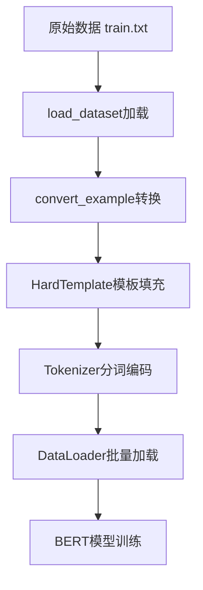

## 1 项目背景介绍

### 1. 项目背景

#### 1.1 行业应用场景

随着AI技术在新零售行业的广泛应用，**智能推荐系统**通过分析用户购买历史、浏览行为及偏好，实现个性化商品推荐，显著提升用户满意度和销量。

#### 1.2 技术挑战

电商平台用户评论蕴含丰富语义信息：

- ✅ 弥补评分稀疏性问题
- ✅ 提升推荐系统可解释性
- ⚠️ **核心挑战**：标注数据缺乏导致过拟合

**项目目标**：基于BERT+PET方法实现用户评论文本的准确分类，为商品推荐和服务优化提供决策支持。


### 2. 技术方案选型

#### 2.1 传统深度学习方法

- Text-CNN、Text-RNN
- BERT全量微调

**局限性**：依赖大量标注数据，小样本场景易过拟合

#### 2.2 Prompt-Tuning高效微调

💡 **核心优势**：在较少样本下即可达到媲美传统方法的性能

本项目采用两种Prompt-Tuning实现：

- **BERT + PET**（硬模板）
- **BERT + P-Tuning**（软模板）


## 2 基于BERT+PET方式文本分类介绍

### 1. PET技术详解

#### 1.1 核心思想

将分类任务转换为与MLM（Masked Language Model）一致的完形填空任务，通过人工定义模板释放预训练模型知识潜力。

#### 1.2 实现示例


| 任务类型 | 原始文本               | PET模板                   | 标签词映射          |
| :------- | :--------------------- | :------------------------ | :------------------ |
| 情感分类 | 这家店真不错，值得推荐 | `[MASK]`满意              | 不→差评，很→好评    |
| 新闻分类 | 中国女排再夺冠！       | 下面是`[MASK] [MASK]`新闻 | 体育/财经/时政/军事 |

**实现过程**：将模板与原始文本拼接后输入预训练模型，模型预测`[MASK]`位置词汇，通过标签词映射得到最终分类结果。

#### 1.3 技术特点

| 维度     | 说明                                                         |
| :------- | :----------------------------------------------------------- |
| **优点** | • 人工模板释放预训练模型潜力 • 不引入随机初始化参数，避免过拟合 • 较少样本即可媲美多样本传统微调 |
| **缺点** | • 人工模板稳定性差，准确率波动可达20个百分点 • 模板表示无法全局优化 |

> **模板表示无法全局优化**”是指：
>
> 在 PET中，**人工设计的模板（Prompt）是静态的**，一旦确定就无法在训练过程中**像模型参数那样通过梯度下降进行端到端优化**。
>
> 📌 举个例子：
>
> | 模板类型               | 模板内容                              | 是否可优化                   |
> | :--------------------- | :------------------------------------ | :--------------------------- |
> | **PET（硬模板）**      | `“这家店真不错，[MASK]满意。”`        | ❌ 模板固定，无法随着训练调整 |
> | **P-Tuning（软模板）** | `[P1][P2][P3]满意。`（P为可学习向量） | ✅ 模板可随训练全局优化       |
>
> ⚠️ 带来的问题：
>
> - 模板好坏**依赖人工经验**，可能不是最优；
> - 不同模板性能差距大（**准确率可差近20个百分点**）；
> - 无法根据数据分布**自动调整**提示形式。
>
> ---


### 2. 环境配置

#### 2.1 依赖包清单

```bash
pip install torch
pip install transformers==4.22.1
pip install datasets==2.4.0
pip install evaluate==0.2.2
pip install matplotlib==3.6.0
pip install rich==12.5.1
pip install scikit-learn==1.1.2
pip install requests==2.28.1
```

💡 **版本兼容性提示**：transformers 4.22.1 与datasets模块高度兼容，建议严格遵循此版本


### 3. 项目架构

#### 3.1 整体流程

1. **数据层**：电商平台用户评论数据集
2. **处理层**：数据预处理与PET模板构建
3. **模型层**：BERT预训练模型 + Prompt-Tuning + 模型评估
4. **应用层**：评论分类与推荐决策（上线）

#### 3.2 代码结构

```
📦 project/
├── data/                 # 数据集
├── models/              # 模型定义
├── utils/               # 工具函数
├── train.py             # 训练脚本
├── evaluate.py          # 评估脚本
└── config.py            # 配置参数
```

⚠️ **关键提示**：模板设计是项目成功的核心，建议准备3-5套模板进行对比实验


## 3 BERT+PET方式数据预处理

### 1. 数据集结构总览

项目数据存储于 `/prompt_tasks/PET/data/` 目录，包含以下四种核心文件：

| 文件类型 | 文件名           | 数据量   | 文件说明                         | 格式示例                         |
| :------- | :--------------- | :------- | :------------------------------- | :------------------------------- |
| 训练集   | `train.txt`      | 63条     | 用于模型微调，每行包含标签和评论 | `水果\t脆脆的，甜味可以...`      |
| 验证集   | `dev.txt`        | 590条    | 用于模型评估，格式同训练集       | `书籍\t"一点都不好笑,很失望..."` |
| 提示模板 | `prompt.txt`     | 1行      | 定义文本与[MASK]的位置关系       | `这是一条{MASK}评论：{textA}。`  |
| 标签映射 | `verbalizer.txt` | 10个类别 | 真实标签到预测词的映射关系       | `水果\t苹果,香蕉,橘子`           |


### 2. 数据文件详解

#### 2.1 训练集与验证集

💡 **格式规范**：每行数据使用Tab键(`\t`)分隔，**左侧为类别标签**，**右侧为用户评论文本**。

**训练集样本示例**：

```tex
水果	脆脆的，甜味可以，可能时间有点长了，水分不是很足。
平板	华为机器肯定不错，但第一次碰上京东最糟糕的服务...
书籍	为什么不认真的检查一下，发这么一本脏脏的书给顾客呢！
衣服	手感不错，用料也很好，不知道水洗后怎样...
```

**验证集样本示例**：

```text
书籍	"一点都不好笑,很失望,内容也不是很实用"
衣服	完全是一条旧裤子。
手机	相机质量不错，如果阳光充足，可以和数码相机媲美...
```


#### 2.2 提示模板文件(prompt.txt)

**核心作用**：定义人工模板，将输入文本与[MASK]标记组织成自然语言句式。

**模板语法**：

- `{textA}`：评论内容占位符
- `{MASK}`：掩码位置占位符（可配置多个）

**文件内容**：

```text
这是一条{MASK}评论：{textA}。
```

⚠️ **自定义模板示例**：如需增加参数，可按`{参数名}`格式扩展

```text
{textA}和{textB}是{MASK}同的意思。
```


#### 2.3 标签映射文件(verbalizer.txt)

**核心作用**：建立**真实标签**到**标签预测词**的映射，提升掩码预测的语义流畅性。

**一对一映射**（当前项目使用）：

```text
电脑	电脑
水果	水果
平板	平板
衣服	衣服
酒店	酒店
洗浴	洗浴
书籍	书籍
蒙牛	蒙牛
手机	手机
电器	电器
```

**一对多映射**（高级用法）：

```text
体育	足球,篮球,网球,棒球,乒乓,体育
水果	苹果,香蕉,橘子,水果
```

> 一般需要将真实标签放到标签预测词中

💡 **设计原理**：将抽象标签（如"体育"）映射为具体词汇（如"足球"），使BERT在掩码预测时更容易生成符合语境的结果。


### 3. 配置管理实现 (`pet_config.py`)

配置类集中管理所有静态参数，便于统一维护和云环境适配。

```python
# coding:utf-8
import torch

# ==================== 项目配置类 ====================
class ProjectConfig(object):
    def __init__(self):
        # 设备配置：自动检测GPU可用性，优先使用CUDA加速训练
        self.device = 'cuda:0' if torch.cuda.is_available() else 'cpu'
        
        # 预训练模型路径：使用本地缓存的bert-base-chinese权重
        self.pre_model = '/home/prompt_project/bert-base-chinese'
        
        # 数据文件路径：训练集、验证集、模板、标签映射
        self.train_path = '/home/prompt_project/PET/data/train.txt'
        self.dev_path = '/home/prompt_project/PET/data/dev.txt'
        self.prompt_file = '/home/prompt_project/PET/data/prompt.txt'
        self.verbalizer = '/home/prompt_project/PET/data/verbalizer.txt'
        
        # 序列长度限制：单条文本最大token数（含模板）
        self.max_seq_len = 512
        
        # 批次大小：每批处理的样本数量
        self.batch_size = 8
        
        # 学习率：AdamW优化器的初始学习率
        self.learning_rate = 5e-5
        
        # 权重衰减：L2正则化系数，用于抑制过拟合
        self.weight_decay = 0
        
        # 预热比例：学习率预热的步数占总步数的比例
        self.warmup_ratio = 0.06
        
        # 标签长度：最大标签词数量（需与verbalizer匹配）
        self.max_label_len = 2
        
        # 训练轮次：完整遍历数据集的次数
        self.epochs = 50
        
        # 日志步数：每N步打印一次训练日志
        self.logging_steps = 10
        
        # 验证步数：每N步进行一次模型验证
        self.valid_steps = 20
        
        # 模型保存目录：训练过程中检查点的存储路径
        self.save_dir = '/home/prompt_project/PET/checkpoints'

# ==================== 配置测试入口 ====================
if __name__ == '__main__':
    pc = ProjectConfig()
    print(f"提示模板路径: {pc.prompt_file}")
    print(f"预训练模型路径: {pc.pre_model}")
```


### 4 模板处理模块 (`template.py`)

#### 4.1 模块功能

`HardTemplate`类负责解析人工模板，并将输入数据转换为符合BERT输入格式的token序列。

#### 4.2 核心代码实现

```python
# -*- coding:utf-8 -*-
from rich import print          # 终端彩色输出，提升调试体验
from transformers import AutoTokenizer
import numpy as np
import sys
sys.path.append('..')           # 添加父目录到路径，便于导入配置
from pet_config import *        # 导入项目配置


# ==================== 硬模板解析器类 ====================
class HardTemplate(object):
    """
    硬模板类：人工定义句子和[MASK]之间的位置关系
    负责将{'textA': 'xxx', 'MASK': '[MASK]'}转换为BERT可接收的格式
    """
    
    def __init__(self, prompt: str):
        """
        初始化模板解析器
        
        Args:
            prompt (str): 模板字符串，例："这是一条{MASK}评论：{textA}。"
        """
        self.prompt = prompt
        self.inputs_list = []               # 模板拆解后的部分列表
        self.custom_tokens = set(['MASK'])  # 自定义占位符集合
        self.prompt_analysis()              # 自动解析模板结构
    
    def prompt_analysis(self):
        """
        解析prompt模板，提取固定文本和占位符
        
        示例分析：
          输入："这是一条{MASK}评论：{textA}。"
          输出：
            - inputs_list: ['这','是','一','条','MASK','评','论','：','textA','。']
            - custom_tokens: {'textA', 'MASK'}
        """
        idx = 0
        while idx < len(self.prompt):
            str_part = ''
            
            # 处理普通字符：直接添加到列表
            if self.prompt[idx] not in ['{', '}']:
                self.inputs_list.append(self.prompt[idx])
            
            # 处理占位符开始符 '{'
            if self.prompt[idx] == '{':
                idx += 1
                # 持续读取直到遇到结束符 '}'
                while self.prompt[idx] != '}':
                    str_part += self.prompt[idx]
                    idx += 1
            
            # 处理占位符结束符 '}'（异常情况）
            elif self.prompt[idx] == '}':
                raise ValueError("未匹配的括号 '}'，请检查prompt模板格式")
            
            # 保存解析出的占位符
            if str_part:
                self.inputs_list.append(str_part)
                self.custom_tokens.add(str_part)  # 记录所有自定义占位符
            
            idx += 1
    
    def __call__(self, 
                 inputs_dict: dict, 
                 tokenizer, 
                 mask_length: int,
                 max_seq_len=512):
        """
        将输入样本转换为符合模板的格式
        
        Args:
            inputs_dict (dict): 参数字典，例如 {'textA': '手机很好', 'MASK': '[MASK]'}
            tokenizer: BERT分词器
            mask_length (int): MASK token的数量（与max_label_len一致）
            max_seq_len (int): 最大序列长度
        
        Returns:
            dict: 包含编码后的所有必要字段
                - text: token字符串
                - input_ids: token ID序列
                - token_type_ids: 段落ID序列
                - attention_mask: 注意力掩码
                - mask_position: MASK位置索引列表
        """
        # 初始化输出字典
        outputs = {
            'text': '',
            'input_ids': [],
            'token_type_ids': [],
            'attention_mask': [],
            'mask_position': []
        }
        
        # 根据模板结构拼接字符串
        str_formated = ''
        for value in self.inputs_list:
            if value in self.custom_tokens:
                if value == 'MASK':
                    # MASK占位符：重复mask_length次
                    str_formated += inputs_dict[value] * mask_length
                else:
                    # 其他占位符：直接替换
                    str_formated += inputs_dict[value]
            else:
                # 普通文本：直接追加
                str_formated += value
        
        # 使用BERT分词器进行编码
        encoded = tokenizer(
            text=str_formated,
            truncation=True,          # 超长截断
            max_length=max_seq_len,   # 最大长度限制
            padding='max_length'      # 不足则padding到max_length
        )
        
        # 提取编码结果
        outputs['input_ids'] = encoded["input_ids"]
        outputs['token_type_ids'] = encoded["token_type_ids"]
        outputs['attention_mask'] = encoded["attention_mask"]
        
        # 将input_ids转换回token文本（用于调试）
        token_list = tokenizer.convert_ids_to_tokens(encoded['input_ids'])
        outputs['text'] = ''.join(token_list)
        
        # 定位MASK位置：找到所有[MASK] token的索引
        mask_token_id = tokenizer.convert_tokens_to_ids(['[MASK]'])[0]
        # list == scalar 返回单一 False 值  np.array(list) == scalar 返回逐元素比较的布尔数组
        condition = np.array(outputs['input_ids']) == mask_token_id
        # np.where(condition)回满足条件的元素索引; p.where(condition, x, y)条件为真时取 x 对应元素，否则取 y 对应元素
        mask_position = np.where(condition)[0].tolist()
        outputs['mask_position'] = mask_position
        
        return outputs


# ==================== 单元测试 ====================
if __name__ == '__main__':
    pc = ProjectConfig()
    tokenizer = AutoTokenizer.from_pretrained(pc.pre_model)
    
    # 实例化模板处理器
    hard_template = HardTemplate(prompt='这是一条{MASK}评论：{textA}。')
    
    # 测试模板解析结果
    print("模板结构:", hard_template.inputs_list)
    print("占位符集合:", hard_template.custom_tokens)
    
    # 测试模板转换功能
    result = hard_template(
        inputs_dict={'textA': '包装不错，苹果挺甜的，个头也大。', 'MASK': '[MASK]'},
        tokenizer=tokenizer,
        max_seq_len=30,
        mask_length=2
    )
    print("转换结果:", result)
    
    # 测试token与ID互转
    print("ID→Token:", tokenizer.convert_ids_to_tokens([3819, 3352]))
    print("Token→ID:", tokenizer.convert_tokens_to_ids(['水', '果']))
```

> 💡拓展：
>
> **Tokenizer 方法对比详解**
>
> 在 Hugging Face Transformers 库中，Tokenizer 的这几个方法代表了不同阶段的 API 设计。以下是详细对比：
>
> #### 核心对比速览表
>
> | 方法                      | 功能             | 输入          | 返回值                       | 批处理     | 推荐度     |
> | :------------------------ | :--------------- | :------------ | :--------------------------- | :--------- | :--------- |
> | **`tokenizer()`**         | 全能编码（推荐） | 文本/列表/对  | `BatchEncoding` 对象         | ✅ 原生支持 | ⭐⭐⭐⭐⭐      |
> | **`encode()`**            | 基础编码         | 仅文本        | `List[int]`                  | ❌ 不支持   | ⭐⭐ 已过时  |
> | **`encode_plus()`**       | 增强编码         | 单文本/文本对 | `Dict[str, List[int]]`       | ❌ 不支持   | ⭐⭐⭐ 已废弃 |
> | **`batch_encode_plus()`** | 批量编码         | 文本列表      | `Dict[str, List[List[int]]]` | ✅ 支持     | ⭐⭐⭐ 已废弃 |
>
> 
>
> ### 1. `tokenizer()` —— **现代首选方法**
>
> 这是 Tokenizer 的 **`__call__`** 方法，是当前最强大、最灵活的统一接口。
>
> #### 特点
>
> - **自动识别**输入是单条还是批量
> - **支持所有功能**：填充、截断、返回张量等
> - **返回** `BatchEncoding` 对象（继承自 dict，但支持 Tensor 转换）
>
> #### 示例
>
> ```python
> # 单文本
> tokenizer("Hello world", padding=True, truncation=True)
> 
> # 批量
> tokenizer(["Hello", "World"], padding=True)
> 
> # 文本对
> tokenizer("First", "Second", padding=True, return_tensors="pt")
> ```
>
> #### 返回值结构
>
> ```python
> {
>   'input_ids': [[101, 7592, 2088, 102]],
>   'attention_mask': [[1, 1, 1, 1]],
>   'token_type_ids': [[0, 0, 0, 0]]  # 仅部分模型需要
> }
> ```
>
> 
>
> ### 2. `encode()` —— **基础单文本编码**
>
> #### 特点
>
> - **最古老**的 API，功能最简单
> - **只返回** `input_ids` 列表
> - **不支持**：填充、截断、注意力掩码等
> - **仅处理单个文本**（不批量，不处理文本对）
>
> #### 示例
>
> ```python
> ids = tokenizer.encode("Hello world")
> # 输出: [101, 7592, 2088, 102]
> ```
>
> #### 缺点
>
> - 无法处理现代模型需要的 `attention_mask` 和 `token_type_ids`
> - 已被 `tokenizer()` 完全替代
>
> 
>
> ### 3. `encode_plus()` —— **增强单条编码**
>
> #### 特点
>
> - **支持文本对**输入（如问答、NLI 任务）
> - **返回**字典，包含 `input_ids`, `attention_mask`, `token_type_ids`
> - **不支持批量**，一次只能处理一对文本
> - **已被 `tokenizer()` 替代**
>
> #### 示例
>
> ```python
> encoded = tokenizer.encode_plus(
>     "Where is Paris?",
>     "Paris is in France.",
>     padding=True,
>     truncation=True
> )
> ```
>
> #### 返回值
>
> ```python
> {
>   'input_ids': [101, ...],
>   'attention_mask': [1, ...],
>   'token_type_ids': [0, 0, ..., 1, 1, ...]
> }
> ```
>
> 
>
> ### 4. `batch_encode_plus()` —— **批量处理（旧版）**
>
> #### 特点
>
> - **专门用于批量**处理文本列表
> - 功能与 `encode_plus()` 相同，但接受列表输入
> - **已被 `tokenizer()` 替代**
>
> #### 示例
>
> ```python
> batch_encoded = tokenizer.batch_encode_plus(
>     ["Hello", "World", "Transformers"],
>     padding=True,
>     truncation=True
> )
> ```
>
> #### 返回值
>
> ```python
> {
>   'input_ids': [[101, ...], [101, ...], [101, ...]],
>   'attention_mask': [[1, ...], [1, ...], [1, ...]],
>   # ...
> }
> ```
>
> ### 总结与最佳实践
>
> #### 现代开发建议
>
> 1. **始终使用 `tokenizer()`**：统一接口，自动处理各种场景
> 2. **避免使用 `encode()`**：功能缺失，不适合现代模型
> 3. **避免使用 `\*_plus()` 方法**：已被官方标记为 legacy，未来可能移除
>
> #### 典型使用模式
>
> ```python
> # 通用模式
> tokenizer(
>     text,                    # 文本或列表
>     text_pair=None,          # 第二段文本（可选）
>     padding=True,            # 填充
>     truncation=True,         # 截断
>     max_length=512,          # 最大长度
>     return_tensors="pt",     # 返回 PyTorch 张量
>     add_special_tokens=True  # 添加 [CLS], [SEP] 等特殊标记
> )
> ```
>
> **一句话总结**：忘掉 `encode` 和 `*_plus`，拥抱万能的 `tokenizer()` 吧！
>
> ---


### 5. 数据预处理模块 (`data_preprocess.py`)

#### 5.1 模块功能

`convert_example()`函数批量将原始文本转换为模型训练所需的tensor格式，是数据管道的核心。

#### 5.2 核心代码实现

```python
# -*- coding:utf-8 -*-
from template import *              # 导入模板处理类
from rich import print               # 终端彩色输出
from datasets import load_dataset    # HuggingFace datasets库
from functools import partial        # 函数参数固定工具
from pet_config import *             # 项目配置

# ==================== 数据转换函数 ====================
def convert_example(
    examples: dict,
    tokenizer,
    max_seq_len: int,
    max_label_len: int,
    hard_template: HardTemplate,
    train_mode=True,        # 训练模式（含标签）或推理模式
    return_tensor=False     # 返回tensor或numpy数组
) -> dict:
    """
    批量转换样本数据为模型输入格式
    
    Args:
        examples (dict): 原始数据样本，格式 {'text': ['标签\t内容', ...]}
        tokenizer: BERT分词器
        max_seq_len (int): 最大序列长度（含模板）
        max_label_len (int): 标签最大token长度
        hard_template (HardTemplate): 模板处理器实例
        train_mode (bool): 是否为训练模式（训练模式需要解析标签）
        return_tensor (bool): 是否返回PyTorch tensor
    
    Returns:
        dict: 转换后的批量数据
            - input_ids: token ID矩阵
            - token_type_ids: 段落ID矩阵
            - attention_mask: 注意力掩码矩阵
            - mask_positions: MASK位置矩阵
            - mask_labels: 标签token ID矩阵（仅训练模式）
    """
    # 初始化批量输出字典
    tokenized_output = {
        'input_ids': [],
        'token_type_ids': [],
        'attention_mask': [],
        'mask_positions': [],
        'mask_labels': []
    }

    # 遍历每个样本
    for i, example in enumerate(examples['text']):
        # 训练模式：解析标签和内容
        if train_mode:
            # 按Tab分割标签和内容
            label, content = example.strip().split('\t')
        else:
            # 推理模式：仅处理内容
            content = example.strip()

        # 构建模板输入字典
        inputs_dict = {
            'textA': content,       # 评论内容
            'MASK': '[MASK]'        # MASK占位符
        }
        
        # 调用模板处理器进行转换
        encoded_inputs = hard_template(
            inputs_dict=inputs_dict,
            tokenizer=tokenizer,
            max_seq_len=max_seq_len,
            mask_length=max_label_len    # MASK长度=标签长度
        )
        
        # 收集转换结果
        tokenized_output['input_ids'].append(encoded_inputs["input_ids"])
        tokenized_output['token_type_ids'].append(encoded_inputs["token_type_ids"])
        tokenized_output['attention_mask'].append(encoded_inputs["attention_mask"])
        tokenized_output['mask_positions'].append(encoded_inputs["mask_position"])

        # 训练模式：处理标签
        if train_mode:
            # 对标签进行分词
            label_encoded = tokenizer(text=[label])['input_ids'][0][1:-1]  # 去掉[CLS]和[SEP]
            
            # 截断或填充到固定长度
            label_encoded = label_encoded[:max_label_len]
            add_pad = [tokenizer.pad_token_id] * (max_label_len - len(label_encoded))
            label_encoded = label_encoded + add_pad
            
            tokenized_output['mask_labels'].append(label_encoded)

    # 统一数据类型：tensor或numpy
    for k, v in tokenized_output.items():
        if return_tensor:
            tokenized_output[k] = torch.LongTensor(v)
        else:
            tokenized_output[k] = np.array(v)

    return tokenized_output


# ==================== 单元测试 ====================
if __name__ == '__main__':
    pc = ProjectConfig()
    
    # 加载训练数据集
    train_dataset = load_dataset('text', data_files=pc.train_path)
    
    # 实例化模板处理器
    tokenizer = AutoTokenizer.from_pretrained(pc.pre_model)
    hard_template = HardTemplate(prompt='这是一条{MASK}评论：{textA}。')
    
    # 创建偏函数：固定常用参数
    convert_func = partial(
        convert_example,
        tokenizer=tokenizer,
        hard_template=hard_template,
        max_seq_len=30,
        max_label_len=2
    )
    
    # 应用转换函数到整个数据集
    dataset = train_dataset.map(convert_func, batched=True) # batched=True启用批处理模式，datasets.Dataset.map 会将多个样本作为一个批次传递给处理函数处理函数一次接收一批数据而非单个样本
    
    # 打印第一个样本验证
    for value in dataset['train']:
        print("转换后样本:", value)
        print("序列长度:", len(value['input_ids']))
        break
```


### 6. 数据加载模块 (`data_loader.py`)

#### 6.1 模块功能

整合所有组件，创建PyTorch的DataLoader，支持训练集和验证集的批量加载。

#### 6.2 核心代码实现

```python
# coding:utf-8
from torch.utils.data import DataLoader    # PyTorch数据加载器
from transformers import default_data_collator  # 默认批处理函数
from data_preprocess import *              # 导入数据转换函数
from pet_config import *                   # 项目配置

# 实例化全局配置和分词器
pc = ProjectConfig()
tokenizer = AutoTokenizer.from_pretrained(pc.pre_model)


# ==================== 数据加载器工厂函数 ====================
def get_data():
    """
    创建训练集和验证集的数据加载器
    
    Returns:
        tuple: (train_dataloader, dev_dataloader)
    """
    # 1. 读取并解析提示模板
    prompt = open(pc.prompt_file, 'r', encoding='utf8').readlines()[0].strip()
    hard_template = HardTemplate(prompt=prompt)  # 创建模板处理器
    
    # 2. 加载原始数据集
    # 使用HuggingFace datasets库，自动读取文本文件
    dataset = load_dataset(
        'text', 
        data_files={
            'train': pc.train_path,  # 训练集
            'dev': pc.dev_path        # 验证集
        }
    )
    
    # 3. 创建偏函数：固定转换函数的所有静态参数
    new_func = partial(
        convert_example,
        tokenizer=tokenizer,
        hard_template=hard_template,
        max_seq_len=pc.max_seq_len,
        max_label_len=pc.max_label_len
    )
    
    # 4. 应用转换函数到数据集（批处理模式）
    dataset = dataset.map(new_func, batched=True)
    
    # 5. 提取训练集和验证集
    train_dataset = dataset["train"]
    dev_dataset = dataset["dev"]
    
    # 6. 创建PyTorch DataLoader
    # 训练集：随机打乱(shuffle=True)
    train_dataloader = DataLoader(
        train_dataset,
        shuffle=True,                       # 训练时打乱数据，增强随机性
        collate_fn=default_data_collator,   # 自动处理变长序列
        batch_size=pc.batch_size            # 批次大小
    )
    
    # 验证集：不打乱顺序
    dev_dataloader = DataLoader(
        dev_dataset,
        collate_fn=default_data_collator,
        batch_size=pc.batch_size
    )
    
    return train_dataloader, dev_dataloader


# ==================== 单元测试 ====================
if __name__ == '__main__':
    # 测试数据加载器
    train_dataloader, dev_dataloader = get_data()
    
    print(f"训练集批次数: {len(train_dataloader)}")
    print(f"验证集批次数: {len(dev_dataloader)}")
    
    # 打印第一个批次的数据
    for i, batch in enumerate(train_dataloader):
        print(f"批次索引: {i}")
        print("批次数据:", batch)
        print("数据类型:", batch['input_ids'].dtype)
        break
```


### 7. 执行顺序与数据流向


