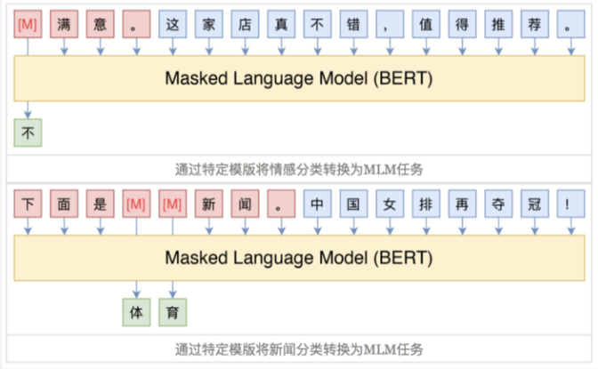
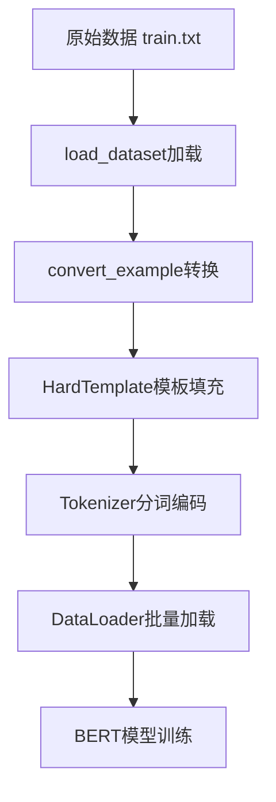

## 1 项目背景介绍

### 1. 项目背景

#### 1.1 行业应用场景

随着AI技术在新零售行业的广泛应用，**智能推荐系统**通过分析用户购买历史、浏览行为及偏好，实现个性化商品推荐，显著提升用户满意度和销量。

#### 1.2 技术挑战

电商平台用户评论蕴含丰富语义信息：

- ✅ 弥补评分稀疏性问题
- ✅ 提升推荐系统可解释性
- ⚠️ **核心挑战**：标注数据缺乏导致过拟合

**项目目标**：基于BERT+PET方法实现用户评论文本的准确分类，为商品推荐和服务优化提供决策支持。


### 2. 技术方案选型

#### 2.1 传统深度学习方法

- Text-CNN、Text-RNN
- BERT全量微调

**局限性**：依赖大量标注数据，小样本场景易过拟合

#### 2.2 Prompt-Tuning高效微调

💡 **核心优势**：在较少样本下即可达到媲美传统方法的性能

本项目采用两种Prompt-Tuning实现：

- **BERT + PET**（硬模板）
- **BERT + P-Tuning**（软模板）


## 2 基于BERT+PET方式文本分类介绍

### 1. PET技术详解

#### 1.1 核心思想

将分类任务转换为与MLM（Masked Language Model）一致的完形填空任务，通过人工定义模板释放预训练模型知识潜力。

#### 1.2 实现示例



| 任务类型 | 原始文本               | PET模板                   | 标签词映射          |
| :------- | :--------------------- | :------------------------ | :------------------ |
| 情感分类 | 这家店真不错，值得推荐 | `[MASK]`满意              | 不→差评，很→好评    |
| 新闻分类 | 中国女排再夺冠！       | 下面是`[MASK] [MASK]`新闻 | 体育/财经/时政/军事 |

**实现过程**：将模板与原始文本拼接后输入预训练模型，模型预测`[MASK]`位置词汇，通过标签词映射得到最终分类结果。

#### 1.3 技术特点

| 维度     | 说明                                                         |
| :------- | :----------------------------------------------------------- |
| **优点** | • 人工模板释放预训练模型潜力 • 不引入随机初始化参数，避免过拟合 • 较少样本即可媲美多样本传统微调 |
| **缺点** | • 人工模板稳定性差，准确率波动可达20个百分点 • 模板表示无法全局优化 |

> **模板表示无法全局优化**”是指：
>
> 在 PET中，**人工设计的模板（Prompt）是静态的**，一旦确定就无法在训练过程中**像模型参数那样通过梯度下降进行端到端优化**。
>
> 📌 举个例子：
>
> | 模板类型               | 模板内容                              | 是否可优化                   |
> | :--------------------- | :------------------------------------ | :--------------------------- |
> | **PET（硬模板）**      | `“这家店真不错，[MASK]满意。”`        | ❌ 模板固定，无法随着训练调整 |
> | **P-Tuning（软模板）** | `[P1][P2][P3]满意。`（P为可学习向量） | ✅ 模板可随训练全局优化       |
>
> ⚠️ 带来的问题：
>
> - 模板好坏**依赖人工经验**，可能不是最优；
> - 不同模板性能差距大（**准确率可差近20个百分点**）；
> - 无法根据数据分布**自动调整**提示形式。
>
> ---


### 2. 环境配置

#### 2.1 依赖包清单

```bash
pip install torch
pip install transformers==4.22.1
pip install datasets==2.4.0
pip install evaluate==0.2.2
pip install matplotlib==3.6.0
pip install rich==12.5.1
pip install scikit-learn==1.1.2
pip install requests==2.28.1
```

💡 **版本兼容性提示**：transformers 4.22.1 与datasets模块高度兼容，建议严格遵循此版本


### 3. 项目架构

#### 3.1 整体流程

1. **数据层**：电商平台用户评论数据集
2. **处理层**：数据预处理与PET模板构建
3. **模型层**：BERT预训练模型 + Prompt-Tuning + 模型评估
4. **应用层**：评论分类与推荐决策（上线）

#### 3.2 代码结构

```
📦 project/
├── data/                 # 数据集
├── models/              # 模型定义
├── utils/               # 工具函数
├── train.py             # 训练脚本
├── evaluate.py          # 评估脚本
└── config.py            # 配置参数
```

⚠️ **关键提示**：模板设计是项目成功的核心，建议准备3-5套模板进行对比实验


## 3 BERT+PET方式数据预处理

### 1. 数据集结构总览

项目数据存储于 `/prompt_tasks/PET/data/` 目录，包含以下四种核心文件：

| 文件类型 | 文件名           | 数据量   | 文件说明                         | 格式示例                         |
| :------- | :--------------- | :------- | :------------------------------- | :------------------------------- |
| 训练集   | `train.txt`      | 63条     | 用于模型微调，每行包含标签和评论 | `水果\t脆脆的，甜味可以...`      |
| 验证集   | `dev.txt`        | 590条    | 用于模型评估，格式同训练集       | `书籍\t"一点都不好笑,很失望..."` |
| 提示模板 | `prompt.txt`     | 1行      | 定义文本与[MASK]的位置关系       | `这是一条{MASK}评论：{textA}。`  |
| 标签映射 | `verbalizer.txt` | 10个类别 | 真实标签到预测词的映射关系       | `水果\t苹果,香蕉,橘子`           |


### 2. 数据文件详解

#### 2.1 训练集与验证集

💡 **格式规范**：每行数据使用Tab键(`\t`)分隔，**左侧为类别标签**，**右侧为用户评论文本**。

**训练集样本示例**：

```tex
水果	脆脆的，甜味可以，可能时间有点长了，水分不是很足。
平板	华为机器肯定不错，但第一次碰上京东最糟糕的服务...
书籍	为什么不认真的检查一下，发这么一本脏脏的书给顾客呢！
衣服	手感不错，用料也很好，不知道水洗后怎样...
```

**验证集样本示例**：

```text
书籍	"一点都不好笑,很失望,内容也不是很实用"
衣服	完全是一条旧裤子。
手机	相机质量不错，如果阳光充足，可以和数码相机媲美...
```


#### 2.2 提示模板文件(prompt.txt)

**核心作用**：定义人工模板，将输入文本与[MASK]标记组织成自然语言句式。

**模板语法**：

- `{textA}`：评论内容占位符
- `{MASK}`：掩码位置占位符（可配置多个）

**文件内容**：

```text
这是一条{MASK}评论：{textA}。
```

⚠️ **自定义模板示例**：如需增加参数，可按`{参数名}`格式扩展

```text
{textA}和{textB}是{MASK}同的意思。
```


#### 2.3 标签映射文件(verbalizer.txt)

**核心作用**：建立**真实标签**到**标签预测词**的映射，提升掩码预测的语义流畅性。

**一对一映射**（当前项目使用）：

```text
电脑	电脑
水果	水果
平板	平板
衣服	衣服
酒店	酒店
洗浴	洗浴
书籍	书籍
蒙牛	蒙牛
手机	手机
电器	电器
```

**一对多映射**（高级用法）：

```text
体育	足球,篮球,网球,棒球,乒乓,体育
水果	苹果,香蕉,橘子,水果
```

> 一般需要将真实标签放到标签预测词中

💡 **设计原理**：将抽象标签（如"体育"）映射为具体词汇（如"足球"），使BERT在掩码预测时更容易生成符合语境的结果。


### 3. 配置管理实现 (`pet_config.py`)

配置类集中管理所有静态参数，便于统一维护和云环境适配。

```python
# coding:utf-8
import torch

# ==================== 项目配置类 ====================
class ProjectConfig(object):
    def __init__(self):
        # 设备配置：自动检测GPU可用性，优先使用CUDA加速训练
        self.device = 'cuda:0' if torch.cuda.is_available() else 'cpu'
        
        # 预训练模型路径：使用本地缓存的bert-base-chinese权重
        self.pre_model = '/home/prompt_project/bert-base-chinese'
        
        # 数据文件路径：训练集、验证集、模板、标签映射
        self.train_path = '/home/prompt_project/PET/data/train.txt'
        self.dev_path = '/home/prompt_project/PET/data/dev.txt'
        self.prompt_file = '/home/prompt_project/PET/data/prompt.txt'
        self.verbalizer = '/home/prompt_project/PET/data/verbalizer.txt'
        
        # 序列长度限制：单条文本最大token数（含模板）
        self.max_seq_len = 512
        
        # 批次大小：每批处理的样本数量
        self.batch_size = 8
        
        # 学习率：AdamW优化器的初始学习率
        self.learning_rate = 5e-5
        
        # 权重衰减：L2正则化系数，用于抑制过拟合
        self.weight_decay = 0
        
        # 预热比例：学习率预热的步数占总步数的比例
        self.warmup_ratio = 0.06
        
        # 标签长度：最大标签词数量（需与verbalizer匹配）
        self.max_label_len = 2
        
        # 训练轮次：完整遍历数据集的次数
        self.epochs = 50
        
        # 日志步数：每N步打印一次训练日志
        self.logging_steps = 10
        
        # 验证步数：每N步进行一次模型验证
        self.valid_steps = 20
        
        # 模型保存目录：训练过程中检查点的存储路径
        self.save_dir = '/home/prompt_project/PET/checkpoints'

# ==================== 配置测试入口 ====================
if __name__ == '__main__':
    pc = ProjectConfig()
    print(f"提示模板路径: {pc.prompt_file}")
    print(f"预训练模型路径: {pc.pre_model}")
```


### 4. 模板处理模块 (`template.py`)

#### 4.1 模块功能

`HardTemplate`类负责解析人工模板，并将输入数据转换为符合BERT输入格式的token序列。

#### 4.2 核心代码实现

```python
# -*- coding:utf-8 -*-
from rich import print          # 终端彩色输出，提升调试体验
from transformers import AutoTokenizer
import numpy as np
import sys
sys.path.append('..')           # 添加父目录到路径，便于导入配置
from pet_config import *        # 导入项目配置


# ==================== 硬模板解析器类 ====================
class HardTemplate(object):
    """
    硬模板类：人工定义句子和[MASK]之间的位置关系
    负责将{'textA': 'xxx', 'MASK': '[MASK]'}转换为BERT可接收的格式
    """
    
    def __init__(self, prompt: str):
        """
        初始化模板解析器
        
        Args:
            prompt (str): 模板字符串，例："这是一条{MASK}评论：{textA}。"
        """
        self.prompt = prompt
        self.inputs_list = []               # 模板拆解后的部分列表
        self.custom_tokens = set(['MASK'])  # 自定义占位符集合
        self.prompt_analysis()              # 自动解析模板结构
    
    def prompt_analysis(self):
        """
        解析prompt模板，提取固定文本和占位符
        
        示例分析：
          输入："这是一条{MASK}评论：{textA}。"
          输出：
            - inputs_list: ['这','是','一','条','MASK','评','论','：','textA','。']
            - custom_tokens: {'textA', 'MASK'}
        """
        idx = 0
        while idx < len(self.prompt):
            str_part = ''
            
            # 处理普通字符：直接添加到列表
            if self.prompt[idx] not in ['{', '}']:
                self.inputs_list.append(self.prompt[idx])
            
            # 处理占位符开始符 '{'
            if self.prompt[idx] == '{':
                idx += 1
                # 持续读取直到遇到结束符 '}'
                while self.prompt[idx] != '}':
                    str_part += self.prompt[idx]
                    idx += 1
            
            # 处理占位符结束符 '}'（异常情况）
            elif self.prompt[idx] == '}':
                raise ValueError("未匹配的括号 '}'，请检查prompt模板格式")
            
            # 保存解析出的占位符
            if str_part:
                self.inputs_list.append(str_part)
                self.custom_tokens.add(str_part)  # 记录所有自定义占位符
            
            idx += 1
    
    def __call__(self, 
                 inputs_dict: dict, 
                 tokenizer, 
                 mask_length: int,
                 max_seq_len=512):
        """
        将输入样本转换为符合模板的格式
        
        Args:
            inputs_dict (dict): 参数字典，例如 {'textA': '手机很好', 'MASK': '[MASK]'}
            tokenizer: BERT分词器
            mask_length (int): MASK token的数量（与max_label_len一致）
            max_seq_len (int): 最大序列长度
        
        Returns:
            dict: 包含编码后的所有必要字段
                - text: token字符串
                - input_ids: token ID序列
                - token_type_ids: 段落ID序列
                - attention_mask: 注意力掩码
                - mask_position: MASK位置索引列表
        """
        # 初始化输出字典
        outputs = {
            'text': '',
            'input_ids': [],
            'token_type_ids': [],
            'attention_mask': [],
            'mask_position': []
        }
        
        # 根据模板结构拼接字符串
        str_formated = ''
        for value in self.inputs_list:
            if value in self.custom_tokens:
                if value == 'MASK':
                    # MASK占位符：重复mask_length次
                    str_formated += inputs_dict[value] * mask_length
                else:
                    # 其他占位符：直接替换
                    str_formated += inputs_dict[value]
            else:
                # 普通文本：直接追加
                str_formated += value
        
        # 使用BERT分词器进行编码
        encoded = tokenizer(
            text=str_formated,
            truncation=True,          # 超长截断
            max_length=max_seq_len,   # 最大长度限制
            padding='max_length'      # 不足则padding到max_length
        )
        
        # 提取编码结果
        outputs['input_ids'] = encoded["input_ids"]
        outputs['token_type_ids'] = encoded["token_type_ids"]
        outputs['attention_mask'] = encoded["attention_mask"]
        
        # 将input_ids转换回token文本（用于调试）
        token_list = tokenizer.convert_ids_to_tokens(encoded['input_ids'])
        outputs['text'] = ''.join(token_list)
        
        # 定位MASK位置：找到所有[MASK] token的索引
        mask_token_id = tokenizer.convert_tokens_to_ids(['[MASK]'])[0]
        # list == scalar 返回单一 False 值  np.array(list) == scalar 返回逐元素比较的布尔数组
        condition = np.array(outputs['input_ids']) == mask_token_id
        # np.where(condition)回满足条件的元素索引; p.where(condition, x, y)条件为真时取 x 对应元素，否则取 y 对应元素
        mask_position = np.where(condition)[0].tolist()
        outputs['mask_position'] = mask_position
        
        return outputs


# ==================== 单元测试 ====================
if __name__ == '__main__':
    pc = ProjectConfig()
    tokenizer = AutoTokenizer.from_pretrained(pc.pre_model)
    
    # 实例化模板处理器
    hard_template = HardTemplate(prompt='这是一条{MASK}评论：{textA}。')
    
    # 测试模板解析结果
    print("模板结构:", hard_template.inputs_list)
    print("占位符集合:", hard_template.custom_tokens)
    
    # 测试模板转换功能
    result = hard_template(
        inputs_dict={'textA': '包装不错，苹果挺甜的，个头也大。', 'MASK': '[MASK]'},
        tokenizer=tokenizer,
        max_seq_len=30,
        mask_length=2
    )
    print("转换结果:", result)
    
    # 测试token与ID互转
    print("ID→Token:", tokenizer.convert_ids_to_tokens([3819, 3352]))
    print("Token→ID:", tokenizer.convert_tokens_to_ids(['水', '果']))
```

> 💡拓展：
>
> **Tokenizer 方法对比详解**
>
> 在 Hugging Face Transformers 库中，Tokenizer 的这几个方法代表了不同阶段的 API 设计。以下是详细对比：
>
> #### 核心对比速览表
>
> | 方法                      | 功能             | 输入          | 返回值                       | 批处理     | 推荐度     |
> | :------------------------ | :--------------- | :------------ | :--------------------------- | :--------- | :--------- |
> | **`tokenizer()`**         | 全能编码（推荐） | 文本/列表/对  | `BatchEncoding` 对象         | ✅ 原生支持 | ⭐⭐⭐⭐⭐      |
> | **`encode()`**            | 基础编码         | 仅文本        | `List[int]`                  | ❌ 不支持   | ⭐⭐ 已过时  |
> | **`encode_plus()`**       | 增强编码         | 单文本/文本对 | `Dict[str, List[int]]`       | ❌ 不支持   | ⭐⭐⭐ 已废弃 |
> | **`batch_encode_plus()`** | 批量编码         | 文本列表      | `Dict[str, List[List[int]]]` | ✅ 支持     | ⭐⭐⭐ 已废弃 |
>
> 
>
> ### 1. `tokenizer()` —— **现代首选方法**
>
> 这是 Tokenizer 的 **`__call__`** 方法，是当前最强大、最灵活的统一接口。
>
> #### 特点
>
> - **自动识别**输入是单条还是批量
> - **支持所有功能**：填充、截断、返回张量等
> - **返回** `BatchEncoding` 对象（继承自 dict，但支持 Tensor 转换）
>
> #### 示例
>
> ```python
> # 单文本
> tokenizer("Hello world", padding=True, truncation=True)
> 
> # 批量
> tokenizer(["Hello", "World"], padding=True)
> 
> # 文本对
> tokenizer("First", "Second", padding=True, return_tensors="pt")
> ```
>
> #### 返回值结构
>
> ```python
> {
>   'input_ids': [[101, 7592, 2088, 102]],
>   'attention_mask': [[1, 1, 1, 1]],
>   'token_type_ids': [[0, 0, 0, 0]]  # 仅部分模型需要
> }
> ```
>
> 
>
> ### 2. `encode()` —— **基础单文本编码**
>
> #### 特点
>
> - **最古老**的 API，功能最简单
> - **只返回** `input_ids` 列表
> - **不支持**：填充、截断、注意力掩码等
> - **仅处理单个文本**（不批量，不处理文本对）
>
> #### 示例
>
> ```python
> ids = tokenizer.encode("Hello world")
> # 输出: [101, 7592, 2088, 102]
> ```
>
> #### 缺点
>
> - 无法处理现代模型需要的 `attention_mask` 和 `token_type_ids`
> - 已被 `tokenizer()` 完全替代
>
> 
>
> ### 3. `encode_plus()` —— **增强单条编码**
>
> #### 特点
>
> - **支持文本对**输入（如问答、NLI 任务）
> - **返回**字典，包含 `input_ids`, `attention_mask`, `token_type_ids`
> - **不支持批量**，一次只能处理一对文本
> - **已被 `tokenizer()` 替代**
>
> #### 示例
>
> ```python
> encoded = tokenizer.encode_plus(
>     "Where is Paris?",
>     "Paris is in France.",
>     padding=True,
>     truncation=True
> )
> ```
>
> #### 返回值
>
> ```python
> {
>   'input_ids': [101, ...],
>   'attention_mask': [1, ...],
>   'token_type_ids': [0, 0, ..., 1, 1, ...]
> }
> ```
>
> 
>
> ### 4. `batch_encode_plus()` —— **批量处理（旧版）**
>
> #### 特点
>
> - **专门用于批量**处理文本列表
> - 功能与 `encode_plus()` 相同，但接受列表输入
> - **已被 `tokenizer()` 替代**
>
> #### 示例
>
> ```python
> batch_encoded = tokenizer.batch_encode_plus(
>     ["Hello", "World", "Transformers"],
>     padding=True,
>     truncation=True
> )
> ```
>
> #### 返回值
>
> ```python
> {
>   'input_ids': [[101, ...], [101, ...], [101, ...]],
>   'attention_mask': [[1, ...], [1, ...], [1, ...]],
>   # ...
> }
> ```
>
> ### 总结与最佳实践
>
> #### 现代开发建议
>
> 1. **始终使用 `tokenizer()`**：统一接口，自动处理各种场景
> 2. **避免使用 `encode()`**：功能缺失，不适合现代模型
> 3. **避免使用 `\*_plus()` 方法**：已被官方标记为 legacy，未来可能移除
>
> #### 典型使用模式
>
> ```python
> # 通用模式
> tokenizer(
>     text,                    # 文本或列表
>     text_pair=None,          # 第二段文本（可选）
>     padding=True,            # 填充
>     truncation=True,         # 截断
>     max_length=512,          # 最大长度
>     return_tensors="pt",     # 返回 PyTorch 张量
>     add_special_tokens=True  # 添加 [CLS], [SEP] 等特殊标记
> )
> ```
>
> **一句话总结**：忘掉 `encode` 和 `*_plus`，拥抱万能的 `tokenizer()` 吧！
>
> ---


### 5. 数据预处理模块 (`data_preprocess.py`)

#### 5.1 模块功能

`convert_example()`函数批量将原始文本转换为模型训练所需的tensor格式，是数据管道的核心。

#### 5.2 核心代码实现

```python
# -*- coding:utf-8 -*-
from template import *              # 导入模板处理类
from rich import print               # 终端彩色输出
from datasets import load_dataset    # HuggingFace datasets库
from functools import partial        # 函数参数固定工具
from pet_config import *             # 项目配置

# ==================== 数据转换函数 ====================
def convert_example(
    examples: dict,
    tokenizer,
    max_seq_len: int,
    max_label_len: int,
    hard_template: HardTemplate,
    train_mode=True,        # 训练模式（含标签）或推理模式
    return_tensor=False     # 返回tensor或numpy数组
) -> dict:
    """
    批量转换样本数据为模型输入格式
    
    Args:
        examples (dict): 原始数据样本，格式 {'text': ['标签\t内容', ...]}
        tokenizer: BERT分词器
        max_seq_len (int): 最大序列长度（含模板）
        max_label_len (int): 标签最大token长度
        hard_template (HardTemplate): 模板处理器实例
        train_mode (bool): 是否为训练模式（训练模式需要解析标签）
        return_tensor (bool): 是否返回PyTorch tensor
    
    Returns:
        dict: 转换后的批量数据
            - input_ids: token ID矩阵
            - token_type_ids: 段落ID矩阵
            - attention_mask: 注意力掩码矩阵
            - mask_positions: MASK位置矩阵
            - mask_labels: 标签token ID矩阵（仅训练模式）
    """
    # 初始化批量输出字典
    tokenized_output = {
        'input_ids': [],
        'token_type_ids': [],
        'attention_mask': [],
        'mask_positions': [],
        'mask_labels': []
    }

    # 遍历每个样本
    for i, example in enumerate(examples['text']):
        # 训练模式：解析标签和内容
        if train_mode:
            # 按Tab分割标签和内容
            label, content = example.strip().split('\t')
        else:
            # 推理模式：仅处理内容
            content = example.strip()

        # 构建模板输入字典
        inputs_dict = {
            'textA': content,       # 评论内容
            'MASK': '[MASK]'        # MASK占位符
        }
        
        # 调用模板处理器进行转换
        encoded_inputs = hard_template(
            inputs_dict=inputs_dict,
            tokenizer=tokenizer,
            max_seq_len=max_seq_len,
            mask_length=max_label_len    # MASK长度=标签长度
        )
        
        # 收集转换结果
        tokenized_output['input_ids'].append(encoded_inputs["input_ids"])
        tokenized_output['token_type_ids'].append(encoded_inputs["token_type_ids"])
        tokenized_output['attention_mask'].append(encoded_inputs["attention_mask"])
        tokenized_output['mask_positions'].append(encoded_inputs["mask_position"])

        # 训练模式：处理标签
        if train_mode:
            # 对标签进行分词
            label_encoded = tokenizer(text=[label])['input_ids'][0][1:-1]  # 去掉[CLS]和[SEP]
            
            # 截断或填充到固定长度
            label_encoded = label_encoded[:max_label_len]
            add_pad = [tokenizer.pad_token_id] * (max_label_len - len(label_encoded))
            label_encoded = label_encoded + add_pad
            
            tokenized_output['mask_labels'].append(label_encoded)

    # 统一数据类型：tensor或numpy
    for k, v in tokenized_output.items():
        if return_tensor:
            tokenized_output[k] = torch.LongTensor(v)
        else:
            tokenized_output[k] = np.array(v)

    return tokenized_output


# ==================== 单元测试 ====================
if __name__ == '__main__':
    pc = ProjectConfig()
    
    # 加载训练数据集
    train_dataset = load_dataset('text', data_files=pc.train_path)
    
    # 实例化模板处理器
    tokenizer = AutoTokenizer.from_pretrained(pc.pre_model)
    hard_template = HardTemplate(prompt='这是一条{MASK}评论：{textA}。')
    
    # 创建偏函数：固定常用参数
    convert_func = partial(
        convert_example,
        tokenizer=tokenizer,
        hard_template=hard_template,
        max_seq_len=30,
        max_label_len=2
    )
    
    # 应用转换函数到整个数据集
    dataset = train_dataset.map(convert_func, batched=True) # batched=True启用批处理模式，datasets.Dataset.map 会将多个样本作为一个批次传递给处理函数处理函数一次接收一批数据而非单个样本
    
    # 打印第一个样本验证
    for value in dataset['train']:
        print("转换后样本:", value)
        print("序列长度:", len(value['input_ids']))
        break
```


### 6. 数据加载模块 (`data_loader.py`)

#### 6.1 模块功能

整合所有组件，创建PyTorch的DataLoader，支持训练集和验证集的批量加载。

#### 6.2 核心代码实现

```python
# coding:utf-8
from torch.utils.data import DataLoader    # PyTorch数据加载器
from transformers import default_data_collator  # 默认批处理函数
from data_preprocess import *              # 导入数据转换函数
from pet_config import *                   # 项目配置

# 实例化全局配置和分词器
pc = ProjectConfig()
tokenizer = AutoTokenizer.from_pretrained(pc.pre_model)


# ==================== 数据加载器工厂函数 ====================
def get_data():
    """
    创建训练集和验证集的数据加载器
    
    Returns:
        tuple: (train_dataloader, dev_dataloader)
    """
    # 1. 读取并解析提示模板
    prompt = open(pc.prompt_file, 'r', encoding='utf8').readlines()[0].strip()
    hard_template = HardTemplate(prompt=prompt)  # 创建模板处理器
    
    # 2. 加载原始数据集
    # 使用HuggingFace datasets库，自动读取文本文件
    dataset = load_dataset(
        'text', 
        data_files={
            'train': pc.train_path,  # 训练集
            'dev': pc.dev_path        # 验证集
        }
    )
    
    # 3. 创建偏函数：固定转换函数的所有静态参数
    new_func = partial(
        convert_example,
        tokenizer=tokenizer,
        hard_template=hard_template,
        max_seq_len=pc.max_seq_len,
        max_label_len=pc.max_label_len
    )
    
    # 4. 应用转换函数到数据集（批处理模式）
    dataset = dataset.map(new_func, batched=True)
    
    # 5. 提取训练集和验证集
    train_dataset = dataset["train"]
    dev_dataset = dataset["dev"]
    
    # 6. 创建PyTorch DataLoader
    # 训练集：随机打乱(shuffle=True)
    train_dataloader = DataLoader(
        train_dataset,
        shuffle=True,                       # 训练时打乱数据，增强随机性
        collate_fn=default_data_collator,   # 自动处理变长序列
        batch_size=pc.batch_size            # 批次大小
    )
    
    # 验证集：不打乱顺序
    dev_dataloader = DataLoader(
        dev_dataset,
        collate_fn=default_data_collator,
        batch_size=pc.batch_size
    )
    
    return train_dataloader, dev_dataloader


# ==================== 单元测试 ====================
if __name__ == '__main__':
    # 测试数据加载器
    train_dataloader, dev_dataloader = get_data()
    
    print(f"训练集批次数: {len(train_dataloader)}")
    print(f"验证集批次数: {len(dev_dataloader)}")
    
    # 打印第一个批次的数据
    for i, batch in enumerate(train_dataloader):
        print(f"批次索引: {i}")
        print("批次数据:", batch)
        print("数据类型:", batch['input_ids'].dtype)
        break
```


### 7. 执行顺序与数据流向




## 4 BERT+PET方式模型代码实现与训练

**模型搭建流程**

本项目基于BERT预训练模型实现PET微调，整体流程分为三个核心阶段：

1. **实现模型工具类函数** - 提供训练/验证/预测所需的基础功能
2. **实现模型训练与验证函数** - 完成模型优化与效果评估
3. **实现模型预测函数** - 支持对新数据的推理预测


### 1. 实现模型工具类函数

> **代码路径**：`/Users/**/PycharmProjects/llm/prompt_tasks/PET/utils`

工具类函数存放在`utils`目录下，包含三个核心Python脚本：

| 脚本文件          | 核心功能             | 主要作用                                         |
| :---------------- | :------------------- | :----------------------------------------------- |
| `verbalizer.py`   | 标签映射管理         | 实现主标签与子标签的相互转换与映射               |
| `common_utils.py` | 损失计算与Logits转换 | 定义MLM损失函数和Logits到ID的转换逻辑            |
| `metirc_utils.py` | 评估指标计算         | 实现多分类场景下的Acc、Precision、Recall、F1计算 |

#### 1.1 verbalizer.py

##### 功能概述

`Verbalizer`类是PET方法的核心组件，负责**主标签**（如"体育"）与**子标签**（如"篮球、足球、网球"）之间的双向映射管理。当模型在[MASK]位置预测出子标签时，Verbalizer能自动将其映射回主标签，实现细粒度监督。

##### 完整代码实现

```python
# -*- coding:utf-8 -*-
import os
from typing import Union, List
from pet_config import *
pc = ProjectConfig()

class Verbalizer(object):
    """
    Verbalizer类：用于管理主标签到子标签集合的映射关系
    核心功能：
    1. 加载verbalizer文件构建标签字典
    2. 主标签 → 子标签查询
    3. 子标签 → 主标签反向映射（支持模糊匹配）
    """
    
    def __init__(self, verbalizer_file: str, tokenizer, max_label_len: int):
        """
        初始化Verbalizer实例
        
        Args:
            verbalizer_file (str): verbalizer映射文件路径，格式为 "主标签\t子标签1,子标签2,..."
            tokenizer: 分词器，用于文本和token_id之间的双向转换
            max_label_len (int): 子标签的最大token长度，超长截断，不足补[PAD]
        """
        self.tokenizer = tokenizer
        self.label_dict = sfel_dict(verbalizer_file)  # 加载标签映射字典
        self.max_label_len = max_label_len  # 标签长度约束

    def load_label_dict(self, verbalizer_file: str):
        """
        从本地文件读取并构建verbalizer字典
        
        文件格式示例：
        体育	篮球,足球,网球,排球
        酒店	宾馆,旅馆,旅店,酒店
        
        Returns:
            dict: 标签映射字典，格式 -> {'体育': ['篮球', '足球', ...], '酒店': ['宾馆', ...]}
        """
        label_dict = {}
        with open(verbalizer_file, 'r', encoding='utf8') as f:
            for line in f.readlines():
                # 按tab分割主标签和子标签字符串
                label, sub_labels = line.strip().split('\t')
                # 去重并转换为列表
                label_dict[label] = list(set(sub_labels.split(',')))
        return label_dict

    def find_sub_labels(self, label: Union[list, str]):
        """
        根据主标签查询对应的所有子标签及其token_id
        
        Args:
            label: 主标签，支持两种格式
                   - 文本型: '体育'
                   - token_id列表: [860, 5509]（会自动转换为文本）
                   
        Returns:
            dict: 包含子标签和对应token_id的字典
                  {
                    'sub_labels': ['足球', '网球'],
                    'token_ids': [[6639, 4413], [5381, 4413]]
                  }
        """
        # 如果传入的是token_id列表，先转换为文本
        if type(label) == list:
            # 移除填充token
            while self.tokenizer.pad_token_id in label:
                label.remove(self.tokenizer.pad_token_id)
            # token_id → token → 文本拼接
            label = ''.join(self.tokenizer.convert_ids_to_tokens(label))
        
        # 校验标签是否存在
        if label not in self.label_dict:
            raise ValueError(f'Label Error: "{label}" not in label_dict')
        
        sub_labels = self.label_dict[label]
        ret = {'sub_labels': sub_labels}
        
        # 获取所有子标签的token_id（去掉[CLS]和[SEP]）
        token_ids = [_id[1:-1] for _id in self.tokenizer(sub_labels)['input_ids']]
        
        # 截断或补齐到统一长度
        for i in range(len(token_ids)):
            token_ids[i] = token_ids[i][:self.max_label_len]  # 超长截断
            if len(token_ids[i]) < self.max_label_len:
                # 不足长度用[PAD]填充
                token_ids[i] = token_ids[i] + [self.tokenizer.pad_token_id] * (self.max_label_len - len(token_ids[i]))
        
        ret['token_ids'] = token_ids
        return ret

    def batch_find_sub_labels(self, label: List[Union[list, str]]):
        """
        批量查询主标签对应的子标签（find_sub_labels的批处理版本）
        
        Args:
            label: 主标签列表，格式如 [['体育'], ['电脑']] 或 ['体育', '电脑']
            
        Returns:
            list: 每个标签对应的子标签信息列表
        """
        return [self.find_sub_labels(l) for l in label]

    def get_common_sub_str(self, str1: str, str2: str):
        """
        动态规划求解两个字符串的最大公共子串
        用途：当模型预测的子标签不存在时，用于模糊匹配最接近的主标签
        
        示例:
            str1: "abcd"
            str2: "abadbcdba"
            返回: ("bcd", )
        """
        lstr1, lstr2 = len(str1), len(str2)
        # 构建DP矩阵，维度为(lstr1+1) × (lstr2+1)
        record = [[0 for i in range(lstr2 + 1)] for j in range(lstr1 + 1)]
        p = 0  # 最长子串在str1中的结束位置
        maxNum = 0  # 最长子串长度

        for i in range(lstr1):
            for j in range(lstr2):
                if str1[i] == str2[j]:
                    record[i+1][j+1] = record[i][j] + 1
                    if record[i+1][j+1] > maxNum:
                        maxNum = record[i+1][j+1]
                        p = i + 1
        
        # 返回最长公共子串及其长度
        return str1[p-maxNum:p], maxNum

    def hard_mapping(self, sub_label: str):
        """
        强匹配函数：当模型生成的子标签不存在于verbalizer时，
        通过最大公共子串算法找到重合度最高的主标签
        
        Args:
            sub_label: 模型预测出的子标签（可能不在映射表中）
            
        Returns:
            str: 匹配到的主标签
        """
        label, max_overlap_str = '', 0
        for main_label, sub_labels in self.label_dict.items():
            overlap_num = 0
            # 累加当前子标签与所有子标签的公共子串长度
            for s_label in sub_labels:
                overlap_num += self.get_common_sub_str(sub_label, s_label)[1]
            # 选择总重叠度最高的主标签
            if overlap_num >= max_overlap_str:
                max_overlap_str = overlap_num
                label = main_label
        return label

    def find_main_label(self, sub_label: Union[list, str], hard_mapping=True):
        """
        逆向查询：根据子标签找到对应的主标签
        
        Args:
            sub_label: 子标签，支持文本或token_id列表
            hard_mapping: 是否启用模糊匹配（当精确匹配失败时）
            
        Returns:
            dict: 主标签信息
                  {
                    'label': '水果',
                    'token_ids': [3717, 3362]
                  }
        """
        # token_id列表 → 文本转换
        if type(sub_label) == list:
            pad_token_id = self.tokenizer.pad_token_id
            while pad_token_id in sub_label:
                sub_label.remove(pad_token_id)
            sub_label = ''.join(self.tokenizer.convert_ids_to_tokens(sub_label))
        
        main_label = '无'  # 默认值
        # 精确匹配：检查子标签是否在对应主标签的子标签列表中
        for label, s_labels in self.label_dict.items():
            if sub_label in s_labels:
                main_label = label
                break
        
        # 精确匹配失败且启用模糊匹配时
        if main_label == '无' and hard_mapping:
            main_label = self.hard_mapping(sub_label)
        
        # 返回主标签及其token_id（去掉[CLS]和[SEP]）
        ret = {
            'label': main_label,
            'token_ids': self.tokenizer(main_label)['input_ids'][1:-1]
        }
        return ret

    def batch_find_main_label(self, sub_label: List[Union[list, str]], hard_mapping=True):
        """
        批量逆向查询：查找多个子标签对应的主标签
        
        Args:
            sub_label: 子标签列表，如 ['苹果', ...] 或 [[5741, 3362], ...]
            
        Returns:
            list: 每个子标签对应的主标签信息列表
        """
        return [self.find_main_label(l, hard_mapping) for l in sub_label]


if __name__ == '__main__':
    # 测试代码
    from rich import print
    from transformers import AutoTokenizer

    tokenizer = AutoTokenizer.from_pretrained(pc.pre_model)
    verbalizer = Verbalizer(
        verbalizer_file=pc.verbalizer,
        tokenizer=tokenizer,
        max_label_len=2
    )
    print(verbalizer.label_dict)
    
    # 批量查询测试
    label = [[4510, 5554], [6132, 3302]]
    ret = verbalizer.batch_find_sub_labels(label)
    print(ret)
```


#### 1.2 common_utils.py

##### 功能概述

该脚本包含两个核心工具函数，支撑PET训练过程中的关键计算：

1. `mlm_loss()`：计算[MASK]位置预测结果与真实子标签之间的交叉熵损失
2. `convert_logits_to_ids()`：将模型输出的logits转换为最可能的token_id

##### 完整代码实现

```python
# coding:utf-8
import torch
from rich import print

def mlm_loss(logits, mask_positions, sub_mask_labels, 
             cross_entropy_criterion, device):
    """
    计算指定[MASK]位置的预测logits与真实子标签之间的交叉熵损失
    
    核心逻辑：
    - 从完整logits中提取[MASK]位置的logits
    - 支持每个样本有多个子标签（如'体育'对应['篮球','足球','网球']）
    - 计算预测logits与所有子标签的平均交叉熵损失
    
    Args:
        logits: 模型原始输出 → (batch, seq_len, vocab_size)
        mask_positions: [MASK] token的位置 → (batch, mask_label_num)
        sub_mask_labels: 子标签token_id列表（因每个主标签的子标签数量不同，故为变长列表）
                        示例：[
                            [[2398, 3352]],  # 样本1有1个子标签
                            [[2398, 3352], [3819, 3861]]  # 样本2有2个子标签
                        ]
        cross_entropy_criterion: 交叉熵损失计算器
        device: 设备类型('cpu'或'cuda')
        
    Returns:
        torch.tensor: 批平均交叉熵损失
    """
    batch_size, seq_len, vocab_size = logits.size()
    loss = None

    # 遍历批次中每个样本
    for single_value in zip(logits, sub_mask_labels, mask_positions):
        single_logits = single_value[0]  # 当前样本的所有位置logits
        single_sub_mask_labels = single_value[1]  # 当前样本的子标签集合
        single_mask_positions = single_value[2]  # 当前样本的[MASK]位置
        
        # 提取[MASK]位置的logits → (mask_label_num, vocab_size)
        single_mask_logits = single_logits[single_mask_positions]
        
        # 将[MASK] logits按子标签数量复制
        # 形状变化：(mask_label_num, vocab_size) → (sub_label_num, mask_label_num, vocab_size)
        single_mask_logits = single_mask_logits.repeat(len(single_sub_mask_labels), 1, 1)
        
        # reshape为2D张量：(sub_label_num * mask_label_num, vocab_size)
        single_mask_logits = single_mask_logits.reshape(-1, vocab_size)
        
        # 构建目标标签张量 → (sub_label_num, mask_label_num)
        single_sub_mask_labels = torch.LongTensor(single_sub_mask_labels).to(device)
        
        # reshape为1D张量：(sub_label_num * mask_label_num)
        single_sub_mask_labels = single_sub_mask_labels.reshape(-1, 1).squeeze()
        
        # 处理单token情况下的维度缺失
        if not single_sub_mask_labels.size():
            single_sub_mask_labels = single_sub_mask_labels.unsqueeze(dim=0)
        
        # 计算当前样本的平均损失
        cur_loss = cross_entropy_criterion(single_mask_logits, single_sub_mask_labels)
        cur_loss = cur_loss / len(single_sub_mask_labels)  # 按子标签数量归一化
        
        # 累加批次损失
        if not loss:
            loss = cur_loss
        else:
            loss += cur_loss
    
    # 返回批次平均损失
    loss = loss / batch_size
    return loss


def convert_logits_to_ids(logits: torch.tensor, mask_positions: torch.tensor):
    """
    将模型输出的logits转换为[MASK]位置最可能的token_id
    
    用途：在预测阶段，将词表概率分布转换为具体的token预测
    
    Args:
        logits: 模型输出 → (batch, seq_len, vocab_size)
        mask_positions: [MASK] token位置 → (batch, mask_label_num)
        
    Returns:
        torch.LongTensor: [MASK]位置的预测token_id → (batch, mask_label_num)
    """
    label_length = mask_positions.size()[1]  # 标签长度（如2表示[MASK][MASK]）
    batch_size, seq_len, vocab_size = logits.size()
    
    # 构建flatten后的位置索引
    mask_positions_after_reshaped = []
    
    for batch, mask_pos in enumerate(mask_positions.detach().cpu().numpy().tolist()):
        for pos in mask_pos:
            # 将2D位置(batch, pos)转换为1D索引(batch * seq_len + pos)
            mask_positions_after_reshaped.append(batch * seq_len + pos)
    
    # 将logits reshape为2D：(batch_size * seq_len, vocab_size)
    logits = logits.reshape(batch_size * seq_len, -1)
    
    # 提取[MASK]位置的logits → (batch * label_num, vocab_size)
    mask_logits = logits[mask_positions_after_reshaped]
    
    # 在词表维度上取argmax → (batch * label_num)
    predict_tokens = mask_logits.argmax(dim=-1)
    
    # reshape回2D：(batch, label_num)
    predict_tokens = predict_tokens.reshape(-1, label_length)
    
    return predict_tokens
```


#### 1.3 metirc_utils.py

##### 功能概述

`ClassEvaluator`类提供多分类场景下的完整评估指标计算，支持：

- 全局指标：Accuracy、Precision、Recall、F1
- 类别级指标：每个类别的Precision、Recall、F1
- 支持子标签拼接成完整标签的评估模式

##### 完整代码实现

```python
from typing import List
import numpy as np
import pandas as pd
from sklearn.metrics import accuracy_score, precision_score, f1_score
from sklearn.metrics import recall_score, confusion_matrix

class ClassEvaluator(object):
    """
    多分类评估器：累积批次预测结果，计算全局和类别级指标
    """
    
    def __init__(self):
        """初始化空列表用于累积真实标签和预测结果"""
        self.goldens = []  # 真实标签列表
        self.predictions = []  # 预测标签列表

    def add_batch(self, pred_batch: List[List], gold_batch: List[List]):
        """
        添加一个batch的预测结果和真实标签
        
        Args:
            pred_batch: 模型预测标签列表
                       示例：[['体', '育'], ['财', '经']]
            gold_batch: 真实标签列表，格式同pred_batch
        """
        assert len(pred_batch) == len(gold_batch)

        # 处理子标签情况：将多个子标签拼接为完整标签
        # 例如将['体', '育']转换为'体育'
        if type(gold_batch[0]) in [list, tuple]:
            pred_batch = [','.join([str(e) for e in ele]) for ele in pred_batch]
            gold_batch = [','.join([str(e) for e in ele]) for ele in gold_batch]

        # 累积到全局列表
        self.goldens.extend(gold_batch)
        self.predictions.extend(pred_batch)

    def compute(self, round_num=2) -> dict:
        """
        计算累积数据的评估指标
        
        Args:
            round_num: 结果保留小数位数，默认2位
            
        Returns:
            dict: 完整的评估指标字典
                  {
                    'accuracy': 0.78,
                    'precision': 0.78,
                    'recall': 0.76,
                    'f1': 0.75,
                    'class_metrics': {
                        '书籍': {'precision': 0.97, 'recall': 0.82, 'f1': 0.89},
                        ...
                    }
                  }
        """
        # 获取所有类别
        classes, class_metrics, res = sorted(list(set(self.goldens) | set(self.predictions))), {}, {}
        
        # 计算全局指标（使用weighted平均以处理类别不平衡）
        res['accuracy'] = round(accuracy_score(self.goldens, self.predictions), round_num)
        res['precision'] = round(precision_score(self.goldens, self.predictions, average='weighted'), round_num)
        res['recall'] = round(recall_score(self.goldens, self.predictions, average='weighted'), round_num)
        res['f1'] = round(f1_score(self.goldens, self.predictions, average='weighted'), round_num)
        
        # 计算每个类别的指标（基于混淆矩阵）
        try:
            conf_matrix = np.array(confusion_matrix(self.goldens, self.predictions))  # shape: (n_class, n_class)
            assert conf_matrix.shape[0] == len(classes)
            
            for i in range(conf_matrix.shape[0]):
                # 当前类别的Precision（查准率）
                precision = 0 if sum(conf_matrix[:, i]) == 0 else conf_matrix[i, i] / sum(conf_matrix[:, i])
                
                # 当前类别的Recall（查全率）
                recall = 0 if sum(conf_matrix[i, :]) == 0 else conf_matrix[i, i] / sum(conf_matrix[i, :])
                
                # 当前类别的F1分数
                f1 = 0 if (precision + recall) == 0 else 2 * precision * recall / (precision + recall)
                
                class_metrics[classes[i]] = {
                    'precision': round(precision, round_num),
                    'recall': round(recall, round_num),
                    'f1': round(f1, round_num)
                }
            
            res['class_metrics'] = class_metrics
        except Exception as e:
            # 异常情况处理（如类别不匹配）
            print(f'[Warning] 计算类别指标时出错: {e}')
            print(f'-> 真实标签集合: {set(self.goldens)}')
            print(f'-> 预测标签集合: {set(self.predictions)}')
            print(f'-> 差异标签: {set(self.predictions) - set(self.goldens)}')
            res['class_metrics'] = {}
        
        return res

    def reset(self):
        """重置累积数据，开始新一轮评估"""
        self.goldens = []
        self.predictions = []
```


### 2. 实现模型训练与验证

#### 2.1 功能概述

`train.py`脚本整合所有组件，实现完整的训练与验证循环，包含：

- 模型加载与优化器配置
- 动态学习率调度
- 训练过程监控与日志输出
- 定期验证与最佳模型保存

#### 2.2 代码实现

```python
import os
import time
from transformers import AutoModelForMaskedLM, AutoTokenizer, get_scheduler
from pet_config import *
import sys
from utils.metirc_utils import ClassEvaluator
from utils.common_utils import *
from data_handle.data_loader import *
from utils.verbalizer import Verbalizer
from pet_config import *
pc = ProjectConfig()

def model2train():
    """
    主训练函数：加载模型、配置优化器、执行训练循环
    """
    # 加载预训练BERT模型和分词器
    model = AutoModelForMaskedLM.from_pretrained(pc.pre_model)
    tokenizer = AutoTokenizer.from_pretrained(pc.pre_model)
    
    # 初始化Verbalizer用于标签映射
    verbalizer = Verbalizer(
        verbalizer_file=pc.verbalizer,
        tokenizer=tokenizer,
        max_label_len=pc.max_label_len
    )

    # 配置参数分组：对bias和LayerNorm权重不应用权重衰减
    # 权重衰减可防止过拟合，但这些参数不影响模型平滑性
    no_decay = ["bias", "LayerNorm.weight"]
    optimizer_grouped_parameters = [
        {
            "params": [p for n, p in model.named_parameters() if not any(nd in n for nd in no_decay)],
            "weight_decay": pc.weight_decay,  # 应用权重衰减
        },
        {
            "params": [p for n, p in model.named_parameters() if any(nd in n for nd in no_decay)],
            "weight_decay": 0.0,  # 不应用权重衰减
        },
    ]
    
    # 初始化AdamW优化器
    optimizer = torch.optim.AdamW(optimizer_grouped_parameters, lr=pc.learning_rate)
    model.to(pc.device)

    # 加载训练和验证数据
    train_dataloader, dev_dataloader = get_data()

    # 计算总训练步数并配置学习率调度器
    num_update_steps_per_epoch = len(train_dataloader)
    max_train_steps = pc.epochs * num_update_steps_per_epoch
    warm_steps = int(pc.warmup_ratio * max_train_steps)  # 预热步数
    
    # 线性学习率调度：预热后线性衰减
    lr_scheduler = get_scheduler(
        name='linear',
        optimizer=optimizer,
        num_warmup_steps=warm_steps,
        num_training_steps=max_train_steps,
    )

    # 初始化训练状态
    loss_list = []
    tic_train = time.time()
    metric = ClassEvaluator()
    criterion = torch.nn.CrossEntropyLoss()
    global_step, best_f1 = 0, 0
    
    print('开始训练：')
    
    # 训练主循环
    for epoch in range(pc.epochs):
        for batch in train_dataloader:
            # 前向传播获取logits
            logits = model(
                input_ids=batch['input_ids'].to(pc.device),
                token_type_ids=batch['token_type_ids'].to(pc.device),
                attention_mask=batch['attention_mask'].to(pc.device)
            ).logits

            # 获取真实标签并转换为子标签token_id
            mask_labels = batch['mask_labels'].numpy().tolist()
            sub_labels = verbalizer.batch_find_sub_labels(mask_labels)
            sub_labels = [ele['token_ids'] for ele in sub_labels]

            # 计算MLM损失
            loss = mlm_loss(
                logits,
                batch['mask_positions'].to(pc.device),
                sub_labels,
                criterion,
                pc.device
            )
            
            # 反向传播与参数更新
            optimizer.zero_grad()
            loss.backward()
            optimizer.step()
            lr_scheduler.step()
            
            loss_list.append(float(loss.cpu().detach()))
            global_step += 1
            
            # 定期输出训练日志
            if global_step % pc.logging_steps == 0:
                time_diff = time.time() - tic_train
                loss_avg = sum(loss_list) / len(loss_list)
                print(f"global step {global_step}, epoch: {epoch}, loss: {loss_avg:.5f}, speed: {pc.logging_steps / time_diff:.2f} step/s")
                tic_train = time.time()

            # 定期验证并保存模型
            if global_step % pc.valid_steps == 0:
                cur_save_dir = os.path.join(pc.save_dir, f"model_{global_step}")
                os.makedirs(cur_save_dir, exist_ok=True)
                model.save_pretrained(cur_save_dir)
                tokenizer.save_pretrained(cur_save_dir)

                # 评估当前模型
                acc, precision, recall, f1, class_metrics = evaluate_model(
                    model, metric, dev_dataloader, tokenizer, verbalizer
                )

                print(f"Evaluation precision: {precision:.5f}, recall: {recall:.5f}, F1: {f1:.5f}")

                # 保存最佳模型（基于F1分数）
                if f1 > best_f1:
                    print(f"最佳F1性能已更新: {best_f1:.5f} --> {f1:.5f}")
                    print(f'各类别指标: {class_metrics}')
                    best_f1 = f1
                    
                    cur_save_dir = os.path.join(pc.save_dir, "model_best")
                    os.makedirs(cur_save_dir, exist_ok=True)
                    model.save_pretrained(cur_save_dir)
                    tokenizer.save_pretrained(cur_save_dir)
                
                tic_train = time.time()
    
    print('训练结束')


def evaluate_model(model, metric, data_loader, tokenizer, verbalizer):
    """
    模型评估函数：在验证集上计算各项指标
    
    Args:
        model: 待评估模型
        metric: 评估指标计算器
        data_loader: 验证数据加载器
        tokenizer: 分词器
        verbalizer: 标签映射器
        
    Returns:
        tuple: (accuracy, precision, recall, f1, class_metrics)
    """
    model.eval()  # 切换到评估模式
    metric.reset()

    with torch.no_grad():
        for step, batch in enumerate(data_loader):
            # 前向传播
            logits = model(
                input_ids=batch['input_ids'].to(pc.device),
                token_type_ids=batch['token_type_ids'].to(pc.device),
                attention_mask=batch['attention_mask'].to(pc.device)
            ).logits

            # 获取真实标签并处理[PAD] token
            mask_labels = batch['mask_labels'].numpy().tolist()
            for i in range(len(mask_labels)):
                while tokenizer.pad_token_id in mask_labels[i]:
                    mask_labels[i].remove(tokenizer.pad_token_id)
            
            # token_id转文本标签
            mask_labels = [''.join(tokenizer.convert_ids_to_tokens(t)) for t in mask_labels]

            # 模型预测：logits → token_id
            predictions = convert_logits_to_ids(
                logits,
                batch['mask_positions']
            ).cpu().numpy().tolist()

            # 子标签 → 主标签映射
            predictions = verbalizer.batch_find_main_label(predictions)
            predictions = [ele['label'] for ele in predictions]
            
            # 累积批次结果
            metric.add_batch(pred_batch=predictions, gold_batch=mask_labels)
    
    eval_metric = metric.compute()
    model.train()  # 切换回训练模式
    
    return (
        eval_metric['accuracy'],
        eval_metric['precision'],
        eval_metric['recall'],
        eval_metric['f1'],
        eval_metric['class_metrics']
    )
```

#### 2.3 执行训练

```bash
# 进入项目目录
cd /Users/**/PycharmProjects/llm/prompt_tasks/PET

# 启动训练
python train.py
```

#### 2.4 训练输出示例

```bash
global step 40, epoch: 4, loss: 0.62105, speed: 1.27 step/s
Evaluation precision: 0.78000, recall: 0.77000, F1: 0.76000
Each Class Metrics are: {
    '书籍': {'precision': 0.97, 'recall': 0.82, 'f1': 0.89},
    '平板': {'precision': 0.57, 'recall': 0.84, 'f1': 0.68},
    '手机': {'precision': 0.0, 'recall': 0.0, 'f1': 0},
    '水果': {'precision': 0.95, 'recall': 0.81, 'f1': 0.87},
    '洗浴': {'precision': 0.7, 'recall': 0.71, 'f1': 0.7},
    '电器': {'precision': 0.0, 'recall': 0.0, 'f1': 0},
    '电脑': {'precision': 0.86, 'recall': 0.38, 'f1': 0.52},
    '蒙牛': {'precision': 1.0, 'recall': 0.68, 'f1': 0.81},
    '衣服': {'precision': 0.71, 'recall': 0.91, 'f1': 0.79},
    '酒店': {'precision': 1.0, 'recall': 0.88, 'f1': 0.93}
}
...
global step 400, epoch: 49, loss: 0.06507, speed: 1.21 step/s
Evaluation precision: 0.78000, recall: 0.76000, F1: 0.75000
```

💡 **性能分析**：在仅使用60条样本的训练集上，模型在验证集上达到**78%精确率**。通过扩充训练数据至600条以上，指标可进一步提升。


## 三、实现模型预测函数

### 功能概述

`inference.py`脚本加载训练好的最佳模型，对新文本进行端到端预测，输出所属类别。

### 完整代码实现

Python

复制

```python
import time
from typing import List

import torch
from rich import print
from transformers import AutoTokenizer, AutoModelForMaskedLM
import sys
from utils.verbalizer import Verbalizer
from data_handle.template import HardTemplate
from data_handle.data_preprocess import convert_example
from utils.common_utils import convert_logits_to_ids

# 设备配置（支持MPS和CUDA）
device = 'mps:0'  # Apple Silicon GPU
# device='cuda:0'  # NVIDIA GPU

# 加载最佳模型
model_path = 'checkpoints/model_best'
tokenizer = AutoTokenizer.from_pretrained(model_path)
model = AutoModelForMaskedLM.from_pretrained(model_path)
model.to(device).eval()  # 设置为评估模式

# 初始化组件
max_label_len = 2
verbalizer = Verbalizer(
    verbalizer_file='data/verbalizer.txt',
    tokenizer=tokenizer,
    max_label_len=max_label_len
)

# 加载prompt模板
prompt = open('data/prompt.txt', 'r', encoding='utf8').readlines()[0].strip()
hard_template = HardTemplate(prompt=prompt)  # 模板转换器
print(f'Prompt is -> {prompt}')


def inference(contents: List[str]):
    """
    推理函数：输入原始文本，输出预测的类别标签
    
    Args:
        contents: 待分类的文本列表
        
    Returns:
        List[str]: 每个文本对应的类别标签
    """
    with torch.no_grad():
        start_time = time.time()
        
        # 数据预处理
        examples = {'text': contents}
        tokenized_output = convert_example(
            examples,
            tokenizer,
            hard_template=hard_template,
            max_seq_len=128,
            max_label_len=max_label_len,
            train_mode=False,  # 预测模式
            return_tensor=True
        )
        
        # 模型前向传播
        logits = model(
            input_ids=tokenized_output['input_ids'].to(device),
            token_type_ids=tokenized_output['token_type_ids'].to(device),
            attention_mask=tokenized_output['attention_mask'].to(device)
        ).logits
        
        # logits → token_id预测
        predictions = convert_logits_to_ids(
            logits,
            tokenized_output['mask_positions']
        ).cpu().numpy().tolist()
        
        # 子标签 → 主标签映射
        predictions = verbalizer.batch_find_main_label(predictions)
        predictions = [ele['label'] for ele in predictions]
        
        used = time.time() - start_time
        print(f'推理耗时: {used:.4f}s')
        return predictions


if __name__ == '__main__':
    # 测试样本
    contents = [
        '天台很好看，躺在躺椅上很悠闲，因为活动所以我觉得性价比还不错，适合一家出行，特别是去迪士尼也蛮近的，下次有机会肯定还会再来的，值得推荐',
        '环境，设施，很棒，周边配套设施齐全，前台小姐姐超级漂亮！酒店很赞，早餐不错，服务态度很好，前台美眉很漂亮。性价比超高的一家酒店。强烈推荐',
        "物流超快，隔天就到了，还没用，屯着出游的时候用的，听方便的，占地小",
        "福行市来到无早集市，因为是喜欢的面包店，所以跑来集市看看。第一眼就看到了，之前在微店买了小刘，这次买了老刘，还有一直喜欢的巧克力磅蛋糕。好奇老板为啥不做柠檬磅蛋糕了，微店一直都是买不到的状态。因为不爱碱水硬欧之类的，所以期待老板多来点其他小点，饼干一直也是大爱，那天好像也没看到",
        "服务很用心，房型也很舒服，小朋友很喜欢，下次去嘉定还会再选择。床铺柔软舒适，晚上休息很安逸，隔音效果不错赞，下次还会来"
    ]
    
    print("针对以下文本评论，预测所属类别：")
    results = inference(contents)
    
    # 格式化输出
    result_dict = dict(zip(contents, results))
    print("\n预测结果：")
    for text, label in result_dict.items():
        print(f"\n【文本】{text[:50]}...")
        print(f"【预测类别】{label}")
```

### 预测结果示例

JSON

复制

```json
{
    "天台很好看，躺在躺椅上很悠闲，因为活动所以我觉得性价比还不错...": "酒店",
    "环境，设施，很棒，周边配套设施齐全，前台小姐姐超级漂亮！...": "酒店",
    "物流超快，隔天就到了，还没用，屯着出游的时候用的，听方便的...": "平板",
    "福行市来到无早集市，因为是喜欢的面包店，所以跑来集市看看...": "水果",
    "服务很用心，房型也很舒服，小朋友很喜欢，下次去嘉定还会再选择...": "酒店"
}
```

⚠️ **注意**：实际预测结果中的"平板"分类可能存在误判，建议结合置信度分析或增加训练数据优化模型表现。

------

## 小节总结

表格

复制

| 核心模块            | 实现功能       | 关键技术点                         |
| :------------------ | :------------- | :--------------------------------- |
| **verbalizer.py**   | 标签映射管理   | 主-子标签双向映射、模糊匹配算法    |
| **common_utils.py** | 损失计算与推理 | MLM损失函数、Logits转token_id      |
| **metirc_utils.py** | 评估指标计算   | 全局与类别级指标、混淆矩阵分析     |
| **train.py**        | 训练与验证循环 | 动态学习率、最佳模型保存、定期评估 |
| **inference.py**    | 模型推理应用   | 端到端预测、结果格式化输出         |

💡 **最佳实践建议**：

1. **数据扩充**：当前60条样本达到78%准确率，扩充至600+条可显著提升性能
2. **超参调优**：尝试调整`max_label_len`、`learning_rate`、`warmup_ratio`等参数
3. **模板优化**：设计更优的prompt模板可提升模型理解能力
4. **错误分析**：定期分析bad case，针对性补充训练样本


