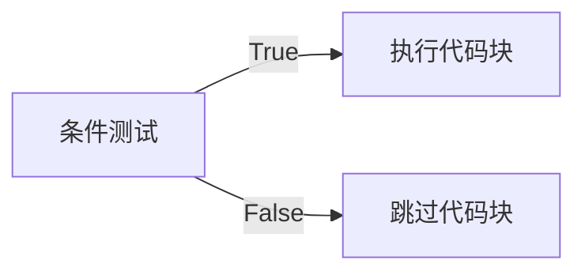

---

---

# python编程：从入门到实战


## 第一章、起步

### 1.1 安装python


**重要提示：**  请务必勾选 `Add Python ... to PATH` 复选框

### 1.2 终端操作

- 在终端中运行python程序：

```shell
python hello_python.py
```

- windows命令

| 命令  | 全称               | 功能描述                 |
| :---- | :----------------- | :----------------------- |
| `cd`  | `change directory` | 切换当前工作目录         |
| `dir` | `directory`        | 显示当前目录中的所有文件 |


## 第二章、变量和简单的数据类型

### 2.1 变量

#### **2.1.1 命名规范**

- **组成规则**：

  - 字母、数字和下划线组成
  - **不能以数字开头**（防止pycharm导入问题）
  - 不能包含空格（可使用下划线分隔单词）

- **注意事项**：

  - 避免与Python关键字和函数名重名
  - 慎用小写字母 `l` 和大写字母 `O`（易与数字 `1` 和 `0` 混淆）
  - 区分大小写（`Andy ≠ andy`）

- **命名建议**：

  > 推荐使用小写字母命名变量。虽然大写不会导致错误，但在Python中有特殊含义（将在后续章节讨论）


#### **2.1.2 变量定义**

在Python中，每个变量在使用前都必须赋值(=)，变量赋值以后该变量才会被创建，可以用其他变量的计算结果来定义变量：**`money = price * weight`**


#### **2.1.3 变量的类型**

在 Python 中定义变量时不需要指定类型，Python可以根据 = 等号右侧的值，自动推导出变量中存储数据的类型

| 类型                | 说明                     | 示例             |
| :------------------ | :----------------------- | :--------------- |
| **数字型**- int     | 整数                     | `42`             |
| **数字型**- float   | 浮点数                   | `3.14`           |
| **数字型**- complex | 复数（科学计算）         | `3+5j`           |
| **bool**            | 布尔值（True/False）     | `True`（非零值） |
| **非数字**          | 字符串、列表、元组、字典 | `"Hello"`        |


#### **2.1.4 类型间运算规则**

- **数字型变量**：可直接计算

```python
a = 10
b = 3.5
print(a + b)  # 输出 13.5
```

- **字符串变量**：

  - `+` 拼接字符串

  ```python
  print("Hello" + "World")  # 输出 HelloWorld
  ```

  - `*` 重复字符串

  ```python
  print("Hi" * 3)  # 输出 HiHiHi
  ```

- **禁止操作**：

```python
# 数字型变量和字符串之间不能进行其他计算
print(10 + "apples")  # TypeError
```


#### 2.1.5 输入与输出

**输入函数**：

如果要获取用户在键盘上的输入信息，需要使用到 input 函数，用户输入的任何内容 Python 都认为是一个字符串，可以转换。

```python
name = input("请输入姓名：")  # 所有输入均为字符串类型
age = int(input("请输入年龄："))  # 类型转换
```


**格式化输出**：`%` 被称为格式化操作符

**基本用法**

1. **语法**：`"格式化字符串" % 值` 或 `"格式化字符串" % (值1, 值2, ...)`
2. **示例**：

```python
name = "Alice"
age = 25
print("Name: %s, Age: %d" % (name, age))  # 输出：Name: Alice, Age: 25
```

| 说明符 | 类型             | 示例              | 输出      |
| :----- | :--------------- | :---------------- | :-------- |
| `%s`   | 字符串           | `"%s" % "Hello"`  | `"Hello"` |
| `%d`   | 整数             | `"%d" % 42`       | `"42"`    |
| `%f`   | 浮点数           | `"%.2f" % 3.1415` | `"3.14"`  |
| `%x`   | 十六进制（小写） | `"%x" % 255`      | `"ff"`    |
| `%X`   | 十六进制（大写） | `"%X" % 255`      | `"FF"`    |
| `%o`   | 八进制           | `"%o" % 8`        | `"10"`    |


### 2.2 字符串

#### 2.2.1 基本特性

- 单引号或双引号均可定义(这种灵活性让你能够在字符串中包含引号)

```python
s1 = '单引号字符串'
s2 = "双引号字符串（可包含'单引号'）"
```

#### 2.2.2 常用方法

| 方法             | 功能           | 示例                                      | 结果            |
| :--------------- | :------------- | :---------------------------------------- | :-------------- |
| `title()`        | 单词首字母大写 | `"hello world".title()`                   | `"Hello World"` |
| `upper()`        | 全大写         | `"python".upper()`                        | `"PYTHON"`      |
| `lower()`        | 全小写         | `"TEXT".lower()`                          | `"text"`        |
| `strip()`        | 移除两端空白   | `" text ".strip()`                        | `"text"`        |
| `lstrip()`       | 移除左侧空白   | `" text ".lstrip()`                       | `"text "`       |
| `rstrip()`       | 移除右侧空白   | `" text ".rstrip()`                       | `" text"`       |
| `removeprefix()` | 移除前缀       | `"https://site".removeprefix("https://")` | `"site"`        |
| `removesuffix()` | 移除后缀       | `"file.txt".removesuffix(".txt")`         | `"file"`        |

> 在存储数据时，lower() ⽅法很有⽤。⽤户通常不能像你期望的那样提供正确的⼤⼩写，因此需要将字符串先转换为全⼩写的再存储。以后需要显⽰这些信息时，再将其转换为最合适的⼤⼩写⽅式即可。

#### 2.2.3 f-string（格式化字符串）

在字符串中使用变量：要在字符串中插⼊变量的值，可先在左引号前加上字⺟ f，再将要插⼊的变量放在花括号内。这样，Python 在显⽰字符串时，将把每个变量都替换为其值。

```python
name = "Bob"
age = 30
print(f"{name}今年{age}岁")  # 输出：Bob今年30岁
```

#### 2.2.4 空白字符处理

- 常见空白字符：空格、制表符 `\t`、换行符 `\n`
- 删除空白：

```python
text = "\t重要内容\n"
print(text.strip())  # 输出："重要内容"
```

`strip()` 、`lstrip()`、`rstrip()`方法对字符串的操作是暂时的，因为它**不会直接修改原字符串**。字符串在 Python 中属于不可变对象（immutable），**所有看似"修改"字符串的方法**（如 `strip()`、`lower()` 等）实际上都是**返回处理后的新字符串副本**。

| 操作                  | 原字符串是否改变 | 结果保存方式                  |
| :-------------------- | :--------------- | :---------------------------- |
| `text.strip()`        | ❌ 不变           | 需赋值：`text = text.strip()` |
| `text = text.strip()` | ✅ 改变           | 变量指向新字符串              |

> 📌 **最佳实践**：每次调用字符串方法后，如需保留结果，必须显式赋值给变量。

#### 2.2.5 成员检测

```python
if 'a' in 'apple':   # True
if 'ab' in 'abc':    # True
if 'xz' in 'abc':    # False
```


### 2.3 数值类型

#### 2.3.1 整数运算

```python
print(3 + 2)    # 加法 → 5
print(3 - 2)    # 减法 → 1
print(3 * 2)    # 乘法 → 6
print(3 / 2)    # 除法 → 1.5
print(3 ** 2)   # 乘方 → 9

# 可以通过使用括号来改变计算的优先级
print((3 + 2) * 4)  # 使用括号 → 20
```

#### 2.3.2 浮点数特性

```python
print(0.1 + 0.2)  # 输出 0.30000000000000004（浮点精度问题）
```

> 需要注意的是，结果包含的⼩数位数可能是不确定的，所有编程语⾔都存在这种问题，没有什么可担⼼的。Python 会尽⼒找到⼀种精确地表⽰结果的⽅式，但鉴于计算机内部表⽰数字的⽅式，这在有些情况下很难。就现在⽽⾔，暂时忽略多余的⼩数位数即可。

#### 2.3.3 混合运算规则

- 两数相除 → **总是返回浮点数**，即便这两个数都是整数且能整除

```python
print(4 / 2)  # 输出 2.0
```

- 整数与浮点数运算 → **总是返回浮点数**

```python
print(3 + 2.5)  # 输出 5.5
```

#### 2.3.4 数值表示技巧

**使用下划线增强可读性**：

```python
# Python会忽略数值中的下划线
big_number = 1_000_000     # 等同于 1000000
small_number = 3.141_592   # 等同于 3.141592
```

> 在书写很⼤的数时，可使⽤下划线将其中的位分组，使其更清晰易读。当你打印这种使⽤下划线定义的数字时，Python 不会打印其中的下划线。这是因为在存储这种数时，Python 会忽略其中的下划线。在对数字位分组时，即便不是将每三位分成⼀组，也不会影响最终的值。在 Python 看来，1000 与 1_000 没什么不同，1_000 与 10_00 也没什么不同。这种表⽰法既适⽤于整数，也适⽤于浮点数。

#### 2.3.5 多重赋值

```python
# 同时为多个变量赋值
x, y, z = 1, 2, 3
print(x, y, z)  # 输出 1 2 3
```

> 可在⼀⾏代码中给多个变量赋值，这有助于缩短程序并提⾼其可读性，在这样做时，需要⽤逗号将变量名分开；对于要赋给变量的值，也需要做同样的处理。Python 将按顺序将每个值赋给对应的变量。只要变量数和值的个数相同，Python 就能正确地将变量和值关联起来。

#### 2.3.6 常量约定

常量（constant）是在程序的整个⽣命周期内都保持不变的变量

- Python无内置常量类型
- 约定：**全大写变量名**表示常量

```python
MAX_USERS = 100  # 约定视为常量
```


### 2.4 注释

#### 2.4.1 单行注释

```python
# 这是一个单行注释
price = 99.9  # 价格变量
```

#### 2.4.2 多行注释

```python
"""
这是一个多行注释
可跨越多行
Python解释器会忽略这些内容
"""
```

> 注释的内容会被python解释器忽略


## 第三章、列表

### 3.1 列表简介

#### 3.1.1 列表定义与访问

- **列表定义**：有序元素集合，用方括号 `[]` 表示，⽤逗号分隔其中的元素

```python
colors = ['red', 'green', 'blue']  # 字符串列表
numbers = [1, 3, 5, 7, 9]         # 数值列表
mixed = [1, 'apple', True]         # 混合类型列表
```

- **元素访问**：

要访问列表元素，可指出列表的名称，再指出元素的索引，并将后者放在⽅括号内

| 索引类型 | 示例         | 说明                 |
| :------- | :----------- | :------------------- |
| 正索引   | `colors[0]`  | → 'red' (首个元素)   |
| 负索引   | `colors[-1]` | → 'blue' (末尾元素)  |
| 负索引   | `colors[-2]` | → 'green' (倒数第二) |

> 索引从 0 ⽽不是 1 开始，⼤多数编程语⾔是如此规定的，这与列表操作的底层实现有关。Python 为访问最后⼀个列表元素提供了⼀种特殊语法。通过将索引指定为-1，可让 Python 返回最后⼀个列表元素。这种语法很有⽤，因为你经常需要在不知道列表⻓度的情况下访问最后的元素。这种约定也适⽤于其他负数索引，例如，索引 -2 返回倒数第⼆个列表元素，索引 -3 返回倒数第三个列表元素，依此类推；
>

- **使⽤列表中的各个值**：

你可以像使⽤其他变量⼀样使⽤列表中的各个值。例如，可以使⽤ f 字符串根据列表中的值来创建消息

```python
bicycles = ['trek', 'cannondale', 'redline', 'specialized']
message = f"My first bicycle was a {bicycles[0].title()}."
print(message)
```

#### 3.1.2 列表元素操作

```python
# 修改元素
colors[1] = 'yellow'  # ['red', 'yellow', 'blue']

# 添加元素
colors.append('purple')      # 末尾添加 → ['red', 'yellow', 'blue', 'purple']
colors.insert(1, 'orange')   # 索引1处插入 → ['red', 'orange', 'yellow', 'blue', 'purple']
```


**删除元素方法对比**

使用del、pop、remove方法后，列表发生变化

| 方法/语句       | 特点                     | 示例                     | 返回值   |
| :-------------- | :----------------------- | :----------------------- | :------- |
| `del`           | 按索引删除               | `del colors[0]`          | 无返回值 |
| `pop()`         | 删除末尾元素并返回该元素 | `last = colors.pop()`    | 被删元素 |
| `pop(index)`    | 删除指定索引元素并返回   | `second = colors.pop(1)` | 被删元素 |
| `remove(value)` | 按值删除首个匹配项       | `colors.remove('blue')`  | 无返回值 |

remove() ⽅法只删除第⼀个指定的值。如果要删除的值，可能在列表中出现多次，就需要使⽤循环，确保将每个值都删除。

> **选择指南**：
>
> - 删除后不再使用 → `del` 或 `remove()`
> - 需使用被删除的值 → `pop()`

#### 3.1.3 管理列表

**排序操作**

```python
nums = [3, 1, 4, 2]

# 永久排序
nums.sort()             # 升序 → [1, 2, 3, 4]
nums.sort(reverse=True) # 降序 → [4, 3, 2, 1]

# 临时排序
sorted_nums = sorted(nums)      # 原列表不变，返回排序副本
sorted_nums_desc = sorted(nums, reverse=True)
```

> 注意：在并⾮所有的值都是全⼩写的时，按字⺟顺序排列列表要复杂⼀些。在确定排列顺序时，有多种解读⼤写字⺟的⽅式。

**反转与长度**

```python
# 反转列表顺序
nums.reverse()  # 永久反转 → [2, 4, 1, 3]

# 获取列表长度
count = len(nums)  # → 4
```

> reverse() ⽅法会永久地修改列表元素的排列顺序，但可随时恢复到原来的排列顺序，只需对列表再次调⽤ reverse() 即可


### 3.2 操作列表

#### 3.2.1 遍历列表

```python
fruits = ['apple', 'banana', 'orange']

# 基础遍历
for fruit in fruits:
    print(fruit.title())  # Apple, Banana, Orange

# 带索引遍历
for index, fruit in enumerate(fruits):
    print(f"{index+1}. {fruit}")
```

> 循环结束后，最后fruit变量的值为'orange'。在编写 for 循环时，可以给将依次与列表中的每个值相关联的临时变量指定任意名称。然⽽，选择描述单个列表元素的有意义的名称⼤有裨益。

#### 3.2.2 数值列表生成

##### **1. 基础：`range()` 函数**

Python 的 `range()` 函数用于生成整数序列，遵循 **左闭右开** 原则。

```python
# 生成 0~5（含0，不含6）
range(6)      # 输出序列：0, 1, 2, 3, 4, 5

# 生成 2~5（含2，不含6）
range(2, 6)   # 输出序列：2, 3, 4, 5

# 生成 1~10 的偶数（步长=2）
range(1, 11, 2)  # 输出序列：1, 3, 5, 7, 9
```


##### 2. 使用 `range()` 创建数值列表

通过 `list()` 将 `range()` 结果转换为列表，支持**步长控制**。

```python
# 创建 1~10 的偶数列表
even_numbers = list(range(2, 11, 2))
print(even_numbers)  # 输出：[2, 4, 6, 8, 10]
```


##### 3. 生成任意数值集合

**案例：创建 1~10 的平方列表**

**方法 1：常规循环**

```python
squares = []
for value in range(1, 11):
    square = value**2  # 临时变量存储平方值
    squares.append(square)
print(squares)  # 输出：[1, 4, 9, ..., 100]
```

**方法 2：简化版（省略临时变量）**

```python
squares = []
for value in range(1, 11):
    squares.append(value**2)  # 直接追加结果
```


##### 4.  列表推导式（高效写法）

将循环和元素创建合并为一行代码。
**语法**：
`[表达式 for 变量 in 范围]`

**平方列表的推导式实现**：

```python
squares = [value**2 for value in range(1, 11)]
print(squares)  # 输出：[1, 4, 9, ..., 100]
```


##### 5. 数值列表的统计计算

常用统计函数：

```python
numbers = [5, 2, 9, 1, 7]

print(min(numbers))  # 最小值 → 1
print(max(numbers))  # 最大值 → 9
print(sum(numbers))  # 求和 → 24
print(len(numbers))  # 长度 → 5
```


#### 3.2.3 列表切片与复制

##### 1. 切片基础

通过指定起始索引（包含）和结束索引（不包含）截取列表片段，遵循 **左闭右开** 原则。

**语法**：
`list[start:end:step]`

**示例**：

```python
players = ['charles', 'martina', 'michael', 'florence', 'eli']

# 截取索引1~3（不含3）
print(players[1:3])  # 输出：['martina', 'michael']

# 从头开始到索引3
print(players[:3])   # 输出：['charles', 'martina', 'michael']

# 从索引2到末尾
print(players[2:])   # 输出：['michael', 'florence', 'eli']

# 负数索引（倒数第3到最后）
print(players[-3:])  # 输出：['michael', 'florence', 'eli']

# 步长2（每隔1个元素取1个）
print(players[::2])  # 输出：['charles', 'michael', 'eli']
```


##### 2. 遍历切片

使用 `for` 循环处理切片数据

**应用场景**：

```python
# 游戏得分系统：获取前三高分
all_scores = [78, 92, 85, 88, 95, 79]
all_scores.sort(reverse=True)  # 降序排序
top_scores = all_scores[:3]    # 前三高分

for score in top_scores:
    print(f"🏆 顶级得分：{score}")

# 数据批处理
data = [x for x in range(100)]
batch_size = 10
for i in range(0, len(data), batch_size):
    process_batch(data[i:i+batch_size])

# Web分页显示（每页5条）
articles = ["文章" + str(i) for i in range(1, 21)]
page = 2
print(f"第 {page} 页内容：")
for item in articles[(page-1)*5 : page*5]:
    print(f" • {item}")
```


##### 3. 列表复制

正确复制列表避免引用同一对象

**正确方法**（创建独立副本）：

```python
my_foods = ['pizza', 'falafel', 'carrot cake']
friend_foods = my_foods[:]  # 切片复制

# 验证独立性
my_foods.append('cannoli')
friend_foods.append('ice cream')

print("我的食物:", my_foods)       # 包含'cannoli'
print("朋友的食物:", friend_foods)  # 包含'ice cream'
```

**错误方法**（引用同一对象）：

```python
copy_fail = my_foods  # 仅创建新引用

# 修改会影响原列表
copy_fail.append('sushi')
print(my_foods)  # 原列表也被修改！
```

| 操作类型   | 代码示例        | 结果            |
| :--------- | :-------------- | :-------------- |
| 基础切片   | `list[1:4]`     | 索引1~3的元素   |
| 从头开始   | `list[:3]`      | 前3个元素       |
| 到末尾结束 | `list[2:]`      | 从索引2到末尾   |
| 负数索引   | `list[-3:]`     | 最后3个元素     |
| 带步长     | `list[0:6:2]`   | 索引0,2,4的元素 |
| 全列表复制 | `new = list[:]` | 创建独立副本    |
| 反向复制   | `list[::-1]`    | 创建逆序副本    |
| 间隔采样   | `list[::3]`     | 每3个元素取1个  |


#### 3.2.4 元组

##### 1. 元组基础

元组（Tuple）是**不可变**的有序序列，使用圆括号 `()` 定义
与列表的主要区别：**创建后元素不可修改、添加或删除**

**定义与访问**：

```python
# 标准定义
dimensions = (200, 50)
print(dimensions[0])  # 输出：200

# 单元素元组（必须加逗号）
single_item = ('apple',)  
print(type(single_item))  # 输出：<class 'tuple'>

# 无逗号则视为普通字符串
not_a_tuple = ('apple')
print(type(not_a_tuple))  # 输出：<class 'str'>
```


##### 2. 遍历元组

使用 `for` 循环遍历（语法与列表相同）：

```python
colors = ('red', 'green', 'blue')

# 常规遍历
for color in colors:
    print(f"Color: {color}")

# 带索引遍历
for index, color in enumerate(colors):
    print(f"Index {index}: {color}")
```


##### 3. 元组特性与操作

| 特性         | 说明                         | 示例代码                         |
| :----------- | :--------------------------- | :------------------------------- |
| **不可变性** | 元素创建后不可修改           | `dimensions[0] = 250` ❌ 引发错误 |
| **重新赋值** | 整个元组变量可重新指向新元组 | `dimensions = (300, 100)` ✅      |
| **嵌套结构** | 可包含可变对象（如列表）     | `mixed = (1, [2, 3], 4)`         |
| **元组解包** | 将元组元素赋值给多个变量     | `x, y = (10, 20)`                |
| **切片操作** | 支持切片但返回新元组         | `colors[1:] → ('green', 'blue')` |
| **连接复制** | 使用 `+` 连接 / `*` 复制     | `(1,2) + (3,4) → (1,2,3,4)`      |

**重新赋值示例**：

```python
# 初始元组
dimensions = (200, 50)
print("Original:", dimensions)  # 输出：(200, 50)

# 重新赋值整个元组
dimensions = (400, 100)
print("Modified:", dimensions)  # 输出：(400, 100)
```


##### 4. 元组 vs 列表

| 特性         | 元组                         | 列表                        |
| :----------- | :--------------------------- | :-------------------------- |
| **语法**     | 圆括号 `()`                  | 方括号 `[]`                 |
| **可变性**   | 创建后不可修改               | 可随时修改元素              |
| **性能**     | 内存占用小，访问更快         | 内存占用较大                |
| **适用场景** | 固定数据（如坐标、配置常量） | 动态数据（如待办事项列表）  |
| **方法**     | 仅 `count()`, `index()`      | 支持 `append()`, `pop()` 等 |


##### 5. 最佳实践

- **数据保护**：用元组存储不应修改的关键数据

```python
# 数据库连接配置（主机，端口，用户）
DB_CONFIG = ('db.example.com', 3306, 'admin')
```

- **函数多返回值**：

```python
def get_dimensions():
    return 800, 600  # 自动打包为元组

width, height = get_dimensions()  # 解包赋值
```

- **字典键值**：元组可作为字典键（列表不可）

```python
# 坐标映射到颜色
color_map = {
    (35, 45): 'red',
    (100, 20): 'blue'
}
```

- **格式字符串**：

```python
point = (12, 18)
print("坐标：(%d, %d)" % point)  # 自动解包
```


| 操作     | 代码示例               | 结果               |
| :------- | :--------------------- | :----------------- |
| 创建     | `t = (1, 'a', 3.5)`    | (1, 'a', 3.5)      |
| 访问元素 | `t[1]`                 | 'a'                |
| 切片     | `t[1:]`                | ('a', 3.5)         |
| 长度     | `len(t)`               | 3                  |
| 计数     | `t.count('a')`         | 1                  |
| 索引查询 | `t.index(3.5)`         | 2                  |
| 嵌套访问 | `nested = (1, [2, 3])` | `nested[1][0] = 2` |
| 解包     | `x, y, z = t`          | x=1, y='a', z=3.5  |
| 检查存在 | `'a' in t`             | True               |

> **关键原则**：元组的不可变性提供数据完整性和性能优势，适合存储不应更改的数据集合


#### 3.2.5 避免缩进错误指南

Python根据缩进来判断代码⾏与程序其他部分的关系，常见错误类型及解决方案：

##### 1. 忘记缩进（IndentationError）

**问题**：循环/条件语句后未缩进代码块
**修复**：属于代码块的语句必须统一缩进

```python
# ❌ 错误示例
names = ['Alice', 'Bob']
for name in names:
print(name)  # 缺少缩进

# ✅ 正确写法
for name in names:
    print(name)  # 4空格缩进
```

##### 2. 不必要的缩进（Unexpected Indent）

**问题**：不应在代码块中的语句被缩进
**修复**：确保只有逻辑隶属的代码才缩进

```python
# ❌ 错误示例
message = "Hello"  # 主程序代码
    print(message)  # 不应缩进

# ✅ 正确写法
message = "Hello"
print(message)      # 取消缩进
```

##### 3. 遗漏冒号（SyntaxError）

所有需要定义代码块（缩进部分）的语句，末尾都需要冒号。记住这一点可以覆盖 99% 的情况。编写代码时，只需检查语句是否要引入缩进块，就能避免遗漏冒号的问题。

**问题**：代码块声明语句缺少结尾冒号
**修复**：所有需要代码块的语句必须以 `:` 结尾

```python
# ❌ 错误示例
if x > 5  # 缺少冒号
    print("Large")

# ✅ 正确写法
if x > 5:  # 带冒号
    print("Large")
```

##### 4. 缩进不一致（TabError）

**问题**：混合使用空格和制表符
**修复**：统一使用4空格，配置编辑器转换Tab

```python
# ❌ 错误示例 (→表示Tab)
def test():
→   print("Tab")   # 制表符
    print("Space") # 4空格

# ✅ 正确写法
def test():
    print("Space")  # 全部4空格
    print("Space")
```


#### 3.2.6 PEP 8 格式核心规范

Python 官方风格指南（PEP 8）确保代码一致性和可读性

| 规范类别       | 具体要求                        | 示例/说明                                                    |
| :------------- | :------------------------------ | :----------------------------------------------------------- |
| **缩进**       | 每级缩进使用 **4个空格**        | ✅ 正确： `if condition:`   `print("Done")`                   |
|                | 禁止混合使用制表符(Tab)和空格   | ❌ 错误： `if condition:` `→ print("Mixed")` (→表示Tab)       |
| **行长度**     | 代码行不超过 **80字符**         | 超出时使用括号隐式续行： `result = (value1 + value2`   `- value3)` |
|                | 注释行不超过 **72字符**         | 文档字符串/注释优先换行                                      |
| **空行**       | 函数/类定义间用 **2个空行**分隔 | `python<br>def func1(): ...<br><br><br>def func2(): ...<br>` |
|                | 类内方法间用 **1个空行**分隔    | `python<br>class MyClass:<br> def method1(): ...<br><br> def method2(): ...<br>` |
| **编辑器设置** | 配置Tab键输出空格而非制表符     | VSCode设置：`"editor.insertSpaces": true`                    |
|                | 启用80字符视觉参考线            | PyCharm设置：`Editor → Guides → Right Margin`                |


## 第四章、if语句

### 4.1 条件测试

**核心概念**：值为 `True` 或 `False` 的表达式，控制程序执行路径
**执行逻辑**



#### 4.1.1 测试类型速查表

| 测试类型     | 运算符               | 示例                   | 结果              |
| :----------- | :------------------- | :--------------------- | :---------------- |
| **相等**     | `==`                 | `'Python' == 'python'` | False(区分大小写) |
| **不等**     | `!=`                 | `10 != 5`              | True              |
| **数值比较** | `<`, `<=`, `>`, `>=` | `3.14 >= 3`            | True              |
| **逻辑与**   | `and`                | `(5>3) and (2<4)`      | True              |
| **逻辑或**   | `or`                 | `(5<3) or (2<4)`       | True              |
| **成员存在** | `in`                 | `'a' in ['a','b']`     | True              |
| **成员缺失** | `not in`             | `'x' not in 'text'`    | False             |

> `=`：赋值；`==`：判断是否相等


**布尔表达式**

随着对编程的了解越来越深⼊，你将遇到术语布尔表达式，它不过是条件测试的别名罢了。与条件表达式⼀样，布尔表达式的结果要么为 True，要么为 False。

```python
game_active = True
can_edit = False
```


#### 4.1.2 关键技巧

```python
# 大小写不敏感比较
username = "Admin"
if username.lower() == "admin":  # 转换为小写,lower() ⽅法不会修改存储在变量 username 中的值，因此进⾏这样的⽐较不会影响原来的变量
    print("管理员登录")

# 浮点数安全比较
a = 0.1 + 0.2
b = 0.3
tolerance = 1e-9   # 容差
print(abs(a - b) < tolerance)  # 输出: True

# 空值检测
items = []
if not items:  # 等价于 len(items) == 0
    print("列表为空")
```


### 4.2 if 语句结构

#### 4.2.1 简单 if 语句

**语法**：单条件单操作

```python
age = 18
if age >= 18:
    print("您已成年，可以投票！")
```


#### 4.2.2 if-else 语句

**语法**：二选一执行路径

```python
temperature = 35
if temperature > 30:
    print("高温警告！")
else:
    print("温度正常")
```


#### 4.2.3 if-elif-else 语句

**语法**：多条件分支处理

```python
score = 85

if score >= 90:
    grade = "A"
elif score >= 80:  # 90 > score >= 80
    grade = "B"
elif score >= 70:
    grade = "C"
else:  # 可省略的兜底分支
    grade = "D"

print(f"成绩等级: {grade}")
```

> **最佳实践**：
>
> - 优先使用 `elif` 替代 `else` 避免意外匹配
> - 按条件概率从高到低排列提高效率


#### 4.2.4 多独立条件测试

有时候必须检查你关⼼的所有条件。在这种情况下，应使⽤⼀系列不包含 elif 和 else 代码块的简单 if 语句。在可能有多个条件为True，且需要在每个条件为 True 时都采取相应措施时，适合使⽤这种⽅法。总之，如果只想运⾏⼀个代码块，就使⽤ if-elif-else 语句；如果要运⾏多个代码块，就使⽤⼀系列独⽴的 if 语句。

**适用场景**：需同时检查多个独立条件

```python
# 检查用户权限
is_admin = True
is_moderator = False
is_member = True

if is_admin:
    print("显示管理面板")
    
if is_moderator:
    print("显示审核工具")
    
if is_member:
    print("显示会员内容")
```


### 4.3 列表条件处理

```python
users = ['Alice', 'Bob', 'Admin']

# 检查特殊元素
for user in users:
    if user == 'Admin':
        print(f"欢迎管理员 {user}!")
    else:
        print(f"欢迎用户 {user}")

# 检查空列表
empty_list = []
if empty_list:  # 列表非空时返回True
    print("列表有内容")
else:
    print("列表为空")  # 输出此结果
```

**空值判断规则**：确定列表⾮空

| 数据类型 | 判空条件     | 示例           |
| :------- | :----------- | :------------- |
| 列表     | `if not lst` | `[]` → False   |
| 字符串   | `if not s`   | `""` → False   |
| 元组     | `if not t`   | `()` → False   |
| 字典     | `if not d`   | `{}` → False   |
| 数值     | `if num`     | `0` → False    |
| None     | `if x`       | `None` → False |


### 4.4 if 语句格式规范 (PEP 8)

PEP 8 提供的唯⼀建议是：在诸如 ==、>= 和 <= 等⽐较运算符两边各添加⼀个空格。

```python
# ✅ 正确：运算符两侧加空格
if age >= 18 and score > 60:

# ❌ 错误：运算符粘连
if age>=18 and score>60:
```


## 第五章、字典

### 5.1 使用字典

- **定义**：
  - 字典（dictionary）是一系列**键值对**的集合。
  - 每个**键**与一个**值**关联（键映射到值）。
  - 值可以是数字、字符串、列表、字典或其他任意Python对象。
- **表示**：
  - 字典用花括号 `{}` 表示。
  - 键值对之间用逗号 `,` 分隔。
  - 键和值之间用冒号 `:` 分隔。

```python
alien_0 = {'color': 'green', 'points': 5}  # 示例字典
```

- **访问值**：
  - 指定字典名和键（放在方括号内）。

```python
print(alien_0['color'])  # 输出: green
```

- **添加键值对**：
  - 指定字典名、用方括号括起的新键、以及关联的值。

```py
alien_0['x_position'] = 0
alien_0['y_position'] = 25
print(alien_0)  # 输出包含新键值对的字典
```

> 字典保留元素添加时的顺序。

- **修改值**：
  - 指定字典名、键（方括号内）和新的关联值。

```python
alien_0['color'] = 'yellow'  # 修改 'color' 键的值
print(alien_0['color'])      # 输出: yellow
```

- **删除键值对**：
  - 使用 `del` 语句，指定字典名和要删除的键。

```python
del alien_0['points']  # 永久删除键 'points' 及其关联值
print(alien_0)         # 'points' 键值对已消失
```

- **存储同类对象**：
  - 字典常用于存储多个对象的同一种信息。

```python
favorite_languages = {
    'jen': 'python',
    'sarah': 'c',
    'edward': 'ruby',
    'phil': 'python',  # 最后一个键值对后的逗号是良好实践，便于后续添加
}
```

- **使用 `get()` 访问值**：
  - 避免键不存在时出错（`KeyError`）。
  - 第一个参数是必需的键。
  - 第二个可选参数指定键不存在时返回的默认值（默认为 `None`）。

```python
point_value = alien_0.get('points', 'No point value assigned.')
print(point_value)  # 若'points'已删除，则输出: No point value assigned.

# 不指定默认值
speed = alien_0.get('speed')  # speed 不存在，返回 None
print(speed)                  # 输出: None (不报错)
```


### 5.2 遍历字典

- **遍历所有键值对**：
  - 使用 `for` 循环和 `items()` 方法。
  - 声明两个变量分别接收键和值。

```python
for key, value in alien_0.items():
    print(f"Key: {key}")
    print(f"Value: {value}\n")
```

- **遍历所有键**：
  - 使用 `keys()` 方法。
  - 遍历字典默认就是遍历所有键，`keys()` 常用于明确意图或获取键列表。

```python
# 显式使用 keys()
for name in favorite_languages.keys():
    print(name.title())

# 默认遍历键 (效果相同)
for name in favorite_languages:
    print(name.title())

# 使用键访问值
for name in favorite_languages.keys():
    language = favorite_languages[name]
    print(f"{name.title()}'s favorite language is {language}.")

# 检查键是否存在
if 'erin' not in favorite_languages.keys():
    print("Erin, please take our poll!")
```

- **按特定顺序遍历键**：
  - 在循环中对键列表使用 `sorted()` 函数排序。

```python
for name in sorted(favorite_languages.keys()):
    print(f"{name.title()}, thank you for taking the poll.")
```

- **遍历所有值**：
  - 使用 `values()` 方法。
  - 使用 `set()` 去除重复值。

```python
# 遍历所有值 (包含重复)
print("Languages mentioned:")
for language in favorite_languages.values():
    print(language.title())

# 遍历唯一值 (使用集合 set)
print("\nUnique languages mentioned:")
for language in set(favorite_languages.values()):
    print(language.title())

# 直接创建集合示例
languages_set = {'python', 'c', 'ruby', 'python'}
print(languages_set)  # 输出: {'ruby', 'python', 'c'} (无序且唯一)
```

> 集合和字典很容易混淆，因为它们都是⽤⼀对花括号定义的。当花括号内没有键值对时，定义的很可能是集合。不同于列表和字典，集合不会以特定的顺序存储元素。


### 5.3 嵌套

- **概念**：将字典存储在列表中、将列表存储在字典中、或将字典存储在字典中。
- **字典列表**：
  - 列表中每个元素都是一个字典。

```python
aliens = []  # 创建一个存储外星人的空列表
# 创建30个绿色的外星人
for alien_number in range(30):
    new_alien = {'color': 'green', 'points': 5, 'speed': 'slow'}
    aliens.append(new_alien)

# 修改前三个外星人
for alien in aliens[:3]:
    if alien['color'] == 'green':
        alien['color'] = 'yellow'
        alien['speed'] = 'medium'
        alien['points'] = 10

# 显示前5个外星人
for alien in aliens[:5]:
    print(alien)
print(f"Total number of aliens: {len(aliens)}")
```

- **在字典中存储列表**：

  - 字典的值是一个列表。

  - 访问列表后，可能需要再次遍历。

```python
pizza = {
    'crust': 'thick',
    'toppings': ['mushrooms', 'extra cheese'],  # 键 'toppings' 的值是一个列表
}

# 访问整个列表
print(f"You ordered a {pizza['crust']}-crust pizza "
      "with the following toppings:")  # 长字符串分行写法,当函数调⽤print() 中的字符串很⻓，需要分成多⾏书写时，可以在合适的位置分⾏，在每⾏末尾都加上引号，并且对于除第⼀⾏外的其他各⾏，都在⾏⾸加上引号并缩进。这样，Python 将⾃动合并括号内的所有字符串。

# 遍历存储在字典中的列表
for topping in pizza['toppings']:
    print(f"\t{topping}")
```

- **在字典中存储字典**：
  - 字典的值是另一个字典。

```python
users = {
    'aeinstein': {  # 用户名作为键
        'first': 'albert',      # 值是一个包含用户信息的字典
        'last': 'einstein',
        'location': 'princeton',
    },
    'mcurie': {
        'first': 'marie',
        'last': 'curie',
        'location': 'paris',
    },
}

for username, user_info in users.items():  # 遍历外层字典
    print(f"\nUsername: {username}")
    full_name = f"{user_info['first']} {user_info['last']}"  # 访问内层字典的值
    location = user_info['location']
    print(f"\tFull name: {full_name.title()}")
    print(f"\tLocation: {location.title()}")
```


## 第六章、用户输入和 while 循环

### 6.1 `input()` 函数

#### 6.1.1 工作原理

- 函数作用：暂停程序运行，等待用户输入文本，输入内容会被赋值给变量
- 参数说明：接受一个提示文本（prompt），告知用户需要输入的信息
- 编写清晰的提⽰技巧：
  - 在提示末尾添加空格（如冒号后），分隔提示与用户输入
  - 多行提示的处理：
    ```python
    # 示例：多行提示的写法
    prompt = "请告诉我们您的旅行偏好：" 
    prompt += "\n(输入'quit'可结束)"
    user_input = input(prompt)
    ```


#### **6.1.2 数值输入处理**

- 问题：`input()` 始终返回字符串类型，无法直接用于数值比较
- 解决方案：使用 `int()` 函数转换字符串为整数
  ```python
  age = input("请输入年龄：")
  age = int(age)  # 字符串 → 整数


#### 6.1.3 求模运算符

- 符号：`%`
- 功能：返回两数相除的余数
- 典型应用：奇偶判断


### 6.2 while 循环

| 特性        | 说明                                     |
| :---------- | :--------------------------------------- |
| 与 for 区别 | 持续运行直到条件不满足（非固定次数循环） |
| 基础结构    | `while condition:` + 缩进代码块          |
| 退出控制    | 通过修改循环条件变量或使用 `break`       |
| 避免死循环  | 确保循环条件最终会变为 `False`           |

#### 6.2.1 while循环控制技巧

- **用户主动退出**

```python
message = ""  # 初始化空字符串
while message != 'quit':
    message = input("输入指令：")
    print(message)
```

- **标志位控制**

```python
active = True  # 程序运行标志
while active:
    command = input("> ")
    if command == 'exit':
        active = False  # 安全终止循环
    else:
        print(f"执行命令: {command}")
```

> 在要求满⾜很多条件才继续运⾏的程序中，可定义⼀个变量，⽤于判断整个程序是否处于活动状态。这个变量称为标志（flag），充当程序的交通信号灯。可以让程序在标志为 True 时继续运⾏，并在任何事件导致标志的值为 False 时让程序停⽌运⾏。这样，在 while 语句中就只需检查⼀个条件：标志的当前值是否为 True。然后将所有测试（是否发⽣了应将标志设置为 False 的事件）都放在其他地⽅，从⽽让程序更整洁。

- **中断与跳过**

  - `break`：立即退出整个循环

  - `continue`：跳过本次迭代，返回循环开头

```python
# 打印 1-10 的奇数
num = 0
while num < 10:
    num += 1
    if num % 2 == 0: 
        continue  # 跳过偶数
    print(num)
```

> 注意：在所有 Python 循环中都可使⽤ break 语句。例如，可使⽤break 语句来退出遍历列表或字典的 for 循环


### 6.3 while循环处理列表和字典

> **注意**：遍历时修改列表应使用 `while` 而非 `for`，避免元素跟踪错误。for 循环是⼀种遍历列表的有效⽅式，但不应该在 for 循环中修改列表，否则将导致 Python 难以跟踪其中的元素。要在遍历列表的同时修改它，可使⽤ while 循环。

#### 6.3.1 列表操作示例

- **元素迁移**

```python
unverified = ['user1', 'user2', 'user3']
verified = []

while unverified:
    current = unverified.pop()
    print(f"验证用户: {current}")
    verified.append(current)
```

- **删除特定值**

```python
pets = ['dog', 'cat', 'goldfish', 'cat', 'rabbit']
while 'cat' in pets:
    pets.remove('cat')  # 删除所有'cat'
```


#### 6.3.2 字典动态填充

```python
responses = {}
while True:
    name = input("\n姓名：")
    answer = input("喜欢的编程语言：")
    responses[name] = answer  # 动态添加键值对
    
    repeat = input("继续添加？(yes/no)")
    if repeat == 'no':
        break
```


### 6.4 最佳实践总结

| 场景           | 推荐方案               |
| :------------- | :--------------------- |
| 简单循环       | `for` 循环             |
| 未知次数的循环 | `while` + 条件判断     |
| 多退出条件     | 标志位 (`active=True`) |
| 立即终止循环   | `break` 语句           |
| 跳过单次迭代   | `continue` 语句        |
| 遍历时修改集合 | `while` 循环           |


## 第七章、函数

### 7.1 定义函数
```python
def greet_user():  # 函数定义以 def 开头，括号内可为空
    """显示简单的问候语"""  # 文档字符串（docstring）
    print("Hello!")  # 函数体必须缩进

# 调用函数
greet_user()
```


#### 7.1.1 向函数传递信息

```python
def greet_user(username):  # 添加形参
    print(f"Hello, {username.title()}!")

greet_user('jesse')  # 传递实参
```

| 术语     | 说明                   | 示例       |
| :------- | :--------------------- | :--------- |
| **形参** | 函数定义中声明的变量   | `username` |
| **实参** | 调用函数时传入的具体值 | `'jesse'`  |


### 7.2 传递实参的三种方式

#### ▶ 位置实参（顺序敏感）

```python
def describe_pet(animal_type, pet_name):
    print(f"\nI have a {animal_type} named {pet_name}.")

describe_pet('hamster', 'harry')  # 顺序必须匹配
```

#### ▶ 关键字实参（顺序无关）

```python
describe_pet(pet_name='harry', animal_type='hamster')  # 显式指定参数名
```

> 其中每个实参都由变量名和值组成。

#### ▶ 默认参数值

```python
def describe_pet(pet_name, animal_type='dog'):  # 默认参数必须在后
    print(f"\nI have a {animal_type} named {pet_name}.")

describe_pet('willie')          # 使用默认类型'dog'
describe_pet('harry', 'hamster')# 覆盖默认值
```

> 注意：当使⽤默认值时，必须在形参列表中先列出没有默认值的形参，再列出有默认值的形参。这让 Python 依然能够正确地解读位置实参。


**等效的函数调用**

鉴于可混合使⽤位置实参、关键字实参和默认值，通常有多种等效的函数调⽤⽅式。

```python
def describe_pet(pet_name, animal_type='dog'):  # 默认参数必须在后
    print(f"\nI have a {animal_type} named {pet_name}.")
    
# 以下调用效果相同
describe_pet('willie')
describe_pet(pet_name='willie')

describe_pet('harry', 'hamster')
describe_pet(pet_name='harry', animal_type='hamster')
describe_pet(animal_type='hamster', pet_name='harry')
```

> 基于这种定义，在任何情况下都必须给 pet_name 提供实参。在指定该实参时，既可以使⽤位置实参，也可以使⽤关键字实参。如果要描述的动物不是⼩狗，还必须在函数调⽤中给 animal_type 提供实参。同样，在指定该实参时，既可以使⽤位置实参，也可以使⽤关键字实参。


### 7.3 返回值处理

在函数中，可以使⽤ return 语句将值返回到调⽤函数的那⾏代码。返回值让你能够将程序的⼤部分繁重⼯作移到函数中完成，从⽽简化主程序。

#### 7.3.1 返回简单值

```python
def get_formatted_name(first, last):
    return f"{first.title()} {last.title()}"

name = get_formatted_name('jimi', 'hendrix')
```

#### 7.3.2 可选参数处理

```python
def get_formatted_name(first, last, middle=''):  # 中间名可选
    if middle:
        return f"{first} {middle} {last}"
    return f"{first} {last}"

print(get_formatted_name('john', 'doe'))         # John Doe
print(get_formatted_name('john', 'doe', 'lee'))  # John Lee Doe
```

#### 7.3.3 返回字典

函数可返回任何类型的值，包括列表和字典等较为复杂的数据结构。

```python
def build_person(first, last, age=None):  # None表示空值
    person = {'first': first, 'last': last}
    if age:
        person['age'] = age
    return person

print(build_person('jimi', 'hendrix', 27))
# 输出：{'first': 'jimi', 'last': 'hendrix', 'age': 27}
```

> 在函数定义中，新增了⼀个可选形参 age，其默认值被设置为特殊值 None（表⽰变量没有值）。可将 None 视为占位值。在条件测试中，None 相当于 False。


### 7.4 传递列表


### 传递列表

- 你经常会发现，向函数传递列表很有⽤，可能是名字列表、数值列表或更复杂的对象列表（如字典）。将列表传递给函数后，函数就能直接访问其内容

- 在函数中修改列表

	- 将列表传递给函数后，函数就可以对其进⾏修改了。在函数中对这个列表所做的任何修改都是永久的，这让你能够⾼效地处理⼤量数据。

	-  

		- 可以重新组织这些代码，编写两个函数，让每个都做⼀件具体的⼯作。⼤部分代码与原来相同，只是结构更为合理。第⼀个函数负责处理打印设计的⼯作，第⼆个概述打印了哪些设计：

		-  

			- 虽然这个程序的输出与未使⽤函数的版本相同，但是代码更有条理。完成⼤部分⼯作的代码被移到了两个函数中，让主程序很容易理解。只要看看主程序，你就能轻松地知道这个程序的功能

			- 相⽐于没有使⽤函数的版本，这个程序更容易扩展和维护。如果以后需要打印其他设计，只需再次调⽤ print_models() 即可。如果发现需要对模拟打印的代码进⾏修改，只需修改这些代码⼀次，就将影响所有调⽤该函数的地⽅。与必须分别修改程序的多个地⽅相⽐，这种修改的效率更⾼。

			- 这个程序还演⽰了⼀种理念：每个函数都应只负责⼀项具体⼯作。⽤第⼀个函数打印每个设计，⽤第⼆个函数显⽰打印好的模型，优于使⽤⼀个函数完成这两项⼯作。

- 禁⽌函数修改列表

	- 为了解决这个问题，可向函数传递列表的副本⽽不是原始列表。这样，函数所做的任何修改都只影响副本，⽽丝毫不影响原始列表。

		- 切⽚表⽰法 [:] 创建列表的副本

		- 虽然向函数传递列表的副本可保留原始列表的内容，但除⾮有充分的理由，否则还是应该将原始列表传递给函数。这是因为，让函数使⽤现成的列表可避免花时间和内存创建副本，从⽽提⾼效率，在处理⼤型列表时尤其如此。

### 传递任意数量的实参

- 有时候，你预先不知道函数需要接受多少个实参，例如⼀个制作⽐萨的函数，它需要接受很多配料，但⽆法预先确定顾客要点多少种配料。下⾯的函数只有⼀个形参 *toppings，不管调⽤语句提供了多少实参，这个形参都会将其收⼊囊中：

	- 形参名 *toppings 中的星号让 Python 创建⼀个名为 toppings 的元组，该元组包含函数收到的所有值。

- 结合使⽤位置实参和任意数量的实参

	- 如果要让函数接受不同类型的实参，必须在函数定义中将接纳任意数量实参的形参放在最后。Python 先匹配位置实参和关键字实参，再将余下的实参都收集到最后⼀个形参中。

		- 基于上述函数定义，Python 将收到的第⼀个值赋给形参 size，将其他所有的值都存储在元组 toppings 中。在函数调⽤中，⾸先指定表⽰⽐萨尺⼨的实参，再根据需要指定任意数量的配料。

		- 注意：你经常会看到通⽤形参名 *args，它也这样收集任意数量的位置实参。

- 使⽤任意数量的关键字实参

	- 有时候，你需要接受任意数量的实参，但预先不知道传递给函数的会是什么样的信息。在这种情况下，可将函数编写成能够接受任意数量的键值对——调⽤语句提供了多少就接受多少。

	- 形参 **user_info 中的两个星号让 Python 创建⼀个名为 user_info 的字典，该字典包含函数收到的其他所有名值对。

	- 在 build_profile() 的函数体内，将名和姓加⼊字典 user_info（⻅❶），因为总是会从⽤户那⾥收到这两项信息，⽽这两项信息还没被放在字典中。接下来，将字典 user_info 返回函数调⽤⾏。

	- 注意：你经常会看到形参名 **kwargs，它⽤于收集任意数量的关键字实参。

### 将函数存储在模块中

- 导⼊整个模块

	- 使⽤函数的优点之⼀是可将代码块与主程序分离。通过给函数指定描述性名称，能让程序容易理解得多。你还可以更进⼀步，将函数存储在称为模块的独⽴⽂件中，再将模块导⼊（import）主程序。import 语句可让你在当前运⾏的程序⽂件中使⽤模块中的代码。

		- 通过将函数存储在独⽴的⽂件中，可隐藏程序代码的细节，将重点放在程序的⾼层逻辑上。这还能让你在众多不同的程序中复⽤函数。

	- 要让函数是可导⼊的，得先创建模块。模块是扩展名为 .py 的⽂件，包含要导⼊程序的代码。

	- 当 Python 读取这个⽂件时，代码⾏ import pizza 会让 Python 打开⽂件pizza.py，并将其中的所有函数都复制到这个程序中。你看不到复制代码的过程，因为 Python 会在程序即将运⾏时在幕后复制这些代码。你只需要知道，在 making_pizzas.py 中，可使⽤ pizza.py 中定义的所有函数。

		- 要调⽤被导⼊模块中的函数，可指定被导⼊模块的名称 pizza 和函数名make_pizza()，并⽤句点隔开（⻅❶）。

	- 这就是⼀种导⼊⽅法：只需编写⼀条 import 语句并在其中指定模块名，就可在程序中使⽤该模块中的所有函数。如果使⽤这种 import 语句导⼊了名为 module_name.py 的整个模块，就可使⽤下⾯的语法来使⽤其中的任意⼀个函数：

- 导⼊特定的函数

	- 还可以只导⼊模块中的特定函数，语法如下：

		- ⽤逗号分隔函数名，可根据需要从模块中导⼊任意数量的函数：

	- 如果使⽤这种语法，在调⽤函数时则⽆须使⽤句点。由于在 import 语句中显式地导⼊了 make_pizza() 函数，因此在调⽤时只需指定其名称即可。

- 使⽤ as 给函数指定别名

	- 如果要导⼊的函数的名称太⻓或者可能与程序中既有的名称冲突，可指定简短⽽独⼀⽆⼆的别名（alias）：函数的另⼀个名称，类似于外号。要给函数指定这种特殊的外号，需要在导⼊时这样做

	- 下⾯给 make_pizza() 函数指定了别名 mp()。这是在 import 语句中使⽤ make_pizza as mp 实现的，关键字 as 将函数重命名为指定的别名：

- 使⽤ as 给模块指定别名

	- 还可以给模块指定别名。通过给模块指定简短的别名（如给 pizza 模块指定别名 p），你能够更轻松地调⽤模块中的函数。

- 导⼊模块中的所有函数

	- 使⽤星号（*）运算符可让 Python 导⼊模块中的所有函数

	- import 语句中的星号让 Python 将模块 pizza 中的每个函数都复制到这个程序⽂件中。由于导⼊了每个函数，可通过名称来调⽤每个函数，⽆须使⽤点号（dot notation）。

		- 然⽽，在使⽤并⾮⾃⼰编写的⼤型模块时，最好不要使⽤这种导⼊⽅法，因为如果模块中有函数的名称与当前项⽬中既有的名称相同，可能导致意想不到的结果：Python 可能会因为遇到多个名称相同的函数或变量⽽覆盖函数，⽽不是分别导⼊所有的函数。

		- 最佳的做法是，要么只导⼊需要使⽤的函数，要么导⼊整个模块并使⽤点号。这都能让代码更清晰，更容易阅读和理解

### 函数编写指南

- 应给函数指定描述性名称，且只使⽤⼩写字⺟和下划线。

- 每个函数都应包含简要阐述其功能的注释。该注释应紧跟在函数定义后⾯，并采⽤⽂档字符串的格式。

- 在给形参指定默认值时，等号两边不要有空格

	- 函数调⽤中的关键字实参也应遵循这种约定

- PEP 8 建议代码⾏的⻓度不要超过 79 个字符。如果形参很多，导致函数定义的⻓度超过了 79 个字符，可在函数定义中输⼊左括号后按回⻋键，并在下⼀⾏连按两次制表符键，从⽽将形参列表和只缩进⼀层的函数体区分开来。

- 如果程序或模块包含多个函数，可使⽤两个空⾏将相邻的函数分开

- 所有的 import 语句都应放在⽂件开头。唯⼀的例外是，你要在⽂件开头使⽤注释来描述整个程序。

## 第八章、类

### 创建和使⽤类

- 创建 Dog 类

	- 由于⼤多数⼩狗具备上述两项信息（名字和年龄）和两种⾏为（坐下和打滚），我们的 Dog 类将包含它们。这个类让 Python 知道如何创建表⽰⼩狗的对象。编写这个类后，我们将使⽤它来创建表⽰特定⼩狗的实例。

		- 根据约定，在 Python 中，⾸字⺟⼤写的名称指的是类。因为这是我们创建的全新的类，所以定义时不加括号。然后是⼀个⽂档字符串，对这个类的功能做了描述。

		- __init__() ⽅法：类中的函数称为⽅法。__init__()（⻅❷）是⼀个特殊⽅法，每当你根据 Dog 类创建新实例时，Python 都会⾃动运⾏它。在这个⽅法的名称中，开头和末尾各有两个下划线，这是⼀种约定，旨在避免 Python 默认⽅法与普通⽅法发⽣名称冲突。务必确保__init__() 的两边都有两个下划线，否则当你使⽤类来创建实例时，将不会⾃动调⽤这个⽅法，进⽽引发难以发现的错误。

			- 在这个⽅法的定义中，形参 self 必不可少，⽽且必须位于其他形参的前⾯。为何必须在⽅法定义中包含形参 self 呢？因为当 Python 调⽤这个⽅法来创建 Dog 实例时，将⾃动传⼊实参 self。每个与实例相关联的⽅法调⽤都会⾃动传递实参 self，该实参是⼀个指向实例本⾝的引⽤，让实例能够访问类中的属性和⽅法。

			- 我们将通过实参向 Dog() 传递名字和年龄；self 则会⾃动传递，因此不需要我们来传递。

		- 在 __init__() ⽅法内定义的两个变量都有前缀 self（⻅❸）。以self为前缀的变量可供类中的所有⽅法使⽤，可以通过类的任意实例来访问。

			- 像这样可通过实例访问的变量称为属性

		- Dog 类还定义了另外两个⽅法：sit() 和roll_over()（⻅❹）。由于这些⽅法执⾏时不需要额外的信息，因此只有⼀个形参 self。

- 根据类创建实例

	- 可以将类视为有关如何创建实例的说明。

		- 。我们让 Python 创建⼀条名字为'Willie'、年龄为 6 的⼩狗（⻅❶）。在处理这⾏代码时，Python 调⽤Dog 类的 __init__() ⽅法，并传⼊实参 'Willie' 和 6。接下来，Python 返回⼀个表⽰这条⼩狗的实例，⽽我们将这个实例赋给变量 my_dog

			- 在这⾥，命名约定很有⽤：通常可以认为⾸字⺟⼤写的名称（如 Dog）指的是类，⽽全⼩写的名称（如 my_dog）指的是根据类创建的实例。

	- 访问属性

		- 要访问实例的属性，可使⽤点号

			- 在 Dog 类中引⽤这个属性时，使⽤的是self.name

	- 调⽤⽅法

		- 根据 Dog 类创建实例后，就能使⽤点号来调⽤ Dog 类中定义的任何⽅法了。

			- 要调⽤⽅法，需指定实例名（这⾥是 my_dog）和想调⽤的⽅法，并⽤句点分隔

	- 创建多个实例

		-  

			- 每条⼩狗都是⼀个独⽴的实例，有⾃⼰的⼀组属性，能够执⾏相同的操作

			- 即使给第⼆条⼩狗指定同样的名字和年龄，Python 也会根据 Dog 类创建另⼀个实例

### 使⽤类和实例

- 可以使⽤类来模拟现实世界中的很多情景。

- Car 类

	-  

		- 为了在get_descriptive_name()⽅法中访问属性的值，使⽤了self.make、self.model 和 self.year

- 给属性指定默认值

	- 有些属性⽆须通过形参来定义，可以在 __init__() ⽅法中为其指定默认值。

- 修改属性的值

	- 直接修改属性的值

		- 要修改属性的值，最简单的⽅式是通过实例直接访问它

	- 通过⽅法修改属性的值

		- 有⼀个替你更新属性的⽅法⼤有裨益。这样就⽆须直接访问属性了，⽽是可将值传递给⽅法，由它在内部进⾏更新

	- 通过⽅法让属性的值递增

		- 有时候需要将属性值递增特定的量，⽽不是将其设置为全新的值。

### 继承

- 在编写类时，并⾮总是要从头开始。如果要编写的类是⼀个既有的类的特殊版本，可使⽤继承（inheritance）。

	- 当⼀个类继承另⼀个类时，将⾃动获得后者的所有属性和⽅法。原有的类称为⽗类（parent class），⽽新类称为⼦类（child class）。⼦类不仅继承了⽗类的所有属性和⽅法，还可定义⾃⼰的属性和⽅法。

- ⼦类的 __init__() ⽅法

	- 在既有的类的基础上编写新类，通常要调⽤⽗类的 __init__() ⽅法。这将初始化在⽗类的 __init__() ⽅法中定义的所有属性，从⽽让⼦类也可以使⽤这些属性。

		-  

			-  

		- ⾸先是 Car 类的代码（⻅❶）。在创建⼦类时，⽗类必须包含在当前⽂件中，且位于⼦类前⾯。接下来，定义⼦类 ElectricCar（⻅❷）。在定义⼦类时，必须在括号内指定⽗类的名称。__init__() ⽅法接受创建 Car实例所需的信息（⻅❸）

			- super() 是⼀个特殊的函数，让你能够调⽤⽗类的⽅法（⻅❹）。⽗类也称为超类（superclass），函数名super 由此得名。

- 给⼦类定义属性和⽅法

	- 让⼀个类继承另⼀个类后，就可以添加区分⼦类和⽗类所需的新属性和新⽅法了

	- 下⾯添加⼀个电动汽⻋特有的属性（电池），以及⼀个描述该属性的⽅法。

		- 在❶处，添加新属性self.battery_size，并设置其初始值（40）。根据 ElectricCar 类创建的所有实例都将包含这个属性，但所有的 Car 实例都不包含它。

- 重写⽗类中的⽅法

	- 在使⽤⼦类模拟的实物的⾏为时，如果⽗类中的⼀些⽅法不能满⾜⼦类的需求，就可以⽤下⾯的办法重写：在⼦类中定义⼀个与要重写的⽗类⽅法同名的⽅法。这样，Python 将忽略这个⽗类⽅法，只关注你在⼦类中定义的相应⽅法。

		- 在使⽤继承时，可让⼦类保留从⽗类那⾥继承的“精华”，重写不需要的“糟粕”。

- 将实例⽤作属性

	- 在使⽤代码模拟实物时，你可能会发现⾃⼰给类添加了太多细节：属性和⽅法越来越多，⽂件越来越⻓。在这种情况下，可能需要将类的⼀部分提取出来，作为⼀个独⽴的类。将⼤型类拆分成多个协同⼯作的⼩类，这种⽅法称为组合

		- 例如，在不断给 ElectricCar 类添加细节时，我们可能会发现其中包含很多专门针对汽⻋电池的属性和⽅法。在这种情况下，可将这些属性和⽅法提取出来，放到⼀个名为 Battery 的类中，并将⼀个 Battery 实例作为 ElectricCar 类的属性：

			-  

			- 在 ElectricCar 类中，添加⼀个名为 self.battery 的属性（⻅❸）。这⾏代码让 Python 创建⼀个新的 Battery 实例，并将该实例赋给属性self.battery。

### 导入类

- 随着不断地给类添加功能，⽂件可能变得很⻓，即便妥善地使⽤了继承和组合亦如此。遵循 Python 的整体理念，应该让⽂件尽量整洁。Python 在这⽅⾯提供了帮助，允许你将类存储在模块中，然后在主程序中导⼊所需的模块。

- 导⼊单个类

	- 下⾯创建⼀个只包含 Car 类的模块：将 Car 类存储在⼀个名为 car.py 的模块中

		-  

			- ❶处是⼀个模块级⽂档字符串，对该模块的内容做了简要的描述。你应该为⾃⼰创建的每个模块编写⽂档字符串。

	- 下⾯来创建另⼀个⽂件——my_car.py，在其中导⼊ Car 类并创建其实例

		-  

			- import 语句（⻅❶）让 Python 打开模块car 并导⼊其中的 Car 类。这样，我们就可以使⽤ Car 类，就像它是在当前⽂件中定义的⼀样。

	- 导⼊类是⼀种⾼效的编程⽅式。如果这个程序包含整个 Class 类，它该有多⻓啊！通过将这个类移到⼀个模块中并导⼊该模块，依然可使⽤其所有功能，但主程序⽂件变得整洁易读了。这还让你能够将⼤部分逻辑存储在独⽴的⽂件中。在确定类能像你希望的那样⼯作后，就可以不管这些⽂件，专注于主程序的⾼级逻辑了。

- 在⼀个模块中存储多个类

	- 尽管同⼀个模块中的类之间应该存在某种相关性，但其实可以根据需要在⼀个模块中存储任意数量的类。Battery 类和 ElectricCar 类都可帮助模拟汽⻋，下⾯将它们都加⼊模块 car.py

		-  

			- 现在，可以新建⼀个名为 my_electric_car.py 的⽂件，导⼊ ElectricCar类，并创建⼀辆电动汽⻋了

- 从⼀个模块中导⼊多个类

	- 如果要在同⼀个程序中创建燃油汽⻋和电动汽⻋，就需要将 Car 类和 ElectricCar 类都导⼊

		- 当从⼀个模块中导⼊多个类时，⽤逗号分隔各个类（⻅❶）。

- 导⼊整个模块

	- 还可以先导⼊整个模块，再使⽤点号访问需要的类。这种导⼊⽅法很简单，代码也易读。由于创建类实例的代码都包含模块名，因此不会与当前⽂件使⽤的任何名称发⽣冲突。下⾯的代码导⼊整个 car 模块，并创建⼀辆燃油汽⻋和⼀辆电动汽⻋：

- 导⼊模块中的所有类

	- 要导⼊模块中的每个类，可使⽤下⾯的语法

		- 不推荐这种导⼊⽅式，原因有⼆。第⼀，最好只需要看⼀下⽂件开头的import 语句，就能清楚地知道程序使⽤了哪些类。但这种导⼊⽅式没有明确地指出使⽤了模块中的哪些类。第⼆，这种导⼊⽅式还可能引发名称⽅⾯的迷惑。如果不⼩⼼导⼊了⼀个与程序⽂件中的其他东⻄同名的类，将引发难以诊断的错误。

		- 当需要从⼀个模块中导⼊很多类时，还是最好在导⼊整个模块之后使module_name.classname 语法来访问这些类。

- 在⼀个模块中导⼊另⼀个模块

	- 有时候，需要将类分散到多个模块中，以免模块太⼤或者在同⼀个模块中存储不相关的类。在将类存储在多个模块中时，你可能会发现⼀个模块中的类依赖于另⼀个模块中的类（继承）。在这种情况下，可在前⼀个模块中导⼊必要的类。

	- 下⾯将 Car 类存储在⼀个模块中，并将 ElectricCar 和 Battery 类存储在另⼀个模块中。

		- ElectricCar 类需要访问其⽗类 Car，因此直接将 Car 类导⼊该模块。如果忘记了这⾏代码，Python 将在我们试图创建 ElectricCar 实例时报错。

		- 现在可分别从每个模块中导⼊类，以根据需要创建任意类型的汽⻋了

- 使⽤别名

	- 给类起别名：

	- 给模块指定别名：

- 找到合适的⼯作流程

	- ⼀开始应让代码结构尽量简单。⾸先尝试在⼀个⽂件中完成所有的⼯作，确定⼀切都能正确运⾏后，再将类移到独⽴的模块中。如果你喜欢模块和⽂件的交互⽅式，可在项⽬开始时就尝试将类存储到模块中。先找出让你能够编写出可⾏代码的⽅式，再尝试让代码更加整洁。

### Python 标准库

- Python 标准库是⼀组模块，在安装 Python 时已经包含在内。

- 例如：模块 random

	- 在这个模块中，⼀个有趣的函数是 randint()。它将两个整数作为参数，并随机返回⼀个位于这两个整数之间（含）的整数

	- 在模块 random 中，另⼀个很有⽤的函数是 choice()。它将⼀个列表或元组作为参数，并随机返回其中的⼀个元素：

### 类的编程⻛格

- 类名应采⽤驼峰命名法，即将类名中的每个单词的⾸字⺟都⼤写，并且不使⽤下划线。

- 实例名和模块名都采⽤全⼩写格式，并在单词之间加上下划线

- 对于每个类，都应在类定义后⾯紧跟⼀个⽂档字符串。这种⽂档字符串简要地描述类的功能，你应该遵循编写函数的⽂档字符串时采⽤的格式约定。

- 每个模块也都应包含⼀个⽂档字符串，对其中的类可⽤来做什么进⾏描述。

- 可以使⽤空⾏来组织代码，但不宜过多。在类中，可以使⽤⼀个空⾏来分隔⽅法；⽽在模块中，可以使⽤两个空⾏来分隔类。

- 当需要同时导⼊标准库中的模块和你编写的模块时，先编写导⼊标准库模块的 import 语句，再添加⼀个空⾏，然后编写导⼊你⾃⼰编写的模块的import 语句。在包含多条 import 语句的程序中，这种做法让⼈更容易明⽩程序使⽤的各个模块来⾃哪⾥。

## 第九章、文件和异常

### 读取⽂件

- 要使⽤⽂本⽂件中的信息，⾸先需要将信息读取到内存中。既可以⼀次性读取⽂件的全部内容，也可以逐⾏读取。

- 读取⽂件的全部内容

	- 下⾯的程序打开并读取这个⽂件，再将其内容显⽰到屏幕上

	- 要使⽤⽂件的内容，需要将其路径告知 Python。路径（path）指的是⽂件或⽂件夹在系统中的准确位置。Python 提供了 pathlib 模块，让你能够更轻松地在各种操作系统中处理⽂件和⽬录。提供特定功能的模块通常称为库（library）。这就是这个模块被命名为 pathlib 的原因所在。

		- 这⾥⾸先从 pathlib 模块导⼊ Path 类。Path 对象指向⼀个⽂件，可⽤来做很多事情。例如，让你在使⽤⽂件前核实它是否存在，读取⽂件的内容，以及将新数据写⼊⽂件。

		- 由于这个⽂件与当前编写的 .py ⽂件位于同⼀个⽬录中，因此 Path 只需要知道其⽂件名就能访问它。

	- 创建表⽰⽂件 pi_digits.txt 的 Path 对象后，使⽤ read_text() ⽅法来读取这个⽂件的全部内容（⻅❷）。read_text() 将该⽂件的全部内容作为⼀个字符串返回，⽽我们将这个字符串赋给了变量 contents

	-  

		- 相⽐于原始⽂件，该输出唯⼀不同的地⽅是末尾多了⼀个空⾏。为何会多出这个空⾏呢？因为 read_text() 在到达⽂件末尾时会返回⼀个空字符串，⽽这个空字符串会被显⽰为⼀个空⾏。要删除这个多出来的空⾏，可对字符串变量 contents 调⽤ rstrip()：

	- 注意：在读取⽂本⽂件时，Python 将其中的所有⽂本都解释为字符串。如果读取的是数，并且要将其作为数值使⽤，就必须使⽤ int()函数将其转换为整数，或者使⽤ float() 函数将其转换为浮点数。

- 相对⽂件路径和绝对⽂件路径

	- 当将类似于 pi_digits.txt 这样的简单⽂件名传递给 Path 时，Python 将在当前执⾏的⽂件（即 .py 程序⽂件）所在的⽬录中查找

	- 在编程中，指定路径的⽅式有两种。⾸先，相对⽂件路径让 Python 到相对于当前运⾏的程序所在⽬录的指定位置去查找。

		- 由于⽂件夹 text_files 位于⽂件夹 python_work 中，因此需要创建⼀个以 text_files 打头并以⽂件名结尾的路径，如下所⽰

	- 其次，可以将⽂件在计算机中的准确位置告诉 Python，这样就不⽤管当前运⾏的程序存储在什么地⽅了。这称为绝对⽂件路径

		- 绝对路径通常⽐相对路径⻓，因为它们以系统的根⽂件夹为起点

	- 注意：在显⽰⽂件路径时，Windows 系统使⽤反斜杠（\）⽽不是斜杠（/）。但是你在代码中应该始终使⽤斜杠，即便在 Windows 系统中也是如此。在与你或其他⽤户的系统交互时，pathlib 库会⾃动使⽤正确的路径表⽰⽅法。

- 访问⽂件中的各⾏

	- 你可以使⽤ splitlines() ⽅法将冗⻓的字符串转换为⼀系列⾏，再使⽤for 循环以每次⼀⾏的⽅式检查⽂件中的各⾏

		- 与前⾯⼀样，⾸先读取⽂件的全部内容（⻅❶）。如果要处理⽂件中的各⾏，就⽆须在读取⽂件时删除任何空⽩。splitlines() ⽅法返回⼀个列表，其中包含⽂件中所有的⾏，⽽我们将这个列表赋给了变量 lines

### 写入文件

- 写⼊⼀⾏

	- 定义⼀个⽂件的路径后，就可使⽤ write_text() 将数据写⼊该⽂件了

		- write_text() ⽅法接受单个实参，即要写⼊⽂件的字符串。

		- 注意：Python 只能将字符串写⼊⽂本⽂件。如果要将数值数据存储到⽂本⽂件中，必须先使⽤函数 str() 将其转换为字符串格式。

- 写⼊多⾏

	- write_text() ⽅法会在幕后完成⼏项⼯作。⾸先，如果 path 变量对应的路径指向的⽂件不存在，就创建它。其次，将字符串写⼊⽂件后，它会确保⽂件得以妥善地关闭。如果没有妥善地关闭⽂件，可能会导致数据丢失或受损。

		- 注意：在对 path 对象调⽤ write_text() ⽅法时，务必谨慎。如果指定的⽂件已存在， write_text() 将删除其内容，并将指定的内容写⼊其中。本章后⾯将介绍如何使⽤ pathlib 检查指定的⽂件是否存在。

### 异常

- Python 使⽤称为异常（exception）的特殊对象来管理程序执⾏期间发⽣的错误。

	- 每当发⽣让 Python 不知所措的错误时，它都会创建⼀个异常对象。如果你编写了处理该异常的代码，程序将继续运⾏；如果你未对异常进⾏处理，程序将停⽌，并显⽰⼀个 traceback，其中包含有关异常的报告。

	- 异常是使⽤ try-except 代码块处理的。try-except 代码块让 Python执⾏指定的操作，同时告诉 Python 在发⽣异常时应该怎么办。在使⽤try-except 代码块时，即便出现异常，程序也将继续运⾏：显⽰你编写的友好的错误消息，⽽不是令⽤户迷惑的 traceback。

- 处理 ZeroDivisionError 异常

	-  

		-  

			- 在上述 traceback 中，错误 ZeroDivisionError 是个异常对象（⻅❶）。Python 在⽆法按你的要求做时，就会创建这种对象。

- 使⽤ try-except 代码块

	- 当你认为可能发⽣错误时，可编写⼀个 try-except 代码块来处理可能引发的异常。你让 Python 尝试运⾏特定的代码，并告诉它如果这些代码引发了指定的异常，该怎么办

		- 这⾥将导致错误的代码⾏ print(5/0) 放在⼀个 try 代码块中。如果 try代码块中的代码运⾏起来没有问题，Python 将跳过 except 代码块；如果try 代码块中的代码导致错误，Python 将查找与之匹配的 except 代码块并运⾏其中的代码。

		- 在这个⽰例中，try 代码块中的代码引发了 ZeroDivisionError 异常，因此 Python 查找指出了该怎么办的 except 代码块，并运⾏其中的代码

		- 如果 try-except 代码块后⾯还有其他代码，程序将继续运⾏，因为Python 已经知道了如何处理错误。

- 使⽤异常避免崩溃

	- 如果在错误发⽣时，程序还有⼯作没有完成，妥善地处理错误就显得尤其重要。这种情况经常出现在要求⽤户提供输⼊的程序中。如果程序能够妥善地处理⽆效输⼊，就能提⽰⽤户提供有效输⼊，⽽不⾄于崩溃

		- 程序崩溃可不好，让⽤户看到 traceback 也不是个好主意。不懂技术的⽤户会感到糊涂，怀有恶意的⽤户还能通过 traceback 获悉你不想让他们知道的信息。例如，他们将知道你的程序⽂件的名称，还将看到部分不能正确运⾏的代码。有时候，训练有素的攻击者可根据这些信息判断出可对你的代码发起什么样的攻击。

- else 代码块

	-  

		- 这个⽰例还包含⼀个 else 代码块，只有 try代码块成功执⾏才需要继续执⾏的代码，都应放到 else 代码块中

		- except 代码块告诉 Python，在出现ZeroDivisionError 异常时该怎么办（⻅❷）。如果 try 代码块因零除错误⽽失败，就打印⼀条友好的消息，告诉⽤户如何避免这种错误。程序会继续运⾏，⽽⽤户根本看不到traceback

		- 只有可能引发异常的代码才需要放在 try 语句中。有时候，有⼀些仅在try 代码块成功执⾏时才需要运⾏的代码，这些代码应放在 else 代码块中。except 代码块告诉 Python，如果在尝试运⾏ try 代码块中的代码时引发了指定的异常该怎么办。

- 处理 FileNotFoundError 异常

	- 下⾯的程序尝试读取⽂件 alice.txt 的内容，但这个⽂件并没有被存储在 alice.py 所在的⽬录中

		- 请注意，这⾥使⽤ read_text() 的⽅式与前⾯稍有不同。如果系统的默认编码与要读取的⽂件的编码不⼀致，参数 encoding 必不可少。如果要读取的⽂件不是在你的系统中创建的，这种情况更容易发⽣

		-  

			- 这⾥的 traceback ⽐前⾯的那些都⻓，因此下⾯介绍如何看懂复杂的traceback。通常最好从 traceback 的末尾着⼿。从最后⼀⾏可知，引发了异常 FileNotFoundError（⻅❸）。这⼀点很重要，它让我们知道应该在要编写的 except 代码块中使⽤哪种异常。
			回头看看 traceback 开头附近（⻅❶），从这⾥可知，错误发⽣在⽂件alice.py 的第四⾏。接下来的⼀⾏列出了导致错误的代码⾏（⻅❷）。traceback 的其余部分列出了⼀些代码，它们来⾃打开和读取⽂件涉及的库。通常，不需要详细阅读和理解 traceback 中的这些内容。

			- 为了处理这个异常，应将 traceback 指出的存在问题的代码⾏放到 try 代码块中。这⾥，存在问题的是包含 read_text() 的代码⾏

- 分析⽂本

	- 下⾯来提取童话 Alice in Wonderland（《爱丽丝漫游奇境记》）的⽂本，并尝试计算它包含多少个单词。我们将使⽤ split() ⽅法，它默认以空⽩为分隔符将字符串分拆成多个部分

		- 对变量 contents（它现在是⼀个⻓⻓的字符串，包含童话 Alice inWonderland 的全部⽂本）调⽤ split() ⽅法，⽣成⼀个列表，其中包含这部童话中的所有单词（⻅❶）。这些代码都放在 else 代码块中，因为仅当 try 代码块成功执⾏时才会执⾏它们。

- 使⽤多个⽂件

	-  

		-  

			- 先将⽂件名存储为简单字符串，然后将每个字符串转换为 Path 对象（⻅❶），再调⽤count_words()。

			- 在这个⽰例中，使⽤ try-except 代码块有两个重要的优点：⼀是避免⽤户看到 traceback，⼆是让程序可以继续分析能够找到的其他⽂件。如果不捕获因找不到 siddhartha.txt ⽽引发的 FileNotFoundError 异常，⽤户将
看到完整的 traceback，⽽程序将在尝试分析 Siddhartha 后停⽌运⾏——根本不分析 Moby Dick 和 Little Women。

- 静默失败

	- 在上⼀个⽰例中，我们告诉⽤户有⼀个⽂件找不到。但并⾮每次捕获异常都需要告诉⽤户，你有时候希望程序在发⽣异常时保持静默，就像什么都没有发⽣⼀样继续运⾏。要让程序静默失败，可像通常那样编写 try 代码块，但在 except 代码块中明确地告诉 Python 什么都不要做Python 有⼀个 pass 语句，可在代码块中使⽤它来让 Python 什么都不做

### 存储数据

- 很多程序要求⽤户输⼊某种信息，不管专注点是什么，程序都会把⽤户提供的信息存储在列表和字典等数据结构中，当⽤户关闭程序时，⼏乎总是要保存他们提供的信息。⼀种简单的⽅式是使⽤模块 json 来存储数据。

	- 模块 json 让你能够将简单的 Python 数据结构转换为 JSON 格式的字符串，并在程序再次运⾏时从⽂件中加载数据。

- 使⽤ json.dumps() 和 json.loads()

	- json.dumps() 函数接受⼀个实参，即要转换为 JSON 格式的数据。这个函数返回⼀个字符串，这样你就可将其写⼊数据⽂件了：

		- 选择⼀个⽂件名，指定要将该数值列表存储到哪个⽂件中（⻅❶）。通常使⽤⽂件扩展名 .json 来指出⽂件存储的数据为 JSON 格式。接下来，使⽤ json.dumps() 函数⽣成⼀个字符串（⻅❷），它包含我们要存储的数据的 JSON 表⽰形式。⽣成这个字符串后，像本章前⾯⼀样，使⽤ write_text() ⽅法将其写⼊⽂件。

		- json文件的中数据的存储格式看起来与 Python 中⼀样

	- 下⾯再编写⼀个程序，使⽤ json.loads() 将这个列表读取到内存中

		- 在❶处，确保读取的是前⾯写⼊的⽂件。这个数据⽂件是使⽤特殊格式的⽂本⽂件，因此可使⽤ read_text() ⽅法来读取它（⻅❷）。然后将这个⽂件的内容传递给 json.loads()（⻅❸）。这个函数将⼀个 JSON 格式的字符串作为参数，并返回⼀个 Python 对象（这⾥是⼀个列表）

- 保存和读取⽤户⽣成的数据

	- 使⽤ json 保存⽤户⽣成的数据很有必要，因为如果不以某种⽅式进⾏存储，⽤户的信息就会在程序停⽌运⾏时丢失。下⾯来看⼀个这样的例⼦：提⽰⽤户在⾸次运⾏程序时输⼊⾃⼰的名字，并且在他再次运⾏程序时仍然记得他

		- 先来存储⽤户的名字：

		- 现在再编写⼀个程序，向名字已被存储的⽤户发出问候：

- 重构

	- 你经常会遇到这样的情况：虽然代码能够正确地运⾏，但还可以将其划分为⼀系列完成具体⼯作的函数来进⾏改进。这样的过程称为重构。重构让代码更清晰、更易于理解、更容易扩展。

		- 这个程序更加清晰，但 greet_user() 函数所做的不仅是问候⽤户，还在存储了⽤户名时获取它，在没有存储⽤户名时提⽰⽤户输⼊。下⾯重构 greet_user()，不让它执⾏这么多任务。⾸先将获取已存储⽤户名的代码移到另⼀个函数中：

			- 还需要将 greet_user() 中的另⼀个代码块提取出来，将在没有存储⽤户名时提⽰⽤户输⼊的代码放在⼀个独⽴的函数中

				- 在 remember_me.py 的这个最终版本中，每个函数都执⾏单⼀⽽清晰的任务。我们调⽤ greet_user()，它打印⼀条合适的消息：要么欢迎⽼⽤户回来，要么问候新⽤户。

## 第十章、测试代码

### 使⽤ pip 安装 pytest

- 虽然 Python 通过标准库提供了⼤量的功能，但 Python 开发⼈员还是需要频繁⽤到第三⽅包。

- 更新 pip

	- Python 提供了⼀款名为 pip 的⼯具，可⽤来安装第三⽅包。因为 pip 帮我们安装来⾃外部的包，所以更新频繁，以消除潜在的安全问题。有鉴于此，我们先来更新 pip。

		- 这个命令的第⼀部分（python -m pip）让 Python 运⾏ pip 模块；第⼆部分（install --upgrade）让 pip 更新⼀个已安装的包；⽽最后⼀部分（pip）指定要更新哪个第三⽅包。

		- 可使⽤下⾯的命令更新系统中安装的任何包：

- 安装 pytest

	- pip install pytest

### 测试函数

- 测试以下函数：

	- 为了核实get_formatted_name() 会像期望的那样⼯作，我们编写⼀个使⽤这个函数的程序。

- 单元测试和测试⽤例

	- 软件的测试⽅法多种多样。⼀种最简单的测试是单元测试（unit test），⽤于核实函数的某个⽅⾯没有问题。测试⽤例（test case）是⼀组单元测试，这些单元测试⼀道核实函数在各种情况下的⾏为都符合要求

		- 全覆盖（full coverage）测试⽤例包含⼀整套单元测试，涵盖了各种可能的函数使⽤⽅式。对于⼤型项⽬，要进⾏全覆盖测试可能很难。通常，最初只要针对代码的重要⾏为编写测试即可，等项⽬被⼴泛使⽤时再考虑全覆盖。

- 可通过的测试

	- 使⽤ pytest 进⾏测试，会让单元测试编写起来⾮常简单。我们将编写⼀个测试函数，它会调⽤要测试的函数，并做出有关返回值的断⾔。如果断⾔正确，表⽰测试通过；如果断⾔不正确，表⽰测试未通过。

		- 测试⽂件的名称很重要，必须以test_打头。当你让 pytest 运⾏测试时，它将查找以 test_打头的⽂件，并运⾏其中的所有测试。

		- 在这个测试⽂件中，⾸先导⼊要测试的 get_formatted_name() 函数，然后，定义⼀个测试函数 test_first_last_name()（⻅❶）。这个函数名⽐以前使⽤的都⻓，原因有⼆。第⼀，测试函数必须以 test_ 打头。在测试过程中，pytest 将找出并运⾏所有以 test_ 打头的函数。第⼆，测试函数的名称应该⽐典型的函数名更⻓，更具描述性。你⾃⼰不会调⽤测试函数，⽽是由 pytest 替你查找并运⾏它们。因此，测试函数的名称应⾜够⻓，让你在测试报告中看到它们时，能清楚地知道它们测试的是哪些⾏为。

		- 最后，做出⼀个断⾔（⻅❸）。断⾔（assertion）就是声称满⾜特定的条件：这⾥声称 formatted_name 的值为 'Janis Joplin'。

- 运⾏测试

	- 如果直接运⾏⽂件 test_name_function.py，将不会有任何输出，因为我们没有调⽤这个测试函数。相反，应该让 pytest 替我们运⾏这个测试⽂件。

	- 为此，打开⼀个终端窗⼝，并切换到这个测试⽂件所在的⽂件夹。在终端窗⼝中执⾏命令 pytest

		- ⽂件名后⾯的句点表明有⼀个测试通过了，⽽ 100% 指出运⾏了所有的测试。在可能有数百乃⾄数千个测试的⼤型项⽬中，句点和完成百分⽐有助于监控测试的运⾏进度

		- 上述输出表明，在给定包含名和姓的姓名时，get_formatted_name()函数总是能正确地处理。修改 get_formatted_name() 后，可再次运⾏这个测试。如果它通过了，就表明在给定 Janis Joplin 这样的姓名时，这个函数依然能够正确地处理。

- 未通过的测试

	- 我们来修改get_formatted_name()，使其能够处理中间名，但同时故意让这个函数⽆法正确地处理像 Janis Joplin 这样只有名和姓的姓名

		- 这次运⾏ pytest 时

		- ⾸先，输出中有⼀个字⺟ F（⻅❶），表明有⼀个测试未通过。然后是FAILURES 部分（⻅❷），这是关注的焦点，因为在运⾏测试时，通常应该关注未通过的测试。接下来，指出未通过的测试函数是test_first_last_name()（⻅❸）。右尖括号（⻅❹）指出了导致测试未能通过的代码⾏。下⼀⾏中的 E（⻅❺）指出了导致测试未通过的具体错误：缺少必不可少的位置实参 'last'，导致 TypeError。在末尾的简短⼩结中，再次列出了最重要的信息

- 在测试未通过时怎么办

	- 如果检查的条件没错，那么测试通过意味着函数的⾏为是对的，⽽测试未通过意味着你编写的新代码有错。因此，在测试未通过时，不要修改测试。因为如果你这样做，即便能让测试通过，像测试那样调⽤函数的代码也将突然崩溃。相反，应修复导致测试不能通过的代码

		- 就这⾥⽽⾔，最佳的选择是让中间名变为可选的。这样，不仅在使⽤类似于 Janis Joplin的姓名进⾏测试时可以通过，⽽且这个函数还能接受中间名。

		- 要将中间名设置为可选的，可在函数定义中将形参 middle 移到形参列表末尾，并将其默认值指定为⼀个空字符串。还需要添加⼀个 if 测试，以便根据是否提供了中间名相应地创建姓名

			- 为了确定这个函数依然能够正确地处理像 Janis Joplin 这样的姓名，再次运⾏测试，测试通过了。

- 添加新测试

	- 确定 get_formatted_name() ⼜能正确地处理简单的姓名后，我们再编写⼀个测试，⽤于测试包含中间名的姓名。为此，在⽂件test_name_function.py 中添加⼀个测试函数：

		- 我们将这个新函数命名为 test_first_last_middle_name()。记住，函数名必须以 test_ 打头，这样该函数才会在我们运⾏ pytest 时⾃动运⾏。这个函数名清楚地指出了它测试的是 get_formatted_name() 的哪个⾏为，如果该测试未通过，我们就能⻢上知道受影响的是哪种类型的姓名。

### 测试类

- 各种断⾔

	- 在编写测试时，可做出任何可表⽰为条件语句的断⾔。

- ⼀个要测试的类

	- 类的测试与函数的测试相似，所做的⼤部分⼯作是测试类中⽅法的⾏为。下⾯来编写⼀个要测试的类

		- 为了证明 AnonymousSurvey 类能够正确地⼯作，编写⼀个使⽤它的程序：

- 测试 AnonymousSurvey 类

	- 下⾯来编写⼀个测试，对 AnonymousSurvey 类的⾏为的⼀个⽅⾯进⾏验证。我们要验证的是，如果⽤户在⾯对调查问题时只提供⼀个答案，这个答案也能被妥善地存储

		- ⾸先，导⼊要测试的 AnonymousSurvey 类。第⼀个测试函数验证：调查问题的单个答案被存储后，它会包含在调查结果列表中。

		- 要测试类的⾏为，需要创建其实例。在❷处，使⽤问题"What language did you first learn to speak?" 创建⼀个名为language_survey 的实例，然后使⽤ store_response() ⽅法存储单个答案 English。接下来，通过断⾔ English 在列表language_survey.responses 中，核实这个答案被妥善地存储了

	- 如果在执⾏命令 pytest 时没有指定任何参数，pytest 将运⾏它在当前⽬录中找到的所有测试。为了专注于⼀个测试⽂件，可将该测试⽂件的名称作为参数传递给 pytest。

	- 下⾯来核实，当⽤户提供三个答案时，它们都将被妥善地存储。为此，再添加⼀个测试函数

		- 前述做法的效果很好，但这些测试有重复的地⽅。下⾯使⽤ pytest 的另⼀项功能来提⾼效率。

- 使⽤夹具

	- 在前⾯的 test_survey.py 中，我们在每个测试函数中都创建了⼀个AnonymousSurvey 实例。虽然这对于这个简单的⽰例来说不是问题，但在包含数⼗乃⾄数百个测试的项⽬中是个⼤问题。

	- 在测试中，夹具（fixture）可帮助我们搭建测试环境。这通常意味着创建供多个测试使⽤的资源。

		- 在 pytest 中，要创建夹具，可编写⼀个使⽤装饰器 @pytest.fixture 装饰的函数。装饰器（decorator）是放在函数定义前⾯的指令。在运⾏函数前，Python 将该指令应⽤于函数，以修改函数代码的⾏为。

	- 下⾯使⽤夹具创建⼀个 AnonymousSurvey 实例，让 test_survey.py 中的两个测试函数都可使⽤它

		- 现在需要导⼊ pytest，因为我们使⽤了其中定义的⼀个装饰器。。我们将装饰器 @pytest.fixture（⻅❶）应⽤于新函数language_survey()（⻅❷）。这个函数创建并返回⼀个AnonymousSurvey 对象。

		- 请注意，两个测试函数的定义都变了（⻅❸和❺）：都有⼀个名为language_survey 的形参。当测试函数的⼀个形参与应⽤了装饰器@pytest.fixture 的函数（夹具）同名时，将⾃动运⾏夹具，并将夹具返回的值传递给测试函数。

