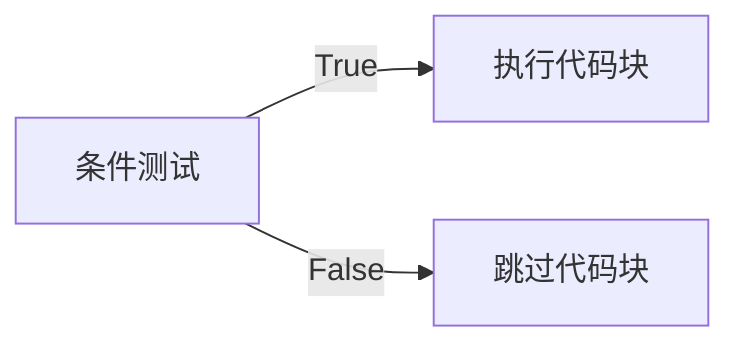
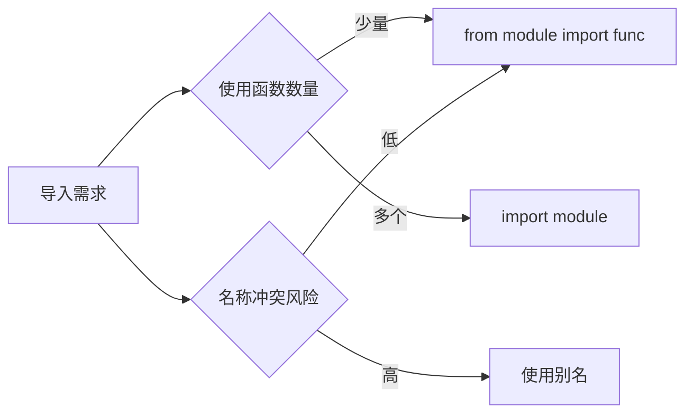
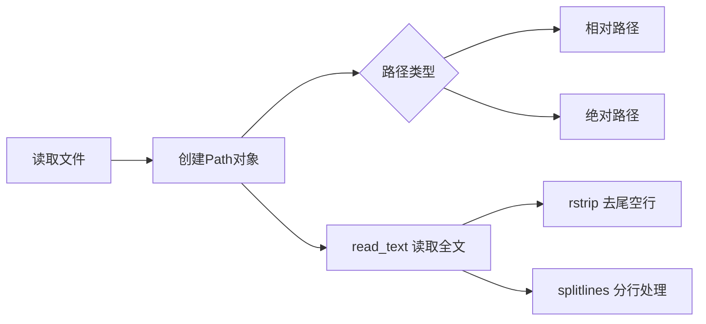
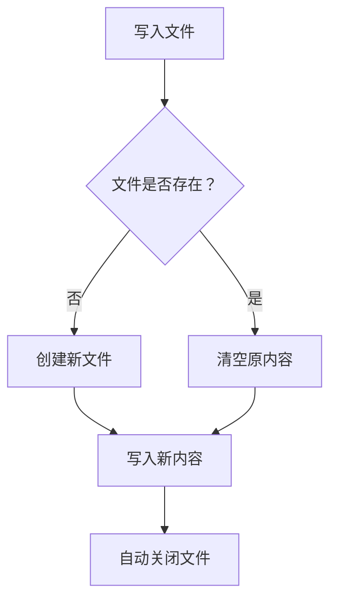

---

---

# python编程：从入门到实战


## 第一章、起步

### 1.1 安装python


**重要提示：**  请务必勾选 `Add Python ... to PATH` 复选框

### 1.2 终端操作

- 在终端中运行python程序：

```shell
python hello_python.py
```

- windows命令

| 命令  | 全称               | 功能描述                 |
| :---- | :----------------- | :----------------------- |
| `cd`  | `change directory` | 切换当前工作目录         |
| `dir` | `directory`        | 显示当前目录中的所有文件 |


## 第二章、变量和简单的数据类型

### 2.1 变量

#### **2.1.1 命名规范**

- **组成规则**：

  - 字母、数字和下划线组成
  - **不能以数字开头**（防止pycharm导入问题）
  - 不能包含空格（可使用下划线分隔单词）

- **注意事项**：

  - 避免与Python关键字和函数名重名
  - 慎用小写字母 `l` 和大写字母 `O`（易与数字 `1` 和 `0` 混淆）
  - 区分大小写（`Andy ≠ andy`）

- **命名建议**：

  > 推荐使用小写字母命名变量。虽然大写不会导致错误，但在Python中有特殊含义（将在后续章节讨论）


#### **2.1.2 变量定义**

在Python中，每个变量在使用前都必须赋值(=)，变量赋值以后该变量才会被创建，可以用其他变量的计算结果来定义变量：**`money = price * weight`**


#### **2.1.3 变量的类型**

在 Python 中定义变量时不需要指定类型，Python可以根据 = 等号右侧的值，自动推导出变量中存储数据的类型

| 类型                | 说明                     | 示例             |
| :------------------ | :----------------------- | :--------------- |
| **数字型**- int     | 整数                     | `42`             |
| **数字型**- float   | 浮点数                   | `3.14`           |
| **数字型**- complex | 复数（科学计算）         | `3+5j`           |
| **bool**            | 布尔值（True/False）     | `True`（非零值） |
| **非数字**          | 字符串、列表、元组、字典 | `"Hello"`        |


#### **2.1.4 类型间运算规则**

- **数字型变量**：可直接计算

```python
a = 10
b = 3.5
print(a + b)  # 输出 13.5
```

- **字符串变量**：

  - `+` 拼接字符串

  ```python
  print("Hello" + "World")  # 输出 HelloWorld
  ```

  - `*` 重复字符串

  ```python
  print("Hi" * 3)  # 输出 HiHiHi
  ```

- **禁止操作**：

```python
# 数字型变量和字符串之间不能进行其他计算
print(10 + "apples")  # TypeError
```


#### 2.1.5 输入与输出

**输入函数**：

如果要获取用户在键盘上的输入信息，需要使用到 input 函数，用户输入的任何内容 Python 都认为是一个字符串，可以转换。

```python
name = input("请输入姓名：")  # 所有输入均为字符串类型
age = int(input("请输入年龄："))  # 类型转换
```


**格式化输出**：`%` 被称为格式化操作符

**基本用法**

1. **语法**：`"格式化字符串" % 值` 或 `"格式化字符串" % (值1, 值2, ...)`
2. **示例**：

```python
name = "Alice"
age = 25
print("Name: %s, Age: %d" % (name, age))  # 输出：Name: Alice, Age: 25
```

| 说明符 | 类型             | 示例              | 输出      |
| :----- | :--------------- | :---------------- | :-------- |
| `%s`   | 字符串           | `"%s" % "Hello"`  | `"Hello"` |
| `%d`   | 整数             | `"%d" % 42`       | `"42"`    |
| `%f`   | 浮点数           | `"%.2f" % 3.1415` | `"3.14"`  |
| `%x`   | 十六进制（小写） | `"%x" % 255`      | `"ff"`    |
| `%X`   | 十六进制（大写） | `"%X" % 255`      | `"FF"`    |
| `%o`   | 八进制           | `"%o" % 8`        | `"10"`    |


### 2.2 字符串

#### 2.2.1 基本特性

- 单引号或双引号均可定义(这种灵活性让你能够在字符串中包含引号)

```python
s1 = '单引号字符串'
s2 = "双引号字符串（可包含'单引号'）"
```

#### 2.2.2 常用方法

| 方法             | 功能           | 示例                                      | 结果            |
| :--------------- | :------------- | :---------------------------------------- | :-------------- |
| `title()`        | 单词首字母大写 | `"hello world".title()`                   | `"Hello World"` |
| `upper()`        | 全大写         | `"python".upper()`                        | `"PYTHON"`      |
| `lower()`        | 全小写         | `"TEXT".lower()`                          | `"text"`        |
| `strip()`        | 移除两端空白   | `" text ".strip()`                        | `"text"`        |
| `lstrip()`       | 移除左侧空白   | `" text ".lstrip()`                       | `"text "`       |
| `rstrip()`       | 移除右侧空白   | `" text ".rstrip()`                       | `" text"`       |
| `removeprefix()` | 移除前缀       | `"https://site".removeprefix("https://")` | `"site"`        |
| `removesuffix()` | 移除后缀       | `"file.txt".removesuffix(".txt")`         | `"file"`        |

> 在存储数据时，lower() ⽅法很有⽤。⽤户通常不能像你期望的那样提供正确的⼤⼩写，因此需要将字符串先转换为全⼩写的再存储。以后需要显⽰这些信息时，再将其转换为最合适的⼤⼩写⽅式即可。

#### 2.2.3 f-string（格式化字符串）

在字符串中使用变量：要在字符串中插⼊变量的值，可先在左引号前加上字⺟ f，再将要插⼊的变量放在花括号内。这样，Python 在显⽰字符串时，将把每个变量都替换为其值。

```python
name = "Bob"
age = 30
print(f"{name}今年{age}岁")  # 输出：Bob今年30岁
```

#### 2.2.4 空白字符处理

- 常见空白字符：空格、制表符 `\t`、换行符 `\n`
- 删除空白：

```python
text = "\t重要内容\n"
print(text.strip())  # 输出："重要内容"
```

`strip()` 、`lstrip()`、`rstrip()`方法对字符串的操作是暂时的，因为它**不会直接修改原字符串**。字符串在 Python 中属于不可变对象（immutable），**所有看似"修改"字符串的方法**（如 `strip()`、`lower()` 等）实际上都是**返回处理后的新字符串副本**。

| 操作                  | 原字符串是否改变 | 结果保存方式                  |
| :-------------------- | :--------------- | :---------------------------- |
| `text.strip()`        | ❌ 不变           | 需赋值：`text = text.strip()` |
| `text = text.strip()` | ✅ 改变           | 变量指向新字符串              |

> 📌 **最佳实践**：每次调用字符串方法后，如需保留结果，必须显式赋值给变量。

#### 2.2.5 成员检测

```python
if 'a' in 'apple':   # True
if 'ab' in 'abc':    # True
if 'xz' in 'abc':    # False
```


### 2.3 数值类型

#### 2.3.1 整数运算

```python
print(3 + 2)    # 加法 → 5
print(3 - 2)    # 减法 → 1
print(3 * 2)    # 乘法 → 6
print(3 / 2)    # 除法 → 1.5
print(3 ** 2)   # 乘方 → 9

# 可以通过使用括号来改变计算的优先级
print((3 + 2) * 4)  # 使用括号 → 20
```

#### 2.3.2 浮点数特性

```python
print(0.1 + 0.2)  # 输出 0.30000000000000004（浮点精度问题）
```

> 需要注意的是，结果包含的⼩数位数可能是不确定的，所有编程语⾔都存在这种问题，没有什么可担⼼的。Python 会尽⼒找到⼀种精确地表⽰结果的⽅式，但鉴于计算机内部表⽰数字的⽅式，这在有些情况下很难。就现在⽽⾔，暂时忽略多余的⼩数位数即可。

#### 2.3.3 混合运算规则

- 两数相除 → **总是返回浮点数**，即便这两个数都是整数且能整除

```python
print(4 / 2)  # 输出 2.0
```

- 整数与浮点数运算 → **总是返回浮点数**

```python
print(3 + 2.5)  # 输出 5.5
```

#### 2.3.4 数值表示技巧

**使用下划线增强可读性**：

```python
# Python会忽略数值中的下划线
big_number = 1_000_000     # 等同于 1000000
small_number = 3.141_592   # 等同于 3.141592
```

> 在书写很⼤的数时，可使⽤下划线将其中的位分组，使其更清晰易读。当你打印这种使⽤下划线定义的数字时，Python 不会打印其中的下划线。这是因为在存储这种数时，Python 会忽略其中的下划线。在对数字位分组时，即便不是将每三位分成⼀组，也不会影响最终的值。在 Python 看来，1000 与 1_000 没什么不同，1_000 与 10_00 也没什么不同。这种表⽰法既适⽤于整数，也适⽤于浮点数。

#### 2.3.5 多重赋值

```python
# 同时为多个变量赋值
x, y, z = 1, 2, 3
print(x, y, z)  # 输出 1 2 3
```

> 可在⼀⾏代码中给多个变量赋值，这有助于缩短程序并提⾼其可读性，在这样做时，需要⽤逗号将变量名分开；对于要赋给变量的值，也需要做同样的处理。Python 将按顺序将每个值赋给对应的变量。只要变量数和值的个数相同，Python 就能正确地将变量和值关联起来。

#### 2.3.6 常量约定

常量（constant）是在程序的整个⽣命周期内都保持不变的变量

- Python无内置常量类型
- 约定：**全大写变量名**表示常量

```python
MAX_USERS = 100  # 约定视为常量
```


### 2.4 注释

#### 2.4.1 单行注释

```python
# 这是一个单行注释
price = 99.9  # 价格变量
```

#### 2.4.2 多行注释

```python
"""
这是一个多行注释
可跨越多行
Python解释器会忽略这些内容
"""
```

> 注释的内容会被python解释器忽略


## 第三章、列表

### 3.1 列表简介

#### 3.1.1 列表定义与访问

- **列表定义**：有序元素集合，用方括号 `[]` 表示，⽤逗号分隔其中的元素

```python
colors = ['red', 'green', 'blue']  # 字符串列表
numbers = [1, 3, 5, 7, 9]         # 数值列表
mixed = [1, 'apple', True]         # 混合类型列表
```

- **元素访问**：

要访问列表元素，可指出列表的名称，再指出元素的索引，并将后者放在⽅括号内

| 索引类型 | 示例         | 说明                 |
| :------- | :----------- | :------------------- |
| 正索引   | `colors[0]`  | → 'red' (首个元素)   |
| 负索引   | `colors[-1]` | → 'blue' (末尾元素)  |
| 负索引   | `colors[-2]` | → 'green' (倒数第二) |

> 索引从 0 ⽽不是 1 开始，⼤多数编程语⾔是如此规定的，这与列表操作的底层实现有关。Python 为访问最后⼀个列表元素提供了⼀种特殊语法。通过将索引指定为-1，可让 Python 返回最后⼀个列表元素。这种语法很有⽤，因为你经常需要在不知道列表⻓度的情况下访问最后的元素。这种约定也适⽤于其他负数索引，例如，索引 -2 返回倒数第⼆个列表元素，索引 -3 返回倒数第三个列表元素，依此类推；
>

- **使⽤列表中的各个值**：

你可以像使⽤其他变量⼀样使⽤列表中的各个值。例如，可以使⽤ f 字符串根据列表中的值来创建消息

```python
bicycles = ['trek', 'cannondale', 'redline', 'specialized']
message = f"My first bicycle was a {bicycles[0].title()}."
print(message)
```

#### 3.1.2 列表元素操作

```python
# 修改元素
colors[1] = 'yellow'  # ['red', 'yellow', 'blue']

# 添加元素
colors.append('purple')      # 末尾添加 → ['red', 'yellow', 'blue', 'purple']
colors.insert(1, 'orange')   # 索引1处插入 → ['red', 'orange', 'yellow', 'blue', 'purple']
```


**删除元素方法对比**

使用del、pop、remove方法后，列表发生变化

| 方法/语句       | 特点                     | 示例                     | 返回值   |
| :-------------- | :----------------------- | :----------------------- | :------- |
| `del`           | 按索引删除               | `del colors[0]`          | 无返回值 |
| `pop()`         | 删除末尾元素并返回该元素 | `last = colors.pop()`    | 被删元素 |
| `pop(index)`    | 删除指定索引元素并返回   | `second = colors.pop(1)` | 被删元素 |
| `remove(value)` | 按值删除首个匹配项       | `colors.remove('blue')`  | 无返回值 |

remove() ⽅法只删除第⼀个指定的值。如果要删除的值，可能在列表中出现多次，就需要使⽤循环，确保将每个值都删除。

> **选择指南**：
>
> - 删除后不再使用 → `del` 或 `remove()`
> - 需使用被删除的值 → `pop()`

#### 3.1.3 管理列表

**排序操作**

```python
nums = [3, 1, 4, 2]

# 永久排序
nums.sort()             # 升序 → [1, 2, 3, 4]
nums.sort(reverse=True) # 降序 → [4, 3, 2, 1]

# 临时排序
sorted_nums = sorted(nums)      # 原列表不变，返回排序副本
sorted_nums_desc = sorted(nums, reverse=True)
```

> 注意：在并⾮所有的值都是全⼩写的时，按字⺟顺序排列列表要复杂⼀些。在确定排列顺序时，有多种解读⼤写字⺟的⽅式。

**反转与长度**

```python
# 反转列表顺序
nums.reverse()  # 永久反转 → [2, 4, 1, 3]

# 获取列表长度
count = len(nums)  # → 4
```

> reverse() ⽅法会永久地修改列表元素的排列顺序，但可随时恢复到原来的排列顺序，只需对列表再次调⽤ reverse() 即可


### 3.2 操作列表

#### 3.2.1 遍历列表

```python
fruits = ['apple', 'banana', 'orange']

# 基础遍历
for fruit in fruits:
    print(fruit.title())  # Apple, Banana, Orange

# 带索引遍历
for index, fruit in enumerate(fruits):
    print(f"{index+1}. {fruit}")
```

> 循环结束后，最后fruit变量的值为'orange'。在编写 for 循环时，可以给将依次与列表中的每个值相关联的临时变量指定任意名称。然⽽，选择描述单个列表元素的有意义的名称⼤有裨益。

#### 3.2.2 数值列表生成

##### **1. 基础：`range()` 函数**

Python 的 `range()` 函数用于生成整数序列，遵循 **左闭右开** 原则。

```python
# 生成 0~5（含0，不含6）
range(6)      # 输出序列：0, 1, 2, 3, 4, 5

# 生成 2~5（含2，不含6）
range(2, 6)   # 输出序列：2, 3, 4, 5

# 生成 1~10 的偶数（步长=2）
range(1, 11, 2)  # 输出序列：1, 3, 5, 7, 9
```


##### 2. 使用 `range()` 创建数值列表

通过 `list()` 将 `range()` 结果转换为列表，支持**步长控制**。

```python
# 创建 1~10 的偶数列表
even_numbers = list(range(2, 11, 2))
print(even_numbers)  # 输出：[2, 4, 6, 8, 10]
```


##### 3. 生成任意数值集合

**案例：创建 1~10 的平方列表**

**方法 1：常规循环**

```python
squares = []
for value in range(1, 11):
    square = value**2  # 临时变量存储平方值
    squares.append(square)
print(squares)  # 输出：[1, 4, 9, ..., 100]
```

**方法 2：简化版（省略临时变量）**

```python
squares = []
for value in range(1, 11):
    squares.append(value**2)  # 直接追加结果
```


##### 4.  列表推导式（高效写法）

将循环和元素创建合并为一行代码。
**语法**：
`[表达式 for 变量 in 范围]`

**平方列表的推导式实现**：

```python
squares = [value**2 for value in range(1, 11)]
print(squares)  # 输出：[1, 4, 9, ..., 100]
```


##### 5. 数值列表的统计计算

常用统计函数：

```python
numbers = [5, 2, 9, 1, 7]

print(min(numbers))  # 最小值 → 1
print(max(numbers))  # 最大值 → 9
print(sum(numbers))  # 求和 → 24
print(len(numbers))  # 长度 → 5
```


#### 3.2.3 列表切片与复制

##### 1. 切片基础

通过指定起始索引（包含）和结束索引（不包含）截取列表片段，遵循 **左闭右开** 原则。

**语法**：
`list[start:end:step]`

**示例**：

```python
players = ['charles', 'martina', 'michael', 'florence', 'eli']

# 截取索引1~3（不含3）
print(players[1:3])  # 输出：['martina', 'michael']

# 从头开始到索引3
print(players[:3])   # 输出：['charles', 'martina', 'michael']

# 从索引2到末尾
print(players[2:])   # 输出：['michael', 'florence', 'eli']

# 负数索引（倒数第3到最后）
print(players[-3:])  # 输出：['michael', 'florence', 'eli']

# 步长2（每隔1个元素取1个）
print(players[::2])  # 输出：['charles', 'michael', 'eli']
```


##### 2. 遍历切片

使用 `for` 循环处理切片数据

**应用场景**：

```python
# 游戏得分系统：获取前三高分
all_scores = [78, 92, 85, 88, 95, 79]
all_scores.sort(reverse=True)  # 降序排序
top_scores = all_scores[:3]    # 前三高分

for score in top_scores:
    print(f"🏆 顶级得分：{score}")

# 数据批处理
data = [x for x in range(100)]
batch_size = 10
for i in range(0, len(data), batch_size):
    process_batch(data[i:i+batch_size])

# Web分页显示（每页5条）
articles = ["文章" + str(i) for i in range(1, 21)]
page = 2
print(f"第 {page} 页内容：")
for item in articles[(page-1)*5 : page*5]:
    print(f" • {item}")
```


##### 3. 列表复制

正确复制列表避免引用同一对象

**正确方法**（创建独立副本）：

```python
my_foods = ['pizza', 'falafel', 'carrot cake']
friend_foods = my_foods[:]  # 切片复制

# 验证独立性
my_foods.append('cannoli')
friend_foods.append('ice cream')

print("我的食物:", my_foods)       # 包含'cannoli'
print("朋友的食物:", friend_foods)  # 包含'ice cream'
```

**错误方法**（引用同一对象）：

```python
copy_fail = my_foods  # 仅创建新引用

# 修改会影响原列表
copy_fail.append('sushi')
print(my_foods)  # 原列表也被修改！
```

| 操作类型   | 代码示例        | 结果            |
| :--------- | :-------------- | :-------------- |
| 基础切片   | `list[1:4]`     | 索引1~3的元素   |
| 从头开始   | `list[:3]`      | 前3个元素       |
| 到末尾结束 | `list[2:]`      | 从索引2到末尾   |
| 负数索引   | `list[-3:]`     | 最后3个元素     |
| 带步长     | `list[0:6:2]`   | 索引0,2,4的元素 |
| 全列表复制 | `new = list[:]` | 创建独立副本    |
| 反向复制   | `list[::-1]`    | 创建逆序副本    |
| 间隔采样   | `list[::3]`     | 每3个元素取1个  |


#### 3.2.4 元组

##### 1. 元组基础

元组（Tuple）是**不可变**的有序序列，使用圆括号 `()` 定义
与列表的主要区别：**创建后元素不可修改、添加或删除**

**定义与访问**：

```python
# 标准定义
dimensions = (200, 50)
print(dimensions[0])  # 输出：200

# 单元素元组（必须加逗号）
single_item = ('apple',)  
print(type(single_item))  # 输出：<class 'tuple'>

# 无逗号则视为普通字符串
not_a_tuple = ('apple')
print(type(not_a_tuple))  # 输出：<class 'str'>
```


##### 2. 遍历元组

使用 `for` 循环遍历（语法与列表相同）：

```python
colors = ('red', 'green', 'blue')

# 常规遍历
for color in colors:
    print(f"Color: {color}")

# 带索引遍历
for index, color in enumerate(colors):
    print(f"Index {index}: {color}")
```


##### 3. 元组特性与操作

| 特性         | 说明                         | 示例代码                         |
| :----------- | :--------------------------- | :------------------------------- |
| **不可变性** | 元素创建后不可修改           | `dimensions[0] = 250` ❌ 引发错误 |
| **重新赋值** | 整个元组变量可重新指向新元组 | `dimensions = (300, 100)` ✅      |
| **嵌套结构** | 可包含可变对象（如列表）     | `mixed = (1, [2, 3], 4)`         |
| **元组解包** | 将元组元素赋值给多个变量     | `x, y = (10, 20)`                |
| **切片操作** | 支持切片但返回新元组         | `colors[1:] → ('green', 'blue')` |
| **连接复制** | 使用 `+` 连接 / `*` 复制     | `(1,2) + (3,4) → (1,2,3,4)`      |

**重新赋值示例**：

```python
# 初始元组
dimensions = (200, 50)
print("Original:", dimensions)  # 输出：(200, 50)

# 重新赋值整个元组
dimensions = (400, 100)
print("Modified:", dimensions)  # 输出：(400, 100)
```


##### 4. 元组 vs 列表

| 特性         | 元组                         | 列表                        |
| :----------- | :--------------------------- | :-------------------------- |
| **语法**     | 圆括号 `()`                  | 方括号 `[]`                 |
| **可变性**   | 创建后不可修改               | 可随时修改元素              |
| **性能**     | 内存占用小，访问更快         | 内存占用较大                |
| **适用场景** | 固定数据（如坐标、配置常量） | 动态数据（如待办事项列表）  |
| **方法**     | 仅 `count()`, `index()`      | 支持 `append()`, `pop()` 等 |


##### 5. 最佳实践

- **数据保护**：用元组存储不应修改的关键数据

```python
# 数据库连接配置（主机，端口，用户）
DB_CONFIG = ('db.example.com', 3306, 'admin')
```

- **函数多返回值**：

```python
def get_dimensions():
    return 800, 600  # 自动打包为元组

width, height = get_dimensions()  # 解包赋值
```

- **字典键值**：元组可作为字典键（列表不可）

```python
# 坐标映射到颜色
color_map = {
    (35, 45): 'red',
    (100, 20): 'blue'
}
```

- **格式字符串**：

```python
point = (12, 18)
print("坐标：(%d, %d)" % point)  # 自动解包
```


| 操作     | 代码示例               | 结果               |
| :------- | :--------------------- | :----------------- |
| 创建     | `t = (1, 'a', 3.5)`    | (1, 'a', 3.5)      |
| 访问元素 | `t[1]`                 | 'a'                |
| 切片     | `t[1:]`                | ('a', 3.5)         |
| 长度     | `len(t)`               | 3                  |
| 计数     | `t.count('a')`         | 1                  |
| 索引查询 | `t.index(3.5)`         | 2                  |
| 嵌套访问 | `nested = (1, [2, 3])` | `nested[1][0] = 2` |
| 解包     | `x, y, z = t`          | x=1, y='a', z=3.5  |
| 检查存在 | `'a' in t`             | True               |

> **关键原则**：元组的不可变性提供数据完整性和性能优势，适合存储不应更改的数据集合


#### 3.2.5 避免缩进错误指南

Python根据缩进来判断代码⾏与程序其他部分的关系，常见错误类型及解决方案：

##### 1. 忘记缩进（IndentationError）

**问题**：循环/条件语句后未缩进代码块
**修复**：属于代码块的语句必须统一缩进

```python
# ❌ 错误示例
names = ['Alice', 'Bob']
for name in names:
print(name)  # 缺少缩进

# ✅ 正确写法
for name in names:
    print(name)  # 4空格缩进
```

##### 2. 不必要的缩进（Unexpected Indent）

**问题**：不应在代码块中的语句被缩进
**修复**：确保只有逻辑隶属的代码才缩进

```python
# ❌ 错误示例
message = "Hello"  # 主程序代码
    print(message)  # 不应缩进

# ✅ 正确写法
message = "Hello"
print(message)      # 取消缩进
```

##### 3. 遗漏冒号（SyntaxError）

所有需要定义代码块（缩进部分）的语句，末尾都需要冒号。记住这一点可以覆盖 99% 的情况。编写代码时，只需检查语句是否要引入缩进块，就能避免遗漏冒号的问题。

**问题**：代码块声明语句缺少结尾冒号
**修复**：所有需要代码块的语句必须以 `:` 结尾

```python
# ❌ 错误示例
if x > 5  # 缺少冒号
    print("Large")

# ✅ 正确写法
if x > 5:  # 带冒号
    print("Large")
```

##### 4. 缩进不一致（TabError）

**问题**：混合使用空格和制表符
**修复**：统一使用4空格，配置编辑器转换Tab

```python
# ❌ 错误示例 (→表示Tab)
def test():
→   print("Tab")   # 制表符
    print("Space") # 4空格

# ✅ 正确写法
def test():
    print("Space")  # 全部4空格
    print("Space")
```


#### 3.2.6 PEP 8 格式核心规范

Python 官方风格指南（PEP 8）确保代码一致性和可读性

| 规范类别       | 具体要求                        | 示例/说明                                                    |
| :------------- | :------------------------------ | :----------------------------------------------------------- |
| **缩进**       | 每级缩进使用 **4个空格**        | ✅ 正确： `if condition:`   `print("Done")`                   |
|                | 禁止混合使用制表符(Tab)和空格   | ❌ 错误： `if condition:` `→ print("Mixed")` (→表示Tab)       |
| **行长度**     | 代码行不超过 **80字符**         | 超出时使用括号隐式续行： `result = (value1 + value2`   `- value3)` |
|                | 注释行不超过 **72字符**         | 文档字符串/注释优先换行                                      |
| **空行**       | 函数/类定义间用 **2个空行**分隔 | `python<br>def func1(): ...<br><br><br>def func2(): ...<br>` |
|                | 类内方法间用 **1个空行**分隔    | `python<br>class MyClass:<br> def method1(): ...<br><br> def method2(): ...<br>` |
| **编辑器设置** | 配置Tab键输出空格而非制表符     | VSCode设置：`"editor.insertSpaces": true`                    |
|                | 启用80字符视觉参考线            | PyCharm设置：`Editor → Guides → Right Margin`                |


## 第四章、if语句

### 4.1 条件测试

**核心概念**：值为 `True` 或 `False` 的表达式，控制程序执行路径
**执行逻辑**



#### 4.1.1 测试类型速查表

| 测试类型     | 运算符               | 示例                   | 结果              |
| :----------- | :------------------- | :--------------------- | :---------------- |
| **相等**     | `==`                 | `'Python' == 'python'` | False(区分大小写) |
| **不等**     | `!=`                 | `10 != 5`              | True              |
| **数值比较** | `<`, `<=`, `>`, `>=` | `3.14 >= 3`            | True              |
| **逻辑与**   | `and`                | `(5>3) and (2<4)`      | True              |
| **逻辑或**   | `or`                 | `(5<3) or (2<4)`       | True              |
| **成员存在** | `in`                 | `'a' in ['a','b']`     | True              |
| **成员缺失** | `not in`             | `'x' not in 'text'`    | False             |

> `=`：赋值；`==`：判断是否相等


**布尔表达式**

随着对编程的了解越来越深⼊，你将遇到术语布尔表达式，它不过是条件测试的别名罢了。与条件表达式⼀样，布尔表达式的结果要么为 True，要么为 False。

```python
game_active = True
can_edit = False
```


#### 4.1.2 关键技巧

```python
# 大小写不敏感比较
username = "Admin"
if username.lower() == "admin":  # 转换为小写,lower() ⽅法不会修改存储在变量 username 中的值，因此进⾏这样的⽐较不会影响原来的变量
    print("管理员登录")

# 浮点数安全比较
a = 0.1 + 0.2
b = 0.3
tolerance = 1e-9   # 容差
print(abs(a - b) < tolerance)  # 输出: True

# 空值检测
items = []
if not items:  # 等价于 len(items) == 0
    print("列表为空")
```


### 4.2 if 语句结构

#### 4.2.1 简单 if 语句

**语法**：单条件单操作

```python
age = 18
if age >= 18:
    print("您已成年，可以投票！")
```


#### 4.2.2 if-else 语句

**语法**：二选一执行路径

```python
temperature = 35
if temperature > 30:
    print("高温警告！")
else:
    print("温度正常")
```


#### 4.2.3 if-elif-else 语句

**语法**：多条件分支处理

```python
score = 85

if score >= 90:
    grade = "A"
elif score >= 80:  # 90 > score >= 80
    grade = "B"
elif score >= 70:
    grade = "C"
else:  # 可省略的兜底分支
    grade = "D"

print(f"成绩等级: {grade}")
```

> **最佳实践**：
>
> - 优先使用 `elif` 替代 `else` 避免意外匹配
> - 按条件概率从高到低排列提高效率


#### 4.2.4 多独立条件测试

有时候必须检查你关⼼的所有条件。在这种情况下，应使⽤⼀系列不包含 elif 和 else 代码块的简单 if 语句。在可能有多个条件为True，且需要在每个条件为 True 时都采取相应措施时，适合使⽤这种⽅法。总之，如果只想运⾏⼀个代码块，就使⽤ if-elif-else 语句；如果要运⾏多个代码块，就使⽤⼀系列独⽴的 if 语句。

**适用场景**：需同时检查多个独立条件

```python
# 检查用户权限
is_admin = True
is_moderator = False
is_member = True

if is_admin:
    print("显示管理面板")
    
if is_moderator:
    print("显示审核工具")
    
if is_member:
    print("显示会员内容")
```


### 4.3 列表条件处理

```python
users = ['Alice', 'Bob', 'Admin']

# 检查特殊元素
for user in users:
    if user == 'Admin':
        print(f"欢迎管理员 {user}!")
    else:
        print(f"欢迎用户 {user}")

# 检查空列表
empty_list = []
if empty_list:  # 列表非空时返回True
    print("列表有内容")
else:
    print("列表为空")  # 输出此结果
```

**空值判断规则**：确定列表⾮空

| 数据类型 | 判空条件     | 示例           |
| :------- | :----------- | :------------- |
| 列表     | `if not lst` | `[]` → False   |
| 字符串   | `if not s`   | `""` → False   |
| 元组     | `if not t`   | `()` → False   |
| 字典     | `if not d`   | `{}` → False   |
| 数值     | `if num`     | `0` → False    |
| None     | `if x`       | `None` → False |


### 4.4 if 语句格式规范 (PEP 8)

PEP 8 提供的唯⼀建议是：在诸如 ==、>= 和 <= 等⽐较运算符两边各添加⼀个空格。

```python
# ✅ 正确：运算符两侧加空格
if age >= 18 and score > 60:

# ❌ 错误：运算符粘连
if age>=18 and score>60:
```


## 第五章、字典

### 5.1 使用字典

- **定义**：
  - 字典（dictionary）是一系列**键值对**的集合。
  - 每个**键**与一个**值**关联（键映射到值）。
  - 值可以是数字、字符串、列表、字典或其他任意Python对象。
- **表示**：
  - 字典用花括号 `{}` 表示。
  - 键值对之间用逗号 `,` 分隔。
  - 键和值之间用冒号 `:` 分隔。

```python
alien_0 = {'color': 'green', 'points': 5}  # 示例字典
```

- **访问值**：
  - 指定字典名和键（放在方括号内）。

```python
print(alien_0['color'])  # 输出: green
```

- **添加键值对**：
  - 指定字典名、用方括号括起的新键、以及关联的值。

```py
alien_0['x_position'] = 0
alien_0['y_position'] = 25
print(alien_0)  # 输出包含新键值对的字典
```

> 字典保留元素添加时的顺序。

- **修改值**：
  - 指定字典名、键（方括号内）和新的关联值。

```python
alien_0['color'] = 'yellow'  # 修改 'color' 键的值
print(alien_0['color'])      # 输出: yellow
```

- **删除键值对**：
  - 使用 `del` 语句，指定字典名和要删除的键。

```python
del alien_0['points']  # 永久删除键 'points' 及其关联值
print(alien_0)         # 'points' 键值对已消失
```

- **存储同类对象**：
  - 字典常用于存储多个对象的同一种信息。

```python
favorite_languages = {
    'jen': 'python',
    'sarah': 'c',
    'edward': 'ruby',
    'phil': 'python',  # 最后一个键值对后的逗号是良好实践，便于后续添加
}
```

- **使用 `get()` 访问值**：
  - 避免键不存在时出错（`KeyError`）。
  - 第一个参数是必需的键。
  - 第二个可选参数指定键不存在时返回的默认值（默认为 `None`）。

```python
point_value = alien_0.get('points', 'No point value assigned.')
print(point_value)  # 若'points'已删除，则输出: No point value assigned.

# 不指定默认值
speed = alien_0.get('speed')  # speed 不存在，返回 None
print(speed)                  # 输出: None (不报错)
```


### 5.2 遍历字典

- **遍历所有键值对**：
  - 使用 `for` 循环和 `items()` 方法。
  - 声明两个变量分别接收键和值。

```python
for key, value in alien_0.items():
    print(f"Key: {key}")
    print(f"Value: {value}\n")
```

- **遍历所有键**：
  - 使用 `keys()` 方法。
  - 遍历字典默认就是遍历所有键，`keys()` 常用于明确意图或获取键列表。

```python
# 显式使用 keys()
for name in favorite_languages.keys():
    print(name.title())

# 默认遍历键 (效果相同)
for name in favorite_languages:
    print(name.title())

# 使用键访问值
for name in favorite_languages.keys():
    language = favorite_languages[name]
    print(f"{name.title()}'s favorite language is {language}.")

# 检查键是否存在
if 'erin' not in favorite_languages.keys():
    print("Erin, please take our poll!")
```

- **按特定顺序遍历键**：
  - 在循环中对键列表使用 `sorted()` 函数排序。

```python
for name in sorted(favorite_languages.keys()):
    print(f"{name.title()}, thank you for taking the poll.")
```

- **遍历所有值**：
  - 使用 `values()` 方法。
  - 使用 `set()` 去除重复值。

```python
# 遍历所有值 (包含重复)
print("Languages mentioned:")
for language in favorite_languages.values():
    print(language.title())

# 遍历唯一值 (使用集合 set)
print("\nUnique languages mentioned:")
for language in set(favorite_languages.values()):
    print(language.title())

# 直接创建集合示例
languages_set = {'python', 'c', 'ruby', 'python'}
print(languages_set)  # 输出: {'ruby', 'python', 'c'} (无序且唯一)
```

> 集合和字典很容易混淆，因为它们都是⽤⼀对花括号定义的。当花括号内没有键值对时，定义的很可能是集合。不同于列表和字典，集合不会以特定的顺序存储元素。


### 5.3 嵌套

- **概念**：将字典存储在列表中、将列表存储在字典中、或将字典存储在字典中。
- **字典列表**：
  - 列表中每个元素都是一个字典。

```python
aliens = []  # 创建一个存储外星人的空列表
# 创建30个绿色的外星人
for alien_number in range(30):
    new_alien = {'color': 'green', 'points': 5, 'speed': 'slow'}
    aliens.append(new_alien)

# 修改前三个外星人
for alien in aliens[:3]:
    if alien['color'] == 'green':
        alien['color'] = 'yellow'
        alien['speed'] = 'medium'
        alien['points'] = 10

# 显示前5个外星人
for alien in aliens[:5]:
    print(alien)
print(f"Total number of aliens: {len(aliens)}")
```

- **在字典中存储列表**：

  - 字典的值是一个列表。

  - 访问列表后，可能需要再次遍历。

```python
pizza = {
    'crust': 'thick',
    'toppings': ['mushrooms', 'extra cheese'],  # 键 'toppings' 的值是一个列表
}

# 访问整个列表
print(f"You ordered a {pizza['crust']}-crust pizza "
      "with the following toppings:")  # 长字符串分行写法,当函数调⽤print() 中的字符串很⻓，需要分成多⾏书写时，可以在合适的位置分⾏，在每⾏末尾都加上引号，并且对于除第⼀⾏外的其他各⾏，都在⾏⾸加上引号并缩进。这样，Python 将⾃动合并括号内的所有字符串。

# 遍历存储在字典中的列表
for topping in pizza['toppings']:
    print(f"\t{topping}")
```

- **在字典中存储字典**：
  - 字典的值是另一个字典。

```python
users = {
    'aeinstein': {  # 用户名作为键
        'first': 'albert',      # 值是一个包含用户信息的字典
        'last': 'einstein',
        'location': 'princeton',
    },
    'mcurie': {
        'first': 'marie',
        'last': 'curie',
        'location': 'paris',
    },
}

for username, user_info in users.items():  # 遍历外层字典
    print(f"\nUsername: {username}")
    full_name = f"{user_info['first']} {user_info['last']}"  # 访问内层字典的值
    location = user_info['location']
    print(f"\tFull name: {full_name.title()}")
    print(f"\tLocation: {location.title()}")
```


## 第六章、用户输入和 while 循环

### 6.1 `input()` 函数

#### 6.1.1 工作原理

- 函数作用：暂停程序运行，等待用户输入文本，输入内容会被赋值给变量
- 参数说明：接受一个提示文本（prompt），告知用户需要输入的信息
- 编写清晰的提⽰技巧：
  - 在提示末尾添加空格（如冒号后），分隔提示与用户输入
  - 多行提示的处理：
    ```python
    # 示例：多行提示的写法
    prompt = "请告诉我们您的旅行偏好：" 
    prompt += "\n(输入'quit'可结束)"
    user_input = input(prompt)
    ```


#### **6.1.2 数值输入处理**

- 问题：`input()` 始终返回字符串类型，无法直接用于数值比较
- 解决方案：使用 `int()` 函数转换字符串为整数
  ```python
  age = input("请输入年龄：")
  age = int(age)  # 字符串 → 整数


#### 6.1.3 求模运算符

- 符号：`%`
- 功能：返回两数相除的余数
- 典型应用：奇偶判断


### 6.2 while 循环

| 特性        | 说明                                     |
| :---------- | :--------------------------------------- |
| 与 for 区别 | 持续运行直到条件不满足（非固定次数循环） |
| 基础结构    | `while condition:` + 缩进代码块          |
| 退出控制    | 通过修改循环条件变量或使用 `break`       |
| 避免死循环  | 确保循环条件最终会变为 `False`           |

#### 6.2.1 while循环控制技巧

- **用户主动退出**

```python
message = ""  # 初始化空字符串
while message != 'quit':
    message = input("输入指令：")
    print(message)
```

- **标志位控制**

```python
active = True  # 程序运行标志
while active:
    command = input("> ")
    if command == 'exit':
        active = False  # 安全终止循环
    else:
        print(f"执行命令: {command}")
```

> 在要求满⾜很多条件才继续运⾏的程序中，可定义⼀个变量，⽤于判断整个程序是否处于活动状态。这个变量称为标志（flag），充当程序的交通信号灯。可以让程序在标志为 True 时继续运⾏，并在任何事件导致标志的值为 False 时让程序停⽌运⾏。这样，在 while 语句中就只需检查⼀个条件：标志的当前值是否为 True。然后将所有测试（是否发⽣了应将标志设置为 False 的事件）都放在其他地⽅，从⽽让程序更整洁。

- **中断与跳过**

  - `break`：立即退出整个循环

  - `continue`：跳过本次迭代，返回循环开头

```python
# 打印 1-10 的奇数
num = 0
while num < 10:
    num += 1
    if num % 2 == 0: 
        continue  # 跳过偶数
    print(num)
```

> 注意：在所有 Python 循环中都可使⽤ break 语句。例如，可使⽤break 语句来退出遍历列表或字典的 for 循环


### 6.3 while循环处理列表和字典

> **注意**：遍历时修改列表应使用 `while` 而非 `for`，避免元素跟踪错误。for 循环是⼀种遍历列表的有效⽅式，但不应该在 for 循环中修改列表，否则将导致 Python 难以跟踪其中的元素。要在遍历列表的同时修改它，可使⽤ while 循环。

#### 6.3.1 列表操作示例

- **元素迁移**

```python
unverified = ['user1', 'user2', 'user3']
verified = []

while unverified:
    current = unverified.pop()
    print(f"验证用户: {current}")
    verified.append(current)
```

- **删除特定值**

```python
pets = ['dog', 'cat', 'goldfish', 'cat', 'rabbit']
while 'cat' in pets:
    pets.remove('cat')  # 删除所有'cat'
```


#### 6.3.2 字典动态填充

```python
responses = {}
while True:
    name = input("\n姓名：")
    answer = input("喜欢的编程语言：")
    responses[name] = answer  # 动态添加键值对
    
    repeat = input("继续添加？(yes/no)")
    if repeat == 'no':
        break
```


### 6.4 最佳实践总结

| 场景           | 推荐方案               |
| :------------- | :--------------------- |
| 简单循环       | `for` 循环             |
| 未知次数的循环 | `while` + 条件判断     |
| 多退出条件     | 标志位 (`active=True`) |
| 立即终止循环   | `break` 语句           |
| 跳过单次迭代   | `continue` 语句        |
| 遍历时修改集合 | `while` 循环           |


## 第七章、函数

### 7.1 定义函数
```python
def greet_user():  # 函数定义以 def 开头，括号内可为空
    """显示简单的问候语"""  # 文档字符串（docstring）
    print("Hello!")  # 函数体必须缩进

# 调用函数
greet_user()
```

> **函数设计原则**：
>
> - 单个函数专注单一任务
> - 通过参数传递数据而非全局变量

#### 7.1.1 向函数传递信息

```python
def greet_user(username):  # 添加形参
    print(f"Hello, {username.title()}!")

greet_user('jesse')  # 传递实参
```

| 术语     | 说明                   | 示例       |
| :------- | :--------------------- | :--------- |
| **形参** | 函数定义中声明的变量   | `username` |
| **实参** | 调用函数时传入的具体值 | `'jesse'`  |


### 7.2 传递实参的三种方式

#### ▶ 位置实参（顺序敏感）

```python
def describe_pet(animal_type, pet_name):
    print(f"\nI have a {animal_type} named {pet_name}.")

describe_pet('hamster', 'harry')  # 顺序必须匹配
```

#### ▶ 关键字实参（顺序无关）

```python
describe_pet(pet_name='harry', animal_type='hamster')  # 显式指定参数名
```

> 其中每个实参都由变量名和值组成。

#### ▶ 默认参数值

```python
def describe_pet(pet_name, animal_type='dog'):  # 默认参数必须在后
    print(f"\nI have a {animal_type} named {pet_name}.")

describe_pet('willie')          # 使用默认类型'dog'
describe_pet('harry', 'hamster')# 覆盖默认值
```

> 注意：当使⽤默认值时，必须在形参列表中先列出没有默认值的形参，再列出有默认值的形参。这让 Python 依然能够正确地解读位置实参。


**等效的函数调用**

鉴于可混合使⽤位置实参、关键字实参和默认值，通常有多种等效的函数调⽤⽅式。

```python
def describe_pet(pet_name, animal_type='dog'):  # 默认参数必须在后
    print(f"\nI have a {animal_type} named {pet_name}.")
    
# 以下调用效果相同
describe_pet('willie')
describe_pet(pet_name='willie')

describe_pet('harry', 'hamster')
describe_pet(pet_name='harry', animal_type='hamster')
describe_pet(animal_type='hamster', pet_name='harry')
```

> 基于这种定义，在任何情况下都必须给 pet_name 提供实参。在指定该实参时，既可以使⽤位置实参，也可以使⽤关键字实参。如果要描述的动物不是⼩狗，还必须在函数调⽤中给 animal_type 提供实参。同样，在指定该实参时，既可以使⽤位置实参，也可以使⽤关键字实参。


### 7.3 返回值处理

在函数中，可以使⽤ return 语句将值返回到调⽤函数的那⾏代码。返回值让你能够将程序的⼤部分繁重⼯作移到函数中完成，从⽽简化主程序。

#### 7.3.1 返回简单值

```python
def get_formatted_name(first, last):
    return f"{first.title()} {last.title()}"

name = get_formatted_name('jimi', 'hendrix')
```

#### 7.3.2 可选参数处理

```python
def get_formatted_name(first, last, middle=''):  # 中间名可选
    if middle:
        return f"{first} {middle} {last}"
    return f"{first} {last}"

print(get_formatted_name('john', 'doe'))         # John Doe
print(get_formatted_name('john', 'doe', 'lee'))  # John Lee Doe
```

#### 7.3.3 返回字典

函数可返回任何类型的值，包括列表和字典等较为复杂的数据结构。

```python
def build_person(first, last, age=None):  # None表示空值
    person = {'first': first, 'last': last}
    if age:
        person['age'] = age
    return person

print(build_person('jimi', 'hendrix', 27))
# 输出：{'first': 'jimi', 'last': 'hendrix', 'age': 27}
```

> 在函数定义中，新增了⼀个可选形参 age，其默认值被设置为特殊值 None（表⽰变量没有值）。可将 None 视为占位值。在条件测试中，None 相当于 False。


### 7.4 传递列表给函数

#### 7.4.1 核心用途

- 允许函数直接访问列表内容（名字、数值、字典等复杂对象）。
- 便于批量处理数据，提高代码复用性。

#### **7.4.2 在函数中修改列表**

- **永久性修改**
  函数内对列表的修改会直接影响原始列表（适用于高效处理大数据）。
- **代码组织最佳实践**

```python
# 示例：拆分职责的函数设计
def print_models(unprinted, completed):  # 处理打印任务
    while unprinted:
        current = unprinted.pop()
        print(f"Printing: {current}")
        completed.append(current)

def show_completed(completed):           # 显示结果
    print("\nCompleted models:")
    for model in completed:
        print(f"- {model}")

# 主程序逻辑清晰
unprinted_designs = ["model_A", "model_B"]
completed_models = []
print_models(unprinted_designs, completed_models)
show_completed(completed_models)
```

- **优势**
  - ✅ **可读性**：主程序逻辑一目了然
  - ✅ **可扩展**：新增打印任务只需调用 `print_models()`
  - ✅ **易维护**：修改打印逻辑只需调整一个函数
  - ✅ **单一职责**：每个函数专注独立任务（打印 vs 展示结果）


#### **7.4.3 禁止函数修改列表**

- **解决方案**：传递**列表副本**而非原始列表

```python
function_name(list_name[:])  # 使用切片 [:] 创建副本
```

- **注意事项**

| **操作**       | **内存/时间开销**  | **适用场景**               |
| :------------- | :----------------- | :------------------------- |
| 传递原始列表   | 低（推荐）         | 需直接修改列表的大数据处理 |
| 传递副本 `[:]` | 高（创建副本开销） | 必须保留原始列表不被修改时 |

> **效率提示**：虽然向函数传递列表的副本可保留原始列表的内容，但除⾮有充分的理由，否则还是应该将原始列表传递给函数。这是因为，让函数使⽤现成的列表可避免花时间和内存创建副本，从⽽提⾼效率，在处理⼤型列表时尤其如此。


### 7.5 **传递任意数量的实参**

#### **7.5.1 使用元组接收任意数量位置实参**

- **核心语法**：`*形参名`（如 `*toppings`）
- **原理**：
  Python 自动将传入的**所有位置实参**打包成**元组**
- **应用场景**：
  需要处理数量未知的同类参数（如披萨配料）
- **示例**：

```python
def make_pizza(*toppings):
    print("配料：")
    for topping in toppings:
        print(f"- {topping}")

make_pizza('蘑菇', '芝士', '橄榄')  # 可接受任意数量参数
```

#### **7.5.2 组合使用位置实参与任意数量实参**

- **关键规则**：
  **任意数量形参必须放在最后**
- **执行顺序**：
  1. 优先匹配位置实参
  2. 剩余实参收集到元组形参
- **行业惯例**：
  常用 `*args` 作为形参名（args = arguments）
- **示例**：

```python
def make_pizza(size, *toppings):  # size 必须在前
    print(f"制作 {size} 英寸披萨，配料：")
    for topping in toppings:
        print(f"- {topping}")

make_pizza(12, '香肠', '洋葱')  # 12 → size, 其余 → toppings
```

#### **7.5.3 使用字典接收任意数量关键字实参**

- **核心语法**：`**形参名`（如 `**user_info`）
- **原理**：
  Python 将传入的**关键字实参**打包成**字典**
- **应用场景**：
  需要灵活收集键值对信息（如用户资料）
- **行业惯例**：
  常用 `**kwargs` 作为形参名（kwargs = keyword arguments）
- **示例**：

```python
def build_profile(first, last, **user_info):
    profile = {'first_name': first, 'last_name': last}
    for key, value in user_info.items():  # 遍历额外参数
        profile[key] = value
    return profile

user = build_profile('张', '伟', 年龄=30, 职业='工程师', 城市='北京')
```

#### **7.5.4 参数处理优先级**

函数定义中参数的**标准顺序**：

```python
def 函数名(位置参数, *args, 默认参数, **kwargs):
```

1. 普通位置参数（必需）
2. 任意位置参数（`*args`）
3. 默认值参数（可选）
4. 任意关键字参数（`**kwargs`）

> **记忆口诀**：先位置，再元组，后默认，终字典

| **特性**       | `*args` (元组)           | `**kwargs` (字典)          |
| :------------- | :----------------------- | :------------------------- |
| **语法**       | 单星号 (`*`)             | 双星号 (`**`)              |
| **参数类型**   | 位置实参                 | 关键字实参                 |
| **数据结构**   | 元组 (不可变)            | 字典 (键值对)              |
| **典型应用**   | 处理同类项集合（如配料） | 处理属性集合（如用户信息） |
| **位置要求**   | 必须在普通位置参数后     | 必须在所有参数最后         |
| **行业惯例名** | `*args`                  | `**kwargs`                 |

> **注意事项**：虽然灵活，但过度使用会降低代码可读性。当参数结构明确时，应优先使用具名参数。


### 7.6 模块化编程

#### **7.6.1 模块的核心价值**

- **代码解耦**：分离功能代码与主程序逻辑，提升可读性
- **复用性**：可在多个程序中导入使用，避免重复代码
- **封装性**：隐藏实现细节，聚焦高层逻辑

#### **7.6.2 模块创建与导入**

- **模块定义**：`.py` 文件（如 `pizza.py`）
- **导入方式**：

```python
# pizza.py
def make_pizza(size, toppings):
    print(f"Making {size}cm pizza with {toppings}")

# 导入整个模块
import pizza
pizza.make_pizza(12, '蘑菇')

# 导入特定函数
from pizza import make_pizza
make_pizza(10, '橄榄')  # 无需模块名前缀

# 导入所有函数（慎用）
from pizza import *
make_pizza(8, '香肠')
```

#### **7.6.3 别名机制**

| **类型** | **语法**                           | **使用场景**           |
| :------- | :--------------------------------- | :--------------------- |
| 函数别名 | `from module import func as alias` | 解决长函数名或命名冲突 |
| 模块别名 | `import module as alias`           | 简化长模块名调用       |

```python
# 函数别名示例
from pizza import make_pizza as mp
mp(12, '芝士')

# 模块别名示例
import pizza as p
p.make_pizza(10, '洋葱')
```

#### 7.6.4 导入方式对比

| **方法**               | **语法**               | **优点**           | **缺点**         |
| :--------------------- | :--------------------- | :----------------- | :--------------- |
| 导入整个模块           | `import module`        | 避免命名冲突       | 调用需写模块前缀 |
| 导入特定函数           | `from m import f1, f2` | 直接调用函数       | 可能引发命名冲突 |
| 导入所有函数（不推荐） | `from m import *`      | 无需前缀调用       | 高风险命名覆盖   |
| 别名导入               | `import m as alias`    | 平衡安全性与便捷性 | 需记忆别名       |

#### **7.6.5 最佳实践指南**

- **模块命名规范**：
  - 使用小写字母和下划线（`data_utils.py`）
  - 避免与Python内置模块重名
- **导入策略选择**：



- **避免 `import \*` 的场景**：
  - 大型第三方库（如 `numpy`, `pandas`）
  - 多人协作项目
  - 存在同名函数/变量的情况

- **模块化开发原则**：

  - 单一职责：每个模块专注特定功能域

  - 分层组织：

```tex
project/
├── main.py
├── utils/
│   ├── file_io.py
│   └── math_tools.py
└── core/
    └── business_logic.py
```

> **关键警告**：
> 在专业开发中，`from module import *` 被视为**反模式**，因其可能导致：
>
> - 难以追踪的函数来源
> - 意外的名称覆盖（特别是版本升级时）
> - 调试困难（同名的不同函数冲突）


### 7.7 函数编写规范

#### 7.7.1 命名规范

- **函数命名**：
  - 使用**全小写字母** + **下划线**命名法（蛇形命名法）
  - 必须具有**描述性**（通过名称即可理解函数功能）
  - 避免数字开头：`3get_d_model()` ❌ → `get_3d_model()` ✅

```python
# 合规示例
def calculate_average_score():
def process_user_data():

# 违规示例
def func1():  # 无意义名称
def CalculateTotal():  # 大写开头
```

#### 7.7.2 文档注释规范

- **位置要求**：紧贴函数定义下方
- **格式要求**：使用**三引号文档字符串**（docstring）

```python
def convert_temperature(celsius):
    """
    将摄氏温度转换为华氏温度
    参数：celsius (float) - 摄氏温度值
    返回：float - 对应的华氏温度值
    """
    return (celsius * 9/5) + 32
```

#### 7.7.3 参数格式规范

| **场景**       | **规范**             | **示例**                      |
| :------------- | :------------------- | :---------------------------- |
| 默认参数定义   | 等号**两侧不加空格** | `def enroll(name, age=18):`   |
| 关键字参数调用 | 等号**两侧不加空格** | `enroll(name="小明", age=20)` |
| 长参数列表     | 换行+双缩进对齐      | 见下方代码示例                |

**长参数列表处理**：

```python
def create_user(
        username,  # ← 换行后双缩进
        email, 
        password,
        is_admin=False):  # ← 保持参数对齐
    """创建新用户账户"""
    # 函数体单缩进...
```

#### 7.7.4 代码布局规范

- **行长度限制**：
  - 严格遵循 **79字符** 行宽限制（PEP 8）
  - 超长处理方案：
    - 参数列表换行
    - 数学运算符前换行

```python
total = (variable_one 
         + variable_two 
         - variable_three)
```

- **函数间距**：
  - 函数之间保持 **2个空行** 分隔

```python
def function_one():
    ...


def function_two():  # ← 两个空行上方
    ...
```

- **导入语句位置**：
  - 所有 `import` 必须置于**文件开头**
  - 仅允许文件描述注释在导入之前：

```python
"""用户管理系统 v1.2 - 主程序模块"""

import sys
import database
from utils import helpers
```

| **实践**   | **推荐做法**             | **应避免做法**             |
| :--------- | :----------------------- | :------------------------- |
| 函数命名   | `process_raw_data()`     | `ProcessData()`            |
| 参数默认值 | `def send(msg, retry=3)` | `def send(msg, retry = 3)` |
| 函数间距   | 两个空行分隔             | 无分隔/单个空行            |
| 导入位置   | 文件顶部集中导入         | 在函数内部随意导入         |
| 长参数处理 | 换行+垂直对齐            | 单行超长不处理             |


## 第八章、类

### 8.1 创建和使用类

#### 8.1.1 **定义类**

- **命名规范**：首字母大写的名称表示类（如 `Dog`）
- **组成要素**：属性（数据） + 方法（行为）
- **示例**：

```python
class Dog:  
    """模拟小狗的类"""  
    
    def __init__(self, name, age):  
        """初始化属性 name 和 age"""  
        self.name = name  # 实例属性  
        self.age = age    
    
    def sit(self):  
        """模拟小狗坐下"""  
        print(f"{self.name} is now sitting.")  
    
    def roll_over(self):  
        """模拟小狗打滚"""  
        print(f"{self.name} rolled over!")
```


#### 8.1.2 **`__init__()` 方法**

- **作用**：创建类实例时自动调用（构造函数）
- **关键规则**：
  - **双下划线约定**：必须命名为 `__init__`（两侧各两个下划线）
  - **`self` 参数**：
    - 必须作为第一个形参
    - 指向实例自身的引用，用于访问类属性和方法
    - 调用时由 Python 自动传递，无需手动传入
- **定义属性**：
  - 通过 `self.属性名` 定义（如 `self.name`）
  - 属性可被类中所有方法访问

> 在这个⽅法的定义中，形参 self 必不可少，⽽且必须位于其他形参的前⾯。为何必须在⽅法定义中包含形参 self 呢？因为当 Python 调⽤这个⽅法来创建 Dog 实例时，将⾃动传⼊实参 self。每个与实例相关联的⽅法调⽤都会⾃动传递实参 self，该实参是⼀个指向实例本⾝的引⽤，让实例能够访问类中的属性和⽅法。


#### 8.1.3 **创建实例**

- **语法**：`实例名 = 类名(参数)`
- **示例**：

```python
my_dog = Dog('Willie', 6)   # 创建 Dog 实例
```

- **命名约定**：
  - 类名首字母大写（`Dog`）
  - 实例名全小写（`my_dog`）


#### 8.1.4 **访问属性和方法**

- **访问属性**：`实例名.属性名`

```python
print(my_dog.name)  # 输出：Willie
```

- **调用方法**：`实例名.方法名()`

```python
my_dog.sit()       # 输出：Willie is now sitting.
```

> 在 Dog 类中引⽤这个属性时，使⽤的是`self.name`；在 Dog 类中引⽤这个方法时，使⽤的是`self.sit()`


#### 8.1.5 **多个实例的特性**

- 每个实例独立存储属性
- 相同属性值的实例仍是不同对象

```python
your_dog = Dog('Lucy', 3)  # 新实例，与 my_dog 无关
your_dog.roll_over()       # 输出：Lucy rolled over!
```


💡 核心概念总结

| **概念**       | **说明**                                             |
| :------------- | :--------------------------------------------------- |
| **类**         | 创建对象的蓝图，包含属性（数据）和方法（行为）       |
| **`__init__`** | 初始化方法，创建实例时自动调用，用于定义属性         |
| **`self`**     | 指向实例自身的引用，是类方法的第一个参数（隐式传递） |
| **属性**       | 通过 `self.属性名` 定义，每个实例拥有独立的属性值    |
| **实例**       | 根据类创建的具体对象，可独立操作属性和方法           |

> ✅ **要点**：
>
> - 类名首字母大写，实例名全小写
> - `__init__` 是构造实例的关键方法
> - 方法必须包含 `self` 参数以访问实例属性
> - 不同实例的属性互不影响


### 8.2 使用类和实例

#### 1. 类的基本使用

- **模拟现实场景**：通过类创建对象表示现实世界实体（如 `Car` 类）

```python
class Car:  
    def __init__(self, make, model, year):  
        self.make = make      # 制造商  
        self.model = model    # 型号  
        self.year = year      # 年份  
        self.odometer = 0     # 默认属性值（里程表）  
    
    def get_descriptive_name(self):  
        """访问属性值"""  
        return f"{self.year} {self.make} {self.model}"

# 创建实例  
my_car = Car('Tesla', 'Model S', 2023)
print(my_car.get_descriptive_name())  # 输出：2023 Tesla Model S
```


#### 2. **属性默认值设置**

- **定义方式**：在 `__init__()` 方法中直接赋值
- **特点**：
  - 无需通过形参传入
  - 所有实例共享相同的初始值

```python
def __init__(self, make, model, year):
    ...
    self.odometer = 0  # 里程表默认值为0
```


#### 3. **修改属性值的三种方式**

##### **➤ 直接修改**

```python
my_car = Car("Tesla", "Model S", 2023)
my_car.odometer = 100  # 直接赋值修改
```

##### **➤ 通过方法修改**

- 封装逻辑避免直接操作属性，提高可控性。

```python
class Car:
    ...
    def update_odometer(self, mileage):
        if mileage >= self.odometer:
            self.odometer = mileage  # 通过方法内部更新
        else:
            print("里程数不允许回退！")
```

##### **➤ 通过方法递增**

- 适用于增量式更新场景。

```python
class Car:
    ...
    def increment_odometer(self, miles):
        self.odometer += miles  # 递增特定值
```

> ✅ **最佳实践**：
>
> - 优先使用方法修改属性（封装性更好）
> - 在方法中添加逻辑验证（如检查里程表是否回退）：
>
> ```python
> def update_odometer(self, mileage):
>     if mileage >= self.odometer:  # 防止里程回溯
>         self.odometer = mileage
>     else:
>         print("You can't roll back an odometer!")
> ```


### 8.3 继承

#### **1. 继承的核心概念**

- **作用**：当新类是现有类的特殊版本时，可通过继承复用代码。（如 `ElectricCar` 继承 `Car`）。
- 关系：
  - **父类 (Parent Class)**：被继承的基类（如 `Car`）
  - **子类 (Child Class)**：继承父类的新类（如 `ElectricCar`），自动获得父类所有属性和方法，并且可扩展自身属性和方法


#### **2. 子类初始化方法 `__init__()`**

- **必须显式调用父类构造器，确保父类属性被正确初始化**：

```python
class Car:  # 父类必须定义在子类之前
    def __init__(self, make, model, year):
        self.make = make
        self.model = model
        self.year = year

class ElectricCar(Car):  # 声明继承 (Car)
    def __init__(self, make, model, year):
        super().__init__(make, model, year)  # 关键：调用父类初始化
        self.battery_size = 40  # 子类特有属性
```

- `super()` 函数：
  - 动态访问父类方法（超类 superclass 的缩写）
  - 避免硬编码父类名称，提高代码可维护性


#### **3. 子类专属扩展**

- **添加新属性/方法**：

```python
class ElectricCar(Car):
    def __init__(self, make, model, year):
        super().__init__(make, model, year)
        self.battery_size = 75  # 子类特有属性
    
    def describe_battery(self):  # 子类特有方法
        print(f"电池容量: {self.battery_size} kWh")
```

> - 子类新增属性/方法对父类不可见


#### **4. 方法重写 (Method Overriding)**

- 覆盖父类不满足需求的方法：

  ```python
  class ElectricCar(Car):
      def fill_gas_tank(self):  # 重写父类同名方法
          print("电动车没有油箱！")  # 覆盖父类的加油逻辑
  ```

> 原则：保留父类"精华"，重写"糟粕"


#### **5. 组合模式 (Composition)**

- **解决类膨胀问题**：将大类拆分为协作的小类，提升代码可维护性

> **应用场景**：当类过于复杂时（如`ElectricCar`包含大量电池相关逻辑）：

- **实例作为属性**：

```python
class Battery:  # 独立电池类
    def __init__(self, size=75):
        self.size = size
    
    def get_range(self):
        return f"续航里程: {self.size * 3} 公里"

class ElectricCar(Car):
    def __init__(self, make, model, year):
        super().__init__(make, model, year)
        self.battery = Battery()  # 组合：Battery实例作为属性
        
# 使用
my_tesla = ElectricCar("Tesla", "Model S", 2023)
print(my_tesla.battery.get_range())  # 通过属性访问子对象方法
```


**继承总结**

| 概念         | 作用                   | 实现方式                   |
| :----------- | :--------------------- | :------------------------- |
| **继承**     | 复用父类代码           | `class Child(Parent):`     |
| **super()**  | 调用父类初始化         | `super().__init__(params)` |
| **方法重写** | 定制子类特有行为       | 定义与父类同名的方法       |
| **组合**     | 拆分复杂类为多个协同类 | 将其他类的实例作为属性     |

> 通过继承实现代码复用，通过组合构建灵活架构。


**继承 vs 组合 选择指南**

| **特性**     | **继承**                   | **组合**               |
| :----------- | :------------------------- | :--------------------- |
| **关系**     | "是一个" (is-a) 关系       | "有一个" (has-a) 关系  |
| **耦合度**   | 高耦合（子类依赖父类实现） | 低耦合（通过接口交互） |
| **典型场景** | 电动车是汽车的特殊类型     | 汽车有电池组件         |
| **代码复用** | 垂直复用（沿继承链）       | 水平复用（跨模块）     |
| **灵活性**   | 修改父类影响所有子类       | 组件可独立替换         |

> **最佳实践**：优先使用组合处理"部分-整体"关系（如汽车与电池），继承仅用于真正的"父子"分类关系。


### 8.4 导入类

**核心目的**

通过模块化组织类，解决代码臃肿问题，提升可读性和可维护性。

> 随着不断地给类添加功能，⽂件可能变得很⻓，即便妥善地使⽤了继承和组合亦如此。遵循 Python 的整体理念，应该让⽂件尽量整洁。Python 在这⽅⾯提供了帮助，允许你将类存储在模块中，然后在主程序中导⼊所需的模块。


#### **1. 基础导入方法**

##### ➤导入单个类

步骤：

- 将类存入独立模块（如 `car.py`）：

```python
"""模块级文档字符串（描述模块功能）"""
class Car:
    # 类实现...
```

- 主程序导入：

```python
from car import Car  # 导入Car类
my_car = Car()       # 直接使用
```

> **优势**：主程序简洁，逻辑清晰。


##### ➤导入多个类

- **语法**：

```py
from module import ClassA, ClassB, ClassC
```

- **示例**：

```py
from car import Car, ElectricCar  # 从car.py导入多个类
```


#### **2. 模块级导入**

##### ➤导入整个模块

- **语法**：

```py
import module_name
```

- 使用方式

```py
import car
my_car = car.Car()            # 通过模块名访问类
electric_car = car.ElectricCar()
```

> **优点**：避免命名冲突，代码可读性强。


##### ➤导入所有类（不推荐）

- **语法**：

```py
from module import *
```

- 缺点：
  - 难以追溯类来源。
  - 易引发命名冲突（如类名重复）。


#### 3. 进阶用法

##### 1. 模块间依赖管理

- **场景**：有时候，需要将类分散到多个模块中，以免模块太⼤或者在同⼀个模块中存储不相关的类。在将类存储在多个模块中时，你可能会发现⼀个模块中的类依赖于另⼀个模块中的类（继承）。在这种情况下，可在前⼀个模块中导⼊必要的类。
- **解决方案**：在模块A中导入模块B。
- **示例**：

```python
# electric_car.py
from car import Car  # 导入父类Car

class ElectricCar(Car):  # 继承Car类
    # 类实现...
```

##### 2. 使用别名

- 类别名：

  ```python
  from car import ElectricCar as EC  # 简化类名
  my_ecar = EC()
  ```
  
- 模块别名：

  ```python
  import car as c  # 简化模块名
  my_car = c.Car()
  ```


**关键总结**

| **场景**          | **推荐方法**                        | **示例**                            |
| :---------------- | :---------------------------------- | :---------------------------------- |
| 导入单个类        | `from module import Class`          | `from car import Car`               |
| 导入多个类        | `from module import ClassA, ClassB` | `from car import Car, ElectricCar`  |
| 避免命名冲突      | 导入整个模块 + 点语法               | `import car; my_car = car.Car()`    |
| 模块间类依赖      | 在子模块中导入父类                  | `from car import Car`（在子模块中） |
| 简化长模块名/类名 | 使用别名                            | `import long_module as lm`          |

> **提示**：始终在模块顶部添加文档字符串（`"""模块描述..."""`），提升代码可读性。

> ⼀开始应让代码结构尽量简单。⾸先尝试在⼀个⽂件中完成所有的⼯作，确定⼀切都能正确运⾏后，再将类移到独⽴的模块中。如果你喜欢模块和⽂件的交互⽅式，可在项⽬开始时就尝试将类存储到模块中。先找出让你能够编写出可⾏代码的⽅式，再尝试让代码更加整洁。
>


### 8.4 Python 标准库

Python 标准库是⼀组内置模块，在安装 Python 时自动包含。以 `random` 模块为例，其核心函数如下：

🎲 随机数函数

| 函数            | 参数说明                | 功能描述                                     |
| :-------------- | :---------------------- | :------------------------------------------- |
| **`randint()`** | `(a: int, b: int)`      | 随机生成 `a` 和 `b` 之间的整数（含两端边界） |
| **`choice()`**  | `(sequence: 列表/元组)` | 从非空序列中随机返回一个元素                 |

💡 关键特性

1. **边界包含**
   `randint(1, 10)` 可能返回 `1`、`10` 或其间任意整数。
2. **序列支持**
   `choice()` 支持所有序列类型：

```python
# 示例
import random
random.choice(['苹果', '香蕉', '橙子'])   # 可能返回 '香蕉'
random.choice(('红', '蓝', '绿'))        # 可能返回 '蓝'
```

> 📌 **注意**：使用前需通过 `import random` 导入模块。这两个函数是生成随机数据的底层基础工具。


### 8.5 类的编程风格规范

以下Python面向对象编程的核心规范，确保代码清晰易读、风格统一：

#### 📛 命名规范

| 对象类型   | 命名规则                     | 示例                |
| :--------- | :--------------------------- | :------------------ |
| **类名**   | 驼峰命名法（单词首字母大写） | `MyClassName`       |
| **实例名** | 全小写 + 下划线分隔          | `user_profile`      |
| **模块名** | 全小写 + 下划线分隔          | `data_processor.py` |

#### 📝 文档规范

| 对象     | 要求                                                       |
| :------- | :--------------------------------------------------------- |
| **类**   | 类定义后紧跟文档字符串，描述功能（遵循函数文档字符串格式） |
| **模块** | 包含文档字符串，说明模块中类的用途                         |

```python
"""模块文档字符串（描述模块功能）"""  

class MyClass:  
    """类文档字符串（描述类的用途）"""  
      
    def __init__(self):  
        """方法文档字符串（描述方法行为）"""  
```

#### 📋 代码格式规范

1. **空行使用**

   - 类内方法间：用 **1个空行** 分隔

   ```python
   class Example:
       def method1(self):
           ...
   
       def method2(self):  # 方法间空一行
           ...
   ```

   - 模块内类之间：用 **2个空行** 分隔

   ```python
   class ClassA:
       ...
   
   
   class ClassB:  # 两个空行
       ...
   ```

   > 原则：**适度使用，避免过度留白**

2. **import 顺序**

```python
# 1. 先导入标准库模块  
import os  
import sys  
  
# 2. 空行分隔  
  
# 3. 再导入自定义模块  
from my_module import MyClass  
```

> ✅ 作用：明确区分标准库与自定义模块依赖

> 💡 **最佳实践建议**：
>
> 1. 类文档字符串应简明说明类的核心职责
> 2. 避免在单个模块中定义过多类（建议 ≤ 3个）
> 3. 导入自定义模块时使用绝对路径导入
> 4. 方法定义顺序：`__init__` → 其他魔术方法 → 普通方法 → 私有方法


## 第九章、文件和异常

### 9.1 读取文件

#### 9.1.1 读取文件内容

- **一次性读取全部内容**

使用 `pathlib` 模块的 `Path` 对象和 `read_text()` 方法：

```python
from pathlib import Path
path = Path("pi_digits.txt")      # 创建Path对象（同目录下只需文件名）
contents = path.read_text()       # 读取全部内容 → 返回字符串
print(contents.rstrip())          # 用rstrip()删除末尾空行
```

> **关键注意**：
>
> - 读取内容均为字符串，数字需用 `int()`/`float()` 转换。
> - `read_text()` 返回的字符串包含文件末尾换行符，因为 read_text() 在到达⽂件末尾时会返回⼀个空字符串，⽽这个空字符串会被显⽰为⼀个空⾏。`rstrip()` 可消除末尾空行。


- **逐行读取**

结合 `splitlines()` 分割为行列表：

```python
lines = contents.splitlines()     # 按行分割 → 返回字符串列表
for line in lines:                # 逐行处理
    print(line)
```

> **优势**：保留行内空白，无需立即调用 `rstrip()`。


#### 9.1.2 文件路径处理

| **路径类型**     | **说明**                                                     | **示例**                      |
| :--------------- | :----------------------------------------------------------- | :---------------------------- |
| **相对文件路径** | 相对于当前程序所在目录的路径                                 | `Path("text_files/data.txt")` |
| **绝对文件路径** | 系统根目录开始的完整路径                                     | `Path("/home/user/data.txt")` |
| **跨平台兼容性** | 代码中统一使用 **斜杠 `/`**，`pathlib` 自动适配操作系统（Windows 转 `\`） | ✅ 避免直接使用 `\`            |


#### 9.1.3 关键注意事项

- **路径查找规则**：
  - 未指定路径时，Python 默认在当前程序目录查找文件。
- **目录层级访问**：
  - 子目录文件：`Path("sub_dir/file.txt")`
  - 上级目录文件：`Path("../parent_dir/file.txt")`
- **文件存在性检查**（扩展补充）

```python
if path.exists():  # 检查文件是否存在
    contents = path.read_text()
```



**核心要点**：优先使用 `pathlib` 处理路径，`read_text()` + `rstrip()` 满足基础需求，`splitlines()` 实现逐行操作，路径书写保持跨平台兼容性。


### 9.2 写入文件

#### 9.2.1 写入内容

- **单行写入**

```python
from pathlib import Path
path = Path("programming.txt")
path.write_text("Hello World!")  # 写入单个字符串
```

- **关键注意**：
  - 只能写入字符串类型，数值需用 `str()` 转换：

```python
age = 25
path.write_text(str(age))   # 正确写法
```


- **多行写入**
  - 通过换行符 `\n` 连接多行内容：

```python
content = "Line 1\nLine 2\nLine 3"
path.write_text(content)
```


#### 9.2.2 `write_text()` 特性

| **特性**     | **说明**                           | **注意事项**                   |
| :----------- | :--------------------------------- | :----------------------------- |
| **自动创建** | 当目标文件不存在时自动创建         | ✅ 无需预先检查文件存在性       |
| **自动关闭** | 写入完成后自动关闭文件             | ✅ 避免资源泄漏                 |
| **覆盖写入** | 若文件已存在，**清空原内容**后写入 | ⚠️ 重要风险！需特别警惕数据丢失 |
| **原子操作** | 一次性完成内容写入                 | ❌ 不支持追加模式               |


#### 9.2.3 重要注意事项

- **覆盖风险防控**（关键补充）：

```python
if path.exists():                     # 写入前检查文件存在性
    user_confirm = input("文件已存在，确认覆盖？(y/n)")
    if user_confirm.lower() == 'y':
        path.write_text(new_content)
else:
    path.write_text(new_content)
```

- **追加写入方案**（扩展知识）：
  - `write_text()` 不支持追加，需用传统方法：

```python
with open(path, 'a') as file:      # 'a' 表示追加模式
    file.write("新增内容")
```

> **核心要点**：
>
> - `write_text()` 适合简单写入场景，但需警惕**覆盖风险**
> - 多行内容需手动添加 `\n` 换行符
> - 重要数据写入前建议增加存在性检查和用户确认
> - 追加写入需使用 `open()` 的 `'a'` 模式




### 9.3 异常

#### 9.3.1 **异常基础概念**

异常（**Exception**）：Python 用于管理程序执行期间错误的特殊对象

- 发生错误 → Python 创建异常对象
- 未处理异常 → 程序终止并显示 traceback
- 处理异常 → 程序继续运行


#### **9.3.2 异常处理机制**

```python
try:
    # 可能引发异常的代码
    5 / 0
except ZeroDivisionError:
    # 异常处理代码
    print("不能除以零！")
```

- 执行流程：
  1. 尝试执行 `try` 代码块
  2. 若发生异常 → 跳转至匹配的 `except` 块
  3. 若无异常 → 跳过 `except` 块
  4. 如果 `try-except` 代码块后⾯还有其他代码，程序将继续运⾏，因为Python 已经知道了如何处理错误。


#### **9.3.3 常见异常类型**

| 异常类型            | 触发场景   | 处理示例                    |
| :------------------ | :--------- | :-------------------------- |
| `ZeroDivisionError` | 除数为零   | `except ZeroDivisionError:` |
| `FileNotFoundError` | 文件不存在 | `except FileNotFoundError:` |


#### **9.3.4 高级处理技巧**

- **else 代码块** - 仅在 try 成功时执行

```python
try:
    result = 10 / 2
except ZeroDivisionError:
    print("除零错误")
else:
    print(f"结果: {result}")  # 仅当无异常时执行
```

- **静默失败** - 使用 `pass` 忽略异常

```python
try:
    open("missing.txt")
except FileNotFoundError:
    pass  # 文件不存在时不报错
```

- **多文件处理** - 确保单个文件错误不影响整体

```python
files = ["alice.txt", "siddhartha.txt"]
for file in files:
    try:
        content = Path(file).read_text()
    except FileNotFoundError:
        print(f"{file} 不存在")  # 跳过该文件继续处理其他
    else:
        analyze(content)  # 文件存在时执行分析
```


#### **9.3.5 最佳实践**

- **精准捕获**：指定具体异常类型（避免裸 `except:`）
- **用户友好**：用清晰提示替代 traceback

```python
except FileNotFoundError:
    print("错误：请检查文件名是否正确")
```

- **资源清理**：结合 `finally` 块释放资源（未在笔记中提及但重要）
- **错误隔离**：多文件/任务操作时单独处理每个项

> **关键原则**：异常处理应使程序在错误发生后仍能优雅运行，并提供可操作的错误信息。


### 9.4 存储数据

很多程序要求⽤户输⼊某种信息，不管专注点是什么，程序都会把⽤户提供的信息存储在列表和字典等数据结构中，当⽤户关闭程序时，⼏乎总是要保存他们提供的信息。⼀种简单的⽅式是使⽤模块 json 来存储数据。

#### **9.4.1 JSON 基础概念**

- **核心作用**：实现 Python 数据结构 ↔ JSON 格式的双向转换
- **核心模块**：`import json`
- **文件格式**：使用 `.json` 扩展名标识 JSON 数据文件
- **核心价值**：程序关闭后仍能保存用户数据


#### **9.4.2 JSON 核心操作**

| 操作              | 函数                | 功能描述                       | 示例                                      |
| :---------------- | :------------------ | :----------------------------- | :---------------------------------------- |
| **Python → JSON** | `json.dumps()`      | 将 Python 对象转为 JSON 字符串 | `json_str = json.dumps([1, 2, 3])`        |
| **写入文件**      | `Path.write_text()` | 将字符串写入文件               | `Path('data.json').write_text(json_str)`  |
| **读取文件**      | `Path.read_text()`  | 从文件读取字符串内容           | `content = Path('data.json').read_text()` |
| **JSON → Python** | `json.loads()`      | 将 JSON 字符串转为 Python 对象 | `data = json.loads(content)`              |


#### **9.4.3 用户数据持久化实现**

```py
# 首次运行：存储用户名
username = input("请输入用户名: ")
Path('username.json').write_text(json.dumps(username))

# 再次运行：读取用户名
try:
    stored_name = json.loads(Path('username.json').read_text())
    print(f"欢迎回来, {stored_name}!")
except FileNotFoundError:
    print("未找到用户数据")
```

**执行流程**：

- 检查是否存在存储文件
- 文件存在 → 加载数据并欢迎用户
- 文件不存在 → 提示输入并保存新数据


#### **9.4.4 代码重构最佳实践**

**问题**：函数承担过多职责（数据获取+问候）
**解决方案**：单一职责原则分解函数

```python
def get_stored_username():
    """获取存储的用户名"""
    try:
        return json.loads(Path('username.json').read_text())
    except FileNotFoundError:
        return None

def get_new_username():
    """获取新用户名并存储"""
    username = input("请输入用户名: ")
    Path('username.json').write_text(json.dumps(username))
    return username

def greet_user():
    """主问候函数"""
    if (name := get_stored_username()):
        print(f"欢迎回来, {name}!")
    else:
        print(f"您好, {get_new_username()}!")
```

**重构优势**：

- 每个函数专注单一任务
- 提高代码可读性和可维护性
- 便于独立测试各功能模块
- 支持未来功能扩展（如添加密码验证）


## 第十章、测试代码

### 使⽤ pip 安装 pytest

- 虽然 Python 通过标准库提供了⼤量的功能，但 Python 开发⼈员还是需要频繁⽤到第三⽅包。

- 更新 pip

	- Python 提供了⼀款名为 pip 的⼯具，可⽤来安装第三⽅包。因为 pip 帮我们安装来⾃外部的包，所以更新频繁，以消除潜在的安全问题。有鉴于此，我们先来更新 pip。

		- 这个命令的第⼀部分（python -m pip）让 Python 运⾏ pip 模块；第⼆部分（install --upgrade）让 pip 更新⼀个已安装的包；⽽最后⼀部分（pip）指定要更新哪个第三⽅包。

		- 可使⽤下⾯的命令更新系统中安装的任何包：

- 安装 pytest

	- pip install pytest

### 测试函数

- 测试以下函数：

	- 为了核实get_formatted_name() 会像期望的那样⼯作，我们编写⼀个使⽤这个函数的程序。

- 单元测试和测试⽤例

	- 软件的测试⽅法多种多样。⼀种最简单的测试是单元测试（unit test），⽤于核实函数的某个⽅⾯没有问题。测试⽤例（test case）是⼀组单元测试，这些单元测试⼀道核实函数在各种情况下的⾏为都符合要求

		- 全覆盖（full coverage）测试⽤例包含⼀整套单元测试，涵盖了各种可能的函数使⽤⽅式。对于⼤型项⽬，要进⾏全覆盖测试可能很难。通常，最初只要针对代码的重要⾏为编写测试即可，等项⽬被⼴泛使⽤时再考虑全覆盖。

- 可通过的测试

	- 使⽤ pytest 进⾏测试，会让单元测试编写起来⾮常简单。我们将编写⼀个测试函数，它会调⽤要测试的函数，并做出有关返回值的断⾔。如果断⾔正确，表⽰测试通过；如果断⾔不正确，表⽰测试未通过。

		- 测试⽂件的名称很重要，必须以test_打头。当你让 pytest 运⾏测试时，它将查找以 test_打头的⽂件，并运⾏其中的所有测试。

		- 在这个测试⽂件中，⾸先导⼊要测试的 get_formatted_name() 函数，然后，定义⼀个测试函数 test_first_last_name()（⻅❶）。这个函数名⽐以前使⽤的都⻓，原因有⼆。第⼀，测试函数必须以 test_ 打头。在测试过程中，pytest 将找出并运⾏所有以 test_ 打头的函数。第⼆，测试函数的名称应该⽐典型的函数名更⻓，更具描述性。你⾃⼰不会调⽤测试函数，⽽是由 pytest 替你查找并运⾏它们。因此，测试函数的名称应⾜够⻓，让你在测试报告中看到它们时，能清楚地知道它们测试的是哪些⾏为。

		- 最后，做出⼀个断⾔（⻅❸）。断⾔（assertion）就是声称满⾜特定的条件：这⾥声称 formatted_name 的值为 'Janis Joplin'。

- 运⾏测试

	- 如果直接运⾏⽂件 test_name_function.py，将不会有任何输出，因为我们没有调⽤这个测试函数。相反，应该让 pytest 替我们运⾏这个测试⽂件。

	- 为此，打开⼀个终端窗⼝，并切换到这个测试⽂件所在的⽂件夹。在终端窗⼝中执⾏命令 pytest

		- ⽂件名后⾯的句点表明有⼀个测试通过了，⽽ 100% 指出运⾏了所有的测试。在可能有数百乃⾄数千个测试的⼤型项⽬中，句点和完成百分⽐有助于监控测试的运⾏进度

		- 上述输出表明，在给定包含名和姓的姓名时，get_formatted_name()函数总是能正确地处理。修改 get_formatted_name() 后，可再次运⾏这个测试。如果它通过了，就表明在给定 Janis Joplin 这样的姓名时，这个函数依然能够正确地处理。

- 未通过的测试

	- 我们来修改get_formatted_name()，使其能够处理中间名，但同时故意让这个函数⽆法正确地处理像 Janis Joplin 这样只有名和姓的姓名

		- 这次运⾏ pytest 时

		- ⾸先，输出中有⼀个字⺟ F（⻅❶），表明有⼀个测试未通过。然后是FAILURES 部分（⻅❷），这是关注的焦点，因为在运⾏测试时，通常应该关注未通过的测试。接下来，指出未通过的测试函数是test_first_last_name()（⻅❸）。右尖括号（⻅❹）指出了导致测试未能通过的代码⾏。下⼀⾏中的 E（⻅❺）指出了导致测试未通过的具体错误：缺少必不可少的位置实参 'last'，导致 TypeError。在末尾的简短⼩结中，再次列出了最重要的信息

- 在测试未通过时怎么办

	- 如果检查的条件没错，那么测试通过意味着函数的⾏为是对的，⽽测试未通过意味着你编写的新代码有错。因此，在测试未通过时，不要修改测试。因为如果你这样做，即便能让测试通过，像测试那样调⽤函数的代码也将突然崩溃。相反，应修复导致测试不能通过的代码

		- 就这⾥⽽⾔，最佳的选择是让中间名变为可选的。这样，不仅在使⽤类似于 Janis Joplin的姓名进⾏测试时可以通过，⽽且这个函数还能接受中间名。

		- 要将中间名设置为可选的，可在函数定义中将形参 middle 移到形参列表末尾，并将其默认值指定为⼀个空字符串。还需要添加⼀个 if 测试，以便根据是否提供了中间名相应地创建姓名

			- 为了确定这个函数依然能够正确地处理像 Janis Joplin 这样的姓名，再次运⾏测试，测试通过了。

- 添加新测试

	- 确定 get_formatted_name() ⼜能正确地处理简单的姓名后，我们再编写⼀个测试，⽤于测试包含中间名的姓名。为此，在⽂件test_name_function.py 中添加⼀个测试函数：

		- 我们将这个新函数命名为 test_first_last_middle_name()。记住，函数名必须以 test_ 打头，这样该函数才会在我们运⾏ pytest 时⾃动运⾏。这个函数名清楚地指出了它测试的是 get_formatted_name() 的哪个⾏为，如果该测试未通过，我们就能⻢上知道受影响的是哪种类型的姓名。

### 测试类

- 各种断⾔

	- 在编写测试时，可做出任何可表⽰为条件语句的断⾔。

- ⼀个要测试的类

	- 类的测试与函数的测试相似，所做的⼤部分⼯作是测试类中⽅法的⾏为。下⾯来编写⼀个要测试的类

		- 为了证明 AnonymousSurvey 类能够正确地⼯作，编写⼀个使⽤它的程序：

- 测试 AnonymousSurvey 类

	- 下⾯来编写⼀个测试，对 AnonymousSurvey 类的⾏为的⼀个⽅⾯进⾏验证。我们要验证的是，如果⽤户在⾯对调查问题时只提供⼀个答案，这个答案也能被妥善地存储

		- ⾸先，导⼊要测试的 AnonymousSurvey 类。第⼀个测试函数验证：调查问题的单个答案被存储后，它会包含在调查结果列表中。

		- 要测试类的⾏为，需要创建其实例。在❷处，使⽤问题"What language did you first learn to speak?" 创建⼀个名为language_survey 的实例，然后使⽤ store_response() ⽅法存储单个答案 English。接下来，通过断⾔ English 在列表language_survey.responses 中，核实这个答案被妥善地存储了

	- 如果在执⾏命令 pytest 时没有指定任何参数，pytest 将运⾏它在当前⽬录中找到的所有测试。为了专注于⼀个测试⽂件，可将该测试⽂件的名称作为参数传递给 pytest。

	- 下⾯来核实，当⽤户提供三个答案时，它们都将被妥善地存储。为此，再添加⼀个测试函数

		- 前述做法的效果很好，但这些测试有重复的地⽅。下⾯使⽤ pytest 的另⼀项功能来提⾼效率。

- 使⽤夹具

	- 在前⾯的 test_survey.py 中，我们在每个测试函数中都创建了⼀个AnonymousSurvey 实例。虽然这对于这个简单的⽰例来说不是问题，但在包含数⼗乃⾄数百个测试的项⽬中是个⼤问题。

	- 在测试中，夹具（fixture）可帮助我们搭建测试环境。这通常意味着创建供多个测试使⽤的资源。

		- 在 pytest 中，要创建夹具，可编写⼀个使⽤装饰器 @pytest.fixture 装饰的函数。装饰器（decorator）是放在函数定义前⾯的指令。在运⾏函数前，Python 将该指令应⽤于函数，以修改函数代码的⾏为。

	- 下⾯使⽤夹具创建⼀个 AnonymousSurvey 实例，让 test_survey.py 中的两个测试函数都可使⽤它

		- 现在需要导⼊ pytest，因为我们使⽤了其中定义的⼀个装饰器。。我们将装饰器 @pytest.fixture（⻅❶）应⽤于新函数language_survey()（⻅❷）。这个函数创建并返回⼀个AnonymousSurvey 对象。

		- 请注意，两个测试函数的定义都变了（⻅❸和❺）：都有⼀个名为language_survey 的形参。当测试函数的⼀个形参与应⽤了装饰器@pytest.fixture 的函数（夹具）同名时，将⾃动运⾏夹具，并将夹具返回的值传递给测试函数。

