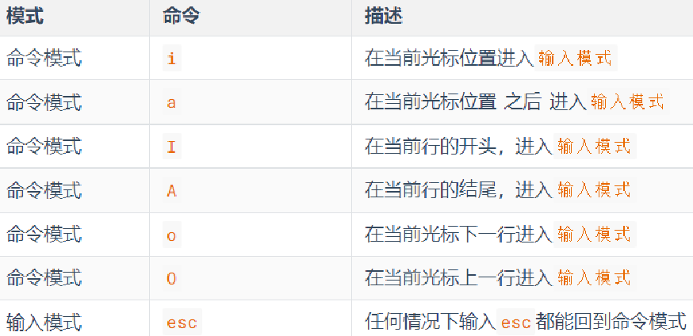
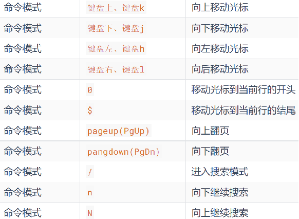
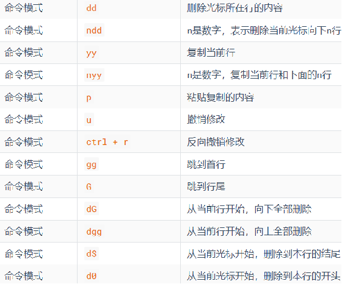
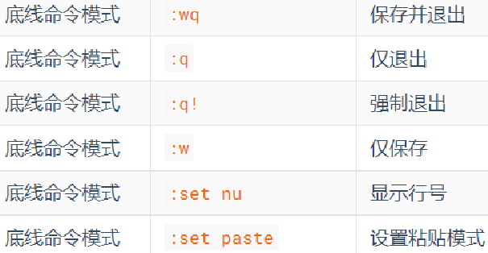
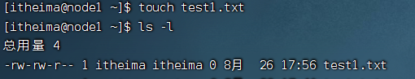
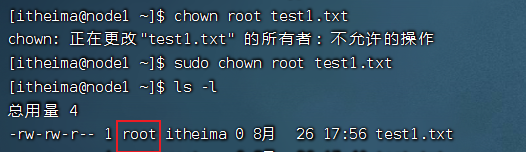
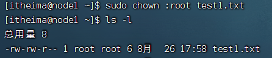

## 阶段内容简介

`Linux`

Mysql  数据库语言 通过它操作数据库

Pandas /numpy

- 数据处理 
- 数据可视化

GITHUB


## 1 Linux 系统简介

``Linux``创始人: 林纳斯·托瓦兹。`Linux` 诞生于1991年，作者上大学期间开发的。

`Linux`系统的组成如下：

- `Linux`系统内核 ：开源免费的
- 系统级应用程序  `Linux`发行版：`Ubuntu Linux` 或 `centos Linux`


## 2 VMware

虚拟机软件, 我们通过`vmware`来加载`Linux`镜像, 来学习`Linux`的使用

先安装VMware 再导入`Linux`镜像，为了解决在`VMware`中鼠标使用、复制、黏贴问题，使用`Finalshell`通过ssh连接操作虚拟`Linux`系统。


## 3 Linux 的使用

### 3.1 `Linux`基础命令

`Linux`系统的目录结构：`Linux`只有一个顶级目录，称之为：根目录（/）

- `Linux`命令格式：`command [-options] [parameter]`。语法中的[]，表示可选的意思

  在`Linux`中，

  - 命令有其通用的格式：command： 命令本身
  
  - -options：[可选，非必填]命令的一些选项，可以通过选项控制命令的行为细节
  
  - parameter：[可选，非必填]命令的参数，多数用于命令的指向目标等
  
    

##### 对文件文件夹的增删改查

**ls** 展示目录下的内容。

`-a`：表示all的意思，即列出全部文件（包含隐藏的文件/文件夹：以.点号开头的）

`-l`：文件、文件夹以列表形式排列 

`-h`：表示以易于阅读的形式，列出文件大小，如K、M、G。`-h`选项必须要搭配 `-l` 一起使用


**cd** change directory 切换工作目录

**pwd** print word directory 打印当前工作目录

- 绝对路径/相对路径
  - **绝对路径**：以根目录为起点，描述路径的一种写法，路径描述以/开头
  - **相对路径**：以当前目录为起点，描述路径的一种写法，路径描述无需以/开头
  
- 特殊路径符：
  - .	表示当前目录，比如 `cd ./Desktop` 表示切换到当前目录下的Desktop目录内，和`cd Desktop`效果一致
  
  - ..	表示上一级目录，比如：`cd ..`   即可切换到上一级目录，`cd ../..`  切换到上二级的目录
  
  - ~	表示HOME目录，比如：`cd ~`    即可切换到HOME目录或`cd ~/Desktop`，切换到HOME内的Desktop目录（cd 也能直接回到home目录）
  
    

**mkdir**  创建一个目录，命令格式：`mkdir  [-p]  linux路径`

- 参数**必填**，表示`Linux`路径，即要创建的文件夹的路径，相对路径或绝对路径均可
- `-p`选项可选，表示自动创建不存在的父目录，适用于创建连续多层级的目录。`mkdir -p 路径1/路径2`

**注意：**创建文件夹需要修改权限，请确保操作均在HOME目录内，不要在HOME外操作，涉及到权限问题，HOME外无法成功。后续我们会讲解权限管控的知识。


**touch/cat/more** ：文件的创建和查看 

touch：创建文件  `touch linux路径`

cat/more 文件路径，查看文件的内容

- cat 一次性显示所有内容
- more 可以控制翻页


**cp**  copy：用于复制文件\文件夹

- cp 源文件 目的地

- cp -r  复制文件夹的时候, 需要带-r的参数

  

**mv** move：可以用于移动文件\文件夹

- mv 源文件 要移动到的目的地路径。表示要移动去的地方，如果目标不存在，则进行改名，确保目标存在

- 可以通过mv来改名

  

**rm** remove：可用于删除文件、文件夹

- -r 删除文件夹的时候, 需要带-r的参数
- -f 强制删除（不会弹出提示确认信息），在`root`用户下谨慎使用
- rm命令支持通配符 *，用来做模糊匹配，示例：

​	test*，表示匹配任何以test开头的内容

​	*test，表示匹配任何以test结尾的内容

​	\*test\*，表示匹配任何包含test的内容


**which：命令查找**

命令的程序文件语法：无需选项，只需要参数表示查找哪个命令


**find：用于查找指定的文件**

按文件名查找：支持通配符按文件大小查找

- 按文件名查找：`find 起始路径 -name "被查找的文件名"`（支持通配符）

- 按文件大小查找：`find 起始路径 -size +|- n[kMG]`

  - +、- 表示大于和小于
  - n表示大小数字
  - kMG表示大小单位，k(小写字母)表示kb，M表示MB，G表示GB

  

##### 对文件内容进行过滤修改

**文件内容过滤**

**grep** 关键词过滤：`grep  [-n] 关键字 文件路径`

- 会检索文件中包含关键词的行

- 选项-n，可选，表示在结果中显示匹配的行的行号。

- 参数，关键字，必填，表示过滤的关键字，带有空格或其它特殊符号，建议使用””将关键字包围起来

- 参数，文件路径，必填，表示要过滤内容的文件路径。

  

**管道符**

- **|**  管道符前面(左边)输出会作为管道符后面(右边)命令的输入

grep 和 管道符可以配合使用

```shell
cat test.txt|grep itcast|grep itheima
```


**文件内容修改**

**echo**命令：`echo 输出的内容`

- 使用echo命令在命令行内输出指定内容：`echo "hello itheima"`（带有空格或\等特殊符号，建议使用双引号包围）

- echo  \`pwd \` （被``包围的内容，会被作为命令执行，而非普通字符）

  

**重定向符号**

- \> 将左侧命令的结果，覆盖写入到符号右侧指定的文件中。`echo “Hello Linux” > itheima.txt`
- \>> 将左侧命令的结果，追加写入到符号右侧指定的文件中。`echo “Hello itcast” >> itheima.txt`


**tail / tail -f** (了解)

语法：`tail [-f -num] linux路径`

- `tail 文件路径`：可以输出文件的末尾内容 默认显示10行

- `tail -3 文件路径`： 指定显示末尾的3行

- `tail -f 文件路径` ：持续监听文件末尾变化

  

##### vi/vim 编辑器的使用

- 三种模式 命令模式/输入模式/底行模式

  
  
  - vi/vim 文件名  → 命令模式
  - 命令模式进入到输入模式  i/a/o
  
  
  
  - 在命令模式下还有其它快捷键
  
    
  
    
  
  - **底线命令模式:** 命令模式内，输入: ，即可进入底线命令模式，支持如下命令
  
    

vi/vim最常见的应用场景 装完软件之后, 修改配置文件


##### `Linux`命令的帮助和手册

- 命令 --help

- man 命令

  

### 3.2 `Linux`用户和权限

#### `Linux`用户体系介绍

`Linux`的用户分成两类

- `root` 超级管理员 ：具备所有的权限
- 普通用户 

```shell
useradd -m itheima  # 创建itheima用户，-m代表创建用户的主目录；
passwd itheima      # 为itheima用户指定密码(这里密码不能过于简单, 123ABCitcast)
```

- 创建了普通用户之后在/home路径下就会创建和普通用户用户名相同的文件夹

  - itcast用户 它的家目录就是 /home/itcast

  - 普通用户在自己的家目录下是有所有权限的，在其它普通用户的家目录下没有权限

    

- 在使用`Linux`的时候, 生产环境下不要直接使用`root`用户, 可以使用普通用户, 需要用到超级管理员权限的时候做临时申请 sudo

  

  **visudo 给普通用户添加sudo权限**

  切换到`root`用户，执行visudo命令，会自动通过vi编辑器打开：/etc/sudoers

  在文件中找到以下行：

  ```shell
  `root`    ALL=(ALL:ALL) ALL
  ```
  
  在下面添加一行（将 `username` 替换为你的用户名）：
  
  ```shell
  username ALL=(ALL:ALL) ALL
  ```
  
  保存并退出:
  
  1. 如果使用 `visudo`，按 `Ctrl + X`，然后按 `Y` 确认保存，最后按 `Enter` 退出。
  2. 如果语法正确，文件会保存；如果有错误，`visudo` 会提示你修复。
  
  
  
  **配置用户无需输入密码使用sudo功能**
  
  在打开的`sudoers`文件中，找到以下行：
  
  ```
  %sudo   ALL=(ALL:ALL) ALL
  ```
  
  在这行下方添加以下内容，将`username`替换为你的用户名：
  
  ```
  username ALL=(ALL) NOPASSWD: ALL
  ```
  
  其中最后的`NOPASSWD: ALL` 表示使用sudo命令，无需输入密码。最后按`Ctrl + X`，然后按`Y`确认保存，最后按`Enter`退出。
  
  检验是否配置成功：
  
  ```shell
  sudo apt update
  ```
  
  

#### 查看文件权限


#### chmod 修改文件权限

我们可以使用chmod命令，修改文件、文件夹的权限信息。

> 注意，只有文件、文件夹的所属用户或`root`用户可以修改。

**语法**：`chmod [-R] 权限 文件或文件夹`。选项：`-R`，对文件夹内的全部内容应用同样的操作

示例1：`chmod u=rwx,g=rx,o=x hello.txt` 。将文件权限修改为：rwxr-x--x。其中：

- u表示user所属用户权限，g表示group组权限，o表示other其它用户权限

实例2：`chmod -R u=rwx,g=rx,o=x test`，将文件夹test以及文件夹内全部内容权限设置为：rwxr-x--x

除此之外，还有快捷写法：`chmod 751 hello.txt`。将751每个数字转化为二进制（111，101，001）对应有哪些权限。


#### chown 修改文件所有者

通过`ls -l`指令，可以看到文件、文件夹的所有者/所有的用户组

> 普通用户没有权限修改文件的所有者/所有的用户组，想通过普通用户修改, 需要添加sudo权限（如上）

语法：`chown [-R] [用户][:][用户组] 文件或文件夹`

- 选项，-R，同chmod，对文件夹内全部内容应用相同规则

- 选项，用户，修改所属用户

- 选项，用户组，修改所属用户组

- :用于分隔用户和用户组

  

在itheima这个用户的家目录下创建一个test1.txt文件

- 此时 test1.txt 用户是itheima 用户组 itheima



通过chown 修改test1.txt 文件的所有者

- 需要注意 当前用户itheima 不能执行chown。没有权限, 通过sudo 临时获取超级管理员权限, 修改所有者



- 虽然所有者从itheima 改成了`root` , 但是itheima对于当前test1.txt 属于同组用户, 权限看中间的 rw-
  - 此时依然可以查看并修改这个test1.txt

通过chown 修改test1.txt 文件的所属的用户组



此时 itheima 属于其它用户 只有读的权限,没有其它权限
