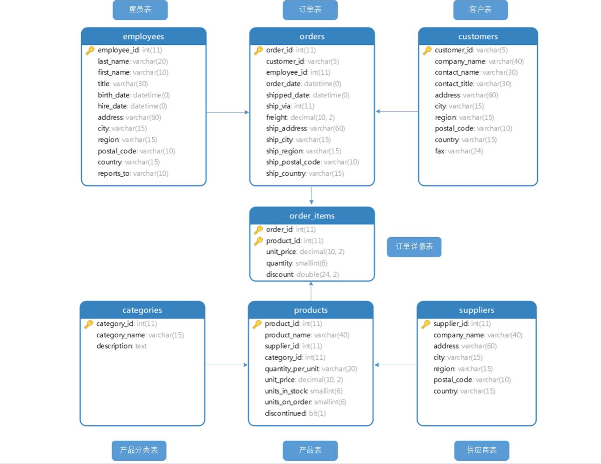
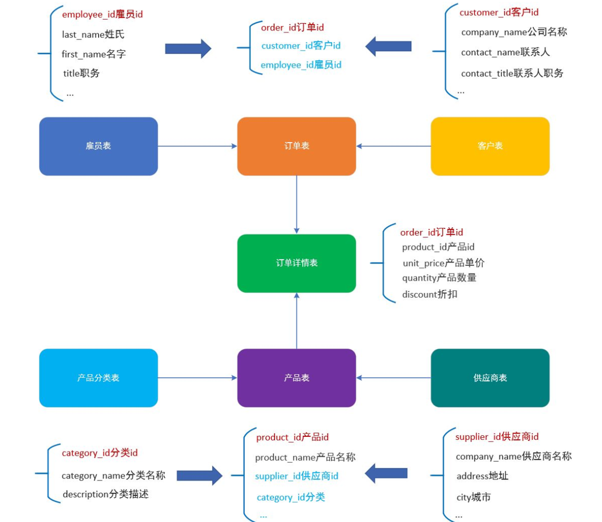

## 一 数据介绍

> 课程使用 微软的Northwind数据集, 零售业务，包含了客户，供应商和订单数据。原始数据集可以在 [微软GitHub 仓库](https://github.com/Microsoft/sql-server-samples/tree/master/samples/databases/northwind-pubs)下载。为了满足课程需求，数据库数据在原始数据基础上做了微调。
>
> 基于此份数据，我们将通过SQL来创建数据报表，满足业务需求。
>

### 学习目标

- 了解项目使用的数据表结构及表关系





### 1 员工表(employees)

- 保存员工基本信息：
  - 唯一ID (`employee_id`).
  - 姓，名(`first_name` and `last_name`).
  - 职务 (`title`).

- 需要注意的是 `reports_to`这一列, 保存的是员工所对应的直属领导的员工ID (也在这张表中保存) ，此外还有其它列包括入职时间，生日... ...

#### 练习1

- 选中`employees` 表的所有数据

```sql
select * from employees
```

| employee_id | last_name | first_name | title                    | birth_date | hire_date  | address                       | city     | region | postal_code | country | reports_to |
| :---------- | :-------- | :--------- | :----------------------- | :--------: | :--------- | :---------------------------- | :------- | :----- | :---------- | :------ | :--------- |
| 1           | Davolio   | Nancy      | Sales Representative     | 1968-12-08 | 2012-05-01 | 507 - 20th Ave. E. Apt. 2A    | Seattle  | WA     | 98122       | USA     | 2          |
| 2           | Fuller    | Andrew     | Vice President, Sales    | 1972-02-19 | 2012-08-14 | 908 W. Capital Way            | Tacoma   | WA     | 98401       | USA     | null       |
| 3           | Smith     | John       | Sales Representative     | 1983-08-30 | 2012-04-01 | 722 Moss Bay Blvd.            | Kirkland | WA     | 98033       | USA     | 2          |
| 4           | Peacock   | Margaret   | Sales Representative     | 1957-09-19 | 2013-05-03 | 4110 Old Redmond Rd.          | Redmond  | WA     | 98052       | USA     | 2          |
| 5           | Buchanan  | Steven     | Sales Manager            | 1975-03-04 | 2013-10-17 | 14 Garrett Hill               | London   | null   | SW1 8JR     | UK      | 2          |
| 6           | Suyama    | Michael    | Sales Representative     | 1983-07-02 | 2013-10-17 | Coventry House Miner Rd.      | London   | null   | EC2 7JR     | UK      | 5          |
| 7           | King      | Robert     | Sales Representative     | 1980-05-29 | 2014-01-02 | Edgeham Hollow Winchester Way | London   | null   | RG1 9SP     | UK      | 5          |
| 8           | Callahan  | Laura      | Inside Sales Coordinator | 1978-01-09 | 2014-03-05 | 4726 - 11th Ave. N.E.         | Seattle  | WA     | 98105       | USA     | 2          |
| 9           | Dodsworth | Anne       | Sales Representative     | 1986-01-27 | 2014-11-15 | 7 Houndstooth Rd.             | London   | null   | WG2 7LT     | UK      | 5          |
| 10          | Smith     | John       | Sales Representative     | 1994-08-30 | 2017-03-21 | 22 Abbey Rd                   | London   | null   | NW6 5JG     | UK      | 2          |

### 2 顾客表(customers)

- 每一个顾客都有唯一ID`customer_id`, 顾客的ID是公司全名的缩写，用5个字母表示
- 公司全名在 `company_name` 列中保存
-   `contact_name` 和 `contact_title` 两列代表了客户公司的联系人信息（名字和职务）
  - 除此之外还保存了顾客的地址信息和联系方式`city`, `region`, `postal_code`, `country`, `fax`

| customer_id | company_name                         | contact_name            | contact_title                  | address                                        | city            | region        | postal_code | country     | fax               |
| :---------- | :----------------------------------- | :---------------------- | :----------------------------- | :--------------------------------------------- | :-------------- | :------------ | :---------- | :---------- | :---------------- |
| ALFKI       | Alfreds Futterkiste                  | Maria Anders            | Sales Representative           | Obere Str. 57                                  | Berlin          | null          | 12209       | Germany     | 030-0076545       |
| ANATR       | Ana Trujillo Emparedados y helados   | Ana Trujillo            | Owner                          | Avda. de la Constitución 2222                  | México D.F.     | null          | 05021       | Mexico      | (5) 555-3745      |
| ANTON       | Antonio Moreno Taquería              | Antonio Moreno          | Owner                          | Mataderos 2312                                 | México D.F.     | null          | 05023       | Mexico      | null              |
| AROUT       | Around the Horn                      | Thomas Hardy            | Sales Representative           | 120 Hanover Sq.                                | London          | null          | WA1 1DP     | UK          | (171) 555-6750    |
| BERGS       | Berglunds snabbköp                   | Christina Berglund      | Order Administrator            | Berguvsvägen 8                                 | Luleå           | null          | S-958 22    | Sweden      | 0921-12 34 67     |
| BLAUS       | Blauer See Delikatessen              | Hanna Moos              | Sales Representative           | Forsterstr. 57                                 | Mannheim        | null          | 68306       | Germany     | 0621-08924        |
| BLONP       | Blondesddsl père et fils             | Frédérique Citeaux      | Marketing Manager              | 24, place Kléber                               | Strasbourg      | null          | 67000       | France      | 88.60.15.32       |
| BOLID       | Bólido Comidas preparadas            | Martín Sommer           | Owner                          | C/ Araquil, 67                                 | Madrid          | null          | 28023       | Spain       | (91) 555 91 99    |
| BONAP       | Bon app'                             | Laurence Lebihan        | Owner                          | 12, rue des Bouchers                           | Marseille       | null          | 13008       | France      | 91.24.45.41       |
| BOTTM       | Bottom-Dollar Markets                | Elizabeth Lincoln       | Accounting Manager             | 23 Tsawassen Blvd.                             | Tsawassen       | BC            | T2F 8M4     | Canada      | (604) 555-3745    |
| BSBEV       | B's Beverages                        | Victoria Ashworth       | Sales Representative           | Fauntleroy Circus                              | London          | null          | EC2 5NT     | UK          | null              |
| CACTU       | Cactus Comidas para llevar           | Patricio Simpson        | Sales Agent                    | Cerrito 333                                    | Buenos Aires    | null          | 1010        | Argentina   | (1) 135-4892      |
| CENTC       | Centro comercial Moctezuma           | Francisco Chang         | Marketing Manager              | Sierras de Granada 9993                        | México D.F.     | null          | 05022       | Mexico      | (5) 555-7293      |
| CHOPS       | Chop-suey Chinese                    | Yang Wang               | Owner                          | Hauptstr. 29                                   | Bern            | null          | 3012        | Switzerland | null              |
| COMMI       | Comércio Mineiro                     | Pedro Afonso            | Sales Associate                | Av. dos Lusíadas, 23                           | Sao Paulo       | SP            | 05432-043   | Brazil      | null              |
| CONSH       | Consolidated Holdings                | Elizabeth Brown         | Sales Representative           | Berkeley Gardens 12 Brewery                    | London          | null          | WX1 6LT     | UK          | (171) 555-9199    |
| DRACD       | Drachenblut Delikatessen             | Sven Ottlieb            | Order Administrator            | Walserweg 21                                   | Aachen          | null          | 52066       | Germany     | 0241-059428       |
| DUMON       | Du monde entier                      | Janine Labrune          | Owner                          | 67, rue des Cinquante Otages                   | Nantes          | null          | 44000       | France      | 40.67.89.89       |
| EASTC       | Eastern Connection                   | Ann Devon               | Sales Agent                    | 35 King George                                 | London          | null          | WX3 6FW     | UK          | (171) 555-3373    |
| ERNSH       | Ernst Handel                         | Roland Mendel           | Sales Manager                  | Kirchgasse 6                                   | Graz            | null          | 8010        | Austria     | 7675-3426         |
| FAMIA       | Familia Arquibaldo                   | Aria Cruz               | Marketing Assistant            | Rua Orós, 92                                   | Sao Paulo       | SP            | 05442-030   | Brazil      | null              |
| FISSA       | FISSA Fabrica Inter. Salchichas S.A. | Diego Roel              | Accounting Manager             | C/ Moralzarzal, 86                             | Madrid          | null          | 28034       | Spain       | (91) 555 55 93    |
| FOLIG       | Folies gourmandes                    | Martine Rancé           | Assistant Sales Agent          | 184, chaussée de Tournai                       | Lille           | null          | 59000       | France      | 20.16.10.17       |
| FOLKO       | Folk och fä HB                       | Maria Larsson           | Owner                          | Åkergatan 24                                   | Bräcke          | null          | S-844 67    | Sweden      | null              |
| FRANK       | Frankenversand                       | Peter Franken           | Marketing Manager              | Berliner Platz 43                              | München         | null          | 80805       | Germany     | 089-0877451       |
| FRANR       | France restauration                  | Carine Schmitt          | Marketing Manager              | 54, rue Royale                                 | Nantes          | null          | 44000       | France      | 40.32.21.20       |
| FRANS       | Franchi S.p.A.                       | Paolo Accorti           | Sales Representative           | Via Monte Bianco 34                            | Torino          | null          | 10100       | Italy       | 011-4988261       |
| FURIB       | Furia Bacalhau e Frutos do Mar       | Lino Rodriguez          | Sales Manager                  | Jardim das rosas n. 32                         | Lisboa          | null          | 1675        | Portugal    | (1) 354-2535      |
| GALED       | Galería del gastrónomo               | Eduardo Saavedra        | Marketing Manager              | Rambla de Cataluña, 23                         | Barcelona       | null          | 08022       | Spain       | (93) 203 4561     |
| GODOS       | Godos Cocina Típica                  | José Pedro Freyre       | Sales Manager                  | C/ Romero, 33                                  | Sevilla         | null          | 41101       | Spain       | null              |
| GOURL       | Gourmet Lanchonetes                  | André Fonseca           | Sales Associate                | Av. Brasil, 442                                | Campinas        | SP            | 04876-786   | Brazil      | null              |
| GREAL       | Great Lakes Food Market              | Howard Snyder           | Marketing Manager              | 2732 Baker Blvd.                               | Eugene          | OR            | 97403       | USA         | null              |
| GROSR       | GROSELLA-Restaurante                 | Manuel Pereira          | Owner                          | 5ª Ave. Los Palos Grandes                      | Caracas         | DF            | 1081        | Venezuela   | (2) 283-3397      |
| HANAR       | Hanari Carnes                        | Mario Pontes            | Accounting Manager             | Rua do Paço, 67                                | Rio de Janeiro  | RJ            | 05454-876   | Brazil      | (21) 555-8765     |
| HILAA       | HILARION-Abastos                     | Carlos Hernández        | Sales Representative           | Carrera 22 con Ave. Carlos Soublette #8-35     | San Cristóbal   | Táchira       | 5022        | Venezuela   | (5) 555-1948      |
| HUNGC       | Hungry Coyote Import Store           | Yoshi Latimer           | Sales Representative           | City Center Plaza 516 Main St.                 | Elgin           | OR            | 97827       | USA         | (503) 555-2376    |
| HUNGO       | Hungry Owl All-Night Grocers         | Patricia McKenna        | Sales Associate                | 8 Johnstown Road                               | Cork            | Co. Cork      | null        | Ireland     | 2967 3333         |
| ISLAT       | Island Trading                       | Helen Bennett           | Marketing Manager              | Garden House Crowther Way                      | Cowes           | Isle of Wight | PO31 7PJ    | UK          | null              |
| KOENE       | Königlich Essen                      | Philip Cramer           | Sales Associate                | Maubelstr. 90                                  | Brandenburg     | null          | 14776       | Germany     | null              |
| LACOR       | La corne d'abondance                 | Daniel Tonini           | Sales Representative           | 67, avenue de l'Europe                         | Versailles      | null          | 78000       | France      | 30.59.85.11       |
| LAMAI       | La maison d'Asie                     | Annette Roulet          | Sales Manager                  | 1 rue Alsace-Lorraine                          | Toulouse        | null          | 31000       | France      | 61.77.61.11       |
| LAUGB       | Laughing Bacchus Wine Cellars        | Yoshi Tannamuri         | Marketing Assistant            | 1900 Oak St.                                   | Vancouver       | BC            | V3F 2K1     | Canada      | (604) 555-7293    |
| LAZYK       | Lazy K Kountry Store                 | John Steel              | Marketing Manager              | 12 Orchestra Terrace                           | Walla Walla     | WA            | 99362       | USA         | (509) 555-6221    |
| LEHMS       | Lehmanns Marktstand                  | Renate Messner          | Sales Representative           | Magazinweg 7                                   | Frankfurt a.M.  | null          | 60528       | Germany     | 069-0245874       |
| LETSS       | Let's Stop N Shop                    | Jaime Yorres            | Owner                          | 87 Polk St. Suite 5                            | San Francisco   | CA            | 94117       | USA         | null              |
| LILAS       | LILA-Supermercado                    | Carlos González         | Accounting Manager             | Carrera 52 con Ave. Bolívar #65-98 Llano Largo | Barquisimeto    | Lara          | 3508        | Venezuela   | (9) 331-7256      |
| LINOD       | LINO-Delicateses                     | Felipe Izquierdo        | Owner                          | Ave. 5 de Mayo Porlamar                        | I. de Margarita | Nueva Esparta | 4980        | Venezuela   | (8) 34-93-93      |
| LONEP       | Lonesome Pine Restaurant             | Fran Wilson             | Sales Manager                  | 89 Chiaroscuro Rd.                             | Portland        | OR            | 97219       | USA         | (503) 555-9646    |
| MAGAA       | Magazzini Alimentari Riuniti         | Giovanni Rovelli        | Marketing Manager              | Via Ludovico il Moro 22                        | Bergamo         | null          | 24100       | Italy       | 035-640231        |
| MAISD       | Maison Dewey                         | Catherine Dewey         | Sales Agent                    | Rue Joseph-Bens 532                            | Bruxelles       | null          | B-1180      | Belgium     | (02) 201 24 68    |
| MEREP       | Mère Paillarde                       | Jean Fresnière          | Marketing Assistant            | 43 rue St. Laurent                             | Montréal        | Québec        | H1J 1C3     | Canada      | (514) 555-8055    |
| MORGK       | Morgenstern Gesundkost               | Alexander Feuer         | Marketing Assistant            | Heerstr. 22                                    | Leipzig         | null          | 04179       | Germany     | null              |
| NORTS       | North/South                          | Simon Crowther          | Sales Associate                | South House 300 Queensbridge                   | London          | null          | SW7 1RZ     | UK          | (171) 555-2530    |
| OCEAN       | Océano Atlántico Ltda.               | Yvonne Moncada          | Sales Agent                    | Ing. Gustavo Moncada 8585 Piso 20-A            | Buenos Aires    | null          | 1010        | Argentina   | (1) 135-5535      |
| OLDWO       | Old World Delicatessen               | Rene Phillips           | Sales Representative           | 2743 Bering St.                                | Anchorage       | AK            | 99508       | USA         | (907) 555-2880    |
| OTTIK       | Ottilies Käseladen                   | Henriette Pfalzheim     | Owner                          | Mehrheimerstr. 369                             | Köln            | null          | 50739       | Germany     | 0221-0765721      |
| PARIS       | Paris spécialités                    | Marie Bertrand          | Owner                          | 265, boulevard Charonne                        | Paris           | null          | 75012       | France      | (1) 42.34.22.77   |
| PERIC       | Pericles Comidas clásicas            | Guillermo Fernández     | Sales Representative           | Calle Dr. Jorge Cash 321                       | México D.F.     | null          | 05033       | Mexico      | (5) 545-3745      |
| PICCO       | Piccolo und mehr                     | Georg Pipps             | Sales Manager                  | Geislweg 14                                    | Salzburg        | null          | 5020        | Austria     | 6562-9723         |
| PRINI       | Princesa Isabel Vinhos               | Isabel de Castro        | Sales Representative           | Estrada da saúde n. 58                         | Lisboa          | null          | 1756        | Portugal    | null              |
| QUEDE       | Que Delícia                          | Bernardo Batista        | Accounting Manager             | Rua da Panificadora, 12                        | Rio de Janeiro  | RJ            | 02389-673   | Brazil      | (21) 555-4545     |
| QUEEN       | Queen Cozinha                        | Lúcia Carvalho          | Marketing Assistant            | Alameda dos Canàrios, 891                      | Sao Paulo       | SP            | 05487-020   | Brazil      | null              |
| QUICK       | QUICK-Stop                           | Horst Kloss             | Accounting Manager             | Taucherstraße 10                               | Cunewalde       | null          | 01307       | Germany     | null              |
| RANCH       | Rancho grande                        | Sergio Gutiérrez        | Sales Representative           | Av. del Libertador 900                         | Buenos Aires    | null          | 1010        | Argentina   | (1) 123-5556      |
| RATTC       | Rattlesnake Canyon Grocery           | Paula Wilson            | Assistant Sales Representative | 2817 Milton Dr.                                | Albuquerque     | NM            | 87110       | USA         | (505) 555-3620    |
| REGGC       | Reggiani Caseifici                   | Maurizio Moroni         | Sales Associate                | Strada Provinciale 124                         | Reggio Emilia   | null          | 42100       | Italy       | 0522-556722       |
| RICAR       | Ricardo Adocicados                   | Janete Limeira          | Assistant Sales Agent          | Av. Copacabana, 267                            | Rio de Janeiro  | RJ            | 02389-890   | Brazil      | null              |
| RICSU       | Richter Supermarkt                   | Michael Holz            | Sales Manager                  | Grenzacherweg 237                              | Genève          | null          | 1203        | Switzerland | null              |
| ROMEY       | Romero y tomillo                     | Alejandra Camino        | Accounting Manager             | Gran Vía, 1                                    | Madrid          | null          | 28001       | Spain       | (91) 745 6210     |
| SANTG       | Santé Gourmet                        | Jonas Bergulfsen        | Owner                          | Erling Skakkes gate 78                         | Stavern         | null          | 4110        | Norway      | 07-98 92 47       |
| SAVEA       | Save-a-lot Markets                   | Jose Pavarotti          | Sales Representative           | 187 Suffolk Ln.                                | Boise           | ID            | 83720       | USA         | null              |
| SEVES       | Seven Seas Imports                   | Hari Kumar              | Sales Manager                  | 90 Wadhurst Rd.                                | London          | null          | OX15 4NB    | UK          | (171) 555-5646    |
| SIMOB       | Simons bistro                        | Jytte Petersen          | Owner                          | Vinbæltet 34                                   | Kobenhavn       | null          | 1734        | Denmark     | 31 13 35 57       |
| SPECD       | Spécialités du monde                 | Dominique Perrier       | Marketing Manager              | 25, rue Lauriston                              | Paris           | null          | 75016       | France      | (1) 47.55.60.20   |
| SPLIR       | Split Rail Beer & Ale                | Art Braunschweiger      | Sales Manager                  | P.O. Box 555                                   | Lander          | WY            | 82520       | USA         | (307) 555-6525    |
| SUPRD       | Suprêmes délices                     | Pascale Cartrain        | Accounting Manager             | Boulevard Tirou, 255                           | Charleroi       | null          | B-6000      | Belgium     | (071) 23 67 22 21 |
| THEBI       | The Big Cheese                       | Liz Nixon               | Marketing Manager              | 89 Jefferson Way Suite 2                       | Portland        | OR            | 97201       | USA         | null              |
| THECR       | The Cracker Box                      | Liu Wong                | Marketing Assistant            | 55 Grizzly Peak Rd.                            | Butte           | MT            | 59801       | USA         | (406) 555-8083    |
| TOMSP       | Toms Spezialitäten                   | Karin Josephs           | Marketing Manager              | Luisenstr. 48                                  | Münster         | null          | 44087       | Germany     | 0251-035695       |
| TORTU       | Tortuga Restaurante                  | Miguel Angel Paolino    | Owner                          | Avda. Azteca 123                               | México D.F.     | null          | 05033       | Mexico      | null              |
| TRADH       | Tradição Hipermercados               | Anabela Domingues       | Sales Representative           | Av. Inês de Castro, 414                        | Sao Paulo       | SP            | 05634-030   | Brazil      | (11) 555-2168     |
| TRAIH       | Trail's Head Gourmet Provisioners    | Helvetius Nagy          | Sales Associate                | 722 DaVinci Blvd.                              | Kirkland        | WA            | 98034       | USA         | (206) 555-2174    |
| VAFFE       | Vaffeljernet                         | Palle Ibsen             | Sales Manager                  | Smagsloget 45                                  | Århus           | null          | 8200        | Denmark     | 86 22 33 44       |
| VICTE       | Victuailles en stock                 | Mary Saveley            | Sales Agent                    | 2, rue du Commerce                             | Lyon            | null          | 69004       | France      | 78.32.54.87       |
| VINET       | Vins et alcools Chevalier            | Paul Henriot            | Accounting Manager             | 59 rue de l'Abbaye                             | Reims           | null          | 51100       | France      | 26.47.15.11       |
| WANDK       | Die Wandernde Kuh                    | Rita Müller             | Sales Representative           | Adenauerallee 900                              | Stuttgart       | null          | 70563       | Germany     | 0711-035428       |
| WARTH       | Wartian Herkku                       | Pirkko Koskitalo        | Accounting Manager             | Torikatu 38                                    | Oulu            | null          | 90110       | Finland     | 981-443655        |
| WELLI       | Wellington Importadora               | Paula Parente           | Sales Manager                  | Rua do Mercado, 12                             | Resende         | SP            | 08737-363   | Brazil      | null              |
| WHITC       | White Clover Markets                 | Karl Jablonski          | Owner                          | 305 - 14th Ave. S. Suite 3B                    | Seattle         | WA            | 98128       | USA         | (206) 555-4115    |
| WILMK       | Wilman Kala                          | Matti Karttunen         | Owner/Marketing Assistant      | Keskuskatu 45                                  | Helsinki        | null          | 21240       | Finland     | 90-224 8858       |
| WOLZA       | Wolski Zajazd                        | Zbyszek Piestrzeniewicz | Owner                          | ul. Filtrowa 68                                | Warszawa        | null          | 01-012      | Poland      | (26) 642-7012     |

#### 练习2

- 查询每个客户的 `ID`, `company name`, `contact name`, `contact title`, `city`, 和 `country`.并按照国家名字排序

```sql
select customer_id,
  company_name,
  contact_name,
  contact_title,
  city,
  country from customers
  order by country
```

- 显示结果

| customer_id | company_name                  | contact_name      | contact_title         | city           | country   |
| :---------- | :---------------------------- | :---------------- | :-------------------- | :------------- | :-------- |
| OCEAN       | Océano Atlántico Ltda.        | Yvonne Moncada    | Sales Agent           | Buenos Aires   | Argentina |
| CACTU       | Cactus Comidas para llevar    | Patricio Simpson  | Sales Agent           | Buenos Aires   | Argentina |
| RANCH       | Rancho grande                 | Sergio Gutiérrez  | Sales Representative  | Buenos Aires   | Argentina |
| ERNSH       | Ernst Handel                  | Roland Mendel     | Sales Manager         | Graz           | Austria   |
| PICCO       | Piccolo und mehr              | Georg Pipps       | Sales Manager         | Salzburg       | Austria   |
| MAISD       | Maison Dewey                  | Catherine Dewey   | Sales Agent           | Bruxelles      | Belgium   |
| SUPRD       | Suprêmes délices              | Pascale Cartrain  | Accounting Manager    | Charleroi      | Belgium   |
| WELLI       | Wellington Importadora        | Paula Parente     | Sales Manager         | Resende        | Brazil    |
| HANAR       | Hanari Carnes                 | Mario Pontes      | Accounting Manager    | Rio de Janeiro | Brazil    |
| GOURL       | Gourmet Lanchonetes           | André Fonseca     | Sales Associate       | Campinas       | Brazil    |
| QUEDE       | Que Delícia                   | Bernardo Batista  | Accounting Manager    | Rio de Janeiro | Brazil    |
| QUEEN       | Queen Cozinha                 | Lúcia Carvalho    | Marketing Assistant   | Sao Paulo      | Brazil    |
| COMMI       | Comércio Mineiro              | Pedro Afonso      | Sales Associate       | Sao Paulo      | Brazil    |
| TRADH       | Tradição Hipermercados        | Anabela Domingues | Sales Representative  | Sao Paulo      | Brazil    |
| FAMIA       | Familia Arquibaldo            | Aria Cruz         | Marketing Assistant   | Sao Paulo      | Brazil    |
| RICAR       | Ricardo Adocicados            | Janete Limeira    | Assistant Sales Agent | Rio de Janeiro | Brazil    |
| BOTTM       | Bottom-Dollar Markets         | Elizabeth Lincoln | Accounting Manager    | Tsawassen      | Canada    |
| LAUGB       | Laughing Bacchus Wine Cellars | Yoshi Tannamuri   | Marketing Assistant   | Vancouver      | Canada    |
| MEREP       | Mère Paillarde                | Jean Fresnière    | Marketing Assistant   | Montréal       | Canada    |
| SIMOB       | Simons bistro                 | Jytte Petersen    | Owner                 | Kobenhavn      | Denmark   |

### 3 商品(products)和商品类别(categories)表

- 商品表中保存了在Northwind商店中出售的商品信息
  - 每一种商品都有唯一的 `product_id` 和商品名字`product_name`.
  - 每一种商品都有一个供应商 (`supplier_id`) 
  - 每一种商品都有一个商品类别 (`category_id`).
  - 每一种商品都有确定的单价 `unit_price`. 
  - 字段 `discontinued` 代表商品是否缺货， `false` (有货)   `true` (缺货) 
- 商品类别表 `categories` ，保存了所有商品的类别
  - 每个类别都有唯一的id
  - 每个类别都有自己的名称 `category_name`
  - 字段`description` 存储了类别的简短描述信息
- 商品表中包含了  `category_id` 字段，所以可以使用join 将商品表中的信息与商品类别表中的信息进行关联查询

**商品类别**

| category_id | category_name  | description                                                |
| :---------- | :------------- | :--------------------------------------------------------- |
| 1           | Beverages      | Soft drinks, coffees, teas, beers, and ales                |
| 2           | Condiments     | Sweet and savory sauces, relishes, spreads, and seasonings |
| 3           | Confections    | Desserts, candies, and sweet breads                        |
| 4           | Dairy Products | Cheeses                                                    |
| 5           | Grains/Cereals | Breads, crackers, pasta, and cereal                        |
| 6           | Meat/Poultry   | Prepared meats                                             |
| 7           | Produce        | Dried fruit and bean curd                                  |
| 8           | Seafood        | Seaweed and fish                                           |

**产品表**

| product_id | product_name                     | supplier_id | category_id | quantity_per_unit    | unit_price | units_in_stock | units_on_order | discontinued |
| :--------- | :------------------------------- | :---------- | :---------- | :------------------- | :--------- | :------------- | :------------- | :----------- |
| 1          | Chai                             | 1           | 1           | 10 boxes x 20 bags   | 18.00      | 39             | 0              | f            |
| 2          | Chang                            | 1           | 1           | 24 - 12 oz bottles   | 19.00      | 17             | 40             | f            |
| 3          | Aniseed Syrup                    | 1           | 2           | 12 - 550 ml bottles  | 10.00      | 13             | 70             | f            |
| 4          | Chef Anton's Cajun Seasoning     | 2           | 2           | 48 - 6 oz jars       | 22.00      | 53             | 0              | f            |
| 5          | Chef Anton's Gumbo Mix           | 2           | 2           | 36 boxes             | 21.35      | 0              | 0              | t            |
| 6          | Grandma's Boysenberry Spread     | 3           | 2           | 12 - 8 oz jars       | 25.00      | 120            | 0              | f            |
| 7          | Uncle Bob's Organic Dried Pears  | 3           | 7           | 12 - 1 lb pkgs.      | 30.00      | 15             | 0              | f            |
| 8          | Northwoods Cranberry Sauce       | 3           | 2           | 12 - 12 oz jars      | 40.00      | 6              | 0              | f            |
| 9          | Mishi Kobe Niku                  | 4           | 6           | 18 - 500 g pkgs.     | 97.00      | 29             | 0              | t            |
| 10         | Ikura                            | 4           | 8           | 12 - 200 ml jars     | 31.00      | 31             | 0              | f            |
| 11         | Queso Cabrales                   | 5           | 4           | 1 kg pkg.            | 21.00      | 22             | 30             | f            |
| 12         | Queso Manchego La Pastora        | 5           | 4           | 10 - 500 g pkgs.     | 38.00      | 86             | 0              | f            |
| 13         | Konbu                            | 6           | 8           | 2 kg box             | 6.00       | 24             | 0              | f            |
| 14         | Tofu                             | 6           | 7           | 40 - 100 g pkgs.     | 23.25      | 35             | 0              | f            |
| 15         | Genen Shouyu                     | 6           | 2           | 24 - 250 ml bottles  | 15.50      | 39             | 0              | f            |
| 16         | Pavlova                          | 7           | 3           | 32 - 500 g boxes     | 17.45      | 29             | 0              | f            |
| 17         | Alice Mutton                     | 7           | 6           | 20 - 1 kg tins       | 39.00      | 0              | 0              | t            |
| 18         | Carnarvon Tigers                 | 7           | 8           | 16 kg pkg.           | 62.50      | 42             | 0              | f            |
| 19         | Teatime Chocolate Biscuits       | 8           | 3           | 10 boxes x 12 pieces | 9.20       | 25             | 0              | f            |
| 20         | Sir Rodney's Marmalade           | 8           | 3           | 30 gift boxes        | 81.00      | 40             | 0              | f            |
| 21         | Sir Rodney's Scones              | 8           | 3           | 24 pkgs. x 4 pieces  | 10.00      | 3              | 40             | f            |
| 22         | Gustaf's Knäckebröd              | 9           | 5           | 24 - 500 g pkgs.     | 21.00      | 104            | 0              | f            |
| 23         | Tunnbröd                         | 9           | 5           | 12 - 250 g pkgs.     | 9.00       | 61             | 0              | f            |
| 24         | Guaraná Fantástica               | 10          | 1           | 12 - 355 ml cans     | 4.50       | 20             | 0              | t            |
| 25         | NuNuCa Nuß-Nougat-Creme          | 11          | 3           | 20 - 450 g glasses   | 14.00      | 76             | 0              | f            |
| 26         | Gumbär Gummibärchen              | 11          | 3           | 100 - 250 g bags     | 31.23      | 15             | 0              | f            |
| 27         | Schoggi Schokolade               | 11          | 3           | 100 - 100 g pieces   | 43.90      | 49             | 0              | f            |
| 28         | Rössle Sauerkraut                | 12          | 7           | 25 - 825 g cans      | 45.60      | 26             | 0              | t            |
| 29         | Thüringer Rostbratwurst          | 12          | 6           | 50 bags x 30 sausgs. | 123.79     | 0              | 0              | t            |
| 30         | Nord-Ost Matjeshering            | 13          | 8           | 10 - 200 g glasses   | 25.89      | 10             | 0              | f            |
| 31         | Gorgonzola Telino                | 14          | 4           | 12 - 100 g pkgs      | 12.50      | 0              | 70             | f            |
| 32         | Mascarpone Fabioli               | 14          | 4           | 24 - 200 g pkgs.     | 32.00      | 9              | 40             | f            |
| 33         | Geitost                          | 16          | 4           | 500 g                | 2.50       | 112            | 0              | f            |
| 34         | Sasquatch Ale                    | 16          | 1           | 24 - 12 oz bottles   | 14.00      | 111            | 0              | f            |
| 35         | Steeleye Stout                   | 16          | 1           | 24 - 12 oz bottles   | 18.00      | 20             | 0              | f            |
| 36         | Inlagd Sill                      | 17          | 8           | 24 - 250 g jars      | 19.00      | 112            | 0              | f            |
| 37         | Gravad lax                       | 17          | 8           | 12 - 500 g pkgs.     | 26.00      | 11             | 50             | f            |
| 38         | Côte de Blaye                    | 18          | 1           | 12 - 75 cl bottles   | 263.50     | 17             | 0              | f            |
| 39         | Chartreuse verte                 | 18          | 1           | 750 cc per bottle    | 18.00      | 69             | 0              | f            |
| 40         | Boston Crab Meat                 | 19          | 8           | 24 - 4 oz tins       | 18.40      | 123            | 0              | f            |
| 41         | Jack's New England Clam Chowder  | 19          | 8           | 12 - 12 oz cans      | 9.65       | 85             | 0              | f            |
| 42         | Singaporean Hokkien Fried Mee    | 20          | 5           | 32 - 1 kg pkgs.      | 14.00      | 26             | 0              | t            |
| 43         | Ipoh Coffee                      | 20          | 1           | 16 - 500 g tins      | 46.00      | 17             | 10             | f            |
| 44         | Gula Malacca                     | 20          | 2           | 20 - 2 kg bags       | 19.45      | 27             | 0              | f            |
| 45         | Rogede sild                      | 21          | 8           | 1k pkg.              | 9.50       | 5              | 70             | f            |
| 46         | Spegesild                        | 21          | 8           | 4 - 450 g glasses    | 12.00      | 95             | 0              | f            |
| 47         | Zaanse koeken                    | 22          | 3           | 10 - 4 oz boxes      | 9.50       | 36             | 0              | f            |
| 48         | Chocolade                        | 22          | 3           | 10 pkgs.             | 12.75      | 15             | 70             | f            |
| 49         | Maxilaku                         | 23          | 3           | 24 - 50 g pkgs.      | 20.00      | 10             | 60             | f            |
| 50         | Valkoinen suklaa                 | 23          | 3           | 12 - 100 g bars      | 16.25      | 65             | 0              | f            |
| 51         | Manjimup Dried Apples            | 24          | 7           | 50 - 300 g pkgs.     | 53.00      | 20             | 0              | f            |
| 52         | Filo Mix                         | 24          | 5           | 16 - 2 kg boxes      | 7.00       | 38             | 0              | f            |
| 53         | Perth Pasties                    | 24          | 6           | 48 pieces            | 32.80      | 0              | 0              | t            |
| 54         | Tourtière                        | 25          | 6           | 16 pies              | 7.45       | 21             | 0              | f            |
| 55         | Pâté chinois                     | 25          | 6           | 24 boxes x 2 pies    | 24.00      | 115            | 0              | f            |
| 56         | Gnocchi di nonna Alice           | 26          | 5           | 24 - 250 g pkgs.     | 38.00      | 21             | 10             | f            |
| 57         | Ravioli Angelo                   | 26          | 5           | 24 - 250 g pkgs.     | 19.50      | 36             | 0              | f            |
| 58         | Escargots de Bourgogne           | 27          | 8           | 24 pieces            | 13.25      | 62             | 0              | f            |
| 59         | Raclette Courdavault             | 28          | 4           | 5 kg pkg.            | 55.00      | 79             | 0              | f            |
| 60         | Camembert Pierrot                | 28          | 4           | 15 - 300 g rounds    | 34.00      | 19             | 0              | f            |
| 61         | Sirop d'érable                   | 29          | 2           | 24 - 500 ml bottles  | 28.50      | 113            | 0              | f            |
| 62         | Tarte au sucre                   | 29          | 3           | 48 pies              | 49.30      | 17             | 0              | f            |
| 63         | Vegie-spread                     | 7           | 2           | 15 - 625 g jars      | 43.90      | 24             | 0              | f            |
| 64         | Wimmers gute Semmelknödel        | 12          | 5           | 20 bags x 4 pieces   | 33.25      | 22             | 80             | f            |
| 65         | Louisiana Fiery Hot Pepper Sauce | 2           | 2           | 32 - 8 oz bottles    | 21.05      | 76             | 0              | f            |
| 66         | Louisiana Hot Spiced Okra        | 2           | 2           | 24 - 8 oz jars       | 17.00      | 4              | 100            | f            |
| 67         | Laughing Lumberjack Lager        | 16          | 1           | 24 - 12 oz bottles   | 14.00      | 52             | 0              | f            |
| 68         | Scottish Longbreads              | 8           | 3           | 10 boxes x 8 pieces  | 12.50      | 6              | 10             | f            |
| 69         | Gudbrandsdalsost                 | 16          | 4           | 10 kg pkg.           | 36.00      | 26             | 0              | f            |
| 70         | Outback Lager                    | 7           | 1           | 24 - 355 ml bottles  | 15.00      | 15             | 10             | f            |
| 71         | Flotemysost                      | 16          | 4           | 10 - 500 g pkgs.     | 21.50      | 26             | 0              | f            |
| 72         | Mozzarella di Giovanni           | 14          | 4           | 24 - 200 g pkgs.     | 34.80      | 14             | 0              | f            |
| 73         | Röd Kaviar                       | 17          | 8           | 24 - 150 g jars      | 15.00      | 101            | 0              | f            |
| 74         | Longlife Tofu                    | 4           | 7           | 5 kg pkg.            | 10.00      | 4              | 20             | f            |
| 75         | Rhönbräu Klosterbier             | 12          | 1           | 24 - 0.5 l bottles   | 7.75       | 125            | 0              | f            |
| 76         | Lakkalikööri                     | 23          | 1           | 500 ml               | 18.00      | 57             | 0              | f            |
| 77         | Original Frankfurter grüne Soße  | 12          | 2           | 12 boxes             | 13.00      | 32             | 0              | f            |

#### 练习3

- 查询每一个商品的`product_name`，`category_name`，`quantity_per_unit`，`unit_price`，`units_in_stock` 并且通过 `unit_price` 字段排序

```sql
SELECT
  product_name,
  category_name,
  quantity_per_unit,
  unit_price,
  units_in_stock
FROM products
JOIN categories
  ON products.category_id = categories.category_id
ORDER BY unit_price;
```

-  查询结果

| product_name                    | category_name  | quantity_per_unit    | unit_price | units_in_stock |
| :------------------------------ | :------------- | :------------------- | :--------- | :------------- |
| Geitost                         | Dairy Products | 500 g                | 2.50       | 112            |
| Guaraná Fantástica              | Beverages      | 12 - 355 ml cans     | 4.50       | 20             |
| Konbu                           | Seafood        | 2 kg box             | 6.00       | 24             |
| Filo Mix                        | Grains/Cereals | 16 - 2 kg boxes      | 7.00       | 38             |
| Tourtière                       | Meat/Poultry   | 16 pies              | 7.45       | 21             |
| Rhönbräu Klosterbier            | Beverages      | 24 - 0.5 l bottles   | 7.75       | 125            |
| Tunnbröd                        | Grains/Cereals | 12 - 250 g pkgs.     | 9.00       | 61             |
| Teatime Chocolate Biscuits      | Confections    | 10 boxes x 12 pieces | 9.20       | 25             |
| Zaanse koeken                   | Confections    | 10 - 4 oz boxes      | 9.50       | 36             |
| Rogede sild                     | Seafood        | 1k pkg.              | 9.50       | 5              |
| Jack's New England Clam Chowder | Seafood        | 12 - 12 oz cans      | 9.65       | 85             |
| Longlife Tofu                   | Produce        | 5 kg pkg.            | 10.00      | 4              |
| Aniseed Syrup                   | Condiments     | 12 - 550 ml bottles  | 10.00      | 13             |
| Sir Rodney's Scones             | Confections    | 24 pkgs. x 4 pieces  | 10.00      | 3              |
| Spegesild                       | Seafood        | 4 - 450 g glasses    | 12.00      | 95             |
| Gorgonzola Telino               | Dairy Products | 12 - 100 g pkgs      | 12.50      | 0              |
| Scottish Longbreads             | Confections    | 10 boxes x 8 pieces  | 12.50      | 6              |
| Chocolade                       | Confections    | 10 pkgs.             | 12.75      | 15             |
| Original Frankfurter grüne Soße | Condiments     | 12 boxes             | 13.00      | 32             |
| Escargots de Bourgogne          | Seafood        | 24 pieces            | 13.25      | 62             |

### 4 供应商表（suppliers）

- 供应商表与用户表类似
- 每个供应商都有唯一ID `supplier_id` 
- 每个供应商都有公司名字`company_name`
- 表中还记录了供应商的地址信息 `address`，`city`，`region`，`postal_code`，`country`

| supplier_id | company_name                           | address                                       | city          | region   | postal_code | country     |
| :---------- | :------------------------------------- | :-------------------------------------------- | :------------ | :------- | :---------- | :---------- |
| 1           | Exotic Liquids                         | 49 Gilbert St.                                | London        | null     | EC1 4SD     | UK          |
| 2           | New Orleans Cajun Delights             | P.O. Box 78934                                | New Orleans   | LA       | 70117       | USA         |
| 3           | Grandma Kelly's Homestead              | 707 Oxford Rd.                                | Ann Arbor     | MI       | 48104       | USA         |
| 4           | Tokyo Traders                          | 9-8 Sekimai Musashino-shi                     | Tokyo         | null     | 100         | Japan       |
| 5           | Cooperativa de Quesos 'Las Cabras'     | Calle del Rosal 4                             | Oviedo        | Asturias | 33007       | Spain       |
| 6           | Mayumi's                               | 92 Setsuko Chuo-ku                            | Osaka         | null     | 545         | Japan       |
| 7           | Pavlova, Ltd.                          | 74 Rose St. Moonie Ponds                      | Melbourne     | Victoria | 3058        | Australia   |
| 8           | Specialty Biscuits, Ltd.               | 29 King's Way                                 | Manchester    | null     | M14 GSD     | UK          |
| 9           | PB Knäckebröd AB                       | Kaloadagatan 13                               | Göteborg      | null     | S-345 67    | Sweden      |
| 10          | Refrescos Americanas LTDA              | Av. das Americanas 12.890                     | Sao Paulo     | null     | 5442        | Brazil      |
| 11          | Heli Süßwaren GmbH & Co. KG            | Tiergartenstraße 5                            | Berlin        | null     | 10785       | Germany     |
| 12          | Plutzer Lebensmittelgroßmärkte AG      | Bogenallee 51                                 | Frankfurt     | null     | 60439       | Germany     |
| 13          | Nord-Ost-Fisch Handelsgesellschaft mbH | Frahmredder 112a                              | Cuxhaven      | null     | 27478       | Germany     |
| 14          | Formaggi Fortini s.r.l.                | Viale Dante, 75                               | Ravenna       | null     | 48100       | Italy       |
| 15          | Norske Meierier                        | Hatlevegen 5                                  | Sandvika      | null     | 1320        | Norway      |
| 16          | Bigfoot Breweries                      | 3400 - 8th Avenue Suite 210                   | Bend          | OR       | 97101       | USA         |
| 17          | Svensk Sjöföda AB                      | Brovallavägen 231                             | Stockholm     | null     | S-123 45    | Sweden      |
| 18          | Aux joyeux ecclésiastiques             | 203, Rue des Francs-Bourgeois                 | Paris         | null     | 75004       | France      |
| 19          | New England Seafood Cannery            | Order Processing Dept. 2100 Paul Revere Blvd. | Boston        | MA       | 02134       | USA         |
| 20          | Leka Trading                           | 471 Serangoon Loop, Suite #402                | Singapore     | null     | 0512        | Singapore   |
| 21          | Lyngbysild                             | Lyngbysild Fiskebakken 10                     | Lyngby        | null     | 2800        | Denmark     |
| 22          | Zaanse Snoepfabriek                    | Verkoop Rijnweg 22                            | Zaandam       | null     | 9999 ZZ     | Netherlands |
| 23          | Karkki Oy                              | Valtakatu 12                                  | Lappeenranta  | null     | 53120       | Finland     |
| 24          | G'day, Mate                            | 170 Prince Edward Parade Hunter's Hill        | Sydney        | NSW      | 2042        | Australia   |
| 25          | Ma Maison                              | 2960 Rue St. Laurent                          | Montréal      | Québec   | H1J 1C3     | Canada      |
| 26          | Pasta Buttini s.r.l.                   | Via dei Gelsomini, 153                        | Salerno       | null     | 84100       | Italy       |
| 27          | Escargots Nouveaux                     | 22, rue H. Voiron                             | Montceau      | null     | 71300       | France      |
| 28          | Gai pâturage                           | Bat. B 3, rue des Alpes                       | Annecy        | null     | 74000       | France      |
| 29          | Forêts d'érables                       | 148 rue Chasseur                              | Ste-Hyacinthe | Québec   | J2S 7S8     | Canada      |

#### 练习4

- 列出所有提供了4种以上不同商品的供应商列表
- 所需字段：`supplier_id`, `company_name`, and `products_count` (提供的商品种类数量).
- 当`SELECT`语句中包含非聚合列（如`company_name`）时，**严格模式的SQL要求这些列必须出现在`GROUP BY`子句中**（或被聚合函数包裹）。

```sql
SELECT
  s.supplier_id, 
  s.company_name, 
  COUNT(*) AS products_count
FROM products p
JOIN suppliers s 
  ON p.supplier_id = s.supplier_id
GROUP BY s.supplier_id,
  s.company_name
HAVING COUNT(*) > 3;
```

- 查询结果

| supplier_id | company_name                      | products_count |
| :---------- | :-------------------------------- | :------------- |
| 2           | New Orleans Cajun Delights        | 4              |
| 16          | Bigfoot Breweries                 | 6              |
| 7           | Pavlova, Ltd.                     | 5              |
| 12          | Plutzer Lebensmittelgroßmärkte AG | 5              |
| 8           | Specialty Biscuits, Ltd.          | 4              |

### 5 订单和订单明细表

- 订单表 `orders` 中的每一条数据包含了一个订单的基本信息：
  - 订单ID `order_id`，顾客ID `customer_id`, 销售员的员工ID `employee_id` 
  - 订单相关的时间信息  (下单日期`order_date` 和配送日期 `shipped_date`) 和其他配送相关信息
    - ship_via 运输方式
    - freight   运费
    - ship_address  收货地址
    - ship_city   收货城市
    - ship_region 收货地区
    - ship_postal_code 收货地址邮编
    - ship_country 收货国家

**订单表**

| order_id | customer_id | employee_id | order_date | shipped_date | ship_via | freight | ship_address                                   | ship_city      | ship_region   | ship_postal_code | ship_country |
| :------- | :---------- | :---------- | :--------- | :----------- | :------- | :------ | :--------------------------------------------- | :------------- | :------------ | :--------------- | :----------- |
| 10248    | VINET       | 5           | 2016-07-04 | 2016-07-16   | 3        | 32.38   | 59 rue de l'Abbaye                             | Reims          | null          | 51100            | France       |
| 10249    | TOMSP       | 6           | 2016-07-05 | 2016-07-10   | 1        | 11.61   | Luisenstr. 48                                  | Münster        | null          | 44087            | Germany      |
| 10250    | HANAR       | 4           | 2016-07-08 | 2016-07-12   | 2        | 65.83   | Rua do Paço, 67                                | Rio de Janeiro | RJ            | 05454-876        | Brazil       |
| 10251    | VICTE       | 3           | 2016-07-08 | 2016-07-15   | 1        | 41.34   | 2, rue du Commerce                             | Lyon           | null          | 69004            | France       |
| 10252    | SUPRD       | 4           | 2016-07-09 | 2016-07-11   | 2        | 51.30   | Boulevard Tirou, 255                           | Charleroi      | null          | B-6000           | Belgium      |
| 10253    | HANAR       | 3           | 2016-07-10 | 2016-07-16   | 2        | 58.17   | Rua do Paço, 67                                | Rio de Janeiro | RJ            | 05454-876        | Brazil       |
| 10254    | CHOPS       | 5           | 2016-07-11 | 2016-07-23   | 2        | 22.98   | Hauptstr. 31                                   | Bern           | null          | 3012             | Switzerland  |
| 10255    | RICSU       | 9           | 2016-07-12 | 2016-07-15   | 3        | 148.33  | Starenweg 5                                    | Genève         | null          | 1204             | Switzerland  |
| 10256    | WELLI       | 3           | 2016-07-15 | 2016-07-17   | 2        | 13.97   | Rua do Mercado, 12                             | Resende        | SP            | 08737-363        | Brazil       |
| 10257    | HILAA       | 10          | 2016-07-16 | 2016-07-22   | 3        | 81.91   | Carrera 22 con Ave. Carlos Soublette #8-35     | San Cristóbal  | Táchira       | 5022             | Venezuela    |
| 10258    | ERNSH       | 1           | 2016-07-17 | 2016-07-23   | 1        | 140.51  | Kirchgasse 6                                   | Graz           | null          | 8010             | Austria      |
| 10259    | CENTC       | 4           | 2016-07-18 | 2016-07-25   | 3        | 3.25    | Sierras de Granada 9993                        | México D.F.    | null          | 05022            | Mexico       |
| 10260    | OTTIK       | 4           | 2016-07-19 | 2016-07-29   | 1        | 55.09   | Mehrheimerstr. 369                             | Köln           | null          | 50739            | Germany      |
| 10261    | QUEDE       | 4           | 2016-07-19 | 2016-07-30   | 2        | 3.05    | Rua da Panificadora, 12                        | Rio de Janeiro | RJ            | 02389-673        | Brazil       |
| 10262    | RATTC       | 8           | 2016-07-22 | 2016-07-25   | 3        | 48.29   | 2817 Milton Dr.                                | Albuquerque    | NM            | 87110            | USA          |
| 10263    | ERNSH       | 9           | 2016-07-23 | 2016-07-31   | 3        | 146.06  | Kirchgasse 6                                   | Graz           | null          | 8010             | Austria      |
| 10264    | FOLKO       | 6           | 2016-07-24 | 2016-08-23   | 3        | 3.67    | Åkergatan 24                                   | Bräcke         | null          | S-844 67         | Sweden       |
| 10265    | BLONP       | 2           | 2016-07-25 | 2016-08-12   | 1        | 55.28   | 24, place Kléber                               | Strasbourg     | null          | 67000            | France       |
| 10266    | WARTH       | 3           | 2016-07-26 | 2016-07-31   | 3        | 25.73   | Torikatu 38                                    | Oulu           | null          | 90110            | Finland      |
| 10267    | FRANK       | 4           | 2016-07-29 | 2016-08-06   | 1        | 208.58  | Berliner Platz 43                              | München        | null          | 80805            | Germany      |
| 10268    | GROSR       | 8           | 2016-07-30 | 2016-08-02   | 3        | 66.29   | 5ª Ave. Los Palos Grandes                      | Caracas        | DF            | 1081             | Venezuela    |
| 10269    | WHITC       | 5           | 2016-07-31 | 2016-08-09   | 1        | 4.56    | 1029 - 12th Ave. S.                            | Seattle        | WA            | 98124            | USA          |
| 10270    | WARTH       | 1           | 2016-08-01 | 2016-08-02   | 1        | 136.54  | Torikatu 38                                    | Oulu           | null          | 90110            | Finland      |
| 10271    | SPLIR       | 6           | 2016-08-01 | 2016-08-30   | 2        | 4.54    | P.O. Box 555                                   | Lander         | WY            | 82520            | USA          |
| 10272    | RATTC       | 6           | 2016-08-02 | 2016-08-06   | 2        | 98.03   | 2817 Milton Dr.                                | Albuquerque    | NM            | 87110            | USA          |
| 10273    | QUICK       | 3           | 2016-08-05 | 2016-08-12   | 3        | 76.07   | Taucherstraße 10                               | Cunewalde      | null          | 01307            | Germany      |
| 10274    | VINET       | 6           | 2016-08-06 | 2016-08-16   | 1        | 6.01    | 59 rue de l'Abbaye                             | Reims          | null          | 51100            | France       |
| 10275    | MAGAA       | 1           | 2016-08-07 | 2016-08-09   | 1        | 26.93   | Via Ludovico il Moro 22                        | Bergamo        | null          | 24100            | Italy        |
| 10276    | TORTU       | 8           | 2016-08-08 | 2016-08-14   | 3        | 13.84   | Avda. Azteca 123                               | México D.F.    | null          | 05033            | Mexico       |
| 10277    | MORGK       | 2           | 2016-08-09 | 2016-08-13   | 3        | 125.77  | Heerstr. 22                                    | Leipzig        | null          | 04179            | Germany      |
| 10278    | BERGS       | 8           | 2016-08-12 | 2016-08-16   | 2        | 92.69   | Berguvsvägen 8                                 | Luleå          | null          | S-958 22         | Sweden       |
| 10279    | LEHMS       | 8           | 2016-08-13 | 2016-08-16   | 2        | 25.83   | Magazinweg 7                                   | Frankfurt a.M. | null          | 60528            | Germany      |
| 10280    | BERGS       | 2           | 2016-08-14 | 2016-09-12   | 1        | 8.98    | Berguvsvägen 8                                 | Luleå          | null          | S-958 22         | Sweden       |
| 10281    | ROMEY       | 4           | 2016-08-14 | 2016-08-21   | 1        | 2.94    | Gran Vía, 1                                    | Madrid         | null          | 28001            | Spain        |
| 10282    | ROMEY       | 4           | 2016-08-15 | 2016-08-21   | 1        | 12.69   | Gran Vía, 1                                    | Madrid         | null          | 28001            | Spain        |
| 10283    | LILAS       | 3           | 2016-08-16 | 2016-08-23   | 3        | 84.81   | Carrera 52 con Ave. Bolívar #65-98 Llano Largo | Barquisimeto   | Lara          | 3508             | Venezuela    |
| 10284    | LEHMS       | 4           | 2016-08-19 | 2016-08-27   | 1        | 76.56   | Magazinweg 7                                   | Frankfurt a.M. | null          | 60528            | Germany      |
| 10285    | QUICK       | 1           | 2016-08-20 | 2016-08-26   | 2        | 76.83   | Taucherstraße 10                               | Cunewalde      | null          | 01307            | Germany      |
| 10286    | QUICK       | 8           | 2016-08-21 | 2016-08-30   | 3        | 229.24  | Taucherstraße 10                               | Cunewalde      | null          | 01307            | Germany      |
| 10287    | RICAR       | 8           | 2016-08-22 | 2016-08-28   | 3        | 12.76   | Av. Copacabana, 267                            | Rio de Janeiro | RJ            | 02389-890        | Brazil       |
| 10288    | REGGC       | 4           | 2016-08-23 | 2016-09-03   | 1        | 7.45    | Strada Provinciale 124                         | Reggio Emilia  | null          | 42100            | Italy        |
| 10289    | BSBEV       | 7           | 2016-08-26 | 2016-08-28   | 3        | 22.77   | Fauntleroy Circus                              | London         | null          | EC2 5NT          | UK           |
| 10290    | COMMI       | 8           | 2016-08-27 | 2016-09-03   | 1        | 79.70   | Av. dos Lusíadas, 23                           | Sao Paulo      | SP            | 05432-043        | Brazil       |
| 10291    | QUEDE       | 6           | 2016-08-27 | 2016-09-04   | 2        | 6.40    | Rua da Panificadora, 12                        | Rio de Janeiro | RJ            | 02389-673        | Brazil       |
| 10292    | TRADH       | 1           | 2016-08-28 | 2016-09-02   | 2        | 1.35    | Av. Inês de Castro, 414                        | Sao Paulo      | SP            | 05634-030        | Brazil       |
| 10293    | TORTU       | 1           | 2016-08-29 | 2016-09-11   | 3        | 21.18   | Avda. Azteca 123                               | México D.F.    | null          | 05033            | Mexico       |
| 10294    | RATTC       | 4           | 2016-08-30 | 2016-09-05   | 2        | 147.26  | 2817 Milton Dr.                                | Albuquerque    | NM            | 87110            | USA          |
| 10295    | VINET       | 2           | 2016-09-02 | 2016-09-10   | 2        | 1.15    | 59 rue de l'Abbaye                             | Reims          | null          | 51100            | France       |
| 10296    | LILAS       | 6           | 2016-09-03 | 2016-09-11   | 1        | 0.12    | Carrera 52 con Ave. Bolívar #65-98 Llano Largo | Barquisimeto   | Lara          | 3508             | Venezuela    |
| 10297    | BLONP       | 5           | 2016-09-04 | 2016-09-10   | 2        | 5.74    | 24, place Kléber                               | Strasbourg     | null          | 67000            | France       |
| 10298    | HUNGO       | 6           | 2016-09-05 | 2016-09-11   | 2        | 168.22  | 8 Johnstown Road                               | Cork           | Co. Cork      | null             | Ireland      |
| 10299    | RICAR       | 4           | 2016-09-06 | 2016-09-13   | 2        | 29.76   | Av. Copacabana, 267                            | Rio de Janeiro | RJ            | 02389-890        | Brazil       |
| 10300    | MAGAA       | 2           | 2016-09-09 | 2016-09-18   | 2        | 17.68   | Via Ludovico il Moro 22                        | Bergamo        | null          | 24100            | Italy        |
| 10301    | WANDK       | 8           | 2016-09-09 | 2016-09-17   | 2        | 45.08   | Adenauerallee 900                              | Stuttgart      | null          | 70563            | Germany      |
| 10302    | SUPRD       | 4           | 2016-09-10 | 2016-10-09   | 2        | 6.27    | Boulevard Tirou, 255                           | Charleroi      | null          | B-6000           | Belgium      |
| 10303    | GODOS       | 7           | 2016-09-11 | 2016-09-18   | 2        | 107.83  | C/ Romero, 33                                  | Sevilla        | null          | 41101            | Spain        |
| 10304    | TORTU       | 1           | 2016-09-12 | 2016-09-17   | 2        | 63.79   | Avda. Azteca 123                               | México D.F.    | null          | 05033            | Mexico       |
| 10305    | OLDWO       | 8           | 2016-09-13 | 2016-10-09   | 3        | 257.62  | 2743 Bering St.                                | Anchorage      | AK            | 99508            | USA          |
| 10306    | ROMEY       | 1           | 2016-09-16 | 2016-09-23   | 3        | 7.56    | Gran Vía, 1                                    | Madrid         | null          | 28001            | Spain        |
| 10307    | LONEP       | 2           | 2016-09-17 | 2016-09-25   | 2        | 0.56    | 89 Chiaroscuro Rd.                             | Portland       | OR            | 97219            | USA          |
| 10308    | ANATR       | 7           | 2016-09-18 | 2016-09-24   | 3        | 1.61    | Avda. de la Constitución 2222                  | México D.F.    | null          | 05021            | Mexico       |
| 10309    | HUNGO       | 3           | 2016-09-19 | 2016-10-23   | 1        | 47.30   | 8 Johnstown Road                               | Cork           | Co. Cork      | null             | Ireland      |
| 10310    | THEBI       | 8           | 2016-09-20 | 2016-09-27   | 2        | 17.52   | 89 Jefferson Way Suite 2                       | Portland       | OR            | 97201            | USA          |
| 10311    | DUMON       | 1           | 2016-09-20 | 2016-09-26   | 3        | 24.69   | 67, rue des Cinquante Otages                   | Nantes         | null          | 44000            | France       |
| 10312    | WANDK       | 2           | 2016-09-23 | 2016-10-03   | 2        | 40.26   | Adenauerallee 900                              | Stuttgart      | null          | 70563            | Germany      |
| 10313    | QUICK       | 2           | 2016-09-24 | 2016-10-04   | 2        | 1.96    | Taucherstraße 10                               | Cunewalde      | null          | 01307            | Germany      |
| 10314    | RATTC       | 1           | 2016-09-25 | 2016-10-04   | 2        | 74.16   | 2817 Milton Dr.                                | Albuquerque    | NM            | 87110            | USA          |
| 10315    | ISLAT       | 4           | 2016-09-26 | 2016-10-03   | 2        | 41.76   | Garden House Crowther Way                      | Cowes          | Isle of Wight | PO31 7PJ         | UK           |
| 10316    | RATTC       | 1           | 2016-09-27 | 2016-10-08   | 3        | 150.15  | 2817 Milton Dr.                                | Albuquerque    | NM            | 87110            | USA          |
| 10317    | LONEP       | 6           | 2016-09-30 | 2016-10-10   | 1        | 12.69   | 89 Chiaroscuro Rd.                             | Portland       | OR            | 97219            | USA          |
| 10318    | ISLAT       | 8           | 2016-10-01 | 2016-10-04   | 2        | 4.73    | Garden House Crowther Way                      | Cowes          | Isle of Wight | PO31 7PJ         | UK           |
| 10319    | TORTU       | 7           | 2016-10-02 | 2016-10-11   | 3        | 64.50   | Avda. Azteca 123                               | México D.F.    | null          | 05033            | Mexico       |
| 10320    | WARTH       | 5           | 2016-10-03 | 2016-10-18   | 3        | 34.57   | Torikatu 38                                    | Oulu           | null          | 90110            | Finland      |
| 10321    | ISLAT       | 3           | 2016-10-03 | 2016-10-11   | 2        | 3.43    | Garden House Crowther Way                      | Cowes          | Isle of Wight | PO31 7PJ         | UK           |
| 10322    | PERIC       | 7           | 2016-10-04 | 2016-10-23   | 3        | 0.40    | Calle Dr. Jorge Cash 321                       | México D.F.    | null          | 05033            | Mexico       |
| 10323    | KOENE       | 4           | 2016-10-07 | 2016-10-14   | 1        | 4.88    | Maubelstr. 90                                  | Brandenburg    | null          | 14776            | Germany      |
| 10324    | SAVEA       | 9           | 2016-10-08 | 2016-10-10   | 1        | 214.27  | 187 Suffolk Ln.                                | Boise          | ID            | 83720            | USA          |
| 10325    | KOENE       | 1           | 2016-10-09 | 2016-10-14   | 3        | 64.86   | Maubelstr. 90                                  | Brandenburg    | null          | 14776            | Germany      |
| 10326    | BOLID       | 4           | 2016-10-10 | 2016-10-14   | 2        | 77.92   | C/ Araquil, 67                                 | Madrid         | null          | 28023            | Spain        |
| 10327    | FOLKO       | 2           | 2016-10-11 | 2016-10-14   | 1        | 63.36   | Åkergatan 24                                   | Bräcke         | null          | S-844 67         | Sweden       |
| 10328    | FURIB       | 4           | 2016-10-14 | 2016-10-17   | 3        | 87.03   | Jardim das rosas n. 32                         | Lisboa         | null          | 1675             | Portugal     |
| 10329    | SPLIR       | 4           | 2016-10-15 | 2016-10-23   | 2        | 191.67  | P.O. Box 555                                   | Lander         | WY            | 82520            | USA          |
| 10330    | LILAS       | 3           | 2016-10-16 | 2016-10-28   | 1        | 12.75   | Carrera 52 con Ave. Bolívar #65-98 Llano Largo | Barquisimeto   | Lara          | 3508             | Venezuela    |
| 10331    | BONAP       | 9           | 2016-10-16 | 2016-10-21   | 1        | 10.19   | 12, rue des Bouchers                           | Marseille      | null          | 13008            | France       |
| 10332    | MEREP       | 3           | 2016-10-17 | 2016-10-21   | 2        | 52.84   | 43 rue St. Laurent                             | Montréal       | Québec        | H1J 1C3          | Canada       |
| 10333    | WARTH       | 5           | 2016-10-18 | 2016-10-25   | 3        | 0.59    | Torikatu 38                                    | Oulu           | null          | 90110            | Finland      |
| 10334    | VICTE       | 8           | 2016-10-21 | 2016-10-28   | 2        | 8.56    | 2, rue du Commerce                             | Lyon           | null          | 69004            | France       |
| 10335    | HUNGO       | 7           | 2016-10-22 | 2016-10-24   | 2        | 42.11   | 8 Johnstown Road                               | Cork           | Co. Cork      | null             | Ireland      |
| 10336    | PRINI       | 7           | 2016-10-23 | 2016-10-25   | 2        | 15.51   | Estrada da saúde n. 58                         | Lisboa         | null          | 1756             | Portugal     |
| 10337    | FRANK       | 4           | 2016-10-24 | 2016-10-29   | 3        | 108.26  | Berliner Platz 43                              | München        | null          | 80805            | Germany      |
| 10338    | OLDWO       | 4           | 2016-10-25 | 2016-10-29   | 3        | 84.21   | 2743 Bering St.                                | Anchorage      | AK            | 99508            | USA          |
| 10339    | MEREP       | 2           | 2016-10-28 | 2016-11-04   | 2        | 15.66   | 43 rue St. Laurent                             | Montréal       | Québec        | H1J 1C3          | Canada       |
| 10340    | BONAP       | 1           | 2016-10-29 | 2016-11-08   | 3        | 166.31  | 12, rue des Bouchers                           | Marseille      | null          | 13008            | France       |
| 10341    | SIMOB       | 7           | 2016-10-29 | 2016-11-05   | 3        | 26.78   | Vinbæltet 34                                   | Kobenhavn      | null          | 1734             | Denmark      |
| 10342    | FRANK       | 4           | 2016-10-30 | 2016-11-04   | 2        | 54.83   | Berliner Platz 43                              | München        | null          | 80805            | Germany      |
| 10343    | LEHMS       | 4           | 2016-10-31 | 2016-11-06   | 1        | 110.37  | Magazinweg 7                                   | Frankfurt a.M. | null          | 60528            | Germany      |
| 10344    | WHITC       | 4           | 2016-11-01 | 2016-11-05   | 2        | 23.29   | 1029 - 12th Ave. S.                            | Seattle        | WA            | 98124            | USA          |
| 10345    | QUICK       | 2           | 2016-11-04 | 2016-11-11   | 2        | 249.06  | Taucherstraße 10                               | Cunewalde      | null          | 01307            | Germany      |
| 10346    | RATTC       | 3           | 2016-11-05 | 2016-11-08   | 3        | 142.08  | 2817 Milton Dr.                                | Albuquerque    | NM            | 87110            | USA          |
| 10347    | FAMIA       | 4           | 2016-11-06 | 2016-11-08   | 3        | 3.10    | Rua Orós, 92                                   | Sao Paulo      | SP            | 05442-030        | Brazil       |

**订单明细表**

- 订单明细表`order_items`中的每一条记录代表了订单中的一件商品，记录了订单中每件商品的
  - 订单ID `order_id` 
  - 商品ID `product_id` 
  -  商品单价`unit_price`
  - 购买数量 `quantity`
  - 折扣 `discount`.

| order_id | product_id | unit_price | quantity | discount |
| :------- | :--------- | :--------- | :------- | :------- |
| 10248    | 11         | 14.00      | 12       | 0.00     |
| 10248    | 42         | 9.80       | 10       | 0.00     |
| 10248    | 72         | 34.80      | 5        | 0.00     |
| 10249    | 14         | 18.60      | 9        | 0.00     |
| 10249    | 51         | 42.40      | 40       | 0.00     |
| 10250    | 41         | 7.70       | 10       | 0.00     |
| 10250    | 51         | 42.40      | 35       | 0.15     |
| 10250    | 65         | 16.80      | 15       | 0.15     |
| 10251    | 22         | 16.80      | 6        | 0.05     |
| 10251    | 57         | 15.60      | 15       | 0.05     |
| 10251    | 65         | 16.80      | 20       | 0.00     |
| 10252    | 20         | 64.80      | 40       | 0.05     |
| 10252    | 33         | 2.00       | 25       | 0.05     |
| 10252    | 60         | 27.20      | 40       | 0.00     |
| 10253    | 31         | 10.00      | 20       | 0.00     |
| 10253    | 39         | 14.40      | 42       | 0.00     |
| 10253    | 49         | 16.00      | 40       | 0.00     |
| 10254    | 24         | 3.60       | 15       | 0.15     |
| 10254    | 55         | 19.20      | 21       | 0.15     |
| 10254    | 74         | 8.00       | 21       | 0.00     |
| 10255    | 2          | 15.20      | 20       | 0.00     |
| 10255    | 16         | 13.90      | 35       | 0.00     |
| 10255    | 36         | 15.20      | 25       | 0.00     |
| 10255    | 59         | 44.00      | 30       | 0.00     |
| 10256    | 53         | 26.20      | 15       | 0.00     |
| 10256    | 77         | 10.40      | 12       | 0.00     |
| 10257    | 27         | 35.10      | 25       | 0.00     |
| 10257    | 39         | 14.40      | 6        | 0.00     |
| 10257    | 77         | 10.40      | 15       | 0.00     |
| 10258    | 2          | 15.20      | 50       | 0.20     |
| 10258    | 5          | 17.00      | 65       | 0.20     |
| 10258    | 32         | 25.60      | 6        | 0.20     |
| 10259    | 21         | 8.00       | 10       | 0.00     |
| 10259    | 37         | 20.80      | 1        | 0.00     |
| 10260    | 41         | 7.70       | 16       | 0.25     |
| 10260    | 57         | 15.60      | 50       | 0.00     |
| 10260    | 62         | 39.40      | 15       | 0.25     |
| 10260    | 70         | 12.00      | 21       | 0.25     |
| 10261    | 21         | 8.00       | 20       | 0.00     |
| 10261    | 35         | 14.40      | 20       | 0.00     |
| 10262    | 5          | 17.00      | 12       | 0.20     |
| 10262    | 7          | 24.00      | 15       | 0.00     |
| 10262    | 56         | 30.40      | 2        | 0.00     |
| 10263    | 16         | 13.90      | 60       | 0.25     |
| 10263    | 24         | 3.60       | 28       | 0.00     |
| 10263    | 30         | 20.70      | 60       | 0.25     |
| 10263    | 74         | 8.00       | 36       | 0.25     |
| 10264    | 2          | 15.20      | 35       | 0.00     |
| 10264    | 41         | 7.70       | 25       | 0.15     |
| 10265    | 17         | 31.20      | 30       | 0.00     |
| 10265    | 70         | 12.00      | 20       | 0.00     |
| 10266    | 12         | 30.40      | 12       | 0.05     |
| 10267    | 40         | 14.70      | 50       | 0.00     |
| 10267    | 59         | 44.00      | 70       | 0.15     |
| 10267    | 76         | 14.40      | 15       | 0.15     |
| 10268    | 29         | 99.00      | 10       | 0.00     |
| 10268    | 72         | 27.80      | 4        | 0.00     |
| 10269    | 33         | 2.00       | 60       | 0.05     |
| 10269    | 72         | 27.80      | 20       | 0.05     |
| 10270    | 36         | 15.20      | 30       | 0.00     |
| 10270    | 43         | 36.80      | 25       | 0.00     |
| 10271    | 33         | 2.00       | 24       | 0.00     |
| 10272    | 20         | 64.80      | 6        | 0.00     |
| 10272    | 31         | 10.00      | 40       | 0.00     |
| 10272    | 72         | 27.80      | 24       | 0.00     |
| 10273    | 10         | 24.80      | 24       | 0.05     |
| 10273    | 31         | 10.00      | 15       | 0.05     |
| 10273    | 33         | 2.00       | 20       | 0.00     |
| 10273    | 40         | 14.70      | 60       | 0.05     |
| 10273    | 76         | 14.40      | 33       | 0.05     |
| 10274    | 71         | 17.20      | 20       | 0.00     |
| 10274    | 72         | 27.80      | 7        | 0.00     |
| 10275    | 24         | 3.60       | 12       | 0.05     |
| 10275    | 59         | 44.00      | 6        | 0.05     |
| 10276    | 10         | 24.80      | 15       | 0.00     |
| 10276    | 13         | 4.80       | 10       | 0.00     |
| 10277    | 28         | 36.40      | 20       | 0.00     |
| 10277    | 62         | 39.40      | 12       | 0.00     |
| 10278    | 44         | 15.50      | 16       | 0.00     |
| 10278    | 59         | 44.00      | 15       | 0.00     |
| 10278    | 63         | 35.10      | 8        | 0.00     |
| 10278    | 73         | 12.00      | 25       | 0.00     |
| 10279    | 17         | 31.20      | 15       | 0.25     |
| 10280    | 24         | 3.60       | 12       | 0.00     |
| 10280    | 55         | 19.20      | 20       | 0.00     |
| 10280    | 75         | 6.20       | 30       | 0.00     |
| 10281    | 19         | 7.30       | 1        | 0.00     |
| 10281    | 24         | 3.60       | 6        | 0.00     |
| 10281    | 35         | 14.40      | 4        | 0.00     |
| 10282    | 30         | 20.70      | 6        | 0.00     |
| 10282    | 57         | 15.60      | 2        | 0.00     |
| 10283    | 15         | 12.40      | 20       | 0.00     |
| 10283    | 19         | 7.30       | 18       | 0.00     |
| 10283    | 60         | 27.20      | 35       | 0.00     |
| 10283    | 72         | 27.80      | 3        | 0.00     |
| 10284    | 27         | 35.10      | 15       | 0.25     |
| 10284    | 44         | 15.50      | 21       | 0.00     |
| 10284    | 60         | 27.20      | 20       | 0.25     |
| 10284    | 67         | 11.20      | 5        | 0.25     |
| 10285    | 1          | 14.40      | 45       | 0.20     |


#### 练习5

- 提取订单编号为10250的订单详情，显示如下信息：
  -  `product_name`, `quantity`, `unit_price` （ `order_items` 表)`discount` ，`order_date` ,按商品名字排序

```sql
SELECT
  product_name,
  quantity,
  order_items.unit_price,
  discount,
  order_date
FROM order_items
JOIN products
  ON order_items.product_id = products.product_id
JOIN orders
  ON orders.order_id = order_items.order_id
WHERE orders.order_id = 10250
ORDER BY product_name;
```

| product_name                     | quantity | unit_price | discount | order_date |
| :------------------------------- | :------- | :--------- | :------- | :--------- |
| Jack's New England Clam Chowder  | 10       | 7.70       | 0.00     | 2016-07-08 |
| Louisiana Fiery Hot Pepper Sauce | 15       | 16.80      | 0.15     | 2016-07-08 |
| Manjimup Dried Apples            | 35       | 42.40      | 0.15     | 2016-07-08 |

### 6 小结

本项目中一共用到7张表

1. `employees` 员工表 记录了Northwind所有员工信息.
2. `customers` 客户表，记录了客户相关信息.
3. `products` 记录了商品信息.
4. `categories` 记录了商品类别信息.
5. `suppliers` 记录了商品供应商信息.
6. `orders` 记录了Northwind的顾客下的订单.
7. `order_items` 记录了订单中的每一件商品明细.


