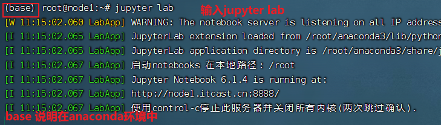
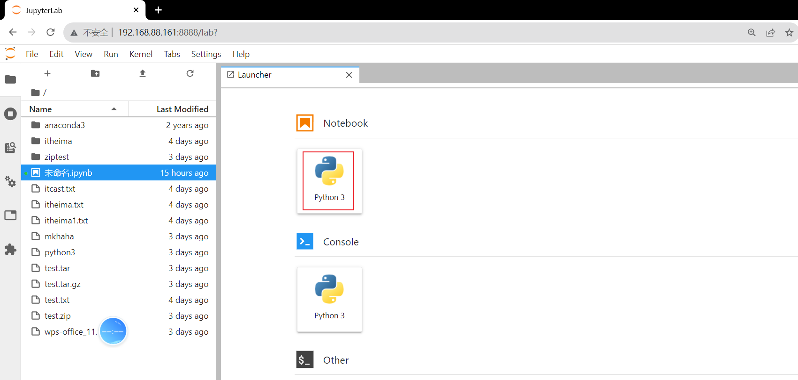
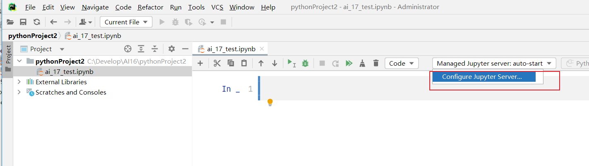
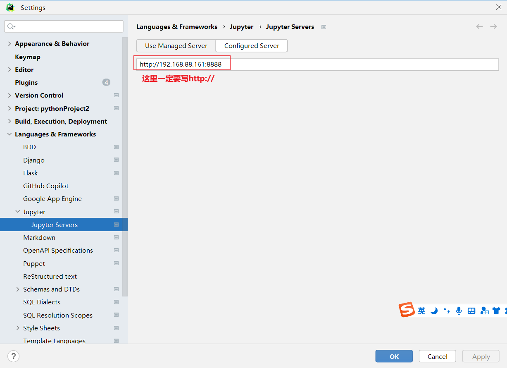
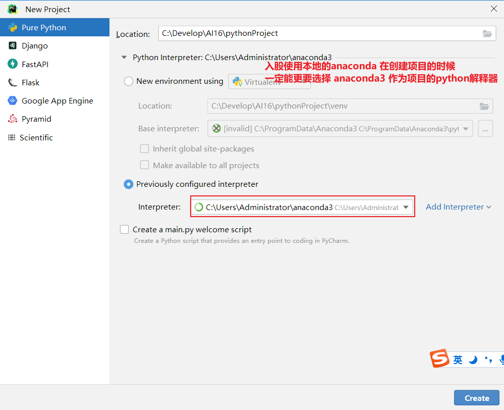
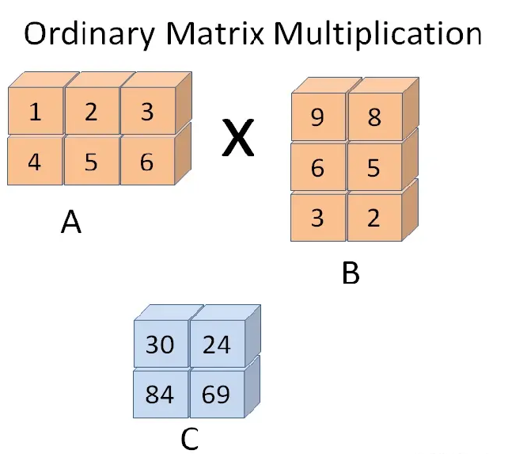

## 今日重点

窗口函数 

jupyter lab 环境搭建起来

Numpy


## 1 窗口函数

### 1.1 窗口函数简介

**窗口函数（Window Function）** 是 SQL 中一种高级分析工具，允许在数据集的特定“窗口”（一组相关行）上执行计算，**不合并原始数据行**，而是为每一行生成独立的结果。其核心目标是在保留明细数据的同时，支持复杂的分析和聚合操作。

- MYSQL 8.0 之后，加入了窗口函数功能
- 在没有窗口函数之前，我们需要通过定义临时变量和大量的子查询才能完成的工作，使用窗口函数实现起来更加简洁高效


### **1.2 窗口函数概念**


**基本语法：**

```sql
-- 基本语法
SELECT SUM() OVER(PARTITION BY ___ ORDER BY___) FROM Table

-- 完整语法
SELECT 
    列1, 列2,
    窗口函数() OVER (
        [PARTITION BY 分区列]
        [ORDER BY 排序列 [ASC|DESC]]
        [ROWS/RANGE BETWEEN 起始范围 AND 结束范围]
    ) AS 别名
FROM 表;
```


**核心概念：**

- **窗口（Window）**
  - 由 `OVER()` 子句定义，决定函数计算的范围。
  - 可以基于分区（`PARTITION BY`）、排序（`ORDER BY`）和行范围（`ROWS` 或 `RANGE`）进一步细化。
    - PARTITION BY 和 GROUP BY 的相同点：都会使用字段进行分组 , 做聚合计算的时候, 结果都是一样的
    - PARTITION BY 和 GROUP BY 的区别：GROUP BY 分组 聚合之后, 分组字段有几个取值, 就会返回几条结果；PARTITION BY 返回的结果 跟原始数据表的条目数是一样的

- **与聚合函数的区别**
  - 普通聚合函数（如 `SUM`、`AVG`、`count`、`max`、`min`）合并多行为一行。
  - 窗口函数保留所有原始行，并为每行附加计算结果。


**窗口函数 vs. 普通聚合函数**

| **特性**             | **窗口函数**           | **普通聚合函数（如GROUP BY）** |
| :------------------- | :--------------------- | :----------------------------- |
| **输出行数**         | 与输入行数相同         | 合并为分组后的行数（可能更少） |
| **计算范围**         | 基于窗口分区和排序规则 | 基于分组列                     |
| **典型用途**         | 排名、累计、趋势分析   | 汇总统计（总和、平均值等）     |
| **是否保留原始数据** | ✅ 保留所有明细行       | ❌ 仅保留分组和聚合结果         |


### 1.3 常见窗口函数

#### **a、排名函数**

- **`ROW_NUMBER()`**
  为每行分配唯一序号（相同值按排序顺序编号）。

  ```sql
  SELECT name, score, 
    ROW_NUMBER() OVER (ORDER BY score DESC) AS rank
  FROM students;
  ```

  

- **`RANK()`**
  相同值排名相同，但后续排名会跳过（如：1,1,3）。

  ```sql
  SELECT name, score, 
    RANK() OVER (ORDER BY score DESC) AS rank
  FROM students;
  ```

  

- **`DENSE_RANK()`**
  相同值排名相同，后续排名不跳过（如：1,1,2）。

  ```sql
  SELECT name, score, 
    DENSE_RANK() OVER (ORDER BY score DESC) AS rank
  FROM students;
  ```

  

- **`NTILE(n)`**
  将数据分成 `n` 个近似相等的组。

  ```sql
  SELECT name, score, 
    NTILE(4) OVER (ORDER BY score DESC) AS quartile
  FROM students;
  ```

| name    | score | quartile |
| :------ | :---- | :------- |
| Alice   | 95    | 1        |
| David   | 95    | 1        |
| Grace   | 92    | 1        |
| Bob     | 88    | 2        |
| Eva     | 85    | 2        |
| Jack    | 85    | 2        |
| Henry   | 80    | 3        |
| Ivy     | 78    | 3        |
| Charlie | 76    | 4        |
| Frank   | 70    | 4        |


#### b. **聚合函数作为窗口函数**

- **`SUM() OVER()`、`AVG() OVER()`**
  计算累计值或分区内聚合。

  ```sql
  -- 计算每个部门的累计工资
  SELECT name, department, salary,
    SUM(salary) OVER (PARTITION BY department ORDER BY hire_date) AS cumulative_salary
  FROM employees;
  ```


#### c. **偏移函数**

- **`LAG(列, 偏移量,默认值)`**

  - **功能**：获取当前行**之前**的第 `n` 行数据。
  - **参数**：
    - `列`：要获取的目标列。
    - `偏移量`：向前偏移的行数（默认为1）。
    - `默认值`：当没有前一行时的返回值（默认为 `NULL`）。

- **`LEAD(列, 偏移量,默认值)`**

  - **功能**：获取当前行**之后**的第 `n` 行数据。

  ```sql
  SELECT date, revenue,
    LAG(revenue, 1) OVER (ORDER BY date) AS prev_revenue,
    LEAD(revenue, 1) OVER (ORDER BY date) AS next_revenue
  FROM sales;
  ```


- **场景：计算相邻行的差值（环比）**

```sql
-- 计算每日销售额的环比增长
SELECT 
  date, 
  revenue,
  LAG(revenue, 1, 0) OVER (ORDER BY date) AS prev_revenue,
  revenue - LAG(revenue, 1, 0) OVER (ORDER BY date) AS growth
FROM daily_sales;
```

**结果示例**：

| date       | revenue | prev_revenue | growth |
| :--------- | :------ | :----------- | :----- |
| 2023-01-01 | 1000    | 0            | 1000   |
| 2023-01-02 | 1500    | 1000         | 500    |
| 2023-01-03 | 1200    | 1500         | -300   |


**关键注意事项**

- **必须指定 `ORDER BY`**：偏移函数依赖排序规则确定“前一行”或“后一行”的位置。

- **处理分区边界**：使用 `PARTITION BY` 时，偏移仅在分区内生效；分区第一行的 `LAG` 返回默认值，最后一行的 `LEAD` 同理。

- **默认值的设置**：通过第三个参数定义默认值，避免返回 `NULL`：


#### d. 练习

```sql
create database ai charset=utf8;
use ai;

create table employee(
    id int unsigned primary key not null,
    first_name varchar(20) not null,
    last_name varchar(30) not null,
    department_id  tinyint not null,
    salary int not null,
    years_worked  tinyint not null
);

insert into employee values
(1, 'Diane', 'Turner', 1, 5330, 4),
(2, 'Clarence', 'Robinson', 1, 3617, 2),
(3, 'Eugene', 'Phillips', 1, 4877, 2),
(4, 'Philip', 'Mitchell', 1, 5259, 3),
(5, 'Ann', 'Wright', 2, 2094, 5),
(6, 'Charles', 'Wilson', 2, 5167, 5),
(7, 'Russell', 'Johnson', 2, 3762, 4),
(8, 'Jacqueline', 'Cook', 2, 6923, 3),
(9, 'Larry', 'Lee', 3, 2796, 4),
(10, 'Willie', 'Patterson', 3, 4771, 5),
(11, 'Janet', 'Ramirez', 3, 3782, 2),
(12, 'Doris', 'Bryant', 3, 6419, 1),
(13, 'Amy', 'Williams', 3, 6261, 1),
(14, 'Keith', 'Scott', 3, 4928, 8),
(15, 'Karen', 'Morris', 4, 6347, 6),
(16, 'Kathy', 'Sanders', 4, 6286, 1),
(17, 'Joe', 'Thompson', 5, 5639, 3),
(18, 'Barbara', 'Clark', 5, 3232, 1),
(19, 'Todd', 'Bell', 5, 4653, 1),
(20, 'Ronald', 'Butler', 5, 2076, 5)
;

create table department(
    id int unsigned primary key not null,
    name varchar(30) not null
);

insert into department values
(1, 'IT'),
(2, 'Management'),
(3, 'Human Resources'),
(4, 'Accounting'),
(5, 'Help Desk')
;

create table purchase(
    id int unsigned primary key not null,
    department_id tinyint not null,
    item varchar(30) not null,
    price int not null
);

insert into purchase values
(1, 4, 'monitor', 531),
(2, 1, 'printer', 315),
(3, 3, 'whiteboard', 170),
(4, 5, 'training', 117),
(5, 3, 'computer', 2190),
(6, 1, 'monitor', 418),
(7, 3, 'whiteboard', 120),
(8, 3, 'monitor', 388),
(9, 5, 'paper', 37),
(10, 1, 'paper', 695),
(11, 3, 'projector', 407),
(12, 4, 'garden party', 986),
(13, 5, 'projector', 481),
(14, 2, 'chair', 180),
(15, 2, 'desk', 854),
(16, 2, 'post-it', 15),
(17, 3, 'paper', 60),
(18, 2, 'tv', 943),
(19, 2, 'desk', 478),
(20, 5, 'keyboard', 214)
;

SELECT
  first_name,
  last_name,
  salary,
  AVG(salary) OVER()
FROM employee;

-- 按部门计算平均薪资 统计每个员工和部门平均薪资的差值
select first_name,last_name,salary ,name ,
       AVG(salary) OVER(partition by department_id) ,
       salary - AVG(salary) OVER(partition by department_id) as difference
from employee
    join department on employee.department_id = department.id;
```


```sql
-- 使用RANK/DENSE_RANK/ROW_NUMBER 进行组内排序
create table employee2 (empid int,ename varchar(20) ,deptid int ,salary decimal(10,2));

insert into employee2 values(1,'刘备',10,5500.00);
insert into employee2 values(2,'赵云',10,4500.00);
insert into employee2 values(2,'张飞',10,3500.00);
insert into employee2 values(2,'关羽',10,4500.00);

insert into employee2 values(3,'曹操',20,1900.00);
insert into employee2 values(4,'许褚',20,4800.00);
insert into employee2 values(5,'张辽',20,6500.00);
insert into employee2 values(6,'徐晃',20,14500.00);

insert into employee2 values(7,'孙权',30,44500.00);
insert into employee2 values(8,'周瑜',30,6500.00);
insert into employee2 values(9,'陆逊',30,7500.00);


-- row_number() over(PARTITION BY deptid ORDER BY salary DESC)组内排序
select ename from
(select empid, ename,deptid,salary,row_number() over(PARTITION BY deptid ORDER BY salary DESC) as rank_ from employee2) temp where temp.rank_<3 ;
```

> 需要注意 给窗口函数结果起别名, 这里直接使用rank 会报错, rank是SQL的关键字


## 2 SQL 别名的作用域（可见范围）


**实例：**

```sql
-- avg_salary_department 别名不生效
select 
	first_name,
    last_name,
    salary,
    AVG(salary) OVER (partition by department_id) avg_salary_department,
    salary - avg_salary_department as difference
from employee join department on employee.department_id = department.id;
```


在 SQL 中，**别名的作用域（可见范围）和 SQL 的执行顺序**决定了你能否在同一个查询层级中直接引用别名。你提供的示例中 `avg_salary_department` 别名不生效的原因如下：

### **2.1 核心原因：SQL 的执行顺序**

SQL 的执行顺序为：
**FROM → WHERE → GROUP BY → HAVING → SELECT → ORDER BY**

- **窗口函数在 `SELECT` 阶段计算**，同时 `SELECT` 中的别名（如 `avg_salary_department`）也在这一阶段定义。

- **但同一层级的 `SELECT` 列表中，列的表达式是并行计算的**，这意味着：

  - 在计算 `salary - avg_salary_department` 时，`avg_salary_department` 尚未被定义（或未被识别）。

  - SQL 引擎会直接报错，提示 `avg_salary_department` 列不存在。

    

### **2.2 别名的作用域限制**

- **同一层级的 `SELECT` 列表中，不能直接引用其他列的别名**。
  例如，以下写法是非法的：

  ```sql
  SELECT 
    AVG(salary) OVER(...) AS hi, 
    salary - hi AS difference  -- 错误：无法识别 hi
  FROM ...;
  ```

- **子查询或 CTE 中的别名可以在外层引用**。
  因为子查询会先生成一个临时结果集，别名会成为该结果集的列名，供外层查询使用。


### **2.3 修正方法：通过子查询或 CTE**

将窗口函数和其别名定义在子查询中，然后在外部查询中引用：

```sql
SELECT 
  first_name,
  last_name,
  salary,
  name,
  hi,
  salary - hi AS difference  -- 合法：hi 是子查询的列
FROM (
  SELECT 
    e.first_name,
    e.last_name,
    e.salary,
    d.name,
    AVG(e.salary) OVER (PARTITION BY e.department_id) AS hi
  FROM employee e
  JOIN department d ON e.department_id = d.id
) AS sub_query;
```


### **2.4 为什么第二个查询可以引用别名 `rank_`？**

你提到的第二个查询：

```sql
SELECT ename 
FROM (
  SELECT 
    empid, 
    ROW_NUMBER() OVER(...) AS rank_  -- 别名在子查询中定义
  FROM employee2
) AS temp 
WHERE temp.rank_ < 3;  -- 合法：rank_ 是子查询结果集的列
```

- 子查询生成临时表 `temp`，其列包含 `rank_`。
- 外部查询的 `WHERE` 子句引用的是子查询结果集的列，而非同一层级的别名。


### **2.5 总结**

- **直接原因**：在同一 `SELECT` 列表中，无法引用其他列的别名。
- **根本原因**：SQL 引擎按阶段执行查询，别名在 `SELECT` 阶段定义，但无法在同一阶段内交叉引用。
- **解决方案**：将窗口函数和别名定义在子查询或 CTE 中，然后在外部查询中引用。


## 3 Linux  Mysql 小结

**Linux 基本的操作—常见的命令：**

- cd、 ls、mv、cp、rm、touch、cat、more
-   which：**命令查找**
-  find：**用于查找指定的文件**


**vi/vim 基本使用：**

- 命令/编辑/底行
- 命令 → 编辑  i/a/o
- 命令 → 底行 :
- ESC 回到命令模式

- 环境变量配置
  - /etc/profile
  - ~/.bashrc
- .sh /tar/tar.gz
  - .sh  下载下来之后, 先添加可执行的权限  chmod +x 文件名
  - tar -zxvf 文件名 -C 路径

- netstat /ps -ef   |grep 端口号/pid
- kill -9 


**Mysql**

- DQL 查询操作

- select * from 表名  join 表名 on 表名1.字段 = 表名2.字段  where  条件  group by 字段 

  

## 4 Python数据处理

### 4.1 python对比其他工具

Python凭借其**易用性、强大的库支持、灵活性**和**广泛的应用场景**，成为数据分析领域的首选工具。无论是处理小规模数据还是构建复杂的数据科学管道，Python都能提供高效解决方案。

| 工具       | 优势对比                                                     |
| :--------- | :----------------------------------------------------------- |
| **R语言**  | Python通用性更强，适合与工程化部署结合；R在统计模型和可视化细节更专业。 |
| **Excel**  | Python可处理更大规模数据，且避免手动操作错误。               |
| **MATLAB** | Python免费开源，库生态更丰富。                               |

- **Pandas：**
  -  series 一列数据
  - dataframe 二维表格

- **numpy：**  科学计算库, Pandas 默认使用Numpy 做数值计算
- **Matplotlib：** 灵活的可视化工具，适合生成静态、交互式或动态图表。


开发环境： `Jupyter Lab`/`Jupyter notebook`

- 可以在虚拟机中（安装**`anaconda`**-python的发行版）：具体操作流程在开发环境配置文件夹中。

- 也可以在本地安装 anaconda

- 在pycharm中调用notebook

  

### 3.2 开发环境搭建和Notebook使用说明

打开虚拟机，通过 finalshell 连接，在finalshell 的命令行 输入jupyter lab



打开浏览器, 输入 192.168.88.161:8888  回车之后, 会弹出输入密码的窗口, 输入123456  就可以了

在浏览器中看到如下页面, 点击 notebook就可以创建一个新的notebook



在pycharm中连接远程的notebook

- 新建一个purepython项目, 解释器选哪个都行
- 创建jupyter notebook


- 创建好notebook后, 打开这个文件, 选择配置Jupyter 服务器



http://192.168.88.161:8888/



本地环境搭建

- 可以安装anaconda 




### 4.3 notebook的使用

**快捷键** 

- esc 从输入模式可以退出到命令模式，在命令模式下可以输入快捷键

  - a  在当前cell 上面创建一个新的cell

  - b  在当前cell 下面创建一个新的cell

  - dd 删除当前cell

  - m 切换到markdown模式

  - y 切换到code模式

  - 运行cell 

    - ctrl+回车
    -  shift + 回车：运行当前cell，再创建一个新的cell

    

## 5 Numpy简介

**NumPy**（Numerical Python）是 Python 生态中最核心的科学计算库之一，专注于高性能的多维数组（**ndarray**）操作和数学函数。它是数据科学、机器学习和数值计算的基础工具，许多其他库（如 Pandas、SciPy、TensorFlow 等）都依赖 NumPy。


### **5.1  NumPy的优势**

- **性能优势**
  - 向量化操作避免显式循环，底层由 C 实现，计算效率极高。
  - NumPy重在数值计算，适合处理大规模数据（主要用于多维数组、矩阵处理），用来存储和处理大型矩阵，比Python自身的嵌套列表结构要高效的多。

- **简洁的语法**
  - 用一行代码实现复杂的数学运算（如矩阵乘法 `A @ B`）。
- **生态支持**
  - 是 SciPy、Pandas、Scikit-learn 等库的基础依赖，因此理解np的数据类型对python数据分析十分重要。


### 5.2 numpy的属性


#### **a、形状与维度**

- **`shape`**

数组的维度结构（元组形式），例如 `(行数, 列数)`。

```python
arr = np.array([[1, 2], [3, 4]])
print(arr.shape)  # 输出 (2, 2)
```

- **`ndim`**

数组的维度数（轴的个数）。

```python
print(arr.ndim)  # 输出 2（二维数组）
```

- **`size`**

数组总元素个数。

```python
print(arr.size)  # 输出 4（2×2）
```


#### **b、数据类型**

- **`dtype`**

数组元素的数据类型（如 `int32`, `float64`）。

```python
arr = np.array([1, 2], dtype=np.float32)
print(arr.dtype)  # 输出 float32
```


#### **c、内存信息**

- **`itemsize`**

单个元素占用的字节数（由 `dtype` 决定）。

```python
print(arr.itemsize)  # 输出 4（float32 占4字节）
```


- **`nbytes`**

数组总内存占用（字节数）: `size * itemsize`。

```python
print(arr.nbytes)  # 输出 8（2元素×4字节）
```


####  **d、其他实用属性**

- **`T`**

返回数组的转置（交换行列）。

```python
print(arr.T)  # 转置（若 arr 是二维数组）
```


#### **e、 关键操作与注意事项**

- **修改形状**

直接修改 `shape` 属性（需总元素数一致）：

```python
arr.shape = (4, 1)  # 原地修改
```

使用 `reshape()` 方法（返回新数组，原数组不变）：

```python
new_arr = arr.reshape(4, 1)
```


### 5.3 创建ndarray


#### **a、直接输入创建**

ndarray 每一个元素的数据类型必须一致

```python
a = np.array([2,3,4])
a = np.array([1,2,'haha']) # 如果这样创建的话，会将1，2转换为字符串格式，array(['1', '2', 'haha'], dtype='<U21') 
```


#### b、批量生成创建

- **`zeros()` 、`ones()`、`empty()`**
  - 函数**`zeros()`**创建一个全是0的数组
  - 函数**`ones()`**创建一个全1的数组
  - 函数**`empty()`**创建一个内容随机并且依赖于内存状态的数组。
    - 以上三个方法默认创建的数组类型(`dtype`)都是`float64`
    - 传入的是 shape形状，以元组的形式
    - 实例：`np.ones((2,3,4))`

```python
array([[[1., 1., 1., 1.],
        [1., 1., 1., 1.],
        [1., 1., 1., 1.]],

       [[1., 1., 1., 1.],
        [1., 1., 1., 1.],
        [1., 1., 1., 1.]]])
```


- **`arange ()`** 

`arange()` 类似 `python` 的 `range()` ，创建一个一维 ndarray 数组。

```python
np_arange = np.arange(10,20,5,dtype=int)
print('arange创建np_arange:',np_arange)  # arange创建np_arange: [10 15]
print('arange创建np_arange的元素类型:',np_arange.dtype)  # arange创建np_arange的元素类型: int32
print('arange创建np_arange的类型:',type(np_arange))  # arange创建np_arange的类型: <class 'numpy.ndarray'>
```


#### c、随机生成创建

```python
np.random.rand(3,4) # 0,1 之间，浮点数
np.random.randint(-5,5,size=(3,4)) # 随机的整数 给定起始结束区间, size 生成随机数的形状
np.random.uniform(-1,5,size=(3,4)) # 生成均匀分布浮点数的随机数  定起始结束区间, size 生成随机数的形状
np.random.randn(2, 3)   # 生成服从标准正态分布（均值为 0，标准差为 1）的随机数数组
```


#### d、生成矩阵

matrix 是 ndarray 的子类，只能生成 2 维的矩阵

```python
x1 = np.mat("1 2;3 4")
x2 = np.matrix("1 2;3 4")

x3 = np.matrix([[1,2,3],[4,5,6]])
```


#### e、生成等比/等差数列

- `logspace()` 等比数列：`np.logspace()`是用于创建一个等比数列构成的一维数组，它最常用的有三个参数，第一个参数表示起始点，第二个参数表示终止点，第三个参数表示数列的个数。

```python
# logspace中，开始点和结束点是默认是10的幂
np.logspace(0,0,10)
np.logspace(0,9,10)
np.logspace(0,9,10,base=2) # base 可以换底数  这里就是2^0 ~2^9 生成10个数的等比数列
```


- `linspace()`等差数列：`np.linspace()`是用于创建一个等差数列构成的一维数组，它最常用的有三个参数，第一个参数表示起始点，第二个参数表示终止点，第三个参数表示数列的个数。

```python
np.linspace(1,10,10)
np.linspace(1,10,10,endpoint=False) #endpoint 是否包含结束点, 默认是True 改成False不包含结束点
```


- `logspace()`、`linspace()`创建的数组元素是浮点型。


#### f、ndarray的数据类型

- dtype参数，指定数组的数据类型，类型名+位数，如float64, int32
- astype方法，转换数组的数据类型


### 5.4 Numpy的内置函数

#### **a、基本函数**

```python
import numpy as np
arr = np.random.uniform(-1,5,size=(3,4)) 

np.ceil(arr)   # 向上最接近的整数，参数是 number 或 array
np.floor(arr)  # 向下最接近的整数，参数是 number 或 array
np.rint(arr)   # 四舍五入，参数是 number 或 array
np.isnan(arr)  # 判断元素是否为 NaN(Not a Number)，参数是 number 或 array

# 需要注意multiply/divide 如果是两个ndarray进行运算 shape必须一致
np.multiply(arr,arr)  # 元素相乘，参数是 number 或 array
np.divide(arr,arr)    # 元素相除，参数是 number 或 array

np.abs()       # 元素的绝对值，参数是 number 或 array
np.where(arr>0,1,-1)  # np.where(condition, x, y): 三元运算符，x if condition else y
```


#### **b、统计函数** 

```python
import numpy as np
arr = np.random.uniform(-1,5,size=(3,4)) 

np.mean(arr)  # 所有元素的平均值,参数是 number 或 array
np.sum(arr)   # 所有元素的和，参数是 number 或 array
np.max(arr)   # 所有元素的最大值，参数是 number 或 array
np.min(arr)   # 所有元素的最小值，参数是 number 或 array
np.argmax(arr)   # 最大值的下标索引值，参数是 number 或 array
np.argmin(arr)   # 最小值的下标索引值，参数是 number 或 array
np.cumsum()   # 返回一个一维数组，每个元素都是之前所有元素的累加和，参数是 number 或 array  
np.cumprod()  # 返回一个一维数组，每个元素都是之前所有元素的累乘积，参数是 number 或 array  


np.std(arr)   # 所有元素的标准差，参数是 number 或 array
np.var(arr)   # 所有元素的方差，参数是 number 或 array
```

多维数组默认统计全部维度，**axis参数**可以按指定轴心统计，值为0则按列统计，值为1则按行统计。

```python
np.sum(arr,axis=0)  # 数组的按列统计和
np.sum(arr,axis=1)  # 数组的按行统计和
```


**标准差与方差的含义及区别**

标准差和方差是统计学中衡量数据 **离散程度（波动性）** 的核心指标，两者密切相关但用途不同。以下是它们的定义、区别及实际意义：

- **方差（Variance）**
  - **定义**：数据点与均值的 **平方差的平均值**。
  - **公式**：

$$
σ^2 = \frac{1}{N} \sum_{i=1}^{N} (x_i - \mu)^2
$$

- **标准差（Standard Deviation）**
  - **定义**：方差的 **平方根**，将离散程度还原到原始数据单位。
  - **公式**：

$$
s = \sqrt{σ^2}
$$

**核心区别**

| **特征**     | **方差（Variance）**             | **标准差（Standard Deviation）**     |
| :----------- | :------------------------------- | :----------------------------------- |
| **单位**     | 原始数据单位的平方（如：米²）    | 与原始数据单位一致（如：米）         |
| **数学性质** | 放大离群值的影响（平方操作）     | 缓解离群值影响（平方根操作）         |
| **应用场景** | 理论分析（如概率模型、优化算法） | 实际解释（如数据波动描述、风险评估） |
| **直观性**   | 较难直接理解（单位不直观）       | 更易解释（单位与数据一致）           |


**实际意义**

- **方差的意义**
  - **反映数据整体波动强度**：方差越大，数据点越分散。
  - **用于数学推导**：在统计学公式（如协方差、回归分析）中，方差更易于代数运算。

- **标准差的意义**
  - **直观衡量波动性**：例如，股票收益率的标准差代表风险。
  - **判断数据分布**：在正态分布中，约 68% 的数据落在均值 ±1 标准差内，95% 在 ±2 标准差内。


**示例**

假设某班级数学成绩为：`[70, 80, 85, 90, 95]`，均值为 `84`。

- **计算方差**：

$$
σ^2 = \frac{(70-84)^2+(80-84)^2+(85-84)^2+(90-84)^2+(95-84)^2}{5} =92
$$

- **计算标准差**：

$$
s = \sqrt{92}≈9.59
$$

- **解读**：学生成绩平均波动约 ±9.59 分。


**总结**

- **方差**是理论计算的基础，**标准差**是实际解释的工具。

- 选择使用场景：

  - 若需要数学运算（如回归分析），优先用方差。

  - 若需直观理解数据波动，用标准差。

    

#### **c、比较函数**

- `np.any()`: 至少有一个元素满足指定条件，返回True

- `np.all()`: 所有的元素满足指定条件，返回True

  

#### **d、去重**

`np.unique()`:找到唯一值并返回排序结果，类似于Python的set集合


#### **e、排序**

- `np.sort(arr)`：会在一个副本上排序, 不会影响原始的数据，每行单独排序

- `arr.sort()`：直接修改原始数据，每行单独排序


### 5.5 Numpy ndarray之间的运算

- ndarray的算术运算

ndarray的算术运算（加、减、乘、除）是按照元素位置计算的。新的数组被创建并且被结果填充。计算的时候, 位置对应的元素 进行 加减乘除的计算, 计算之后得到的结果的shape 跟arr_a  /arr_b 一样

两个ndarray, 一个是`arr_a`  另一个是`arr_b`，它们俩之间进行  `arr_a  + arr_b`  或 `arr_a  - arr_b`  或 `arr_a  * arr_b` 或`arr_a / arr_b`这样计算的前提是 shape相同


- ndarray的矩阵运算


`arr_a  .dot(arr_b)` 前提： arr_a 行数 = arr_b列数




```python
x = np.array([[1,2,3],[4,5,6]])
y = np.array([[6,23],[-1,7],[8,9]])
x.dot(y)
np.dot(x,y)
```


## 6 pandas数据结构

### 6.1 创建Series 和 DataFrame

DataFrame和Series是Pandas最基本的两种数据结构

其中Series是一维容器，Series表示DataFrame的每一列。可以把DataFrame看作由Series对象组成的字典，其中key是列名，值是Series。Series和Python中的列表非常相似，但是它的每个元素的数据类型必须相同。


**pd.Series(列表)**：创建 Series 的最简单方法是传入一个Python列表

- 如果不特殊指定, 会自动添加行索引 Index, 从0开始计数
- 如果想自己设置行索引, 创建Series时可以通过index这个参数来设置行索引

```python
s = pd.Series(['banana',42])
s = pd.Series(['Tome','Male'],index=['Name','Gender'])
```


**pd.DataFrame(字典)**

- 有行索引index, 也有列名 columns

```python
# 创建DataFrame的时指定列的顺序和行索引
name_list = pd.DataFrame({'姓名':['Tome','Bob'],'职业':['算法工程师','AI工程师'],'年龄':[28,36]})
name_list = pd.DataFrame(data = {'职业':['算法工程师','AI工程师'],'年龄':[28,36]},columns=['年龄','职业'],index=['Tome','Bob'])
```


### 6.2 Series 常用方法和属性

- **Series常用属性**

  - 加载加载CSV文件【**如果使用虚拟机，需要虚拟机上面的路径地址，文件同步**】 

  ```python
  import pandas as pd
  data= pd.read_csv('/tmp/pycharm_project_882/data/nobel_prizes.csv',index_col='id')  # 这里我们使用的是相对路径, 相对的是.ipynb文件
  data.head()
  
  # 使用 DataFrame的loc属性获取数据集里的一行，就会得到一个Series对象,从DataFrame中获取一行/一列数据 都会返回Series。
  first_row = data.loc[941]
  ```


2.可以通过 index 和 values属性获取行索引和值


- 3.Series的keys方法，作用个index属性一样

- 

- shape  形状 

- values 值 → ndarray

  

  


常用方法

data.（列名sharp）


- value_counts()

  

- count()3.通过count()方法可以返回有多少非空值

- 对比全部数量shape属性

- /min()/max()/sum()/mean() 平均 /std() 标准差  这些方法都调用的是numpy的方法

- describe()打印描述信息

  - ```
    一次性返回 计数/均值/标准差/最小值/ 25%分位数 中位数 75%分位数 最大值 这些常用的统计量
    ```

  - ```
    字符串型describe 获取的是 计数/唯一值数量/ 出现次数最多的取值, 及其出现的次数
    ```


## 6 今日小结

- 窗口函数

  SELECT SUM() OVER(PARTITION BY ___ ORDER BY___) FROM Table

  分组聚合之后使用窗口函数, 可以把聚合值和原始数据放在一起

  组内排序,  rank/dense_rank/row_number

- numpy  
  - 今天的API 过一遍
  - 重点掌握ndarray相关属性
- Pandas 数据结构
  - Series 一列数据
  - Dataframe 二维数据