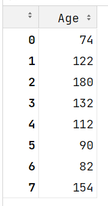
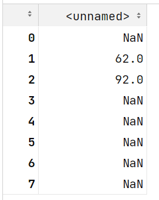
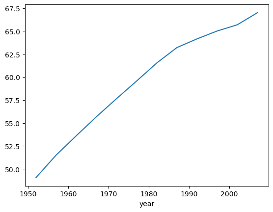

## 今日重点

Pandas数据结构

DataFrame入门


### 1、Anaconda 和虚拟环境

anaconda 是一个Python的发行版, 主要用于科学计算，继承了一个conda 虚拟环境管理器。

#### 1.1 继承了一个conda 虚拟环境管理器

- `conda create -n 虚拟环境名字`： 可以创建一个新的虚拟环境
- `conda activate 虚拟环境名字`：激活虚拟环境
- `conda deactivate`： 退出当前的虚拟环境
- **常用命令：**

| 命令                                    | 功能                                                   | 示例                                      |
| --------------------------------------- | ------------------------------------------------------ | ----------------------------------------- |
| `conda create -n <env_name>`            | 创建一个新的虚拟环境，名称为 `<env_name>`              | `conda create -n myenv`                   |
| `conda activate <env_name>`             | 激活虚拟环境 `<env_name>`                              | `conda activate myenv`                    |
| `conda deactivate`                      | 退出当前虚拟环境                                       | `conda deactivate`                        |
| `conda env list`                        | 列出所有已创建的虚拟环境                               | `conda env list`                          |
| `conda install <package>`               | 安装包 `<package>` 到当前激活的环境                    | `conda install numpy`                     |
| `conda install -n <env_name> <package>` | 在指定环境 `<env_name>` 中安装包 `<package>`           | `conda install -n myenv pandas`           |
| `conda list`                            | 列出当前环境中的所有已安装的包                         | `conda list`                              |
| `conda update <package>`                | 更新当前环境中的包 `<package>`                         | `conda update numpy`                      |
| `conda update conda`                    | 更新 conda 自身                                        | `conda update conda`                      |
| `conda remove <package>`                | 从当前环境中卸载包 `<package>`                         | `conda remove scipy`                      |
| `conda remove -n <env_name> --all`      | 删除虚拟环境 `<env_name>` 及其所有内容                 | `conda remove -n myenv --all`             |
| `conda clean --all`                     | 清理不再使用的包缓存、日志、索引等文件                 | `conda clean --all`                       |
| `conda info`                            | 显示当前 conda 的配置信息（版本、环境、Python 版本等） | `conda info`                              |
| `conda search <package>`                | 搜索包 `<package>` ，查看其可用版本                    | `conda search scikit-learn`               |
| `conda env export > env.yml`            | 导出当前环境的所有包及其版本为一个 yml 文件            | `conda env export > environment.yml`      |
| `conda env create -f env.yml`           | 根据 yml 文件创建一个新环境                            | `conda env create -f environment.yml`     |
| `conda list --revisions`                | 显示环境中的所有更改历史（安装、卸载、更新等）         | `conda list --revisions`                  |
| `conda install python<version>`         | 安装或更新指定版本的 Python 到当前环境中               | `conda install python=3.8`                |
| `conda config --add channels <channel>` | 添加新的 conda 仓库源                                  | `conda config --add channels conda-forge` |


#### 1.2 为什么要有虚拟环境

为不同项目创建独立的开发环境，解决以下问题：

- **依赖隔离**
  - **避免版本冲突**：不同项目可能依赖同一库的不同版本，虚拟环境将每个项目的依赖独立存放，防止全局安装导致的版本冲突。
  - **示例**：项目A需要`numpy 1.18`，项目B需要`numpy 1.20`，通过虚拟环境可分别管理。

- **环境一致性**
  - **协作与部署**：通过导出环境配置文件（如`environment.yml`），确保团队成员或生产环境能复现完全相同的依赖版本，避免“在我机器上能运行”的问题。

- **安全性**
  - **保护系统环境**：避免直接修改系统级的Python环境，防止误操作导致系统工具或服务崩溃。

- **灵活性与效率**
  - **轻量级隔离**：虚拟环境仅复制必要的依赖，节省磁盘空间，同时支持快速创建和删除环境。
  - **多版本测试**：可同时测试同一库在不同版本下的兼容性（如Python 3.8 vs 3.11）。

- **工具链管理**
  - **专用工具隔离**：某些项目可能需要特定工具（如Jupyter Lab、TensorFlow），虚拟环境可独立安装，避免全局污染。


### 2、布尔索引/Boolean index

从**`Series`**、**`DataFrame`**中获取满足某些条件的数据，可以使用布尔索引。

- 布尔索引类似于`SQL`语句中的where条件
- 将数据中的某一列和一个值进行比较 (>, <  , = , !=) ，比较之后会返回一个True/False组成的Series, 把这个Series再传递给Series/DataFrame (**传递的时候, 需要注意要写到中括号中**)
  - True/False组成的Series, True所对应的行, 原始数据会留下
  - True/False组成的Series, False所对应的行, 原始数据会过滤掉


#### 1.1 **基本语法**

通过条件表达式生成布尔序列，直接对DataFrame或Series进行筛选：

```python
import pandas as pd

# 示例DataFrame
df = pd.DataFrame({
    'name': ['Alice', 'Bob', 'Charlie', 'David'],
    'age': [25, 30, 35, 40],
    'score': [85, 90, 78, 95]
})

# 筛选年龄大于30的行
mask = df['age'] > 30
result = df[mask]
```


#### 1.2 **多条件组合**

使用逻辑运算符 `&`（与）、`|`（或）、`~`（非），需用括号明确优先级：

```python
# 筛选年龄>30 且 分数>80的行
result = df[(df['age'] > 30) & (df['score'] > 80)]
```


#### **1.3  处理缺失值**

结合 `.isna()` 或 `.notna()` 处理缺失值（NaN）：

```python
# 示例数据包含缺失值
df_nan = pd.DataFrame({'value': [1, None, 3, 4]})

# 筛选非缺失值
result = df_nan[df_nan['value'].notna()]
```


#### 1.4  修改数据

通过布尔索引修改符合条件的值：

```python
# 将分数>=90的行的等级设为'A'
df.loc[df['score'] >= 90, 'grade'] = 'A'
```


#### 1.5 **布尔索引的陷阱**

- **索引对齐问题**：若布尔掩码与原数据索引不一致，可能导致错误。需确保索引对齐或重置索引：

```python
mask = pd.Series([True, False, True], index=[0, 1, 3])
result = df[mask.reindex(df.index, fill_value=False)]
```

- **运算符优先级**：`&` 和 `|` 的优先级高于比较运算符，必须用括号包裹条件：

```python
# 错误写法：df['age'] > 30 & df['score'] < 90
# 正确写法：
df[(df['age'] > 30) & (df['score'] < 90)]
```


#### 1.6 练习

```python
scientiests= pd.read_csv('data/scientists.csv')

#计算平均年龄
avg_age = scientiests['Age'].mean()
# 获取了年龄的Series
age = scientiests['Age']
scientiests['Name'][age>avg_age]
scientiests['Name'][scientiests['Age']>avg_age]
# 上面的代码相当于
temp_list = [False,True,True,True,False,False,False,True]
scientiests['Name'][temp_list]
```


### 3、Series的运算

Series和一个数值之间的计算：每一个元素都会和这个数值进行计算

- 两个Series之间计算
  - 能算出非nan的条件, 两个Series的index 相同
  - 如果在另外一个Series中没有找到当前行的Index, 这个index在计算结果中会保留但是,  得到的值是nan

```python
age+age
```



```python
age+pd.Series([1,2],index = [1,2])
```



### 4 DataFrame的常用操作

**一、核心属性**

| 属性       | 描述                       | 示例                           |
| :--------- | :------------------------- | :----------------------------- |
| `.shape`   | DataFrame的行数和列数      | `df.shape` → `(4, 3)`          |
| `.columns` | 列名的索引对象（可修改）   | `df.columns = ['A', 'B', 'C']` |
| `.index`   | 行索引对象（可重置或修改） | `df.index = [0, 1, 2, 3]`      |
| `.dtypes`  | 每列的数据类型             | `df.dtypes` → 显示各列类型     |
| `.values`  | 将DataFrame转换为NumPy数组 | `df.values` → 二维数组         |
| `.loc[]`   | 基于标签的索引（行和列）   | `df.loc[0, 'name']` → 获取值   |
| `.iloc[]`  | 基于整数位置的索引         | `df.iloc[0, 1]` → 第一行第二列 |


**二、数据预览与信息**

1. **基础方法**

| 方法          | 功能                               | 示例                     |
| :------------ | :--------------------------------- | :----------------------- |
| `.head(n)`    | 查看前`n`行（默认5行）             | `df.head(2)` → 显示前2行 |
| `.tail(n)`    | 查看后`n`行（默认5行）             | `df.tail(3)` → 显示后3行 |
| `.info()`     | 显示数据摘要（列名、非空值、类型） | `df.info()`              |
| `.describe()` | 数值列的统计摘要（均值、标准差等） | `df.describe()`          |


**三、数据操作**

1. **数据筛选与修改**

| 方法             | 功能                     | 示例                                       |
| :--------------- | :----------------------- | :----------------------------------------- |
| `.query(条件)`   | 按条件筛选行             | `df.query("age > 30")`                     |
| `.drop(columns)` | 删除指定列或行           | `df.drop(columns=['score'])`               |
| `.rename()`      | 重命名列或索引           | `df.rename(columns={'age': '年龄'})`       |
| `.assign()`      | 添加新列（支持链式操作） | `df.assign(age_plus_10=df['age']+10)`      |
| `.sort_values()` | 按列值排序               | `df.sort_values('score', ascending=False)` |


**四、缺失值处理**

| 方法             | 功能                            | 示例                |
| :--------------- | :------------------------------ | :------------------ |
| `.isnull()`      | 检查缺失值（返回布尔DataFrame） | `df.isnull()`       |
| `.dropna()`      | 删除包含缺失值的行或列          | `df.dropna(axis=0)` |
| `.fillna(value)` | 填充缺失值                      | `df.fillna(0)`      |


**五、分组与聚合**

| 方法         | 功能                     | 示例                                      |
| :----------- | :----------------------- | :---------------------------------------- |
| `.groupby()` | 按列分组                 | `df.groupby('gender')['score'].mean()`    |
| `.agg(func)` | 应用聚合函数（支持多个） | `df.agg({'age': 'mean', 'score': 'max'})` |


**六、数据合并与重塑**

| 方法             | 功能                              | 示例                                                         |
| :--------------- | :-------------------------------- | :----------------------------------------------------------- |
| `.merge()`       | 合并两个DataFrame（类似SQL JOIN） | `pd.merge(df1, df2, on='id')`                                |
| `.concat()`      | 拼接多个DataFrame（行或列）       | `pd.concat([df1, df2], axis=0)`                              |
| `.pivot_table()` | 创建透视表                        | `df.pivot_table(index='name', columns='year', values='sales')` |
| `.melt()`        | 将宽表转换为长表                  | `df.melt(id_vars='name', value_vars=['age', 's`              |


**七、文件读写**

| 方法          | 功能            | 示例                                 |
| :------------ | :-------------- | :----------------------------------- |
| `.to_csv()`   | 保存为CSV文件   | `df.to_csv('data.csv', index=False)` |
| `.read_csv()` | 读取CSV文件     | `pd.read_csv('data.csv')`            |
| `.to_excel()` | 保存为Excel文件 | `df.to_excel('data.xlsx')`           |


**八、其他实用方法**

| 方法             | 功能               | 示例                                  |
| :--------------- | :----------------- | :------------------------------------ |
| `.apply(func)`   | 对行或列应用函数   | `df['name'].apply(len)`               |
| `.astype(dtype)` | 强制转换列数据类型 | `df['age'] = df['age'].astype(float)` |
| `.set_index()`   | 设置某列为索引     | `df.set_index('name', inplace=True)`  |
| `.reset_index()` | 重置索引为整数序号 | `df.reset_index(drop=True)`           |


**总结表格**

| **类别**       | **常用属性/方法**                        | **核心功能**     |
| :------------- | :--------------------------------------- | :--------------- |
| **基础属性**   | `.shape`, `.columns`, `.dtypes`          | 描述数据结构     |
| **数据预览**   | `.head()`, `.info()`, `.describe()`      | 快速了解数据分布 |
| **数据操作**   | `.drop()`, `.assign()`, `.sort_values()` | 增删改查与排序   |
| **缺失值处理** | `.isnull()`, `.fillna()`                 | 数据清洗         |
| **分组聚合**   | `.groupby()`, `.agg()`                   | 数据聚合分析     |
| **文件读写**   | `.to_csv()`, `.read_csv()`               | 数据持久化       |
| **高级操作**   | `.merge()`, `.apply()`                   | 复杂数据处理     |

布尔索引/两个DataFrame之间的计算, 和Series完全一样


### 5 DataFrame 行列索引的修改

#### 5.1 行索引(index)的调整

- `set_index(列名)` 把某一列设置为索引

```python
movie2.set_index('movie_title')
```

- reset_index() 重置索引, 回到从0开始计数的数值索引的状态

```python
movie2.reset_index()
```

- 在加载数据的时候, 可以通过**`pd.read_csv('路径', index_col='列名')`** 直接指定某一列作为索引

  

**需要注意的问题**

99%关于DataFrame/Series调整的API , 都会默认在副本上进行修改, 调用修改的方法后, 会把这个副本返回

- 这类API都有一个共同的参数 inplace 默认值都是False
- 如果把inplace 改成True会直接修改原来的数据, 此时这个方法就没有返回值了


#### 5.2 行列索引值的修改

- rename()

  ```python
  idx_rename = {'Avatar':'阿凡达'}
  col_rename = {'duration':'时长'}
  # index 要修改的索引的信息{老索引值:新的索引值}
  # columns 要修改的列名的信息{老列名值:新的列名值}
  # inplace 是否在原始的数据上修改, 默认是False 不会修改原始数据
  movie3.rename(index=idx_rename,columns=col_rename,inplace=True)
  ```

  >需要注意传入的字典, 老的列名/行索引不存在, 不会报错, 只不过运行之后没有效果
  >
  >比较适合使用的场景, 行/列比较多的时候

- 整体替换 index / columns

  - dataframe.index 获取行索引    数据类型  pandas.core.indexes.base.Index
  - dataframe.columns 获取列索引  数据类型 pandas.core.indexes.base.Index
  - Index 类型不能直接修改 先需要把这个Index转换成列表, 修改列表中的元素, 再整体替换 index/columns

  ```python
  index_list = movie3.index.to_list()
  index_list[1] = '加勒比海盗:世界的尽头'
  movie3.index =index_list
  col_list = movie3.columns.to_list()
  col_list[1] = '导演'
  movie3.columns = col_list
  ```


#### 5.3     DataFrame 插入/删除/追加一列数据      

- 追加一列数据


```python
movie['是否看过'] = 0
movie['脸书点赞总数'] = movie['actor_1_facebook_likes']+movie['actor_2_facebook_likes']\
                     +movie['actor_3_facebook_likes']+movie['director_facebook_likes']
```

- 删除一列、一行数据


```python
# 删除一列数据
movie.drop('脸书点赞总数',axis=1,inplace=True)

# 删除一行数据
movie.drop('Avatar', axis=0, inplace=True)
```

>要删除的列名or行名
>
>axis = 'columns'|'index' (默认)   1|0(默认)  按列|行 删除
>
>inplace = 默认False 是否修改原始数据


- insert 在指定位置插入一列数据

```python
movie.insert(loc=0,column='利润',value=movie['gross']-movie['budget'])
```

>loc=0  要插入列的位置编号
>
>columns 要插入列的列名
>
>value = 要插入列的值
>
>**需要注意的是这个方法没有inplace 参数, 直接在原始数据上修改**


从DataFrame中, 取出一列数据两种写法

- `df['列名']`  一定成功

- `df.列名` :  有些情况下这种写法会有问题  

  - 列名和python的关键字/方法名冲突
  - 列名中有空格

  

#### 5.4 DataFrame数据的保存跟加载

保存数据 `df.to_数据格式(路径)`

- **pickle** python特有的数据格式 如果数据处理之后, 后续还是要在Python中使用, 推荐保存成pickle文件
- tsv  用制表符作为分隔符

```python
movie5 = movie4.reset_index().head()
movie5.to_pickle('data/movie5.pkl')
movie5.to_csv('data/movie5.csv')
movie5.to_excel('data/movie5.xlsx')
movie5.to_csv('data/movie5_noindex.csv',index=False) # index 不保存行索引
movie5.to_csv('data/movie5_noindex.tsv',index=False,sep='\t')
```

加载数据, pd.read_数据格式(路径)

```python
pd.read_pickle('data/movie5.pkl')
pd.read_excel('data/movie5.xlsx')
pd.read_csv('data/movie5.csv')
pd.read_csv('data/movie5_noindex.csv')
```


### 6 DataFrame数据分析入门

#### 6.1 DataFrame获取部分数据

- 获取一列/多列数据
  - `df['列名']` → series
  - `df[['列名']]` → **DataFrame**

- 获取多列数据
  - `df[列表]` /`df[['列名1','列名2']]`


#### 6.2 loc 和 iloc

`df.loc[[行名字],[列名字]]` / `df.iloc [[行序号],[列序号]]`

- `loc`/`iloc` 不是方法是**属性**
- 可以使用切片语法, 可以传入一个值, 也可以传入列表

```python
df.loc[0]  # 取出来的数据是Series 还是DataFrame??
df.iloc[:,[2,4,-1]] # :, 获取所有行  [2,4,-1] 获取序号是2和4 以及最后一列
df.loc[:,['country','year']] # :, 获取所有行  获取名字是country 和 year这两列数据
df.iloc[:,0:6:2] # 切片 0:6 左闭右开 不包含6  2是步长
df.loc[:,'country':'year'] # 切片 'country':'year' 没有开闭区间的概念
```

在使用的时候, 推荐使用loc 使用行/列的名字来取值, 代码可读性比较好


#### 6.3 分组聚合

分组聚合在SQL中 

```sql
select 字段, 聚合函数(字段名字) from 表名 group by 分组字段名字
```

DataFrame的api

```python
df.groupby('分组字段')['要聚合的字段'].聚合函数()
df.groupby(['分组字段','分组字段2'])[['要聚合的字段','要聚合的字段2']].聚合函数()
```

>分组后默认会把分组字段作为结果的行索引(index)
>
>如果是多字段分组, 得到的是MultiIndex(复合索引), 此时可以通过reset_index() 把复合索引变成普通的列
>
>基本代码调用的过程
>
>- 通过df.groupby('year')先创一个分组对象
>- 从分组之后的数据DataFrameGroupBy中，传入列名进行进一步计算返回结果为一个 SeriesGroupBy ，其内容是分组后的数据
>- 对分组后的数据计算平均值


#### 6.4 pandas 简单绘图

series数据.plot()

- 默认绘制的是折线图
- index 作为x坐标取值
- value y坐标取值

```python
df.groupby('year')['lifeExp'].mean().plot()
```




### 7 pandas数据分析/处理练习

加载数据之后, 要先查看数据的基本情况

- `df.info()`
  - 数据有哪些列, 有多少条数据, 每列数据的数据类型, 每一列数据是否有空值
- `df.describe()`
  - 数值：计数，极值，分位数，均值，标准差
  - 类别型：`df.describe(include =object)`  不同取值的数量, 出现次数最多的取值, 出现次数最多取值出现的次数


**排序相关的API**

- nlargest/nsmallest
  - nlargest 获取某个字段取值最大的前n条数据
  - nsmallest  获取某个字段取值最小的前n条数据

```python
movie2 = movie[['movie_title','imdb_score','budget']]
movie2.nlargest(100,'imdb_score').nsmallest(5,'budget')
```

- sort_values() 对某一列/某几列的值排序

  ```python
  sorted_result = movie3.sort_values(['title_year','imdb_score'],ascending=False)
  ```

  >ascending 升序 默认是True , 改成False之后, 就是降序了
  >
  >ascending  传入的参数是True, False的列表, 这个列表的长度需要和要排序的字段对应
  >
  >- 可以分别指定 哪个字段升序, 哪个字段降序

- 去重 drop_duplicates()

  ```python
  sorted_result.drop_duplicates(subset=['title_year'],keep='last')
  ```

  >drop_duplicates
  >
  >- subset  通过这个参数, 可以指定, 哪些字段重复, 认为是重复值, 可以被删除
  >- keep first/last   去重的时候, 保留第一条/保留最后一条


### 8 内容回顾

加载数据

df  = pd.read_XXX(路径)

了解数据, 认识数据

df.info()

df.describe()

df.shape/values/dtype

加载部分数据

df['列名'] / df[['列名1','列名2']]

df.loc[['行名'],['列名']] / df.iloc[['行序号'],['列序号']]

df[df['列']> 值] /df[df['列']== 值] /df[df['列']<值]  类似于SQL 的where 条件

行列修改

- set_index() / reset_index()
- rename(index=idx_rename,columns=col_rename )
- df.index =  
- df.columns = 

插入/删除/追加数据

- df['新列名'] = 值

- df.insert(loc,column,value=)
- df.drop() 按行/按列

分组聚合

df.groupby(分组字段)[聚合字段].聚合方法()

简单绘图

series.plot() 画图

排序

nlargest/nsmallest

sort_values([字段], ascending = False/True)

去重

df.drop_duplicates(subset)

api 中两个经常遇到的参数

inplace 是否在原始数据上修改

- 修改数据的API 调用之后, 如果有返回说明修改的是副本, 如果没有返回说明修改的是原始的数据

axis 按行操作/按列操作  columns 列/index行