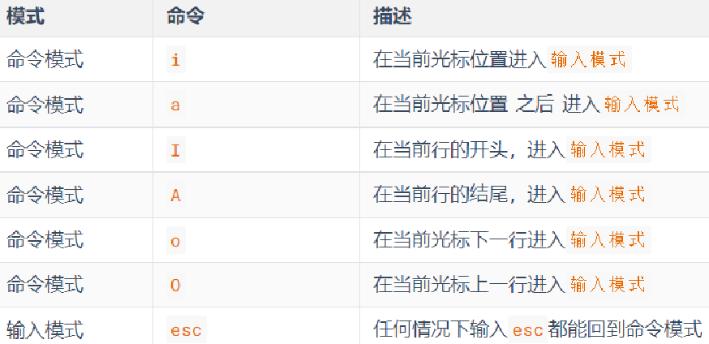
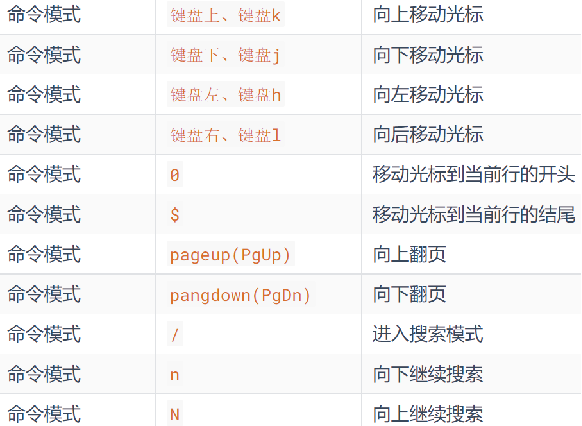
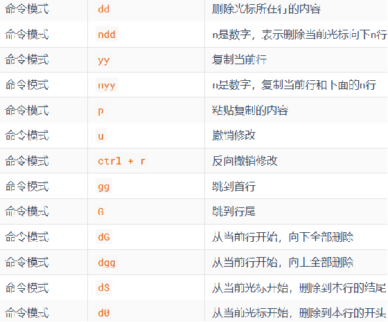
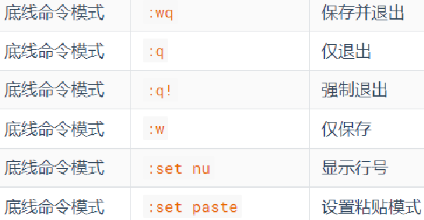
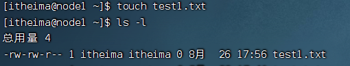
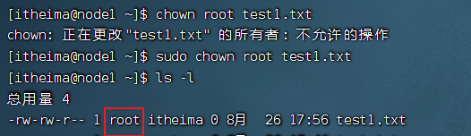
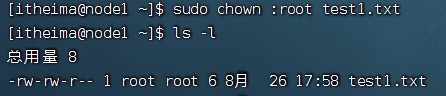

## 1、Linux 系统简介
- **创始人**：林纳斯·托瓦兹（Linus Torvalds），1991 年开发  
- **系统组成**：
  - **内核**：开源免费
  - **发行版**：系统级应用程序（如 Ubuntu、CentOS）


## 2、VMware 虚拟机使用
**核心步骤**

1. 安装 VMware 并导入 Linux 镜像
2. 使用 **FinalShell** 通过 SSH 连接虚拟机：
   - 解决 VMware 中鼠标操作、复制粘贴问题
   - 命令行操作更便捷


## 3、Linux 的使用

### 3.1 Linux基础命令

#### 3.1.1 目录结构

**根目录**：`/`（唯一顶级目录）


**绝对路径/相对路径：**

- **绝对路径**：以根目录为起点，描述路径的一种写法，路径描述以 / 开头
- **相对路径**：以当前目录为起点，描述路径的一种写法，路径描述无需以 / 开头


**特殊路径符：**

- .	表示当前目录，比如 `cd ./Desktop` 表示切换到当前目录下的Desktop目录内，和`cd Desktop`效果一致

- ..	表示上一级目录，比如：`cd ..`   即可切换到上一级目录，`cd ../..`  切换到上二级的目录

- ~	表示HOME目录，比如：`cd ~`    即可切换到HOME目录或`cd ~/Desktop`，切换到HOME内的Desktop目录（cd 也能直接回到home目录）


#### 3.1.2 命令通用格式

```shell
command [-options] [parameter]
```

- `command`：命令主体
- `-options`：可选参数，控制命令细节
- `parameter`：可选参数，指定操作目标


#### 3.1.3 文件/文件夹操作

| 命令    | 功能         | 常用选项                                                     | 示例                   |
| :------ | :----------- | :----------------------------------------------------------- | :--------------------- |
| `ls`    | 列出目录内容 | `-a`（显示隐藏文件：以.点号开头的）、`-l`（列表形式）、`-h`（易读文件大小，与`-l`搭配使用） | `ls -alh`              |
| `cd`    | 切换目录     | 支持特殊路径符（`.`、`..`、`~`）                             | `cd ~/Desktop`         |
| `pwd`   | 显示当前路径 | 无                                                           | `pwd`                  |
| `mkdir` | 创建目录     | `-p`（自动创建父目录）                                       | `mkdir -p dir1/dir2`   |
| `touch` | 创建文件     | 无                                                           | `touch file.txt`       |
| `cp`    | 复制文件/夹  | `-r`（复制文件夹）                                           | `cp -r src/ dest/`     |
| `mv`    | 移动/重命名  | 无                                                           | `mv old.txt new.txt`   |
| `rm`    | 删除文件/夹  | `-r`（删除文件夹）、`-f`（强制删除）                         | `rm -rf dir/`          |
| `find`  | 查找文件     | `-name`（按名称）、`-size`（按大小）                         | `find / -name "*.log"` |


**对应命令细节：**

**mkdir**  创建一个目录，命令格式：`mkdir  [-p]  linux路径`

- 参数**必填**，表示`Linux`路径，即要创建的文件夹的路径，相对路径或绝对路径均可
- `-p`选项可选，表示自动创建不存在的父目录，适用于创建连续多层级的目录。`mkdir -p 路径1/路径2`

**注意：**请确保操作均在HOME目录内，不要在HOME外操作，涉及到权限问题，HOME外无法成功。后续我们会讲解权限控制的知识。


**cp**  copy：用于复制文件\文件夹

- cp 源文件 目的地

- cp -r  复制文件夹的时候, 需要带-r的参数


**mv** move：可以用于移动文件\文件夹

- mv 源文件 要移动到的目的地路径。表示要移动去的地方，如果目标不存在，则进行改名，确保目标存在

- 可以通过mv来改名


**rm** remove：可用于删除文件、文件夹

- -r 删除文件夹的时候, 需要带-r的参数
- -f 强制删除（不会弹出提示确认信息），在`root`用户下谨慎使用
- rm命令支持通配符 *，用来做模糊匹配，示例：

​	test*，表示匹配任何以test开头的内容

​	*test，表示匹配任何以test结尾的内容

​	\*test\*，表示匹配任何包含test的内容


**find：用于查找指定的文件**

按文件名查找：支持通配符按文件大小查找

- 按文件名查找：`find 起始路径 -name "被查找的文件名"`（支持通配符）

- 按文件大小查找：`find 起始路径 -size +|- n[kMG]`

  - +、- 表示大于和小于
  - n表示大小数字
  - kMG表示大小单位，k(小写字母)表示kb，M表示MB，G表示GB


#### 3.1.4 文件内容操作

| 操作类别 | 命令/符号     | 用法说明                  | 示例                                              |
| -------- | ------------- | ------------------------- | ------------------------------------------------- |
| 查看内容 | `cat`         | 一次性显示全部内容        | `cat file.txt`                                    |
|          | `more`        | 分页显示内容              | `more file.txt`                                   |
|          | `tail`        | 显示末尾内容              | `tail file.txt`                                   |
|          | `tail -f`     | 实时监控文件末尾内容      | `tail -f /var/log/syslog`                         |
| 内容过滤 | `grep`        | 关键词过滤，`-n` 显示行号 | `grep -n "error" log.txt`                         |
|          | 管道符 `|`    | 组合多个命令              | `cat log.txt | grep "error"`                      |
|          |               |                           | `cat log.txt | grep "error" | grep -n "critical"` |
| 内容写入 | `echo`        | 输出内容                  | `echo "Hello Linux"`                              |
|          | 重定向符 `>`  | 覆盖写入文件              | `echo "Hello Linux" > output.txt`                 |
|          | 重定向符 `>>` | 追加内容到文件            | `echo "Hello Linux" >> output.txt`                |


**对应命令细节：**

**tail / tail -f** (了解)

语法：`tail [-f -num] linux路径`

- `tail 文件路径`：可以输出文件的末尾内容 默认显示10行

- `tail -3 文件路径`： 指定显示末尾的3行

- `tail -f 文件路径` ：持续监听文件末尾变化


**echo**命令：`echo 输出的内容`

- 使用echo命令在命令行内输出指定内容：`echo "hello itheima"`（带有空格或\等特殊符号，建议使用双引号包围）

- echo  \`pwd \` （被``包围的内容，会被作为命令执行，而非普通字符）


**文件内容过滤**

**grep** 关键词过滤：`grep  [-n] 关键字 文件路径`

- 会检索文件中包含关键词的行
- 选项-n，可选，表示在结果中显示匹配的行的行号。
- 参数，关键字，必填，表示过滤的关键字，带有空格或其它特殊符号，建议使用””将关键字包围起来
- 参数，文件路径，必填，表示要过滤内容的文件路径。


**管道符**

- **|**  管道符前面(左边)输出会作为管道符后面(右边)命令的输入

grep 和 管道符可以配合使用

```shell
cat test.txt | grep itcast | grep itheima
```


Linux命令的帮助和手册

- 命令 --help

- man 命令

- which：命令查找


### 3.2 vi/vim 编辑器

vi/vim最常见的应用场景 装完软件之后, 修改配置文件

**模式切换**

1. **命令模式**：默认模式，支持快捷键操作（在任何模式下，按ESC都能回到命令模式）
2. **输入模式**：按 `i`、`a`、`o` 进入编辑
3. **底线命令模式**：按 `:` 输入命令（如 `:wq` 保存退出）

**常用快捷键**

| 快捷键    | 功能     |
| :-------- | :------- |
| `dd`      | 删除整行 |
| `yy`      | 复制行   |
| `p`       | 粘贴     |
| `/关键词` | 搜索     |




- 在命令模式下还有其它快捷键

  

  

- **底线命令模式:** 命令模式内，输入: ，即可进入底线命令模式，支持如下命令

  


### 3.3 Linux用户和权限管理

#### 3.3.1 Linux用户体系

`Linux`的用户分成两类

- **root**：超级管理员（拥有全部权限）
- **普通用户**：默认仅家目录有权限


**用户管理**

```shell
useradd -m itheima  # 创建itheima用户，-m代表创建用户的主目录；
passwd itheima      # 为itheima用户指定密码(这里密码不能过于简单, 123ABCitcast)
```

创建了普通用户之后在/home路径下就会创建和普通用户用户名相同的文件夹

- itcast用户 它的家目录就是 /home/itcast
- 普通用户在自己的家目录下是有所有权限的，在其它普通用户的家目录下没有权限


- 在使用`Linux`的时候, 生产环境下不要直接使用`root`用户, 可以使用普通用户, 需要用到超级管理员权限的时候做临时申请 sudo

  

  

**visudo 给普通用户添加sudo权限**

切换到`root`用户，执行visudo命令，会自动通过vi编辑器打开：/etc/sudoers

在文件中找到 `# User privilege specification` 部分，找到以下行：

```shell
`root`    ALL=(ALL:ALL) ALL
```

在下面添加一行（将 `username` 替换为你的用户名）：

```shell
username ALL=(ALL:ALL) ALL
```

如果需要配置用户无需输入密码使用sudo功能，将以上代码修改为（将 `username` 替换为你的用户名）：

```sh
username ALL=(ALL) NOPASSWD: ALL
```

其中最后的`NOPASSWD: ALL` 表示使用sudo命令，无需输入密码。

保存并退出:

1. 如果使用 `visudo`，按 `Ctrl + X`，然后按 `Y` 确认保存，最后按 `Enter` 退出。
2. 如果语法正确，文件会保存；如果有错误，`visudo` 会提示你修复。


检验是否配置成功：

```shell
sudo apt update
```


#### 3.3.2 查看文件权限


#### 3.3.3 修改文件权限


**chmod 修改文件权限**

我们可以使用chmod命令，修改文件、文件夹的权限信息。**注意：只有文件、文件夹的所属用户或`root`用户可以修改。**

**语法**：`chmod [-R] 权限 文件或文件夹`。选项：`-R`，对文件夹内的全部内容应用同样的操作

```sh
chmod u=rwx,g=rx,o=x hello.txt  # 将文件权限修改为：rwxr-x--x。
```

u表示user所属用户权限，g表示group组权限，o表示other其它用户权限

```sh
chmod -R u=rwx,g=rx,o=x test  # 将文件夹test以及文件夹内全部内容权限设置为：rwxr-x--x
```

除此之外，还有快捷写法：`chmod 751 hello.txt`。将751每个数字转化为二进制（111，101，001）对应有哪些权限。

创建一个文件mkhaha 添加可执行的权限：chmod +x mkhaha


**chown 修改文件所有者**

通过`ls -l`指令，可以看到文件、文件夹的所有者/所有的用户组

> 普通用户没有权限修改文件的所有者/所有的用户组，想通过普通用户修改, 需要添加sudo权限（如上）

语法：`chown [-R] [用户][:][用户组] 文件或文件夹`

- 选项，-R，同chmod，对文件夹内全部内容应用相同规则

- 选项，用户，修改所属用户

- 选项，用户组，修改所属用户组

- : 用于分隔用户和用户组

  

在itheima这个用户的家目录下创建一个test1.txt文件

- 此时 test1.txt 用户是itheima 用户组 itheima



通过chown 修改test1.txt 文件的所有者

- 需要注意 当前用户itheima 不能执行chown。没有权限, 通过sudo 临时获取超级管理员权限, 修改所有者



- 虽然所有者从itheima 改成了`root` , 但是itheima对于当前test1.txt 属于同组用户, 权限看中间的 rw-
  - 此时依然可以查看并修改这个test1.txt


通过chown 修改test1.txt 文件的所属的用户组



此时 itheima 属于其它用户 只有读的权限,没有其它权限
